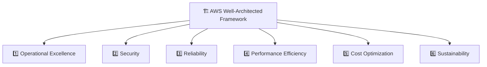
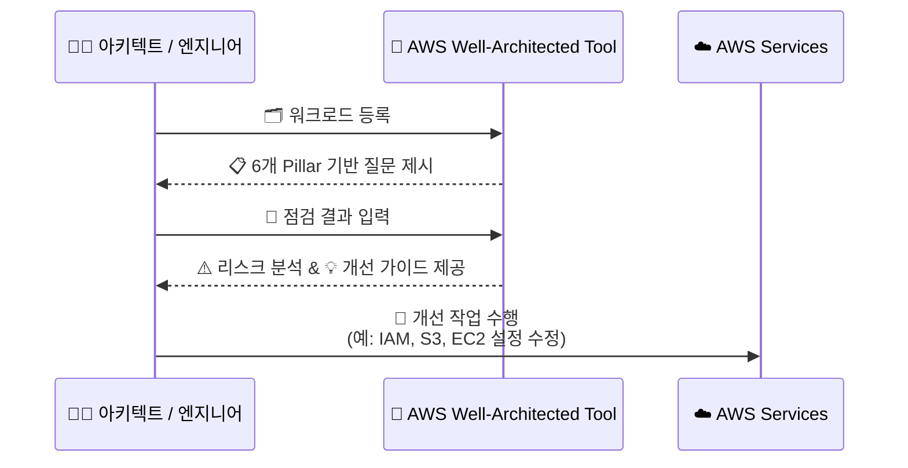
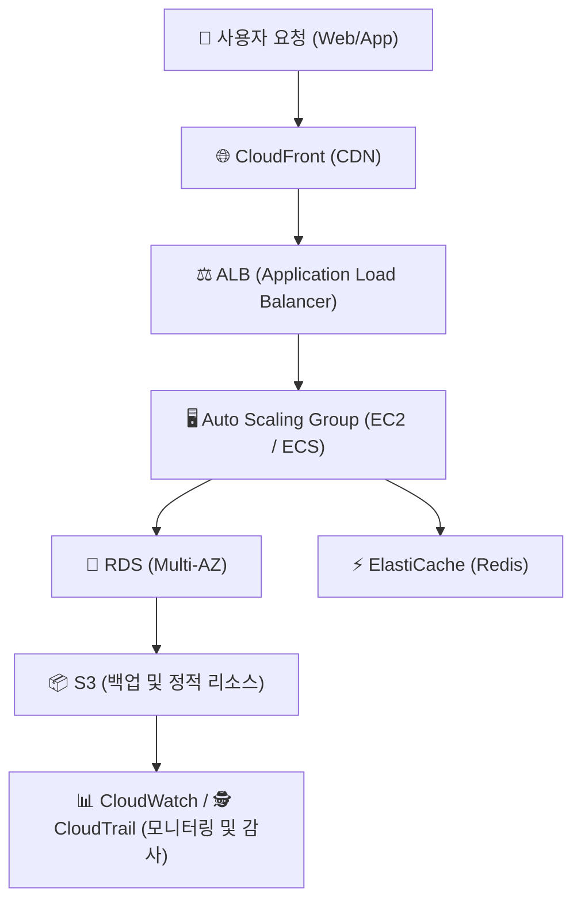

# 🏗️ AWS Well-Architected Framework 정리

---

## 1️⃣ AWS Well-Architected Framework란?

AWS Well-Architected Framework (WAF) 는
AWS 클라우드에서 안정적이고, 효율적이며, 보안성 높고, 비용 최적화된 아키텍처를 설계할 수 있도록
AWS가 제시하는 모범 설계 가이드라인(Best Practice Framework) 입니다.

👉 쉽게 말해,
“AWS에서 좋은 아키텍처란 무엇인가?”를 정의한 기준서 입니다.

---

## 2️⃣ AWS Well-Architected의 목적
| 목표                                      | 설명                         |
| --------------------------------------- | -------------------------- |
| 🧱 **표준화된 아키텍처 품질 확보**                  | 클라우드 설계 품질을 일정 수준 이상으로 유지  |
| 🔍 **리스크 식별 및 개선**                      | 보안, 비용, 운영 리스크를 사전에 점검     |
| 📈 **지속적인 개선 (Continuous Improvement)** | 워크로드를 주기적으로 평가하고 개선        |
| ☁️ **AWS Best Practice 정렬**             | AWS 서비스 설계 기준과 일관된 방향으로 운영 |

---

## 3️⃣ AWS Well-Architected 6가지 핵심 원칙 (Pillars)
| 원칙                                      | 핵심 질문                            | 주요 키워드                |
| --------------------------------------- | -------------------------------- | --------------------- |
| **1️⃣ Operational Excellence (운영 우수성)** | 시스템을 효율적으로 운영하고 개선하는가?           | 모니터링, 자동화, CI/CD      |
| **2️⃣ Security (보안)**                   | 데이터와 시스템이 안전하게 보호되는가?            | IAM, 암호화, 감사 로그       |
| **3️⃣ Reliability (신뢰성)**               | 장애 발생 시 복구 가능하고 지속적인 서비스를 제공하는가? | 백업, 복제, Auto Scaling  |
| **4️⃣ Performance Efficiency (성능 효율성)** | 워크로드가 적절한 리소스를 사용하고 있는가?         | Auto Scaling, 캐시, CDN |
| **5️⃣ Cost Optimization (비용 최적화)**      | 리소스를 낭비하지 않고 비용을 효율적으로 사용하고 있는가? | 프리티어, 예약 인스턴스, 모니터링   |
| **6️⃣ Sustainability (지속 가능성)**         | 환경적 영향을 최소화하고 자원 효율성을 높이는가?      | 탄소 절감, 서버리스, 리소스 효율화  |

---

## 4️⃣ Well-Architected Framework 구조 시각화

---

## 5️⃣ AWS Well-Architected Tool (WAT)

AWS 콘솔 내에서 제공되는 “Well-Architected Tool” 은
워크로드를 점검하고 개선할 수 있는 셀프 리뷰 도구입니다.

| 기능                 | 설명                                 |
| ------------------ | ---------------------------------- |
| ✅ **워크로드 등록**      | 각 시스템(서비스/앱)을 워크로드 단위로 등록          |
| 🧩 **질문 기반 평가**    | 6개 원칙에 따라 구성된 점검 항목(Questions)에 응답 |
| 📊 **리스크 레벨 분석**   | 하이/미디엄/로우 리스크 자동 분류                |
| 🔁 **개선 권장 사항 제공** | AWS의 베스트 프랙티스 기반 개선 가이드 제공         |

---

## 6️⃣ Well-Architected 적용 프로세스

---

## 7️⃣ 현업 적용 사례
| 산업                 | 활용 예시                                        |
| ------------------ | -------------------------------------------- |
| 🏦 **금융/공공기관**     | 보안(Security) & 신뢰성(Reliability) 점검 중심의 감사 보고 |
| 🏭 **제조/IoT**      | 데이터 파이프라인의 비용 최적화 및 성능 튜닝                    |
| 🧠 **스타트업**        | 초기 인프라 설계 품질 검증 및 운영 효율성 향상                  |
| 🧩 **MSP(운영 대행사)** | 고객 시스템 아키텍처 점검 및 개선 컨설팅 시 사용                 |

---

## 8️⃣ 예시: Well-Architected 기반 설계 패턴

✅ 이 아키텍처는

Reliability (다중 AZ 구조)

Performance Efficiency (캐싱 & CDN)

Security (CloudTrail & IAM)

Cost Optimization (Auto Scaling)
을 모두 반영한 대표적인 AWS Well-Architected 설계입니다.

---

## ✅ 정리

AWS Well-Architected Framework = 클라우드 설계의 품질 기준서

6대 원칙: 운영 우수성, 보안, 신뢰성, 성능 효율성, 비용 최적화, 지속 가능성

도구: AWS Well-Architected Tool (콘솔 기반 점검 툴)

현업 활용: 리스크 식별, 아키텍처 검토, 개선 가이드라인 제공

👉 한마디로,
“AWS Well-Architected는 클라우드 설계를 건강검진해주는 표준 가이드라인” 입니다.
