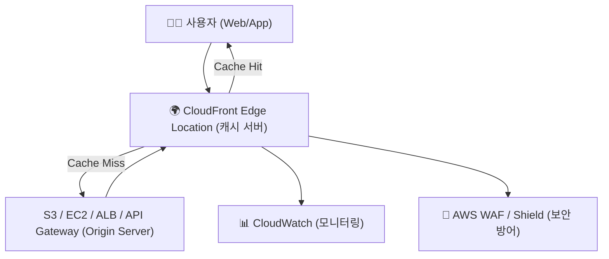
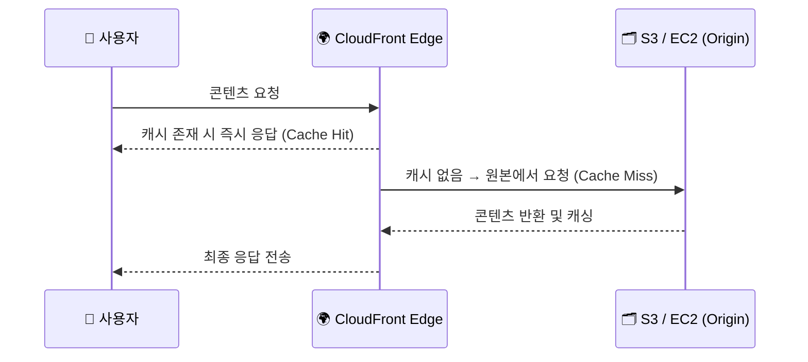
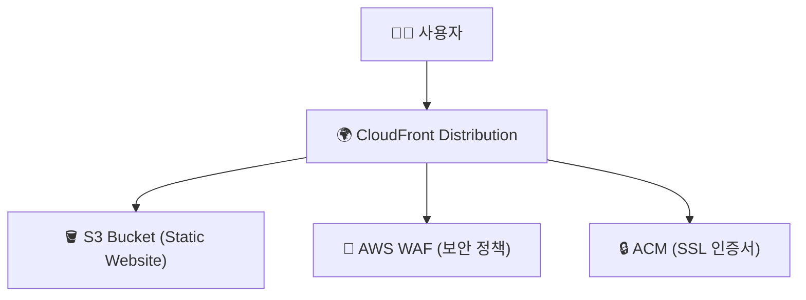

# 🌍 Amazon CloudFront 정리

---

## 1️⃣ Amazon CloudFront란?

Amazon CloudFront는
AWS에서 제공하는 글로벌 콘텐츠 전송 네트워크(CDN, Content Delivery Network) 서비스입니다.

👉 쉽게 말해,
“전 세계 사용자에게 웹사이트·영상·이미지를 빠르고 안전하게 전달하는 서비스” 입니다.

CloudFront는 AWS의 전 세계 엣지 로케이션(Edge Location) 에 콘텐츠를 캐싱하여
사용자와 가장 가까운 지점에서 데이터를 전송하므로, 지연 시간(latency) 을 최소화하고 성능을 극대화합니다.

---

## 2️⃣ 주요 특징
| 특징                         | 설명                                     |
| -------------------------- | -------------------------------------- |
| ⚡ **저지연 전송 (Low Latency)** | 사용자와 가까운 엣지 서버에서 콘텐츠 제공                |
| 🧱 **글로벌 네트워크**            | 100개국 이상, 수백 개의 Edge Location 운영       |
| 🔒 **보안 강화**               | AWS WAF, Shield, ACM과 연동 (DDoS·SSL 보호) |
| 💾 **캐싱 (Caching)**        | 정적/동적 콘텐츠를 엣지 서버에 저장해 성능 향상            |
| 📦 **통합 관리**               | S3, EC2, ALB, API Gateway 등과 직접 통합 가능  |
| 💰 **비용 효율성**              | 사용량 기반 과금 (전송량·요청 수 기준)                |

---

## 3️⃣ CloudFront 아키텍처 시각화

🧠 설명:

Cache Hit: 엣지 서버에 캐싱된 데이터 즉시 전달 (빠름)

Cache Miss: 원본 서버(Origin)에서 가져와 캐시에 저장 후 전달

AWS 보안 서비스와 통합되어 성능 + 보안 + 가용성 동시 확보

---

## 4️⃣ 주요 구성 요소
| 구성 요소                           | 설명                              |
| ------------------------------- | ------------------------------- |
| **Origin (오리진)**                | 원본 콘텐츠가 저장된 서버 (S3, EC2, ALB 등) |
| **Edge Location**               | 사용자 근처에 위치한 CloudFront 캐시 서버    |
| **Distribution**                | CloudFront 설정 단위 (배포 구성을 정의)    |
| **Behavior**                    | 어떤 요청을 어떤 오리진으로 라우팅할지 규칙 설정     |
| **OAC (Origin Access Control)** | S3 접근을 CloudFront만 허용하도록 제어     |
| **TTL (Time to Live)**          | 캐싱된 콘텐츠의 만료 시간                  |

---

## 5️⃣ CloudFront 동작 과정

---

## 6️⃣ 주요 통합 서비스
| 서비스                               | 역할                                           |
| --------------------------------- | -------------------------------------------- |
| **S3**                            | 정적 웹사이트 호스팅 및 콘텐츠 원본 저장소                     |
| **ALB / EC2**                     | 동적 콘텐츠 전달용 백엔드 서버                            |
| **AWS WAF**                       | 웹 공격 차단 (SQL Injection, XSS 등)               |
| **AWS Shield**                    | DDoS 공격 방어                                   |
| **ACM (AWS Certificate Manager)** | SSL/TLS 인증서 자동 관리                            |
| **Lambda@Edge**                   | 엣지 서버에서 사용자 요청/응답 실시간 처리 (Header 조작, 리디렉션 등) |

---

## 7️⃣ CloudFront 캐싱 전략 요약
| 전략                      | 설명                                    |
| ----------------------- | ------------------------------------- |
| **TTL (Cache-Control)** | 콘텐츠 만료 시간 설정                          |
| **Cache Invalidation**  | 캐시 삭제 요청 (업데이트 시)                     |
| **Versioned URL**       | 파일 버전 관리 (`style_v2.css`)로 캐시 무효화 최소화 |
| **Compression & GZIP**  | 전송량 감소 및 응답속도 향상                      |

---

## 8️⃣ 현업 활용 사례
| 산업                   | 활용 예시                            |
| -------------------- | -------------------------------- |
| 🛒 **이커머스**          | 정적 이미지·CSS·JS 캐싱 → 웹사이트 로딩 속도 개선 |
| 🎥 **미디어 스트리밍**      | HLS/DASH 기반 동영상 콘텐츠 전송           |
| 🏢 **기업 포털 / SaaS**  | 글로벌 사용자에게 빠른 응답 제공               |
| 🧠 **AI/데이터 분석 서비스** | Lambda@Edge로 사용자별 맞춤 데이터 처리      |
| 🏦 **금융 / 공공기관**     | WAF·Shield와 통합하여 안전한 대외 서비스 운영   |

---

## 9️⃣ S3 + CloudFront 정적 웹사이트 배포 

🧱 설명:

S3에 정적 웹사이트 파일 업로드

CloudFront로 전 세계 배포

HTTPS 인증서(ACM) + WAF로 보안 강화

---

## ✅ 정리

Amazon CloudFront = 글로벌 콘텐츠 전송 네트워크 (CDN)

주요 역할: 콘텐츠 캐싱, 트래픽 가속, 보안 강화

통합 서비스: S3, ALB, API Gateway, WAF, Shield, Lambda@Edge

현업 활용: 정적 웹사이트, 스트리밍, 글로벌 SaaS, 보안 강화형 배포

👉 한마디로,
“CloudFront는 전 세계 사용자에게 빠르고 안전하게 콘텐츠를 배포하는 AWS의 글로벌 CDN 서비스” 입니다.
