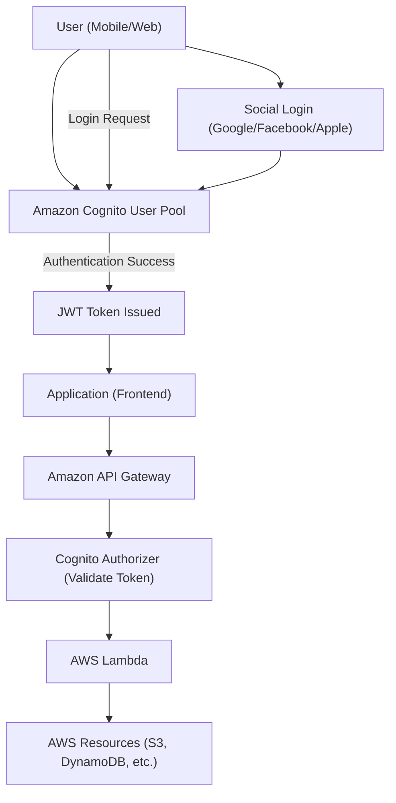

# 👤 Amazon Cognito 정리

## 1️⃣ Amazon Cognito란?

**Amazon Cognito**는 AWS에서 제공하는 **인증(Authentication) & 권한 관리(Authorization) 서비스**입니다.  
웹/모바일 애플리케이션에 **로그인 기능을 쉽게 구현**할 수 있도록 도와줍니다.

👉 쉽게 말해,  
**“앱에 로그인·회원가입·소셜 로그인 기능을 빠르게 붙여주는 서비스”** 입니다.

---

## 2️⃣ 주요 기능

- 🔑 **사용자 풀(User Pools)**
    
    - 사용자 계정을 관리 (회원가입, 로그인, MFA, 비밀번호 정책 등)
        
- 🛡️ **연합 인증(Federated Identity)**
    
    - Google, Facebook, Apple, Amazon 같은 소셜 로그인 지원
        
    - SAML, OpenID Connect(OIDC) 연동 가능
        
- 🎟️ **임시 AWS 자격 증명 발급**
    
    - 로그인한 사용자에게 S3, DynamoDB 등 AWS 리소스 접근 권한 부여 가능
        
- 📱 **멀티 플랫폼 지원**
    
    - iOS, Android, Web SDK 제공 → 앱에 바로 적용 가능
        

---

## 3️⃣ 아키텍처 시각화

---

## 4️⃣ 특징

- 회원 관리 기능 내장 (회원가입, 로그인, 비밀번호 재설정)
    
- 소셜 로그인 및 기업용 IdP와 통합 가능
    
- MFA(다중 인증), 비밀번호 정책 지원
    
- 보안 토큰 기반 인증 (JWT, OAuth 2.0, SAML)
    
- 서버리스 아키텍처와 쉽게 연동
    

---

## 5️⃣ 현업 활용 사례

- 📱 **모바일 앱 로그인** → 소셜 로그인 + 자체 회원 가입 혼합 사용
    
- 🛒 **이커머스 웹사이트** → Cognito User Pool로 고객 계정 관리
    
- 🏢 **기업 내부 시스템** → SAML 기반 사내 IdP와 통합해 사원 인증
    
- ☁️ **서버리스 백엔드** → API Gateway + Lambda와 연동하여 인증 처리
    

---

## ✅ 정리

- **Amazon Cognito = AWS의 인증·인가 서비스**
    
- 사용자 풀(User Pools) + 연합 인증(Federated Identity)
    
- AWS 리소스 접근용 임시 자격 증명 발급 가능
    
- 현업에서는 **앱 로그인, 소셜 로그인, 기업 인증 통합**에 활용
    

👉 한마디로, **“AWS 기반 앱의 로그인 담당 서비스”** 입니다.
