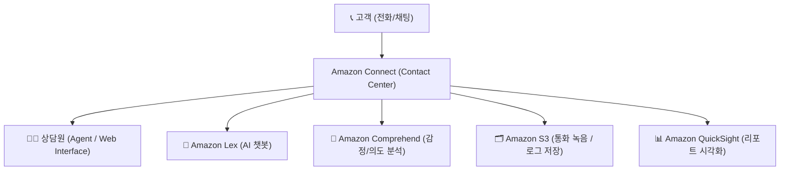
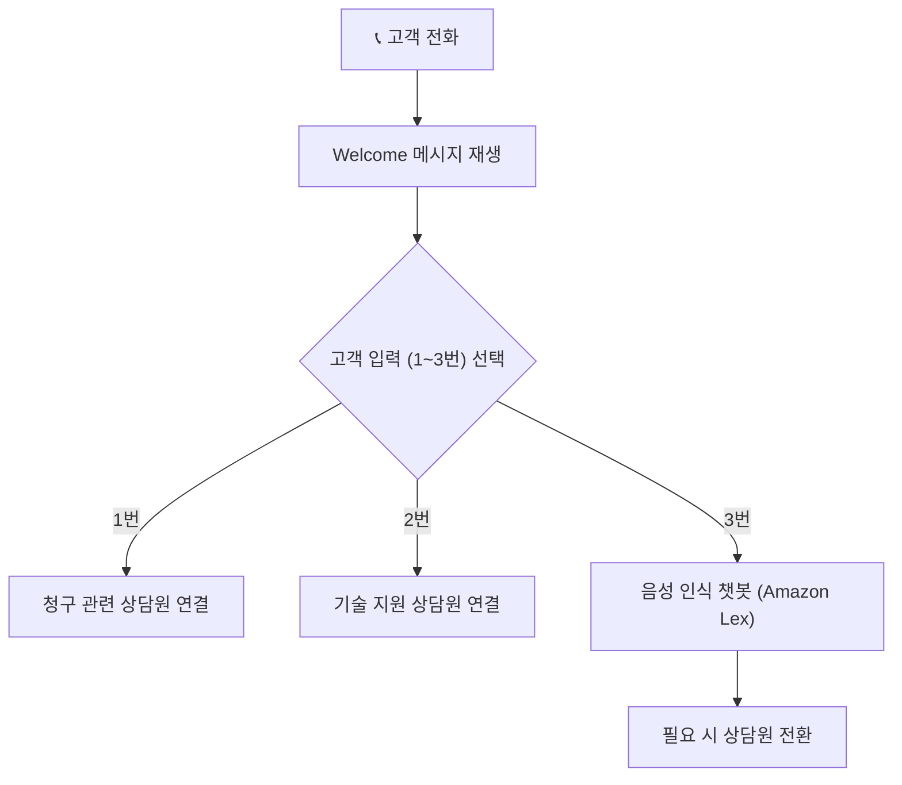
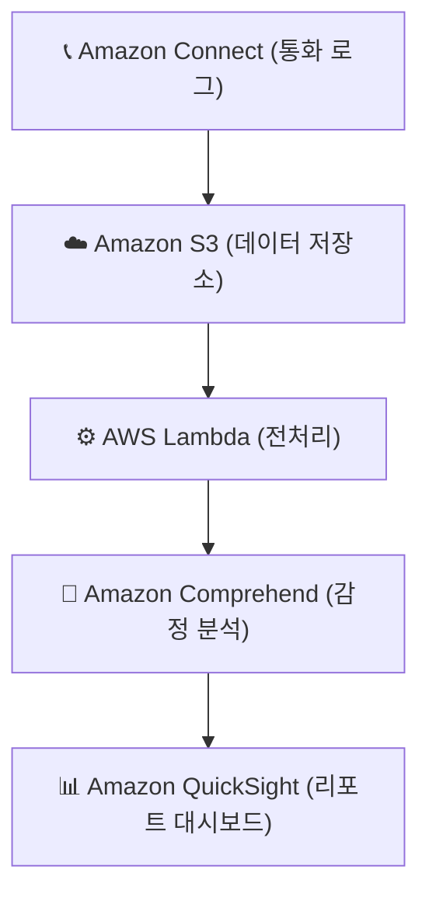

# ☎️ Amazon Connect 정리

---

## 1️⃣ Amazon Connect란?

Amazon Connect는
AWS에서 제공하는 클라우드 기반 컨택센터(Contact Center) 서비스입니다.

👉 쉽게 말해,
“콜센터를 AWS 클라우드에서 바로 구축·운영할 수 있는 서비스” 입니다.

전화 시스템(IVR), 채팅, 고객 상담 이력 관리, AI 챗봇 등
기존 온프레미스 콜센터 인프라 없이 웹 브라우저만으로 구축 가능합니다.

---

## 2️⃣ 주요 특징
| 기능                                    | 설명                                     |
| ------------------------------------- | -------------------------------------- |
| ☁️ **클라우드 기반 콜센터**                    | 서버 설치 없이 웹 환경에서 바로 컨택센터 개설             |
| 📞 **다중 채널 지원**                       | 음성 통화, 실시간 채팅, 이메일, 메시징 통합 지원          |
| 🧠 **AI 통합 (Lex, Polly, Comprehend)** | 음성 인식, 챗봇, 감정 분석 기능 내장                 |
| 🔄 **자동 라우팅 (Routing)**               | 고객 문의 유형에 따라 상담원 자동 연결                 |
| 🔍 **실시간 모니터링 & 분석**                  | 상담 통계, 대기 시간, 고객 만족도 분석                |
| 💰 **사용량 기반 요금제 (Pay-as-you-go)**     | 사용한 통화 시간/상담 세션만큼만 과금                  |
| 🔒 **보안 및 통합 관리**                     | IAM, KMS, CloudWatch, CloudTrail 완전 연동 |

---

## 3️⃣ 아키텍처 시각화

🧠 설명:

고객이 전화 또는 웹 채팅을 시작하면 Amazon Connect가 요청을 수신

IVR(음성 응답) 또는 AI 챗봇(Lex)으로 초기 응대

적절한 상담원에게 자동 연결 (Routing Profile 기반)

대화 내용은 S3에 녹음/저장되고, 분석은 Comprehend와 QuickSight로 시각화

---

## 4️⃣ 주요 구성 요소
| 구성 요소               | 설명                                        |
| ------------------- | ----------------------------------------- |
| **Contact Flow**    | 고객 응대 흐름(IVR) 설계 도구 (드래그 앤 드롭 방식)         |
| **Routing Profile** | 고객 유형·우선순위에 따른 상담원 연결 정책                  |
| **Queue**           | 고객 대기열 관리 및 대기 시간 제어                      |
| **Agent Workspace** | 상담원이 사용하는 웹 인터페이스 (콜 수신/채팅/고객정보 조회)       |
| **Contact Lens**    | 통화 녹취 분석 서비스 (음성 → 텍스트 변환, 감정 분석)         |
| **Integration**     | S3, Lambda, DynamoDB, QuickSight 등과 연동 가능 |

---

## 5️⃣ Amazon Connect Contact Flow 

🧠 설명:

Amazon Connect에서는 Flow Builder로
콜센터 흐름(음성 안내, 메뉴 선택, 상담 연결)을 GUI 방식으로 설계할 수 있습니다.

---

## 6️⃣ AI 서비스 통합
| 서비스                      | 역할                                |
| ------------------------ | --------------------------------- |
| 🤖 **Amazon Lex**        | 자연어 처리 기반 챗봇, 고객의 질문 자동 이해        |
| 🧠 **Amazon Comprehend** | 대화 중 감정 분석 및 의도 파악                |
| 🔊 **Amazon Polly**      | 자연스러운 음성 안내 (TTS: Text-to-Speech) |
| 🔍 **Contact Lens**      | 통화 내용 텍스트 변환 + 감정 분석 + 키워드 추출     |

---

## 7️⃣ 현업 활용 사례
| 산업             | 활용 예시                       |
| -------------- | --------------------------- |
| 🏦 **금융기관**    | IVR + AI 챗봇을 통한 대출 문의 자동 응답 |
| 🏥 **의료기관**    | 병원 예약 시스템 자동화 및 상담원 연결      |
| 🏢 **기업 고객센터** | 클라우드 기반 상담센터 구축 (재택 상담 가능)  |
| 🧠 **교육 기관**   | 등록 문의 및 챗봇 상담 기능 구축         |
| 🛒 **이커머스**    | 주문/배송 문의 자동화, 불만 접수 자동 분류   |

---

## 8️⃣ 통합 분석 및 리포팅 

📊 활용 예시:

고객의 감정(긍정/부정/중립) 분석

상담원별 평균 통화 시간, 대기 시간 리포트

AI 기반 만족도 예측

---

## ✅ 정리

Amazon Connect = 클라우드 기반 컨택센터 서비스

주요 특징:

음성/채팅 통합, AI 챗봇, 감정 분석, 자동 라우팅

완전관리형:

서버·PBX·CTI 시스템 불필요, 웹 기반 운영

연동 서비스:

Lex (챗봇), Polly (음성), Comprehend (분석), QuickSight (리포트)

현업 활용:

고객 상담 자동화, 콜센터 운영 효율화, 고객 경험 개선

👉 한마디로,
“Amazon Connect는 AI와 음성 분석을 결합한 클라우드 콜센터 솔루션” 입니다.
