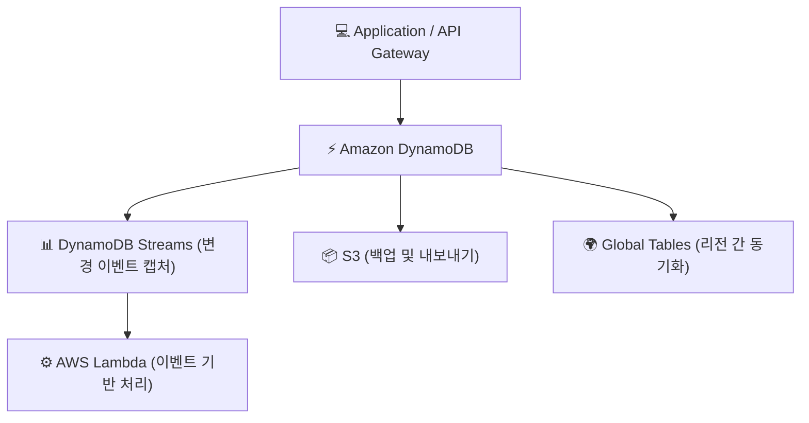
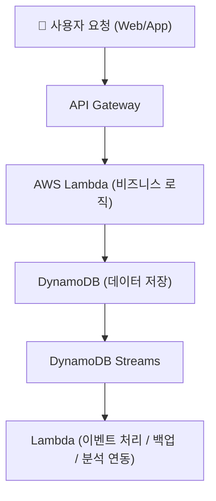

# ⚡ Amazon DynamoDB 정리

---

## 1️⃣ Amazon DynamoDB란?

Amazon DynamoDB는
AWS에서 제공하는 완전관리형 NoSQL 데이터베이스 서비스입니다.

👉 쉽게 말해,
“RDS는 관계형(표 구조) 데이터베이스, DynamoDB는 빠르고 유연한 비관계형(키-값) 데이터베이스” 입니다.

## 2️⃣ 주요 특징

---

| 특징                             | 설명                              |
| ------------------------------ | ------------------------------- |
| ☁️ **완전관리형**                   | 서버 운영, 스케일링, 백업 등 모두 AWS가 자동 관리 |
| ⚡ **고성능 / 저지연**                | 밀리초 단위 응답 속도, SSD 기반 고성능        |
| 📈 **자동 확장성 (Auto Scaling)**   | 트래픽 증가 시 자동으로 처리량 확장            |
| 💾 **무한 확장 테이블**               | 데이터 용량에 제한 없음                   |
| 🔄 **멀티 리전 복제 (Global Table)** | 여러 리전에 데이터 자동 복제                |
| 🧱 **서버리스 아키텍처**               | 인프라 관리 불필요, 사용량 기반 과금           |
| 🛡 **보안 / 백업 / 암호화 내장**        | KMS, IAM, CloudWatch 통합         |

---

## 3️⃣ 데이터 모델 구조

| 구성 요소           | 설명                                              |
| --------------- | ----------------------------------------------- |
| **Table**       | 데이터가 저장되는 기본 단위                                 |
| **Item**        | 한 줄(Row)에 해당하는 데이터                              |
| **Attribute**   | Item 내의 필드(Column)                              |
| **Primary Key** | 데이터를 식별하는 고유 키 (Partition Key + Sort Key 조합 가능) |
| **Index**       | 검색 성능 향상을 위한 보조 인덱스 (GSI, LSI)                  |

---

## 4️⃣ 아키텍처 시각화

---

---

## 5️⃣ 주요 기능
| 기능                             | 설명                                             |
| ------------------------------ | ---------------------------------------------- |
| **On-Demand / Provisioned 모드** | 트래픽 예측 불가 시 On-Demand, 고정 트래픽이면 Provisioned 선택 |
| **DynamoDB Streams**           | 테이블 데이터 변경 시 실시간 이벤트 감지 가능 (Lambda 트리거용)       |
| **Global Tables**              | 여러 리전에 걸쳐 데이터 자동 동기화                           |
| **Time to Live (TTL)**         | 일정 시간이 지나면 자동으로 데이터 삭제                         |
| **Backup & Restore**           | 전체 테이블 백업/복구 기능 제공                             |
| **DAX (DynamoDB Accelerator)** | 인메모리 캐시 서비스로 지연 시간 최소화                         |

---

## 6️⃣ DynamoDB vs RDS 비교
| 항목         | **DynamoDB (NoSQL)**   | **RDS (SQL)**    |
| ---------- | ---------------------- | ---------------- |
| **데이터 모델** | Key-Value, 문서형         | 테이블, 행, 열 구조     |
| **스키마**    | 자유로운 구조 (스키마리스)        | 고정된 스키마          |
| **확장성**    | 수평 확장 (Auto Scaling)   | 수직 확장 중심         |
| **쿼리 방식**  | Key 기반 조회 (빠름)         | SQL 문법 기반        |
| **트랜잭션**   | 제한적 (단일 테이블 중심)        | 복잡한 트랜잭션 가능      |
| **사용 예시**  | IoT, 로그, 실시간 채팅, 세션 관리 | ERP, 회계, 주문 DB 등 |

---

## 7️⃣ 현업 활용 사례
| 산업                  | 활용 예시                                                |
| ------------------- | ---------------------------------------------------- |
| 🏭 **IoT / 제조**     | 센서 데이터 실시간 저장 및 조회                                   |
| 🛒 **이커머스 / 게임**    | 사용자 세션, 장바구니, 순위 데이터 관리                              |
| 💬 **메신저 / 채팅**     | 빠른 읽기/쓰기 기반의 대화 로그 저장                                |
| 📊 **데이터 분석 파이프라인** | DynamoDB Streams → Lambda → S3 ETL 파이프라인 구성          |
| 🧠 **서버리스 백엔드**     | API Gateway + Lambda + DynamoDB 조합으로 완전 서버리스 아키텍처 구성 |

---

## 8️⃣ 서버리스 애플리케이션 아키텍처 예시

🧠 설명:

사용자가 앱에서 API 호출 → Lambda → DynamoDB에 데이터 저장

DynamoDB Streams를 통해 데이터 변경 이벤트 자동 트리거

---

## ✅ 정리

Amazon DynamoDB = 완전관리형 NoSQL 데이터베이스

장점: 서버리스, 자동 확장, 고성능, 저지연, 무제한 확장성

구성 요소: Table, Item, Attribute, Index

현업 활용: IoT, 로그 저장, 세션 관리, 실시간 애플리케이션, 서버리스 백엔드

👉 한마디로,
“DynamoDB는 서버 관리가 필요 없는 초고속 NoSQL 데이터베이스” 입니다.
