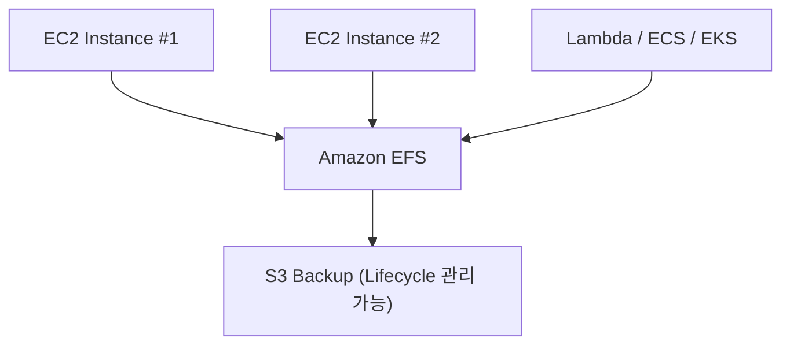

# 📁 Amazon EFS (Elastic File System) 정리

---

## 1️⃣ Amazon EFS란?

Amazon EFS (Elastic File System) 는
AWS에서 제공하는 완전관리형 네트워크 파일 스토리지(NAS) 서비스입니다.

👉 쉽게 말해,
“여러 EC2 인스턴스에서 동시에 접근할 수 있는 공유 폴더” 입니다.

---

## 2️⃣ 주요 특징
| 특징                           | 설명                                    |
| ---------------------------- | ------------------------------------- |
| ☁️ **완전관리형 서비스**             | 파일 서버 구축·운영 불필요 (AWS가 자동 관리)          |
| 📂 **공유 스토리지**               | 여러 EC2 인스턴스가 동시에 접근 가능 (Linux NFS 방식) |
| 📈 **자동 확장(Elastic)**        | 저장 용량이 자동으로 확장/축소됨                    |
| 🛡 **고가용성 & 내구성**            | 리전 내 여러 AZ에 자동 복제                     |
| 💰 **종량제 과금(Pay-as-you-go)** | 저장한 데이터 용량만큼만 비용 부과                   |
| 🔒 **보안 통합**                 | IAM, Security Group, KMS 암호화 지원       |

---

## 3️⃣ 아키텍처 시각화

🧠 설명:
EFS는 여러 EC2, Lambda, ECS 등에서 동시에 연결되어 파일 데이터를 공유할 수 있으며,
파일 서버를 직접 구축하지 않아도 됩니다.

---

## 4️⃣ EBS / EFS / S3 비교
| 구분        | **EBS**        | **EFS**          | **S3**      |
| --------- | -------------- | ---------------- | ----------- |
| **형태**    | 블록 스토리지        | 파일 스토리지          | 객체 스토리지     |
| **접근 방식** | 1개의 EC2에만 연결   | 여러 EC2에서 동시 접근   | 웹/API 기반 접근 |
| **확장성**   | 수동 확장          | 자동 확장            | 무한 확장       |
| **프로토콜**  | 블록 (ext4, XFS) | NFS              | HTTPS / SDK |
| **사용 예시** | 데이터베이스, OS 디스크 | 애플리케이션 로그, 공유 폴더 | 백업, 이미지 저장소 |

---

5️⃣ 현업 활용 사례

### 🧩 웹 애플리케이션 공유 스토리지

여러 EC2 인스턴스가 동일한 코드나 이미지 파일을 공유

### 🧠 머신러닝 학습 데이터 저장소

EFS에 대규모 학습 데이터 저장 → SageMaker/Lambda에서 접근

### 🧾 로그 수집 및 분석

여러 서버의 로그를 한 곳(EFS)에 모아 분석

### 🧰 ECS / EKS 컨테이너 공유 파일시스템

컨테이너 간 공용 데이터 저장

---

## 6️⃣ 주요 사용 시 고려 사항
| 항목         | 설명                                                    |
| ---------- | ----------------------------------------------------- |
| **성능 모드**  | General Purpose / Max I/O 선택 가능                       |
| **스루풋 모드** | Bursting / Provisioned                                |
| **마운트 방식** | NFS v4.1 (Linux 기반)                                   |
| **백업**     | AWS Backup 또는 Lifecycle 정책으로 S3에 저장 가능                |
| **비용 최적화** | 자주 쓰지 않는 데이터는 “EFS Infrequent Access (EFS-IA)”로 자동 이동 |

---

## ✅ 정리

Amazon EFS = 완전관리형 공유 파일 스토리지 서비스

여러 EC2, Lambda, ECS 등에서 동시에 접근 가능

자동 확장 + 다중 AZ 복제 + 높은 내구성 제공

현업 활용: 공유 코드 저장소, 로그 분석, 머신러닝 데이터 저장, 컨테이너 파일 공유

👉 한마디로,
“AWS에서 클릭 몇 번으로 구축하는 고가용성 네트워크 파일 서버 (NAS)” 입니다.
