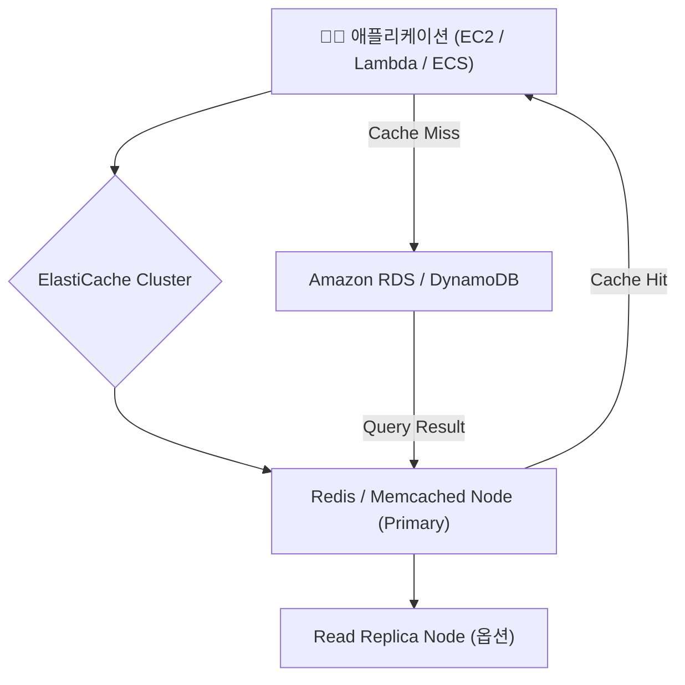

# ⚡ Amazon ElastiCache 정리

---

## 1️⃣ Amazon ElastiCache란?

Amazon ElastiCache는
AWS에서 제공하는 인메모리(In-memory) 캐싱 서비스로,
자주 조회되는 데이터를 메모리에 저장해 데이터베이스 부하를 줄이고 애플리케이션 속도를 높여주는 서비스입니다.

👉 쉽게 말해,
“매번 DB에 접근하지 않고, 빠른 캐시(임시 저장소)에서 바로 데이터를 꺼내 쓰는 서비스” 입니다.

---

## 2️⃣ 주요 특징
| 특징                   | 설명                                      |
| -------------------- | --------------------------------------- |
| ⚡ **초저지연 응답 속도**     | 밀리초보다 빠른 마이크로초 단위 응답                    |
| 🧠 **인메모리 저장 구조**    | 데이터가 디스크가 아닌 메모리에 저장되어 고속 처리 가능         |
| 🔄 **자동 장애 복구**      | Primary 장애 시 Standby로 자동 전환 (Multi-AZ)  |
| 📈 **확장성 (Scaling)** | 읽기 전용 노드(Read Replica) 추가로 확장 가능        |
| 🔒 **보안 통합**         | VPC, IAM, Security Group, KMS 암호화 통합 지원 |
| ☁️ **완전관리형**         | 서버 프로비저닝, 패치, 장애 복구를 AWS가 자동 관리         |

---

## 3️⃣ 지원 엔진
| 엔진            | 특징                            | 주요 사용 사례                   |
| ------------- | ----------------------------- | -------------------------- |
| **Redis**     | 키-값 기반 데이터 저장, 복제/영속화/클러스터 지원 | 세션 캐시, 실시간 랭킹, Pub/Sub 시스템 |
| **Memcached** | 단순 캐싱 전용, 분산 구조               | 단순 쿼리 캐시, 페이지 캐싱           |

---

## 4️⃣ 아키텍처 시각화

🧠 설명:

“Cache Hit” → 이미 캐시에 데이터가 있어 DB 접근 없이 즉시 응답

“Cache Miss” → 캐시에 없을 때만 DB에서 읽어와 캐시에 저장

---

## 5️⃣ 주요 용어 정리
| 용어                     | 설명                                   |
| ---------------------- | ------------------------------------ |
| **Cache Hit**          | 요청한 데이터가 캐시에 존재함 → 빠른 응답             |
| **Cache Miss**         | 캐시에 없음 → DB에서 조회 후 캐시에 저장            |
| **TTL (Time To Live)** | 캐시 데이터의 유효 기간 (만료 시 자동 삭제)           |
| **Replication**        | Primary 데이터 복제 → 고가용성 유지             |
| **Cluster Mode**       | 데이터를 여러 샤드(Shard)에 분산 저장하여 대규모 확장 지원 |

---

## 6️⃣ ElastiCache 주요 활용 사례
| 시나리오                        | 설명                                   |
| --------------------------- | ------------------------------------ |
| ⚡ **웹 애플리케이션 가속화**          | DB 쿼리 결과를 캐시에 저장 → 응답속도 향상           |
| 🧠 **세션 관리(Session Store)** | 사용자 로그인 세션 정보를 Redis에 저장             |
| 🕹️ **실시간 순위 / 게임 리더보드**    | Redis 정렬된 집합(Sorted Set)으로 순위 관리     |
| 💬 **실시간 채팅 / Pub-Sub 시스템** | Redis의 Pub/Sub 기능을 이용해 메시지 브로커 역할 수행 |
| 📊 **데이터 분석 임시 저장소**        | ETL 처리 중간 결과를 메모리에 저장해 빠른 재사용 가능     |

---

## 7️⃣ Redis vs Memcached 비교
| 항목                    | **Redis**                                | **Memcached**   |
| --------------------- | ---------------------------------------- | --------------- |
| **데이터 구조**            | String, List, Set, Hash, Sorted Set 등 다양 | Key-Value 단순 구조 |
| **Persistence (영속성)** | 지원 (RDB, AOF)                            | 미지원             |
| **복제/클러스터링**          | 지원                                       | 부분 지원           |
| **Pub/Sub 기능**        | 지원                                       | 미지원             |
| **사용 사례**             | 세션 관리, 순위, 실시간 분석                        | 간단한 캐싱 전용       |
| **운영 복잡도**            | 다소 높음                                    | 단순              |

---

## 8️⃣ 현업 활용 사례

### 🏢 대형 쇼핑몰

인기상품 조회, 세션 데이터, 추천 결과를 Redis 캐시로 관리

### 🏦 금융 시스템

잦은 잔액 조회·계좌 인증 요청을 캐시로 가속화

### 🎮 게임 서비스

실시간 순위(Leaderboard)와 랭킹 시스템 Redis로 구현

### 💬 메시징 / 채팅 시스템

Pub/Sub 기능으로 실시간 메시지 브로커 역할 수행

---

## ✅ 정리

Amazon ElastiCache = 완전관리형 인메모리 캐시 서비스

지원 엔진: Redis / Memcached

장점: 초고속 응답, 고가용성, 확장성, 서버 관리 불필요

현업 활용: 세션 관리, 순위 시스템, 쿼리 캐싱, 실시간 데이터 처리

👉 한마디로,
“ElastiCache는 DB 부하를 줄이고 속도를 극대화하는 AWS의 메모리 가속기” 입니다.
