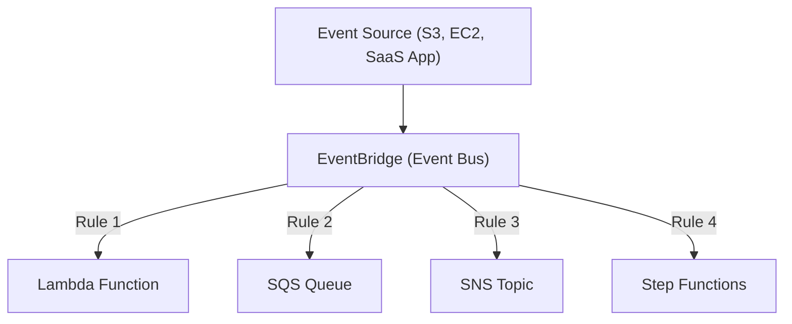

# 🔔 Amazon EventBridge 정리

---

## 1️⃣ Amazon EventBridge란?

Amazon EventBridge는
애플리케이션, AWS 서비스, SaaS 애플리케이션에서 발생하는 이벤트를 수집하고 라우팅하는 서버리스 이벤트 버스(Event Bus) 서비스입니다.

👉 쉽게 말해,
“AWS의 이벤트 중심 알림·자동화 중계 시스템” 이라고 할 수 있습니다.

---

## 2️⃣ 주요 기능

### 📡 이벤트 소스(Event Source)

AWS 서비스 (S3, EC2, DynamoDB 등)

사용자 정의 애플리케이션

SaaS 애플리케이션 (Zendesk, Datadog, Auth0 등)

### 🎯 이벤트 버스(Event Bus)

이벤트를 받아서 규칙(Rule)에 따라 대상(Target)으로 라우팅

### 🛠️ 이벤트 타겟(Event Target)

Lambda, SQS, SNS, Step Functions, Kinesis 등 다양한 서비스

### 🔎 규칙(Rule)

특정 조건(패턴 매칭)에 맞는 이벤트만 타겟으로 전달

---

## 3️⃣ 아키텍처 시각화

---

## 4️⃣ 특징

서버리스 기반 → 인프라 관리 불필요

다양한 AWS 서비스 및 외부 SaaS와 통합

실시간 이벤트 기반 아키텍처 구현 가능

이벤트 패턴 매칭으로 세밀한 필터링 가능

확장성과 내구성 보장

---

## 5️⃣ 현업 활용 사례

### 🛡 보안 모니터링

CloudTrail 이벤트 → EventBridge → Lambda → Slack 알림 전송

### 📦 이커머스 주문 처리

주문 생성 이벤트 → SQS → 결제/배송 시스템 처리

### 📊 데이터 파이프라인 자동화

S3에 파일 업로드 이벤트 → EventBridge → Lambda → ETL 처리

### 🕹 마이크로서비스 연동

여러 서비스 간 이벤트를 EventBridge로 연결해 느슨한 결합(Decoupling) 구현

---

## ✅ 정리

Amazon EventBridge = 이벤트 라우팅 서비스

구성 요소: Event Source → Event Bus → Rules → Targets

활용: 자동화, 마이크로서비스 통합, 보안 경보, 데이터 처리 파이프라인

한마디로, “AWS의 이벤트 허브(Event Hub)”
