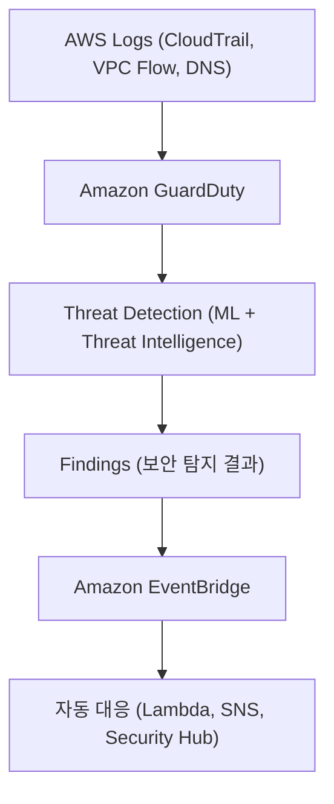

# 🛡️ Amazon GuardDuty 정리

---

## 1️⃣ Amazon GuardDuty란?

Amazon GuardDuty는
AWS 계정과 워크로드에서 발생하는 보안 위협을 탐지하는 위협 탐지(Threat Detection) 서비스입니다.

👉 쉽게 말해,
“AWS 환경에서 수상한 행동을 자동으로 잡아내는 보안 감시 서비스” 입니다.

---

## 2️⃣ 주요 기능

### 🔍 이상 행동 탐지 (Anomaly Detection)

비정상적인 API 호출, 의심스러운 IAM 활동, 예상치 못한 네트워크 트래픽 탐지

### 📡 데이터 소스 분석

VPC Flow Logs, AWS CloudTrail, DNS Logs 분석

### 🤖 ML 기반 분석

머신러닝과 위협 인텔리전스 피드 기반 탐지

### 🔔 알림/대응 자동화

EventBridge, Security Hub, Lambda와 연동해 자동 대응

## 3️⃣ 아키텍처 시각화

---

## 4️⃣ GuardDuty 탐지 예시

### 🔑 IAM: Root 계정으로 의심스러운 API 호출

### 🌍 네트워크: 비정상적인 IP 주소와의 통신 (예: Botnet, 악성 서버)

### 📦 S3: S3 버킷에 비정상적인 접근 시도

### 🕵 계정 활동: 짧은 시간 내 다수의 실패한 로그인 시도

---

## 5️⃣ 현업 활용 사례

### 🏦 금융사 → 해외 IP에서 비정상 접근 감지 → 자동 차단

### 🛒 이커머스 → 의심스러운 API 호출 탐지 후 보안팀 알림

### 🏢 기업 내부 보안팀 → GuardDuty Findings를 Security Hub에 통합 관리

### ⚡ 자동 대응 → EventBridge + Lambda 연계, 이상 징후 발생 시 계정 차단/알림

---

## ✅ 정리

Amazon GuardDuty = AWS 위협 탐지 서비스

데이터 소스: CloudTrail, VPC Flow Logs, DNS Logs

활용: 이상행동 탐지, 보안 경보, 자동 대응

연동: EventBridge, Security Hub, Lambda, SNS

### 👉 한마디로, “AWS 환경의 보안 경비원” 입니다.
