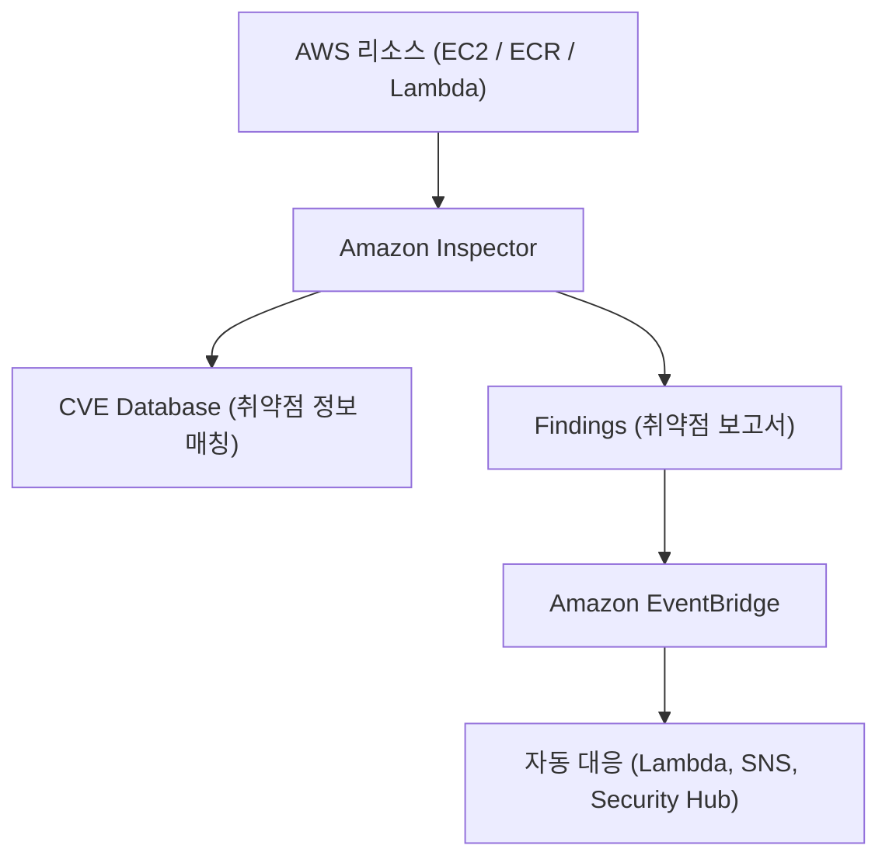

# 🕵️‍♂️ Amazon Inspector 정리

---

## 1️⃣ Amazon Inspector란?

Amazon Inspector는 AWS 환경에서 실행 중인 리소스(EC2, ECR, Lambda 등)에 대해
보안 취약점을 자동으로 분석·평가(Vulnerability Assessment) 해주는 서비스입니다.

### 👉 쉽게 말해, “AWS 리소스의 보안 헬스체크 자동 진단기” 입니다.

---

## 2️⃣ 주요 기능

🔍 취약점 스캔 (Vulnerability Scanning)

EC2 인스턴스, 컨테이너 이미지(ECR), Lambda 함수의 보안 취약점 자동 감지

🧠 지속적 모니터링 (Continuous Scan)

리소스가 변경되면 자동 재스캔 (실시간 감시)

🛡️ CVE 기반 평가

CVE(공통 취약점 데이터베이스)와 비교해 위험도 평가

📊 심각도 기반 리포트 제공

Critical / High / Medium / Low 등으로 결과 분류

🔔 자동 알림 및 대응

Amazon EventBridge, Security Hub, SNS 등과 연동해 알림 또는 자동 조치 가능

---

## 3️⃣ 아키텍처 시각화

---

## 4️⃣ 분석 대상별 주요 점검 항목

---

| 대상               | 점검 항목              | 예시                  |
| ---------------- | ------------------ | ------------------- |
| **EC2 인스턴스**     | OS 취약점, 잘못된 패키지 버전 | OpenSSL, Apache 취약점 |
| **ECR 컨테이너 이미지** | 라이브러리 취약점, CVE 비교  | Log4j, glibc 취약점    |
| **Lambda 함수**    | 패키지 종속성 취약점        | Python/Pip 모듈 버전 점검 |

---

## 5️⃣ 현업 활용 사례

### 🏢 보안팀 / DevSecOps

신규 EC2, 컨테이너 배포 시 자동 취약점 점검 파이프라인 구성

### 🚀 CI/CD 파이프라인 통합

CodePipeline → ECR → Inspector → 배포 전 자동 검증

### 🧩 보안 규제 대응

PCI-DSS, ISO 27001 등 컴플라이언스 감사 시 보안 증적 확보

### 🧠 보안 자동화

EventBridge + Lambda 연동 → Critical 취약점 발견 시 자동 알림 및 격리

---

## ✅ 정리

Amazon Inspector = AWS 리소스 보안 취약점 자동 분석 서비스

대상: EC2, ECR, Lambda

기능: CVE 기반 취약점 스캔, 지속 모니터링, 자동 알림/대응

현업 활용: DevSecOps 파이프라인, 보안 감사, 자동 보안 대응

### 👉 한마디로, “AWS 보안팀의 자동화된 취약점 탐지 도우미” 입니다.
