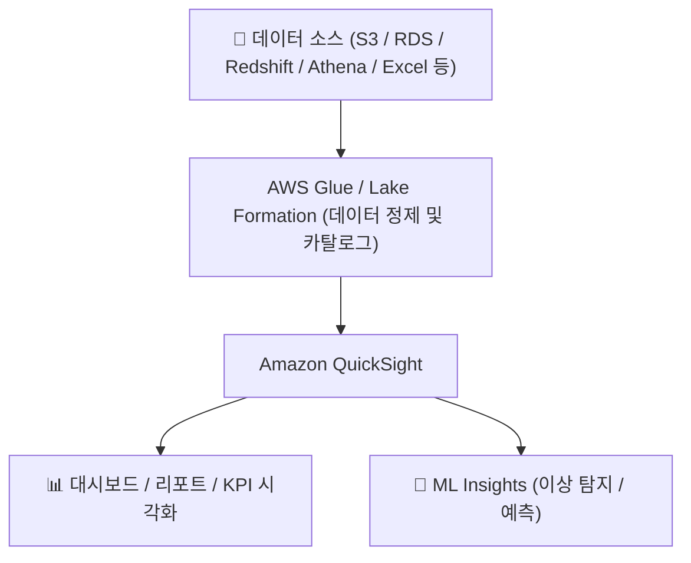
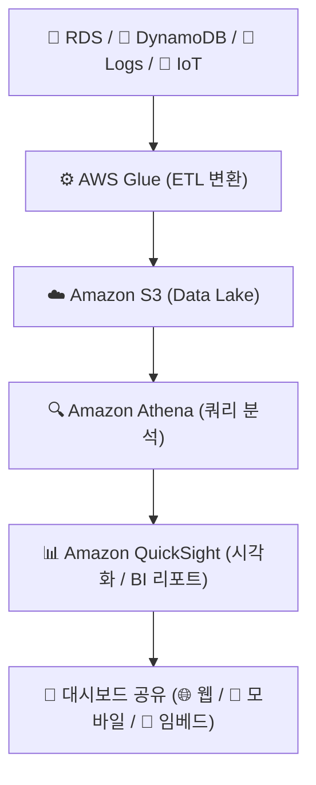

# 📊 Amazon QuickSight 정리

---

## 1️⃣ Amazon QuickSight란?

Amazon QuickSight는
AWS에서 제공하는 클라우드 기반 비즈니스 인텔리전스(BI) 서비스입니다.

👉 쉽게 말해,
“데이터를 예쁘게 시각화하고, 분석 리포트를 자동으로 만들어주는 AWS의 BI 도구” 입니다.

QuickSight는 Excel처럼 데이터를 표와 그래프로 시각화하면서도,
AWS의 S3·Redshift·RDS·Athena 등과 직접 연결되어 자동 분석 및 대시보드 생성이 가능합니다.

---

## 2️⃣ 주요 특징
| 기능                                  | 설명                                             |
| ----------------------------------- | ---------------------------------------------- |
| 📈 **대시보드 시각화**                     | 차트, 그래프, KPI 지표, 지도 시각화 등 다양한 시각화 기능           |
| 🧠 **ML Insights (AI 분석)**          | 머신러닝 기반 이상 탐지, 자동 예측, KPI 트렌드 분석               |
| ☁️ **서버리스 / 완전관리형**                 | 인프라 구축 없이 바로 사용 가능 (SaaS형 BI 서비스)              |
| 🔗 **다양한 데이터 소스 연동**                | RDS, Redshift, Athena, S3, Salesforce, Excel 등 |
| 🧩 **SPICE 엔진**                     | 인메모리 캐싱 기반 초고속 쿼리 처리 엔진                        |
| 🔒 **IAM 기반 보안**                    | IAM, VPC, KMS 통합 보안 제어                         |
| 💰 **사용량 기반 요금제 (Pay-per-session)** | 사용자 로그인 수에 따라 요금 과금                            |

---

## 3️⃣ 아키텍처 시각화

    

🧠 설명:

QuickSight는 AWS 내 다양한 데이터 소스와 직접 연결

Glue/Lake Formation과 통합되어 데이터 정제 및 접근 제어

SPICE 인메모리 엔진을 사용해 빠른 쿼리와 시각화 지원

---

## 4️⃣ SPICE란?

SPICE (Super-fast, Parallel, In-memory Calculation Engine)

| 항목 | 설명                            |
| -- | ----------------------------- |
| 역할 | QuickSight의 내부 인메모리 엔진        |
| 특징 | 데이터 쿼리 없이 즉시 분석 가능            |
| 장점 | 빠른 쿼리 속도, 사용자당 대시보드 응답 지연 최소화 |
| 비유 | “QuickSight 전용 캐시 메모리”        |

---

## 5️⃣ QuickSight의 구성요소
| 구성 요소           | 설명                     |
| --------------- | ---------------------- |
| **Dataset**     | 데이터 소스 연결 및 변환된 데이터 세트 |
| **Analysis**    | 데이터 시각화 및 차트 생성 화면     |
| **Dashboard**   | 공유 가능한 BI 리포트          |
| **ML Insights** | 머신러닝 기반 이상 탐지 및 예측     |
| **SPICE**       | 인메모리 캐시 엔진             |

---

## 6️⃣ 주요 기능 요약
| 기능                         | 설명                           |
| -------------------------- | ---------------------------- |
| 📊 **시각화(Visualization)**  | 차트, 테이블, 지도, KPI 위젯 등        |
| 🔎 **드릴다운 분석**             | 클릭으로 데이터 세부 항목 탐색            |
| 🧠 **AI 분석 (ML Insights)** | 매출 예측, 이상 탐지, 트렌드 분석         |
| 🤝 **공유 기능**               | 대시보드를 이메일, 링크, 임베딩 형태로 공유    |
| 🔐 **보안 및 거버넌스**           | IAM, KMS, VPC, CloudTrail 통합 |

---

## 7️⃣ 현업 활용 사례
| 산업                 | 활용 예시                      |
| ------------------ | -------------------------- |
| 🏦 **금융권**         | 고객 거래 내역 분석 및 대시보드 리포트     |
| 🏭 **제조 / IoT**    | 센서 데이터의 실시간 생산 현황 모니터링     |
| 🛒 **이커머스**        | 매출 트렌드, 인기 상품, 방문자 로그 시각화  |
| 🧠 **데이터 분석 조직**   | S3 + Athena 기반 데이터 분석 및 공유 |
| 🧩 **경영진 리포트 자동화** | 매출/비용 지표를 매일 자동 업데이트하여 시각화 |

---

## 8️⃣ QuickSight + AWS 데이터 분석 파이프라인 

🧠 설명:
Glue로 데이터를 정제 → S3에 저장 → Athena로 쿼리 → QuickSight에서 시각화 및 리포트 생성

---

## 9️⃣ QuickSight vs Tableau / Power BI 비교
| 항목         | **QuickSight**             | **Tableau**  | **Power BI**      |
| ---------- | -------------------------- | ------------ | ----------------- |
| **플랫폼**    | AWS 클라우드 (SaaS형)           | 온프레미스 + 클라우드 | Microsoft 클라우드    |
| **요금제**    | 세션당 과금 (저렴)                | 사용자당 라이선스    | 사용자당 라이선스         |
| **확장성**    | AWS 서비스와 완전 통합             | 별도 설정 필요     | Azure 서비스와 연동     |
| **ML 기능**  | 내장형 ML Insights            | 별도 AI 연동 필요  | Azure ML 연동       |
| **데이터 소스** | AWS 기반 (S3, Athena, RDS 등) | 다양한 외부 연동    | MS SQL / Excel 중심 |

---

## ✅ 정리

Amazon QuickSight = 클라우드 기반 BI 시각화 서비스

특징:

서버리스 + AI 내장 분석 + SPICE 인메모리 처리

데이터 소스: S3, Athena, Redshift, RDS, Excel 등

현업 활용: 대시보드 자동화, 이상 탐지, 데이터 기반 의사결정

👉 한마디로,
“Amazon QuickSight는 AWS 환경의 데이터를 한눈에 보여주는 클라우드 BI 플랫폼” 입니다.
