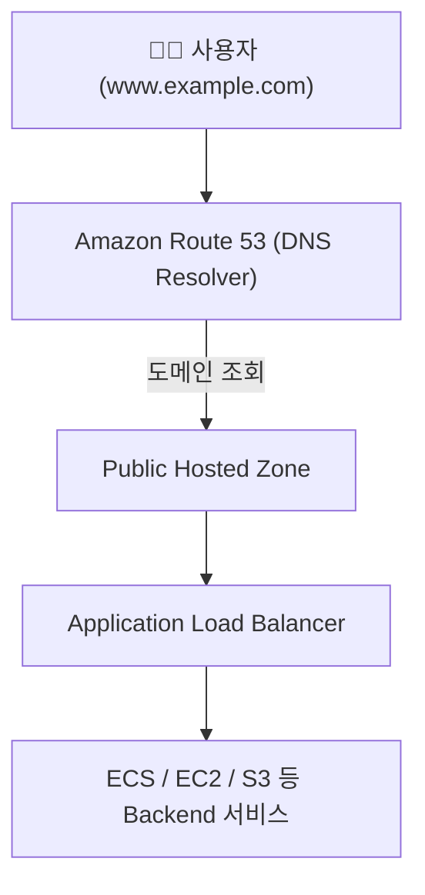

# 🌐 Amazon Route 53 정리

---

## 1️⃣ Amazon Route 53이란?

Amazon Route 53은 AWS에서 제공하는 DNS(도메인 네임 시스템) 관리 서비스입니다.
도메인 이름(예: www.example.com)을 IP 주소(예: 192.168.0.1)로 변환해주는 역할을 합니다.

👉 쉽게 말해,
“사람이 기억하기 쉬운 도메인 주소를 컴퓨터가 이해할 수 있는 IP로 바꿔주는 AWS의 전화번호부 서비스” 입니다.

## 2️⃣ 주요 기능

---

| 기능                                  | 설명                                           |
| ----------------------------------- | -------------------------------------------- |
| 🌍 **도메인 등록 (Domain Registration)** | AWS 콘솔에서 직접 도메인을 구입/등록 가능                    |
| 🔁 **DNS 라우팅 (DNS Routing)**        | 사용자의 요청을 가장 적절한 서버나 리전으로 전달                  |
| 🧭 **헬스체크 (Health Check)**          | 서버 상태를 모니터링하고, 비정상 서버로의 트래픽 자동 우회            |
| 🌎 **트래픽 정책 관리 (Traffic Policy)**   | 지리적 위치, 지연 시간, 가중치 기반의 트래픽 분배 가능             |
| 🧱 **통합성 (Integration)**            | ALB, S3, CloudFront, API Gateway 등과 통합 사용 가능 |

---

## 3️⃣ Route 53 아키텍처 시각화

---

## 4️⃣ 라우팅 정책 유형

---

| 라우팅 정책                           | 설명                            | 예시                      |
| -------------------------------- | ----------------------------- | ----------------------- |
| **단순(Simple)**                   | 한 도메인 → 한 IP 매핑               | example.com → 1.1.1.1   |
| **가중치(Weighted)**                | 여러 서버에 비율로 트래픽 분배             | A서버 70%, B서버 30%        |
| **지연 시간(Latency)**               | 사용자의 지리적 위치 기준으로 가장 빠른 리전에 연결 | 서울 사용자 → ap-northeast-2 |
| **장애 조치(Failover)**              | 1차 서버 다운 시 2차 서버로 자동 전환       | Active-Passive 구성       |
| **지리적(Geolocation)**             | 사용자의 지역별로 다른 리전으로 연결          | 일본 → 도쿄 리전, 한국 → 서울 리전  |
| **멀티 밸류 응답(Multi-Value Answer)** | 여러 IP 반환, 헬스체크 기반 자동 장애조치     | 다중 서버 운영                |

## 5️⃣ 헬스체크(Health Check)

HTTP/HTTPS/TCP 기반으로 주기적으로 서버 상태 확인

응답 실패 시 비정상 서버로의 트래픽 차단

CloudWatch와 연동하여 장애 알림 자동화 가능

## 6️⃣ 현업 활용 사례

### 🌐 글로벌 서비스 도메인 운영

Route 53 + CloudFront 조합으로 전 세계 사용자에게 빠른 DNS 응답 제공

### 🏢 멀티 리전 구성 (Active-Passive)

서울 리전 장애 시 도쿄 리전으로 자동 전환

### 📦 S3 정적 웹사이트 호스팅

Route 53에서 S3 버킷을 웹사이트 엔드포인트로 연결

### 📊 모니터링 자동화

헬스체크 + CloudWatch로 서버 상태 자동 감시

## ✅ 정리

Amazon Route 53 = AWS의 DNS 관리 서비스

주요 기능: 도메인 등록, DNS 라우팅, 헬스체크, 트래픽 분배

라우팅 정책: 단순 / 가중치 / 지연 시간 / 장애 조치 / 지리적 / 멀티밸류

현업 활용: 글로벌 서비스 트래픽 분산, 멀티 리전 장애조치, 도메인 관리

👉 한마디로,
“Route 53은 사용자의 요청을 가장 빠르고 안전한 경로로 안내하는 AWS의 인터넷 내비게이터” 입니다.
