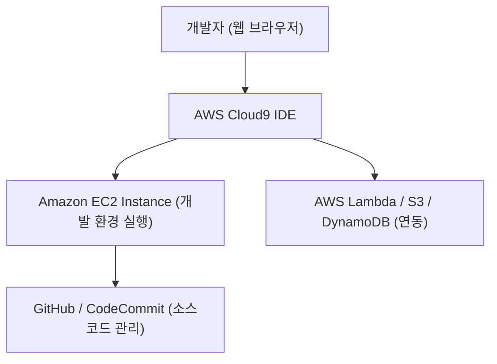

# 💻 AWS Cloud9 정리

---

## 1️⃣ AWS Cloud9이란?

AWS Cloud9은
브라우저 기반의 클라우드 통합 개발 환경(IDE, Integrated Development Environment) 입니다.

👉 쉽게 말해,
“AWS에서 제공하는 웹 기반 코딩 환경 — 내 컴퓨터에 아무것도 설치하지 않고, 브라우저만으로 개발 가능한 도구” 입니다.

---

## 2️⃣ 주요 특징

### ☁️ 클라우드 기반 개발 환경

로컬 환경 설정 없이, AWS 클라우드에서 바로 코딩 가능

### 🧑‍💻 언어 지원

Python, Node.js, Java, Go, C++, PHP 등 다양한 언어 지원

### 🧰 통합 터미널 제공

리눅스 쉘 + AWS CLI + Git 내장

### 🪄 실시간 협업(Collaboration)

여러 개발자가 동시에 같은 코드 편집 가능

### 🔗 AWS 서비스 통합

EC2, Lambda, S3 등과 바로 연결 가능

---

## 3️⃣ 아키텍처 시각화

---

---

## 4️⃣ 장점

### 🧑‍💻 로컬 환경 의존성 제거

환경 설정 충돌 없이 즉시 개발 가능

---

## 🔄 Anywhere, Anytime

인터넷만 있으면 어디서든 접속 가능

### ⚙️ 서버리스 및 인프라 개발에 최적화

Lambda 함수나 IaC (CloudFormation, CDK) 코드 작성에 용이

### 💰 비용 효율성

EC2를 중지하면 과금 중단

---

## 5️⃣ 현업 활용 사례

### 🏗️ DevOps & 클라우드 인프라 자동화

CloudFormation, Terraform, CDK 코드 작성

### 🧪 교육 & 실습 환경

개발자 교육, 부트캠프에서 빠른 환경 구성

### 🧠 Lambda 함수 개발

서버리스 함수 코드 작성 및 디버깅

### 👥 원격 협업 개발

개발자 간 실시간 코드 협업

---

## ✅ 정리

AWS Cloud9 = 브라우저 기반 클라우드 개발 환경(IDE)

EC2 또는 Cloud9 환경에서 실행

다양한 언어 지원 + Git, AWS CLI 내장

현업에서는 서버리스 개발, 교육, DevOps 자동화, 협업 개발에 활용

👉 한마디로, “어디서든 접근 가능한 AWS의 클라우드 개발 IDE” 입니다.
