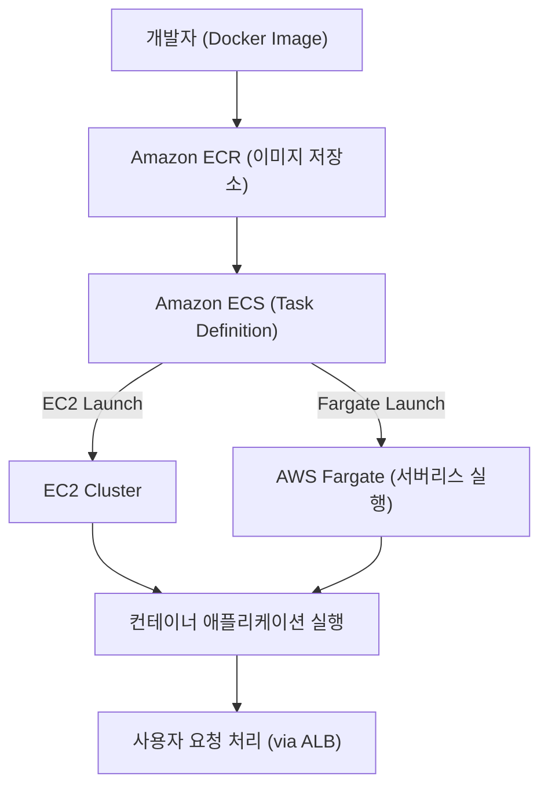

# 🐳 AWS ECS (Elastic Container Service) 정리

---

## 1️⃣ AWS ECS란?

Amazon ECS (Elastic Container Service) 는
Docker 컨테이너를 손쉽게 실행하고 관리할 수 있는 완전관리형 컨테이너 오케스트레이션 서비스입니다.

👉 쉽게 말해,
“도커 컨테이너를 자동으로 배포·관리해주는 AWS 전용 쿠버네티스 같은 서비스” 입니다.

---

## 2️⃣ 주요 특징

### 🚀 완전 관리형

컨테이너 클러스터 관리, 스케줄링, 확장 자동화

### ⚙️ 유연한 실행 방식

EC2 Launch Type → EC2 인스턴스 위에서 컨테이너 실행

Fargate Launch Type → 서버리스 방식으로 컨테이너 실행

### 📈 자동 확장 (Auto Scaling)

트래픽 부하에 따라 컨테이너 개수 자동 조정

### 🔒 보안 통합

IAM, VPC, Security Group과 통합되어 안전한 컨테이너 운영

### 🌐 서비스 디스커버리 & 로드 밸런싱 지원

ALB(Application Load Balancer)와 쉽게 연동

## 3️⃣ ECS 아키텍처 시각화

---

## 4️⃣ ECS 구성 요소

### Task Definition

어떤 Docker 이미지를 실행할지, CPU/메모리 설정, 네트워크 모드 정의

### Task

실제 실행되는 컨테이너 인스턴스 단위

### Service

Task를 여러 개 띄우고, Auto Scaling & Load Balancing 관리

### Cluster

ECS 리소스들이 동작하는 논리적 그룹

---

## 5️⃣ 현업 활용 사례

### 🌐 웹 애플리케이션 운영

ALB + ECS 조합으로 컨테이너 기반 웹서비스 제공

### 🏢 마이크로서비스 아키텍처

각 서비스를 컨테이너 단위로 독립 배포 → 관리 효율성↑

### 📊 데이터 처리 배치 작업

ECS Task로 배치 잡 실행

### 🧪 개발/테스트 환경 자동화

동일한 Task Definition으로 테스트/운영 환경 동일하게 유지

---

## ✅ 정리

AWS ECS = 컨테이너 실행·관리 서비스

실행 방식: EC2 기반 또는 Fargate 기반

구성 요소: Task Definition → Task → Service → Cluster

현업 활용: 웹 서비스, 마이크로서비스, 배치 잡, Dev/Test 환경

👉 한마디로, “도커 컨테이너를 자동으로 운영해주는 AWS의 컨테이너 매니저” 입니다.
