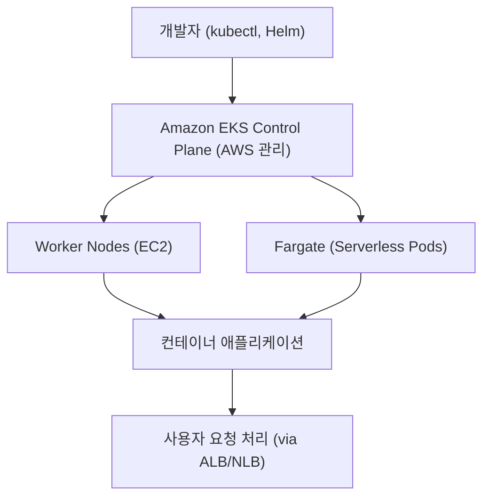

# ☸️ AWS EKS (Elastic Kubernetes Service) 정리

---

## 1️⃣ AWS EKS란?

Amazon EKS (Elastic Kubernetes Service) 는
AWS에서 제공하는 완전관리형 쿠버네티스(Kubernetes) 서비스입니다.

👉 쉽게 말해,
“쿠버네티스를 직접 설치·운영하지 않고, AWS가 대신 관리해주는 서비스” 입니다.

---

## 2️⃣ 주요 특징

🚀 완전 관리형

Kubernetes Control Plane(마스터 노드)을 AWS가 운영 → 사용자는 워커 노드와 애플리케이션만 관리

---

## 🔄 유연한 실행

EC2 인스턴스 위에서 실행 가능

AWS Fargate 위에서 서버리스 실행 가능

### 🔒 보안 & IAM 통합

IAM, VPC, Security Group과 통합

### 🌐 멀티 클러스터/멀티 리전 지원

대규모 글로벌 애플리케이션 운영 가능

### ⚡ 네이티브 쿠버네티스 호환성

Helm Chart, kubectl, CRD 등 표준 쿠버네티스 도구 그대로 사용

---

## 3️⃣ EKS 아키텍처 시각화

---

## 4️⃣ ECS vs EKS 비교

--- 

| 구분               | **ECS**      | **EKS**               |
| ---------------- | ------------ | --------------------- |
| **컨테이너 오케스트레이션** | AWS 독자 서비스   | 오픈소스 Kubernetes 기반    |
| **학습 곡선**        | 쉬움 (AWS 전용)  | 다소 높음 (쿠버네티스 지식 필요)   |
| **커뮤니티/생태계**     | 제한적 (AWS 중심) | 넓음 (Kubernetes 표준 활용) |
| **실행 방식**        | EC2, Fargate | EC2, Fargate          |
| **운영 부담**        | 상대적으로 적음     | 쿠버네티스 아키텍처 학습 필요      |

---

## 5️⃣ 현업 활용 사례

### 🏢 엔터프라이즈 환경

멀티 클라우드/온프레미스 + AWS 환경 통합 운영

### 🧩 마이크로서비스 아키텍처

대규모 서비스들을 Kubernetes로 통합 관리

### 📊 데이터/AI 플랫폼

Kubeflow, Spark on Kubernetes 같은 워크로드 실행

### 🌍 글로벌 서비스

여러 리전에 걸쳐 동일한 쿠버네티스 환경 배포

---

## ✅ 정리

EKS = AWS 관리형 Kubernetes 서비스

장점: 보안/IAM 통합, Fargate 지원, 표준 K8s 호환성

ECS와 달리 Kubernetes 표준 생태계 활용 가능

현업에서는 마이크로서비스, 데이터/AI 플랫폼, 멀티클라우드 운영에 많이 사용

👉 한마디로, “AWS에서 쿠버네티스를 쉽게 쓰도록 만든 서비스” 입니다.
