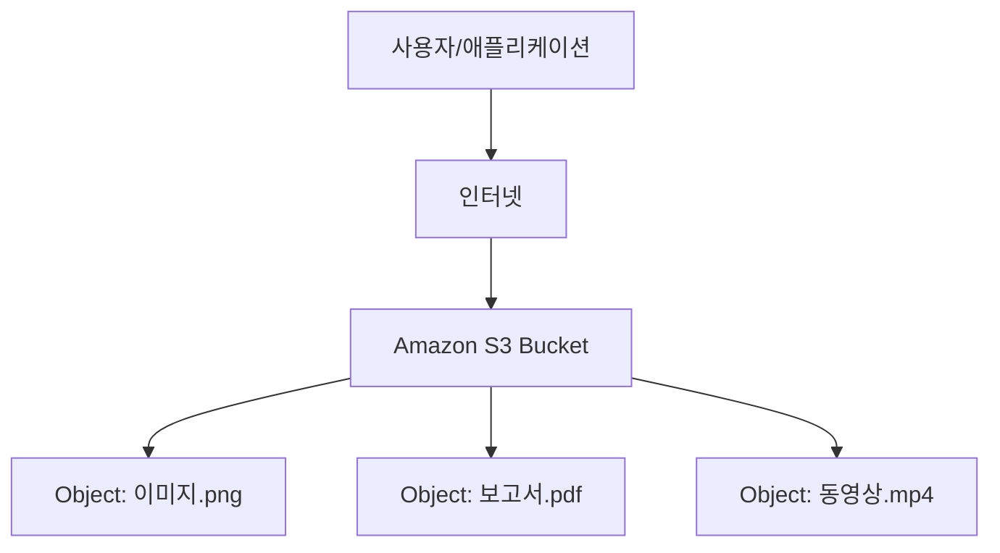

# 🗄️ Amazon S3 (Simple Storage Service) 이해하기
## 1. Amazon S3란?

Amazon S3는 AWS에서 제공하는 객체 스토리지 서비스입니다.

👉 쉽게 말해,
“클라우드에 올려두는 무제한 하드디스크” 라고 생각하면 됩니다.
파일(이미지, 영상, 문서 등)을 인터넷을 통해 안전하게 저장하고, 필요할 때 꺼내 쓸 수 있어요.

## 2. S3의 주요 특징

### 📦 객체(Object) 단위 저장

파일을 “객체”라는 단위로 저장 (객체 = 데이터 + 메타데이터)

### 🪣 버킷(Bucket)

S3에 데이터를 저장하는 최상위 컨테이너 (하드디스크의 폴더 같은 개념)

### 🌍 글로벌 접근 가능

인터넷만 있으면 언제 어디서든 접근 가능

### 🔒 보안/권한 제어

IAM 정책, 버킷 정책, ACL을 통해 접근 제어 가능

### 💸 비용 효율적

사용한 스토리지 용량과 요청 수에 따라 과금 (Pay-as-you-go)

### ♻️ 다양한 스토리지 클래스

자주 쓰는 데이터 → Standard

잘 안 쓰지만 보관해야 하는 데이터 → Glacier (아카이브)

## 3. S3 아키텍처 개념도

## 4. S3 활용 사례

🌐 웹사이트 정적 호스팅 (HTML, CSS, JS 배포)

📷 이미지/동영상 저장소 (유튜브/넷플릭스 같은 미디어 서비스)

🗄️ 백업/아카이브 (DB 백업, 로그 저장)

🧠 데이터 레이크 (빅데이터 분석용 데이터 저장소)

🤖 AI/ML 학습 데이터 저장소

## 5. S3를 시작하려면?

AWS 콘솔에서 S3 버킷 생성 (버킷 이름 + 리전 선택)

객체(파일) 업로드

권한 설정 (퍼블릭/프라이빗, IAM 정책, 버킷 정책)

필요 시 버전 관리, 수명 주기 정책 설정

애플리케이션에서 S3 API/SDK로 데이터 읽고 쓰기

### ✅ 정리

Amazon S3는 안정적이고 확장 가능한 객체 스토리지 서비스로,
웹사이트, 모바일 앱, 빅데이터 분석, AI, 기업 백업 등 거의 모든 IT 환경에서 사용됩니다.

👉 비유하자면, “전 세계 어디서나 접근 가능한 무제한 온라인 폴더” 라고 생각하면 가장 쉽습니다.

* 참고 링크 : https://velog.io/@yjshin/AWS-S3-Simple-Storage-Service
