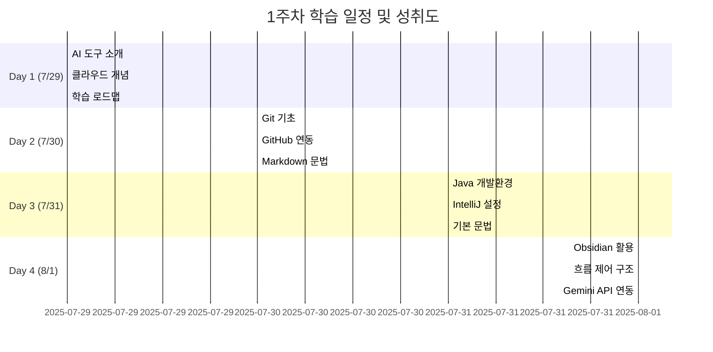
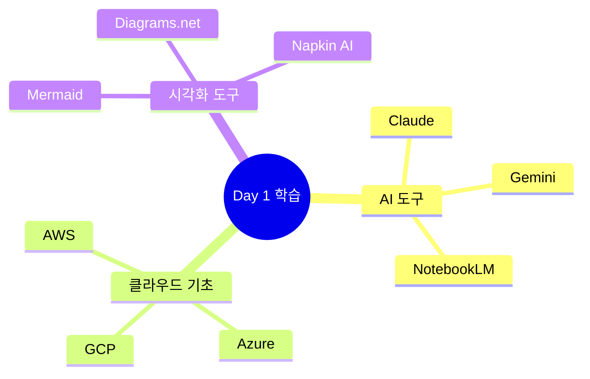
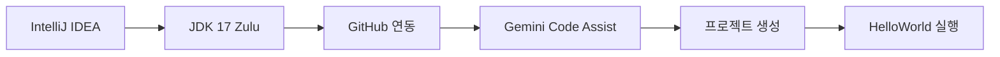
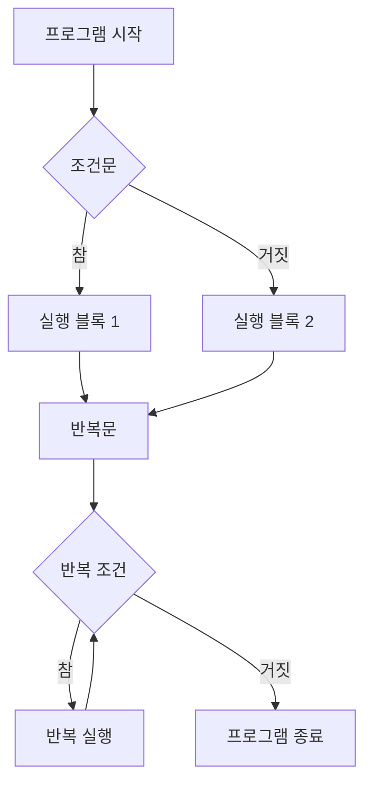
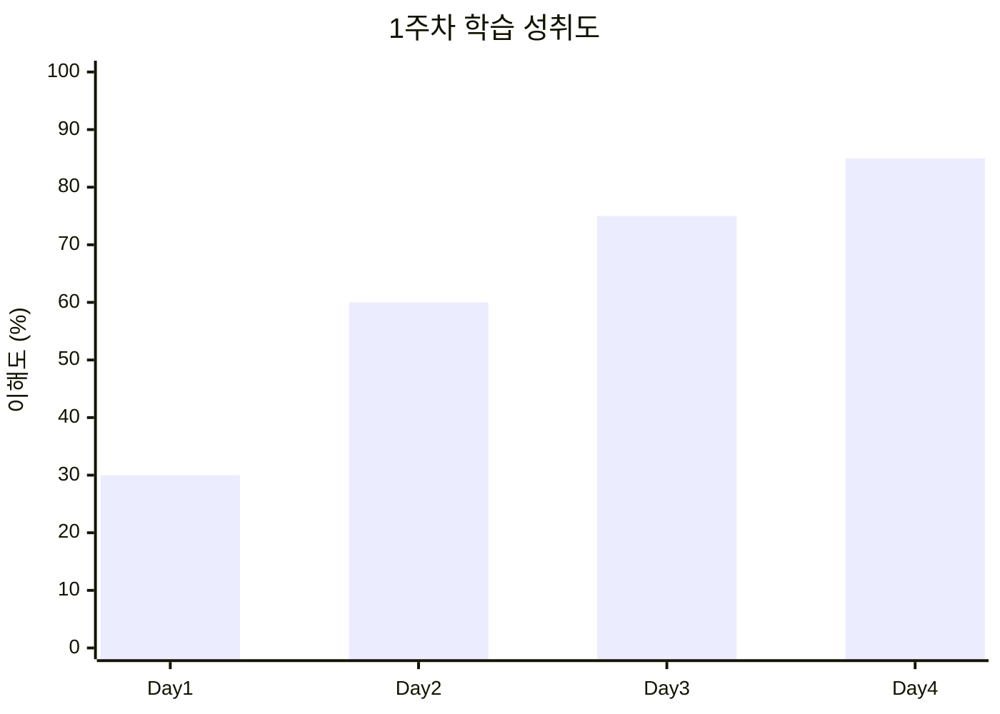

# 멋쟁이사자처럼 1주차 회고록
*클라우드 엔지니어링 여정의 시작 🚀*

---

## 📅 학습 기간
**2025년 7월 29일 - 8월 1일 (4일차)**

---

## 🎯 주요 학습 목표 및 성취도



---

## 📚 일차별 학습 내용

### 🌟 **Day 1 (7/29): AI와 클라우드의 첫 만남**

#### 핵심 키워드
- **AI 도구 활용**: Claude, Gemini, NotebookLM
- **클라우드 개념**: AWS, Azure, GCP 기초
- **시각화**: Mermaid, Diagrams.net

#### 주요 성과
- 클라우드 엔지니어링 로드맵 시각화 완성
- AI 도구를 활용한 학습 방법론 습득
- 자기소개서 작성법 및 취업 전략 수립



---

### 🔧 **Day 2 (7/30): Git/GitHub 마스터하기**

#### 핵심 키워드
- **버전 관리**: Git 기초 명령어
- **협업 도구**: GitHub 연동
- **문서화**: Markdown 문법

#### 주요 학습 명령어
```bash
# Git 기본 워크플로우
git init
git add .
git commit -m "message"
git push origin main

# 원격 저장소 연결
git remote add origin [URL]
git branch -M main
git push -u origin main
```

#### 트러블슈팅 경험
- 원격 저장소 권한 문제 해결
- 커밋 충돌 해결 방법 학습
- 자격증명 관리 (Windows/Mac 환경별 차이점)

---

### ☕ **Day 3 (7/31): Java 개발 환경 구축**

#### 핵심 키워드
- **IDE 설정**: IntelliJ IDEA 커스터마이징
- **개발 환경**: JDK 17 (Zulu) 설치
- **AI 코딩**: Gemini Code Assist 연동

#### 개발 환경 세팅


#### 필수 플러그인 설치
- Atom Material File Icons
- Rainbow Brackets
- Translation
- Gemini Code Assist

---

### 🧠 **Day 4 (8/1): 지식 관리 시스템 구축**

#### 핵심 키워드
- **노트 관리**: Obsidian 활용법
- **제어 구조**: if-else, for, while 문
- **API 연동**: Gemini API 실습

#### Obsidian 특화 기능
- `[[링크]]` 문법으로 노트 연결
- 태그 시스템으로 분류
- 그래프 뷰로 지식 관계 시각화
- 콜아웃 문법으로 중요 내용 강조

#### 제어 구조 학습


---

## 💡 주요 깨달음

### ✅ **성공 포인트**
1. **AI 도구의 적극 활용**
   - 학습 속도 대폭 향상
   - 개념 이해도 증진
   - 실무 적용 가능성 확인

2. **체계적인 지식 관리**
   - Obsidian을 통한 연결된 학습
   - Git을 통한 버전 관리
   - Markdown을 통한 표준화된 문서화

3. **실습 중심 학습**
   - 이론과 실습의 균형
   - 트러블슈팅 경험 축적
   - 실제 프로젝트 환경 구축

### ⚠️ **도전 과제**
1. **환경 설정의 복잡성**
   - 운영체제별 차이점 극복 필요
   - 자격증명 관리의 어려움

2. **정보의 양적 압박**
   - 빠른 속도의 강의 진행
   - 복습 시간 확보 필요

---

## 📈 성장 지표



### 세부 역량별 성장
- **Git/GitHub 활용**: 20% → 80%
- **Java 기초**: 0% → 70%
- **AI 도구 활용**: 40% → 90%
- **문서화 능력**: 50% → 85%

---

## 🎯 다음 주 목표

### 🚀 **우선순위 높음**
- [ ] Java 기본 문법 완전 숙달
- [ ] 객체지향 프로그래밍 개념 학습
- [ ] 실무 프로젝트 시작

### 📋 **보완 학습**
- [ ] Linux 명령어 기초
- [ ] 데이터베이스 기초 (MySQL)
- [ ] Spring Boot 프레임워크 입문

### 🔧 **환경 개선**
- [ ] 개발 워크플로우 최적화
- [ ] 코드 품질 관리 도구 도입
- [ ] 팀 협업 도구 활용법 학습

---

## 💭 개인적 소감

### 🌟 **가장 인상 깊었던 순간**
첫날 클라우드 엔지니어링 로드맵을 AI로 시각화했을 때, 막연했던 학습 목표가 구체적으로 보이기 시작했습니다. 특히 Mermaid 문법으로 복잡한 개념을 한눈에 볼 수 있게 정리하는 과정에서 **"시각화의 힘"**을 실감했습니다.

### 🤔 **가장 어려웠던 부분**
Git의 개념적 이해는 쉬웠지만, 실제 GitHub와 연동하면서 발생하는 권한 문제나 충돌 상황들을 해결하는 것이 예상보다 복잡했습니다. 하지만 이런 **실전 경험**이야말로 진짜 학습이라는 생각이 들었습니다.

### 🔥 **동기부여된 요소**
AI 도구들의 발전 속도가 놀라웠습니다. Gemini Code Assist로 코드 작성 도움을 받고, Claude로 개념을 정리하고, NotebookLM으로 오디오 요약까지 만들 수 있다는 것이 **미래의 개발자 역할**에 대해 새롭게 생각해보게 했습니다.

---

## 🔗 유용한 리소스 모음

### 📖 **학습 사이트**
- [Programiz Java](https://www.programiz.com/java-programming) - 기초 개념 학습
- [GeeksforGeeks](https://www.geeksforgeeks.org/) - 심화 주제 탐구
- [Git 공식 문서](https://git-scm.com/book/ko/v2/) - Git 완벽 가이드

### 🛠️ **도구 및 플랫폼**
- [GitHub](https://github.com/) - 코드 저장소
- [Claude.ai](https://claude.ai/) - AI 어시스턴트
- [Obsidian](https://obsidian.md/) - 지식 관리
- [Mermaid Live Editor](https://mermaid.live/) - 다이어그램 작성

### 🎓 **추가 학습 자료**
- [AWS 인증 경로](https://aws.amazon.com/ko/certification/)
- [Java 로드맵](https://roadmap.sh/java)
- [백준 온라인 저지](https://www.acmicpc.net/) - 알고리즘 연습

---

## 🏁 마무리

1주차를 돌아보면, 단순히 기술을 배운 것이 아니라 **"어떻게 효율적으로 학습할 것인가"**에 대한 방법론을 터득한 시간이었습니다. 

AI 도구의 도움을 받아 빠르게 개념을 이해하고, Git으로 코드를 관리하며, Obsidian으로 지식을 체계화하는 **현대적인 학습 패러다임**을 경험했습니다.

앞으로의 여정이 더욱 기대됩니다! 🚀

---

*"코드도 배우고, AI도 활용하고, 미래도 준비하는 멋쟁이사자처럼!"* 🦁

---

**작성일**: 2025년 8월 14일  
**작성자**: 클라우드 엔지니어 지망생  
**태그**: `#멋쟁이사자처럼` `#회고` `#Java` `#Git` `#AI도구` `#1주차`