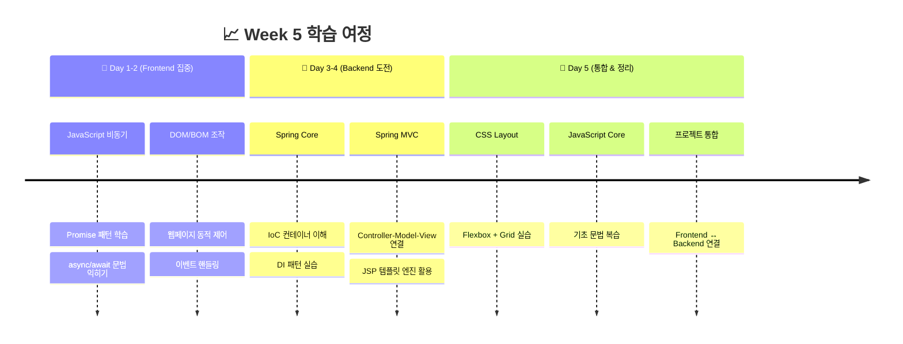
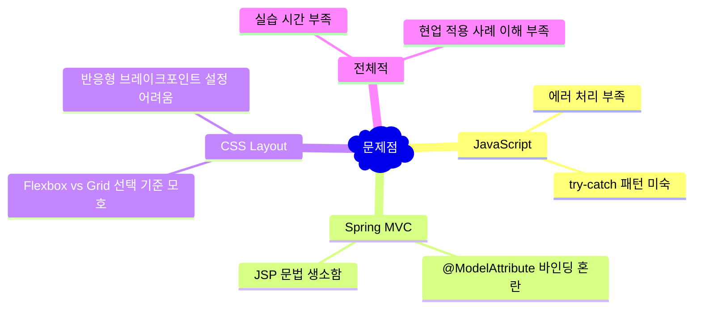
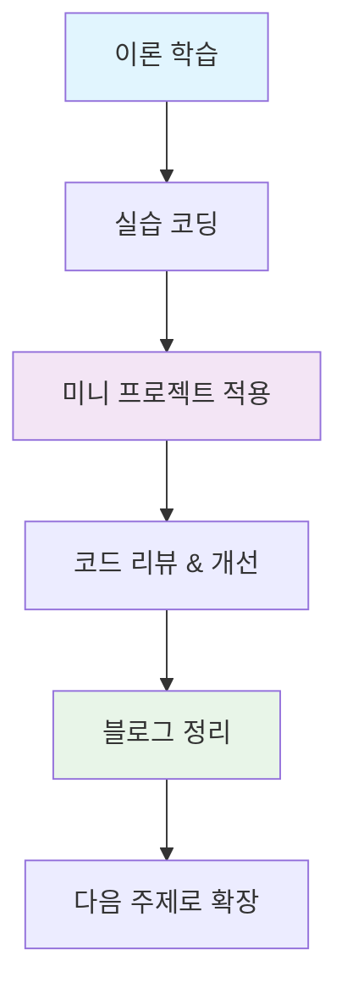
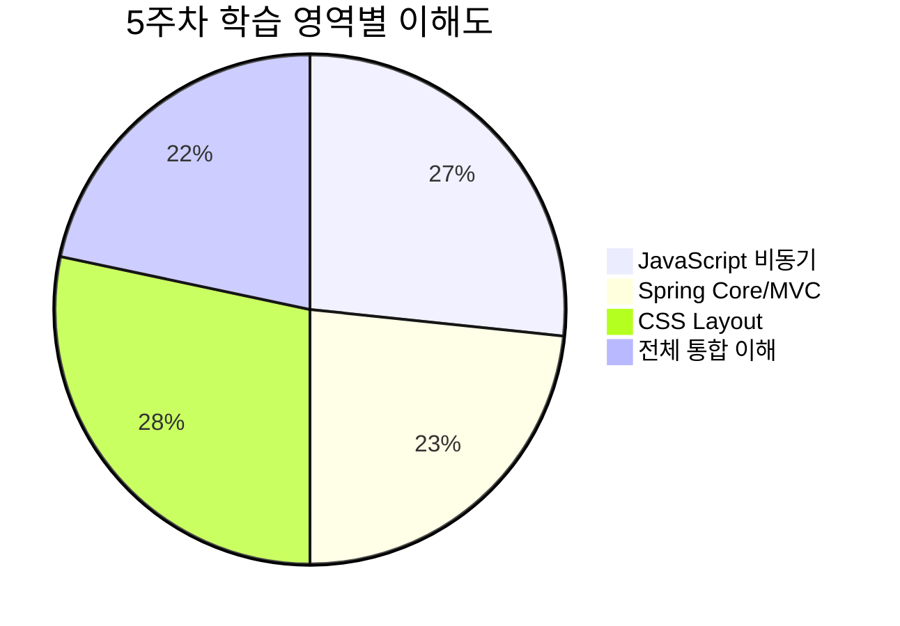

# 🌟 5주차 회고록 (Week 5 Retrospective)

> 📅 **기간:** 2025.08.21 ~ 2025.08.27  
> ✍️ **작성자:** YJ Shin  
> 🎯 **주제:** JavaScript 비동기 프로그래밍 · Spring Core & MVC · CSS Layout


---

## 📚 이번 주 학습 주제

### 🔥 핵심 학습 영역
- **🌐 JavaScript 심화**
  - DOM/BOM 조작으로 동적 웹페이지 제어
  - Promise와 async/await를 활용한 비동기 프로그래밍
  - Fetch API를 통한 서버 통신

- **⚙️ Spring Framework 입문**
  - IoC(Inversion of Control)와 DI(Dependency Injection) 개념
  - MVC 패턴 구현과 JSP 연동
  - @ModelAttribute를 활용한 데이터 바인딩

- **🎨 CSS Layout 마스터**
  - Flexbox와 Grid를 활용한 현대적 레이아웃
  - 반응형 디자인의 기초
  - Box Model 완전 정복


---

## 🎯 학습 흐름 시각화



---

## ✅ Keep (잘한 점)

### 🎉 성과 하이라이트

| 분야 | 성취 | 구체적 내용 |
|------|------|-------------|
| **JavaScript** | 🌟 비동기 패턴 이해 | Promise 체이닝과 async/await로 콜백 지옥 해결 |
| **네트워크** | 🚀 API 최적화 학습 | Promise.all로 병렬 처리, Promise.race로 경쟁 상태 해결 |
| **Spring** | ⚙️ IoC/DI 실전 적용 | 객체 생성을 컨테이너에 위임하는 방식 체득 |
| **MVC** | 🔗 아키텍처 이해 | Controller → Service → Repository 계층 분리 |
| **CSS** | 🎨 모던 레이아웃 | Flexbox와 Grid를 활용한 반응형 UI 구현 |

### 💡 핵심 깨달음
- **"왜 비동기인가?"** → 사용자 경험(UX) 향상을 위한 필수 패턴
- **"왜 IoC/DI인가?"** → 유지보수성과 테스트 용이성을 위한 설계 철학
- **프론트엔드와 백엔드의 연결고리** 이해

---

## 🚧 Problem (아쉬운 점)

### ⚠️ 개선이 필요한 영역



### 🔍 구체적인 어려움들
1. **비동기 에러 처리**: `try-catch`와 `.catch()` 사용 시점 구분 어려움
2. **Spring 데이터 바인딩**: 폼 데이터가 어떻게 객체로 변환되는지 흐름 파악 부족
3. **CSS 선택 기준**: 언제 Flexbox를, 언제 Grid를 사용해야 하는지 판단 어려움

---

## 🔨 Try (개선할 점)

### 🎯 단기 목표 (1-2주)
- [ ] **비동기 에러 처리 패턴** 정리 및 실습
- [ ] **Spring Boot + Thymeleaf** 환경으로 확장 학습
- [ ] **실제 API 연동** 미니 프로젝트 진행
- [ ] **CSS Grid + Flexbox 혼합** 레이아웃 10가지 만들어보기

### 🚀 중기 목표 (1개월)
- [ ] **풀스택 토이 프로젝트** 완성 (JavaScript + Spring Boot + DB)
- [ ] **REST API 설계** 및 구현
- [ ] **반응형 웹 퍼블리싱** 포트폴리오 제작

### 📋 학습 전략


---

## 💼 현업 적용 인사이트

### 🌐 JavaScript 비동기 프로그래밍

#### 실무 활용 사례
- **대시보드 개발**: 여러 API를 동시에 호출하여 로딩 시간 단축
  ```javascript
  // 실무 예시: 대시보드 데이터 로딩
  const loadDashboard = async () => {
    try {
      const [users, sales, analytics] = await Promise.all([
        fetchUsers(),
        fetchSales(), 
        fetchAnalytics()
      ]);
      renderDashboard({ users, sales, analytics });
    } catch (error) {
      showErrorMessage('데이터 로딩 실패');
    }
  };
  ```

- **CDN 최적화**: Promise.race로 가장 빠른 서버 선택
- **사용자 경험**: 로딩 상태 표시로 체감 속도 개선

#### 💡 현업 팁
> **Promise.all vs Promise.allSettled**  
> - `Promise.all`: 하나라도 실패하면 전체 실패 (결제 시스템)
> - `Promise.allSettled`: 개별 성공/실패 처리 (소셜 로그인)

### ⚙️ Spring IoC/DI 패턴

#### 실무에서의 중요성
- **테스트 용이성**: Mock 객체 주입으로 단위 테스트 간편화
- **유지보수성**: 객체 간 결합도 감소로 코드 변경 영향 최소화
- **확장성**: 인터페이스 기반 설계로 새로운 구현체 쉽게 추가

#### 🏢 실무 패턴
```java
// 현업에서 선호하는 생성자 주입 패턴
@Service
public class UserService {
    private final UserRepository userRepository;
    private final EmailService emailService;
    
    public UserService(UserRepository userRepository, 
                      EmailService emailService) {
        this.userRepository = userRepository;
        this.emailService = emailService;
    }
}
```

### 🎨 CSS Layout의 현업 활용

#### Flexbox vs Grid 선택 기준
| 상황 | 추천 기술 | 이유 |
|------|----------|------|
| 내비게이션 바 | Flexbox | 1차원 정렬에 최적화 |
| 카드 레이아웃 | Grid | 2차원 격자 구조 |
| 반응형 사이드바 | Grid | 복잡한 레이아웃 제어 |
| 버튼 그룹 | Flexbox | 간단한 정렬 |

#### 📱 모바일 퍼스트 전략
```css
/* 현업 표준: 모바일 기준으로 시작 */
.container {
  display: flex;
  flex-direction: column;
}

/* 태블릿 */
@media (min-width: 768px) {
  .container {
    flex-direction: row;
  }
}

/* 데스크톱 */
@media (min-width: 1024px) {
  .container {
    display: grid;
    grid-template-columns: 1fr 3fr 1fr;
  }
}
```

---

## 📊 성장 지표

### 🎯 학습 성취도


### 📈 주간 학습 시간 분배
- **JavaScript**: 35% (이론 + 실습)
- **Spring Framework**: 40% (새로운 도전)
- **CSS**: 20% (복습 + 심화)
- **통합 프로젝트**: 5% (아쉬운 부분)

---

## 🔮 다음 주 학습 계획

### Week 6 로드맵
1. **Spring Boot 심화** (JSP → Thymeleaf 전환)
2. **데이터베이스 연동** (JPA/MyBatis)
3. **REST API 설계** 및 구현
4. **프론트엔드 ↔ 백엔드 통합** 프로젝트

### 🎯 구체적 목표
- [ ] Spring Boot 기반 CRUD 애플리케이션 완성
- [ ] JavaScript Fetch API + Spring REST API 연동
- [ ] 반응형 웹 UI/UX 적용
- [ ] Git 협업 워크플로우 학습

---

## ✨ 마무리

### 🌟 이번 주의 가장 큰 성장

이번 주는 단순히 **문법을 암기**하는 것을 넘어서, *"왜 이 기술이 필요한가?"*라는 본질적 질문에 답을 찾은 의미 있는 시간이었습니다.

- **JavaScript 비동기**: 사용자 경험 향상이라는 명확한 목적 이해
- **Spring IoC/DI**: 유지보수성과 테스트 용이성이라는 실무적 가치 체득
- **CSS Layout**: 현대 웹 개발의 필수 스킬로서 반응형 UI 구현 능력 획득

### 🚀 앞으로의 다짐

프론트엔드와 백엔드를 아우르는 **풀스택 엔지니어**로서의 시야가 넓어진 것을 느낍니다. 앞으로는 단편적인 기술 학습보다는, **실제 서비스를 만들어가는 과정**에서 필요한 기술들을 체계적으로 익혀나가겠습니다.

> *"코드는 컴퓨터가 이해할 수 있도록 작성하는 것이 아니라,  
> 사람이 이해할 수 있도록 작성하는 것이다."* - Martin Fowler

---

✍️ *Written by **YJ Shin** · Cloud Engineering Bootcamp 4th*  
📝 *Next Week: Spring Boot & Database Integration*
