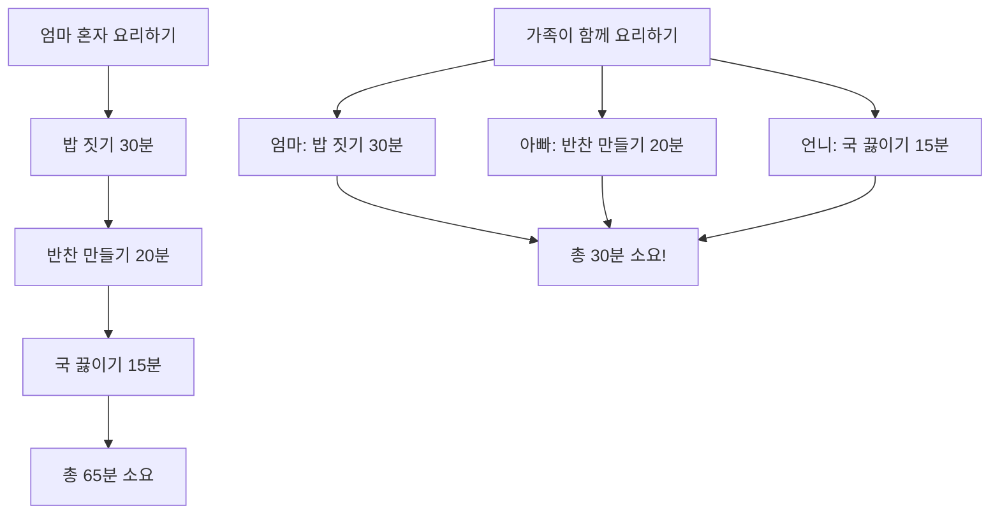
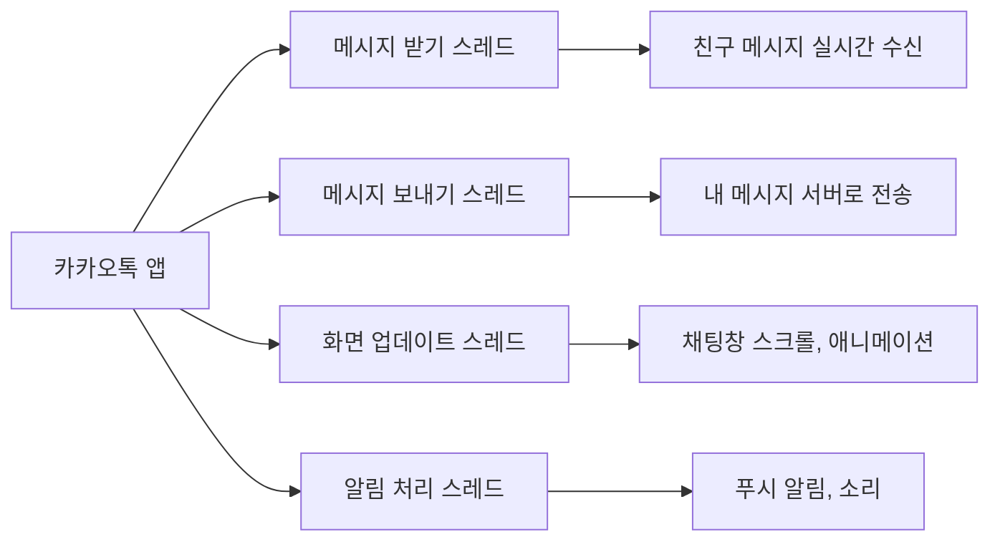
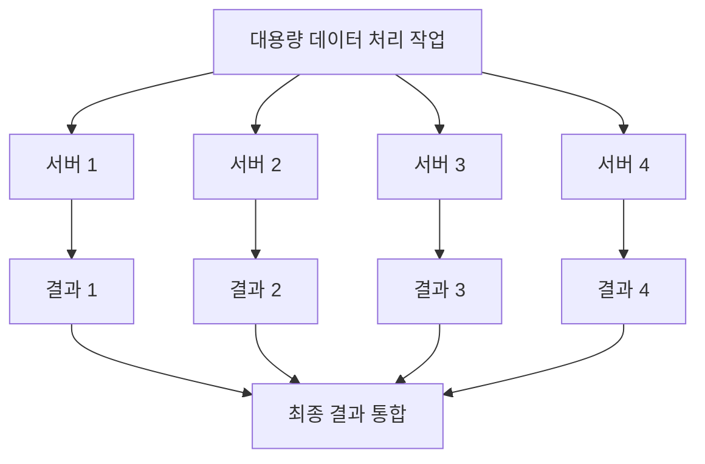
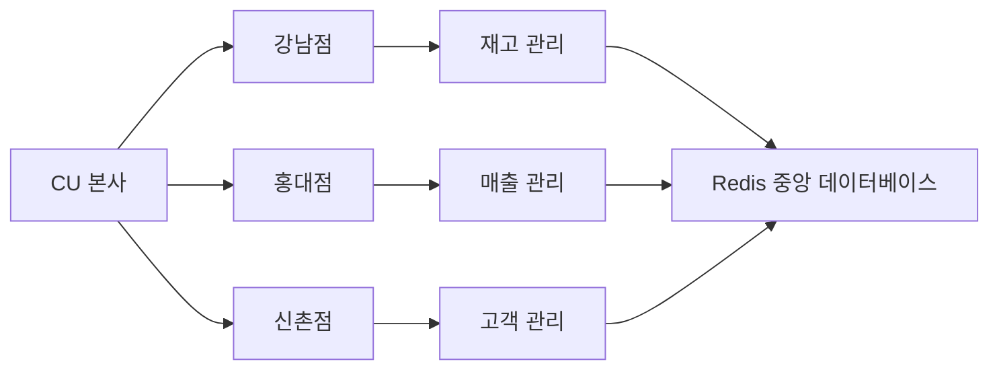
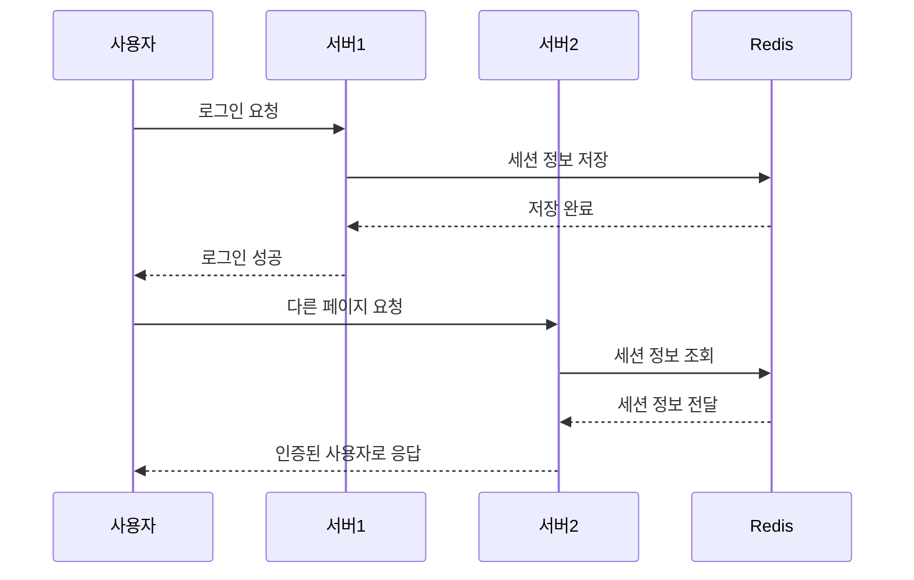
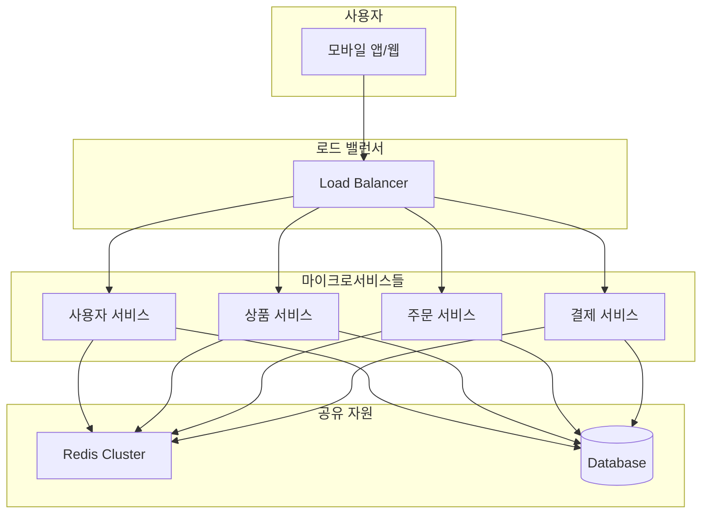
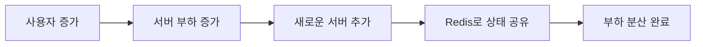
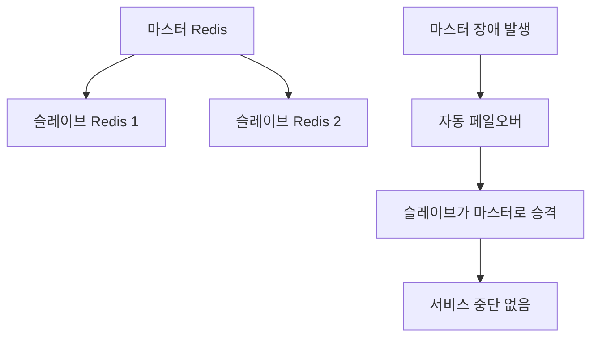

# 🚀 자바 스레드와 분산처리 완벽 가이드

> **클라우드 엔지니어를 꿈꾸는 자바 초보자를 위한 친절한 안내서**

---

## 📚 목차
1. [스레드란 무엇인가?](#스레드란-무엇인가)
2. [왜 스레드가 중요한가?](#왜-스레드가-중요한가)
3. [스레드 실생활 예제](#스레드-실생활-예제)
4. [자바에서 스레드 사용하기](#자바에서-스레드-사용하기)
5. [분산처리와 Redis](#분산처리와-redis)
6. [클라우드 환경에서의 활용](#클라우드-환경에서의-활용)

---

## 🧵 스레드란 무엇인가?

**스레드(Thread)**는 프로그램 안에서 동시에 여러 가지 일을 할 수 있게 해주는 기술입니다.

### 🏠 실생활 비유로 이해하기

집에서 요리하는 상황을 생각해보세요:



- **싱글 스레드**: 엄마 혼자 모든 요리를 순서대로 (65분)
- **멀티 스레드**: 가족이 함께 동시에 요리하기 (30분)

---

## 🎯 왜 스레드가 중요한가?

### 1️⃣ **성능 향상**
- 여러 작업을 동시에 처리하여 시간 단축
- CPU를 효율적으로 사용

### 2️⃣ **사용자 경험 개선**
- 앱이 멈추지 않고 부드럽게 동작
- 파일 다운로드 중에도 다른 기능 사용 가능

### 3️⃣ **서버 처리 능력 증대**
- 많은 사용자의 요청을 동시에 처리
- 웹 서비스의 응답 속도 향상

---

## 🌟 스레드 실생활 예제

### 📱 카카오톡 메신저 예제



**만약 스레드가 없다면?**
- 메시지를 보내는 동안 새 메시지 받기 불가능
- 화면이 멈춰서 스크롤도 안 됨
- 매우 불편한 사용자 경험!

---

## 💻 자바에서 스레드 사용하기

### 기본 스레드 생성 방법

```java
// 방법 1: Thread 클래스 상속
class MyThread extends Thread {
    public void run() {
        System.out.println("새로운 스레드에서 실행 중!");
    }
}

// 방법 2: Runnable 인터페이스 구현 (추천)
class MyTask implements Runnable {
    public void run() {
        System.out.println("작업 실행 중!");
    }
}

// 사용법
public class ThreadExample {
    public static void main(String[] args) {
        // 방법 1 사용
        MyThread thread1 = new MyThread();
        thread1.start();
        
        // 방법 2 사용
        Thread thread2 = new Thread(new MyTask());
        thread2.start();
    }
}
```

### 🍕 피자 주문 처리 시스템 예제

```java
class PizzaOrderProcessor implements Runnable {
    private String customerName;
    
    public PizzaOrderProcessor(String name) {
        this.customerName = name;
    }
    
    public void run() {
        System.out.println(customerName + "님의 주문 처리 시작");
        
        try {
            Thread.sleep(3000); // 피자 만드는 시간 (3초)
        } catch (InterruptedException e) {
            e.printStackTrace();
        }
        
        System.out.println(customerName + "님의 피자 완성!");
    }
}

public class PizzaShop {
    public static void main(String[] args) {
        // 동시에 여러 주문 처리
        Thread order1 = new Thread(new PizzaOrderProcessor("김철수"));
        Thread order2 = new Thread(new PizzaOrderProcessor("이영희"));
        Thread order3 = new Thread(new PizzaOrderProcessor("박민수"));
        
        order1.start();
        order2.start();
        order3.start();
        
        // 3개 주문이 동시에 처리됨!
    }
}
```

---

## 🌐 분산처리와 Redis

### 분산처리란?

하나의 큰 일을 여러 컴퓨터가 나누어서 처리하는 것입니다.



### 🏪 편의점 체인점 비유



- **본사 = 메인 서버**
- **각 지점 = 분산된 서버들**
- **Redis = 모든 지점이 공유하는 중앙 창고**

---

## 📊 Redis를 활용한 분산처리

### Redis란?
- **Re**mote **Di**ctionary **S**erver
- 메모리에 데이터를 저장하는 고속 데이터베이스
- 여러 서버가 공유할 수 있는 중앙 저장소 역할

### 실무에서의 활용 예



### 🛒 쇼핑몰 장바구니 시스템 예제

```java
// Redis를 활용한 장바구니 관리
public class ShoppingCartService {
    private RedisTemplate<String, Object> redisTemplate;
    
    // 장바구니에 상품 추가
    public void addToCart(String userId, String productId, int quantity) {
        String key = "cart:" + userId;
        redisTemplate.opsForHash().put(key, productId, quantity);
        
        // 24시간 후 자동 삭제
        redisTemplate.expire(key, 24, TimeUnit.HOURS);
    }
    
    // 장바구니 조회
    public Map<String, Integer> getCart(String userId) {
        String key = "cart:" + userId;
        return redisTemplate.opsForHash().entries(key);
    }
}
```

**장점:**
- 🚀 **빠른 속도**: 메모리에서 데이터 처리
- 🔄 **서버 간 공유**: 어느 서버에 접속해도 같은 장바구니
- ⏰ **자동 만료**: 불필요한 데이터 자동 정리

---

## ☁️ 클라우드 환경에서의 활용

### 마이크로서비스 아키텍처



### 실무 활용 시나리오

#### 1️⃣ **세션 클러스터링**
```java
// 여러 서버가 사용자 로그인 상태 공유
@Service
public class SessionService {
    public void createSession(String userId, String sessionId) {
        // Redis에 세션 정보 저장
        redisTemplate.opsForValue().set(
            "session:" + sessionId, 
            userId, 
            30, TimeUnit.MINUTES
        );
    }
}
```

#### 2️⃣ **캐싱으로 성능 향상**
```java
@Service
public class ProductService {
    
    @Cacheable(value = "products", key = "#productId")
    public Product getProduct(Long productId) {
        // 첫 번째 요청시에만 DB 조회
        // 이후 요청은 Redis에서 빠르게 응답
        return productRepository.findById(productId);
    }
}
```

#### 3️⃣ **분산 락으로 동시성 제어**
```java
@Service
public class InventoryService {
    
    public boolean purchaseProduct(Long productId, int quantity) {
        // 재고 차감시 동시성 문제 해결
        String lockKey = "lock:product:" + productId;
        
        try (RLock lock = redisson.getLock(lockKey)) {
            if (lock.tryLock(5, TimeUnit.SECONDS)) {
                // 안전하게 재고 차감 처리
                return processInventory(productId, quantity);
            }
            return false;
        }
    }
}
```

---

## 🎯 클라우드 엔지니어로서 알아야 할 핵심 포인트

### 1️⃣ **확장성 (Scalability)**


### 2️⃣ **고가용성 (High Availability)**


### 3️⃣ **모니터링과 로깅**
```java
@Component
public class PerformanceMonitor {
    
    @EventListener
    public void logSlowQueries(SlowQueryEvent event) {
        // 느린 쿼리 감지 및 알림
        if (event.getExecutionTime() > 1000) {
            log.warn("Slow query detected: {} ms", 
                    event.getExecutionTime());
        }
    }
}
```

---

## 📝 정리 및 다음 단계

### ✅ 오늘 배운 것들
- **스레드**: 동시에 여러 작업을 처리하는 기술
- **분산처리**: 여러 서버가 협력하여 큰 작업 처리
- **Redis**: 고속 메모리 데이터베이스로 서버 간 데이터 공유
- **클라우드 활용**: 확장 가능하고 안정적인 시스템 구축

### 🚀 다음 학습 추천
1. **Spring Boot**로 REST API 만들기
2. **Docker**로 애플리케이션 컨테이너화
3. **Kubernetes**로 컨테이너 오케스트레이션
4. **AWS/GCP/Azure** 클라우드 서비스 활용
5. **모니터링 도구** (Prometheus, Grafana) 학습

### 💡 실습 프로젝트 아이디어
- 간단한 채팅 애플리케이션 (WebSocket + Redis)
- 쇼핑몰 장바구니 시스템 (Spring Boot + Redis)
- 파일 업로드/다운로드 시스템 (멀티스레드 활용)

---

## 🎉 마무리

클라우드 엔지니어의 길은 처음엔 복잡해 보이지만, 하나씩 차근차근 배워나가면 충분히 달성할 수 있습니다! 

**기억하세요:**
- 🧵 **스레드**로 동시 처리 능력 향상
- 🌐 **분산처리**로 확장 가능한 시스템 구축  
- 📊 **Redis**로 고성능 데이터 공유
- ☁️ **클라우드**로 안정적인 인프라 운영

화이팅! 💪
