# JDBC DAO/DTO 패턴 완전 가이드

## 📋 목차
1. [프로젝트 개요](#프로젝트-개요)
2. [아키텍처 다이어그램](#아키텍처-다이어그램)
3. [프로젝트 설정 (pom.xml)](#프로젝트-설정-pomxml)
4. [데이터베이스 스키마](#데이터베이스-스키마)
5. [DTO (Data Transfer Object)](#dto-data-transfer-object)
6. [DAO (Data Access Object) 인터페이스](#dao-data-access-object-인터페이스)
7. [데이터베이스 연결 유틸리티](#데이터베이스-연결-유틸리티)
8. [DAO 구현체 (JDBC)](#dao-구현체-jdbc)
9. [서블릿 구현](#서블릿-구현)
10. [JSP 뷰](#jsp-뷰)
11. [테스트 실행](#테스트-실행)
12. [Docker 배포](#docker-배포)

---

## 프로젝트 개요

이 프로젝트는 **JDBC 기반의 DAO/DTO 패턴**을 학습하기 위한 메모 애플리케이션입니다.

### 🎯 학습 목표
- **DTO(Data Transfer Object)**: 계층 간 데이터 전달 전용 불변 객체
- **DAO(Data Access Object)**: 영속 계층에 대한 추상 인터페이스
- **PreparedStatement**: SQL Injection 공격 차단
- **인터페이스 분리**: 나중에 JPA로 교체 용이성

### 🔧 주요 기술 스택
- Java 17 (record 사용)
- Maven
- MySQL JDBC Driver
- Jakarta Servlet/JSP
- dotenv-java (환경변수 관리)

---

## 아키텍처 다이어그램

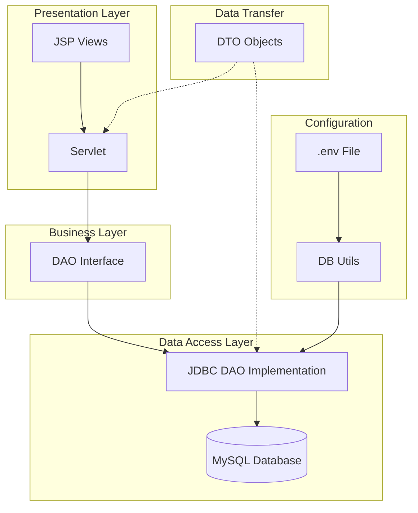

---

## 프로젝트 설정 (pom.xml)

```xml
<project xmlns="http://maven.apache.org/POM/4.0.0"
         xmlns:xsi="http://www.w3.org/2001/XMLSchema-instance"
         xsi:schemaLocation="http://maven.apache.org/POM/4.0.0
         http://maven.apache.org/xsd/maven-4.0.0.xsd">
    
    <!-- Maven 프로젝트 기본 정보 -->
    <modelVersion>4.0.0</modelVersion>
    <groupId>dev.example</groupId>        <!-- 조직/그룹 식별자 -->
    <artifactId>memo-app</artifactId>     <!-- 프로젝트 이름 -->
    <version>1.0.0</version>              <!-- 버전 정보 -->
    <packaging>war</packaging>            <!-- 웹 애플리케이션 패키징 형식 -->
    
    <!-- Java 컴파일 설정 -->
    <properties>
        <maven.compiler.source>17</maven.compiler.source>    <!-- 소스 Java 버전 -->
        <maven.compiler.target>17</maven.compiler.target>    <!-- 타겟 Java 버전 -->
        <project.build.sourceEncoding>UTF-8</project.build.sourceEncoding>
    </properties>
    
    <dependencies>
        <!-- MySQL 데이터베이스 연결 드라이버 -->
        <dependency>
            <groupId>com.mysql</groupId>
            <artifactId>mysql-connector-j</artifactId>
            <version>9.4.0</version>
        </dependency>
        
        <!-- 환경변수 파일(.env) 관리 라이브러리 -->
        <dependency>
            <groupId>io.github.cdimascio</groupId>
            <artifactId>dotenv-java</artifactId>
            <version>3.2.0</version>
        </dependency>
        
        <!-- 서블릿 API (Tomcat이 런타임에 제공하므로 provided) -->
        <dependency>
            <groupId>jakarta.servlet</groupId>
            <artifactId>jakarta.servlet-api</artifactId>
            <version>6.1.0</version>
            <scope>provided</scope>
        </dependency>
        
        <!-- JSP API (개발 환경에서 IDE 지원용) -->
        <dependency>
            <groupId>jakarta.servlet.jsp</groupId>
            <artifactId>jakarta.servlet.jsp-api</artifactId>
            <version>3.1.1</version>
            <scope>provided</scope>
        </dependency>
    </dependencies>
    
    <build>
        <plugins>
            <!-- WAR 파일 생성 플러그인 -->
            <plugin>
                <groupId>org.apache.maven.plugins</groupId>
                <artifactId>maven-war-plugin</artifactId>
                <version>3.4.0</version>
            </plugin>
        </plugins>
    </build>
</project>
```

---

## 데이터베이스 스키마

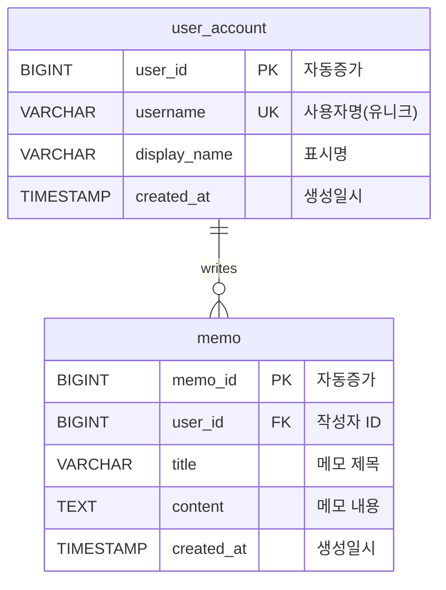

### 🗄️ DDL/DML SQL

```sql
-- 테이블 초기화 (기존 테이블 삭제)
DROP TABLE IF EXISTS memo;
DROP TABLE IF EXISTS user_account;

-- 사용자 테이블 생성
CREATE TABLE user_account (
    user_id BIGINT PRIMARY KEY AUTO_INCREMENT,     -- 기본키, 자동증가
    username VARCHAR(50) NOT NULL UNIQUE,          -- 사용자명, 중복불가
    display_name VARCHAR(80) NOT NULL,             -- 표시명
    created_at TIMESTAMP NOT NULL DEFAULT CURRENT_TIMESTAMP  -- 생성일시
) ENGINE=InnoDB;

-- 메모 테이블 생성
CREATE TABLE memo (
    memo_id BIGINT PRIMARY KEY AUTO_INCREMENT,     -- 기본키, 자동증가
    user_id BIGINT NOT NULL,                       -- 작성자 ID
    title VARCHAR(200) NOT NULL,                   -- 메모 제목
    content TEXT NOT NULL,                         -- 메모 내용
    created_at TIMESTAMP NOT NULL DEFAULT CURRENT_TIMESTAMP,  -- 생성일시
    FOREIGN KEY (user_id) REFERENCES user_account(user_id)    -- 외래키
) ENGINE=InnoDB;

-- 샘플 데이터 삽입
INSERT INTO user_account (username, display_name) VALUES 
('alice', 'Alice Kim'), 
('bob', 'Bob Lee');

INSERT INTO memo (user_id, title, content) VALUES 
(1, '첫 메모', '알리스의 첫 번째 메모 본문'),
(1, '둘째 메모', '알리스의 두 번째 메모'),
(2, '밥의 메모', '밥의 유일한 메모');

-- JOIN 쿼리 예시 (작성자 이름과 함께 메모 목록)
SELECT m.memo_id, m.title, m.content, m.created_at,
       u.user_id, u.username, u.display_name
FROM memo m
JOIN user_account u ON u.user_id = m.user_id
ORDER BY m.memo_id DESC;
```

---

## DTO (Data Transfer Object)

**DTO란?** 계층 간 데이터 전달을 위한 불변 객체입니다. Java 17의 `record`를 사용하여 간결하게 정의합니다.

### 📝 DTO 구조 다이어그램

```mermaid
classDiagram
    class UserDTO {
        +Long userId
        +String username
        +String displayName
        +LocalDateTime createdAt
    }
    
    class MemoDTO {
        +Long memoId
        +Long userId
        +String title
        +String content
        +LocalDateTime createdAt
    }
    
    class MemoWithAuthorDTO {
        +Long memoId
        +String title
        +String content
        +LocalDateTime memoCreatedAt
        +Long authorId
        +String authorUsername
        +String authorDisplayName
    }
    
    UserDTO ||--o{ MemoDTO : "writes"
    MemoDTO ||--|| MemoWithAuthorDTO : "joins with"
```

### 💻 DTO 코드 구현

```java
import java.time.LocalDateTime;

// 사용자 정보를 담는 DTO
public record UserDTO(
    Long userId,                    // 사용자 고유 ID
    String username,               // 사용자명 (로그인 ID)
    String displayName,           // 화면에 표시할 이름
    LocalDateTime createdAt       // 계정 생성일시
) {}

// 메모 정보를 담는 DTO
public record MemoDTO(
    Long memoId,                  // 메모 고유 ID
    Long userId,                  // 작성자 ID (외래키)
    String title,                 // 메모 제목
    String content,               // 메모 내용
    LocalDateTime createdAt       // 메모 작성일시
) {}

// 메모와 작성자 정보를 함께 담는 JOIN 결과 DTO
public record MemoWithAuthorDTO(
    Long memoId,                  // 메모 ID
    String title,                 // 메모 제목
    String content,               // 메모 내용
    LocalDateTime memoCreatedAt,  // 메모 작성일시
    Long authorId,                // 작성자 ID
    String authorUsername,        // 작성자 사용자명
    String authorDisplayName      // 작성자 표시명
) {}
```

**📌 Record 사용 이유:**
- 불변성 보장 (모든 필드가 final)
- 자동으로 생성자, getter, equals(), hashCode(), toString() 제공
- 간결한 코드로 가독성 향상

---

## DAO (Data Access Object) 인터페이스

**DAO란?** 데이터베이스 접근을 추상화한 인터페이스입니다. 구현체를 JDBC에서 JPA로 교체해도 서비스 계층 코드는 변경되지 않습니다.

### 🔄 DAO 흐름도

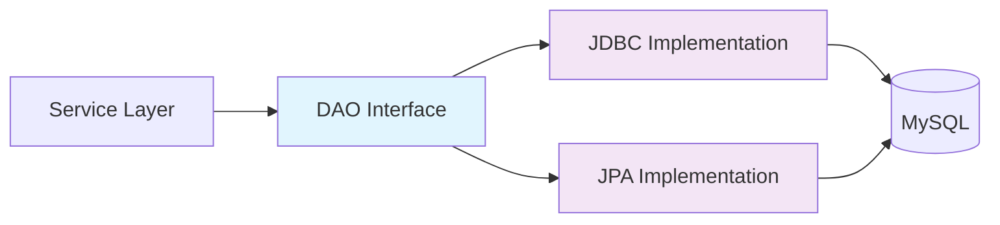

### 💻 DAO 인터페이스 코드

```java
import java.util.List;
import java.util.Optional;

// 사용자 데이터 접근 인터페이스
public interface UserDAO {
    
    // 새 사용자 생성, 생성된 사용자 ID 반환
    Long create(String username, String displayName);
    
    // ID로 사용자 조회 (없으면 Optional.empty())
    Optional<UserDTO> findById(Long userId);
    
    // 사용자명으로 조회 (로그인 등에 사용)
    Optional<UserDTO> findByUsername(String username);
    
    // 전체 사용자 목록 조회 (페이징 처리)
    List<UserDTO> findAll(int limit, int offset);
}

// 메모 데이터 접근 인터페이스
public interface MemoDAO {
    
    // 새 메모 작성, 생성된 메모 ID 반환
    Long create(Long userId, String title, String content);
    
    // ID로 메모 조회
    Optional<MemoDTO> findById(Long memoId);
    
    // 특정 사용자의 메모 목록 조회
    List<MemoDTO> findByUserId(Long userId, int limit, int offset);
    
    // 모든 메모를 작성자 정보와 함께 조회 (JOIN)
    List<MemoWithAuthorDTO> findAllWithAuthor(int limit, int offset);
    
    // 메모 삭제, 삭제된 행 수 반환
    int deleteById(Long memoId);
}
```

**📌 인터페이스 설계 원칙:**
- **단일 책임**: 각 DAO는 하나의 엔티티만 담당
- **추상화**: 구현 기술(JDBC, JPA)에 독립적
- **표준 메서드 네이밍**: create, find, delete 등 일관된 명명

---

## 데이터베이스 연결 유틸리티

환경변수를 통해 안전하게 DB 연결 정보를 관리하는 유틸리티 클래스입니다.

### 🔐 환경변수 설정 (.env 파일)

```bash
# 데이터베이스 연결 정보
DB_URL=jdbc:mysql://localhost:3306/memo_db?allowPublicKeyRetrieval=true
DB_USER=memo_user
DB_PASSWORD=secure_password123
```

### 💻 DB 연결 유틸리티 코드

```java
import io.github.cdimascio.dotenv.Dotenv;
import java.sql.Connection;
import java.sql.DriverManager;
import java.sql.SQLException;

public class DB {
    // .env 파일에서 환경변수 로드
    private static final Dotenv dotenv = Dotenv.load();
    
    // 환경변수에서 DB 연결 정보 읽기
    private static final String URL = dotenv.get("DB_URL");
    private static final String USER = dotenv.get("DB_USER");
    private static final String PASSWORD = dotenv.get("DB_PASSWORD");
    
    /**
     * 데이터베이스 연결 생성
     * @return Connection 객체
     * @throws SQLException DB 연결 실패 시
     */
    public static Connection getConnection() throws SQLException {
        return DriverManager.getConnection(URL, USER, PASSWORD);
    }
}
```

**📌 보안 고려사항:**
- `.env` 파일은 버전 관리(Git)에서 제외
- 프로덕션에서는 커넥션 풀(HikariCP) 사용 권장
- `allowPublicKeyRetrieval=true`는 Aiven MySQL 등에서 필요

---

## DAO 구현체 (JDBC)

실제 데이터베이스와 통신하는 JDBC 기반 구현체입니다.

### 🔄 JDBC 처리 흐름

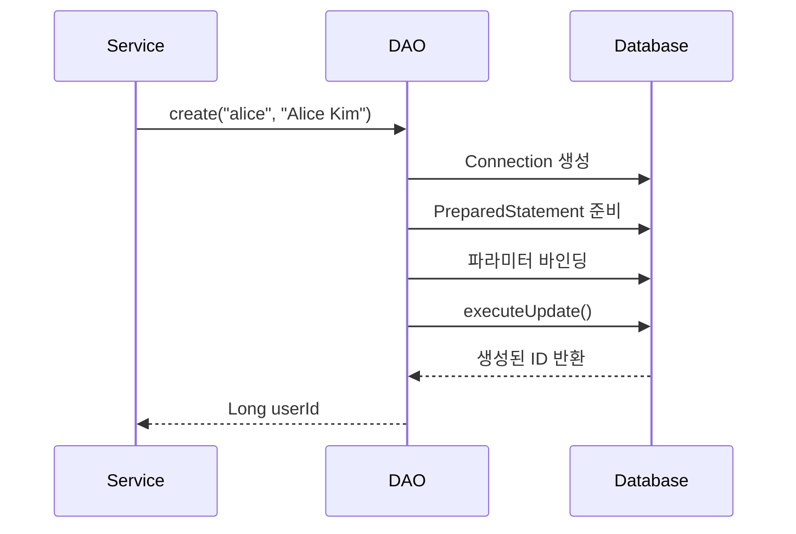

### 💻 UserJdbcDAO 구현

```java
import java.sql.*;
import java.util.ArrayList;
import java.util.List;
import java.util.Optional;

public class UserJdbcDAO implements UserDAO {
    
    @Override
    public Long create(String username, String displayName) {
        // SQL INSERT 쿼리 (Java 17 Text Blocks 사용)
        final String sql = """
            INSERT INTO user_account (username, display_name) 
            VALUES (?, ?)
            """;
        
        // try-with-resources로 자동 자원 해제
        try (Connection conn = DB.getConnection();
             PreparedStatement ps = conn.prepareStatement(sql, Statement.RETURN_GENERATED_KEYS)) {
            
            // 파라미터 바인딩 (SQL Injection 방지)
            ps.setString(1, username);      // 첫 번째 ? 에 username 대입
            ps.setString(2, displayName);   // 두 번째 ? 에 displayName 대입
            
            // INSERT 실행
            int updated = ps.executeUpdate();
            if (updated != 1) {
                throw new SQLException("Insert failed for user_account");
            }
            
            // 자동 생성된 키(user_id) 조회
            try (ResultSet rs = ps.getGeneratedKeys()) {
                if (rs.next()) {
                    return rs.getLong(1);    // 생성된 ID 반환
                }
            }
            
            throw new SQLException("No generated key returned for user_account");
            
        } catch (SQLException e) {
            // 체크 예외를 런타임 예외로 변환
            throw new RuntimeException("UserJdbcDAO.create error", e);
        }
    }
    
    @Override
    public Optional<UserDTO> findById(Long userId) {
        final String sql = """
            SELECT user_id, username, display_name, created_at
            FROM user_account 
            WHERE user_id = ?
            """;
        
        try (Connection conn = DB.getConnection();
             PreparedStatement ps = conn.prepareStatement(sql)) {
            
            ps.setLong(1, userId);          // 파라미터 바인딩
            
            try (ResultSet rs = ps.executeQuery()) {
                if (rs.next()) {
                    // 결과가 있으면 DTO로 변환하여 Optional로 감싸기
                    return Optional.of(mapUser(rs));
                }
                // 결과가 없으면 빈 Optional 반환
                return Optional.empty();
            }
            
        } catch (SQLException e) {
            throw new RuntimeException("UserJdbcDAO.findById error", e);
        }
    }
    
    @Override
    public Optional<UserDTO> findByUsername(String username) {
        final String sql = """
            SELECT user_id, username, display_name, created_at
            FROM user_account 
            WHERE username = ?
            """;
        
        try (Connection conn = DB.getConnection();
             PreparedStatement ps = conn.prepareStatement(sql)) {
            
            ps.setString(1, username);
            
            try (ResultSet rs = ps.executeQuery()) {
                if (rs.next()) {
                    return Optional.of(mapUser(rs));
                }
                return Optional.empty();
            }
            
        } catch (SQLException e) {
            throw new RuntimeException("UserJdbcDAO.findByUsername error", e);
        }
    }
    
    @Override
    public List<UserDTO> findAll(int limit, int offset) {
        final String sql = """
            SELECT user_id, username, display_name, created_at
            FROM user_account 
            ORDER BY user_id DESC 
            LIMIT ? OFFSET ?
            """;
        
        try (Connection conn = DB.getConnection();
             PreparedStatement ps = conn.prepareStatement(sql)) {
            
            ps.setInt(1, limit);            // 조회할 최대 행 수
            ps.setInt(2, offset);           // 건너뛸 행 수 (페이징)
            
            try (ResultSet rs = ps.executeQuery()) {
                List<UserDTO> list = new ArrayList<>();
                
                // 결과 집합을 순회하며 DTO 리스트 생성
                while (rs.next()) {
                    list.add(mapUser(rs));
                }
                
                return list;
            }
            
        } catch (SQLException e) {
            throw new RuntimeException("UserJdbcDAO.findAll error", e);
        }
    }
    
    /**
     * ResultSet의 한 행을 UserDTO로 변환하는 헬퍼 메서드
     */
    private UserDTO mapUser(ResultSet rs) throws SQLException {
        return new UserDTO(
            rs.getLong("user_id"),                              // BIGINT -> Long
            rs.getString("username"),                           // VARCHAR -> String
            rs.getString("display_name"),                       // VARCHAR -> String
            rs.getTimestamp("created_at").toLocalDateTime()     // TIMESTAMP -> LocalDateTime
        );
    }
}
```

### 💻 MemoJdbcDAO 구현

```java
public class MemoJdbcDAO implements MemoDAO {
    
    @Override
    public Long create(Long userId, String title, String content) {
        final String sql = """
            INSERT INTO memo (user_id, title, content) 
            VALUES (?, ?, ?)
            """;
        
        try (Connection conn = DB.getConnection();
             PreparedStatement ps = conn.prepareStatement(sql, Statement.RETURN_GENERATED_KEYS)) {
            
            // 3개 파라미터 바인딩
            ps.setLong(1, userId);      // 작성자 ID
            ps.setString(2, title);     // 메모 제목
            ps.setString(3, content);   // 메모 내용
            
            int updated = ps.executeUpdate();
            if (updated != 1) {
                throw new SQLException("Insert failed for memo");
            }
            
            // 생성된 memo_id 반환
            try (ResultSet rs = ps.getGeneratedKeys()) {
                if (rs.next()) {
                    return rs.getLong(1);
                }
            }
            
            throw new SQLException("No generated key returned for memo");
            
        } catch (SQLException e) {
            throw new RuntimeException("MemoJdbcDAO.create error", e);
        }
    }
    
    @Override
    public Optional<MemoDTO> findById(Long memoId) {
        final String sql = """
            SELECT memo_id, user_id, title, content, created_at
            FROM memo 
            WHERE memo_id = ?
            """;
        
        try (Connection conn = DB.getConnection();
             PreparedStatement ps = conn.prepareStatement(sql)) {
            
            ps.setLong(1, memoId);
            
            try (ResultSet rs = ps.executeQuery()) {
                if (rs.next()) {
                    return Optional.of(mapMemo(rs));
                }
                return Optional.empty();
            }
            
        } catch (SQLException e) {
            throw new RuntimeException("MemoJdbcDAO.findById error", e);
        }
    }
    
    @Override
    public List<MemoDTO> findByUserId(Long userId, int limit, int offset) {
        final String sql = """
            SELECT memo_id, user_id, title, content, created_at
            FROM memo 
            WHERE user_id = ? 
            ORDER BY memo_id DESC 
            LIMIT ? OFFSET ?
            """;
        
        try (Connection conn = DB.getConnection();
             PreparedStatement ps = conn.prepareStatement(sql)) {
            
            ps.setLong(1, userId);      // 특정 사용자의 메모만 조회
            ps.setInt(2, limit);
            ps.setInt(3, offset);
            
            try (ResultSet rs = ps.executeQuery()) {
                List<MemoDTO> list = new ArrayList<>();
                
                while (rs.next()) {
                    list.add(mapMemo(rs));
                }
                
                return list;
            }
            
        } catch (SQLException e) {
            throw new RuntimeException("MemoJdbcDAO.findByUserId error", e);
        }
    }
    
    @Override
    public List<MemoWithAuthorDTO> findAllWithAuthor(int limit, int offset) {
        // INNER JOIN을 사용하여 메모와 작성자 정보를 함께 조회
        final String sql = """
            SELECT m.memo_id, m.title, m.content, m.created_at,
                   u.user_id, u.username, u.display_name
            FROM memo m 
            INNER JOIN user_account u ON u.user_id = m.user_id
            ORDER BY m.memo_id DESC 
            LIMIT ? OFFSET ?
            """;
        
        try (Connection conn = DB.getConnection();
             PreparedStatement ps = conn.prepareStatement(sql)) {
            
            ps.setInt(1, limit);
            ps.setInt(2, offset);
            
            try (ResultSet rs = ps.executeQuery()) {
                List<MemoWithAuthorDTO> list = new ArrayList<>();
                
                while (rs.next()) {
                    list.add(mapMemoWithAuthor(rs));
                }
                
                return list;
            }
            
        } catch (SQLException e) {
            throw new RuntimeException("MemoJdbcDAO.findAllWithAuthor error", e);
        }
    }
    
    @Override
    public int deleteById(Long memoId) {
        final String sql = "DELETE FROM memo WHERE memo_id = ?";
        
        try (Connection conn = DB.getConnection();
             PreparedStatement ps = conn.prepareStatement(sql)) {
            
            ps.setLong(1, memoId);
            
            // 삭제된 행의 개수 반환 (0이면 해당 ID의 메모가 없었음)
            return ps.executeUpdate();
            
        } catch (SQLException e) {
            throw new RuntimeException("MemoJdbcDAO.deleteById error", e);
        }
    }
    
    /**
     * ResultSet의 한 행을 MemoDTO로 변환
     */
    private MemoDTO mapMemo(ResultSet rs) throws SQLException {
        return new MemoDTO(
            rs.getLong("memo_id"),
            rs.getLong("user_id"),
            rs.getString("title"),
            rs.getString("content"),
            rs.getTimestamp("created_at").toLocalDateTime()
        );
    }
    
    /**
     * JOIN 결과를 MemoWithAuthorDTO로 변환
     */
    private MemoWithAuthorDTO mapMemoWithAuthor(ResultSet rs) throws SQLException {
        return new MemoWithAuthorDTO(
            rs.getLong("memo_id"),                  // 메모 정보
            rs.getString("title"),
            rs.getString("content"),
            rs.getTimestamp("created_at").toLocalDateTime(),
            rs.getLong("user_id"),                  // 작성자 정보
            rs.getString("username"),
            rs.getString("display_name")
        );
    }
}
```

**📌 JDBC 구현의 핵심 원칙:**
- **try-with-resources**: Connection, PreparedStatement, ResultSet 자동 해제
- **PreparedStatement**: SQL Injection 공격 방지를 위한 파라미터 바인딩
- **예외 처리**: 체크 예외를 런타임 예외로 변환하여 호출자에게 전파
- **매퍼 메서드**: ResultSet → DTO 변환 로직 분리

---

## 서블릿 구현

웹 요청을 처리하고 DAO와 JSP를 연결하는 컨트롤러 역할입니다.

### 🌐 서블릿 처리 흐름

```
mermaid
sequenceDiagram
    participant B as 🖥️ Browser
    participant S as 🌐 Servlet (Controller)
    participant D as 📦 DAO
    participant DB as 🗄️ Database
    participant J as 📄 JSP (View)

    B->>S: GET /memos 요청
    S->>D: findByUserId(userId)
    D->>DB: SELECT * FROM memos WHERE user_id=?
    DB-->>D: ResultSet (메모 목록)
    D-->>S: List<MemoDTO>
    S-->>J: request.setAttribute("memos", list)
    J-->>B: HTML 렌더링 결과 응답
```

### 📝 흐름 설명

1. **브라우저**가 `/memos` 요청을 보냅니다.
2. **서블릿**이 요청을 받아 해당 유저 ID에 맞는 데이터를 가져오기 위해 DAO 호출.
3. **DAO**는 DB에 `SELECT` 쿼리를 수행하여 결과(ResultSet)를 받습니다.
4. DAO는 결과를 DTO(List 형태)로 가공해 서블릿으로 반환합니다.
5. 서블릿은 JSP에 데이터를 전달(`setAttribute`)합니다.
6. **JSP**는 받은 데이터를 HTML로 변환하여 브라우저에 응답합니다.


---


# 🌟 HTML 태그와 속성 완벽 가이드


---

## 🗂️ 목차

| 섹션 | 내용 | 난이도 |
|------|------|--------|
| [🎯 HTML이란?](#-html이란) | HTML 기본 개념 | ⭐ |
| [🏗️ 태그의 기본 구조](#️-html-태그의-기본-구조) | 태그 문법과 구조 | ⭐ |
| [📝 주요 HTML 태그들](#-주요-html-태그들) | 필수 태그 종류별 설명 | ⭐⭐ |
| [🎨 HTML 속성](#-html-속성attribute) | 속성의 개념과 활용 | ⭐⭐ |
| [💡 실전 예제](#-실전-예제) | 실제 웹페이지 만들기 | ⭐⭐⭐ |
| [📊 시각화 자료](#-태그와-속성-관계도) | 구조 다이어그램 | ⭐⭐ |

---

## 🎯 HTML이란?

> **HTML(HyperText Markup Language)** 은 웹페이지의 **뼈대**를 만드는 언어입니다.

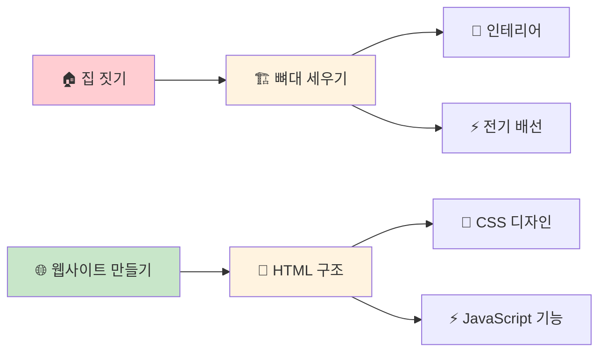

### 🔍 HTML의 특징

| 특징 | 설명 | 예시 |
|------|------|------|
| 🏷️ **마크업 언어** | 내용에 의미를 부여 | `<h1>제목</h1>` |
| 🌐 **웹 표준** | 모든 브라우저에서 동작 | Chrome, Safari, Firefox |
| 📱 **반응형** | 다양한 기기에서 호환 | PC, 모바일, 태블릿 |
| ♿ **접근성** | 모든 사용자가 이용 가능 | 스크린 리더 지원 |

---

## 🏗️ HTML 태그의 기본 구조

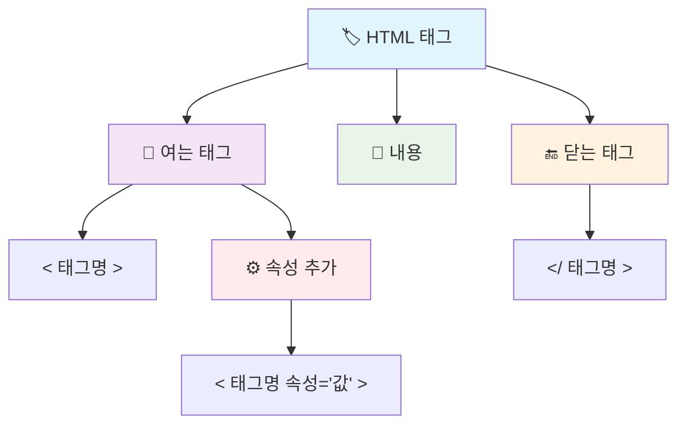

### 📝 기본 문법 패턴

```html
<!-- ✨ 기본 태그 구조 -->
<태그명>내용이 여기에 들어갑니다</태그명>

<!-- 🎨 속성이 있는 태그 -->
<태그명 속성명="속성값" 속성명2="속성값2">내용</태그명>

<!-- 🚀 단독 태그 (내용이 없는 태그) -->
<태그명 속성명="속성값" />
```

> 💡 **팁**: 태그는 항상 `<`로 시작해서 `>`로 끝나며, 닫는 태그는 `/`를 포함합니다!

---

## 📝 주요 HTML 태그들

### 🏠 1. 문서 구조 태그

```html
<!DOCTYPE html>  <!-- 📋 HTML5 문서임을 브라우저에게 알려줌 -->
<html lang="ko"> <!-- 🌐 전체 HTML 문서의 시작, 한국어 설정 -->
  <head>         <!-- 🧠 문서의 메타데이터(정보) 영역 -->
    <meta charset="UTF-8">           <!-- 📝 한글 등 문자 표시 설정 -->
    <title>페이지 제목</title>        <!-- 🏷️ 브라우저 탭에 표시될 제목 -->
  </head>
  <body>         <!-- 👁️ 실제로 화면에 보여질 모든 내용 -->
    <!-- 여기에 보여질 내용들이 들어갑니다 -->
  </body>
</html>         <!-- 🏁 HTML 문서의 끝 -->
```

### ✍️ 2. 텍스트 관련 태그

```html
<!-- 🏆 제목 태그들 (h1이 가장 크고 중요, h6이 가장 작음) -->
<h1>🎯 메인 제목 (가장 중요한 제목)</h1>
<h2>📌 섹션 제목 (두 번째로 중요)</h2>
<h3>🔹 소제목 (세 번째로 중요)</h3>
<h4>▪️ 작은 제목</h4>
<h5>• 더 작은 제목</h5>
<h6>· 가장 작은 제목</h6>

<!-- 📄 문단과 줄바꿈 -->
<p>📝 이것은 하나의 완전한 문단입니다. 여러 문장이 모여서 하나의 주제를 다룹니다.</p>
<p>📝 이것은 또 다른 문단입니다.</p>

<p>줄바꿈이 필요한 곳에서<br />🔄 이렇게 새로운 줄로 넘어갑니다.</p>

<!-- ✨ 텍스트 강조 태그들 -->
<p>
    <strong>💪 정말 중요한 내용</strong> - 의미적으로 중요함을 표현
    <em>🎭 강조하고 싶은 내용</em> - 의미적으로 강조함을 표현
    <b>🔸 단순히 굵게 보이는 텍스트</b> - 시각적 효과만
    <i>🔸 단순히 기울어진 텍스트</i> - 시각적 효과만
</p>
```

### 🔗 3. 링크와 미디어 태그

```html
<!-- 🌐 다양한 종류의 링크들 -->
<a href="https://www.google.com" 
   target="_blank"                    <!-- 🆕 새 창에서 열기 -->
   title="구글 검색엔진">             <!-- 💭 마우스 올렸을 때 나타나는 설명 -->
   🔍 구글에서 검색하기
</a>

<a href="page2.html">📄 같은 사이트의 다른 페이지로 이동</a>
<a href="#section1">⬇️ 이 페이지의 특정 부분으로 점프</a>
<a href="mailto:contact@example.com">📧 이메일 보내기</a>
<a href="tel:010-1234-5678">📞 전화 걸기</a>

<!-- 🖼️ 이미지 태그 (내용이 없는 단독 태그) -->

     alt="바다 위로 지는 아름다운 노을" <!-- 🔤 이미지가 안 보일 때 대신 나타날 텍스트 -->
     width="400"                      <!-- 📏 이미지 가로 크기 (픽셀) -->
     height="300"                     <!-- 📏 이미지 세로 크기 (픽셀) -->
     title="제주도에서 촬영한 노을" /> <!-- 💭 마우스 올렸을 때 나타나는 설명 -->
```

### 📋 4. 목록 태그

```html
<!-- 🔸 순서가 없는 목록 (불릿 포인트로 표시) -->
<ul>
  <li>🍎 사과</li>      <!-- 각각의 목록 항목 -->
  <li>🍌 바나나</li>    <!-- 순서가 중요하지 않은 항목들 -->
  <li>🍊 오렌지</li>
</ul>

<!-- 🔢 순서가 있는 목록 (숫자로 표시) -->
<ol>
  <li>🌅 아침에 일어나기</li>     <!-- 1. 아침에 일어나기 -->
  <li>🦷 양치질하기</li>          <!-- 2. 양치질하기 -->
  <li>🍳 아침식사 준비하기</li>    <!-- 3. 아침식사 준비하기 -->
</ol>

<!-- 📝 특별한 순서 목록 (시작 번호 지정) -->
<ol start="5">                      <!-- 5번부터 시작 -->
  <li>🚀 다섯 번째 단계</li>       <!-- 5. 다섯 번째 단계 -->
  <li>⭐ 여섯 번째 단계</li>       <!-- 6. 여섯 번째 단계 -->
</ol>
```

### 📦 5. 컨테이너 태그

```html
<!-- 🧱 div: 블록 레벨 컨테이너 (세로로 쌓이는 상자) -->
<div class="content-box">             <!-- 💼 여러 요소들을 하나로 묶는 상자 -->
  <h2>📦 이 영역의 제목</h2>
  <p>📄 이 내용들은 모두 div 안에 들어있어서 하나의 그룹을 이룹니다.</p>
</div>

<!-- 🏷️ span: 인라인 컨테이너 (가로로 나열되는 작은 영역) -->
<p>이 문장에서 <span style="color: red;">🔴 이 부분만</span> 빨간색으로 표시됩니다.</p>
```

---

## 🎨 HTML 속성(Attribute)

> **속성**은 태그에게 "어떻게 동작해야 하는지" 알려주는 **설정값**입니다.

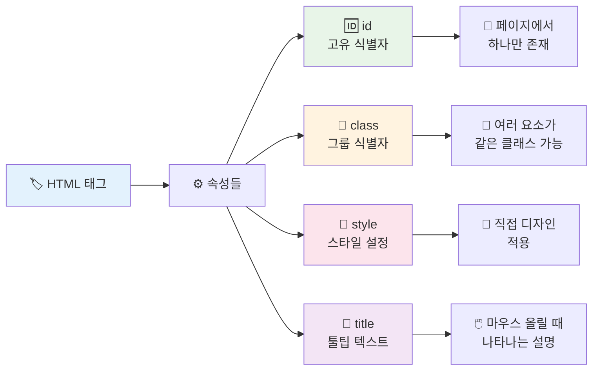

### 🌍 전역 속성 (모든 태그에서 사용 가능)

```html
<!-- 🆔 id: 페이지에서 유일한 식별자 -->
<div id="header">🎯 헤더 영역 (페이지에서 이 ID는 하나만 존재)</div>
<div id="main-content">📄 메인 콘텐츠 영역</div>

<!-- 👥 class: 같은 스타일을 적용할 요소들의 그룹명 -->
<p class="highlight">⭐ 중요한 첫 번째 문단</p>
<p class="highlight">⭐ 중요한 두 번째 문단</p>
<p class="normal">📝 일반적인 문단</p>

<!-- 🎨 style: 직접 디자인을 적용 -->
<p style="color: blue; font-size: 18px; background: yellow;">
  🎨 파란 글씨, 18픽셀 크기, 노란 배경
</p>

<!-- 💭 title: 마우스를 올렸을 때 나타나는 도움말 -->
<button title="이 버튼을 클릭하면 페이지가 새로고침됩니다">
  🔄 새로고침
</button>
```

### 🔗 링크 전용 속성

```html
<!-- 🌐 다양한 링크 속성들 -->
<a href="https://www.naver.com"       <!-- 🎯 이동할 주소 -->
   target="_blank"                    <!-- 🆕 새 창에서 열기 -->
   rel="noopener noreferrer"          <!-- 🔒 보안을 위한 설정 -->
   title="네이버 메인페이지로 이동"   <!-- 💭 링크 설명 -->
   download="네이버_바로가기.html">   <!-- 💾 다운로드 파일명 지정 -->
   📱 네이버로 이동하기
</a>
```

### 🖼️ 이미지 전용 속성

```html
<!-- 🖼️ 완벽한 이미지 태그 -->

     alt="제주도 해변의 황금빛 노을"  <!-- 🔤 이미지 설명 (시각 장애인용) -->
     width="500"                      <!-- 📏 가로 크기 500픽셀 -->
     height="300"                     <!-- 📏 세로 크기 300픽셀 -->
     loading="lazy"                   <!-- ⚡ 스크롤할 때만 로드 (성능 향상) -->
     title="제주도 여행 중 촬영" />   <!-- 💭 마우스 올렸을 때 추가 정보 -->
```

---

## 💡 실전 예제

### 🎨 나만의 자기소개 페이지 만들기

```html
<!DOCTYPE html>
<html lang="ko">                      <!-- 🇰🇷 한국어 페이지임을 명시 -->
<head>
    <meta charset="UTF-8">            <!-- 📝 한글 표시를 위한 인코딩 -->
    <meta name="viewport" content="width=device-width, initial-scale=1.0"> <!-- 📱 모바일 최적화 -->
    <title>🌟 김개발의 포트폴리오</title> <!-- 🏷️ 브라우저 탭 제목 -->
    <style>
        /* 🎨 간단한 스타일링 */
        body { font-family: Arial, sans-serif; margin: 0; padding: 20px; }
        .container { max-width: 800px; margin: 0 auto; }
        .profile-img { border-radius: 50%; box-shadow: 0 4px 8px rgba(0,0,0,0.1); }
        .skill-tag { background: #e3f2fd; padding: 5px 10px; border-radius: 15px; display: inline-block; margin: 5px; }
    </style>
</head>
<body>
    <div class="container">           <!-- 📦 전체 내용을 감싸는 컨테이너 -->
        
        <!-- 🎯 헤더 영역 -->
        <header id="page-header">     <!-- 🎪 페이지 상단 영역 -->
            <h1>🌟 안녕하세요! 김개발입니다</h1>
            <p class="subtitle">💻 열정적인 신입 웹 개발자</p>
        </header>
        
        <!-- 📄 메인 콘텐츠 영역 -->
        <main>
            <!-- 👤 프로필 섹션 -->
            <section id="profile">    <!-- 📋 관련 내용들을 묶는 섹션 -->
                <h2>👋 자기소개</h2>
                
                <!-- 📸 프로필 사진 -->
                
                
                <!-- 📝 소개 글 -->
                <p class="introduction">  <!-- 💡 CSS로 스타일링할 수 있도록 클래스 지정 -->
                    안녕하세요! 저는 <strong>🔥 웹 개발</strong>에 열정을 가진 
                    <em>✨ 신입 개발자</em> 김개발입니다. 
                    사용자 친화적인 웹사이트를 만드는 것이 제 목표입니다.
                </p>
            </section>
            
            <!-- 💼 기술 스택 섹션 -->
            <section id="skills">
                <h2>🛠️ 기술 스택</h2>
                <div class="skills-container">
                    <span class="skill-tag">🌐 HTML5</span>     <!-- 🏷️ 기술을 태그 형태로 표시 -->
                    <span class="skill-tag">🎨 CSS3</span>
                    <span class="skill-tag">⚡ JavaScript</span>
                    <span class="skill-tag">⚛️ React</span>
                    <span class="skill-tag">🔧 Node.js</span>
                </div>
                
                <!-- 📊 상세 기술 목록 -->
                <h3>📈 학습 중인 기술들</h3>
                <ul class="learning-list">
                    <li>🐍 <strong>Python</strong> - 백엔드 개발을 위해 학습 중</li>
                    <li>🗄️ <strong>MongoDB</strong> - 데이터베이스 관리 기술</li>
                    <li>☁️ <strong>AWS</strong> - 클라우드 서비스 활용</li>
                </ul>
            </section>
            
            <!-- 🎯 프로젝트 섹션 -->
            <section id="projects">
                <h2>🚀 프로젝트</h2>
                
                <!-- 📊 프로젝트 카드 -->
                <article class="project-card">  <!-- 📋 독립적인 콘텐츠 단위 -->
                    <h3>🛒 온라인 쇼핑몰</h3>
                    <p>📝 사용자가 쉽게 상품을 구매할 수 있는 반응형 쇼핑몰 웹사이트</p>
                    <p>
                        <strong>🔧 사용 기술:</strong> 
                        HTML, CSS, JavaScript, React
                    </p>
                    <a href="https://github.com/myproject" 
                       target="_blank" 
                       title="프로젝트 소스코드 보기">
                       👀 GitHub에서 코드 보기
                    </a>
                </article>
            </section>
        </main>
        
        <!-- 📞 연락처 영역 -->
        <aside id="contact">              <!-- 🔀 메인 콘텐츠와 관련된 부가 정보 -->
            <h2>📬 연락처</h2>
            <address>                     <!-- 📮 연락처 정보 전용 태그 -->
                📧 <strong>이메일:</strong> 
                <a href="mailto:kim.dev@example.com">kim.dev@example.com</a><br />
                
                📱 <strong>전화:</strong> 
                <a href="tel:010-1234-5678">010-1234-5678</a><br />
                
                🌐 <strong>GitHub:</strong> 
                <a href="https://github.com/kimdev" target="_blank">github.com/kimdev</a>
            </address>
        </aside>
        
        <!-- 🏁 푸터 영역 -->
        <footer id="page-footer">
            <hr />                        <!-- ➖ 수평선으로 구분 -->
            <p style="text-align: center; color: #666;">
                📅 © 2025 김개발. 모든 권리 보유. 
                <small>💝 방문해주셔서 감사합니다!</small>  <!-- 🔍 작은 글씨로 표시 -->
            </p>
        </footer>
    </div>
</body>
</html>
```

---

## 📊 태그와 속성 관계도

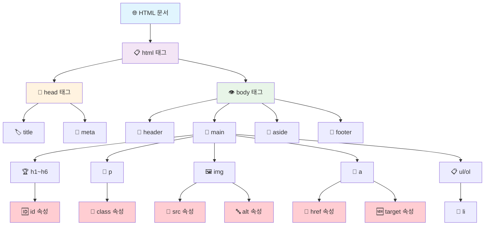

---

## 🏷️ 태그 분류 시스템

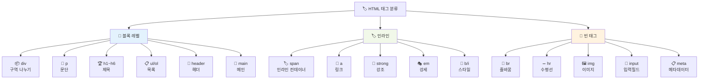

---

## 📱 폼(Form) 완벽 가이드

### 🎯 회원가입 폼 예제

```html
<!-- 📝 사용자 정보를 입력받는 폼 -->
<form action="/register"              <!-- 📤 폼 데이터를 보낼 서버 주소 -->
      method="post"                   <!-- 📮 데이터 전송 방식 (post는 보안이 좋음) -->
      id="signup-form">               <!-- 🆔 폼의 고유 식별자 -->
  
  <fieldset>                          <!-- 📦 관련된 입력 필드들을 그룹화 -->
    <legend>👤 기본 정보</legend>      <!-- 🏷️ 그룹의 제목 -->
    
    <!-- 📝 이름 입력 필드 -->
    <div class="form-group">
      <label for="fullname">👤 이름:</label>  <!-- 🏷️ 입력 필드 설명 라벨 -->
      <input type="text"              <!-- ⌨️ 일반 텍스트 입력 -->
             id="fullname"            <!-- 🆔 label과 연결하기 위한 ID -->
             name="fullname"          <!-- 📤 서버로 전송될 데이터 이름 -->
             placeholder="홍길동"     <!-- 💭 입력 힌트 -->
             required                 <!-- ❗ 필수 입력 항목 -->
             maxlength="20" />        <!-- 📏 최대 20글자까지만 입력 가능 -->
    </div>
    
    <!-- 📧 이메일 입력 필드 -->
    <div class="form-group">
      <label for="email">📧 이메일:</label>
      <input type="email"             <!-- 📧 이메일 형식 자동 검증 -->
             id="email"
             name="email"
             placeholder="example@email.com"
             required />
    </div>
    
    <!-- 🔒 비밀번호 입력 필드 -->
    <div class="form-group">
      <label for="password">🔒 비밀번호:</label>
      <input type="password"          <!-- 🔒 입력 내용이 * 으로 숨겨짐 -->
             id="password"
             name="password"
             minlength="8"            <!-- 📏 최소 8글자 이상 -->
             required />
    </div>
  </fieldset>
  
  <fieldset>
    <legend>🎯 관심 분야</legend>
    
    <!-- ☑️ 체크박스 (여러 개 선택 가능) -->
    <div class="checkbox-group">
      <input type="checkbox"          <!-- ☑️ 체크박스 타입 -->
             id="frontend"
             name="interests"         <!-- 📤 같은 name으로 그룹화 -->
             value="frontend" />      <!-- 📋 선택했을 때 전송될 값 -->
      <label for="frontend">🎨 프론트엔드</label>
      
      <input type="checkbox"
             id="backend"
             name="interests"
             value="backend" />
      <label for="backend">⚙️ 백엔드</label>
      
      <input type="checkbox"
             id="design"
             name="interests"
             value="design" />
      <label for="design">🎨 UI/UX 디자인</label>
    </div>
    
    <!-- 🔘 라디오 버튼 (하나만 선택 가능) -->
    <div class="radio-group">
      <p>💼 희망 직무:</p>
      <input type="radio"             <!-- 🔘 라디오 버튼 타입 -->
             id="developer"
             name="job"               <!-- 📤 같은 name끼리는 하나만 선택됨 -->
             value="developer"
             checked />               <!-- ✅ 기본으로 선택된 상태 -->
      <label for="developer">👨‍💻 개발자</label>
      
      <input type="radio"
             id="designer"
             name="job"
             value="designer" />
      <label for="designer">🎨 디자이너</label>
      
      <input type="radio"
             id="pm"
             name="job"
             value="pm" />
      <label for="pm">📊 프로젝트 매니저</label>
    </div>
  </fieldset>
  
  <!-- 📤 제출 버튼 -->
  <div class="button-group">
    <button type="submit"             <!-- 📤 폼 데이터 전송 -->
            class="submit-btn">
      🚀 가입하기
    </button>
    <button type="reset"              <!-- 🔄 모든 입력 내용 초기화 -->
            class="reset-btn">
      🗑️ 초기화
    </button>
  </div>
</form>
```

---

## 🎭 시맨틱 HTML 태그

> **시맨틱 태그**는 태그 이름만 봐도 **의미**를 알 수 있는 태그들입니다.

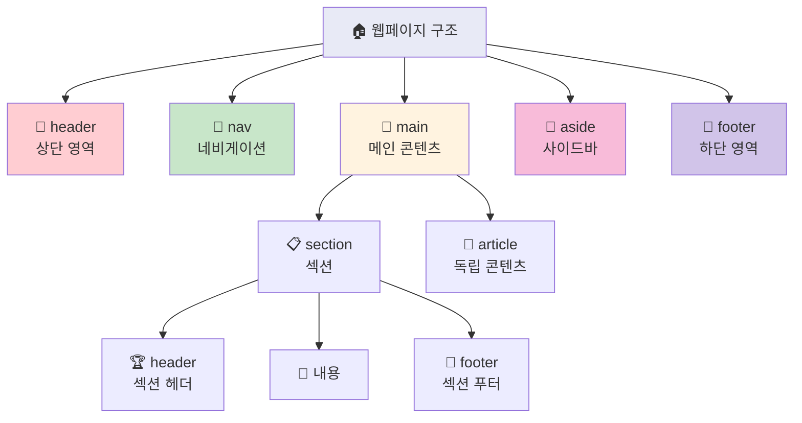

### 🎨 완전한 시맨틱 웹페이지 구조

```html
<!DOCTYPE html>
<html lang="ko">
<head>
    <meta charset="UTF-8">
    <title>🌟 모던 웹사이트</title>
    <style>
        /* 🎨 아름다운 스타일링 */
        * { margin: 0; padding: 0; box-sizing: border-box; }
        body { font-family: 'Segoe UI', sans-serif; line-height: 1.6; }
        header { background: linear-gradient(135deg, #667eea 0%, #764ba2 100%); color: white; padding: 2rem; }
        nav ul { list-style: none; display: flex; gap: 2rem; }
        nav a { color: white; text-decoration: none; transition: 0.3s; }
        nav a:hover { color: #ffd700; }
        main { max-width: 1200px; margin: 0 auto; padding: 2rem; }
        section { margin: 3rem 0; padding: 2rem; border-radius: 10px; box-shadow: 0 4px 6px rgba(0,0,0,0.1); }
        aside { background: #f8f9fa; padding: 1.5rem; border-radius: 8px; }
        footer { background: #2c3e50; color: white; text-align: center; padding: 2rem; }
    </style>
</head>
<body>
    <!-- 🎪 사이트 전체 헤더 -->
    <header role="banner">            <!-- 🎯 접근성을 위한 role 속성 -->
        <h1>🌟 테크 블로그</h1>
        <p>💻 개발자를 위한 최신 기술 정보</p>
        
        <!-- 🧭 메인 네비게이션 -->
        <nav role="navigation">       <!-- 🧭 네비게이션 역할 명시 -->
            <ul>
                <li><a href="#home">🏠 홈</a></li>
                <li><a href="#articles">📰 글 목록</a></li>
                <li><a href="#about">👨‍💻 소개</a></li>
                <li><a href="#contact">📞 연락처</a></li>
            </ul>
        </nav>
    </header>
    
    <!-- 📄 메인 콘텐츠 영역 -->
    <main role="main">
        <!-- 📋 최신 글 섹션 -->
        <section id="latest-posts">
            <header>                  <!-- 📰 섹션만의 헤더 -->
                <h2>🔥 최신 글</h2>
                <p>📅 가장 최근에 업데이트된 개발 관련 글들</p>
            </header>
            
            <!-- 📰 개별 글 (독립적인 콘텐츠) -->
            <article class="blog-post">
                <header class="post-header">
                    <h3>⚛️ React 18의 새로운 기능들</h3>
                    <div class="post-meta"> <!-- 📋 글의 메타 정보 -->
                        <time datetime="2025-08-19">📅 2025년 8월 19일</time> <!-- ⏰ 시간 정보 -->
                        <span class="author">✍️ 작성자: 김개발</span>
                        <span class="category">🏷️ 카테고리: React</span>
                    </div>
                </header>
                
                <div class="post-content">
                    <p>🎯 React 18에서 도입된 혁신적인 기능들을 알아보겠습니다...</p>
                    
                </div>
                
                <footer class="post-footer">
                    <div class="tags">    <!-- 🏷️ 태그 영역 -->
                        <span class="tag">⚛️ React</span>
                        <span class="tag">📚 Tutorial</span>
                        <span class="tag">🆕 New Features</span>
                    </div>
                    <a href="react18-guide.html" class="read-more">
                        📖 전체 글 읽기 →
                    </a>
                </footer>
            </article>
            
            <!-- 📰 두 번째 글 -->
            <article class="blog-post">
                <header class="post-header">
                    <h3>🎨 CSS Grid vs Flexbox 완벽 비교</h3>
                    <div class="post-meta">
                        <time datetime="2025-08-18">📅 2025년 8월 18일</time>
                        <span class="author">✍️ 작성자: 박디자인</span>
                        <span class="category">🏷️ 카테고리: CSS</span>
                    </div>
                </header>
                
                <div class="post-content">
                    <p>🤔 언제 Grid를 쓰고 언제 Flexbox를 써야 할까요?</p>
                </div>
                
                <footer class="post-footer">
                    <div class="tags">
                        <span class="tag">🎨 CSS</span>
                        <span class="tag">📐 Layout</span>
                        <span class="tag">💡 Tips</span>
                    </div>
                    <a href="css-grid-flexbox.html" class="read-more">
                        📖 전체 글 읽기 →
                    </a>
                </footer>
            </article>
        </section>
    </main>
    
    <!-- 🔀 사이드바 (관련 정보) -->
    <aside role="complementary">      <!-- 🔀 메인 콘텐츠를 보완하는 역할 -->
        <section class="widget">
            <h3>🔥 인기 글</h3>
            <ol class="popular-posts">
                <li><a href="#">🚀 JavaScript ES2025 새 기능</a></li>
                <li><a href="#">🎯 Node.js 성능 최적화 방법</a></li>
                <li><a href="#">📱 반응형 웹 디자인 완벽 가이드</a></li>
            </ol>
        </section>
        
        <section class="widget">
            <h3>🏷️ 카테고리</h3>
            <ul class="categories">
                <li><a href="#">⚛️ React (15)</a></li>
                <li><a href="#">🎨 CSS (12)</a></li>
                <li><a href="#">⚡ JavaScript (20)</a></li>
                <li><a href="#">🔧 Node.js (8)</a></li>
            </ul>
        </section>
    </aside>
    
    <!-- 🏁 사이트 푸터 -->
    <footer role="contentinfo">       <!-- 📋 사이트 정보 역할 -->
        <div class="footer-content">
            <div class="footer-section">
                <h4>📞 연락처</h4>
                <address>             <!-- 📮 연락처 정보 전용 태그 -->
                    📧 <a href="mailto:info@techblog.com">info@techblog.com</a><br />
                    📱 <a href="tel:02-1234-5678">02-1234-5678</a>
                </address>
            </div>
            
            <div class="footer-section">
                <h4>🔗 소셜 미디어</h4>
                <a href="https://github.com/techblog" 
                   target="_blank" 
                   rel="noopener"
                   aria-label="GitHub 페이지">    <!-- ♿ 접근성을 위한 설명 -->
                   💻 GitHub
                </a>
                <a href="https://twitter.com/techblog" 
                   target="_blank" 
                   rel="noopener"
                   aria-label="트위터 페이지">
                   🐦 Twitter
                </a>
            </div>
        </div>
        
        <hr style="margin: 2rem 0; border: none; height: 1px; background: #34495e;" />
        
        <p>📅 © 2025 테크블로그. 모든 권리 보유. 
           <small>💝 Made with ❤️ by developers</small>
        </p>
    </footer>
</body>
</html>
```

---

## 🎯 속성 활용 고급 팁

### 🔧 데이터 속성 (Custom Data Attributes)

```html
<!-- 📊 JavaScript에서 사용할 커스텀 데이터 저장 -->
<div class="product-card" 
     data-product-id="12345"          <!-- 📋 상품 ID 저장 -->
     data-price="29900"               <!-- 💰 가격 정보 저장 -->
     data-category="electronics"      <!-- 🏷️ 카테고리 정보 저장 -->
     data-in-stock="true">            <!-- 📦 재고 상태 저장 -->
  
  <h3>📱 스마트폰</h3>
  <p>💰 가격: 29,900원</p>
  <button onclick="addToCart(this)">🛒 장바구니 담기</button>
</div>

<script>
function addToCart(button) {
  // 🎯 HTML에서 저장한 데이터를 JavaScript에서 활용
  const productCard = button.parentElement;
  const productId = productCard.dataset.productId;     // "12345"
  const price = productCard.dataset.price;             // "29900"
  console.log(`상품 ${productId}를 장바구니에 추가!`);
}
</script>
```

### ♿ 접근성 속성

```html
<!-- 🌟 모든 사용자를 배려하는 접근성 속성들 -->

     aria-describedby="chart-description" />            <!-- 🔗 추가 설명과 연결 -->

<div id="chart-description" class="sr-only">           <!-- 📋 차트에 대한 자세한 설명 -->
  이 차트는 2025년 1분기 매출이 전년 동기 대비 15% 증가했음을 보여줍니다.
  1월 100만원, 2월 120만원, 3월 150만원을 기록했습니다.
</div>

<!-- 🎛️ ARIA 속성으로 접근성 향상 -->
<button aria-label="메뉴 열기"        <!-- 🔤 버튼의 명확한 설명 -->
        aria-expanded="false"         <!-- 📋 메뉴 펼침 상태 -->
        aria-controls="mobile-menu">  <!-- 🔗 제어하는 요소 지정 -->
  🍔
</button>

<nav id="mobile-menu" 
     aria-hidden="true"               <!-- 👁️ 화면에서 숨겨진 상태 -->
     role="navigation">
  <!-- 메뉴 내용 -->
</nav>
```

---

## 📋 HTML 속성 치트시트

### 🌍 전역 속성 (모든 태그 사용 가능)

| 속성 | 용도 | 예제 | 설명 |
|------|------|------|------|
| `id` | 🆔 고유 식별자 | `id="header"` | 페이지에서 하나만 존재 |
| `class` | 👥 그룹 식별자 | `class="button primary"` | 여러 클래스 공백으로 구분 |
| `style` | 🎨 인라인 스타일 | `style="color: red;"` | CSS 직접 적용 |
| `title` | 💭 툴팁 | `title="도움말"` | 마우스 오버시 표시 |
| `lang` | 🌐 언어 설정 | `lang="ko"` | 해당 요소의 언어 |
| `dir` | ➡️ 텍스트 방향 | `dir="rtl"` | 우→좌 (아랍어 등) |

### 🔗 링크 속성

| 속성 | 용도 | 값 예시 | 설명 |
|------|------|---------|------|
| `href` | 🎯 링크 주소 | `"https://example.com"` | 이동할 URL |
| `target` | 🪟 열기 방식 | `"_blank"`, `"_self"` | 새 창 또는 현재 창 |
| `rel` | 🔗 관계 설정 | `"noopener"`, `"nofollow"` | 보안 및 SEO |
| `download` | 💾 다운로드 | `"report.pdf"` | 파일 다운로드 |

### 🖼️ 이미지 속성

| 속성 | 용도 | 예시 | 설명 |
|------|------|------|------|
| `src` | 📁 이미지 경로 | `"images/photo.jpg"` | 이미지 파일 위치 |
| `alt` | 🔤 대체 텍스트 | `"아름다운 풍경"` | 접근성 필수 |
| `width` | 📏 가로 크기 | `"300"` | 픽셀 단위 |
| `height` | 📏 세로 크기 | `"200"` | 픽셀 단위 |
| `loading` | ⚡ 로딩 방식 | `"lazy"`, `"eager"` | 성능 최적화 |

---

## 🚀 실무 활용 패턴

### 🎮 인터랙티브 요소들

```html
<!-- 🎮 사용자와 상호작용하는 요소들 -->
<details open>                        <!-- 📂 펼침/접힘 가능한 영역 -->
  <summary>🔍 자세히 보기</summary>    <!-- 📋 펼침/접힘 버튼 역할 -->
  <p>📄 여기에 숨겨진 상세 내용이 들어갑니다.</p>
  <p>🎯 사용자가 summary를 클릭하면 이 내용이 보이거나 숨겨집니다.</p>
</details>

<!-- 🎵 미디어 요소들 -->
<audio controls                       <!-- 🎛️ 재생 컨트롤 표시 -->
       preload="metadata"             <!-- 📋 메타데이터만 미리 로드 -->
       loop>                          <!-- 🔄 반복 재생 -->
  <source src="music.mp3" type="audio/mpeg">  <!-- 🎵 MP3 파일 -->
  <source src="music.ogg" type="audio/ogg">   <!-- 🎵 OGG 파일 (브라우저 호환성) -->
  ❌ 오디오를 지원하지 않는 브라우저입니다.
</audio>

<video width="640" 
       height="360" 
       controls                       <!-- 🎛️ 재생 컨트롤 -->
       poster="video-thumbnail.jpg"   <!-- 🖼️ 비디오 시작 전 보여줄 이미지 -->
       muted                          <!-- 🔇 음소거 상태로 시작 -->
       autoplay>                      <!-- ▶️ 자동 재생 (음소거와 함께 사용 권장) -->
  <source src="demo.mp4" type="video/mp4">
  <source src="demo.webm" type="video/webm">
  ❌ 비디오를 지원하지 않는 브라우저입니다.
</video>
```

### 📊 테이블 구조

```html
<!-- 📊 정보를 표로 정리하기 -->
<table class="data-table">
  <caption>📈 2025년 분기별 매출 현황</caption>  <!-- 📋 표의 제목 -->
  
  <thead>                             <!-- 📋 표의 헤더 영역 -->
    <tr>                              <!-- 📏 표의 한 행 -->
      <th scope="col">📅 분기</th>    <!-- 🏷️ 열 제목 (굵게 표시) -->
      <th scope="col">💰 매출</th>
      <th scope="col">📈 증가율</th>
    </tr>
  </thead>
  
  <tbody>                             <!-- 📄 표의 본문 영역 -->
    <tr>
      <td>🌸 1분기</td>               <!-- 📋 일반 데이터 셀 -->
      <td>150만원</td>
      <td style="color: green;">📈 +15%</td>
    </tr>
    <tr>
      <td>☀️ 2분기</td>
      <td>180만원</td>
      <td style="color: green;">📈 +20%</td>
    </tr>
  </tbody>
  
  <tfoot>                             <!-- 🏁 표의 푸터 영역 -->
    <tr>
      <td><strong>📊 총계</strong></td>
      <td><strong>330만원</strong></td>
      <td><strong>📈 +17.5%</strong></td>
    </tr>
  </tfoot>
</table>
```

---

## 🎨 고급 속성 활용법

### 🎭 조건부 속성

```html
<!-- 🎮 상태에 따라 달라지는 속성들 -->
<button disabled                      <!-- ❌ 비활성 상태 -->
        title="로그인 후 사용 가능">
  🔒 프리미엄 기능
</button>

<button type="submit"                 <!-- ✅ 활성 상태 -->
        formnovalidate               <!-- 🚫 폼 검증 건너뛰기 -->
        title="임시 저장하기">
  💾 임시 저장
</button>

<!-- 📱 반응형 이미지 -->

             medium-image.jpg 600w,   <!-- 💻 600px 이하에서 사용할 이미지 -->
             large-image.jpg 1200w"   <!-- 🖥️ 1200px 이하에서 사용할 이미지 -->
     sizes="(max-width: 300px) 100vw, <!-- 📏 화면 크기별 이미지 표시 크기 -->
            (max-width: 600px) 50vw,
            25vw"
     alt="다양한 화면 크기에 최적화된 이미지" />
```

### 🔄 동적 콘텐츠 속성

```html
<!-- 📊 진행률 표시 -->
<progress value="75"                  <!-- 📊 현재 진행률 -->
          max="100"                   <!-- 📊 최대값 -->
          title="프로젝트 진행률 75%">
  75% 완료
</progress>

<!-- 📏 범위 슬라이더 -->
<label for="volume">🔊 볼륨:</label>
<input type="range"                   <!-- 🎚️ 슬라이더 타입 -->
       id="volume"
       name="volume"
       min="0"                        <!-- 📉 최소값 -->
       max="100"                      <!-- 📈 최대값 -->
       value="50"                     <!-- 🎯 기본값 -->
       step="5"                       <!-- 📏 증감 단위 -->
       oninput="updateVolume(this.value)"> <!-- ⚡ 값 변경시 실행할 함수 -->

<output for="volume" id="volume-display">🔊 50</output> <!-- 📊 현재 값 표시 -->
```

---

## 🌟 최신 HTML5 기능들

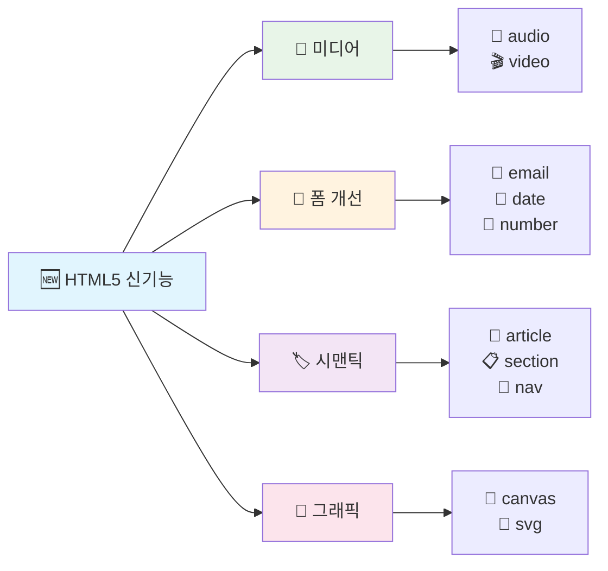

### 📅 새로운 입력 타입들

```html
<!-- 📅 날짜와 시간 입력 -->
<label for="birthday">🎂 생일:</label>
<input type="date"                    <!-- 📅 달력 선택기 -->
       id="birthday"
       name="birthday"
       min="1900-01-01"               <!-- 📉 최소 날짜 -->
       max="2025-12-31" />            <!-- 📈 최대 날짜 -->

<label for="meeting-time">⏰ 회의 시간:</label>
<input type="datetime-local"          <!-- 📅⏰ 날짜 + 시간 선택 -->
       id="meeting-time"
       name="meeting-time" />

<!-- 🎨 색상 선택기 -->
<label for="brand-color">🎨 브랜드 색상:</label>
<input type="color"                   <!-- 🌈 색상 팔레트 -->
       id="brand-color"
       name="brand-color"
       value="#ff6b6b" />             <!-- 🎯 기본 색상 -->

<!-- 📏 숫자 입력 -->
<label for="quantity">📦 수량:</label>
<input type="number"                  <!-- 🔢 숫자만 입력 가능 -->
       id="quantity"
       name="quantity"
       min="1"                        <!-- 📉 최소 1개 -->
       max="100"                      <!-- 📈 최대 100개 -->
       value="1"                      <!-- 🎯 기본값 1개 -->
       step="1" />                    <!-- 📏 1개씩 증감 -->
```

---

## 🎯 성능 최적화 속성

### ⚡ 로딩 최적화

```html
<!-- 🚀 빠른 페이지 로딩을 위한 속성들 -->

<!-- 🖼️ 지연 로딩 이미지 -->

     decoding="async"                 <!-- 🔄 비동기 디코딩 -->
     importance="high" />             <!-- 🎯 중요도 높음 (우선 로딩) -->

<!-- 🔗 링크 미리 로딩 -->
<link rel="preload"                   <!-- 📥 미리 로딩할 리소스 -->
      href="important-font.woff2"
      as="font"                       <!-- 📝 리소스 타입 -->
      type="font/woff2"
      crossorigin />

<link rel="prefetch"                  <!-- 📦 다음에 필요할 수 있는 리소스 -->
      href="next-page.html" />

<!-- 🔗 DNS 미리 연결 -->
<link rel="dns-prefetch"              <!-- 🌐 도메인 미리 연결 -->
      href="//fonts.googleapis.com" />
```

---


# 🛡️ 보안 관련 속성

웹 개발에서 보안은 매우 중요한 요소입니다. 특히 외부 링크, 사용자 입력 처리, 민감한 리소스 접근 시 주의해야 합니다.

---

## 🔒 외부 링크 보안 속성

```html
<!-- 🌐 외부 사이트를 새 창에서 열 때 -->
<a href="https://external-site.com"
   target="_blank"                 <!-- 🆕 새 탭에서 열기 -->
   rel="noopener noreferrer"      <!-- 🛡️ 보안 속성: 탭 간 침입 방지 -->
   title="외부 사이트로 이동">
   🚀 외부 사이트 방문하기
</a>
```

### 📌 속성 설명

- `target="_blank"` : 새 창(새 탭)에서 열기
    
- `rel="noopener"` : 새 탭이 원래 창의 `window.opener`에 접근하지 못하게 차단
    
- `rel="noreferrer"` : 원래 페이지의 **참조 정보(Referrer)**를 전송하지 않음
    

> 💡 **Tip**: 외부 링크를 열 때는 반드시 `rel="noopener noreferrer"`를 함께 사용하세요!

---

## 🔑 입력 데이터 보안 속성

사용자 입력은 **SQL Injection, XSS**와 같은 공격에 악용될 수 있습니다. HTML 차원에서 다음 속성을 활용하세요.

```html
<!-- 📧 이메일 입력 필드 -->
<input type="email"                 <!-- 이메일 형식만 허용 -->
       name="userEmail"
       required />                  <!-- 값이 없으면 제출 불가 -->

<!-- 🔒 비밀번호 입력 필드 -->
<input type="password"
       name="password"
       minlength="8"               <!-- 최소 8자 이상 입력 강제 -->
       required />

<!-- 🔢 숫자 입력 범위 제한 -->
<input type="number"
       name="age"
       min="1" max="120" />        <!-- 1 ~ 120 사이 값만 허용 -->
```

> 🛡️ 프론트엔드의 입력 제한은 보조 역할일 뿐, **백엔드 검증**이 반드시 필요합니다.

---

## 🖼️ 보안 속성 - 이미지/리소스

```html
<!-- ⚡ 성능 & 보안 최적화된 이미지 로딩 -->

     referrerpolicy="no-referrer"   <!-- 리퍼러 정보 숨기기 -->
     crossorigin="anonymous" />     <!-- 교차 출처 요청 시 인증 제외 -->
```

### 속성 설명

- `referrerpolicy` : 외부 리소스에 현재 페이지 URL이 노출되지 않도록 제어
    
- `crossorigin` : 교차 출처(CORS) 리소스 요청 시 인증 정보를 어떻게 처리할지 결정
    

---

## 📊 보안 관련 속성 관계도

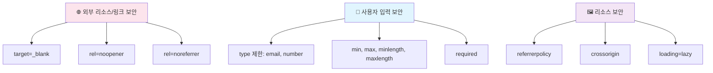

---

## ✅ 정리

1. 외부 링크는 반드시 `rel="noopener noreferrer"`로 보호
2. 입력 필드는 HTML 속성(`type`, `required`, `minlength`)으로 1차 방어
3. 이미지/리소스 요청 시 `referrerpolicy`와 `crossorigin` 활용
4. 최종적으로는 서버에서 **입력 검증과 보안 처리**가 필수

> 🎯 HTML 보안 속성은 완벽한 방패는 아니지만, **첫 번째 안전망** 역할을 합니다.
