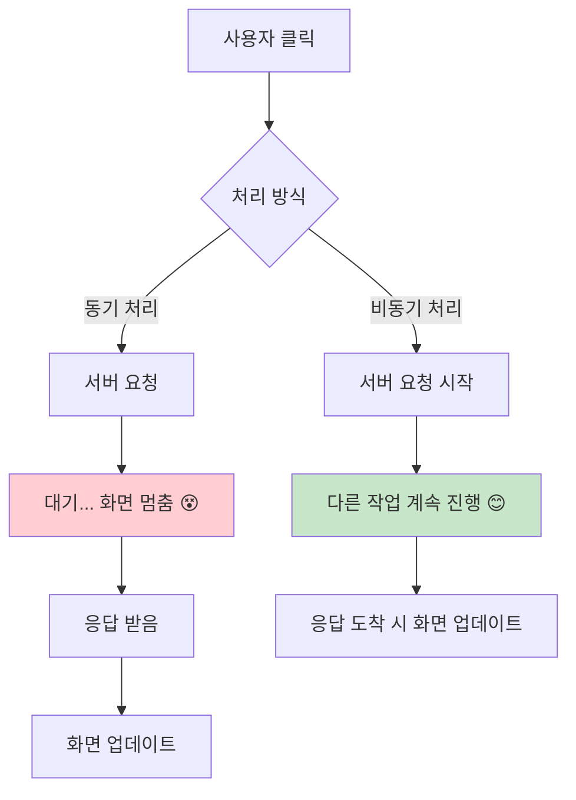
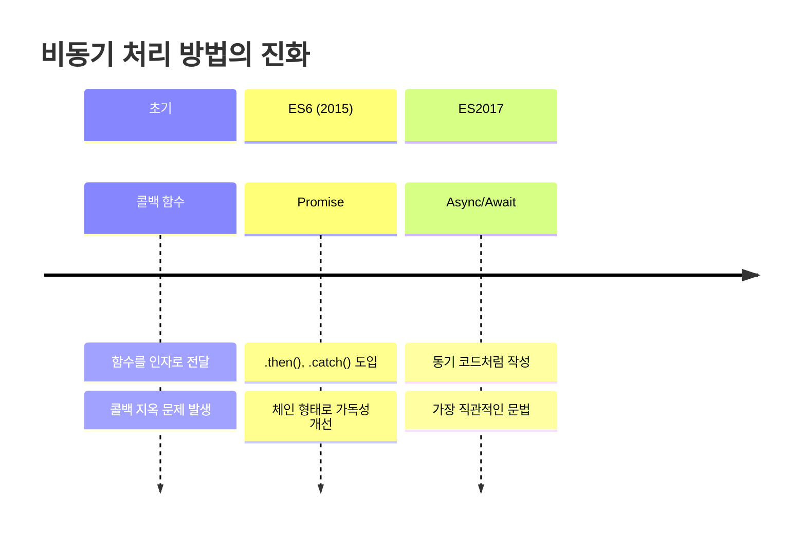
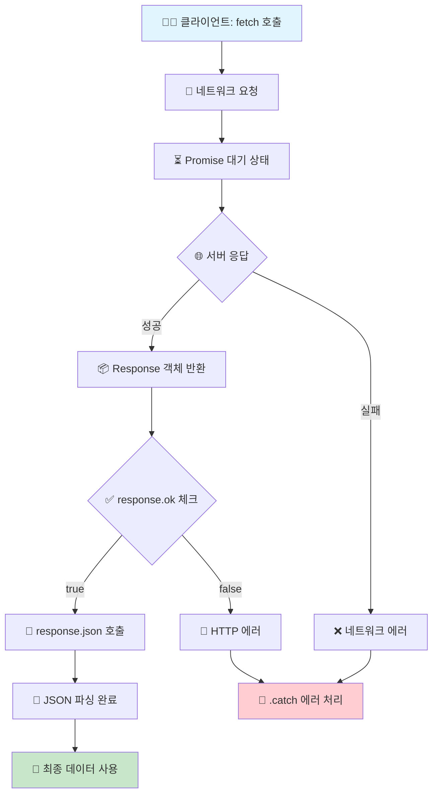
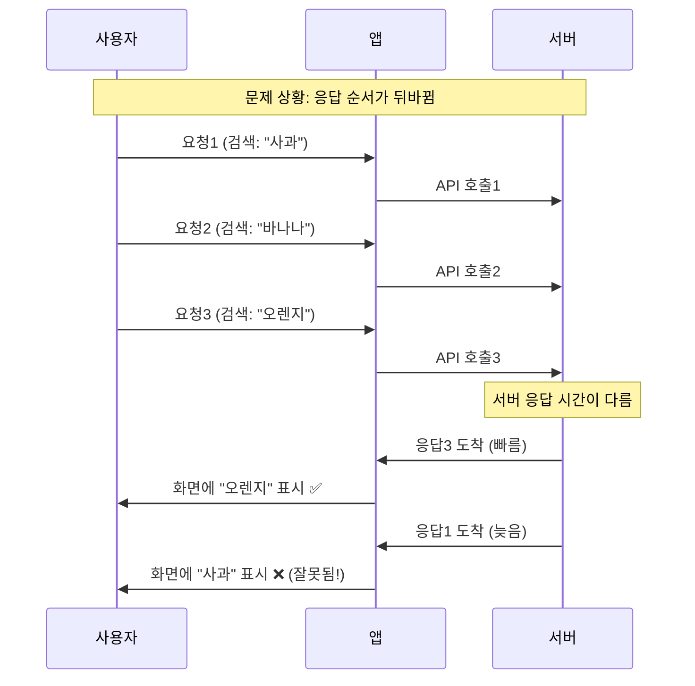
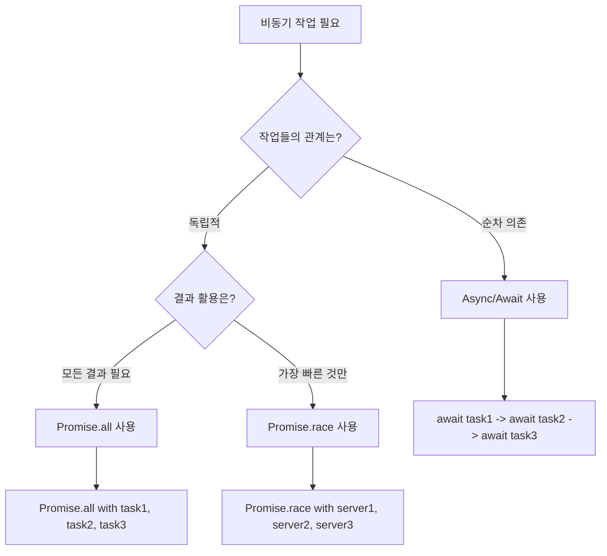
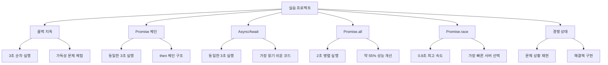

# 멋사 20일차 TIL - JavaScript 비동기 프로그래밍 완전 정리 📚

> **날짜:** 2025년 8월 26일 (화)  
> **과정:** 멋쟁이 사자처럼 클라우드 엔지니어링 20일차  
> **주제:** JavaScript 비동기 프로그래밍 & Fetch API

---

## 🎯 오늘 배운 핵심 개념

### 📋 학습 목표
- [x] 비동기 프로그래밍의 개념과 필요성 이해
- [x] 콜백, Promise, Async/Await 차이점 학습
- [x] Fetch API 사용법 완전 마스터
- [x] Promise 병렬 처리 방법 습득
- [x] 경쟁 상태 문제와 해결책 이해

---

## 🌟 1. 비동기 프로그래밍이란?

### 🤔 왜 비동기가 필요할까?

**동기 처리**는 코드가 위에서 아래로 순서대로 실행되는 방식입니다. 하지만 웹 개발에서는 서버 통신, 파일 읽기 등 시간이 오래 걸리는 작업들이 많습니다.



### 💡 비동기의 장점

- ✅ **사용자 경험 개선**: 화면이 멈추지 않음
- ✅ **효율성**: 여러 작업을 동시에 처리 가능
- ✅ **응답성**: 빠른 반응으로 더 나은 앱 성능

---

## 🔄 2. 비동기 처리 방법의 진화

### 📈 발전 과정 시각화



### 🔥 콜백 지옥 체험

```javascript
// ❌ 콜백 지옥 - 읽기 어려운 코드
setTimeout(() => {
    console.log('1. 사용자 조회');
    setTimeout(() => {
        console.log('2. 게시물 조회');
        setTimeout(() => {
            console.log('3. 댓글 조회');
            // 계속 중첩되면서 코드가 복잡해짐...
        }, 1000);
    }, 1000);
}, 1000);
```

### ⛓️ Promise로 개선

```javascript
// ✅ Promise 체인 - 더 깔끔한 코드
fetchUser()
    .then(() => fetchPosts())
    .then(() => fetchComments())
    .then(() => console.log('모든 작업 완료!'))
    .catch(error => console.error('에러 발생:', error));
```

### 🎯 Async/Await로 완성

```javascript
// ✅ Async/Await - 가장 읽기 쉬운 코드
async function loadAllData() {
    try {
        await fetchUser();
        await fetchPosts();
        await fetchComments();
        console.log('모든 작업 완료!');
    } catch (error) {
        console.error('에러 발생:', error);
    }
}
```

---

## 📡 3. Fetch API 완전 정리

### 🏗️ 기본 구조

Fetch API는 **네트워크 요청을 보내는 현대적인 방법**입니다.



### 📝 기본 사용법

```javascript
// 기본 템플릿 - 복사해서 사용하세요!
fetch('https://api.example.com/data')
    .then(response => {
        // 1단계: 응답 상태 확인
        if (!response.ok) {
            throw new Error(`HTTP ${response.status}`);
        }
        return response.json(); // JSON 변환
    })
    .then(data => {
        // 2단계: 데이터 활용
        console.log('성공:', data);
    })
    .catch(error => {
        // 3단계: 에러 처리
        console.error('실패:', error);
    });
```

### 🎯 HTTP 메서드별 활용

```javascript
// GET - 데이터 조회
const getTodos = async () => {
    const response = await fetch('/api/todos');
    return await response.json();
};

// POST - 데이터 생성
const createTodo = async (todoData) => {
    const response = await fetch('/api/todos', {
        method: 'POST',
        headers: {
            'Content-Type': 'application/json',
        },
        body: JSON.stringify(todoData)
    });
    return await response.json();
};

// PUT - 데이터 전체 수정
const updateTodo = async (id, todoData) => {
    const response = await fetch(`/api/todos/${id}`, {
        method: 'PUT',
        headers: {
            'Content-Type': 'application/json',
        },
        body: JSON.stringify(todoData)
    });
    return await response.json();
};

// DELETE - 데이터 삭제
const deleteTodo = async (id) => {
    await fetch(`/api/todos/${id}`, {
        method: 'DELETE'
    });
};
```

---

## 🚀 4. Promise 병렬 처리

### ⚡ Promise.all() - 모든 작업 완료 대기

```mermaid
gantt
    title Promise.all() vs 순차 실행 비교
    dateFormat X
    axisFormat %s초
    
    section 순차 실행 (4.5초)
    작업A (1.5초) :seq1, 0, 1500
    작업B (2초)   :seq2, after seq1, 2000
    작업C (1초)   :seq3, after seq2, 1000
    
    section Promise.all 병렬 실행 (2초)
    작업A (1.5초) :par1, 0, 1500
    작업B (2초)   :par2, 0, 2000
    작업C (1초)   :par3, 0, 1000
```



```javascript
// 동시에 여러 API 호출하기
async function loadDashboard() {
    try {
        console.log('대시보드 데이터 로딩 시작...');
        
        // 3개 작업을 동시에 실행 (병렬 처리)
        const [weather, news, stocks] = await Promise.all([
            fetch('/api/weather').then(r => r.json()),    // 날씨 (1.5초)
            fetch('/api/news').then(r => r.json()),       // 뉴스 (2초)
            fetch('/api/stocks').then(r => r.json())      // 주식 (1초)
        ]);
        
        console.log('모든 데이터 로드 완료! (2초 소요)');
        return { weather, news, stocks };
        
        // 순차 실행했다면 4.5초 걸렸을 것을 2초만에 완성!
    } catch (error) {
        console.error('데이터 로드 실패:', error);
    }
}
```

### 🏆 Promise.race() - 가장 빠른 응답만

```javascript
// 여러 서버 중 가장 빠른 응답 받기
async function getFastestServer() {
    const servers = [
        fetch('https://server1.com/api/data'),
        fetch('https://server2.com/api/data'),
        fetch('https://server3.com/api/data')
    ];
    
    try {
        // 가장 먼저 응답하는 서버의 결과만 사용
        const fastestResponse = await Promise.race(servers);
        const data = await fastestResponse.json();
        console.log('가장 빠른 서버 응답:', data);
        return data;
    } catch (error) {
        console.error('모든 서버 요청 실패:', error);
    }
}
```

---

## ⚔️ 5. 경쟁 상태(Race Condition) 해결

### 🚨 문제 상황

**경쟁 상태**는 여러 비동기 작업이 동시에 실행될 때, 실행 순서에 따라 결과가 달라지는 문제입니다.



### ✅ 해결 방법

```javascript
let latestRequestId = 0; // 최신 요청 ID 추적

function searchWithSolution(keyword) {
    // 새로운 요청마다 ID 증가
    const currentRequestId = ++latestRequestId;
    console.log(`요청 ${currentRequestId}: "${keyword}" 검색 시작`);
    
    // API 호출 시뮬레이션
    setTimeout(() => {
        // 응답 도착 시 최신 요청인지 확인
        if (currentRequestId === latestRequestId) {
            console.log(`✅ 최신 요청 - 화면 업데이트: ${keyword}`);
            updateUI(keyword);
        } else {
            console.log(`❌ 오래된 요청 - 무시: ${keyword}`);
        }
    }, Math.random() * 2000);
}

// 사용 예시
searchWithSolution('사과');    // 요청 1
searchWithSolution('바나나');  // 요청 2
searchWithSolution('오렌지');  // 요청 3 (최종 검색어)
// 결과: '오렌지'만 화면에 표시됨 ✅
```

---

## 🛠️ 6. 실전 활용 팁

### 🎯 상황별 최적 선택



### 🧰 실용적인 유틸리티 함수

```javascript
// 1. 지연 함수 (테스트용)
const delay = (ms) => new Promise(resolve => setTimeout(resolve, ms));

// 2. 재시도 함수
async function retry(fn, maxAttempts = 3) {
    for (let attempt = 1; attempt <= maxAttempts; attempt++) {
        try {
            return await fn();
        } catch (error) {
            if (attempt === maxAttempts) throw error;
            console.log(`시도 ${attempt} 실패, 재시도 중...`);
            await delay(1000 * attempt); // 점진적 지연
        }
    }
}

// 3. 타임아웃 함수
function withTimeout(promise, ms) {
    return Promise.race([
        promise,
        new Promise((_, reject) => 
            setTimeout(() => reject(new Error('타임아웃')), ms)
        )
    ]);
}

// 사용 예시
async function robustApiCall() {
    try {
        const result = await retry(async () => {
            return await withTimeout(
                fetch('/api/data').then(r => r.json()),
                5000 // 5초 타임아웃
            );
        }, 3); // 최대 3회 재시도
        
        return result;
    } catch (error) {
        console.error('API 호출 최종 실패:', error);
        return null;
    }
}
```

### ⚠️ 자주하는 실수들

```javascript
// ❌ 실수 1: async 함수에서 forEach 사용
async function wrongWay() {
    const items = [1, 2, 3, 4, 5];
    
    items.forEach(async (item) => {
        await processItem(item); // 순서 보장 안됨!
    });
    
    console.log('완료'); // 처리 전에 실행됨!
}

// ✅ 올바른 방법: for...of 사용
async function correctWay() {
    const items = [1, 2, 3, 4, 5];
    
    for (const item of items) {
        await processItem(item); // 순서대로 처리
    }
    
    console.log('완료'); // 모든 처리 후 실행
}

// ❌ 실수 2: 에러 처리 누락
async function withoutErrorHandling() {
    const data = await riskyApiCall(); // 에러시 앱 멈춤!
    return data;
}

// ✅ 올바른 방법: try-catch 사용
async function withErrorHandling() {
    try {
        const data = await riskyApiCall();
        return data;
    } catch (error) {
        console.error('API 호출 실패:', error);
        return null; // 안전한 기본값
    }
}
```

---

## 📊 7. 오늘의 실습 결과

### 🔄 실습 코드 주요 기능



### 📈 성능 비교 결과

| 방식 | 실행 시간 | 가독성 | 성능 |
|------|-----------|--------|------|
| 콜백 지옥 | 3초 | ⭐ | ⭐⭐ |
| Promise 체인 | 3초 | ⭐⭐⭐ | ⭐⭐ |
| Async/Await | 3초 | ⭐⭐⭐⭐⭐ | ⭐⭐ |
| Promise.all | **2초** | ⭐⭐⭐⭐ | ⭐⭐⭐⭐⭐ |
| Promise.race | **0.8초** | ⭐⭐⭐⭐ | ⭐⭐⭐⭐⭐ |

---

## 🎯 8. 핵심 요약

### ✨ 오늘 배운 핵심 포인트

1. **📝 비동기 프로그래밍은 필수**
   - 사용자 경험 향상의 핵심
   - 현대 웹 개발의 기본기

2. **🔄 3가지 처리 방식의 특징**
   - **콜백**: 기본이지만 지옥 위험
   - **Promise**: 체인 구조로 가독성 개선
   - **Async/Await**: 가장 직관적이고 실용적

3. **⚡ 성능 최적화 방법**
   - **순차 처리**: 의존성이 있을 때
   - **병렬 처리**: 독립적인 작업들
   - **경쟁 처리**: 빠른 응답이 중요할 때

4. **🛡️ 안전한 코드 작성**
   - 항상 에러 처리 포함
   - 경쟁 상태 문제 고려
   - 타임아웃과 재시도 구현

### 🔥 실전 활용 가이드

```javascript
// 🎯 완벽한 비동기 함수 템플릿
async function perfectAsyncFunction(data) {
    try {
        // 1. 입력 검증
        if (!data) throw new Error('데이터가 필요합니다');
        
        // 2. 병렬로 처리 가능한 작업들
        const [result1, result2] = await Promise.all([
            apiCall1(data),
            apiCall2(data)
        ]);
        
        // 3. 순차 처리가 필요한 작업
        const finalResult = await processResults(result1, result2);
        
        return finalResult;
        
    } catch (error) {
        // 4. 에러 로깅 및 안전한 처리
        console.error('함수 실행 실패:', error);
        throw error; // 또는 기본값 반환
    }
}
```

---

## 🚀 9. 다음 단계 학습 계획

### 📚 심화 학습 목표

- [ ] **웹 워커(Web Workers)** - 메인 스레드 차단 없는 처리
- [ ] **Service Worker** - 오프라인 지원 및 캐싱
- [ ] **실시간 통신** - WebSocket, Server-Sent Events
- [ ] **상태 관리** - React/Vue에서의 비동기 처리
- [ ] **테스팅** - 비동기 코드 테스트 방법

### 🛠️ 실습 프로젝트 아이디어

1. **실시간 검색 기능** 구현 (디바운싱 + API 호출)
2. **이미지 갤러리** 만들기 (병렬 이미지 로딩)
3. **채팅 앱** 기초 (WebSocket 활용)
4. **날씨 대시보드** (여러 API 통합)

---

## 📖 참고 자료

### 🔗 유용한 링크

- [MDN - Promise](https://developer.mozilla.org/ko/docs/Web/JavaScript/Reference/Global_Objects/Promise)
- [MDN - Fetch API](https://developer.mozilla.org/ko/docs/Web/API/Fetch_API)
- [JavaScript.info - 비동기 프로그래밍](https://ko.javascript.info/async)
- [노드버드 책 - 비동기 처리](https://thebook.io/080229/ch02/03/)

### 🎥 추천 영상

- 드림코딩 - 자바스크립트 비동기 처리
- 코딩애플 - Promise, async/await 완벽정리
- 제로초 - 자바스크립트 이벤트 루프

---

## 💭 오늘의 소감

> **🎉 성취 포인트**
> - 복잡했던 비동기 개념이 명확해졌다!
> - Fetch API 사용법을 완전히 익혔다!
> - Promise.all과 Promise.race의 차이를 실습으로 체험했다!
> - 경쟁 상태 문제와 해결책을 배워서 실무에 바로 적용할 수 있겠다!

> **🤔 어려웠던 부분**
> - 콜백 지옥이 왜 문제인지 처음에는 이해하기 어려웠음
> - Promise의 상태 변화 개념이 추상적이었음
> - 경쟁 상태 문제는 실제로 겪어봐야 이해될 것 같음

> **🎯 내일 할 일**
> - 오늘 배운 내용을 실제 미니 프로젝트에 적용해보기
> - API 호출하는 간단한 웹 앱 만들어보기
> - 에러 처리를 더 견고하게 하는 방법 연구하기

---

**작성자:** 멋사 20기 수강생  
**작성일:** 2025년 8월 26일  
**태그:** `#JavaScript` `#비동기` `#Promise` `#AsyncAwait` `#FetchAPI` `#멋사20기`
