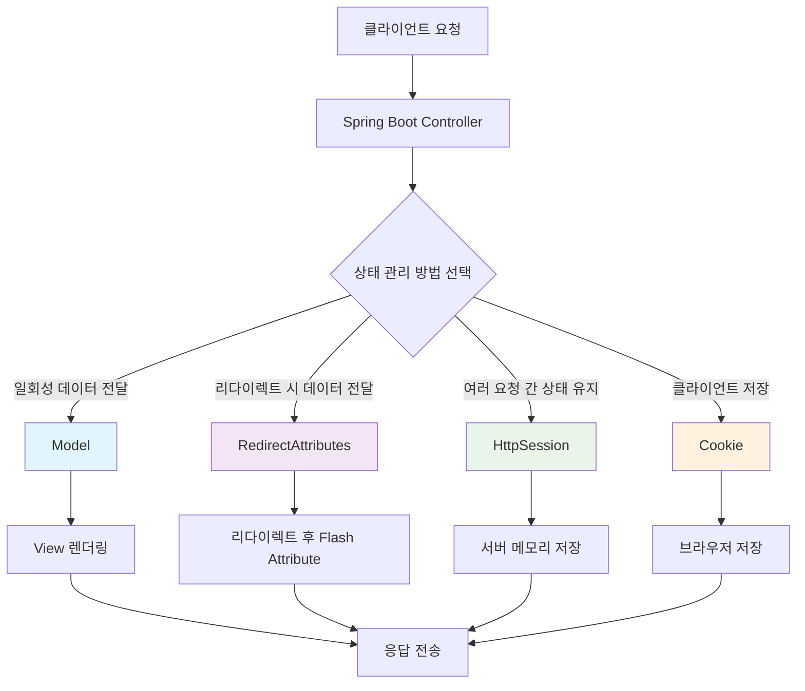
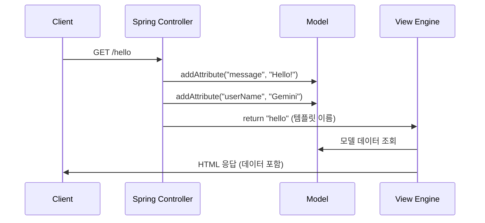
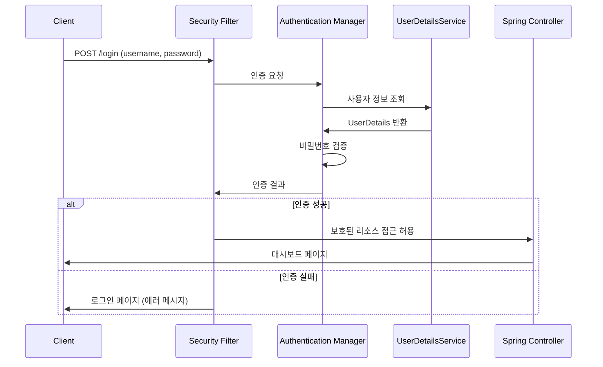
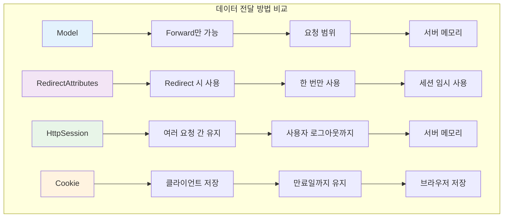
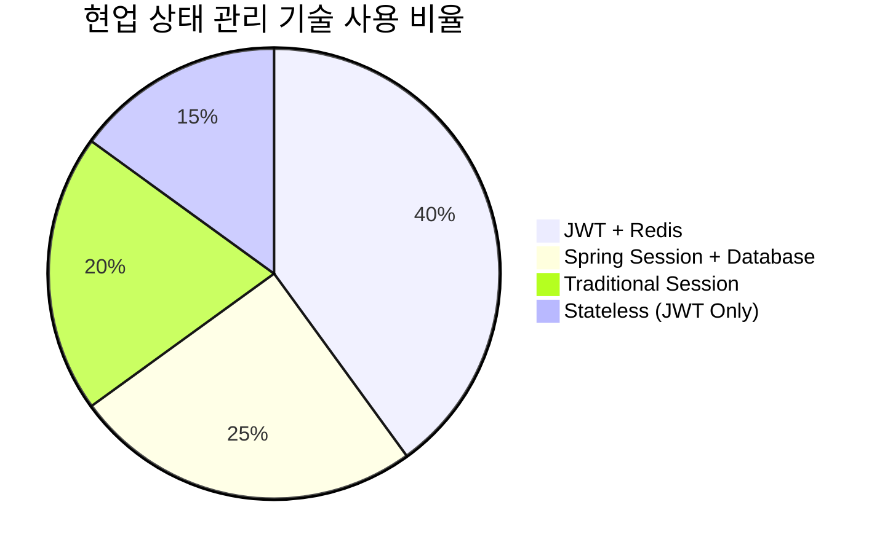
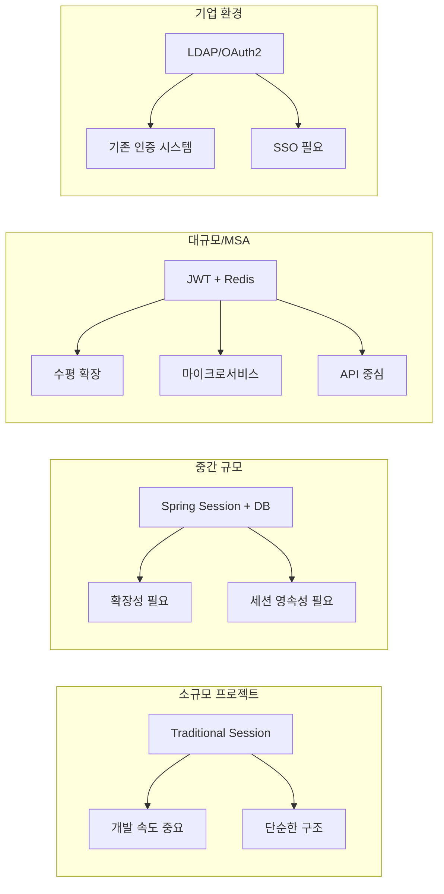
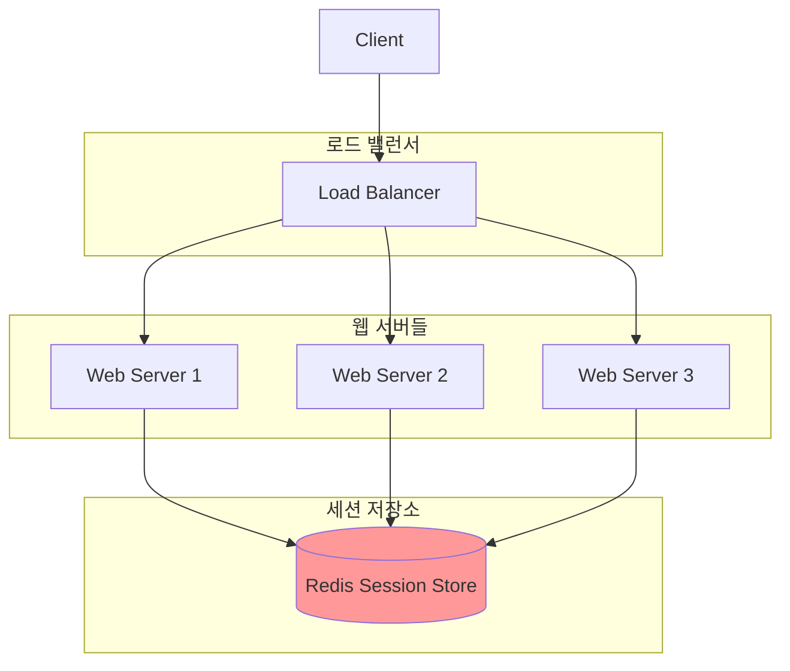
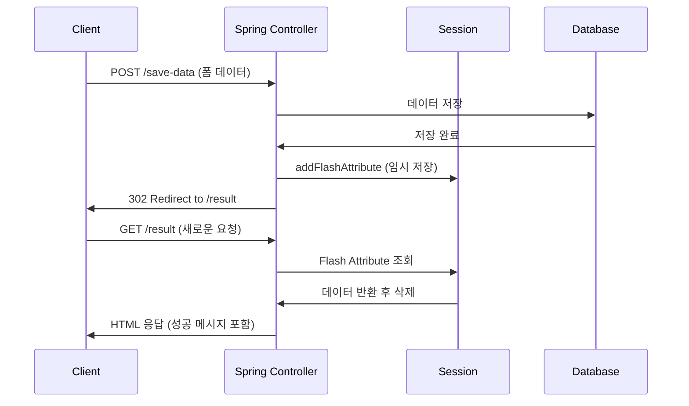
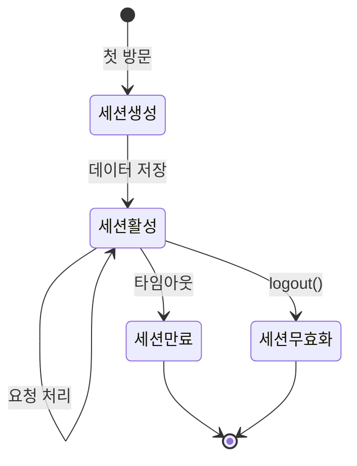
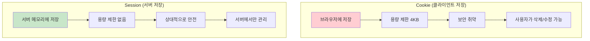

# Spring Boot 상태 관리 & 보안 종합 가이드

## 📋 목차
1. [상태 관리 개요](#상태-관리-개요)
2. [Model을 이용한 데이터 전달](#model을-이용한-데이터-전달)
3. [RedirectAttributes를 이용한 리다이렉트 데이터 전달](#redirectattributes를-이용한-리다이렉트-데이터-전달)
4. [Session을 이용한 상태 관리](#session을-이용한-상태-관리)
5. [Cookie를 이용한 클라이언트 상태 관리](#cookie를-이용한-클라이언트-상태-관리)
6. [Spring Security 기본 설정](#spring-security-기본-설정)
7. [예외 처리](#예외-처리)
8. [현업에서 주로 사용하는 기술](#현업에서-주로-사용하는-기술)

---

## 상태 관리 개요

Spring Boot에서 상태를 관리하는 주요 방법들을 시각화하면 다음과 같습니다:



---

## Model을 이용한 데이터 전달

### 개념
- Controller에서 View로 **일회성 데이터 전달**에 사용
- Forward 방식에서만 동작 (같은 요청 내에서)
- HttpServletRequest의 Attribute를 래핑한 객체

### 코드 예제

```java
// controller/ExampleController.java
package com.example.demo.controller;

import org.springframework.stereotype.Controller;
import org.springframework.ui.Model;
import org.springframework.web.bind.annotation.GetMapping;

@Controller  // 이 클래스가 Spring MVC Controller임을 선언
public class ExampleController {
    
    @GetMapping("/hello")  // GET 요청 /hello URL을 이 메서드가 처리
    public String hello(Model model) {
        // Model 객체를 통해 View에 전달할 데이터를 설정
        
        // "message"라는 키로 "Hello, Thymeleaf!" 값을 모델에 추가
        // View에서 ${message}로 접근 가능
        model.addAttribute("message", "Hello, Thymeleaf!");
        
        // "userName"이라는 키로 "Gemini" 값을 모델에 추가  
        // View에서 ${userName}으로 접근 가능
        model.addAttribute("userName", "Gemini");
        
        // templates/hello.html 템플릿을 찾아서 렌더링하라고 지시
        // Spring Boot는 기본적으로 src/main/resources/templates/ 경로에서 템플릿을 찾음
        return "hello";
    }
}
```

```html
<!-- templates/hello.html -->
<!DOCTYPE html>
<html xmlns:th="http://www.thymeleaf.org">  <!-- Thymeleaf 네임스페이스 선언 -->
<head>
    <title>Hello</title>
</head>
<body>
    <!-- th:text는 Thymeleaf 문법으로 ${message} 값으로 텍스트를 치환 -->
    <!-- 만약 message가 없으면 "기본 메시지"가 표시됨 -->
    <h1 th:text="${message}">기본 메시지</h1>
    
    <!-- span 태그 안의 텍스트를 ${userName} 값으로 치환 -->
    <!-- userName이 없으면 "Guest"가 표시됨 -->
    <p>Welcome, <span th:text="${userName}">Guest</span>!</p>
</body>
</html>
```

### 동작 흐름


---

## RedirectAttributes를 이용한 리다이렉트 데이터 전달

### 개념
- **Redirect 시 1회성 데이터 전달**에 사용
- Flash Attribute: 세션을 임시로 사용하여 리다이렉트 후 한 번만 사용 가능
- PRG(Post-Redirect-Get) 패턴에서 주로 사용

### 코드 예제

```java
// controller/ExampleController.java
package com.example.demo.controller;

import org.springframework.stereotype.Controller;
import org.springframework.web.bind.annotation.GetMapping;
import org.springframework.web.bind.annotation.PostMapping;
import org.springframework.web.servlet.mvc.support.RedirectAttributes;

@Controller
public class ExampleController {
    
    @PostMapping("/save-data")  // POST 요청 처리 (폼 제출 등)
    public String saveData(RedirectAttributes redirectAttributes) {
        
        // 실제로는 데이터베이스에 저장하는 로직이 들어감
        // 여기서는 예제를 위해 성공했다고 가정
        boolean success = true;
        
        if (success) {
            // CSRF 보호 설정 (기본적으로 활성화됨)
            .csrf(csrf -> csrf
                // REST API 경로는 CSRF 보호 비활성화 (주로 JWT 사용 시)
                .ignoringRequestMatchers("/api/**")
            );
        
        return http.build();
    }
    
    @Bean
    public PasswordEncoder passwordEncoder() {
        // BCrypt 해시 알고리즘을 사용한 비밀번호 암호화
        // 같은 비밀번호라도 매번 다른 해시값 생성 (솔트 사용)
        return new BCryptPasswordEncoder();
    }
    
    @Bean
    public UserDetailsService userDetailsService() {
        // 메모리 기반 사용자 저장소 (테스트용)
        // 실제 운영에서는 데이터베이스 연동 필요
        
        UserDetails user = User.builder()
                .username("user")  // 사용자명
                .password(passwordEncoder().encode("password"))  // 암호화된 비밀번호
                .roles("USER")  // 역할 설정 (ROLE_USER로 저장됨)
                .build();
        
        UserDetails admin = User.builder()
                .username("admin")
                .password(passwordEncoder().encode("admin123"))
                .roles("USER", "ADMIN")  // 여러 역할 설정 가능
                .build();
        
        // 메모리에 사용자 정보 저장
        return new InMemoryUserDetailsManager(user, admin);
    }
}
```

### 로그인 컨트롤러

```java
// controller/AuthController.java
package com.example.demo.controller;

import org.springframework.stereotype.Controller;
import org.springframework.ui.Model;
import org.springframework.web.bind.annotation.GetMapping;
import org.springframework.web.bind.annotation.RequestParam;

@Controller
public class AuthController {
    
    @GetMapping("/login")
    public String login(
            @RequestParam(value = "error", required = false) String error,  // 로그인 실패 파라미터
            @RequestParam(value = "logout", required = false) String logout,  // 로그아웃 파라미터
            Model model) {
        
        // 로그인 실패 시 에러 메시지 설정
        if (error != null) {
            model.addAttribute("errorMessage", "아이디 또는 비밀번호가 잘못되었습니다.");
        }
        
        // 로그아웃 성공 시 메시지 설정
        if (logout != null) {
            model.addAttribute("logoutMessage", "성공적으로 로그아웃되었습니다.");
        }
        
        return "login";  // templates/login.html 렌더링
    }
    
    @GetMapping("/dashboard")
    public String dashboard(Model model) {
        // 인증된 사용자만 접근 가능한 대시보드
        model.addAttribute("message", "로그인에 성공했습니다!");
        return "dashboard";
    }
}
```

```html
<!-- templates/login.html -->
<!DOCTYPE html>
<html xmlns:th="http://www.thymeleaf.org">
<head>
    <title>로그인</title>
    <style>
        .login-container { max-width: 400px; margin: 50px auto; padding: 20px; border: 1px solid #ddd; }
        .form-group { margin: 15px 0; }
        .form-control { width: 100%; padding: 10px; border: 1px solid #ccc; }
        .btn-primary { background: #007bff; color: white; padding: 10px 20px; border: none; width: 100%; }
        .alert { padding: 10px; margin: 10px 0; }
        .alert-error { background: #f8d7da; color: #721c24; }
        .alert-success { background: #d4edda; color: #155724; }
    </style>
</head>
<body>
    <div class="login-container">
        <h2>로그인</h2>
        
        <!-- 에러 메시지 표시 -->
        <div th:if="${errorMessage}" class="alert alert-error">
            <p th:text="${errorMessage}"></p>
        </div>
        
        <!-- 로그아웃 성공 메시지 표시 -->
        <div th:if="${logoutMessage}" class="alert alert-success">
            <p th:text="${logoutMessage}"></p>
        </div>
        
        <!-- Spring Security가 처리하는 로그인 폼 -->
        <!-- action="/login"과 method="post"는 Spring Security 기본 설정 -->
        <form th:action="@{/login}" method="post">
            
            <div class="form-group">
                <label for="username">사용자명:</label>
                <!-- name="username"은 Spring Security 기본 파라미터명 -->
                <input type="text" id="username" name="username" class="form-control" required>
            </div>
            
            <div class="form-group">
                <label for="password">비밀번호:</label>
                <!-- name="password"는 Spring Security 기본 파라미터명 -->
                <input type="password" id="password" name="password" class="form-control" required>
            </div>
            
            <!-- CSRF 토큰 자동 추가 (Thymeleaf가 자동 처리) -->
            <button type="submit" class="btn-primary">로그인</button>
        </form>
        
        <div style="margin-top: 20px; font-size: 12px; color: #666;">
            <p>테스트 계정:</p>
            <p>일반 사용자 - user/password</p>
            <p>관리자 - admin/admin123</p>
        </div>
    </div>
</body>
</html>
```

### Spring Security 인증 흐름


---

## 예외 처리

### 글로벌 예외 처리기

```java
// exception/GlobalExceptionHandler.java
package com.example.demo.exception;

import org.springframework.ui.Model;
import org.springframework.web.bind.annotation.ControllerAdvice;
import org.springframework.web.bind.annotation.ExceptionHandler;
import org.springframework.web.servlet.mvc.support.RedirectAttributes;

@ControllerAdvice  // 모든 Controller에서 발생하는 예외를 처리
public class GlobalExceptionHandler {
    
    @ExceptionHandler(IllegalArgumentException.class)  // IllegalArgumentException 처리
    public String handleIllegalArgumentException(
            IllegalArgumentException e, 
            Model model) {
        
        // 예외 메시지를 Model에 추가
        model.addAttribute("errorMessage", e.getMessage());
        model.addAttribute("errorType", "입력 오류");
        
        // 에러 페이지 반환
        return "error";
    }
    
    @ExceptionHandler(RuntimeException.class)  // 런타임 예외 처리
    public String handleRuntimeException(
            RuntimeException e, 
            RedirectAttributes redirectAttributes) {
        
        // 예외 발생 시 Flash Attribute로 에러 메시지 전달
        redirectAttributes.addFlashAttribute("errorMessage", 
            "처리 중 오류가 발생했습니다: " + e.getMessage());
        
        // 이전 페이지로 리다이렉트
        return "redirect:/";
    }
    
    @ExceptionHandler(Exception.class)  // 모든 예외의 최종 처리
    public String handleGenericException(Exception e, Model model) {
        
        // 상세한 에러 정보를 Model에 추가
        model.addAttribute("errorMessage", "시스템 오류가 발생했습니다.");
        model.addAttribute("errorDetails", e.getMessage());
        model.addAttribute("errorType", "시스템 오류");
        
        return "error";
    }
}
```

### 커스텀 예외 클래스

```java
// exception/CustomExceptions.java
package com.example.demo.exception;

// 사용자를 찾을 수 없을 때 발생하는 예외
public class UserNotFoundException extends RuntimeException {
    public UserNotFoundException(String message) {
        super(message);  // 부모 클래스의 생성자 호출
    }
    
    public UserNotFoundException(String message, Throwable cause) {
        super(message, cause);  // 원인 예외까지 함께 전달
    }
}

// 권한이 없을 때 발생하는 예외
public class UnauthorizedException extends RuntimeException {
    public UnauthorizedException(String message) {
        super(message);
    }
}

// 데이터 검증 실패 시 발생하는 예외
public class ValidationException extends RuntimeException {
    private final String field;  // 어떤 필드에서 오류가 발생했는지
    
    public ValidationException(String field, String message) {
        super(message);
        this.field = field;
    }
    
    public String getField() {
        return field;
    }
}
```

```html
<!-- templates/error.html -->
<!DOCTYPE html>
<html xmlns:th="http://www.thymeleaf.org">
<head>
    <title>오류 발생</title>
    <style>
        .error-container { max-width: 600px; margin: 50px auto; padding: 20px; }
        .error-header { color: #dc3545; border-bottom: 2px solid #dc3545; padding-bottom: 10px; }
        .error-content { background: #f8d7da; padding: 15px; margin: 15px 0; border-radius: 5px; }
        .error-details { background: #f5f5f5; padding: 10px; margin: 10px 0; font-family: monospace; }
        .btn-home { background: #007bff; color: white; padding: 10px 20px; text-decoration: none; }
    </style>
</head>
<body>
    <div class="error-container">
        <div class="error-header">
            <h1>⚠️ 오류가 발생했습니다</h1>
        </div>
        
        <div class="error-content">
            <!-- 에러 타입 표시 -->
            <h3 th:text="${errorType ?: '알 수 없는 오류'}">오류 타입</h3>
            
            <!-- 에러 메시지 표시 -->
            <p th:text="${errorMessage ?: '처리 중 문제가 발생했습니다.'}">에러 메시지</p>
        </div>
        
        <!-- 상세 에러 정보가 있을 때만 표시 -->
        <div th:if="${errorDetails}" class="error-details">
            <h4>상세 정보:</h4>
            <pre th:text="${errorDetails}"></pre>
        </div>
        
        <div>
            <a href="/" class="btn-home">홈으로 돌아가기</a>
            <a href="javascript:history.back()" class="btn-home" style="background: #6c757d;">이전 페이지</a>
        </div>
    </div>
</body>
</html>
```

---

## 실무 적용 예제: 쇼핑몰 장바구니

### 컨트롤러 구현

```java
// controller/ShoppingCartController.java
package com.example.demo.controller;

import jakarta.servlet.http.HttpSession;
import org.springframework.stereotype.Controller;
import org.springframework.ui.Model;
import org.springframework.web.bind.annotation.GetMapping;
import org.springframework.web.bind.annotation.PostMapping;
import org.springframework.web.bind.annotation.RequestParam;
import org.springframework.web.servlet.mvc.support.RedirectAttributes;

import java.util.ArrayList;
import java.util.List;

@Controller
public class ShoppingCartController {
    
    // 상품 정보를 담는 간단한 클래스
    public static class CartItem {
        private String productName;  // 상품명
        private int quantity;        // 수량
        private double price;        // 가격
        
        // 생성자
        public CartItem(String productName, int quantity, double price) {
            this.productName = productName;
            this.quantity = quantity;
            this.price = price;
        }
        
        // Getter 메서드들 (Thymeleaf에서 접근하기 위해 필요)
        public String getProductName() { return productName; }
        public int getQuantity() { return quantity; }
        public double getPrice() { return price; }
        public double getTotalPrice() { return quantity * price; }  // 총 가격 계산
        
        // 수량 증가 메서드
        public void increaseQuantity() { this.quantity++; }
    }
    
    @GetMapping("/shop")
    public String showShop() {
        // 상품 목록 페이지 표시
        return "shop";
    }
    
    @PostMapping("/cart/add")
    public String addToCart(
            @RequestParam String productName,  // 상품명
            @RequestParam int quantity,        // 수량
            @RequestParam double price,        // 가격
            HttpSession session,               // 세션 객체
            RedirectAttributes redirectAttributes) {
        
        try {
            // 세션에서 장바구니 조회 (없으면 새로 생성)
            @SuppressWarnings("unchecked")
            List<CartItem> cart = (List<CartItem>) session.getAttribute("cart");
            
            if (cart == null) {
                cart = new ArrayList<>();  // 첫 상품 추가 시 새 장바구니 생성
            }
            
            // 이미 같은 상품이 장바구니에 있는지 확인
            boolean found = false;
            for (CartItem item : cart) {
                if (item.getProductName().equals(productName)) {
                    item.increaseQuantity();  // 이미 있으면 수량만 증가
                    found = true;
                    break;
                }
            }
            
            // 새로운 상품이면 장바구니에 추가
            if (!found) {
                cart.add(new CartItem(productName, quantity, price));
            }
            
            // 업데이트된 장바구니를 세션에 다시 저장
            session.setAttribute("cart", cart);
            
            // 성공 메시지 Flash Attribute로 전달
            redirectAttributes.addFlashAttribute("successMessage", 
                productName + "이(가) 장바구니에 추가되었습니다!");
            
        } catch (Exception e) {
            // 에러 발생 시 Flash Attribute로 에러 메시지 전달
            redirectAttributes.addFlashAttribute("errorMessage", 
                "장바구니 추가 중 오류가 발생했습니다.");
        }
        
        return "redirect:/cart";
    }
    
    @GetMapping("/cart")
    public String showCart(HttpSession session, Model model) {
        
        // 세션에서 장바구니 조회
        @SuppressWarnings("unchecked")
        List<CartItem> cart = (List<CartItem>) session.getAttribute("cart");
        
        if (cart == null) {
            cart = new ArrayList<>();  // 빈 장바구니로 초기화
        }
        
        // 총 가격 계산
        double totalAmount = cart.stream()
                .mapToDouble(CartItem::getTotalPrice)  // 각 아이템의 총 가격
                .sum();  // 모든 아이템의 가격 합계
        
        // Model에 데이터 추가하여 View로 전달
        model.addAttribute("cartItems", cart);
        model.addAttribute("totalAmount", totalAmount);
        model.addAttribute("itemCount", cart.size());
        
        return "cart";
    }
    
    @PostMapping("/cart/clear")
    public String clearCart(
            HttpSession session, 
            RedirectAttributes redirectAttributes) {
        
        // 세션에서 장바구니 제거
        session.removeAttribute("cart");
        
        // 성공 메시지 전달
        redirectAttributes.addFlashAttribute("successMessage", "장바구니가 비워졌습니다.");
        
        return "redirect:/cart";
    }
}
```

### 장바구니 페이지

```html
<!-- templates/cart.html -->
<!DOCTYPE html>
<html xmlns:th="http://www.thymeleaf.org">
<head>
    <title>장바구니</title>
    <style>
        .cart-container { max-width: 800px; margin: 20px auto; padding: 20px; }
        .cart-table { width: 100%; border-collapse: collapse; margin: 20px 0; }
        .cart-table th, .cart-table td { border: 1px solid #ddd; padding: 10px; text-align: left; }
        .cart-table th { background: #f5f5f5; }
        .total-section { background: #e9ecef; padding: 15px; margin: 20px 0; }
        .btn { padding: 10px 20px; margin: 5px; text-decoration: none; }
        .btn-primary { background: #007bff; color: white; }
        .btn-danger { background: #dc3545; color: white; }
        .alert { padding: 10px; margin: 10px 0; }
        .alert-success { background: #d4edda; color: #155724; }
        .alert-error { background: #f8d7da; color: #721c24; }
    </style>
</head>
<body>
    <div class="cart-container">
        <h1>🛒 장바구니</h1>
        
        <!-- Flash Attribute 메시지 표시 -->
        <div th:if="${successMessage}" class="alert alert-success">
            <p th:text="${successMessage}"></p>
        </div>
        
        <div th:if="${errorMessage}" class="alert alert-error">
            <p th:text="${errorMessage}"></p>
        </div>
        
        <!-- 장바구니가 비어있지 않을 때만 테이블 표시 -->
        <div th:if="${cartItems != null and #lists.size(cartItems) > 0}">
            <table class="cart-table">
                <thead>
                    <tr>
                        <th>상품명</th>
                        <th>가격</th>
                        <th>수량</th>
                        <th>총 가격</th>
                    </tr>
                </thead>
                <tbody>
                    <!-- Thymeleaf 반복문: cartItems의 각 항목에 대해 반복 -->
                    <tr th:each="item : ${cartItems}">
                        <td th:text="${item.productName}">상품명</td>
                        <td th:text="${#numbers.formatDecimal(item.price, 0, 2)} + '원'">가격</td>
                        <td th:text="${item.quantity} + '개'">수량</td>
                        <td th:text="${#numbers.formatDecimal(item.totalPrice, 0, 2)} + '원'">총 가격</td>
                    </tr>
                </tbody>
            </table>
            
            <!-- 주문 요약 -->
            <div class="total-section">
                <h3>주문 요약</h3>
                <p>총 상품 수: <strong th:text="${itemCount}">0</strong>개</p>
                <p>총 결제 금액: <strong th:text="${#numbers.formatDecimal(totalAmount, 0, 2)} + '원'">0원</strong></p>
            </div>
            
            <!-- 액션 버튼들 -->
            <div>
                <form th:action="@{/cart/clear}" method="post" style="display: inline;">
                    <button type="submit" class="btn btn-danger" 
                            onclick="return confirm('장바구니를 모두 비우시겠습니까?')">
                        장바구니 비우기
                    </button>
                </form>
                <a href="/shop" class="btn btn-primary">계속 쇼핑하기</a>
            </div>
        </div>
        
        <!-- 장바구니가 비어있을 때 -->
        <div th:if="${cartItems == null or #lists.size(cartItems) == 0}">
            <p>장바구니가 비어있습니다.</p>
            <a href="/shop" class="btn btn-primary">쇼핑하러 가기</a>
        </div>
    </div>
</body>
</html>
```

---

## 상태 관리 방법 비교



| 방법 | 저장 위치 | 생명 주기 | 용량 제한 | 보안성 | 사용 시기 |
|------|-----------|-----------|-----------|--------|-----------|
| **Model** | 서버 메모리 | 하나의 요청 | 제한 없음 | 높음 | Controller → View 데이터 전달 |
| **RedirectAttributes** | 세션 (임시) | 리다이렉트 후 1회 | 제한 없음 | 높음 | PRG 패턴, 상태 메시지 전달 |
| **HttpSession** | 서버 메모리 | 세션 유지 기간 | 제한 없음 | 높음 | 로그인 상태, 장바구니 등 |
| **Cookie** | 클라이언트 | 설정된 만료일까지 | 4KB | 낮음 | 사용자 설정, 임시 데이터 |

---

## JWT 기반 인증 (현업 표준)

### JWT 설정

```java
// config/JwtConfig.java
package com.example.demo.config;

import io.jsonwebtoken.Claims;
import io.jsonwebtoken.Jwts;
import io.jsonwebtoken.SignatureAlgorithm;
import io.jsonwebtoken.security.Keys;
import org.springframework.stereotype.Component;

import java.security.Key;
import java.util.Date;

@Component  // Spring Bean으로 등록
public class JwtUtil {
    
    // JWT 서명에 사용할 비밀키 (실제 운영에서는 환경변수나 설정파일에서 관리)
    private final Key secretKey = Keys.secretKeyFor(SignatureAlgorithm.HS256);
    
    // JWT 만료 시간 (24시간)
    private final long EXPIRATION_TIME = 1000 * 60 * 60 * 24;
    
    // JWT 토큰 생성
    public String generateToken(String username) {
        Date now = new Date();  // 현재 시간
        Date expiryDate = new Date(now.getTime() + EXPIRATION_TIME);  // 만료 시간
        
        return Jwts.builder()
                .setSubject(username)  // 토큰의 주체 (사용자명)
                .setIssuedAt(now)      // 토큰 발급 시간
                .setExpiration(expiryDate)  // 토큰 만료 시간
                .signWith(secretKey)   // 비밀키로 서명
                .compact();            // 문자열로 직렬화
    }
    
    // JWT 토큰에서 사용자명 추출
    public String getUsernameFromToken(String token) {
        Claims claims = Jwts.parserBuilder()
                .setSigningKey(secretKey)  // 서명 검증용 키 설정
                .build()
                .parseClaimsJws(token)     // 토큰 파싱 및 검증
                .getBody();                // Claims 추출
        
        return claims.getSubject();  // 사용자명 반환
    }
    
    // JWT 토큰 유효성 검증
    public boolean validateToken(String token) {
        try {
            Jwts.parserBuilder()
                    .setSigningKey(secretKey)
                    .build()
                    .parseClaimsJws(token);
            return true;  // 파싱 성공하면 유효한 토큰
        } catch (Exception e) {
            return false;  // 예외 발생하면 유효하지 않은 토큰
        }
    }
}
```

### REST API 컨트롤러

```java
// controller/ApiController.java
package com.example.demo.controller;

import org.springframework.beans.factory.annotation.Autowired;
import org.springframework.http.ResponseEntity;
import org.springframework.web.bind.annotation.*;

import java.util.HashMap;
import java.util.Map;

@RestController  // JSON 응답을 반환하는 Controller
@RequestMapping("/api")  // 모든 메서드에 /api 접두사 추가
public class ApiController {
    
    @Autowired
    private JwtUtil jwtUtil;  // JWT 유틸리티 주입
    
    @PostMapping("/login")
    public ResponseEntity<?> login(@RequestBody Map<String, String> loginData) {
        
        String username = loginData.get("username");  // 요청에서 사용자명 추출
        String password = loginData.get("password");  // 요청에서 비밀번호 추출
        
        // 실제로는 데이터베이스에서 사용자 인증
        // 여기서는 간단한 하드코딩된 인증
        if ("user".equals(username) && "password".equals(password)) {
            
            // 인증 성공 시 JWT 토큰 생성
            String token = jwtUtil.generateToken(username);
            
            // JSON 응답 데이터 구성
            Map<String, Object> response = new HashMap<>();
            response.put("success", true);
            response.put("token", token);
            response.put("message", "로그인 성공");
            
            // HTTP 200 OK와 함께 JSON 응답 반환
            return ResponseEntity.ok(response);
            
        } else {
            // 인증 실패 시
            Map<String, Object> response = new HashMap<>();
            response.put("success", false);
            response.put("message", "아이디 또는 비밀번호가 잘못되었습니다.");
            
            // HTTP 401 Unauthorized와 함께 JSON 응답 반환
            return ResponseEntity.status(401).body(response);
        }
    }
    
    @GetMapping("/protected")
    public ResponseEntity<?> protectedEndpoint(
            @RequestHeader("Authorization") String authHeader) {  // Authorization 헤더에서 토큰 추출
        
        try {
            // "Bearer " 접두사 제거하고 실제 토큰만 추출
            String token = authHeader.substring(7);
            
            // 토큰 유효성 검증
            if (jwtUtil.validateToken(token)) {
                String username = jwtUtil.getUsernameFromToken(token);
                
                Map<String, Object> response = new HashMap<>();
                response.put("success", true);
                response.put("message", "인증된 사용자: " + username);
                response.put("data", "보호된 데이터입니다.");
                
                return ResponseEntity.ok(response);
            } else {
                // 토큰이 유효하지 않음
                Map<String, Object> response = new HashMap<>();
                response.put("success", false);
                response.put("message", "유효하지 않은 토큰입니다.");
                
                return ResponseEntity.status(401).body(response);
            }
        } catch (Exception e) {
            // 토큰 파싱 중 예외 발생
            Map<String, Object> response = new HashMap<>();
            response.put("success", false);
            response.put("message", "토큰 처리 중 오류가 발생했습니다.");
            
            return ResponseEntity.status(401).body(response);
        }
    }
}
```

---

## 현업에서 주로 사용하는 기술

### 📊 상태 관리 기술 선호도 (현업 기준)



### 🎯 상황별 권장 기술

#### 1. **대규모 서비스 (MSA 환경)**
```java
// 추천: JWT + Redis 조합
@Service
public class AuthService {
    
    @Autowired
    private RedisTemplate<String, String> redisTemplate;  // Redis 연동
    
    @Autowired
    private JwtUtil jwtUtil;
    
    public String login(String username, String password) {
        // 1. 사용자 인증
        if (authenticate(username, password)) {
            
            // 2. JWT 토큰 생성
            String accessToken = jwtUtil.generateToken(username);
            String refreshToken = jwtUtil.generateRefreshToken(username);
            
            // 3. Redis에 Refresh Token 저장 (만료 시간과 함께)
            redisTemplate.opsForValue().set(
                "refresh_token:" + username, 
                refreshToken, 
                Duration.ofDays(7)  // 7일 후 만료
            );
            
            return accessToken;
        }
        throw new UnauthorizedException("인증 실패");
    }
}
```

**장점:**
- 서버 확장성 우수 (Stateless)
- 마이크로서비스 간 토큰 공유 가능
- Redis로 토큰 관리 효율적

#### 2. **중소규모 웹 애플리케이션**
```java
// 추천: Spring Session + Database
@Configuration
@EnableJdbcHttpSession  // 데이터베이스 기반 세션 저장
public class SessionConfig {
    
    @Bean
    public JdbcOperations jdbcTemplate(DataSource dataSource) {
        return new JdbcTemplate(dataSource);  // 데이터베이스 연동
    }
}

@Controller
public class UserController {
    
    @PostMapping("/login")
    public String login(@RequestParam String username, 
                       @RequestParam String password,
                       HttpSession session,
                       RedirectAttributes redirectAttributes) {
        
        // 사용자 인증 후 세션에 사용자 정보 저장
        User user = userService.authenticate(username, password);
        if (user != null) {
            session.setAttribute("user", user);  // 데이터베이스에 세션 정보 저장
            session.setAttribute("loginTime", new Date());
            
            return "redirect:/dashboard";
        } else {
            redirectAttributes.addFlashAttribute("error", "로그인 실패");
            return "redirect:/login";
        }
    }
}
```

**장점:**
- 구현 복잡도 낮음
- Spring Boot 기본 기능 활용
- 세션 데이터 영구 보존

#### 3. **기업 내부 시스템**
```java
// 추천: LDAP/Active Directory 연동
@Configuration
@EnableWebSecurity
public class LdapSecurityConfig {
    
    @Bean
    public SecurityFilterChain filterChain(HttpSecurity http) throws Exception {
        http
            .authorizeHttpRequests(authorize -> authorize
                .requestMatchers("/public/**").permitAll()
                .anyRequest().authenticated()
            )
            .formLogin(form -> form
                .loginPage("/login")
                .defaultSuccessUrl("/dashboard")
                .permitAll()
            )
            // LDAP 인증 설정
            .ldapAuthentication(ldap -> ldap
                .userDnPatterns("uid={0},ou=users")  // 사용자 DN 패턴
                .contextSource()
                .url("ldap://localhost:8389/dc=springframework,dc=org")  // LDAP 서버 URL
            );
        
        return http.build();
    }
}
```

### 📈 기술별 적합한 상황



---

## 보안 베스트 프랙티스

### 1. **비밀번호 암호화**

```java
// service/UserService.java
@Service
public class UserService {
    
    @Autowired
    private PasswordEncoder passwordEncoder;  // BCrypt 암호화
    
    public void registerUser(String username, String rawPassword) {
        // 평문 비밀번호를 BCrypt로 암호화
        String encodedPassword = passwordEncoder.encode(rawPassword);
        
        // 암호화된 비밀번호를 데이터베이스에 저장
        // userRepository.save(new User(username, encodedPassword));
    }
    
    public boolean validatePassword(String rawPassword, String encodedPassword) {
        // 입력된 평문 비밀번호와 저장된 암호화된 비밀번호 비교
        return passwordEncoder.matches(rawPassword, encodedPassword);
    }
}
```

### 2. **CSRF 보호**

```html
<!-- 모든 POST 폼에 CSRF 토큰 포함 (Thymeleaf 자동 처리) -->
<form th:action="@{/submit}" method="post">
    <!-- Thymeleaf가 자동으로 CSRF 토큰을 hidden input으로 추가 -->
    <input type="text" name="data">
    <button type="submit">제출</button>
</form>
```

### 3. **세션 보안 설정**

```java
// config/SessionConfig.java
@Configuration
public class SessionConfig {
    
    @Bean
    public ServletContextInitializer servletContextInitializer() {
        return servletContext -> {
            // 세션 쿠키 보안 설정
            SessionCookieConfig sessionCookieConfig = 
                servletContext.getSessionCookieConfig();
            
            sessionCookieConfig.setHttpOnly(true);  // JavaScript 접근 차단
            sessionCookieConfig.setSecure(true);    // HTTPS에서만 전송
            sessionCookieConfig.setMaxAge(1800);    // 30분 후 만료
            sessionCookieConfig.setSameSite(SessionCookieConfig.SameSite.STRICT);  // CSRF 공격 방지
        };
    }
}
```

---

## 성능 최적화 팁

### 1. **세션 클러스터링 (다중 서버 환경)**

```java
// config/RedisSessionConfig.java
@Configuration
@EnableRedisHttpSession(maxInactiveIntervalInSeconds = 1800)  // 30분
public class RedisSessionConfig {
    
    @Bean
    public LettuceConnectionFactory connectionFactory() {
        // Redis 서버 연결 설정
        return new LettuceConnectionFactory(
            new RedisStandaloneConfiguration("localhost", 6379)
        );
    }
}
```

**세션 클러스터링 구조:**


### 2. **캐시 활용**

```java
// service/CacheService.java
@Service
public class CacheService {
    
    @Autowired
    private RedisTemplate<String, Object> redisTemplate;
    
    @Cacheable(value = "userCache", key = "#userId")  // 캐시 적용
    public User getUserById(Long userId) {
        // 데이터베이스에서 사용자 조회 (캐시 미스 시에만 실행)
        return userRepository.findById(userId).orElse(null);
    }
    
    @CacheEvict(value = "userCache", key = "#user.id")  // 캐시 삭제
    public void updateUser(User user) {
        // 사용자 정보 업데이트 후 캐시에서 제거
        userRepository.save(user);
    }
}
```

---

## 현업에서 주로 사용하는 기술

### 🏆 **1순위: JWT + Redis (40%)**

**사용 이유:**
- **확장성**: 서버 증설 시 세션 공유 문제 없음
- **성능**: Stateless 구조로 서버 부하 감소
- **MSA 친화적**: 마이크로서비스 간 토큰 공유 가능
- **모바일 앱 지원**: 쿠키 없이도 인증 가능

**구현 예시:**
```yaml
# application.yml
spring:
  redis:
    host: localhost
    port: 6379
    password: your-redis-password
    timeout: 3000ms
    
jwt:
  secret: your-jwt-secret-key
  expiration: 86400000  # 24시간
```

### 🥈 **2순위: Spring Session + Database (25%)**

**사용 이유:**
- **안정성**: 세션 데이터 영구 보존
- **구현 용이성**: Spring Boot 기본 기능 활용
- **디버깅**: 세션 데이터 직접 확인 가능

**구현 예시:**
```sql
-- 세션 테이블 (자동 생성됨)
CREATE TABLE SPRING_SESSION (
    PRIMARY_ID CHAR(36) NOT NULL,
    SESSION_ID CHAR(36) NOT NULL,
    CREATION_TIME BIGINT NOT NULL,
    LAST_ACCESS_TIME BIGINT NOT NULL,
    MAX_INACTIVE_INTERVAL INT NOT NULL,
    EXPIRY_TIME BIGINT NOT NULL,
    PRINCIPAL_NAME VARCHAR(100),
    CONSTRAINT SPRING_SESSION_PK PRIMARY KEY (PRIMARY_ID)
);
```

### 🥉 **3순위: OAuth2 + JWT (20%)**

**사용 이유:**
- **SSO**: 구글, 페이스북 등 소셜 로그인
- **보안**: 타사 인증 서비스 활용
- **사용자 편의성**: 별도 회원가입 불필요

```java
// OAuth2 설정
@Configuration
@EnableOAuth2Client
public class OAuth2Config {
    
    @Bean
    public SecurityFilterChain filterChain(HttpSecurity http) throws Exception {
        http
            .oauth2Login(oauth2 -> oauth2
                .loginPage("/login")
                .defaultSuccessUrl("/dashboard")
                .userInfoEndpoint(userInfo -> userInfo
                    .userService(customOAuth2UserService)  // 커스텀 사용자 서비스
                )
            );
        return http.build();
    }
}
```

### 📋 **기술 선택 가이드**

| 프로젝트 규모 | 추천 기술 | 이유 |
|---------------|-----------|------|
| **스타트업/MVP** | Traditional Session | 빠른 개발, 단순함 |
| **중소기업 웹서비스** | Spring Session + DB | 안정성과 확장성 균형 |
| **대기업/글로벌 서비스** | JWT + Redis | 수평 확장, 성능 최적화 |
| **B2B 기업 솔루션** | LDAP/OAuth2 | 기존 인프라 활용, SSO |

---

## 실제 프로덕션 코드 예제

### 종합 보안 설정 (현업 표준)

```java
// config/ProductionSecurityConfig.java
@Configuration
@EnableWebSecurity
@EnableMethodSecurity(prePostEnabled = true)  // 메서드 레벨 보안 활성화
public class ProductionSecurityConfig {
    
    @Autowired
    private JwtAuthenticationEntryPoint jwtAuthenticationEntryPoint;
    
    @Autowired
    private JwtRequestFilter jwtRequestFilter;
    
    @Bean
    public SecurityFilterChain filterChain(HttpSecurity http) throws Exception {
        http
            // CORS 설정
            .cors(cors -> cors.configurationSource(corsConfigurationSource()))
            
            // CSRF 설정 (API는 비활성화, 웹은 활성화)
            .csrf(csrf -> csrf
                .ignoringRequestMatchers("/api/**")  // REST API는 CSRF 비활성화
                .csrfTokenRepository(CookieCsrfTokenRepository.withHttpOnlyFalse())
            )
            
            // 세션 관리 정책
            .sessionManagement(session -> session
                .sessionCreationPolicy(SessionCreationPolicy.IF_REQUIRED)
                .maximumSessions(1)  // 동시 세션 1개로 제한
                .maxSessionsPreventsLogin(false)  // 새 로그인 시 기존 세션 만료
                .sessionRegistry(sessionRegistry())
            )
            
            // URL별 접근 권한
            .authorizeHttpRequests(authorize -> authorize
                .requestMatchers("/", "/login", "/register", "/api/auth/**").permitAll()
                .requestMatchers("/admin/**").hasRole("ADMIN")
                .requestMatchers("/api/**").authenticated()
                .anyRequest().authenticated()
            )
            
            // JWT 필터 추가
            .addFilterBefore(jwtRequestFilter, UsernamePasswordAuthenticationFilter.class)
            
            // 예외 처리
            .exceptionHandling(exception -> exception
                .authenticationEntryPoint(jwtAuthenticationEntryPoint)
                .accessDeniedHandler(customAccessDeniedHandler())
            )
            
            // 로그아웃 설정
            .logout(logout -> logout
                .logoutUrl("/logout")
                .logoutSuccessUrl("/login?logout=true")
                .invalidateHttpSession(true)
                .deleteCookies("JSESSIONID", "remember-me")
                .addLogoutHandler(customLogoutHandler())  // 커스텀 로그아웃 핸들러
            );
            
        return http.build();
    }
    
    @Bean
    public CorsConfigurationSource corsConfigurationSource() {
        CorsConfiguration configuration = new CorsConfiguration();
        
        // 허용할 오리진 설정 (프로덕션에서는 구체적인 도메인 지정)
        configuration.setAllowedOriginPatterns(List.of("https://*.yourdomain.com"));
        
        // 허용할 HTTP 메서드
        configuration.setAllowedMethods(List.of("GET", "POST", "PUT", "DELETE", "PATCH"));
        
        // 허용할 헤더
        configuration.setAllowedHeaders(List.of("*"));
        
        // 자격 증명 허용 (쿠키, Authorization 헤더 등)
        configuration.setAllowCredentials(true);
        
        UrlBasedCorsConfigurationSource source = new UrlBasedCorsConfigurationSource();
        source.registerCorsConfiguration("/**", configuration);
        
        return source;
    }
}
```

### 실시간 상태 관리 (WebSocket + Session)

```java
// config/WebSocketConfig.java
@Configuration
@EnableWebSocket  // WebSocket 활성화
public class WebSocketConfig implements WebSocketConfigurer {
    
    @Override
    public void registerWebSocketHandlers(WebSocketHandlerRegistry registry) {
        // WebSocket 핸들러 등록
        registry.addHandler(new ChatWebSocketHandler(), "/chat")
                .setAllowedOrigins("*")  // CORS 설정
                .withSockJS();  // SockJS 폴백 지원
    }
}

// handler/ChatWebSocketHandler.java
@Component
public class ChatWebSocketHandler extends TextWebSocketHandler {
    
    // 연결된 세션들을 저장하는 동시성 안전한 맵
    private final Map<String, WebSocketSession> sessions = new ConcurrentHashMap<>();
    
    @Override
    public void afterConnectionEstablished(WebSocketSession session) throws Exception {
        // 웹소켓 연결 시 세션 저장
        String sessionId = session.getId();
        sessions.put(sessionId, session);
        
        // 연결 알림 메시지 전송
        session.sendMessage(new TextMessage("채팅방에 입장했습니다."));
        
        // 다른 사용자들에게 새 사용자 입장 알림
        broadcastMessage("새로운 사용자가 입장했습니다.", sessionId);
    }
    
    @Override
    protected void handleTextMessage(WebSocketSession session, TextMessage message) throws Exception {
        // 받은 메시지를 모든 연결된 클라이언트에게 브로드캐스트
        String payload = message.getPayload();
        broadcastMessage(payload, session.getId());
    }
    
    @Override
    public void afterConnectionClosed(WebSocketSession session, CloseStatus status) throws Exception {
        // 연결 종료 시 세션 제거
        String sessionId = session.getId();
        sessions.remove(sessionId);
        
        // 다른 사용자들에게 사용자 퇴장 알림
        broadcastMessage("사용자가 퇴장했습니다.", sessionId);
    }
    
    // 모든 연결된 클라이언트에게 메시지 전송
    private void broadcastMessage(String message, String excludeSessionId) {
        sessions.forEach((sessionId, webSocketSession) -> {
            if (!sessionId.equals(excludeSessionId) && webSocketSession.isOpen()) {
                try {
                    webSocketSession.sendMessage(new TextMessage(message));
                } catch (Exception e) {
                    // 메시지 전송 실패 시 해당 세션 제거
                    sessions.remove(sessionId);
                }
            }
        });
    }
}
```

---

## 모니터링 및 로깅

### 보안 이벤트 로깅

```java
// config/SecurityEventListener.java
@Component
public class SecurityEventListener {
    
    private static final Logger logger = LoggerFactory.getLogger(SecurityEventListener.class);
    
    @EventListener  // Spring 이벤트 리스너
    public void handleAuthenticationSuccess(AuthenticationSuccessEvent event) {
        // 로그인 성공 이벤트 처리
        String username = event.getAuthentication().getName();
        String timestamp = new Date().toString();
        
        logger.info("로그인 성공 - 사용자: {}, 시간: {}", username, timestamp);
        
        // 실제 운영에서는 보안 로그 시스템에 기록
        // securityLogService.logLoginSuccess(username, getClientIP(), timestamp);
    }
    
    @EventListener
    public void handleAuthenticationFailure(AbstractAuthenticationFailureEvent event) {
        // 로그인 실패 이벤트 처리
        String username = event.getAuthentication().getName();
        String reason = event.getException().getMessage();
        
        logger.warn("로그인 실패 - 사용자: {}, 원인: {}", username, reason);
        
        // 연속 실패 시 계정 잠금 로직 등 구현 가능
        // securityService.handleLoginFailure(username);
    }
}
```

### 성능 모니터링

```java
// config/ActuatorConfig.java
@Configuration
public class ActuatorConfig {
    
    @Bean
    public TimedAspect timedAspect(MeterRegistry registry) {
        return new TimedAspect(registry);  // 메서드 실행 시간 측정
    }
}

// 컨트롤러에서 성능 측정
@Controller
public class MonitoredController {
    
    @Timed(name = "user.login.time", description = "사용자 로그인 시간")  // 실행 시간 측정
    @PostMapping("/login")
    public String login(@RequestParam String username, 
                       @RequestParam String password,
                       HttpSession session) {
        // 로그인 로직
        return "redirect:/dashboard";
    }
}
```

---

## 📚 학습 로드맵

### 초급 개발자
1. **Spring Boot 기본** → Model, RedirectAttributes 이해
2. **세션 관리** → HttpSession 활용
3. **기본 보안** → Spring Security 폼 로그인

### 중급 개발자  
1. **JWT 구현** → 토큰 기반 인증
2. **Redis 연동** → 세션 클러스터링
3. **예외 처리** → 글로벌 예외 핸들러

### 고급 개발자
1. **OAuth2 연동** → 소셜 로그인
2. **보안 강화** → CORS, CSRF, XSS 방지
3. **모니터링** → 로깅, 메트릭 수집

---

## 🔧 개발 환경 설정

### 필수 의존성 (build.gradle)

```gradle
dependencies {
    // Spring Boot 기본
    implementation 'org.springframework.boot:spring-boot-starter-web'
    implementation 'org.springframework.boot:spring-boot-starter-thymeleaf'
    
    // 보안
    implementation 'org.springframework.boot:spring-boot-starter-security'
    
    // 세션 관리
    implementation 'org.springframework.session:spring-session-core'
    implementation 'org.springframework.session:spring-session-jdbc'  // DB 기반 세션
    // 또는
    implementation 'org.springframework.session:spring-session-data-redis'  // Redis 기반 세션
    
    // JWT
    implementation 'io.jsonwebtoken:jjwt-api:0.11.5'
    implementation 'io.jsonwebtoken:jjwt-impl:0.11.5'
    implementation 'io.jsonwebtoken:jjwt-jackson:0.11.5'
    
    // 데이터베이스
    implementation 'org.springframework.boot:spring-boot-starter-data-jpa'
    runtimeOnly 'com.h2database:h2'  // 개발용
    // runtimeOnly 'mysql:mysql-connector-java'  // 운영용
    
    // 모니터링
    implementation 'org.springframework.boot:spring-boot-starter-actuator'
    implementation 'io.micrometer:micrometer-registry-prometheus'
    
    // 테스트
    testImplementation 'org.springframework.boot:spring-boot-starter-test'
    testImplementation 'org.springframework.security:spring-security-test'
}
```

---

## 🎯 실무 체크리스트

### ✅ 보안 체크리스트
- [ ] 비밀번호 BCrypt 암호화
- [ ] HTTPS 적용
- [ ] CSRF 보호 활성화
- [ ] XSS 방지 헤더 설정
- [ ] 세션 타임아웃 설정
- [ ] 로그인 실패 제한
- [ ] 보안 헤더 설정 (X-Frame-Options, X-Content-Type-Options 등)

### ✅ 성능 체크리스트  
- [ ] 세션 클러스터링 구성
- [ ] 캐시 전략 수립
- [ ] 데이터베이스 커넥션 풀 최적화
- [ ] 정적 리소스 CDN 사용
- [ ] 압축 활성화 (Gzip)

### ✅ 모니터링 체크리스트
- [ ] 로그 수집 체계 구축
- [ ] 성능 메트릭 수집
- [ ] 보안 이벤트 로깅
- [ ] 알림 시스템 구축
- [ ] 대시보드 구성

---

## 🚀 마무리

Spring Boot에서 상태 관리와 보안은 애플리케이션의 핵심입니다. 프로젝트 규모와 요구사항에 맞는 적절한 기술을 선택하여 안전하고 확장 가능한 애플리케이션을 구축하세요.

**현업 팁:**
- 시작은 간단하게, 필요에 따라 점진적으로 복잡도 증가
- 보안은 처음부터 고려하여 설계
- 모니터링과 로깅은 필수
- 팀의 기술 수준과 유지보수 능력 고려

**추가 학습 자료:**
- [Spring Security 공식 문서](https://spring.io/projects/spring-security)
- [Spring Session 문서](https://spring.io/projects/spring-session)
- [JWT 공식 사이트](https://jwt.io/)
- [Redis 공식 문서](https://redis.io/documentation) Flash Attribute 추가: 리다이렉트 후 한 번만 사용 가능
            // 세션을 임시로 사용하여 데이터를 전달하고, 사용 후 즉시 삭제됨
            redirectAttributes.addFlashAttribute("message", "데이터가 성공적으로 저장되었습니다.");
            redirectAttributes.addFlashAttribute("messageType", "success");
        } else {
            redirectAttributes.addFlashAttribute("message", "저장 중 오류가 발생했습니다.");
            redirectAttributes.addFlashAttribute("messageType", "error");
        }
        
        // 리다이렉트: 브라우저에게 새로운 URL로 이동하라고 지시
        // POST 후 리다이렉트로 새로고침 시 중복 제출 방지 (PRG 패턴)
        return "redirect:/result";
    }
    
    @GetMapping("/result")  // 리다이렉트된 요청을 처리
    public String showResult() {
        // Flash Attribute는 자동으로 Model에 추가되므로
        // 별도의 작업 없이 View에서 바로 사용 가능
        return "result";
    }
}
```

```html
<!-- templates/result.html -->
<!DOCTYPE html>
<html xmlns:th="http://www.thymeleaf.org">
<head>
    <title>결과 페이지</title>
    <style>
        .alert-success { color: green; background: #d4edda; padding: 10px; }
        .alert-error { color: red; background: #f8d7da; padding: 10px; }
    </style>
</head>
<body>
    <!-- th:if는 조건부 렌더링 - message가 존재할 때만 div 표시 -->
    <div th:if="${message}" 
         th:class="${messageType == 'success'} ? 'alert-success' : 'alert-error'">
        <!-- Flash Attribute로 전달된 메시지 표시 -->
        <p th:text="${message}"></p>
    </div>
    
    <h2>결과 페이지</h2>
    <a href="/save-data">다시 저장하기</a>
</body>
</html>
```

### PRG 패턴 시각화


---

## Session을 이용한 상태 관리

### 개념
- **여러 요청에 걸쳐 상태 유지**
- 서버 메모리에 사용자별 독립된 저장 공간
- JSESSIONID 쿠키로 클라이언트와 세션 매칭

### 코드 예제

```java
// controller/SessionController.java
package com.example.demo.controller;

import jakarta.servlet.http.HttpServletRequest;
import jakarta.servlet.http.HttpSession;
import org.springframework.stereotype.Controller;
import org.springframework.ui.Model;
import org.springframework.web.bind.annotation.GetMapping;

@Controller
public class SessionController {
    
    @GetMapping("/visit")
    public String trackVisit(HttpServletRequest request, Model model) {
        
        // HttpServletRequest에서 세션 객체 가져오기
        // true: 세션이 없으면 새로 생성, false: 세션이 없으면 null 반환
        HttpSession session = request.getSession(true);
        
        // 세션에서 "visitCount" 속성값 가져오기
        // 첫 방문이면 null이 반환됨
        Integer visitCount = (Integer) session.getAttribute("visitCount");
        
        // 첫 방문인지 확인
        if (visitCount == null) {
            visitCount = 1;  // 첫 방문이면 1로 설정
        } else {
            visitCount++;    // 방문 횟수 증가
        }
        
        // 업데이트된 방문 횟수를 세션에 다시 저장
        // 이 값은 브라우저를 닫을 때까지 (또는 세션 타임아웃까지) 유지됨
        session.setAttribute("visitCount", visitCount);
        
        // 현재 방문 횟수를 Model에 담아 View로 전달
        model.addAttribute("count", visitCount);
        
        return "visit-count";
    }
    
    @GetMapping("/logout-session")
    public String logout(HttpSession session) {
        // 세션 무효화: 세션에 저장된 모든 데이터 삭제
        // 새로운 세션 ID가 생성됨
        session.invalidate();
        
        // 로그아웃 후 방문 페이지로 리다이렉트
        return "redirect:/visit";
    }
    
    @GetMapping("/session-info")
    public String sessionInfo(HttpSession session, Model model) {
        // 세션 ID 조회 (JSESSIONID)
        String sessionId = session.getId();
        
        // 세션 생성 시간 조회
        long creationTime = session.getCreationTime();
        
        // 마지막 접근 시간 조회
        long lastAccessedTime = session.getLastAccessedTime();
        
        // 세션 최대 비활성 시간 조회 (초 단위)
        int maxInactiveInterval = session.getMaxInactiveInterval();
        
        // Model에 세션 정보 추가
        model.addAttribute("sessionId", sessionId);
        model.addAttribute("creationTime", new java.util.Date(creationTime));
        model.addAttribute("lastAccessedTime", new java.util.Date(lastAccessedTime));
        model.addAttribute("maxInactiveInterval", maxInactiveInterval);
        
        return "session-info";
    }
}
```

```html
<!-- templates/visit-count.html -->
<!DOCTYPE html>
<html xmlns:th="http://www.thymeleaf.org">
<head>
    <title>방문 횟수 추적</title>
</head>
<body>
    <h1>방문 횟수 추적</h1>
    
    <!-- Model로 전달된 count 값을 표시 -->
    <p>당신은 이 페이지를 <strong th:text="${count}">0</strong>번 방문했습니다.</p>
    
    <div>
        <a href="/visit">페이지 새로고침</a> | 
        <a href="/logout-session">세션 초기화</a> |
        <a href="/session-info">세션 정보 보기</a>
    </div>
</body>
</html>
```

### 세션 생명주기


---

## RedirectAttributes를 이용한 리다이렉트 데이터 전달

### 개념
- **PRG(Post-Redirect-Get) 패턴**에서 사용
- Flash Attribute로 리다이렉트 후 한 번만 사용 가능한 데이터 전달

### 코드 예제

```java
// controller/FormController.java
package com.example.demo.controller;

import org.springframework.stereotype.Controller;
import org.springframework.web.bind.annotation.GetMapping;
import org.springframework.web.bind.annotation.PostMapping;
import org.springframework.web.bind.annotation.RequestParam;
import org.springframework.web.servlet.mvc.support.RedirectAttributes;

@Controller
public class FormController {
    
    @GetMapping("/form")
    public String showForm() {
        // 폼을 보여주는 페이지 반환
        return "user-form";
    }
    
    @PostMapping("/submit")
    public String submitForm(
            @RequestParam String name,  // 폼에서 전송된 name 파라미터
            @RequestParam String email, // 폼에서 전송된 email 파라미터
            RedirectAttributes redirectAttributes) {
        
        try {
            // 입력값 검증
            if (name == null || name.trim().isEmpty()) {
                throw new IllegalArgumentException("이름은 필수 입력 사항입니다.");
            }
            
            if (email == null || !email.contains("@")) {
                throw new IllegalArgumentException("올바른 이메일 형식이 아닙니다.");
            }
            
            // 실제로는 데이터베이스에 저장하는 로직
            // User user = userService.save(new User(name, email));
            
            // 성공 시 Flash Attribute 설정
            redirectAttributes.addFlashAttribute("successMessage", 
                name + "님의 정보가 성공적으로 저장되었습니다!");
            redirectAttributes.addFlashAttribute("messageType", "success");
            
        } catch (Exception e) {
            // 실패 시 Flash Attribute 설정
            redirectAttributes.addFlashAttribute("errorMessage", e.getMessage());
            redirectAttributes.addFlashAttribute("messageType", "error");
        }
        
        // POST 후 리다이렉트로 중복 제출 방지
        return "redirect:/form";
    }
}
```

```html
<!-- templates/user-form.html -->
<!DOCTYPE html>
<html xmlns:th="http://www.thymeleaf.org">
<head>
    <title>사용자 정보 입력</title>
    <style>
        .alert-success { color: green; background: #d4edda; padding: 10px; margin: 10px 0; }
        .alert-error { color: red; background: #f8d7da; padding: 10px; margin: 10px 0; }
        .form-group { margin: 10px 0; }
        input { padding: 5px; width: 200px; }
        button { padding: 10px 20px; background: #007bff; color: white; border: none; }
    </style>
</head>
<body>
    <h1>사용자 정보 입력</h1>
    
    <!-- Flash Attribute로 전달된 성공 메시지 표시 -->
    <div th:if="${successMessage}" class="alert-success">
        <p th:text="${successMessage}"></p>
    </div>
    
    <!-- Flash Attribute로 전달된 에러 메시지 표시 -->
    <div th:if="${errorMessage}" class="alert-error">
        <p th:text="${errorMessage}"></p>
    </div>
    
    <!-- 사용자 정보 입력 폼 -->
    <form method="post" action="/submit">
        <div class="form-group">
            <label for="name">이름:</label>
            <input type="text" id="name" name="name" required>
        </div>
        
        <div class="form-group">
            <label for="email">이메일:</label>
            <input type="email" id="email" name="email" required>
        </div>
        
        <button type="submit">저장</button>
    </form>
</body>
</html>
```

---

## Cookie를 이용한 클라이언트 상태 관리

### 개념
- **클라이언트 브라우저**에 저장되는 작은 텍스트 조각
- 서버가 클라이언트에게 쿠키를 전송하고, 클라이언트가 다시 서버로 전송

### 코드 예제

```java
// controller/CookieController.java
package com.example.demo.controller;

import jakarta.servlet.http.Cookie;
import jakarta.servlet.http.HttpServletResponse;
import org.springframework.stereotype.Controller;
import org.springframework.ui.Model;
import org.springframework.web.bind.annotation.CookieValue;
import org.springframework.web.bind.annotation.GetMapping;
import org.springframework.web.bind.annotation.PostMapping;
import org.springframework.web.bind.annotation.RequestParam;

@Controller
public class CookieController {
    
    @PostMapping("/set-theme")
    public String setTheme(
            @RequestParam String theme,  // 폼에서 선택된 테마
            HttpServletResponse response) {  // HTTP 응답 객체
        
        // 새로운 쿠키 생성: 이름은 "theme", 값은 사용자가 선택한 테마
        Cookie themeCookie = new Cookie("theme", theme);
        
        // 쿠키 설정
        themeCookie.setPath("/");  // 모든 경로에서 쿠키 사용 가능
        themeCookie.setMaxAge(60 * 60 * 24 * 30);  // 유효 기간: 30일 (초 단위)
        themeCookie.setHttpOnly(true);  // JavaScript에서 접근 불가 (보안)
        
        // HTTP 응답에 쿠키 추가 - 브라우저가 이 쿠키를 저장함
        response.addCookie(themeCookie);
        
        return "redirect:/show-theme";
    }
    
    @GetMapping("/show-theme")
    public String showTheme(
            // @CookieValue: "theme" 쿠키 값을 theme 변수에 자동 바인딩
            // defaultValue: 쿠키가 없을 때 사용할 기본값
            @CookieValue(name = "theme", defaultValue = "light") String theme,
            Model model) {
        
        // 현재 테마를 Model에 추가하여 View에서 사용
        model.addAttribute("currentTheme", theme);
        
        return "theme-display";
    }
    
    @GetMapping("/delete-theme")
    public String deleteTheme(HttpServletResponse response) {
        
        // 쿠키 삭제를 위해 같은 이름의 쿠키를 생성하고 MaxAge를 0으로 설정
        Cookie deleteCookie = new Cookie("theme", "");
        deleteCookie.setPath("/");
        deleteCookie.setMaxAge(0);  // 즉시 만료
        
        // 브라우저에게 쿠키 삭제 지시
        response.addCookie(deleteCookie);
        
        return "redirect:/show-theme";
    }
}
```

```html
<!-- templates/theme-display.html -->
<!DOCTYPE html>
<html xmlns:th="http://www.thymeleaf.org">
<head>
    <title>테마 설정</title>
    <!-- 조건부 CSS: 현재 테마에 따라 다른 스타일 적용 -->
    <style th:if="${currentTheme == 'dark'}">
        body { background-color: #121212; color: white; }
        .theme-selector { background: #333; padding: 20px; }
    </style>
    <style th:if="${currentTheme == 'light'}">
        body { background-color: white; color: black; }
        .theme-selector { background: #f5f5f5; padding: 20px; }
    </style>
</head>
<body>
    <div class="theme-selector">
        <h1>테마 설정</h1>
        
        <!-- 현재 테마 표시 -->
        <p>현재 테마: <strong th:text="${currentTheme}">light</strong></p>
        
        <!-- 테마 변경 폼 -->
        <form method="post" action="/set-theme">
            <label>
                <input type="radio" name="theme" value="light" 
                       th:checked="${currentTheme == 'light'}"> 라이트 테마
            </label>
            <label>
                <input type="radio" name="theme" value="dark" 
                       th:checked="${currentTheme == 'dark'}"> 다크 테마
            </label>
            <button type="submit">테마 변경</button>
        </form>
        
        <div>
            <a href="/delete-theme">테마 설정 초기화</a>
        </div>
    </div>
</body>
</html>
```

### 쿠키 vs 세션 비교


---

## Spring Security 기본 설정

### 개념
- Spring Boot의 **인증(Authentication)과 인가(Authorization)** 프레임워크
- 기본적으로 모든 URL을 보호하고 폼 로그인 제공

### 기본 Security 설정

```java
// config/SecurityConfig.java
package com.example.demo.config;

import org.springframework.context.annotation.Bean;
import org.springframework.context.annotation.Configuration;
import org.springframework.security.config.annotation.web.builders.HttpSecurity;
import org.springframework.security.config.annotation.web.configuration.EnableWebSecurity;
import org.springframework.security.core.userdetails.User;
import org.springframework.security.core.userdetails.UserDetails;
import org.springframework.security.core.userdetails.UserDetailsService;
import org.springframework.security.crypto.bcrypt.BCryptPasswordEncoder;
import org.springframework.security.crypto.password.PasswordEncoder;
import org.springframework.security.provisioning.InMemoryUserDetailsManager;
import org.springframework.security.web.SecurityFilterChain;

@Configuration  // Spring 설정 클래스임을 선언
@EnableWebSecurity  // Spring Security 활성화
public class SecurityConfig {
    
    @Bean  // Spring 컨테이너에서 관리하는 객체로 등록
    public SecurityFilterChain filterChain(HttpSecurity http) throws Exception {
        http
            // URL별 접근 권한 설정
            .authorizeHttpRequests(authorize -> authorize
                // "/", "/login", "/css/**", "/js/**" 경로는 모든 사용자 접근 허용
                .requestMatchers("/", "/login", "/css/**", "/js/**").permitAll()
                
                // "/admin/**" 경로는 ADMIN 역할을 가진 사용자만 접근 가능
                .requestMatchers("/admin/**").hasRole("ADMIN")
                
                // "/user/**" 경로는 USER 또는 ADMIN 역할을 가진 사용자 접근 가능
                .requestMatchers("/user/**").hasAnyRole("USER", "ADMIN")
                
                // 나머지 모든 요청은 인증된 사용자만 접근 가능
                .anyRequest().authenticated()
            )
            
            // 폼 로그인 설정
            .formLogin(form -> form
                .loginPage("/login")  // 커스텀 로그인 페이지 URL
                .defaultSuccessUrl("/dashboard", true)  // 로그인 성공 시 리다이렉트 URL
                .failureUrl("/login?error=true")  // 로그인 실패 시 리다이렉트 URL
                .permitAll()  // 로그인 페이지는 모든 사용자 접근 허용
            )
            
            // 로그아웃 설정
            .logout(logout -> logout
                .logoutUrl("/logout")  // 로그아웃 처리 URL
                .logoutSuccessUrl("/login?logout=true")  // 로그아웃 성공 시 리다이렉트
                .invalidateHttpSession(true)  // 세션 무효화
                .deleteCookies("JSESSIONID")  // 세션 쿠키 삭제
                .permitAll()
            )
            
            //
