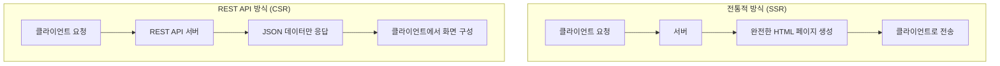
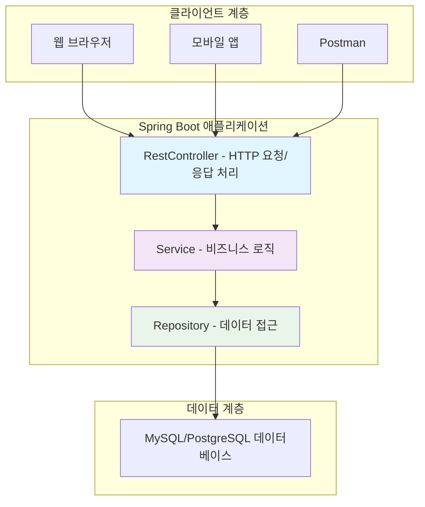
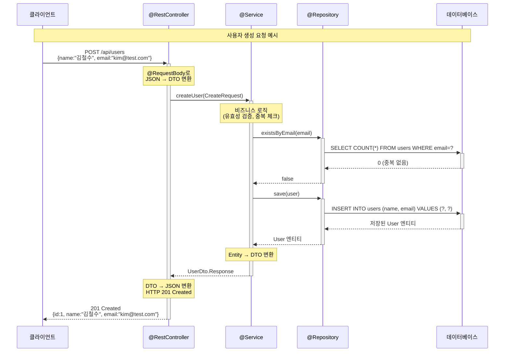
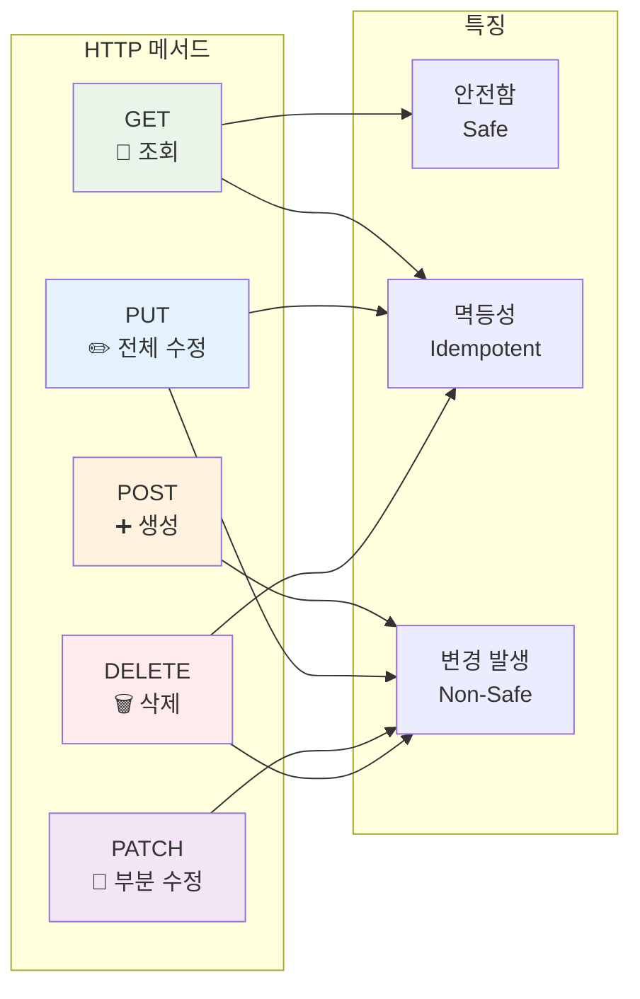
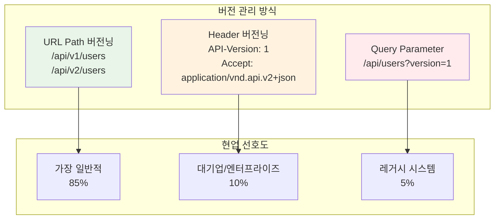
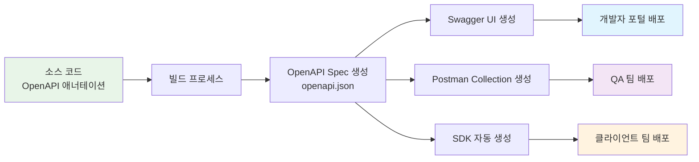

# RESTful API & Swagger 완벽 가이드 📚

## 목차
1. [REST API 기본 개념](#rest-api-기본-개념)
2. [Spring Boot REST 컨트롤러](#spring-boot-rest-컨트롤러)
3. [데이터 처리 방식](#데이터-처리-방식)
4. [실습 예제 코드](#실습-예제-코드)
5. [API 아키텍처 시각화](#api-아키텍처-시각화)
6. [Swagger 문서화](#swagger-문서화)
7. [현업 트렌드 및 베스트 프랙티스](#현업-트렌드-및-베스트-프랙티스)

---

## REST API 기본 개념

### REST란?
**REST (Representational State Transfer)**는 분산 시스템 설계를 위한 아키텍처 스타일입니다.

#### 핵심 원칙
- **자원 (Resource)**: 모든 데이터는 URI를 통해 고유하게 식별
  - 예: `/api/users/1` (1번 사용자 자원)
- **행위 (Verb)**: HTTP Method로 자원에 대한 행위 표현
  - GET, POST, PUT, DELETE 등
- **표현 (Representation)**: 자원의 상태를 JSON, XML 등으로 전달

### 전통적 방식 vs REST API 방식



---

## Spring Boot REST 컨트롤러

### @Controller vs @RestController

#### @Controller (전통적 방식)
```java
@Controller
public class TraditionalController {
    
    @GetMapping("/users")
    public String getUsersPage(Model model) {
        // model에 데이터 추가
        model.addAttribute("users", userService.getAllUsers());
        // 템플릿 파일명 반환 (예: users.html)
        return "users"; 
    }
    
    @GetMapping("/api/users")
    @ResponseBody  // 이 애너테이션이 있어야 JSON 응답 가능
    public List<User> getUsers() {
        return userService.getAllUsers();
    }
}
```

#### @RestController (REST API 전용)
```java
@RestController  // @Controller + @ResponseBody 조합
@RequestMapping("/api")  // 기본 경로 설정
public class UserRestController {
    
    @GetMapping("/users")
    public List<UserDto.Response> getUsers() {
        // 자동으로 JSON 형태로 직렬화되어 응답
        return userService.getAllUsers();
    }
}
```

---

## 데이터 처리 방식

### 요청 데이터 받기

#### @PathVariable (경로 변수)
```java
@GetMapping("/users/{id}")  // URL 경로의 일부
public UserDto.Response getUser(@PathVariable Long id) {
    // URL: /api/users/123 -> id = 123
    return userService.getUserById(id);
}

@GetMapping("/users/{id}/posts/{postId}")
public PostDto.Response getUserPost(
    @PathVariable Long id,          // 사용자 ID
    @PathVariable Long postId) {    // 게시글 ID
    // URL: /api/users/123/posts/456 -> id=123, postId=456
    return postService.getUserPost(id, postId);
}
```

#### @RequestParam (쿼리 스트링)
```java
@GetMapping("/users")
public List<UserDto.Response> getUsers(
    @RequestParam(defaultValue = "0") int page,        // 페이지 번호
    @RequestParam(defaultValue = "10") int size,       // 페이지 크기
    @RequestParam(required = false) String name) {     // 이름으로 검색 (선택사항)
    
    // URL: /api/users?page=1&size=20&name=김철수
    // page=1, size=20, name="김철수"
    return userService.getUsers(page, size, name);
}
```

#### @RequestBody (요청 본문)
```java
@PostMapping("/users")
public UserDto.Response createUser(@RequestBody UserDto.CreateRequest request) {
    // HTTP Body의 JSON 데이터를 Java 객체로 변환
    // { "name": "김철수", "email": "kim@example.com" }
    return userService.createUser(request);
}
```

### Entity vs DTO 분리

#### 문제상황: Entity 직접 노출
```java
// ❌ 잘못된 방식
@RestController
public class BadController {
    
    @GetMapping("/users/{id}")
    public User getUser(@PathVariable Long id) {
        // Entity를 직접 반환하면 위험!
        return userRepository.findById(id);
        // 문제점:
        // 1. 비밀번호 같은 민감정보도 노출
        // 2. Entity 구조 변경시 API도 함께 변경됨
        // 3. 순환 참조 문제 발생 가능
    }
}
```

#### 해결책: DTO 사용
```java
// ✅ 올바른 방식
@RestController
@RequestMapping("/api")
public class UserController {
    
    private final UserService userService;
    
    // 생성자 주입 (Spring이 자동으로 의존성 주입)
    public UserController(UserService userService) {
        this.userService = userService;
    }
    
    @GetMapping("/users/{id}")
    public UserDto.Response getUser(@PathVariable Long id) {
        // DTO만 반환하여 안전하고 명확한 API 명세
        return userService.getUserById(id);
    }
}
```

### Java Record를 활용한 DTO

#### 전통적인 DTO 방식
```java
// 기존 방식: 많은 코드 필요
public class UserCreateRequest {
    private String name;
    private String email;
    
    // 기본 생성자
    public UserCreateRequest() {}
    
    // 모든 필드 생성자
    public UserCreateRequest(String name, String email) {
        this.name = name;
        this.email = email;
    }
    
    // Getter 메서드들
    public String getName() { return name; }
    public String getEmail() { return email; }
    
    // Setter 메서드들
    public void setName(String name) { this.name = name; }
    public void setEmail(String email) { this.email = email; }
    
    // equals, hashCode, toString 메서드들...
}
```

#### Java Record 방식 (Java 16+)
```java
// ✨ 간결하고 현대적인 방식
public class UserDto {
    
    // 사용자 생성 요청 DTO
    public record CreateRequest(
        String name,    // 자동으로 private final로 생성
        String email    // getter, equals, hashCode, toString 자동 생성
    ) {
        // 유효성 검증 로직 추가 가능
        public CreateRequest {
            if (name == null || name.trim().isEmpty()) {
                throw new IllegalArgumentException("이름은 필수입니다");
            }
            if (email == null || !email.contains("@")) {
                throw new IllegalArgumentException("올바른 이메일을 입력하세요");
            }
        }
    }
    
    // 사용자 수정 요청 DTO
    public record UpdateRequest(
        String name,
        String email
    ) {}
    
    // 사용자 응답 DTO
    public record Response(
        Long id,
        String name,
        String email,
        LocalDateTime createdAt
    ) {
        // Entity에서 DTO로 변환하는 정적 메서드
        public static Response from(User user) {
            return new Response(
                user.getId(),
                user.getName(),
                user.getEmail(),
                user.getCreatedAt()
            );
        }
    }
}
```

---

## 실습 예제 코드

### 1. Entity 클래스
```java
@Entity  // JPA Entity임을 표시
@Table(name = "users")  // 데이터베이스 테이블명 지정
@NoArgsConstructor(access = AccessLevel.PROTECTED)  // 기본 생성자 (JPA 요구사항)
@AllArgsConstructor  // 모든 필드를 받는 생성자
@Getter  // Lombok: getter 메서드 자동 생성
@ToString  // Lombok: toString 메서드 자동 생성
public class User {
    
    @Id  // 기본키 지정
    @GeneratedValue(strategy = GenerationType.IDENTITY)  // 자동 증가
    private Long id;
    
    @Column(nullable = false, length = 100)  // NOT NULL 제약, 최대 100자
    private String name;
    
    @Column(nullable = false, unique = true)  // NOT NULL + UNIQUE 제약
    private String email;
    
    @CreationTimestamp  // 생성 시간 자동 설정
    private LocalDateTime createdAt;
    
    @UpdateTimestamp  // 수정 시간 자동 업데이트
    private LocalDateTime updatedAt;
    
    // 비즈니스 로직 메서드
    public void updateInfo(String name, String email) {
        this.name = name;
        this.email = email;
        // updatedAt은 @UpdateTimestamp에 의해 자동 업데이트
    }
}
```

### 2. Repository 인터페이스
```java
@Repository  // Spring의 데이터 접근 계층임을 표시
public interface UserRepository extends JpaRepository<User, Long> {
    // JpaRepository<Entity타입, ID타입>을 상속받으면
    // 기본적인 CRUD 메서드들이 자동으로 제공됨:
    // - save(entity): 저장/수정
    // - findById(id): ID로 조회
    // - findAll(): 전체 조회
    // - deleteById(id): ID로 삭제
    // - count(): 총 개수
    
    // 커스텀 쿼리 메서드 (Spring Data JPA가 자동으로 구현)
    Optional<User> findByEmail(String email);  // 이메일로 사용자 찾기
    List<User> findByNameContaining(String name);  // 이름에 특정 문자열 포함
    boolean existsByEmail(String email);  // 이메일 중복 체크
}
```

### 3. Service 클래스
```java
@Service  // 비즈니스 로직 처리 계층임을 표시
@Transactional(readOnly = true)  // 기본적으로 읽기 전용 트랜잭션
public class UserService {
    
    private final UserRepository userRepository;
    
    // 생성자 주입 (권장 방식)
    public UserService(UserRepository userRepository) {
        this.userRepository = userRepository;
    }
    
    // 사용자 생성
    @Transactional  // 쓰기 작업이므로 readOnly=false (기본값)
    public UserDto.Response createUser(UserDto.CreateRequest request) {
        // 1. 이메일 중복 체크
        if (userRepository.existsByEmail(request.email())) {
            throw new IllegalArgumentException("이미 존재하는 이메일입니다");
        }
        
        // 2. Entity 생성
        User user = new User(null, request.name(), request.email(), null, null);
        
        // 3. 데이터베이스에 저장
        User savedUser = userRepository.save(user);
        
        // 4. Entity를 DTO로 변환하여 반환
        return UserDto.Response.from(savedUser);
    }
    
    // 전체 사용자 조회
    public List<UserDto.Response> getAllUsers() {
        return userRepository.findAll()  // 모든 User Entity 조회
                .stream()  // Stream API 사용
                .map(UserDto.Response::from)  // 각 Entity를 DTO로 변환
                .toList();  // List로 수집
    }
    
    // 특정 사용자 조회
    public UserDto.Response getUserById(Long id) {
        User user = userRepository.findById(id)  // Optional<User> 반환
                .orElseThrow(() -> new EntityNotFoundException("사용자를 찾을 수 없습니다"));
        return UserDto.Response.from(user);
    }
    
    // 사용자 정보 수정
    @Transactional
    public UserDto.Response updateUser(Long id, UserDto.UpdateRequest request) {
        // 1. 기존 사용자 조회
        User user = userRepository.findById(id)
                .orElseThrow(() -> new EntityNotFoundException("사용자를 찾을 수 없습니다"));
        
        // 2. 이메일 중복 체크 (자신 제외)
        if (!user.getEmail().equals(request.email()) && 
            userRepository.existsByEmail(request.email())) {
            throw new IllegalArgumentException("이미 존재하는 이메일입니다");
        }
        
        // 3. 정보 업데이트 (Dirty Checking으로 자동 저장)
        user.updateInfo(request.name(), request.email());
        
        // 4. DTO로 변환하여 반환
        return UserDto.Response.from(user);
    }
    
    // 사용자 삭제
    @Transactional
    public void deleteUser(Long id) {
        // 존재 여부 확인 후 삭제
        if (!userRepository.existsById(id)) {
            throw new EntityNotFoundException("사용자를 찾을 수 없습니다");
        }
        userRepository.deleteById(id);
    }
}
```

### 4. REST Controller
```java
@RestController  // JSON 응답을 위한 REST 컨트롤러
@RequestMapping("/api/users")  // 기본 경로 설정
@Validated  // 유효성 검증 활성화
public class UserApiController {
    
    private final UserService userService;
    
    // 생성자 주입
    public UserApiController(UserService userService) {
        this.userService = userService;
    }
    
    // 새 사용자 등록
    @PostMapping
    public ResponseEntity<UserDto.Response> createUser(
            @Valid @RequestBody UserDto.CreateRequest request) {
        // @Valid: 요청 데이터 유효성 검증
        // @RequestBody: HTTP Body의 JSON을 Java 객체로 변환
        
        UserDto.Response response = userService.createUser(request);
        
        // 201 Created 상태코드와 함께 생성된 사용자 정보 반환
        return ResponseEntity.status(HttpStatus.CREATED).body(response);
    }
    
    // 모든 사용자 조회
    @GetMapping
    public ResponseEntity<List<UserDto.Response>> getAllUsers() {
        List<UserDto.Response> users = userService.getAllUsers();
        
        // 200 OK 상태코드와 함께 사용자 목록 반환
        return ResponseEntity.ok(users);
    }
    
    // 특정 사용자 조회
    @GetMapping("/{id}")
    public ResponseEntity<UserDto.Response> getUser(@PathVariable Long id) {
        // @PathVariable: URL 경로에서 {id} 부분을 Long id로 바인딩
        
        UserDto.Response user = userService.getUserById(id);
        return ResponseEntity.ok(user);
    }
    
    // 사용자 정보 수정
    @PutMapping("/{id}")
    public ResponseEntity<UserDto.Response> updateUser(
            @PathVariable Long id,
            @Valid @RequestBody UserDto.UpdateRequest request) {
        
        UserDto.Response updatedUser = userService.updateUser(id, request);
        return ResponseEntity.ok(updatedUser);
    }
    
    // 사용자 삭제
    @DeleteMapping("/{id}")
    public ResponseEntity<Void> deleteUser(@PathVariable Long id) {
        userService.deleteUser(id);
        
        // 204 No Content: 삭제 성공, 응답 본문 없음
        return ResponseEntity.noContent().build();
    }
    
    // 예외 처리
    @ExceptionHandler(EntityNotFoundException.class)
    public ResponseEntity<ErrorResponse> handleNotFound(EntityNotFoundException e) {
        ErrorResponse error = new ErrorResponse("NOT_FOUND", e.getMessage());
        return ResponseEntity.status(HttpStatus.NOT_FOUND).body(error);
    }
    
    @ExceptionHandler(IllegalArgumentException.class)
    public ResponseEntity<ErrorResponse> handleBadRequest(IllegalArgumentException e) {
        ErrorResponse error = new ErrorResponse("BAD_REQUEST", e.getMessage());
        return ResponseEntity.status(HttpStatus.BAD_REQUEST).body(error);
    }
}

// 에러 응답용 DTO
public record ErrorResponse(String code, String message) {}
```

---

## API 아키텍처 시각화

### 전체 시스템 아키텍처


### REST API 요청 흐름


### HTTP 메서드별 용도


---

## Swagger 문서화

### Swagger 설정
```java
@Configuration
@EnableSwagger2  // Swagger 활성화
public class SwaggerConfig {
    
    @Bean
    public Docket api() {
        return new Docket(DocumentationType.SWAGGER_2)  // Swagger 2.0 사용
                .select()
                .apis(RequestHandlerSelectors.basePackage("com.example.controller"))  // 스캔할 패키지
                .paths(PathSelectors.ant("/api/**"))  // 문서화할 경로 패턴
                .build()
                .apiInfo(apiInfo());  // API 정보 설정
    }
    
    private ApiInfo apiInfo() {
        return new ApiInfoBuilder()
                .title("사용자 관리 API")  // API 제목
                .description("사용자 CRUD 기능을 제공하는 RESTful API")  // 설명
                .version("1.0.0")  // 버전
                .contact(new Contact("개발팀", "https://example.com", "dev@example.com"))
                .build();
    }
}
```

### Swagger 애너테이션 활용
```java
@RestController
@RequestMapping("/api/users")
@Api(tags = "사용자 관리")  // Swagger UI에서 그룹 이름
public class UserApiController {
    
    @PostMapping
    @ApiOperation(value = "사용자 생성", notes = "새로운 사용자를 등록합니다")
    @ApiResponses({
        @ApiResponse(code = 201, message = "사용자 생성 성공"),
        @ApiResponse(code = 400, message = "잘못된 요청 데이터"),
        @ApiResponse(code = 409, message = "이메일 중복")
    })
    public ResponseEntity<UserDto.Response> createUser(
            @ApiParam(value = "사용자 생성 정보", required = true)
            @Valid @RequestBody UserDto.CreateRequest request) {
        
        UserDto.Response response = userService.createUser(request);
        return ResponseEntity.status(HttpStatus.CREATED).body(response);
    }
    
    @GetMapping
    @ApiOperation(value = "사용자 목록 조회", notes = "등록된 모든 사용자 목록을 조회합니다")
    public ResponseEntity<List<UserDto.Response>> getAllUsers(
            @ApiParam(value = "페이지 번호", defaultValue = "0")
            @RequestParam(defaultValue = "0") int page,
            
            @ApiParam(value = "페이지 크기", defaultValue = "10")
            @RequestParam(defaultValue = "10") int size) {
        
        List<UserDto.Response> users = userService.getAllUsers(page, size);
        return ResponseEntity.ok(users);
    }
}
```

### DTO에 Swagger 문서화
```java
public class UserDto {
    
    @ApiModel(description = "사용자 생성 요청")
    public record CreateRequest(
        @ApiModelProperty(value = "사용자 이름", required = true, example = "김철수")
        @NotBlank(message = "이름은 필수입니다")
        String name,
        
        @ApiModelProperty(value = "이메일 주소", required = true, example = "kim@example.com")
        @Email(message = "올바른 이메일 형식이 아닙니다")
        @NotBlank(message = "이메일은 필수입니다")
        String email
    ) {}
    
    @ApiModel(description = "사용자 응답 정보")
    public record Response(
        @ApiModelProperty(value = "사용자 ID", example = "1")
        Long id,
        
        @ApiModelProperty(value = "사용자 이름", example = "김철수")
        String name,
        
        @ApiModelProperty(value = "이메일 주소", example = "kim@example.com")
        String email,
        
        @ApiModelProperty(value = "생성 시간", example = "2025-09-02T10:30:00")
        LocalDateTime createdAt
    ) {
        public static Response from(User user) {
            return new Response(
                user.getId(),
                user.getName(),
                user.getEmail(),
                user.getCreatedAt()
            );
        }
    }
}
```

---

## 현업 트렌드 및 베스트 프랙티스

### 2025년 API 개발 트렌드

#### 1. API-First 설계
현업에서는 API를 제품처럼 취급하는 **API-as-a-Product (AaaP)** 접근법이 주류가 되고 있습니다. 이는 API 소비자를 단순한 통합이 아닌 사용자로 바라보는 관점입니다.

#### 2. 보안 강화
- **Zero-Trust 아키텍처**: 기본적으로 아무것도 신뢰하지 않고 지속적인 검증 수행
- **OAuth 2.0 + JWT**: 토큰 기반 인증/인가가 표준
- **API 게이트웨이**: 모든 API 호출의 중앙 집중 관리

#### 3. 하이브리드 접근법
REST API와 GraphQL을 함께 사용하는 하이브리드 방식이 증가하고 있습니다. REST는 데이터 소스 역할, GraphQL은 게이트웨이 역할을 담당합니다.

### 현업에서 주로 사용하는 기술 스택

#### Backend Framework
```java
// Spring Boot 3.x (현재 LTS)
@SpringBootApplication
public class RestApiApplication {
    public static void main(String[] args) {
        SpringApplication.run(RestApiApplication.class, args);
    }
}
```

#### 데이터베이스 접근
```java
// Spring Data JPA (가장 보편적)
@Repository
public interface UserRepository extends JpaRepository<User, Long> {
    // 복잡한 쿼리는 @Query 애너테이션 사용
    @Query("SELECT u FROM User u WHERE u.email = :email AND u.active = true")
    Optional<User> findActiveUserByEmail(@Param("email") String email);
}

// QueryDSL (복잡한 동적 쿼리용)
@Repository
public class UserQueryRepository {
    private final JPAQueryFactory queryFactory;
    
    public UserQueryRepository(JPAQueryFactory queryFactory) {
        this.queryFactory = queryFactory;
    }
    
    // 복잡한 검색 조건을 동적으로 구성
    public List<User> findUsersWithConditions(String name, String email, Boolean active) {
        QUser user = QUser.user;  // QueryDSL이 생성한 Q클래스
        
        BooleanBuilder builder = new BooleanBuilder();  // 동적 조건 빌더
        
        if (name != null) {
            builder.and(user.name.containsIgnoreCase(name));  // 이름 포함 검색
        }
        if (email != null) {
            builder.and(user.email.eq(email));  // 이메일 정확 매치
        }
        if (active != null) {
            builder.and(user.active.eq(active));  // 활성 상태 필터
        }
        
        return queryFactory
                .selectFrom(user)  // User 엔티티 선택
                .where(builder)    // 동적 조건 적용
                .orderBy(user.createdAt.desc())  // 생성일 내림차순
                .fetch();  // 실행 및 결과 반환
    }
}
```

#### 응답 형태 표준화
```java
// 현업에서 자주 사용하는 공통 응답 형태
public record ApiResponse<T>(
    boolean success,      // 성공 여부
    String message,       // 응답 메시지
    T data,              // 실제 데이터
    String timestamp     // 응답 시간
) {
    // 성공 응답 생성 헬퍼 메서드
    public static <T> ApiResponse<T> success(T data) {
        return new ApiResponse<>(
            true, 
            "요청이 성공적으로 처리되었습니다", 
            data, 
            LocalDateTime.now().toString()
        );
    }
    
    public static <T> ApiResponse<T> success(String message, T data) {
        return new ApiResponse<>(true, message, data, LocalDateTime.now().toString());
    }
    
    // 실패 응답 생성 헬퍼 메서드
    public static <T> ApiResponse<T> failure(String message) {
        return new ApiResponse<>(false, message, null, LocalDateTime.now().toString());
    }
}

// 컨트롤러에서 사용
@PostMapping
public ResponseEntity<ApiResponse<UserDto.Response>> createUser(
        @Valid @RequestBody UserDto.CreateRequest request) {
    
    UserDto.Response user = userService.createUser(request);
    ApiResponse<UserDto.Response> response = ApiResponse.success("사용자가 생성되었습니다", user);
    
    return ResponseEntity.status(HttpStatus.CREATED).body(response);
}
```

#### 페이징 처리
```java
// Spring Data JPA의 Pageable 활용
@GetMapping
public ResponseEntity<ApiResponse<Page<UserDto.Response>>> getUsers(
        @PageableDefault(size = 20, sort = "createdAt", direction = Sort.Direction.DESC)
        Pageable pageable,  // 페이징 정보 자동 바인딩
        
        @RequestParam(required = false) String name) {  // 검색 조건
    
    Page<UserDto.Response> users = userService.getUsers(pageable, name);
    return ResponseEntity.ok(ApiResponse.success(users));
}

// Service에서 페이징 처리
@Transactional(readOnly = true)
public Page<UserDto.Response> getUsers(Pageable pageable, String name) {
    Page<User> userPage;
    
    if (name != null && !name.trim().isEmpty()) {
        // 이름으로 검색 + 페이징
        userPage = userRepository.findByNameContaining(name.trim(), pageable);
    } else {
        // 전체 조회 + 페이징
        userPage = userRepository.findAll(pageable);
    }
    
    // Page<Entity>를 Page<DTO>로 변환
    return userPage.map(UserDto.Response::from);
}
```

### 현업 보안 적용 사례

#### JWT 토큰 기반 인증
```java
// JWT 유틸리티 클래스
@Component
public class JwtTokenProvider {
    
    @Value("${app.jwt.secret}")  // application.yml에서 비밀키 주입
    private String jwtSecret;
    
    @Value("${app.jwt.expiration}")  // 토큰 만료 시간
    private long jwtExpirationInMs;
    
    // 토큰 생성
    public String generateToken(String username) {
        Date expiryDate = new Date(System.currentTimeMillis() + jwtExpirationInMs);
        
        return Jwts.builder()
                .setSubject(username)  // 사용자 식별자
                .setIssuedAt(new Date())  // 발급 시간
                .setExpiration(expiryDate)  // 만료 시간
                .signWith(SignatureAlgorithm.HS256, jwtSecret)  // 서명 알고리즘
                .compact();  // 토큰 문자열 생성
    }
    
    // 토큰에서 사용자명 추출
    public String getUsernameFromToken(String token) {
        Claims claims = Jwts.parser()
                .setSigningKey(jwtSecret)  // 서명 검증용 키
                .parseClaimsJws(token)     // 토큰 파싱
                .getBody();                // 페이로드 추출
        
        return claims.getSubject();  // 사용자명 반환
    }
    
    // 토큰 유효성 검증
    public boolean validateToken(String token) {
        try {
            Jwts.parser().setSigningKey(jwtSecret).parseClaimsJws(token);
            return true;  // 파싱 성공 = 유효한 토큰
        } catch (JwtException | IllegalArgumentException e) {
            return false;  // 파싱 실패 = 무효한 토큰
        }
    }
}

// 인증이 필요한 API에 적용
@RestController
@RequestMapping("/api/users")
public class SecureUserController {
    
    @PostMapping("/profile")
    @PreAuthorize("hasRole('USER')")  // USER 권한 필요
    public ResponseEntity<UserDto.Response> updateProfile(
            @AuthenticationPrincipal UserDetails userDetails,  // 현재 로그인 사용자
            @Valid @RequestBody UserDto.UpdateRequest request) {
        
        // 현재 로그인한 사용자의 정보만 수정 가능
        String currentUsername = userDetails.getUsername();
        UserDto.Response response = userService.updateUserProfile(currentUsername, request);
        
        return ResponseEntity.ok(ApiResponse.success(response));
    }
}
```

#### API 버전 관리
```java
// URL 경로 기반 버전 관리 (가장 일반적)
@RestController
@RequestMapping("/api/v1/users")  // v1 버전
public class UserControllerV1 {
    // 기존 API 유지
}

@RestController
@RequestMapping("/api/v2/users")  // v2 버전
public class UserControllerV2 {
    // 새로운 기능 추가
    
    @GetMapping
    public ResponseEntity<ApiResponse<PagedResponse<UserDto.ResponseV2>>> getUsers(
            @PageableDefault(size = 20) Pageable pageable) {
        // v2에서는 더 풍부한 응답 제공
        return ResponseEntity.ok(ApiResponse.success(userService.getUsersV2(pageable)));
    }
}

// 헤더 기반 버전 관리 (선택적)
@RestController
@RequestMapping("/api/users")
public class UserController {
    
    @GetMapping(headers = "API-Version=1")
    public ResponseEntity<List<UserDto.Response>> getUsersV1() {
        return ResponseEntity.ok(userService.getAllUsers());
    }
    
    @GetMapping(headers = "API-Version=2")
    public ResponseEntity<PagedResponse<UserDto.ResponseV2>> getUsersV2(Pageable pageable) {
        return ResponseEntity.ok(userService.getUsersV2(pageable));
    }
}
```

### 현업 모니터링 및 로깅

#### 구조화된 로깅
```java
@RestController
@Slf4j  // Lombok의 로깅 애너테이션
public class UserApiController {
    
    @PostMapping
    public ResponseEntity<ApiResponse<UserDto.Response>> createUser(
            @Valid @RequestBody UserDto.CreateRequest request) {
        
        // 요청 시작 로그 (구조화된 형태)
        log.info("사용자 생성 요청 시작 - email: {}", request.email());
        
        try {
            UserDto.Response response = userService.createUser(request);
            
            // 성공 로그
            log.info("사용자 생성 완료 - userId: {}, email: {}", 
                    response.id(), response.email());
            
            return ResponseEntity.status(HttpStatus.CREATED)
                    .body(ApiResponse.success("사용자가 생성되었습니다", response));
                    
        } catch (IllegalArgumentException e) {
            // 비즈니스 예외 로그
            log.warn("사용자 생성 실패 - email: {}, reason: {}", 
                    request.email(), e.getMessage());
            throw e;
            
        } catch (Exception e) {
            // 시스템 예외 로그
            log.error("사용자 생성 중 예상치 못한 오류 - email: {}", 
                    request.email(), e);
            throw new RuntimeException("서버 내부 오류가 발생했습니다");
        }
    }
}
```

#### 성능 모니터링
```java
// AOP를 활용한 실행 시간 측정
@Aspect
@Component
@Slf4j
public class PerformanceAspect {
    
    @Around("@annotation(org.springframework.web.bind.annotation.RequestMapping) || " +
            "@annotation(org.springframework.web.bind.annotation.GetMapping) || " +
            "@annotation(org.springframework.web.bind.annotation.PostMapping)")
    public Object measureExecutionTime(ProceedingJoinPoint joinPoint) throws Throwable {
        long startTime = System.currentTimeMillis();
        
        try {
            Object result = joinPoint.proceed();  // 실제 메서드 실행
            
            long executionTime = System.currentTimeMillis() - startTime;
            
            // 성능 로그
            log.info("API 실행 완료 - method: {}, executionTime: {}ms", 
                    joinPoint.getSignature().getName(), executionTime);
                    
            return result;
            
        } catch (Exception e) {
            long executionTime = System.currentTimeMillis() - startTime;
            log.error("API 실행 실패 - method: {}, executionTime: {}ms", 
                    joinPoint.getSignature().getName(), executionTime);
            throw e;
        }
    }
}
```

### API 문서화 현업 도구

#### OpenAPI 3.0 (Swagger의 후속)
```java
// 최신 SpringDoc OpenAPI 사용
@OpenAPIDefinition(
    info = @Info(
        title = "사용자 관리 API",
        version = "2.0",
        description = "사용자 CRUD 및 인증 기능을 제공하는 RESTful API"
    ),
    servers = {
        @Server(url = "https://api.example.com", description = "프로덕션 서버"),
        @Server(url = "https://staging-api.example.com", description = "스테이징 서버"),
        @Server(url = "http://localhost:8080", description = "로컬 개발 서버")
    }
)
@SecurityScheme(
    name = "bearerAuth",
    type = SecuritySchemeType.HTTP,
    bearerFormat = "JWT",
    scheme = "bearer"
)
public class OpenApiConfig {
}

// 컨트롤러에서 상세한 문서화
@RestController
@RequestMapping("/api/v2/users")
@Tag(name = "사용자 관리", description = "사용자 CRUD 및 프로필 관리 API")
public class UserControllerV2 {
    
    @Operation(
        summary = "사용자 생성",
        description = "새로운 사용자 계정을 생성합니다. 이메일은 중복될 수 없습니다."
    )
    @ApiResponses({
        @ApiResponse(responseCode = "201", description = "사용자 생성 성공",
            content = @Content(schema = @Schema(implementation = UserDto.Response.class))),
        @ApiResponse(responseCode = "400", description = "잘못된 요청 데이터"),
        @ApiResponse(responseCode = "409", description = "이메일 중복")
    })
    @PostMapping
    public ResponseEntity<ApiResponse<UserDto.Response>> createUser(
            @Parameter(description = "사용자 생성 정보", required = true)
            @Valid @RequestBody UserDto.CreateRequest request) {
        
        UserDto.Response response = userService.createUser(request);
        return ResponseEntity.status(HttpStatus.CREATED)
                .body(ApiResponse.success("사용자가 생성되었습니다", response));
    }
}
```

### 현업 테스팅 전략

#### 계층별 테스트
```java
// 1. Controller 테스트 (Web Layer)
@WebMvcTest(UserApiController.class)  // 웹 계층만 테스트
class UserApiControllerTest {
    
    @Autowired
    private MockMvc mockMvc;  // HTTP 요청 시뮬레이션
    
    @MockBean
    private UserService userService;  // Service는 Mock으로 대체
    
    @Test
    @DisplayName("사용자 생성 API 테스트")
    void createUser_Success() throws Exception {
        // Given: 테스트 데이터 준비
        UserDto.CreateRequest request = new UserDto.CreateRequest("김철수", "kim@test.com");
        UserDto.Response expectedResponse = new UserDto.Response(1L, "김철수", "kim@test.com", LocalDateTime.now());
        
        when(userService.createUser(any(UserDto.CreateRequest.class)))
                .thenReturn(expectedResponse);  // Mock 동작 정의
        
        // When & Then: API 호출 및 검증
        mockMvc.perform(post("/api/users")  // POST 요청
                .contentType(MediaType.APPLICATION_JSON)  // Content-Type 헤더
                .content("""
                    {
                        "name": "김철수",
                        "email": "kim@test.com"
                    }
                    """))  // 요청 Body
                .andExpect(status().isCreated())  // 201 상태코드 기대
                .andExpect(jsonPath("$.success").value(true))  // JSON 응답 검증
                .andExpect(jsonPath("$.data.name").value("김철수"))
                .andExpect(jsonPath("$.data.email").value("kim@test.com"));
        
        // Service 메서드 호출 검증
        verify(userService).createUser(any(UserDto.CreateRequest.class));
    }
}

// 2. Service 테스트 (Business Logic)
@ExtendWith(MockitoExtension.class)  // Mockito 확장
class UserServiceTest {
    
    @Mock
    private UserRepository userRepository;  // Repository Mock
    
    @InjectMocks
    private UserService userService;  // 테스트 대상 (Mock이 주입됨)
    
    @Test
    @DisplayName("이메일 중복시 예외 발생")
    void createUser_EmailDuplicate_ThrowsException() {
        // Given
        UserDto.CreateRequest request = new UserDto.CreateRequest("김철수", "kim@test.com");
        when(userRepository.existsByEmail("kim@test.com")).thenReturn(true);  // 중복 상황
        
        // When & Then
        assertThatThrownBy(() -> userService.createUser(request))
                .isInstanceOf(IllegalArgumentException.class)
                .hasMessage("이미 존재하는 이메일입니다");
        
        // Repository 호출 검증
        verify(userRepository).existsByEmail("kim@test.com");
        verify(userRepository, never()).save(any(User.class));  // save는 호출되지 않아야 함
    }
}

// 3. Repository 테스트 (Data Layer)
@DataJpaTest  // JPA 관련 설정만 로드
class UserRepositoryTest {
    
    @Autowired
    private TestEntityManager entityManager;  // 테스트용 EntityManager
    
    @Autowired
    private UserRepository userRepository;
    
    @Test
    @DisplayName("이메일로 사용자 조회 테스트")
    void findByEmail_Success() {
        // Given: 테스트 데이터 직접 생성
        User user = new User(null, "김철수", "kim@test.com", null, null);
        entityManager.persistAndFlush(user);  // 테스트 DB에 저장
        
        // When: Repository 메서드 호출
        Optional<User> found = userRepository.findByEmail("kim@test.com");
        
        // Then: 결과 검증
        assertThat(found).isPresent();
        assertThat(found.get().getName()).isEqualTo("김철수");
        assertThat(found.get().getEmail()).isEqualTo("kim@test.com");
    }
}
```

### 현업 배포 및 운영

#### Docker 컨테이너화
```dockerfile
# 현업에서 사용하는 멀티 스테이지 Dockerfile
FROM openjdk:17-jdk-slim as builder

# 작업 디렉토리 설정
WORKDIR /app

# Gradle 래퍼와 빌드 파일 복사
COPY gradlew .
COPY gradle gradle
COPY build.gradle .
COPY settings.gradle .

# 의존성 다운로드 (캐시 최적화)
RUN ./gradlew dependencies --no-daemon

# 소스 코드 복사 및 빌드
COPY src src
RUN ./gradlew bootJar --no-daemon

# 실행 스테이지
FROM openjdk:17-jre-slim

# 애플리케이션 사용자 생성 (보안)
RUN addgroup --system spring && adduser --system spring --ingroup spring
USER spring:spring

# 빌드된 JAR 파일 복사
COPY --from=builder /app/build/libs/*.jar app.jar

# 컨테이너 실행 명령
ENTRYPOINT ["java", "-jar", "/app.jar"]

# 포트 노출
EXPOSE 8080
```

#### Kubernetes 배포 설정
```yaml
# deployment.yaml
apiVersion: apps/v1
kind: Deployment
metadata:
  name: user-api
  labels:
    app: user-api
spec:
  replicas: 3  # 3개의 Pod으로 확장
  selector:
    matchLabels:
      app: user-api
  template:
    metadata:
      labels:
        app: user-api
    spec:
      containers:
      - name: user-api
        image: your-registry/user-api:latest
        ports:
        - containerPort: 8080
        env:  # 환경변수 설정
        - name: SPRING_PROFILES_ACTIVE
          value: "production"
        - name: DATABASE_URL
          valueFrom:
            secretKeyRef:  # 민감정보는 Secret으로 관리
              name: database-secret
              key: url
        resources:  # 리소스 제한
          requests:
            memory: "512Mi"
            cpu: "250m"
          limits:
            memory: "1Gi"
            cpu: "500m"
        livenessProbe:  # 헬스체크
          httpGet:
            path: /actuator/health
            port: 8080
          initialDelaySeconds: 30
          periodSeconds: 10
```

### API 게이트웨이 패턴

#### Spring Cloud Gateway 설정
```yaml
# application.yml
spring:
  cloud:
    gateway:
      routes:
      - id: user-service  # 라우트 ID
        uri: http://user-service:8080  # 실제 서비스 주소
        predicates:
        - Path=/api/users/**  # 경로 매칭 조건
        filters:
        - name: RequestRateLimiter  # 요청 제한
          args:
            rate-limiter: "#{@redisRateLimiter}"
            key-resolver: "#{@userKeyResolver}"
        - AddResponseHeader=X-Response-Default-Foo, Default-Bar  # 헤더 추가
        
      - id: auth-service
        uri: http://auth-service:8080
        predicates:
        - Path=/api/auth/**
        filters:
        - name: CircuitBreaker  # 서킷 브레이커 패턴
          args:
            name: auth-circuit-breaker
            fallbackUri: forward:/fallback/auth
```

### 현업에서 자주 사용하는 라이브러리

#### 필수 의존성 (build.gradle)
```gradle
dependencies {
    // Spring Boot 기본
    implementation 'org.springframework.boot:spring-boot-starter-web'
    implementation 'org.springframework.boot:spring-boot-starter-data-jpa'
    implementation 'org.springframework.boot:spring-boot-starter-validation'
    
    // 보안
    implementation 'org.springframework.boot:spring-boot-starter-security'
    implementation 'io.jsonwebtoken:jjwt-api:0.11.5'
    implementation 'io.jsonwebtoken:jjwt-impl:0.11.5'
    implementation 'io.jsonwebtoken:jjwt-jackson:0.11.5'
    
    // 문서화 (OpenAPI 3.0)
    implementation 'org.springdoc:springdoc-openapi-starter-webmvc-ui:2.2.0'
    
    // 데이터베이스
    runtimeOnly 'com.mysql:mysql-connector-j'  // MySQL
    // 또는 runtimeOnly 'org.postgresql:postgresql'  // PostgreSQL
    
    // 개발 편의
    compileOnly 'org.projectlombok:lombok'
    annotationProcessor 'org.projectlombok:lombok'
    
    // 캐싱
    implementation 'org.springframework.boot:spring-boot-starter-data-redis'
    
    // 모니터링
    implementation 'org.springframework.boot:spring-boot-starter-actuator'
    implementation 'io.micrometer:micrometer-registry-prometheus'  // 메트릭 수집
    
    // 테스트
    testImplementation 'org.springframework.boot:spring-boot-starter-test'
    testImplementation 'org.testcontainers:junit-jupiter'  // 통합 테스트용
    testImplementation 'org.testcontainers:mysql'
}
```

### 전체 API 처리 흐름

```mermaid
flowchart TD
    A[클라이언트 요청] --> B{API Gateway}
    B --> C[인증/인가 검증]
    C --> D{유효한 토큰?}
    D -->|No| E[401 Unauthorized]
    D -->|Yes| F[Spring Boot 애플리케이션]
    
    F --> G[@RestController]
    G --> H[요청 데이터 바인딩<br/>@PathVariable, @RequestParam, @RequestBody]
    H --> I[유효성 검증<br/>@Valid]
    I --> J{검증 통과?}
    J -->|No| K[400 Bad Request]
    J -->|Yes| L[@Service 비즈니스 로직]
    
    L --> M[@Repository 데이터 접근]
    M --> N[(데이터베이스)]
    N --> O[Entity 조회/저장]
    O --> P[Entity → DTO 변환]
    P --> Q[JSON 직렬화]
    Q --> R[HTTP 응답]
    
    style G fill:#e1f5fe
    style L fill:#f3e5f5
    style M fill:#e8f5e8
    style N fill:#fff3e0
```

### 에러 처리 및 예외 상황

#### 전역 예외 처리기
```java
@RestControllerAdvice  // 모든 컨트롤러의 예외를 처리
@Slf4j
public class GlobalExceptionHandler {
    
    // 엔티티를 찾을 수 없는 경우
    @ExceptionHandler(EntityNotFoundException.class)
    public ResponseEntity<ApiResponse<Void>> handleEntityNotFound(EntityNotFoundException e) {
        log.warn("Entity not found: {}", e.getMessage());
        
        ApiResponse<Void> response = ApiResponse.failure(e.getMessage());
        return ResponseEntity.status(HttpStatus.NOT_FOUND).body(response);
    }
    
    // 유효성 검증 실패
    @ExceptionHandler(MethodArgumentNotValidException.class)
    public ResponseEntity<ApiResponse<Map<String, String>>> handleValidationErrors(
            MethodArgumentNotValidException e) {
        
        Map<String, String> errors = new HashMap<>();
        
        // 모든 필드 에러를 수집
        e.getBindingResult().getFieldErrors().forEach(error -> {
            errors.put(error.getField(), error.getDefaultMessage());
        });
        
        log.warn("Validation failed: {}", errors);
        
        ApiResponse<Map<String, String>> response = 
                ApiResponse.failure("입력 데이터가 올바르지 않습니다").withData(errors);
        
        return ResponseEntity.status(HttpStatus.BAD_REQUEST).body(response);
    }
    
    // 데이터베이스 제약 조건 위반
    @ExceptionHandler(DataIntegrityViolationException.class)
    public ResponseEntity<ApiResponse<Void>> handleDataIntegrityViolation(
            DataIntegrityViolationException e) {
        
        log.error("Data integrity violation", e);
        
        String message = "데이터 무결성 제약 조건을 위반했습니다";
        if (e.getMessage().contains("Duplicate entry")) {
            message = "이미 존재하는 데이터입니다";
        }
        
        ApiResponse<Void> response = ApiResponse.failure(message);
        return ResponseEntity.status(HttpStatus.CONFLICT).body(response);
    }
    
    // 예상치 못한 서버 오류
    @ExceptionHandler(Exception.class)
    public ResponseEntity<ApiResponse<Void>> handleGeneralException(Exception e) {
        log.error("Unexpected error occurred", e);
        
        ApiResponse<Void> response = ApiResponse.failure("서버 내부 오류가 발생했습니다");
        return ResponseEntity.status(HttpStatus.INTERNAL_SERVER_ERROR).body(response);
    }
}
```

### 현업 캐싱 전략

#### Redis를 활용한 캐싱
```java
@Service
@Transactional(readOnly = true)
public class UserService {
    
    private final UserRepository userRepository;
    private final RedisTemplate<String, Object> redisTemplate;
    
    // 자주 조회되는 데이터는 캐시 적용
    @Cacheable(value = "users", key = "#id")  // Spring Cache 추상화
    public UserDto.Response getUserById(Long id) {
        User user = userRepository.findById(id)
                .orElseThrow(() -> new EntityNotFoundException("사용자를 찾을 수 없습니다"));
        
        log.info("Database에서 사용자 조회: {}", id);  // 캐시 미스시에만 로그 출력
        return UserDto.Response.from(user);
    }
    
    // 수정시 캐시 무효화
    @CacheEvict(value = "users", key = "#id")  // 해당 키의 캐시 삭제
    @Transactional
    public UserDto.Response updateUser(Long id, UserDto.UpdateRequest request) {
        User user = userRepository.findById(id)
                .orElseThrow(() -> new EntityNotFoundException("사용자를 찾을 수 없습니다"));
        
        user.updateInfo(request.name(), request.email());
        return UserDto.Response.from(user);
    }
    
    // 수동 캐시 관리 (복잡한 로직이 필요한 경우)
    public List<UserDto.Response> getActiveUsers() {
        String cacheKey = "active_users";
        
        // 캐시에서 먼저 조회
        List<UserDto.Response> cachedUsers = (List<UserDto.Response>) 
                redisTemplate.opsForValue().get(cacheKey);
        
        if (cachedUsers != null) {
            log.info("캐시에서 활성 사용자 목록 반환");
            return cachedUsers;
        }
        
        // 캐시 미스시 데이터베이스에서 조회
        List<UserDto.Response> users = userRepository.findByActiveTrue()
                .stream()
                .map(UserDto.Response::from)
                .toList();
        
        // 캐시에 저장 (10분 TTL)
        redisTemplate.opsForValue().set(cacheKey, users, Duration.ofMinutes(10));
        log.info("데이터베이스에서 활성 사용자 목록 조회 후 캐시 저장");
        
        return users;
    }
}
```

### 현업 API 설계 가이드라인

#### RESTful URL 설계 원칙
```
✅ 좋은 URL 설계
GET    /api/users              # 사용자 목록 조회
GET    /api/users/123          # 특정 사용자 조회
POST   /api/users              # 새 사용자 생성
PUT    /api/users/123          # 사용자 전체 정보 수정
PATCH  /api/users/123          # 사용자 부분 정보 수정
DELETE /api/users/123          # 사용자 삭제

# 중첩 리소스
GET    /api/users/123/posts    # 특정 사용자의 게시글 목록
POST   /api/users/123/posts    # 특정 사용자의 새 게시글 작성

❌ 피해야 할 URL 설계
GET    /api/getUsers            # 동사 사용 금지
POST   /api/users/create        # 불필요한 동사
GET    /api/users/123/delete    # GET으로 삭제 시도
POST   /api/users/search        # 조회는 GET 사용
```

#### HTTP 상태 코드 가이드
```java
@RestController
public class StatusCodeExampleController {
    
    // 200 OK: 성공적인 GET, PUT, PATCH
    @GetMapping("/users/{id}")
    public ResponseEntity<UserDto.Response> getUser(@PathVariable Long id) {
        UserDto.Response user = userService.getUserById(id);
        return ResponseEntity.ok(user);  // 200 OK
    }
    
    // 201 Created: 성공적인 POST (리소스 생성)
    @PostMapping("/users")
    public ResponseEntity<UserDto.Response> createUser(
            @Valid @RequestBody UserDto.CreateRequest request) {
        UserDto.Response user = userService.createUser(request);
        
        // Location 헤더에 생성된 리소스의 URI 포함
        URI location = URI.create("/api/users/" + user.id());
        return ResponseEntity.created(location).body(user);  // 201 Created
    }
    
    // 204 No Content: 성공적인 DELETE (응답 본문 없음)
    @DeleteMapping("/users/{id}")
    public ResponseEntity<Void> deleteUser(@PathVariable Long id) {
        userService.deleteUser(id);
        return ResponseEntity.noContent().build();  // 204 No Content
    }
    
    // 400 Bad Request: 잘못된 요청 데이터
    @PostMapping("/users/invalid-example")
    public ResponseEntity<ApiResponse<Void>> invalidRequest() {
        // 유효성 검증 실패시 자동으로 400 반환
        return ResponseEntity.badRequest()
                .body(ApiResponse.failure("잘못된 요청입니다"));
    }
    
    // 404 Not Found: 리소스를 찾을 수 없음
    @GetMapping("/users/{id}/not-found-example")
    public ResponseEntity<ApiResponse<Void>> notFound(@PathVariable Long id) {
        return ResponseEntity.status(HttpStatus.NOT_FOUND)
                .body(ApiResponse.failure("사용자를 찾을 수 없습니다"));
    }
    
    // 409 Conflict: 비즈니스 규칙 위반 (중복 등)
    @PostMapping("/users/conflict-example")
    public ResponseEntity<ApiResponse<Void>> conflict() {
        return ResponseEntity.status(HttpStatus.CONFLICT)
                .body(ApiResponse.failure("이미 존재하는 이메일입니다"));
    }
    
    // 500 Internal Server Error: 서버 내부 오류
    // GlobalExceptionHandler에서 자동 처리
}
```

### 현업 성능 최적화

#### 데이터베이스 최적화
```java
@Entity
@Table(name = "users", indexes = {
    @Index(name = "idx_user_email", columnList = "email"),  // 이메일 인덱스
    @Index(name = "idx_user_created_at", columnList = "created_at")  // 생성일 인덱스
})
public class User {
    // N+1 문제 해결을 위한 페치 전략
    @OneToMany(mappedBy = "user", fetch = FetchType.LAZY)  // 지연 로딩
    private List<Post> posts = new ArrayList<>();
    
    @ManyToOne(fetch = FetchType.LAZY)  // 연관 엔티티도 지연 로딩
    @JoinColumn(name = "department_id")
    private Department department;
}

// N+1 문제 해결: 페치 조인 사용
@Repository
public interface UserRepository extends JpaRepository<User, Long> {
    
    @Query("SELECT u FROM User u LEFT JOIN FETCH u.posts WHERE u.id = :id")
    Optional<User> findByIdWithPosts(@Param("id") Long id);  // 한 번의 쿼리로 posts까지 조회
    
    @Query("SELECT u FROM User u LEFT JOIN FETCH u.department WHERE u.active = true")
    List<User> findActiveUsersWithDepartment();  // 부서 정보까지 한번에 조회
}
```

#### 비동기 처리
```java
@Service
public class AsyncUserService {
    
    // 비동기 메서드 설정
    @Async("taskExecutor")  // 별도 스레드 풀에서 실행
    @Transactional
    public CompletableFuture<Void> sendWelcomeEmail(Long userId) {
        try {
            User user = userRepository.findById(userId)
                    .orElseThrow(() -> new EntityNotFoundException("사용자를 찾을 수 없습니다"));
            
            // 이메일 발송 로직 (시간이 오래 걸리는 작업)
            emailService.sendWelcomeEmail(user.getEmail(), user.getName());
            
            log.info("환영 이메일 발송 완료: {}", user.getEmail());
            return CompletableFuture.completedFuture(null);
            
        } catch (Exception e) {
            log.error("환영 이메일 발송 실패: userId={}", userId, e);
            return CompletableFuture.failedFuture(e);
        }
    }
}

// 비동기 설정
@Configuration
@EnableAsync  // 비동기 처리 활성화
public class AsyncConfig {
    
    @Bean(name = "taskExecutor")
    public TaskExecutor taskExecutor() {
        ThreadPoolTaskExecutor executor = new ThreadPoolTaskExecutor();
        executor.setCorePoolSize(2);      // 기본 스레드 수
        executor.setMaxPoolSize(10);      // 최대 스레드 수
        executor.setQueueCapacity(100);   // 대기 큐 크기
        executor.setThreadNamePrefix("async-task-");  // 스레드 이름 접두사
        executor.initialize();
        return executor;
    }
}
```

### 통합 테스트 및 실제 테스트

#### Testcontainers를 활용한 통합 테스트
```java
@SpringBootTest(webEnvironment = SpringBootTest.WebEnvironment.RANDOM_PORT)
@Testcontainers  // Docker 컨테이너 기반 테스트
class UserApiIntegrationTest {
    
    @Container
    static MySQLContainer<?> mysql = new MySQLContainer<>("mysql:8.0")
            .withDatabaseName("testdb")
            .withUsername("testuser")
            .withPassword("testpass");
    
    @Autowired
    private TestRestTemplate restTemplate;  // 실제 HTTP 요청 수행
    
    @Autowired
    private UserRepository userRepository;
    
    @Test
    @DisplayName("사용자 생성부터 조회까지 전체 플로우 테스트")
    void userFullCrudFlow() {
        // 1. 사용자 생성
        UserDto.CreateRequest createRequest = new UserDto.CreateRequest("김철수", "kim@test.com");
        
        ResponseEntity<ApiResponse<UserDto.Response>> createResponse = 
                restTemplate.postForEntity("/api/users", createRequest, 
                        new ParameterizedTypeReference<ApiResponse<UserDto.Response>>() {});
        
        assertThat(createResponse.getStatusCode()).isEqualTo(HttpStatus.CREATED);
        assertThat(createResponse.getBody().success()).isTrue();
        
        Long userId = createResponse.getBody().data().id();
        
        // 2. 생성된 사용자 조회
        ResponseEntity<ApiResponse<UserDto.Response>> getResponse = 
                restTemplate.exchange("/api/users/" + userId, HttpMethod.GET, null,
                        new ParameterizedTypeReference<ApiResponse<UserDto.Response>>() {});
        
        assertThat(getResponse.getStatusCode()).isEqualTo(HttpStatus.OK);
        assertThat(getResponse.getBody().data().name()).isEqualTo("김철수");
        
        // 3. 데이터베이스에도 실제로 저장되었는지 확인
        Optional<User> savedUser = userRepository.findById(userId);
        assertThat(savedUser).isPresent();
        assertThat(savedUser.get().getEmail()).isEqualTo("kim@test.com");
    }
}
```

### API 버전 관리 전략

#### 현업에서 사용하는 버전 관리 방식


### 마이크로서비스 패턴

#### 서비스 간 통신
```java
// 외부 서비스 호출을 위한 FeignClient (현업 표준)
@FeignClient(name = "notification-service", url = "${services.notification.url}")
public interface NotificationServiceClient {
    
    @PostMapping("/api/notifications/email")
    void sendEmail(@RequestBody EmailRequest request);
    
    @PostMapping("/api/notifications/sms")
    void sendSms(@RequestBody SmsRequest request);
}

// 서비스에서 다른 서비스 호출
@Service
@Transactional
public class UserRegistrationService {
    
    private final UserService userService;
    private final NotificationServiceClient notificationClient;
    
    public UserDto.Response registerUser(UserDto.CreateRequest request) {
        // 1. 사용자 생성
        UserDto.Response user = userService.createUser(request);
        
        // 2. 환영 이메일 발송 (비동기)
        CompletableFuture.runAsync(() -> {
            try {
                EmailRequest emailRequest = new EmailRequest(
                    user.email(),
                    "환영합니다!",
                    "회원가입을 축하드립니다."
                );
                notificationClient.sendEmail(emailRequest);
            } catch (Exception e) {
                log.warn("환영 이메일 발송 실패: userId={}", user.id(), e);
            }
        });
        
        return user;
    }
}
```

### 현업 모니터링 및 관찰 가능성

#### Actuator를 활용한 헬스체크
```java
// 커스텀 헬스 체크
@Component
public class DatabaseHealthIndicator implements HealthIndicator {
    
    private final UserRepository userRepository;
    
    @Override
    public Health health() {
        try {
            // 데이터베이스 연결 상태 확인
            long userCount = userRepository.count();
            
            return Health.up()
                    .withDetail("database", "연결됨")
                    .withDetail("userCount", userCount)
                    .withDetail("timestamp", LocalDateTime.now())
                    .build();
                    
        } catch (Exception e) {
            return Health.down()
                    .withDetail("database", "연결 실패")
                    .withDetail("error", e.getMessage())
                    .build();
        }
    }
}

// application.yml 설정
management:
  endpoints:
    web:
      exposure:
        include: health,info,metrics,prometheus  # 노출할 엔드포인트
  endpoint:
    health:
      show-details: always  # 헬스체크 상세 정보 표시
  metrics:
    export:
      prometheus:
        enabled: true  # Prometheus 메트릭 노출
```

#### 분산 추적 (Distributed Tracing)
```java
// Zipkin/Jaeger를 활용한 분산 추적
@RestController
public class TracingController {
    
    private final UserService userService;
    private final Tracer tracer;  // OpenTracing/OpenTelemetry
    
    @GetMapping("/users/{id}")
    public ResponseEntity<UserDto.Response> getUser(@PathVariable Long id) {
        // 커스텀 스팬 생성
        Span span = tracer.nextSpan()
                .name("get-user")  // 스팬 이름
                .tag("user.id", id.toString())  // 태그 추가
                .start();
        
        try (Tracer.SpanInScope ws = tracer.withSpanInScope(span)) {
            UserDto.Response user = userService.getUserById(id);
            
            span.tag("user.email", user.email());  // 추가 태그
            span.annotate("user-found");  // 이벤트 기록
            
            return ResponseEntity.ok(user);
            
        } catch (Exception e) {
            span.tag("error", e.getMessage());  // 에러 태그
            throw e;
        } finally {
            span.end();  // 스팬 종료
        }
    }
}
```

### 실무 배포 파이프라인

#### CI/CD 파이프라인 구성
```yaml
# .github/workflows/deploy.yml (GitHub Actions)
name: CI/CD Pipeline

on:
  push:
    branches: [ main, develop ]
  pull_request:
    branches: [ main ]

jobs:
  test:
    runs-on: ubuntu-latest
    
    services:
      mysql:  # 테스트용 MySQL 서비스
        image: mysql:8.0
        env:
          MYSQL_ROOT_PASSWORD: testpass
          MYSQL_DATABASE: testdb
        ports:
          - 3306:3306
    
    steps:
    - uses: actions/checkout@v3
    
    - name: Set up JDK 17
      uses: actions/setup-java@v3
      with:
        java-version: '17'
        distribution: 'temurin'
    
    - name: Cache Gradle dependencies  # 의존성 캐싱
      uses: actions/cache@v3
      with:
        path: ~/.gradle/caches
        key: ${{ runner.os }}-gradle-${{ hashFiles('**/*.gradle') }}
    
    - name: Run tests  # 테스트 실행
      run: ./gradlew test
    
    - name: Generate test report  # 테스트 결과 리포트
      uses: dorny/test-reporter@v1
      if: success() || failure()
      with:
        name: 'Test Results'
        path: '**/build/test-results/test/TEST-*.xml'
        reporter: java-junit
  
  build-and-deploy:
    needs: test  # 테스트 성공시에만 배포
    runs-on: ubuntu-latest
    if: github.ref == 'refs/heads/main'  # main 브랜치만 배포
    
    steps:
    - uses: actions/checkout@v3
    
    - name: Build Docker image  # Docker 이미지 빌드
      run: |
        docker build -t ${{ secrets.DOCKER_REGISTRY }}/user-api:${{ github.sha }} .
        docker tag ${{ secrets.DOCKER_REGISTRY }}/user-api:${{ github.sha }} \
                   ${{ secrets.DOCKER_REGISTRY }}/user-api:latest
    
    - name: Push to registry  # 이미지 레지스트리에 푸시
      run: |
        echo ${{ secrets.DOCKER_PASSWORD }} | docker login -u ${{ secrets.DOCKER_USERNAME }} --password-stdin
        docker push ${{ secrets.DOCKER_REGISTRY }}/user-api:${{ github.sha }}
        docker push ${{ secrets.DOCKER_REGISTRY }}/user-api:latest
    
    - name: Deploy to Kubernetes  # 쿠버네티스 배포
      run: |
        kubectl set image deployment/user-api user-api=${{ secrets.DOCKER_REGISTRY }}/user-api:${{ github.sha }}
        kubectl rollout status deployment/user-api
```

### API 문서 자동화 워크플로

#### 문서 생성 및 배포


### 현업 보안 체크리스트

#### API 보안 필수 사항
```java
// CORS 설정 (Cross-Origin Resource Sharing)
@Configuration
public class CorsConfig {
    
    @Bean
    public CorsConfigurationSource corsConfigurationSource() {
        CorsConfiguration configuration = new CorsConfiguration();
        
        // 허용할 도메인 (프로덕션에서는 구체적으로 명시)
        configuration.setAllowedOriginPatterns(Arrays.asList(
            "https://*.example.com",  // 회사 도메인
            "http://localhost:3000",  // 로컬 개발
            "http://localhost:3001"   // 로컬 스테이징
        ));
        
        configuration.setAllowedMethods(Arrays.asList("GET", "POST", "PUT", "DELETE", "OPTIONS"));
        configuration.setAllowedHeaders(Arrays.asList("*"));
        configuration.setAllowCredentials(true);  // 쿠키 허용
        configuration.setMaxAge(3600L);  // Preflight 캐시 시간
        
        UrlBasedCorsConfigurationSource source = new UrlBasedCorsConfigurationSource();
        source.registerCorsConfiguration("/api/**", configuration);
        return source;
    }
}

// 요청 제한 (Rate Limiting)
@Component
public class RateLimitingFilter implements Filter {
    
    private final RedisTemplate<String, String> redisTemplate;
    
    @Override
    public void doFilter(ServletRequest request, ServletResponse response, 
                        FilterChain chain) throws IOException, ServletException {
        
        HttpServletRequest httpRequest = (HttpServletRequest) request;
        String clientIp = getClientIp(httpRequest);  // 클라이언트 IP 추출
        
        String key = "rate_limit:" + clientIp;
        String currentCount = redisTemplate.opsForValue().get(key);
        
        if (currentCount == null) {
            // 첫 요청: 카운터 초기화 (1분 TTL)
            redisTemplate.opsForValue().set(key, "1", Duration.ofMinutes(1));
        } else if (Integer.parseInt(currentCount) >= 100) {  // 분당 100회 제한
            // 제한 초과시 429 Too Many Requests 응답
            HttpServletResponse httpResponse = (HttpServletResponse) response;
            httpResponse.setStatus(429);
            httpResponse.getWriter().write("{\"error\":\"요청 제한을 초과했습니다\"}");
            return;
        } else {
            // 카운터 증가
            redisTemplate.opsForValue().increment(key);
        }
        
        chain.doFilter(request, response);  // 다음 필터로 전달
    }
    
    private String getClientIp(HttpServletRequest request) {
        String xForwardedFor = request.getHeader("X-Forwarded-For");
        if (xForwardedFor != null) {
            return xForwardedFor.split(",")[0].trim();  // 첫 번째 IP
        }
        return request.getRemoteAddr();
    }
}
```

### 실무 데이터 검증

#### 복합 유효성 검증
```java
// 커스텀 검증 애너테이션
@Target({ElementType.TYPE})
@Retention(RetentionPolicy.RUNTIME)
@Constraint(validatedBy = UniqueEmailValidator.class)
public @interface UniqueEmail {
    String message() default "이미 사용 중인 이메일입니다";
    Class<?>[] groups() default {};
    Class<? extends Payload>[] payload() default {};
}

// 검증 로직 구현
@Component
public class UniqueEmailValidator implements ConstraintValidator<UniqueEmail, UserDto.CreateRequest> {
    
    private final UserRepository userRepository;
    
    @Override
    public boolean isValid(UserDto.CreateRequest request, ConstraintValidatorContext context) {
        if (request == null || request.email() == null) {
            return true;  // null 검증은 @NotNull이 담당
        }
        
        // 데이터베이스에서 중복 확인
        return !userRepository.existsByEmail(request.email());
    }
}

// DTO에 적용
@UniqueEmail  // 커스텀 검증 애너테이션
public record CreateRequest(
    @NotBlank(message = "이름은 필수입니다")
    @Size(min = 2, max = 50, message = "이름은 2자 이상 50자 이하여야 합니다")
    String name,
    
    @NotBlank(message = "이메일은 필수입니다")
    @Email(message = "올바른 이메일 형식이 아닙니다")
    String email
) {}
```

## 현업 개발 도구 및 워크플로

### 개발 도구 스택
```yaml
# 현업에서 가장 많이 사용하는 도구들

개발 환경:
  IDE: IntelliJ IDEA Ultimate (70%), VS Code (25%), Eclipse (5%)
  빌드 도구: Gradle (80%), Maven (20%)
  버전 관리: Git + GitHub/GitLab
  
API 개발 및 테스트:
  문서화: Swagger/OpenAPI 3.0, Postman
  테스트: Postman, Insomnia, REST Client (VS Code)
  모킹: WireMock, MockServer
  
모니터링 및 로깅:
  APM: New Relic, Datadog, Elastic APM
  로깅: ELK Stack (Elasticsearch, Logstash, Kibana)
  메트릭: Prometheus + Grafana
  
클라우드 및 배포:
  클라우드: AWS (60%), Azure (25%), GCP (15%)
  컨테이너: Docker + Kubernetes
  CI/CD: GitHub Actions, Jenkins, GitLab CI
```

### 성능 벤치마킹

#### JMeter를 활용한 성능 테스트
```java
// 성능 테스트용 컨트롤러 설정
@RestController
@RequestMapping("/api/performance")
public class PerformanceTestController {
    
    private final UserService userService;
    private final MeterRegistry meterRegistry;  // 메트릭 수집
    
    @GetMapping("/users/{id}")
    @Timed(value = "api.users.get", description = "사용자 조회 API 실행 시간")
    public ResponseEntity<UserDto.Response> getUser(@PathVariable Long id) {
        // 메트릭 카운터 증가
        meterRegistry.counter("api.users.get.requests", "endpoint", "getUser").increment();
        
        try {
            UserDto.Response user = userService.getUserById(id);
            
            // 성공 메트릭
            meterRegistry.counter("api.users.get.success", "endpoint", "getUser").increment();
            return ResponseEntity.ok(user);
            
        } catch (EntityNotFoundException e) {
            // 실패 메트릭
            meterRegistry.counter("api.users.get.notfound", "endpoint", "getUser").increment();
            throw e;
        }
    }
}
```

### 최신 개발 동향 (2025년)

#### 1. AI 기반 API 개발
```java
// AI 코드 생성 도구와의 통합이 일반화
// GitHub Copilot, Amazon CodeWhisperer 등을 활용한 개발

@RestController
public class AiAssistedController {
    
    // AI가 제안하는 코드 패턴들이 표준이 되어가고 있음
    @GetMapping("/users/search")
    public ResponseEntity<PagedResponse<UserDto.Response>> searchUsers(
            @RequestParam(required = false) String query,
            @RequestParam(defaultValue = "name") String sortBy,
            @RequestParam(defaultValue = "asc") String sortDir,
            @PageableDefault(size = 20) Pageable pageable) {
        
        // AI가 생성한 복잡한 검색 로직
        PagedResponse<UserDto.Response> result = userService.searchUsers(
                query, sortBy, sortDir, pageable);
        
        return ResponseEntity.ok(result);
    }
}
```

#### 2. 클라우드 네이티브 패턴
```java
// Spring Cloud와 Kubernetes 네이티브 통합
@RestController
@RefreshScope  // 설정 변경시 자동 리프레시
public class CloudNativeController {
    
    @Value("${app.feature.new-algorithm:false}")  // 피처 플래그
    private boolean useNewAlgorithm;
    
    @Autowired
    private ServiceDiscovery serviceDiscovery;  // 서비스 디스커버리
    
    @GetMapping("/users/{id}/recommendations")
    public ResponseEntity<List<RecommendationDto>> getRecommendations(@PathVariable Long id) {
        
        if (useNewAlgorithm) {
            // 새로운 추천 알고리즘 사용
            return ResponseEntity.ok(newRecommendationService.getRecommendations(id));
        } else {
            // 기존 알고리즘 사용
            return ResponseEntity.ok(legacyRecommendationService.getRecommendations(id));
        }
    }
}
```

## 마무리: 현업 개발자가 되기 위한 학습 로드맵

### 단계별 학습 계획
```mermaid
gantt
    title API 개발자 성장 로드맵
    dateFormat  YYYY-MM-DD
    section 기초 단계
    REST 기본 개념        :done, basic1, 2025-09-01, 1w
    Spring Boot 기초      :done, basic2, 2025-09-08, 2w
    JPA/Hibernate        :active, basic3, 2025-09-22, 2w
    
    section 중급 단계
    JWT 인증/인가        :inter1, 2025-10-06, 1w
    테스트 작성          :inter2, 2025-10-13, 2w
    Docker 컨테이너화    :inter3, 2025-10-27, 1w
    
    section 고급 단계
    마이크로서비스       :adv1, 2025-11-03, 3w
    모니터링/로깅       :adv2, 2025-11-24, 2w
    성능 최적화         :adv3, 2025-12-08, 2w
    
        
    
