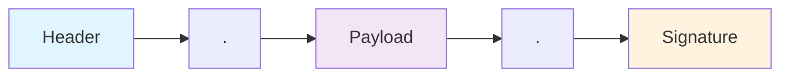
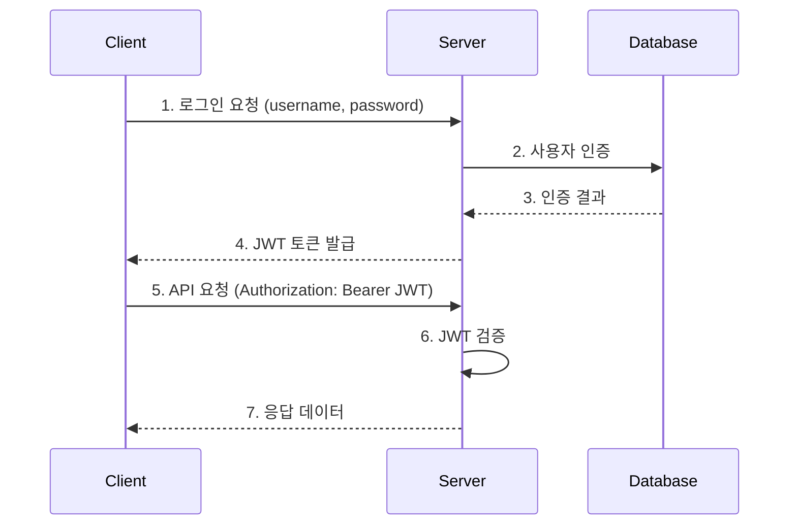
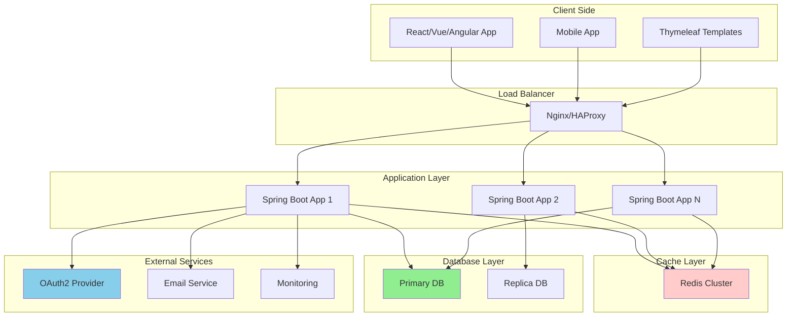

# JWT 완전 가이드 📚
*Spring Boot + Thymeleaf + JPA + CORS 종합 실습*

## 목차
1. [JWT 기본 개념](#jwt-기본-개념)
2. [프로젝트 구조](#프로젝트-구조)
3. [의존성 설정](#의존성-설정)
4. [JWT 구현](#jwt-구현)
5. [Spring Security 설정](#spring-security-설정)
6. [JPA 엔티티 설정](#jpa-엔티티-설정)
7. [CORS 설정](#cors-설정)
8. [Thymeleaf 템플릿](#thymeleaf-템플릿)
9. [실무 베스트 프랙티스](#실무-베스트-프랙티스)

---

## JWT 기본 개념

### JWT란?
JWT(JSON Web Token)는 당사자 간에 정보를 JSON 객체로 안전하게 전송하기 위한 컴팩트하고 독립적인 방법을 정의하는 개방형 표준(RFC 7519)입니다.

### JWT 구조


### JWT 인증 플로우


---

## 프로젝트 구조

```
src/
├── main/
│   ├── java/
│   │   └── com/
│   │       └── example/
│   │           └── jwt/
│   │               ├── JwtApplication.java
│   │               ├── config/
│   │               │   ├── SecurityConfig.java
│   │               │   ├── JwtConfig.java
│   │               │   └── CorsConfig.java
│   │               ├── entity/
│   │               │   └── User.java
│   │               ├── repository/
│   │               │   └── UserRepository.java
│   │               ├── service/
│   │               │   ├── JwtService.java
│   │               │   └── UserService.java
│   │               ├── controller/
│   │               │   ├── AuthController.java
│   │               │   └── HomeController.java
│   │               └── security/
│   │                   ├── JwtAuthenticationFilter.java
│   │                   └── JwtAuthenticationProvider.java
│   └── resources/
│       ├── templates/
│       │   ├── login.html
│       │   ├── dashboard.html
│       │   └── layout.html
│       └── application.yml
```

---

## 의존성 설정

### build.gradle
```gradle
dependencies {
    // Spring Boot 기본 의존성
    implementation 'org.springframework.boot:spring-boot-starter-web'
    implementation 'org.springframework.boot:spring-boot-starter-security'
    implementation 'org.springframework.boot:spring-boot-starter-data-jpa'
    implementation 'org.springframework.boot:spring-boot-starter-thymeleaf'
    
    // JWT 관련 의존성
    implementation 'io.jsonwebtoken:jjwt-api:0.12.3'
    runtimeOnly 'io.jsonwebtoken:jjwt-impl:0.12.3'
    runtimeOnly 'io.jsonwebtoken:jjwt-jackson:0.12.3'
    
    // 데이터베이스
    runtimeOnly 'com.h2database:h2'
    
    // 개발 도구
    developmentOnly 'org.springframework.boot:spring-boot-devtools'
    
    // 테스트
    testImplementation 'org.springframework.boot:spring-boot-starter-test'
    testImplementation 'org.springframework.security:spring-security-test'
}
```

---

## JWT 구현

### JWT 서비스
```java
@Service
@Component
public class JwtService {
    
    // JWT 서명에 사용할 비밀키 (실제 운영에서는 환경변수로 관리)
    private final String SECRET_KEY = "mySecretKeyForJWTTokenGenerationThatShouldBeLongEnough";
    
    // 토큰 만료시간 (24시간)
    private final long EXPIRATION_TIME = 24 * 60 * 60 * 1000;
    
    /**
     * 사용자 정보를 기반으로 JWT 토큰을 생성합니다.
     * @param username 사용자명
     * @param roles 사용자 권한 리스트
     * @return 생성된 JWT 토큰
     */
    public String generateToken(String username, List<String> roles) {
        // 현재 시간을 기준으로 토큰 발급 시간 설정
        Date now = new Date();
        // 만료 시간 설정 (현재시간 + 만료시간)
        Date expiryDate = new Date(now.getTime() + EXPIRATION_TIME);
        
        return Jwts.builder()
                .setSubject(username)                    // 토큰 주체(사용자명) 설정
                .claim("roles", roles)                   // 사용자 권한 정보 추가
                .setIssuedAt(now)                       // 토큰 발급 시간 설정
                .setExpiration(expiryDate)              // 토큰 만료 시간 설정
                .signWith(getSigningKey())              // 비밀키로 서명
                .compact();                             // 토큰 문자열로 압축
    }
    
    /**
     * JWT 토큰에서 사용자명을 추출합니다.
     * @param token JWT 토큰
     * @return 사용자명
     */
    public String getUsernameFromToken(String token) {
        // 토큰을 파싱하여 클레임 정보 추출
        Claims claims = Jwts.parserBuilder()
                .setSigningKey(getSigningKey())         // 검증에 사용할 키 설정
                .build()
                .parseClaimsJws(token)                  // 토큰 파싱 및 검증
                .getBody();                             // 페이로드 추출
        
        return claims.getSubject();                     // 주체(사용자명) 반환
    }
    
    /**
     * JWT 토큰에서 권한 정보를 추출합니다.
     * @param token JWT 토큰
     * @return 권한 리스트
     */
    @SuppressWarnings("unchecked")
    public List<String> getRolesFromToken(String token) {
        Claims claims = Jwts.parserBuilder()
                .setSigningKey(getSigningKey())
                .build()
                .parseClaimsJws(token)
                .getBody();
        
        // roles 클레임을 List<String>으로 캐스팅하여 반환
        return (List<String>) claims.get("roles");
    }
    
    /**
     * JWT 토큰의 유효성을 검증합니다.
     * @param token JWT 토큰
     * @return 유효하면 true, 그렇지 않으면 false
     */
    public boolean validateToken(String token) {
        try {
            Jwts.parserBuilder()
                    .setSigningKey(getSigningKey())     // 서명 검증용 키 설정
                    .build()
                    .parseClaimsJws(token);             // 토큰 파싱 시도
            return true;                                // 예외 없이 파싱되면 유효한 토큰
        } catch (JwtException | IllegalArgumentException e) {
            // 토큰이 유효하지 않거나 만료된 경우
            return false;
        }
    }
    
    /**
     * 문자열 비밀키를 암호화 키 객체로 변환합니다.
     * @return 서명용 키 객체
     */
    private Key getSigningKey() {
        // 비밀키를 바이트 배열로 변환 후 HMAC SHA 키로 생성
        byte[] keyBytes = SECRET_KEY.getBytes();
        return Keys.hmacShaKeyFor(keyBytes);
    }
}
```

---

## JPA 엔티티 설정

### User 엔티티
```java
@Entity
@Table(name = "users")  // 'user'는 SQL 예약어이므로 'users' 사용
@Data                   // Lombok: getter, setter, toString 등 자동 생성
@NoArgsConstructor     // Lombok: 기본 생성자 자동 생성
@AllArgsConstructor    // Lombok: 모든 필드를 포함한 생성자 자동 생성
public class User {
    
    @Id                                 // 기본키 지정
    @GeneratedValue(strategy = GenerationType.IDENTITY)  // 자동 증가 설정
    private Long id;
    
    @Column(unique = true, nullable = false)  // 유니크 제약조건, null 불허
    private String username;
    
    @Column(nullable = false)           // null 불허
    private String password;
    
    @Column(nullable = false)           // null 불허
    private String email;
    
    // 사용자 권한을 쉼표로 구분된 문자열로 저장 (예: "USER,ADMIN")
    @Column(nullable = false)
    private String roles = "USER";      // 기본값: USER 권한
    
    /**
     * 권한 문자열을 리스트로 변환하여 반환합니다.
     * @return 권한 리스트
     */
    public List<String> getRoleList() {
        // 쉼표로 구분된 권한 문자열을 분할하여 리스트로 변환
        return Arrays.stream(roles.split(","))
                .map(String::trim)      // 공백 제거
                .collect(Collectors.toList());
    }
}
```

### User Repository
```java
@Repository
public interface UserRepository extends JpaRepository<User, Long> {
    
    /**
     * 사용자명으로 사용자를 조회합니다.
     * @param username 사용자명
     * @return Optional로 감싸진 User 객체
     */
    Optional<User> findByUsername(String username);
    
    /**
     * 사용자명이 존재하는지 확인합니다.
     * @param username 사용자명
     * @return 존재하면 true, 그렇지 않으면 false
     */
    boolean existsByUsername(String username);
    
    /**
     * 이메일이 존재하는지 확인합니다.
     * @param email 이메일
     * @return 존재하면 true, 그렇지 않으면 false
     */
    boolean existsByEmail(String email);
}
```

---

## Spring Security 설정

### JWT 인증 필터
```java
@Component
public class JwtAuthenticationFilter extends OncePerRequestFilter {
    
    @Autowired
    private JwtService jwtService;
    
    /**
     * 모든 HTTP 요청에 대해 JWT 토큰을 검증합니다.
     */
    @Override
    protected void doFilterInternal(HttpServletRequest request, 
                                  HttpServletResponse response, 
                                  FilterChain filterChain) throws ServletException, IOException {
        
        // Authorization 헤더에서 토큰 추출
        String token = getTokenFromRequest(request);
        
        // 토큰이 존재하고 유효한 경우
        if (token != null && jwtService.validateToken(token)) {
            // 토큰에서 사용자 정보 추출
            String username = jwtService.getUsernameFromToken(token);
            List<String> roles = jwtService.getRolesFromToken(token);
            
            // Spring Security 권한 객체 생성
            List<SimpleGrantedAuthority> authorities = roles.stream()
                    .map(role -> new SimpleGrantedAuthority("ROLE_" + role))  // ROLE_ 접두사 추가
                    .collect(Collectors.toList());
            
            // 인증 토큰 생성
            UsernamePasswordAuthenticationToken authToken = 
                    new UsernamePasswordAuthenticationToken(username, null, authorities);
            
            // SecurityContext에 인증 정보 설정
            SecurityContextHolder.getContext().setAuthentication(authToken);
        }
        
        // 다음 필터로 요청 전달
        filterChain.doFilter(request, response);
    }
    
    /**
     * HTTP 요청에서 JWT 토큰을 추출합니다.
     * @param request HTTP 요청
     * @return JWT 토큰 또는 null
     */
    private String getTokenFromRequest(HttpServletRequest request) {
        String bearerToken = request.getHeader("Authorization");
        
        // Authorization 헤더가 존재하고 "Bearer "로 시작하는 경우
        if (bearerToken != null && bearerToken.startsWith("Bearer ")) {
            return bearerToken.substring(7);  // "Bearer " 이후의 토큰 부분만 추출
        }
        return null;
    }
}
```

### Security 설정
```java
@Configuration
@EnableWebSecurity  // Spring Security 활성화
public class SecurityConfig {
    
    @Autowired
    private JwtAuthenticationFilter jwtAuthenticationFilter;
    
    /**
     * 비밀번호 암호화를 위한 PasswordEncoder Bean 등록
     */
    @Bean
    public PasswordEncoder passwordEncoder() {
        // BCrypt 해시 함수를 사용한 비밀번호 암호화
        return new BCryptPasswordEncoder();
    }
    
    /**
     * Spring Security 설정
     */
    @Bean
    public SecurityFilterChain filterChain(HttpSecurity http) throws Exception {
        http
                // CSRF 보호 비활성화 (JWT 사용 시 일반적)
                .csrf(csrf -> csrf.disable())
                
                // 세션 관리 정책 설정 (JWT는 stateless)
                .sessionManagement(session -> 
                        session.sessionCreationPolicy(SessionCreationPolicy.STATELESS))
                
                // URL별 접근 권한 설정
                .authorizeHttpRequests(auth -> auth
                        .requestMatchers("/auth/**", "/login", "/register").permitAll()  // 인증 없이 접근 가능
                        .requestMatchers("/css/**", "/js/**", "/images/**").permitAll()   // 정적 리소스 허용
                        .requestMatchers("/admin/**").hasRole("ADMIN")                    // ADMIN 권한 필요
                        .anyRequest().authenticated()                                     // 나머지는 인증 필요
                )
                
                // 폼 로그인 설정
                .formLogin(form -> form
                        .loginPage("/login")           // 커스텀 로그인 페이지
                        .defaultSuccessUrl("/dashboard", true)  // 로그인 성공 시 이동할 페이지
                        .permitAll()
                )
                
                // 로그아웃 설정
                .logout(logout -> logout
                        .logoutUrl("/logout")
                        .logoutSuccessUrl("/login?logout")
                        .permitAll()
                )
                
                // JWT 필터를 Spring Security 필터 체인에 추가
                .addFilterBefore(jwtAuthenticationFilter, UsernamePasswordAuthenticationFilter.class);
        
        return http.build();
    }
}
```

---

## CORS 설정

### CORS 설정 클래스
```java
@Configuration
@EnableWebMvc  // Spring MVC 설정 활성화
public class CorsConfig implements WebMvcConfigurer {
    
    /**
     * CORS(Cross-Origin Resource Sharing) 설정
     * 다른 도메인에서 API 호출을 허용하기 위한 설정
     */
    @Override
    public void addCorsMappings(CorsRegistry registry) {
        registry
                .addMapping("/**")                      // 모든 경로에 대해 CORS 허용
                .allowedOriginPatterns("*")             // 모든 오리진 허용 (개발환경용)
                .allowedMethods(                        // 허용할 HTTP 메소드
                        "GET", "POST", "PUT", "DELETE", "PATCH", "OPTIONS")
                .allowedHeaders("*")                    // 모든 헤더 허용
                .allowCredentials(true)                 // 인증 정보(쿠키, Authorization 헤더 등) 허용
                .maxAge(3600);                          // preflight 요청 결과 캐시 시간(초)
    }
    
    /**
     * 글로벌 CORS 설정을 위한 Bean
     * 실제 운영환경에서는 특정 도메인만 허용해야 합니다.
     */
    @Bean
    public CorsConfigurationSource corsConfigurationSource() {
        CorsConfiguration configuration = new CorsConfiguration();
        
        // 운영환경에서는 실제 도메인 주소로 변경
        configuration.setAllowedOriginPatterns(Arrays.asList("*"));
        
        configuration.setAllowedMethods(Arrays.asList(
                "GET", "POST", "PUT", "DELETE", "PATCH", "OPTIONS"));
        
        configuration.setAllowedHeaders(Arrays.asList("*"));
        configuration.setAllowCredentials(true);
        
        UrlBasedCorsConfigurationSource source = new UrlBasedCorsConfigurationSource();
        source.registerCorsConfiguration("/**", configuration);  // 모든 경로에 적용
        
        return source;
    }
}
```

---

## Thymeleaf 템플릿

### 로그인 페이지 (login.html)
```html
<!DOCTYPE html>
<html lang="ko" xmlns:th="http://www.thymeleaf.org">
<head>
    <meta charset="UTF-8">
    <meta name="viewport" content="width=device-width, initial-scale=1.0">
    <title>로그인 - JWT 인증 시스템</title>
    <!-- Bootstrap CSS -->
    <link href="https://cdn.jsdelivr.net/npm/bootstrap@5.1.3/dist/css/bootstrap.min.css" rel="stylesheet">
    <style>
        /* 로그인 페이지 커스텀 스타일 */
        body {
            background: linear-gradient(135deg, #667eea 0%, #764ba2 100%);
            min-height: 100vh;
            display: flex;
            align-items: center;
        }
        .login-container {
            background: white;
            border-radius: 15px;
            box-shadow: 0 10px 25px rgba(0,0,0,0.1);
            padding: 40px;
            max-width: 400px;
            margin: 0 auto;
        }
    </style>
</head>
<body>
    <div class="container">
        <div class="row justify-content-center">
            <div class="col-md-6">
                <div class="login-container">
                    <h2 class="text-center mb-4">🔐 로그인</h2>
                    
                    <!-- 로그인 폼 -->
                    <form id="loginForm" method="post" action="/auth/login">
                        <div class="mb-3">
                            <label for="username" class="form-label">사용자명</label>
                            <input type="text" class="form-control" id="username" 
                                   name="username" required placeholder="사용자명을 입력하세요">
                        </div>
                        
                        <div class="mb-3">
                            <label for="password" class="form-label">비밀번호</label>
                            <input type="password" class="form-control" id="password" 
                                   name="password" required placeholder="비밀번호를 입력하세요">
                        </div>
                        
                        <div class="mb-3 form-check">
                            <input type="checkbox" class="form-check-input" id="rememberMe">
                            <label class="form-check-label" for="rememberMe">
                                로그인 정보 기억하기
                            </label>
                        </div>
                        
                        <button type="submit" class="btn btn-primary w-100 mb-3">
                            로그인
                        </button>
                        
                        <div class="text-center">
                            <p class="mb-0">계정이 없으시나요? 
                                <a href="/register" class="text-decoration-none">회원가입</a>
                            </p>
                        </div>
                    </form>
                    
                    <!-- 오류 메시지 표시 영역 -->
                    <div id="errorAlert" class="alert alert-danger mt-3" style="display: none;">
                        <span id="errorMessage"></span>
                    </div>
                </div>
            </div>
        </div>
    </div>

    <!-- Bootstrap JS -->
    <script src="https://cdn.jsdelivr.net/npm/bootstrap@5.1.3/dist/js/bootstrap.bundle.min.js"></script>
    
    <script>
        /**
         * 로그인 폼 제출 처리
         * AJAX를 사용하여 비동기적으로 로그인 처리
         */
        document.getElementById('loginForm').addEventListener('submit', async function(e) {
            e.preventDefault(); // 기본 폼 제출 방지
            
            // 폼 데이터 수집
            const formData = new FormData(this);
            const loginData = {
                username: formData.get('username'),
                password: formData.get('password')
            };
            
            try {
                // 로그인 API 호출
                const response = await fetch('/auth/login', {
                    method: 'POST',
                    headers: {
                        'Content-Type': 'application/json',
                    },
                    body: JSON.stringify(loginData)
                });
                
                if (response.ok) {
                    const result = await response.json();
                    
                    // JWT 토큰을 localStorage에 저장
                    localStorage.setItem('jwt_token', result.token);
                    
                    // 대시보드로 이동
                    window.location.href = '/dashboard';
                } else {
                    // 로그인 실패 시 오류 메시지 표시
                    const error = await response.json();
                    showError(error.message || '로그인에 실패했습니다.');
                }
            } catch (error) {
                showError('서버와의 통신에 실패했습니다.');
            }
        });
        
        /**
         * 오류 메시지를 화면에 표시합니다.
         * @param {string} message - 표시할 오류 메시지
         */
        function showError(message) {
            const errorAlert = document.getElementById('errorAlert');
            const errorMessage = document.getElementById('errorMessage');
            
            errorMessage.textContent = message;
            errorAlert.style.display = 'block';
            
            // 5초 후 오류 메시지 자동 숨김
            setTimeout(() => {
                errorAlert.style.display = 'none';
            }, 5000);
        }
    </script>
</body>
</html>
```

### 대시보드 페이지 (dashboard.html)
```html
<!DOCTYPE html>
<html lang="ko" xmlns:th="http://www.thymeleaf.org">
<head>
    <meta charset="UTF-8">
    <meta name="viewport" content="width=device-width, initial-scale=1.0">
    <title>대시보드 - JWT 인증 시스템</title>
    <link href="https://cdn.jsdelivr.net/npm/bootstrap@5.1.3/dist/css/bootstrap.min.css" rel="stylesheet">
    <link href="https://cdnjs.cloudflare.com/ajax/libs/font-awesome/6.0.0/css/all.min.css" rel="stylesheet">
</head>
<body>
    <!-- 네비게이션 바 -->
    <nav class="navbar navbar-expand-lg navbar-dark bg-primary">
        <div class="container">
            <a class="navbar-brand" href="#">
                <i class="fas fa-shield-alt me-2"></i>JWT 인증 시스템
            </a>
            
            <div class="navbar-nav ms-auto">
                <span class="navbar-text me-3">
                    환영합니다, <span id="username" th:text="${username}"></span>님!
                </span>
                <button class="btn btn-outline-light btn-sm" onclick="logout()">
                    <i class="fas fa-sign-out-alt me-1"></i>로그아웃
                </button>
            </div>
        </div>
    </nav>
    
    <!-- 메인 컨텐츠 -->
    <div class="container mt-5">
        <div class="row">
            <div class="col-md-12">
                <div class="card">
                    <div class="card-header">
                        <h5 class="mb-0"><i class="fas fa-tachometer-alt me-2"></i>대시보드</h5>
                    </div>
                    <div class="card-body">
                        <div class="row">
                            <!-- 사용자 정보 카드 -->
                            <div class="col-md-4 mb-3">
                                <div class="card bg-primary text-white">
                                    <div class="card-body">
                                        <div class="d-flex justify-content-between">
                                            <div>
                                                <h6 class="card-title">사용자 정보</h6>
                                                <p class="mb-0" th:text="${username}">사용자명</p>
                                            </div>
                                            <div class="align-self-center">
                                                <i class="fas fa-user fa-2x"></i>
                                            </div>
                                        </div>
                                    </div>
                                </div>
                            </div>
                            
                            <!-- 권한 정보 카드 -->
                            <div class="col-md-4 mb-3">
                                <div class="card bg-success text-white">
                                    <div class="card-body">
                                        <div class="d-flex justify-content-between">
                                            <div>
                                                <h6 class="card-title">권한</h6>
                                                <p class="mb-0" th:text="${roles}">USER</p>
                                            </div>
                                            <div class="align-self-center">
                                                <i class="fas fa-key fa-2x"></i>
                                            </div>
                                        </div>
                                    </div>
                                </div>
                            </div>
                            
                            <!-- 토큰 상태 카드 -->
                            <div class="col-md-4 mb-3">
                                <div class="card bg-info text-white">
                                    <div class="card-body">
                                        <div class="d-flex justify-content-between">
                                            <div>
                                                <h6 class="card-title">토큰 상태</h6>
                                                <p class="mb-0" id="tokenStatus">유효</p>
                                            </div>
                                            <div class="align-self-center">
                                                <i class="fas fa-check-circle fa-2x"></i>
                                            </div>
                                        </div>
                                    </div>
                                </div>
                            </div>
                        </div>
                        
                        <!-- API 테스트 섹션 -->
                        <div class="row mt-4">
                            <div class="col-md-12">
                                <h5><i class="fas fa-flask me-2"></i>API 테스트</h5>
                                <div class="card">
                                    <div class="card-body">
                                        <button class="btn btn-primary me-2" onclick="testProtectedAPI()">
                                            보호된 API 호출
                                        </button>
                                        <button class="btn btn-warning me-2" onclick="testAdminAPI()">
                                            관리자 API 호출
                                        </button>
                                        <button class="btn btn-info" onclick="refreshToken()">
                                            토큰 갱신
                                        </button>
                                        
                                        <div class="mt-3">
                                            <h6>API 응답:</h6>
                                            <pre id="apiResponse" class="bg-light p-3 rounded">여기에 API 응답이 표시됩니다.</pre>
                                        </div>
                                    </div>
                                </div>
                            </div>
                        </div>
                    </div>
                </div>
            </div>
        </div>
    </div>

    <script src="https://cdn.jsdelivr.net/npm/bootstrap@5.1.3/dist/js/bootstrap.bundle.min.js"></script>
    
    <script>
        /**
         * 페이지 로드 시 토큰 상태 확인
         */
        document.addEventListener('DOMContentLoaded', function() {
            checkTokenStatus();
        });
        
        /**
         * JWT 토큰 상태를 확인합니다.
         */
        function checkTokenStatus() {
            const token = localStorage.getItem('jwt_token');
            const statusElement = document.getElementById('tokenStatus');
            
            if (token) {
                // 토큰 만료 시간 확인 (실제로는 서버에서 확인해야 함)
                try {
                    const payload = JSON.parse(atob(token.split('.')[1]));
                    const currentTime = Date.now() / 1000;
                    
                    if (payload.exp && payload.exp > currentTime) {
                        statusElement.textContent = '유효';
                        statusElement.parentElement.parentElement.className = 'card bg-success text-white';
                    } else {
                        statusElement.textContent = '만료됨';
                        statusElement.parentElement.parentElement.className = 'card bg-danger text-white';
                    }
                } catch (error) {
                    statusElement.textContent = '오류';
                    statusElement.parentElement.parentElement.className = 'card bg-warning text-white';
                }
            } else {
                statusElement.textContent = '없음';
                statusElement.parentElement.parentElement.className = 'card bg-secondary text-white';
            }
        }
        
        /**
         * 보호된 API를 호출합니다.
         */
        async function testProtectedAPI() {
            const token = localStorage.getItem('jwt_token');
            const responseElement = document.getElementById('apiResponse');
            
            try {
                const response = await fetch('/api/user/profile', {
                    method: 'GET',
                    headers: {
                        'Authorization': `Bearer ${token}`,
                        'Content-Type': 'application/json'
                    }
                });
                
                const data = await response.json();
                responseElement.textContent = JSON.stringify(data, null, 2);
                
                if (!response.ok) {
                    throw new Error(data.message || 'API 호출 실패');
                }
            } catch (error) {
                responseElement.textContent = `오류: ${error.message}`;
            }
        }
        
        /**
         * 관리자 전용 API를 호출합니다.
         */
        async function testAdminAPI() {
            const token = localStorage.getItem('jwt_token');
            const responseElement = document.getElementById('apiResponse');
            
            try {
                const response = await fetch('/api/admin/users', {
                    method: 'GET',
                    headers: {
                        'Authorization': `Bearer ${token}`,
                        'Content-Type': 'application/json'
                    }
                });
                
                const data = await response.json();
                responseElement.textContent = JSON.stringify(data, null, 2);
                
                if (!response.ok) {
                    throw new Error(data.message || 'API 호출 실패');
                }
            } catch (error) {
                responseElement.textContent = `오류: ${error.message}`;
            }
        }
        
        /**
         * 토큰을 갱신합니다.
         */
        async function refreshToken() {
            const token = localStorage.getItem('jwt_token');
            const responseElement = document.getElementById('apiResponse');
            
            try {
                const response = await fetch('/auth/refresh', {
                    method: 'POST',
                    headers: {
                        'Authorization': `Bearer ${token}`,
                        'Content-Type': 'application/json'
                    }
                });
                
                if (response.ok) {
                    const data = await response.json();
                    localStorage.setItem('jwt_token', data.token);
                    responseElement.textContent = '토큰이 성공적으로 갱신되었습니다.';
                    checkTokenStatus(); // 상태 업데이트
                } else {
                    const error = await response.json();
                    throw new Error(error.message || '토큰 갱신 실패');
                }
            } catch (error) {
                responseElement.textContent = `토큰 갱신 오류: ${error.message}`;
            }
        }
        
        /**
         * 로그아웃을 처리합니다.
         */
        function logout() {
            // localStorage에서 토큰 제거
            localStorage.removeItem('jwt_token');
            
            // 로그인 페이지로 이동
            window.location.href = '/login';
        }
    </script>
</body>
</html>
```

---

## 컨트롤러 구현

### 인증 컨트롤러
```java
@RestController
@RequestMapping("/auth")
public class AuthController {
    
    @Autowired
    private UserService userService;
    
    @Autowired
    private JwtService jwtService;
    
    @Autowired
    private PasswordEncoder passwordEncoder;
    
    /**
     * 사용자 로그인을 처리합니다.
     * @param loginRequest 로그인 요청 데이터
     * @return JWT 토큰을 포함한 응답
     */
    @PostMapping("/login")
    public ResponseEntity<?> login(@RequestBody LoginRequest loginRequest) {
        try {
            // 사용자 조회
            User user = userService.findByUsername(loginRequest.getUsername())
                    .orElseThrow(() -> new RuntimeException("사용자를 찾을 수 없습니다."));
            
            // 비밀번호 확인
            if (!passwordEncoder.matches(loginRequest.getPassword(), user.getPassword())) {
                return ResponseEntity.badRequest()
                        .body(new AuthResponse("비밀번호가 일치하지 않습니다.", null));
            }
            
            // JWT 토큰 생성
            String token = jwtService.generateToken(user.getUsername(), user.getRoleList());
            
            return ResponseEntity.ok(new AuthResponse("로그인 성공", token));
            
        } catch (Exception e) {
            return ResponseEntity.badRequest()
                    .body(new AuthResponse("로그인 실패: " + e.getMessage(), null));
        }
    }
    
    /**
     * 사용자 회원가입을 처리합니다.
     * @param registerRequest 회원가입 요청 데이터
     * @return 회원가입 결과
     */
    @PostMapping("/register")
    public ResponseEntity<?> register(@RequestBody RegisterRequest registerRequest) {
        try {
            // 사용자명 중복 확인
            if (userService.existsByUsername(registerRequest.getUsername())) {
                return ResponseEntity.badRequest()
                        .body(new AuthResponse("이미 존재하는 사용자명입니다.", null));
            }
            
            // 이메일 중복 확인
            if (userService.existsByEmail(registerRequest.getEmail())) {
                return ResponseEntity.badRequest()
                        .body(new AuthResponse("이미 사용 중인 이메일입니다.", null));
            }
            
            // 새 사용자 생성
            User newUser = new User();
            newUser.setUsername(registerRequest.getUsername());
            newUser.setPassword(passwordEncoder.encode(registerRequest.getPassword()));
            newUser.setEmail(registerRequest.getEmail());
            newUser.setRoles("USER"); // 기본 권한
            
            // 사용자 저장
            userService.save(newUser);
            
            return ResponseEntity.ok(new AuthResponse("회원가입이 완료되었습니다.", null));
            
        } catch (Exception e) {
            return ResponseEntity.badRequest()
                    .body(new AuthResponse("회원가입 실패: " + e.getMessage(), null));
        }
    }
    
    /**
     * JWT 토큰을 갱신합니다.
     * @param request HTTP 요청 (Authorization 헤더에서 토큰 추출)
     * @return 새로운 JWT 토큰
     */
    @PostMapping("/refresh")
    public ResponseEntity<?> refreshToken(HttpServletRequest request) {
        try {
            // 요청 헤더에서 토큰 추출
            String token = getTokenFromRequest(request);
            
            if (token == null || !jwtService.validateToken(token)) {
                return ResponseEntity.badRequest()
                        .body(new AuthResponse("유효하지 않은 토큰입니다.", null));
            }
            
            // 토큰에서 사용자 정보 추출
            String username = jwtService.getUsernameFromToken(token);
            List<String> roles = jwtService.getRolesFromToken(token);
            
            // 새 토큰 생성
            String newToken = jwtService.generateToken(username, roles);
            
            return ResponseEntity.ok(new AuthResponse("토큰 갱신 성공", newToken));
            
        } catch (Exception e) {
            return ResponseEntity.badRequest()
                    .body(new AuthResponse("토큰 갱신 실패: " + e.getMessage(), null));
        }
    }
    
    /**
     * HTTP 요청에서 JWT 토큰을 추출합니다.
     */
    private String getTokenFromRequest(HttpServletRequest request) {
        String bearerToken = request.getHeader("Authorization");
        if (bearerToken != null && bearerToken.startsWith("Bearer ")) {
            return bearerToken.substring(7);
        }
        return null;
    }
    
    // 요청/응답 DTO 클래스들
    @Data
    public static class LoginRequest {
        private String username;
        private String password;
    }
    
    @Data
    public static class RegisterRequest {
        private String username;
        private String password;
        private String email;
    }
    
    @Data
    @AllArgsConstructor
    public static class AuthResponse {
        private String message;
        private String token;
    }
}
```

### API 컨트롤러
```java
@RestController
@RequestMapping("/api")
public class ApiController {
    
    @Autowired
    private UserService userService;
    
    /**
     * 현재 로그인한 사용자의 프로필 정보를 반환합니다.
     * @param authentication Spring Security 인증 객체
     * @return 사용자 프로필 정보
     */
    @GetMapping("/user/profile")
    public ResponseEntity<?> getUserProfile(Authentication authentication) {
        try {
            // 현재 인증된 사용자명 가져오기
            String username = authentication.getName();
            
            // 사용자 정보 조회
            User user = userService.findByUsername(username)
                    .orElseThrow(() -> new RuntimeException("사용자를 찾을 수 없습니다."));
            
            // 비밀번호 제외한 사용자 정보 반환
            UserProfileResponse profile = new UserProfileResponse();
            profile.setId(user.getId());
            profile.setUsername(user.getUsername());
            profile.setEmail(user.getEmail());
            profile.setRoles(user.getRoleList());
            
            return ResponseEntity.ok(profile);
            
        } catch (Exception e) {
            return ResponseEntity.badRequest()
                    .body(Map.of("error", "프로필 조회 실패: " + e.getMessage()));
        }
    }
    
    /**
     * 관리자 전용: 모든 사용자 목록을 반환합니다.
     * @return 사용자 목록
     */
    @GetMapping("/admin/users")
    @PreAuthorize("hasRole('ADMIN')")  // ADMIN 권한이 있는 사용자만 접근 가능
    public ResponseEntity<?> getAllUsers() {
        try {
            List<User> users = userService.findAll();
            
            // 비밀번호 제외한 사용자 정보 목록 생성
            List<UserProfileResponse> userProfiles = users.stream()
                    .map(user -> {
                        UserProfileResponse profile = new UserProfileResponse();
                        profile.setId(user.getId());
                        profile.setUsername(user.getUsername());
                        profile.setEmail(user.getEmail());
                        profile.setRoles(user.getRoleList());
                        return profile;
                    })
                    .collect(Collectors.toList());
            
            return ResponseEntity.ok(userProfiles);
            
        } catch (Exception e) {
            return ResponseEntity.badRequest()
                    .body(Map.of("error", "사용자 목록 조회 실패: " + e.getMessage()));
        }
    }
    
    /**
     * 테스트용 보호된 엔드포인트
     * @param authentication 인증 정보
     * @return 테스트 응답
     */
    @GetMapping("/protected")
    public ResponseEntity<?> protectedEndpoint(Authentication authentication) {
        return ResponseEntity.ok(Map.of(
                "message", "보호된 엔드포인트에 성공적으로 접근했습니다.",
                "user", authentication.getName(),
                "authorities", authentication.getAuthorities(),
                "timestamp", new Date()
        ));
    }
    
    @Data
    public static class UserProfileResponse {
        private Long id;
        private String username;
        private String email;
        private List<String> roles;
    }
}
```

---

## 실무 베스트 프랙티스

### 🔐 보안 강화 방안

#### 1. 환경변수 기반 설정
```yaml
# application.yml
app:
  jwt:
    secret: ${JWT_SECRET:defaultSecretKeyThatShouldBeChangedInProduction}
    expiration: ${JWT_EXPIRATION:86400000}  # 24시간 (밀리초)
    refresh-expiration: ${JWT_REFRESH_EXPIRATION:604800000}  # 7일

spring:
  profiles:
    active: ${SPRING_PROFILES_ACTIVE:dev}
  
  datasource:
    url: ${DB_URL:jdbc:h2:mem:testdb}
    username: ${DB_USERNAME:sa}
    password: ${DB_PASSWORD:}
  
  jpa:
    hibernate:
      ddl-auto: ${DDL_AUTO:update}
    show-sql: ${SHOW_SQL:true}
```

#### 2. Refresh Token 구현
```java
@Service
public class RefreshTokenService {
    
    @Autowired
    private RefreshTokenRepository refreshTokenRepository;
    
    /**
     * Refresh Token 생성 및 저장
     */
    public RefreshToken createRefreshToken(String username) {
        RefreshToken refreshToken = new RefreshToken();
        refreshToken.setUsername(username);
        refreshToken.setToken(UUID.randomUUID().toString());
        refreshToken.setExpiryDate(Instant.now().plusMillis(refreshTokenDuration));
        
        return refreshTokenRepository.save(refreshToken);
    }
    
    /**
     * Refresh Token 검증
     */
    public Optional<RefreshToken> findByToken(String token) {
        return refreshTokenRepository.findByToken(token);
    }
    
    /**
     * Refresh Token 만료 확인
     */
    public RefreshToken verifyExpiration(RefreshToken token) {
        if (token.getExpiryDate().compareTo(Instant.now()) < 0) {
            refreshTokenRepository.delete(token);
            throw new TokenRefreshException(token.getToken(), 
                    "Refresh token was expired. Please make a new signin request");
        }
        return token;
    }
}
```

### 📊 현업에서 주로 사용하는 패턴

#### 1. **Access Token + Refresh Token 패턴** ⭐⭐⭐⭐⭐
```java
// 가장 널리 사용되는 패턴
// - Access Token: 짧은 만료시간 (15분~1시간)
// - Refresh Token: 긴 만료시간 (1주~1개월)
// - 보안성과 사용성의 균형
```

#### 2. **Redis를 활용한 토큰 블랙리스트** ⭐⭐⭐⭐
```java
@Service
public class TokenBlacklistService {
    
    @Autowired
    private RedisTemplate<String, String> redisTemplate;
    
    public void blacklistToken(String token, long expiration) {
        // 토큰을 블랙리스트에 추가 (만료시간까지)
        redisTemplate.opsForValue().set(
            "blacklist:" + token, 
            "true", 
            expiration, 
            TimeUnit.MILLISECONDS
        );
    }
    
    public boolean isTokenBlacklisted(String token) {
        return Boolean.TRUE.equals(
            redisTemplate.hasKey("blacklist:" + token)
        );
    }
}
```

#### 3. **Role-Based Access Control (RBAC)** ⭐⭐⭐⭐⭐
```java
// 현업에서 가장 선호하는 권한 관리 방식
@PreAuthorize("hasRole('ADMIN') or (hasRole('USER') and #userId == authentication.principal.id)")
@GetMapping("/users/{userId}")
public ResponseEntity<?> getUser(@PathVariable Long userId) {
    // 관리자이거나 본인의 정보만 조회 가능
}
```

### 🏗️ 아키텍처 다이어그램



### 🚀 성능 최적화 팁

#### 1. **JWT 토큰 크기 최소화**
```java
// ❌ 나쁜 예: 불필요한 정보 포함
public String generateToken(User user) {
    return Jwts.builder()
        .setSubject(user.getUsername())
        .claim("fullUserObject", user)  // 전체 사용자 객체 포함 (위험)
        .claim("permissions", getAllPermissions(user))  // 너무 많은 권한 정보
        .signWith(key)
        .compact();
}

// ✅ 좋은 예: 필수 정보만 포함
public String generateToken(String username, List<String> roles) {
    return Jwts.builder()
        .setSubject(username)
        .claim("roles", roles)  // 최소한의 권한 정보만
        .setIssuedAt(new Date())
        .setExpiration(new Date(System.currentTimeMillis() + EXPIRATION_TIME))
        .signWith(key)
        .compact();
}
```

#### 2. **토큰 검증 캐싱**
```java
@Service
public class CachedJwtService {
    
    private final Cache<String, Boolean> tokenValidationCache = 
            Caffeine.newBuilder()
                .maximumSize(10000)
                .expireAfterWrite(5, TimeUnit.MINUTES)  // 5분 캐시
                .build();
    
    public boolean validateTokenWithCache(String token) {
        return tokenValidationCache.get(token, this::validateTokenInternal);
    }
}
```

### ⚠️ 보안 주의사항

#### 1. **JWT 저장 위치** (클라이언트)
```javascript
// ❌ 위험: localStorage (XSS 공격 취약)
localStorage.setItem('jwt_token', token);

// ⚠️ 주의: sessionStorage (XSS 공격 취약하지만 탭 종료 시 삭제)
sessionStorage.setItem('jwt_token', token);

// ✅ 안전: HttpOnly 쿠키 (XSS 공격 방어, 하지만 CSRF 주의)
// 서버에서 Set-Cookie: token=jwt; HttpOnly; Secure; SameSite=Strict
```

#### 2. **CORS 설정** (운영환경)
```java
// ❌ 개발환경용 (운영 금지)
.allowedOriginPatterns("*")

// ✅ 운영환경용
.allowedOrigins(
    "https://yourdomain.com",
    "https://www.yourdomain.com",
    "https://mobile.yourdomain.com"
)
```

### 📈 모니터링 및 로깅

```java
@Component
@Slf4j
public class JwtAuditFilter extends OncePerRequestFilter {
    
    @Override
    protected void doFilterInternal(HttpServletRequest request, 
                                  HttpServletResponse response, 
                                  FilterChain filterChain) throws ServletException, IOException {
        
        String token = getTokenFromRequest(request);
        String clientIp = getClientIp(request);
        String userAgent = request.getHeader("User-Agent");
        
        if (token != null) {
            try {
                String username = jwtService.getUsernameFromToken(token);
                
                // 성공 로깅
                log.info("JWT_ACCESS_SUCCESS - User: {}, IP: {}, UserAgent: {}, Endpoint: {}", 
                        username, clientIp, userAgent, request.getRequestURI());
                        
            } catch (Exception e) {
                // 실패 로깅
                log.warn("JWT_ACCESS_FAILED - IP: {}, UserAgent: {}, Endpoint: {}, Error: {}", 
                        clientIp, userAgent, request.getRequestURI(), e.getMessage());
            }
        }
        
        filterChain.doFilter(request, response);
    }
}
```

### 🔧 운영환경 체크리스트

- [ ] **보안**
  - [ ] JWT 비밀키를 환경변수로 관리
  - [ ] HTTPS 사용 강제
  - [ ] CORS 설정을 특정 도메인으로 제한
  - [ ] Rate Limiting 구현
  - [ ] SQL Injection 방어

- [ ] **성능**  
  - [ ] 토큰 검증 캐싱 적용
  - [ ] 데이터베이스 커넥션 풀 최적화
  - [ ] 정적 리소스 CDN 사용

- [ ] **모니터링**
  - [ ] 로그 수집 시스템 구축 (ELK Stack)
  - [ ] 메트릭 수집 (Micrometer + Prometheus)
  - [ ] 알림 시스템 구축

- [ ] **백업 및 복구**
  - [ ] 데이터베이스 정기 백업
  - [ ] 재해 복구 계획 수립

이 가이드는 JWT 인증 시스템의 완전한 구현을 다루며, 실무에서 바로 적용할 수 있는 베스트 프랙티스를 포함합니다. 🚀
