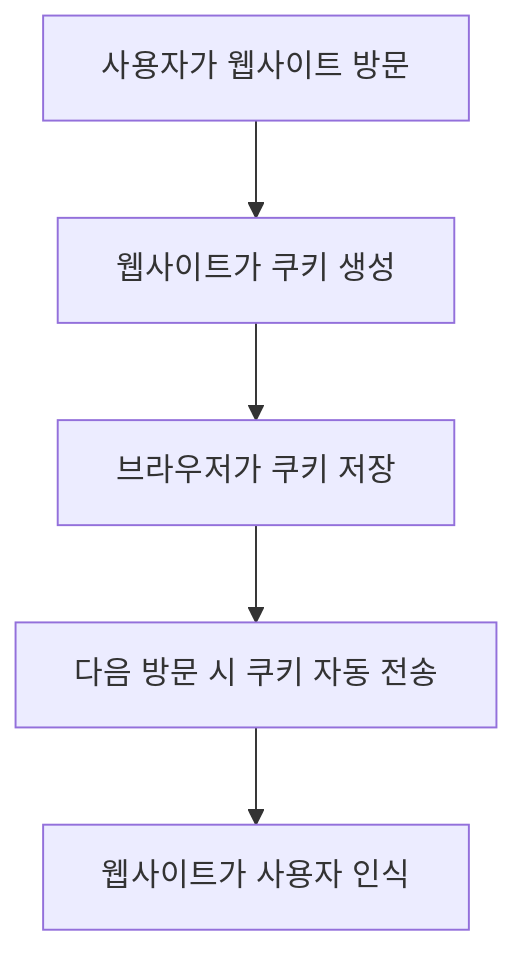
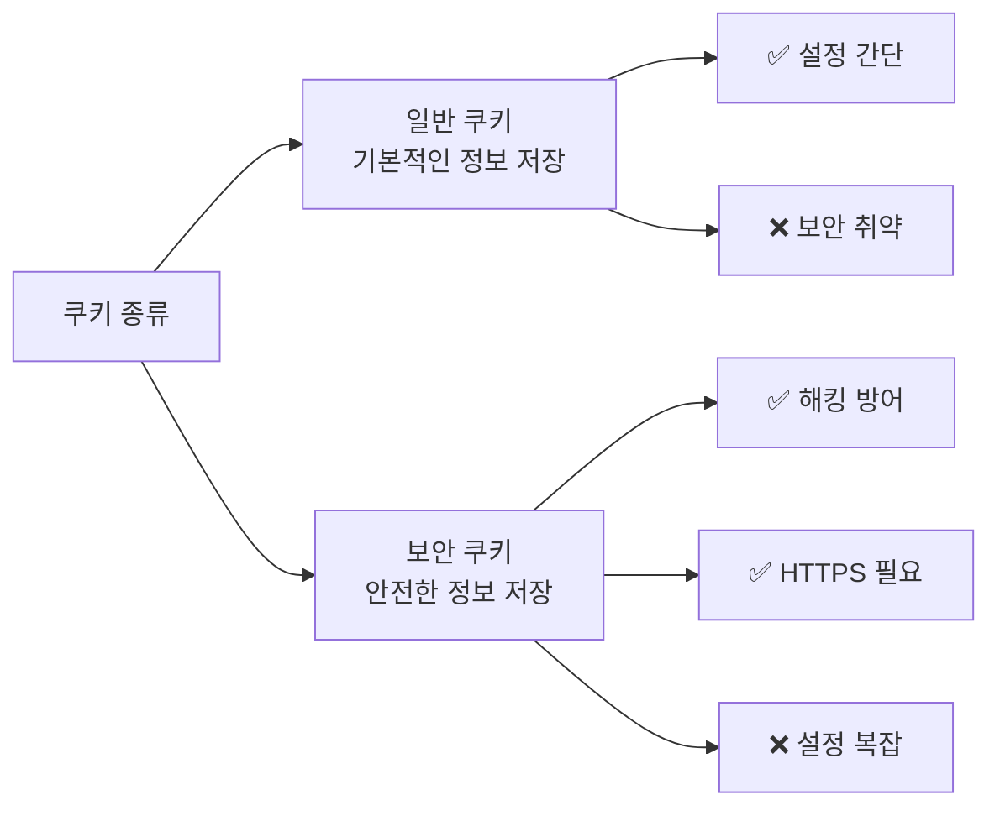
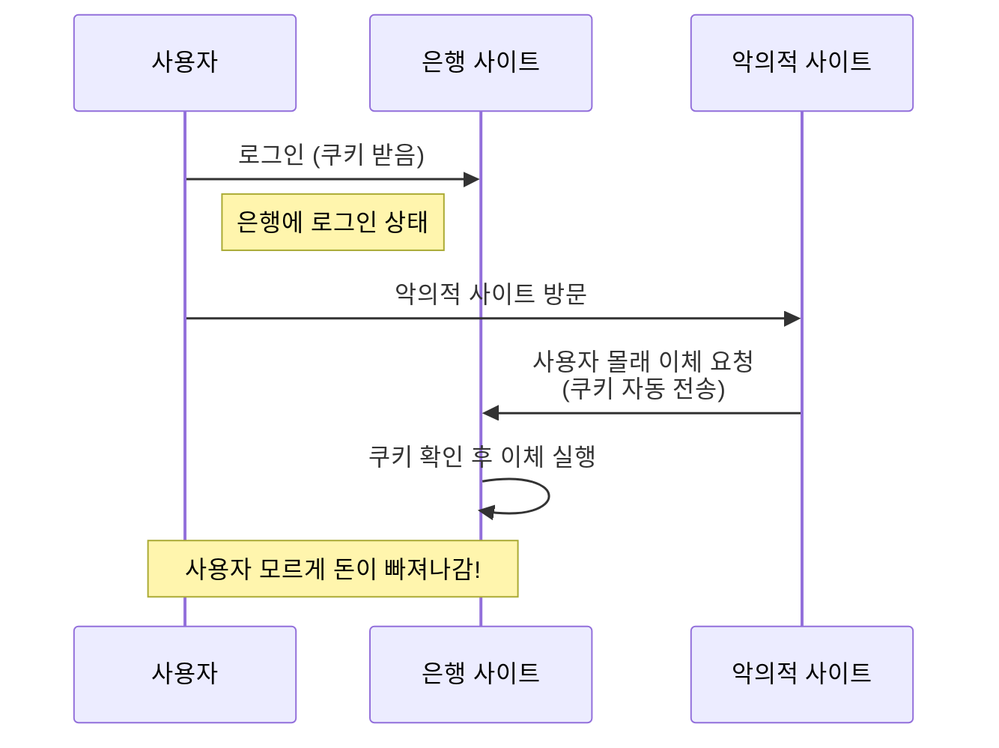
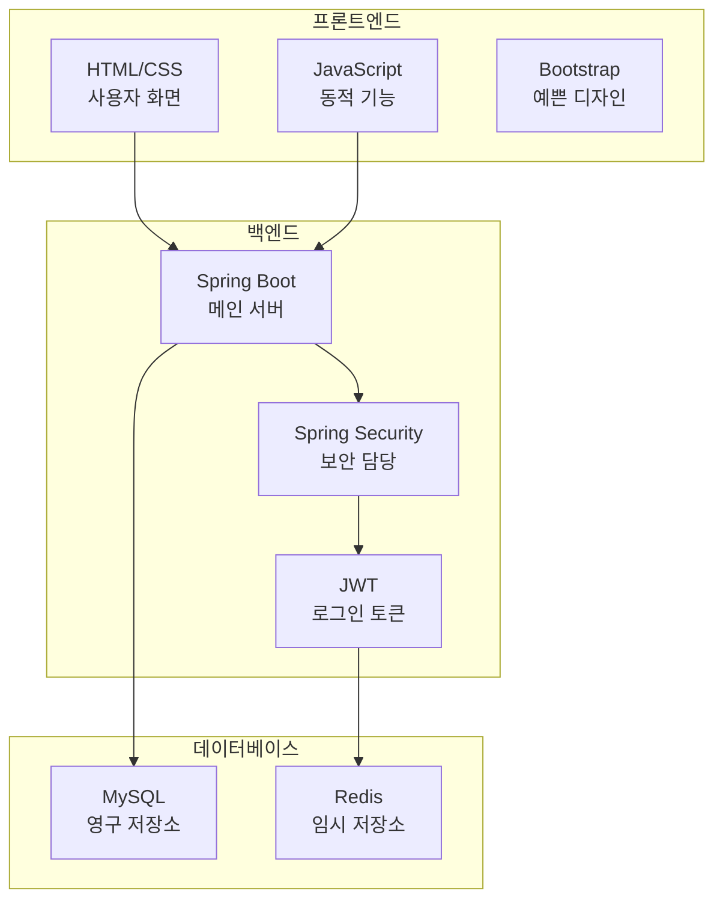
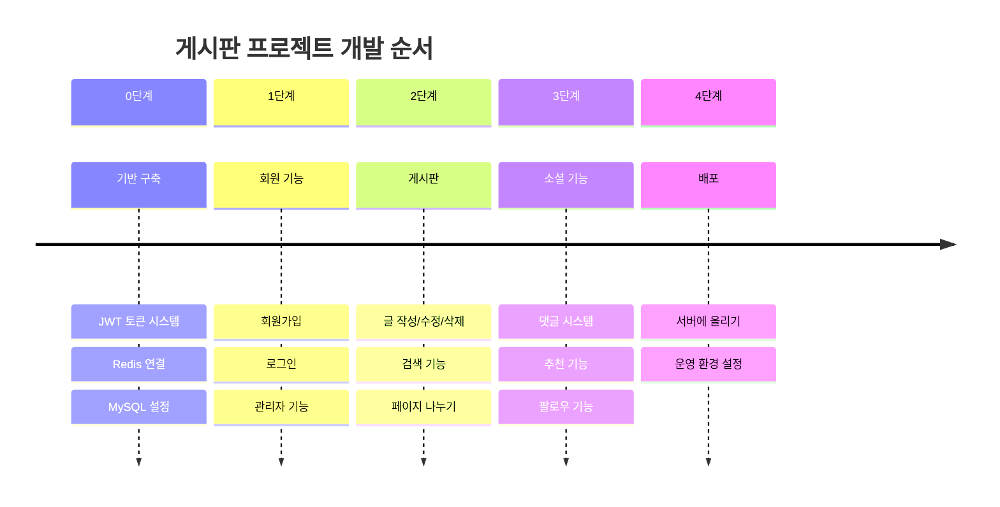
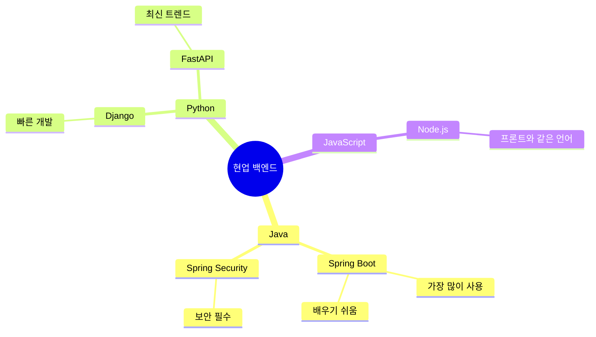
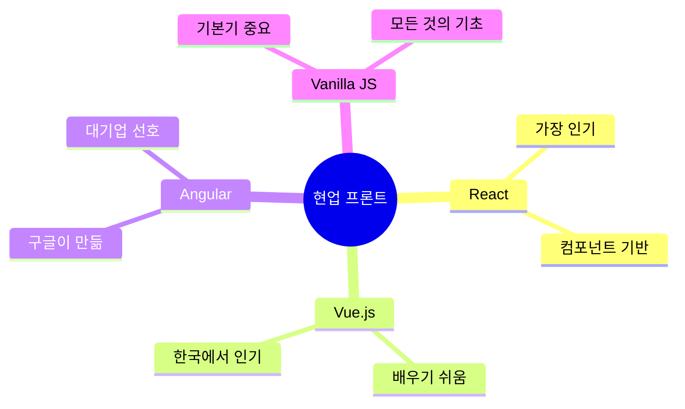
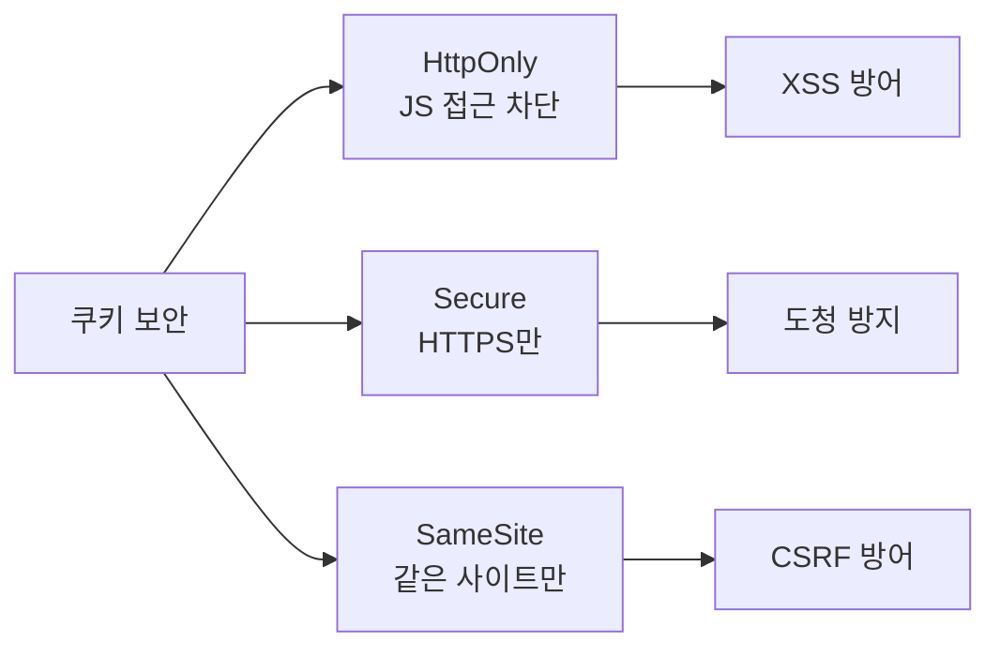
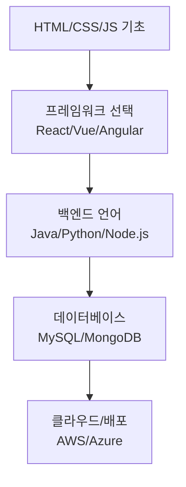

# 🍪 쿠키와 게시판 프로젝트 완벽 가이드

## 📚 목차
1. [쿠키란 무엇인가요?](#쿠키란-무엇인가요)
2. [쿠키 보안 - 왜 중요할까요?](#쿠키-보안---왜-중요할까요)
3. [게시판 프로젝트 구조](#게시판-프로젝트-구조)
4. [현업에서 주로 사용하는 기술들](#현업에서-주로-사용하는-기술들)
5. [코드 상세 설명](#코드-상세-설명)

---

## 🍪 쿠키란 무엇인가요?

**쿠키**는 웹사이트가 여러분의 컴퓨터에 저장하는 작은 정보 조각입니다. 마치 도서관에서 책을 빌릴 때 받는 영수증 같은 거예요!



### 쿠키의 종류



---

## 🔐 쿠키 보안 - 왜 중요할까요?

### CSRF 공격이란?
**CSRF**(Cross-Site Request Forgery)는 마치 누군가가 여러분의 이름으로 은행에서 돈을 빼는 것과 같습니다!



### 보안 쿠키 속성들

| 속성 | 설명 | 비유 |
|------|------|------|
| `HttpOnly` | 자바스크립트로 접근 불가 | 금고에 넣어 둔 비밀번호 |
| `Secure` | HTTPS에서만 전송 | 보안 우편으로만 배송 |
| `SameSite` | 같은 사이트에서만 전송 | 신분증 확인 후 출입 |

---

## 🏗️ 게시판 프로젝트 구조

### 전체 아키텍처



### 프로젝트 단계별 진행



---

## 💼 현업에서 주로 사용하는 기술들

### 백엔드 (서버) 기술



### 프론트엔드 (화면) 기술



### 데이터베이스 기술

| 종류 | 기술 | 사용처 | 특징 |
|------|------|--------|------|
| 관계형 | MySQL, PostgreSQL | 대부분의 웹사이트 | 안정적, 무료 |
| NoSQL | MongoDB, Redis | 빅데이터, 캐시 | 빠름, 유연함 |
| 클라우드 | AWS RDS, Google Cloud SQL | 대기업 서비스 | 관리 편함, 비쌈 |

---

## 💻 코드 상세 설명

### 1. 쿠키 설정 코드 (Java)

```java
// 🎯 RestController: 이 클래스가 웹 API를 제공한다는 표시
@RestController
// 🌐 RequestMapping: 모든 API 주소 앞에 "/api"가 붙음
@RequestMapping("/api")
// 🔗 CrossOrigin: 다른 도메인에서도 접근 가능하게 설정
@CrossOrigin(origins = "http://127.0.0.1:5500", allowCredentials = "true")
public class CookieController {

    // 📝 일반 쿠키 만들기 (보안 약함)
    @GetMapping("/set-cookie")  // GET 요청을 받는 API
    public ResponseEntity<String> setCookie(HttpServletResponse response) {
        // 🍪 새로운 쿠키 생성: 이름은 "simpleCookie", 값은 "basic-value"
        Cookie cookie = new Cookie("simpleCookie", "basic-value");
        cookie.setPath("/");  // 모든 경로에서 사용 가능
        cookie.setHttpOnly(false);  // ❌ 자바스크립트로 접근 가능 (위험!)
        response.addCookie(cookie);  // 응답에 쿠키 추가
        return ResponseEntity.ok("일반 쿠키 설정 완료");
    }

    // 🔒 보안 쿠키 만들기 (안전함)
    @GetMapping("/set-secure-cookie")
    public ResponseEntity<String> setSecureCookie(HttpServletResponse response) {
        // 🛡️ 보안 쿠키 생성
        ResponseCookie cookie = ResponseCookie.from("secureCookie", "safe-value")
            .httpOnly(true)     // ✅ 자바스크립트 접근 차단 (XSS 방어)
            .secure(true)       // ✅ HTTPS에서만 전송
            .sameSite("None")   // 다른 사이트에서도 전송 허용
            .path("/")          // 모든 경로에서 사용
            .maxAge(60 * 60)    // 1시간 후 자동 삭제
            .build();
        
        response.addHeader("Set-Cookie", cookie.toString());
        return ResponseEntity.ok("보안 쿠키 설정 완료");
    }

    // 📖 쿠키 읽기
    @GetMapping("/get-cookie")
    public ResponseEntity<String> getCookie(
        @CookieValue(value = "secureCookie", required = false) String value) {
        // 쿠키에서 "secureCookie" 값을 읽어와서 반환
        return ResponseEntity.ok("쿠키 값: " + value);
    }
}
```

### 2. HTML + JavaScript 코드

```html
<!DOCTYPE html>
<html lang="ko">
<head>
    <meta charset="UTF-8">  <!-- 한글 깨짐 방지 -->
    <title>Cookie 테스트</title>
</head>
<body>
    <h1>Cookie 테스트</h1>
    
    <!-- 버튼들: 클릭하면 함수 실행 -->
    <button onclick="setSimpleCookie()">일반 쿠키 설정</button>
    <button onclick="setSecureCookie()">보안 쿠키 설정</button>
    <button onclick="getCookie()">쿠키 확인</button>
    
    <!-- 결과를 보여줄 영역 -->
    <pre id="result"></pre>

    <script>
        // 🌍 서버 주소 설정
        const serverUrl = "http://localhost:8080/api";

        // 🍪 일반 쿠키 설정 함수
        function setSimpleCookie() {
            // fetch: 서버에 요청 보내기
            fetch(`${serverUrl}/set-cookie`, { 
                credentials: "include"  // 쿠키를 함께 전송
            })
            .then(res => res.text())  // 응답을 텍스트로 변환
            .then(txt => document.querySelector("#result").textContent = txt);  // 화면에 표시
        }

        // 🔒 보안 쿠키 설정 함수
        function setSecureCookie() {
            fetch(`${serverUrl}/set-secure-cookie`, { 
                credentials: "include" 
            })
            .then(res => res.text())
            .then(txt => document.querySelector("#result").textContent = txt);
        }

        // 📖 쿠키 읽기 함수
        function getCookie() {
            fetch(`${serverUrl}/get-cookie`, { 
                credentials: "include" 
            })
            .then(res => res.text())
            .then(txt => document.querySelector("#result").textContent = txt);
        }
    </script>
</body>
</html>
```

---

## 🎯 핵심 포인트 요약

### 쿠키 보안의 핵심


### 현업에서 중요한 것들

1. **보안이 최우선** 🛡️
   - 사용자 정보 보호
   - 해킹 방지
   - 법적 책임

2. **사용자 경험** 😊
   - 빠른 로딩
   - 직관적 인터페이스
   - 모바일 대응

3. **확장성** 📈
   - 많은 사용자 대응
   - 기능 추가 용이
   - 유지보수 편함

### 학습 로드맵 추천



---

## 🚀 다음 단계

이 프로젝트를 완료하면:
- 실무에서 사용하는 웹 개발 기술 습득
- 포트폴리오에 추가할 수 있는 프로젝트 완성
- 취업 시 어필할 수 있는 경험 획득

**화이팅! 🔥 천천히 하나씩 따라가다 보면 어느새 웹 개발자가 되어있을 거예요!**
