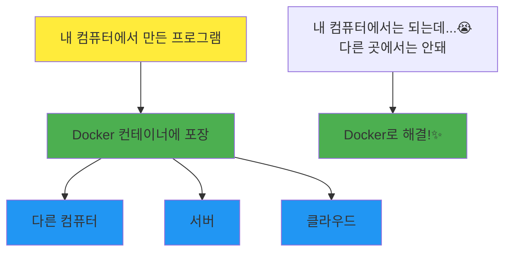
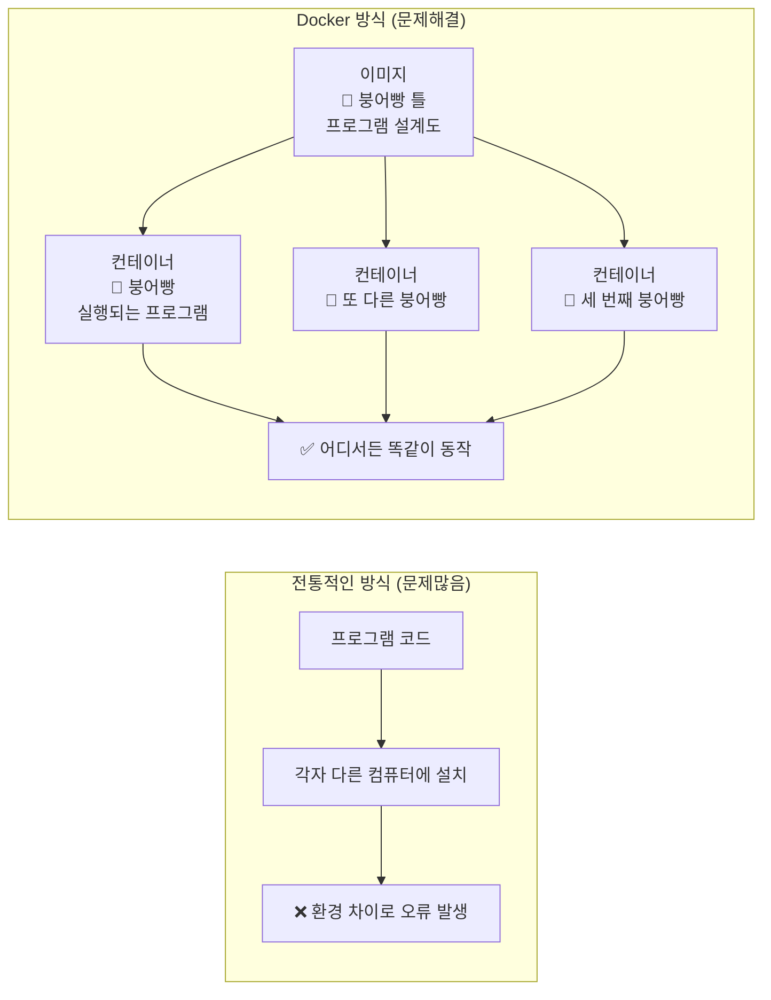
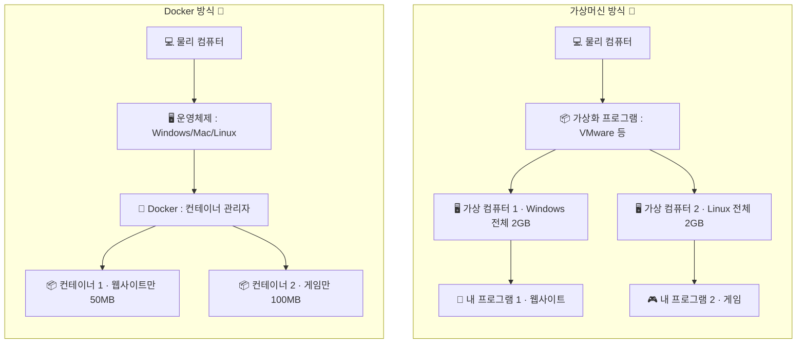
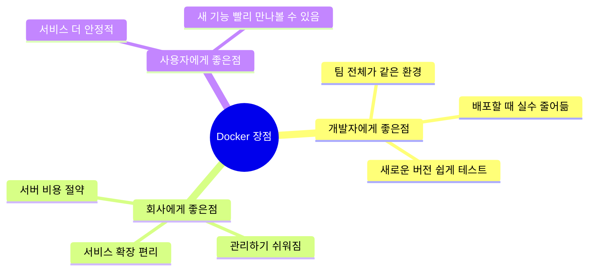
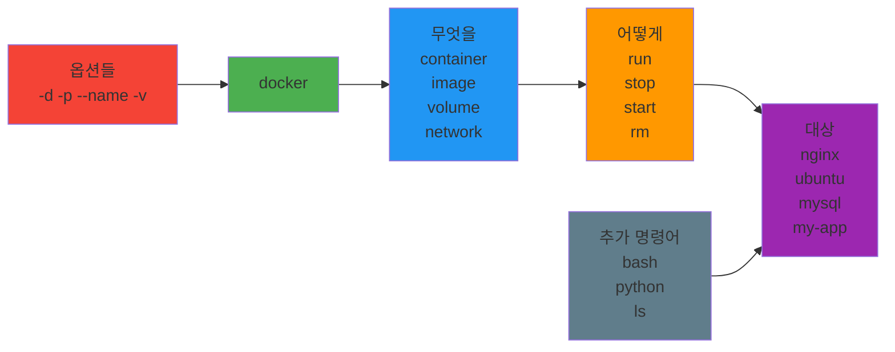
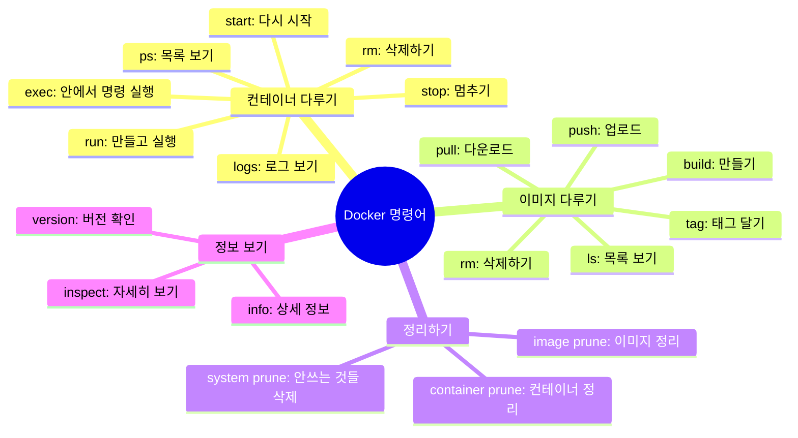
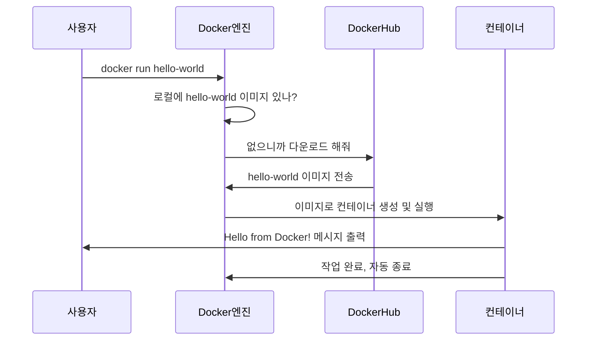
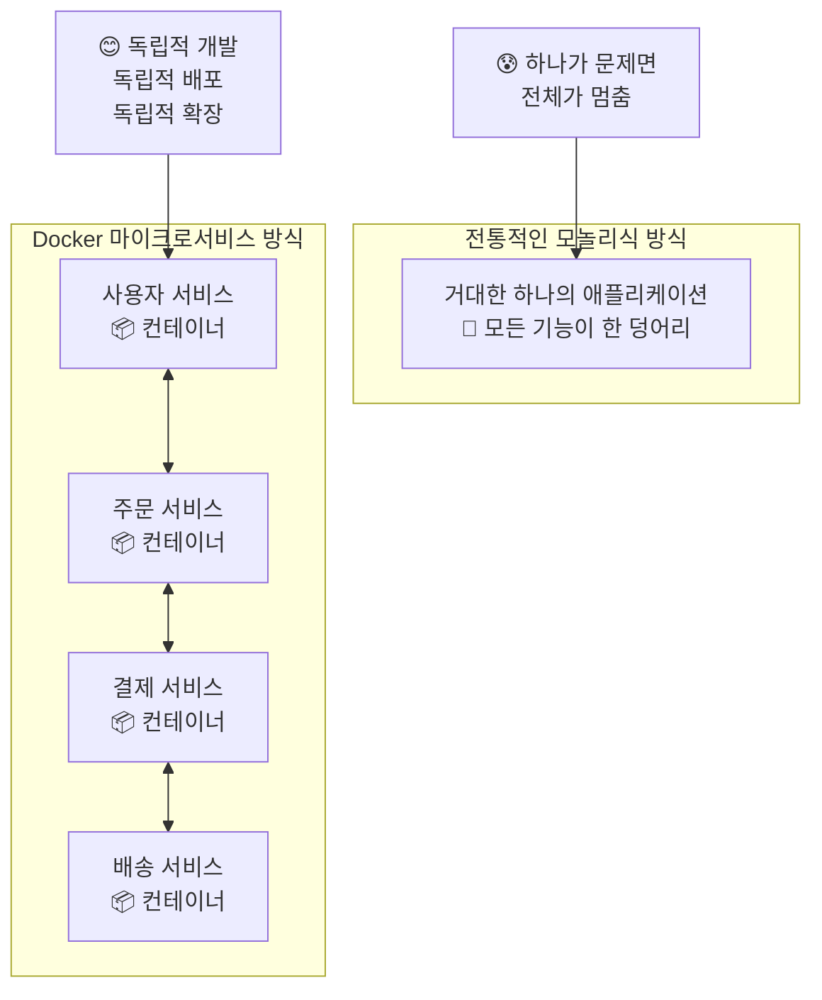
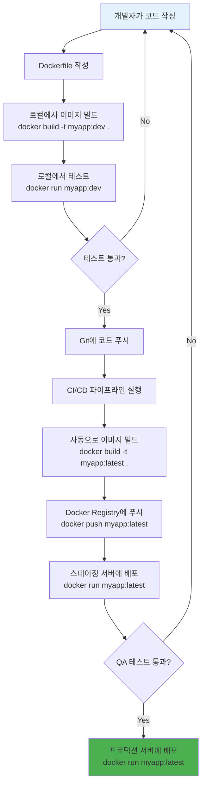

# Docker 완전정복 가이드 🐳


---

## 📚 목차
1. [Docker가 뭐야?](#1-docker가-뭐야)
2. [Docker 설치하기](#2-docker-설치하기)
3. [Docker 시작하고 끄기](#3-docker-시작하고-끄기)
4. [기본 사용법 배우기](#4-기본-사용법-배우기)
5. [실습으로 배우는 명령어](#5-실습으로-배우는-명령어)
6. [현업에서 이렇게 써요](#6-현업에서-이렇게-써요)

---

## 1. Docker가 뭐야? 🤔

### 쉽게 말하면 뭘까?

**Docker**는 **프로그램을 상자(컨테이너)에 넣어서 어디든 옮겨 실행할 수 있게 해주는 도구**입니다.



### 붕어빵으로 이해하기



**핵심 개념:**
- **이미지(Image)**: 붕어빵 틀 → 프로그램을 만들기 위한 설계도
- **컨테이너(Container)**: 붕어빵 → 실제로 실행되는 프로그램

### Docker vs 가상머신 (쉬운 비교)



| **구분** | **Docker** | **가상머신** |
|---------|-----------|-------------|
| **크기** | 가벼움 (MB 단위) | 무거움 (GB 단위) |
| **속도** | 빠름 (몇 초) | 느림 (몇 분) |
| **비유** | 도시락 🍱 | 집 통째로 이사 🏠 |

### Docker가 왜 좋을까?



---

## 2. Docker 설치하기 ⚙️

### Docker는 어떻게 생겼을까?


### 컴퓨터별 설치 방법

#### Windows에서 설치하기 🪟

```bash
# 내 컴퓨터가 Docker를 쓸 수 있는지 확인하기

# 1. Windows 버전 확인 (설정 > 시스템 > 정보)
# - Windows 10 Pro/Enterprise/Education (Build 16299 이상)
# - Windows 10 Home (Build 2004 이상, WSL2 필요)
# - Windows 11 (모든 버전 OK)

# 2. 컴퓨터 성능 확인
# - 64비트 컴퓨터인지 확인
# - 메모리 4GB 이상
# - CPU가 가상화를 지원하는지 확인

# 3. Docker Desktop 다운로드 및 설치
# https://www.docker.com/products/docker-desktop
# 다운로드 → 설치 → 재부팅 → 완료!
```

#### Mac에서 설치하기 🍎

```bash
# Mac 확인사항

# 1. macOS 버전 확인 (왼쪽 위 🍎 > 이 Mac에 관하여)
# - macOS 10.13 (High Sierra) 이상
# - 2010년 이후 출시된 Mac

# 2. 메모리 확인
# - 4GB 이상 필요

# 3. Docker Desktop 설치
# https://www.docker.com/products/docker-desktop
# Mac용 다운로드 → 설치 → 완료!
```

#### Linux에서 설치하기 🐧

```bash
# Ubuntu에서 Docker 설치하기 (가장 많이 사용)

# 1. 시스템 업데이트
sudo apt update
# 설명: 우분투의 패키지 목록을 최신으로 업데이트

# 2. 필요한 도구들 설치
sudo apt install curl
# 설명: 인터넷에서 파일을 다운로드하는 도구

# 3. Docker 설치 스크립트 실행
curl -fsSL https://get.docker.com -o get-docker.sh
sudo sh get-docker.sh
# 설명: Docker 공식 설치 스크립트를 다운로드하고 실행

# 4. 사용자를 docker 그룹에 추가 (sudo 없이 사용하기 위해)
sudo usermod -aG docker $USER
# 설명: 현재 사용자($USER)를 docker 그룹에 추가
# 로그아웃 후 다시 로그인해야 적용됨

# 5. Docker 버전 확인
docker --version
# 출력 예시: Docker version 24.0.6, build ed223bc
```

---

## 3. Docker 시작하고 끄기 🚀

### Windows에서 Docker 조작하기 🪟

```bash
# === 마우스로 하기 (GUI) ===

# Docker 시작하기:
# 바탕화면에서 "Docker Desktop" 아이콘 더블클릭
# 또는 시작메뉴에서 "Docker Desktop" 검색해서 실행

# Docker 끄기:
# 화면 오른쪽 아래 작업표시줄에서 고래🐋 모양 아이콘 찾기
# 고래 아이콘 오른쪽 클릭 → "Quit Docker Desktop" 선택

# === 명령어로 하기 (CLI) ===
# Win + R 키 → cmd 입력 → 엔터

# Docker가 실행중인지 확인
docker --version
# 정상 출력: Docker version 24.0.6, build ed223bc
# 오류 발생: Docker Desktop이 실행되지 않음

# Docker 상태 확인
docker info
# Docker가 실행중이면 상세 정보가 나옴
# 실행중이 아니면 오류 메시지

# 간단한 테스트
docker run hello-world
# Docker가 정상이면 환영 메시지가 나옴
```

### Mac에서 Docker 조작하기 🍎

```bash
# === 마우스로 하기 (GUI) ===

# Docker 시작하기:
# Finder → 응용 프로그램 → Docker Desktop 더블클릭
# 또는 Spotlight(Cmd + Space) → "Docker" 검색 → 실행

# Docker 끄기:
# 화면 위쪽 메뉴바에서 고래🐋 아이콘 찾기
# 고래 아이콘 클릭 → "Quit Docker Desktop" 선택

# === 터미널로 하기 (CLI) ===
# Cmd + Space → "Terminal" 검색 → 실행

# Docker 버전 확인
docker --version

# Docker 상태 확인  
docker info

# Docker Desktop이 실행중인지 확인
ps aux | grep Docker
# Docker 관련 프로세스가 보이면 실행중
```

### Linux에서 Docker 조작하기 🐧

```bash
# === Docker 서비스 시작/중지 ===

# Docker 시작하기
sudo systemctl start docker
# 설명: Docker 데몬(백그라운드 프로그램)을 시작

# Docker 상태 확인
sudo systemctl status docker
# 출력에서 "active (running)" 이면 실행중
# "inactive (dead)" 이면 중지상태

# Docker 중지하기
sudo systemctl stop docker
# 설명: Docker 데몬을 안전하게 중지

# Docker 재시작하기
sudo systemctl restart docker
# 설명: Docker를 완전히 중지했다가 다시 시작

# === 자동 실행 설정 ===

# 컴퓨터 켜질 때 Docker 자동 시작
sudo systemctl enable docker
# 설명: 부팅할 때마다 Docker가 자동으로 시작됨

# 자동 시작 해제
sudo systemctl disable docker
# 설명: 부팅 때 Docker가 자동 시작되지 않음

# === sudo 없이 사용하기 (권장) ===

# 현재 사용자를 docker 그룹에 추가
sudo usermod -aG docker $USER
# 설명: $USER는 현재 로그인한 사용자 이름

# 그룹 변경사항 즉시 적용 (임시)
newgrp docker

# 또는 완전한 적용을 위해 로그아웃 후 다시 로그인

# 권한이 제대로 설정됐는지 확인
docker run hello-world
# sudo 없이 실행되면 성공!
```

---

## 4. 기본 사용법 배우기 📝

### Docker 명령어 구조 이해하기



**실제 예시로 이해하기:**

```bash
docker container run --name my-web -d -p 8080:80 nginx
#  ↑       ↑      ↑      ↑       ↑  ↑     ↑     ↑
#  명령어   무엇을   어떻게   이름지정  백그라운드 포트연결 대상
#         (컨테이너)(실행)   (my-web)  실행     설정   (웹서버)

# 풀어서 설명하면:
# "nginx라는 웹서버 이미지로 컨테이너를 만들어서 실행하는데,
#  이름을 my-web으로 짓고, 백그라운드에서 돌리면서,
#  내 컴퓨터의 8080포트와 컨테이너의 80포트를 연결해줘"
```

### 자주 쓰는 옵션들 완전 정리

| **옵션** | **의미** | **예시** | **언제 써요?** |
|----------|----------|----------|---------------|
| `-d` | 뒤에서 실행 | `docker run -d nginx` | 웹서버처럼 계속 돌려야 할 때 |
| `--name` | 이름 짓기 | `--name my-web` | 나중에 찾기 쉽게 하려고 |
| `-p` | 포트 연결 | `-p 8080:80` | 웹사이트에 접속하려고 |
| `-v` | 폴더 공유 | `-v /내폴더:/컨테이너폴더` | 파일을 주고받으려고 |
| `-e` | 환경변수 | `-e PASSWORD=123` | 프로그램 설정 바꾸려고 |
| `-it` | 터미널 접속 | `-it ubuntu bash` | 컨테이너 안에서 직접 작업하려고 |
| `--rm` | 끝나면 삭제 | `--rm ubuntu` | 일회용으로 쓸 때 |

### Docker 명령어 카테고리



---

## 5. 실습으로 배우는 명령어 💻

### 첫 번째 실습: Hello World 🌟

```bash
# === Docker 첫 실행 ===

# 1. Docker가 제대로 설치됐는지 확인
docker --version
# 출력 예시: Docker version 24.0.6, build ed223bc
# 설명: 버전이 나오면 정상 설치됨

# 2. 첫 번째 컨테이너 실행하기  
docker run hello-world
# 설명: 
# - Docker Hub에서 hello-world 이미지를 자동으로 다운로드
# - 컨테이너를 만들어서 실행
# - 환영 메시지를 출력하고 자동으로 종료

# 출력 결과:
# Hello from Docker!
# This message shows that your installation appears to be working correctly.
```

**실행 과정 시각화:**



### 두 번째 실습: 웹서버 만들기 🌐

```bash
# === Apache 웹서버 컨테이너 만들기 ===

# 1. Apache 웹서버 컨테이너 생성 및 실행
docker run --name my-apache -d -p 8080:80 httpd
# 상세 설명:
# --name my-apache: 컨테이너 이름을 'my-apache'로 지정
# -d: 백그라운드에서 실행 (터미널이 블로킹되지 않음)
# -p 8080:80: 내 컴퓨터의 8080포트를 컨테이너의 80포트와 연결
# httpd: Apache HTTP Server 이미지 사용

# 2. 컨테이너가 잘 실행되는지 확인
docker ps
# 출력 예시:
# CONTAINER ID   IMAGE   COMMAND              CREATED         STATUS         PORTS                  NAMES
# a1b2c3d4e5f6   httpd   "httpd-foreground"   30 seconds ago  Up 30 seconds  0.0.0.0:8080->80/tcp   my-apache

# 3. 웹브라우저에서 확인하기
# 주소창에 입력: http://localhost:8080
# "It works!" 메시지가 나오면 성공! 🎉

# 4. 컨테이너 로그 확인 (웹서버 접속 기록 보기)
docker logs my-apache
# 설명: 웹서버의 접속 로그와 오류 로그를 볼 수 있음

# 5. 컨테이너 안에서 직접 작업하기
docker exec -it my-apache bash
# 설명: 실행 중인 컨테이너 안으로 들어가서 명령어 실행 가능
# 나가려면: exit 입력

# 6. 컨테이너 정리하기
docker stop my-apache     # 컨테이너 중지 (데이터는 보존됨)
docker start my-apache    # 다시 시작하기
docker rm my-apache       # 완전히 삭제 (먼저 stop 해야 함)
```

### 세 번째 실습: 리눅스 컨테이너 접속하기 🐧

```bash
# === Ubuntu Linux 컨테이너로 놀아보기 ===

# 1. Ubuntu 컨테이너를 터미널 모드로 실행
docker run -it --name my-ubuntu ubuntu bash
# 상세 설명:
# -i: 키보드 입력을 컨테이너로 전달
# -t: 터미널 환경 제공 (색깔, 특수키 등)
# --name my-ubuntu: 컨테이너 이름 지정
# ubuntu: Ubuntu Linux 이미지 사용
# bash: 컨테이너 시작할 때 bash 쉘 실행

# 2. 컨테이너 안에서 Linux 명령어 사용해보기
# (프롬프트가 root@컨테이너ID:/# 로 바뀜)

ls                        # 폴더 목록 보기
pwd                       # 현재 위치 확인 (/가 나올 거임)
whoami                    # 현재 사용자 확인 (root)
cat /etc/os-release      # Ubuntu 버전 정보 보기

# 3. 패키지 설치해보기
apt update               # 패키지 목록 업데이트
apt install -y curl     # curl 프로그램 설치 (-y는 모든 질문에 yes)
curl --version          # curl이 잘 설치됐는지 확인

# 4. 컨테이너에서 나가기
exit
# 설명: 컨테이너를 빠져나오면서 컨테이너도 자동으로 종료됨

# 5. 새 터미널에서 컨테이너 상태 확인
docker ps -a
# STATUS가 "Exited (0)"이면 정상 종료됨
```

### 네 번째 실습: 이미지 다운로드와 관리 📦

```bash
# === 이미지 관리 실습 ===

# 1. 이미지 검색하기 (Docker Hub에서)
docker search python
# 설명: Docker Hub에서 'python'이 포함된 이미지들을 검색
# OFFICIAL 컬럼이 OK인 것이 공식 이미지

# 2. 특정 버전의 이미지 다운로드
docker pull python:3.11
# 설명: Python 3.11 버전 이미지를 미리 다운로드
# 태그(:3.11)를 지정하지 않으면 자동으로 :latest가 붙음

# 3. 다운로드된 이미지 목록 확인
docker images
# 또는
docker image ls
# 출력 예시:
# REPOSITORY   TAG       IMAGE ID       CREATED        SIZE
# python       3.11      a1b2c3d4e5f6   2 weeks ago    998MB
# ubuntu       latest    b2c3d4e5f6a7   3 weeks ago    77.8MB

# 4. Python 컨테이너로 간단한 프로그래밍
docker run -it --rm python:3.11
# 설명: --rm 옵션으로 종료할 때 자동 삭제
# Python 인터프리터가 실행됨

# Python에서 실행해보기:
print("Hello, Docker!")
2 + 3
exit()  # Python에서 나가기 (컨테이너도 자동 종료)

# 5. 안 쓰는 이미지 삭제하기
docker image rm python:3.11
# 또는 짧게
docker rmi python:3.11
# 주의: 해당 이미지를 사용하는 컨테이너가 있으면 삭제 안됨
```

### 다섯 번째 실습: 나만의 이미지 만들기 🛠️

```bash
# === 커스텀 이미지 만들기 ===

# 1. Ubuntu 컨테이너에서 작업하기
docker run -it --name work-ubuntu ubuntu bash

# 컨테이너 안에서:
apt update                    # 패키지 목록 업데이트
apt install -y curl vim      # 유용한 도구들 설치
echo "Hello Docker!" > /hello.txt    # 파일 생성
exit                         # 컨테이너 종료

# 2. 수정된 컨테이너를 새로운 이미지로 저장
docker commit work-ubuntu my-custom-ubuntu:v1.0
# 설명: work-ubuntu 컨테이너의 현재 상태를 my-custom-ubuntu:v1.0 이미지로 저장

# 3. 새로 만든 이미지 확인
docker images
# my-custom-ubuntu 이미지가 목록에 나타남

# 4. 새 이미지로 컨테이너 실행해보기
docker run -it --rm my-custom-ubuntu:v1.0
# curl, vim이 이미 설치되어 있고, /hello.txt 파일도 존재함!

# 5. 정리하기
docker rm work-ubuntu                    # 작업용 컨테이너 삭제
docker rmi my-custom-ubuntu:v1.0        # 커스텀 이미지 삭제
```

### 실습 정리 및 유용한 명령어들 🧹

```bash
# === Docker 환경 정리하기 ===

# 1. 실행중인 모든 컨테이너 확인
docker ps

# 2. 모든 컨테이너 확인 (정지된 것 포함)
docker ps -a

# 3. 모든 컨테이너 한번에 정지
docker stop $(docker ps -q)
# 설명: $(docker ps -q)는 실행중인 컨테이너 ID들을 가져옴

# 4. 모든 정지된 컨테이너 삭제
docker container prune
# 주의: 복구 불가능! 정말 필요없는지 확인 후 실행

# 5. 안 쓰는 이미지 정리
docker image prune
# dangling 이미지들(태그가 없는 이미지)만 삭제

# 6. 모든 안쓰는 것들 한번에 정리 (주의!)
docker system prune
# 컨테이너, 네트워크, 이미지, 캐시 등 정리

# 7. 공간 사용량 확인
docker system df
# Docker가 사용하는 디스크 공간 확인
```

---

## 6. 현업에서 이렇게 써요 💼

### 실제 개발팀에서 Docker 사용 패턴 🏢

#### 1. 개발환경 통일하기

```bash
# === 팀 전체가 똑같은 개발환경 만들기 ===

# 문제상황: 
# - A개발자: "내 컴퓨터에서는 되는데?"
# - B개발자: "Node.js 버전이 달라서 안돼요"
# - C개발자: "Python 라이브러리 충돌나요"

# 해결방법: Docker로 표준 개발환경 제공

# Node.js 개발환경 컨테이너
docker run -it --name dev-node \
  -v $(pwd):/workspace \
  -p 3000:3000 \
  node:18 bash
# 설명:
# -v $(pwd):/workspace: 현재 폴더를 컨테이너의 /workspace와 연결
# -p 3000:3000: 개발서버 포트 연결
# 모든 팀원이 동일한 Node.js 18 환경에서 작업

# Python 데이터 분석 환경
docker run -it --name dev-python \
  -v $(pwd):/workspace \
  -p 8888:8888 \
  jupyter/scipy-notebook
# 설명: Jupyter Notebook + 과학계산 라이브러리가 미리 설치된 환경
```

#### 2. 다양한 데이터베이스 쉽게 테스트하기

```bash
# === 여러 데이터베이스를 동시에 띄우기 ===

# MySQL 데이터베이스 실행
docker run --name test-mysql \
  -e MYSQL_ROOT_PASSWORD=password123 \
  -e MYSQL_DATABASE=testdb \
  -p 3306:3306 \
  -d mysql:8.0
# 설명: 
# -e MYSQL_ROOT_PASSWORD: 관리자 비밀번호 설정
# -e MYSQL_DATABASE: 기본 데이터베이스 이름
# MySQL 서버가 백그라운드에서 실행됨

# PostgreSQL 데이터베이스 실행 (다른 포트로)
docker run --name test-postgres \
  -e POSTGRES_PASSWORD=password123 \
  -e POSTGRES_DB=testdb \
  -p 5432:5432 \
  -d postgres:15
# 설명: MySQL과 PostgreSQL을 동시에 테스트 가능

# Redis 캐시 서버 실행
docker run --name test-redis \
  -p 6379:6379 \
  -d redis:7
# 설명: 메모리 기반 캐시 서버

# 데이터베이스 접속 테스트
docker exec -it test-mysql mysql -uroot -ppassword123 testdb
# MySQL 컨테이너 안에서 직접 SQL 실행 가능
```

#### 3. 웹 개발 스택 구성하기

```bash
# === 프론트엔드 + 백엔드 + 데이터베이스 한번에 ===

# 1. React 개발서버 (프론트엔드)
docker run -d --name frontend \
  -v $(pwd)/frontend:/app \
  -w /app \
  -p 3000:3000 \
  node:18 \
  sh -c "npm install && npm start"
# 설명:
# -w /app: 작업 디렉토리 설정
# sh -c "commands": 여러 명령어를 순서대로 실행

# 2. Express API 서버 (백엔드)
docker run -d --name backend \
  -v $(pwd)/backend:/app \
  -w /app \
  -p 8000:8000 \
  node:18 \
  sh -c "npm install && npm start"

# 3. MongoDB 데이터베이스
docker run -d --name database \
  -p 27017:27017 \
  mongo:6
# 설명: 3개 서비스가 각각 다른 컨테이너에서 독립적으로 실행
```

#### 4. CI/CD 파이프라인에서 활용

```bash
# === 자동 테스트 및 배포 ===

# 테스트용 임시 환경 만들기
docker run --rm \
  -v $(pwd):/workspace \
  -w /workspace \
  node:18 \
  npm test
# 설명:
# --rm: 테스트 끝나면 자동으로 컨테이너 삭제
# 깨끗한 환경에서 매번 테스트 실행

# 프로덕션용 이미지 빌드 (Dockerfile 사용)
docker build -t myapp:latest .
# 설명: Dockerfile을 기반으로 배포용 이미지 생성

# 여러 환경에 배포
docker run -d --name myapp-prod -p 80:3000 myapp:latest      # 프로덕션
docker run -d --name myapp-staging -p 8080:3000 myapp:latest # 스테이징
# 설명: 같은 이미지로 여러 환경에 배포 가능
```

### Docker Compose로 여러 서비스 한번에 관리하기 🎼

실제 현업에서는 **Docker Compose**를 사용해서 여러 컨테이너를 한번에 관리합니다.

```yaml
# docker-compose.yml 파일 예시
version: '3.8'

services:
  # 웹서버
  web:
    image: nginx:latest
    ports:
      - "80:80"
    volumes:
      - ./html:/usr/share/nginx/html
    depends_on:
      - api

  # API 서버  
  api:
    image: node:18
    working_dir: /app
    volumes:
      - ./backend:/app
    command: npm start
    ports:
      - "3000:3000"
    environment:
      - DB_HOST=database
    depends_on:
      - database

  # 데이터베이스
  database:
    image: postgres:15
    environment:
      - POSTGRES_DB=myapp
      - POSTGRES_PASSWORD=secret123
    volumes:
      - db_data:/var/lib/postgresql/data
    ports:
      - "5432:5432"

volumes:
  db_data:
```

```bash
# === Docker Compose 사용법 ===

# 모든 서비스 한번에 시작
docker-compose up -d
# 설명: web, api, database 컨테이너가 모두 연결되어 실행됨

# 특정 서비스만 재시작
docker-compose restart api

# 로그 확인
docker-compose logs web
docker-compose logs -f api  # 실시간 로그

# 모든 서비스 종료 및 삭제
docker-compose down

# 볼륨까지 완전 삭제
docker-compose down -v
```

### 현업에서 자주 사용하는 Docker 패턴 🔄

#### 1. 마이크로서비스 아키텍처



```bash
# 각 서비스별로 독립된 컨테이너 실행
docker run -d --name user-service -p 3001:3000 user-service:latest
docker run -d --name order-service -p 3002:3000 order-service:latest
docker run -d --name payment-service -p 3003:3000 payment-service:latest
# 각 팀이 독립적으로 개발하고 배포 가능
```

#### 2. 개발/스테이징/프로덕션 환경 분리

```bash
# === 환경별 설정 관리 ===

# 개발환경 (로컬)
docker run -d --name myapp-dev \
  -e NODE_ENV=development \
  -e DB_HOST=localhost \
  -p 3000:3000 \
  myapp:dev

# 스테이징환경 (테스트용)  
docker run -d --name myapp-staging \
  -e NODE_ENV=staging \
  -e DB_HOST=staging-db.company.com \
  -p 8080:3000 \
  myapp:staging

# 프로덕션환경 (실제 서비스)
docker run -d --name myapp-prod \
  -e NODE_ENV=production \
  -e DB_HOST=prod-db.company.com \
  --restart=always \
  -p 80:3000 \
  myapp:latest
```

### 현업에서 사용하는 고급 Docker 기능 🚀

#### 1. 헬스체크로 서비스 상태 모니터링

```bash
# 헬스체크가 포함된 웹서버 실행
docker run -d --name monitored-web \
  --health-cmd="curl -f http://localhost/ || exit 1" \
  --health-interval=30s \
  --health-timeout=10s \
  --health-retries=3 \
  nginx

# 헬스체크 상태 확인
docker ps
# STATUS 컬럼에 'healthy' 또는 'unhealthy' 표시됨
```

#### 2. 리소스 제한으로 서버 안정성 확보

```bash
# CPU와 메모리 사용량 제한
docker run -d --name limited-app \
  --memory=512m \           # 메모리 512MB로 제한
  --cpus=0.5 \             # CPU 사용률 50%로 제한
  --restart=unless-stopped \
  myapp:latest

# 리소스 사용량 실시간 모니터링
docker stats limited-app
```

#### 3. 로그 관리 및 분석

```bash
# 로그 드라이버 설정으로 로그 관리
docker run -d --name logged-app \
  --log-driver=json-file \
  --log-opt max-size=10m \
  --log-opt max-file=3 \
  myapp:latest

# 로그 분석
docker logs --since="1h" logged-app        # 최근 1시간 로그
docker logs --tail=100 logged-app          # 마지막 100줄
docker logs -f logged-app                  # 실시간 로그
```

### 실무에서 꼭 알아야 할 Docker 보안 🔒

```bash
# === 보안 강화된 컨테이너 실행 ===

# 1. 루트 권한으로 실행하지 않기
docker run --user 1000:1000 \    # 일반 사용자로 실행
  --read-only \                   # 파일시스템 읽기전용
  --tmpfs /tmp \                  # 임시 디렉토리만 쓰기 가능
  myapp:latest

# 2. 불필요한 권한 제거
docker run --security-opt=no-new-privileges \  # 새로운 권한 획득 방지
  --cap-drop=ALL \                             # 모든 시스템 권한 제거
  --cap-add=NET_BIND_SERVICE \                 # 네트워크 바인딩만 허용
  myapp:latest

# 3. 네트워크 격리
docker network create --driver bridge isolated-net
docker run --network=isolated-net myapp:latest
# 다른 컨테이너와 네트워크 분리
```

### Docker 트러블슈팅 🔧

```bash
# === 자주 발생하는 문제와 해결법 ===

# 1. 포트가 이미 사용중일 때
docker run -p 8080:80 nginx
# Error: Port 8080 is already in use

# 해결: 다른 포트 사용하거나 기존 프로세스 종료
sudo netstat -tlnp | grep 8080    # 포트 사용 프로세스 찾기
docker run -p 8081:80 nginx       # 다른 포트 사용

# 2. 컨테이너가 바로 종료될 때
docker run ubuntu
# 컨테이너가 바로 Exited 상태가 됨

# 해결: 계속 실행될 명령어 지정
docker run -it ubuntu bash        # 터미널 모드
docker run -d ubuntu sleep infinity  # 무한 대기

# 3. 이미지 다운로드 실패
docker pull some-image:tag
# Error: pull access denied

# 해결: 올바른 이미지 이름 확인
docker search nginx               # 공식 이미지 검색
docker pull nginx:latest         # 공식 이미지 사용

# 4. 컨테이너 내부 파일 접근
docker run -d --name web nginx
# 웹서버 설정 파일을 수정하고 싶음

# 해결: 볼륨 마운트나 exec 사용
docker exec -it web bash         # 컨테이너 안으로 들어가기
docker cp ./nginx.conf web:/etc/nginx/  # 파일 복사

# 5. Docker 데몬 연결 오류
docker ps
# Error: Cannot connect to the Docker daemon

# 해결: Docker 서비스 시작
sudo systemctl start docker      # Linux
# 또는 Docker Desktop 실행        # Windows/Mac
```

### 성능 최적화 팁 ⚡

```bash
# === Docker 성능 향상 꿀팁 ===

# 1. 이미지 크기 줄이기
# 나쁜 예: 큰 베이스 이미지
FROM ubuntu:latest                # 78MB
RUN apt-get update && apt-get install -y python3

# 좋은 예: 최소한의 베이스 이미지
FROM python:3.11-alpine          # 45MB (Alpine Linux 사용)

# 2. 멀티 스테이지 빌드로 최종 이미지 크기 최소화
# Dockerfile 예시
FROM node:18 AS builder           # 빌드 전용 스테이지
WORKDIR /app
COPY package*.json ./
RUN npm install
COPY . .
RUN npm run build

FROM nginx:alpine                 # 실행 전용 스테이지 (훨씬 작음)
COPY --from=builder /app/build /usr/share/nginx/html

# 3. 빌드 캐시 활용
# 자주 바뀌지 않는 파일을 먼저 복사
COPY package*.json ./             # package.json 먼저
RUN npm install                   # 의존성 설치 (캐시됨)
COPY . .                         # 소스코드는 나중에
```

### 현업 Docker 워크플로우 🔄



이렇게 Docker를 현업에서 활용하면:
- 🚀 **배포 속도 향상**: 몇 분 만에 새 버전 배포
- 🔄 **롤백 쉬움**: 문제 시 이전 버전으로 즉시 되돌리기  
- 📈 **확장성**: 트래픽 증가 시 컨테이너 개수만 늘리면 됨
- 🛡️ **안정성**: 각 서비스가 독립적이라 장애 전파 방지
- 💰 **비용 절약**: 서버 리소스 효율적 사용

Docker는 단순한 도구가 아니라 현대적인 소프트웨어 개발과 운영의 필수 요소가 되었어요! 🎉
