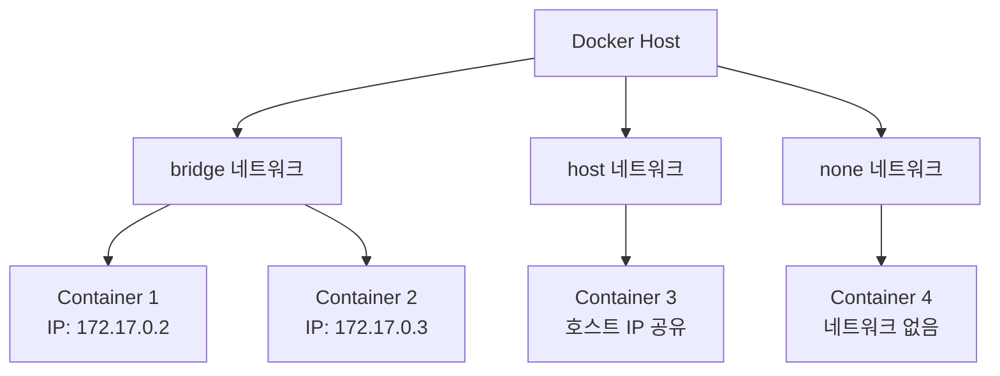
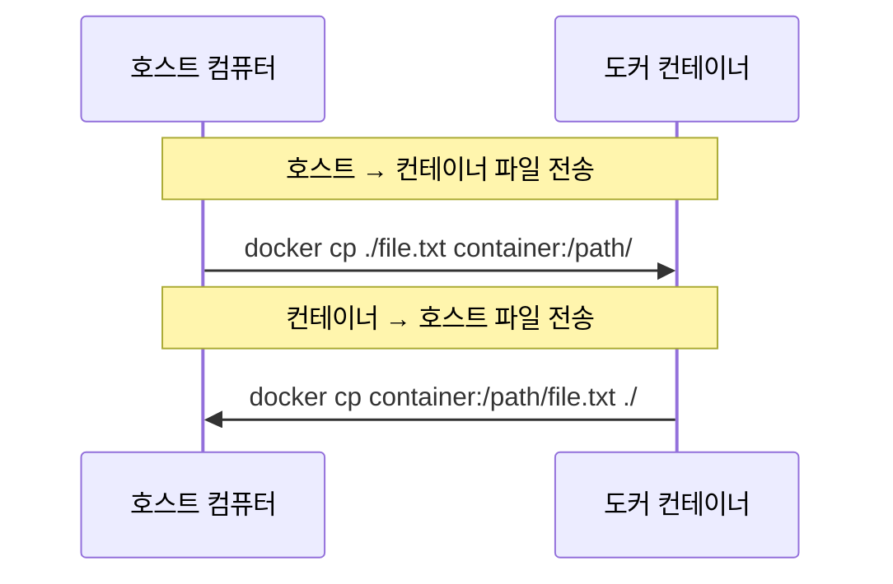
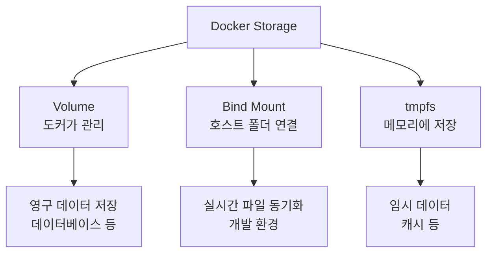

# Docker 컨테이너 네트워크 & 스토리지 완전정복 🐳

## 목차
1. [도커 컨테이너 네트워크](#1-도커-컨테이너-네트워크)
2. [파일 전송하기](#2-파일-전송하기)
3. [도커 스토리지](#3-도커-스토리지)
4. [컨테이너 통신](#4-컨테이너-통신)
5. [다양한 컨테이너 실습](#5-다양한-컨테이너-실습)
6. [이미지 삭제](#6-이미지-삭제)

---

## 1. 도커 컨테이너 네트워크 🌐

### 1.1 네트워크 드라이버 종류

Docker는 컨테이너가 서로 통신하고 외부와 연결될 수 있도록 여러 종류의 네트워크 드라이버를 제공합니다.



#### 네트워크 드라이버 비교표

| 드라이버 | 특징 | 사용 시기 | 명령어 |
|---------|------|----------|---------|
| **bridge** | 기본 설정, 각 컨테이너마다 독립적인 IP | 일반적인 웹서비스 | `--network bridge` |
| **host** | 호스트와 IP 공유, 빠른 통신 | 고성능이 필요한 경우 | `--network host` |
| **none** | 네트워크 연결 차단 | 보안이 중요한 작업 | `--network none` |

### 1.2 네트워크 확인 실습

```bash
# 현재 도커 네트워크 목록 확인
docker network ls
# NETWORK ID     NAME      DRIVER    SCOPE
# 873f91cabb01   bridge    bridge    local  ← 기본 네트워크
# 7d7f3eba8dc7   host      host      local  ← 호스트와 같은 네트워크
# 16791ef442d1   none      null      local  ← 네트워크 없음
```

```bash
# bridge 네트워크로 컨테이너 실행 (기본값)
docker container run -it --network=bridge ubuntu:latest

# 컨테이너 내부에서 IP 확인
ifconfig
# eth0: inet 172.17.0.2 ← 컨테이너 전용 IP 할당
```

```bash
# host 네트워크로 컨테이너 실행 (호스트 IP 공유)
docker container run -it --network=host ubuntu:latest

# 컨테이너 내부에서 IP 확인 (호스트와 동일한 IP)
ifconfig
```

```bash
# none 네트워크로 컨테이너 실행 (네트워크 없음)
docker container run -it --network=none ubuntu:latest

# 컨테이너 내부에서 IP 확인 (네트워크 인터페이스 없음)
ifconfig
```

> **💡 현업 팁**: 대부분의 웹 애플리케이션은 **bridge** 네트워크를 사용합니다. **host** 네트워크는 모니터링 도구나 네트워크 성능이 중요한 애플리케이션에서 사용해요.

---

## 2. 파일 전송하기 📁

컨테이너와 호스트 간에 파일을 주고받는 방법을 알아봅시다.



### 2.1 호스트 → 컨테이너 파일 전송

```bash
# 1. 호스트에서 테스트 파일 생성
mkdir -p work/ch03/ex01          # 디렉토리 생성 (-p: 상위 디렉토리도 함께 생성)
cd work/ch03/ex01                # 생성한 디렉토리로 이동
echo "Hello Docker!" > test01.txt   # 테스트 파일 생성

# 2. 우분투 컨테이너 실행
docker container run -it ubuntu:latest
# (컨테이너 내부) root@컨테이너ID:/# 

# 3. 다른 터미널에서 파일 전송
docker container ls              # 실행 중인 컨테이너 ID 확인
# CONTAINER ID   IMAGE     COMMAND       CREATED          STATUS
# 02eb5eec8c0f   ubuntu    "/bin/bash"   1 minute ago     Up 1 minute

# 파일 복사 (호스트 → 컨테이너)
docker container cp ./test01.txt 02eb5eec8c0f:/home/
# Successfully copied 2.05kB to 02eb5eec8c0f:/home/

# 4. 컨테이너에서 확인
# (컨테이너 내부)
cd /home                         # home 디렉토리로 이동
ls                              # 파일 목록 확인
cat test01.txt                  # 파일 내용 확인
# Hello Docker!
```

### 2.2 컨테이너 → 호스트 파일 전송

```bash
# 1. 컨테이너에서 새 파일 생성
# (컨테이너 내부)
cp test01.txt test02.txt        # 파일 복사
date >> test02.txt              # 현재 날짜 추가
cat test02.txt                  # 내용 확인
# Hello Docker!
# Mon Sep  8 10:01:55 UTC 2025

# 2. 호스트로 파일 전송
# (호스트에서)
docker cp 02eb5eec8c0f:/home/test02.txt ./
# Successfully copied 2.05kB to /home/user/work/ch03/ex01

ls                              # 파일이 복사되었는지 확인
cat test02.txt                  # 내용 확인
```

> **💡 현업 팁**: `docker cp` 명령어는 주로 **로그 파일 수집**이나 **설정 파일 수정** 시 사용됩니다. 하지만 실제 서비스에서는 Volume을 사용하는 것이 더 효율적이에요.

---

## 3. 도커 스토리지 💾

컨테이너를 삭제해도 데이터가 사라지지 않도록 저장하는 방법들입니다.



### 3.1 Volume 사용법 (추천⭐)

Volume은 Docker가 관리하는 저장 공간으로, 가장 안전하고 효율적입니다.

```bash
# 1. 볼륨 생성
docker volume create myvolume01
# myvolume01

# 2. 볼륨 목록 확인
docker volume ls
# DRIVER    VOLUME NAME
# local     myvolume01

# 3. PostgreSQL 컨테이너에 볼륨 연결
docker container run \
  -e POSTGRES_PASSWORD=mypassword \
  --mount type=volume,source=myvolume01,target=/var/lib/postgresql/data \
  -d postgres
# 또는 간단한 문법: -v myvolume01:/var/lib/postgresql/data

# 4. 데이터베이스에 데이터 생성
docker container exec -it 컨테이너ID /bin/bash
psql -U postgres                # PostgreSQL 접속
CREATE USER user01 PASSWORD '1234' SUPERUSER;  # 사용자 생성
\du                             # 사용자 목록 확인
\q                              # 종료

# 5. 컨테이너 삭제 후 새 컨테이너로 데이터 확인
docker container stop 컨테이너ID
docker container rm 컨테이너ID

# 같은 볼륨으로 새 컨테이너 생성
docker container run \
  -e POSTGRES_PASSWORD=mypassword \
  -v myvolume01:/var/lib/postgresql/data \
  -d postgres

# 데이터가 유지되는지 확인
docker exec -it 새컨테이너ID /bin/bash
psql -U postgres
\du                             # 이전에 생성한 user01이 그대로 있음!
```

### 3.2 Bind Mount 사용법

호스트의 실제 폴더와 컨테이너 폴더를 연결하여 실시간으로 동기화됩니다.

```bash
# 1. 호스트에서 작업 디렉토리 준비
cd /home/user/work/ch03/ex01
pwd                             # 현재 경로 확인
ls                              # 파일 목록: test01.txt, test02.txt

# 2. Bind Mount로 컨테이너 실행
docker container run \
  -e POSTGRES_PASSWORD=mypassword \
  --mount type=bind,source=/home/user/work/ch03/ex01,target=/work \
  -d postgres

# 3. 컨테이너에서 호스트 파일 확인
docker container exec -it 컨테이너ID /bin/bash
cd /work                        # 마운트된 디렉토리로 이동
ls                              # 호스트의 파일들이 보임: test01.txt, test02.txt

# 4. 컨테이너에서 파일 생성
mkdir container_folder          # 새 폴더 생성
echo "From Container" > new_file.txt

# 5. 호스트에서 즉시 확인 가능
# (다른 터미널에서)
ls                              # container_folder와 new_file.txt가 즉시 생성됨!
```

### 3.3 tmpfs Mount 사용법

메모리에만 저장되므로 컨테이너가 종료되면 데이터가 사라집니다.

```bash
# tmpfs로 컨테이너 실행 (임시 저장용)
docker container run \
  -e POSTGRES_PASSWORD=mypassword \
  --mount type=tmpfs,destination=/var/lib/postgresql/data \
  -d postgres

# 컨테이너 확인
docker inspect 컨테이너ID --format '{{.Mounts}}'
# Type: tmpfs가 표시됨

# 컨테이너 종료 시 모든 데이터 삭제됨
docker container stop 컨테이너ID
```

### 스토리지 방식 비교표

| 방식 | 장점 | 단점 | 사용 사례 |
|------|------|------|----------|
| **Volume** | 안전, Docker가 관리, 백업 가능 | 직접 접근 어려움 | 데이터베이스, 영구 데이터 |
| **Bind Mount** | 실시간 동기화, 직접 접근 | 호스트 경로 의존적 | 개발 환경, 설정 파일 |
| **tmpfs** | 빠른 속도, 보안 | 휘발성 데이터 | 캐시, 임시 파일 |

> **💡 현업 팁**: 
> - **데이터베이스**: Volume 사용 (99% 이상)
> - **개발 환경**: Bind Mount 사용 (소스코드 실시간 반영)
> - **캐시/세션**: tmpfs 사용 (보안과 성능)

---

## 4. 컨테이너 통신 🌍

외부에서 컨테이너 안의 서비스에 접근하려면 포트를 연결해야 합니다.


### 4.1 포트 포워딩 개념

```bash
# 포트 연결 문법
docker run -p 호스트포트:컨테이너포트 이미지명

# 예시: 호스트의 8080포트 → 컨테이너의 80포트
docker run -p 8080:80 httpd
```

### 4.2 Apache 웹서버 실습

```bash
# 1. Apache 컨테이너 실행
docker container run \
  --name apa000ex2 \    # 컨테이너 이름 지정
  -d \                  # 백그라운드 실행
  -p 80:80 \           # 포트 연결: 호스트80 → 컨테이너80
  httpd                # Apache 이미지

# 2. 실행 확인
docker container ls
# CONTAINER ID   IMAGE     COMMAND              CREATED          STATUS          PORTS                NAMES
# abc123def456   httpd     "httpd-foreground"   30 seconds ago   Up 29 seconds   0.0.0.0:80->80/tcp   apa000ex2

# 3. 웹 브라우저에서 접속 확인
# http://localhost:80 또는 http://127.0.0.1:80
# "It works!" 메시지가 보이면 성공!

# 4. 정리
docker container stop apa000ex2     # 컨테이너 중지
docker container rm apa000ex2       # 컨테이너 삭제
```

> **💡 현업 팁**: 실제 서비스에서는 **80번 포트 대신 8080, 9000** 등 다른 포트를 사용하는 경우가 많습니다. 보안과 다른 서비스와의 충돌을 피하기 위해서죠.

---

## 5. 다양한 컨테이너 실습 🚀

현업에서 자주 사용하는 컨테이너들을 직접 실행해봅시다.

### 5.1 여러 개의 웹서버 동시 실행

```bash
# Apache 컨테이너 3개 실행 (포트를 다르게 설정)
docker container run --name apa000ex3 -d -p 8081:80 httpd
docker container run --name apa000ex4 -d -p 8082:80 httpd  
docker container run --name apa000ex5 -d -p 8083:80 httpd

# 실행 확인
docker container ls
# 3개의 컨테이너가 서로 다른 포트로 실행 중

# 각각 웹 브라우저로 접속 가능
# http://localhost:8081
# http://localhost:8082  
# http://localhost:8083
```

### 5.2 Nginx 웹서버 실행

```bash
# Nginx 컨테이너 실행
docker container run \
  --name nginx000ex6 \  # 컨테이너 이름
  -d \                  # 백그라운드 실행
  -p 8081:80 \         # 포트 연결
  nginx                # Nginx 이미지

# 웹 브라우저에서 확인: http://localhost:8081
# "Welcome to nginx!" 메시지 확인

# 정리
docker container stop nginx000ex6
docker container rm nginx000ex6
```

### 5.3 MySQL 데이터베이스 실행

```bash
# MySQL 컨테이너 실행
docker run \
  --name mysql000ex7 \              # 컨테이너 이름
  -d \                              # 백그라운드 실행
  -p 3306:3306 \                   # MySQL 기본 포트
  -e MYSQL_ROOT_PASSWORD=myrootpass \ # 루트 비밀번호 설정
  mysql:8.0                         # MySQL 8.0 버전

# MySQL 접속
docker exec -it mysql000ex7 bash    # 컨테이너 내부 진입
mysql -u root -p                     # MySQL 클라이언트 실행
# 비밀번호 입력: myrootpass

# SQL 명령어 실행
SELECT VERSION();                    # MySQL 버전 확인
SHOW DATABASES;                      # 데이터베이스 목록 조회

# 새 데이터베이스 생성
CREATE DATABASE testdb;
USE testdb;

# 테이블 생성 및 데이터 삽입
CREATE TABLE users (
  id INT AUTO_INCREMENT PRIMARY KEY,
  name VARCHAR(50),
  age INT
);

INSERT INTO users (name, age) VALUES ('Kim', 30), ('Lee', 25);
SELECT * FROM users;

# 종료
exit;                               # MySQL 클라이언트 종료
exit                                # 컨테이너 bash 종료
```

### 현업에서 자주 사용하는 컨테이너들

| 용도 | 이미지 | 포트 | 주요 용도 |
|------|--------|------|----------|
| **웹서버** | nginx, httpd | 80, 8080 | 정적 파일 서빙, 로드밸런싱 |
| **데이터베이스** | mysql, postgres | 3306, 5432 | 데이터 저장 및 관리 |
| **캐시** | redis | 6379 | 세션 저장, 캐싱 |
| **메시지 큐** | rabbitmq | 5672 | 비동기 작업 처리 |
| **모니터링** | grafana | 3000 | 시스템 모니터링 |

---

## 6. 이미지 삭제 🗑️

사용하지 않는 이미지를 정리하여 디스크 공간을 절약합시다.

```bash
# 1. 현재 실행 중인 컨테이너 확인
docker container ls
# 실행 중인 컨테이너가 있다면 먼저 중지하고 삭제

# 실행 중인 컨테이너 모두 중지
docker container stop $(docker container ls -q)

# 모든 컨테이너 삭제
docker container rm $(docker container ls -aq)

# 2. 이미지 목록 확인
docker image ls
# REPOSITORY   TAG       IMAGE ID       CREATED        SIZE
# httpd        latest    abc123def456   2 weeks ago    145MB
# nginx        latest    def456ghi789   3 weeks ago    133MB
# mysql        8.0       ghi789jkl012   1 month ago    544MB

# 3. 개별 이미지 삭제
docker image rm httpd                   # httpd 이미지 삭제
docker image rm nginx mysql            # 여러 이미지 한 번에 삭제

# 4. 태그가 있는 이미지 삭제
docker image rm mysql:8.0              # 특정 버전 삭제
docker image rm ghi789jkl012           # 이미지 ID로 삭제

# 5. 사용하지 않는 이미지 일괄 삭제
docker image prune                      # 태그 없는 이미지 삭제
docker image prune -a                   # 사용하지 않는 모든 이미지 삭제

# 6. 시스템 전체 정리 (주의!)
docker system prune                     # 사용하지 않는 모든 리소스 삭제
docker system prune -a --volumes       # 볼륨까지 모두 삭제
```

### 이미지 관리 명령어 정리

| 명령어 | 용도 | 예시 |
|--------|------|------|
| `docker image ls` | 이미지 목록 조회 | `docker image ls` |
| `docker image rm` | 이미지 삭제 | `docker image rm nginx` |
| `docker image prune` | 불필요한 이미지 정리 | `docker image prune -a` |
| `docker system prune` | 전체 시스템 정리 | `docker system prune` |

> **⚠️ 주의사항**: `docker system prune -a --volumes` 명령어는 **모든 데이터를 삭제**하므로 매우 조심해서 사용하세요!

---

## 마무리 정리 📝

### 현업에서 가장 많이 사용하는 기능들

1. **Volume 마운트** - 데이터베이스 데이터 보관
2. **포트 포워딩** - 웹 서비스 외부 접근
3. **환경변수 설정** - 설정값 주입 (`-e` 옵션)
4. **Bridge 네트워크** - 컨테이너 간 통신
5. **이미지 관리** - 정기적인 정리로 용량 관리

### 실무 꿀팁 💡

- **개발환경**: Bind Mount로 소스코드 실시간 반영
- **운영환경**: Volume으로 데이터 안전하게 보관
- **포트 번호**: 8080, 9000 등 표준 포트 피하기
- **컨테이너 이름**: 프로젝트명 + 서비스명으로 명명
- **정기 정리**: `docker system prune` 으로 용량 관리

이제 Docker 네트워크와 스토리지를 자유자재로 다룰 수 있을 거예요! 🎉
