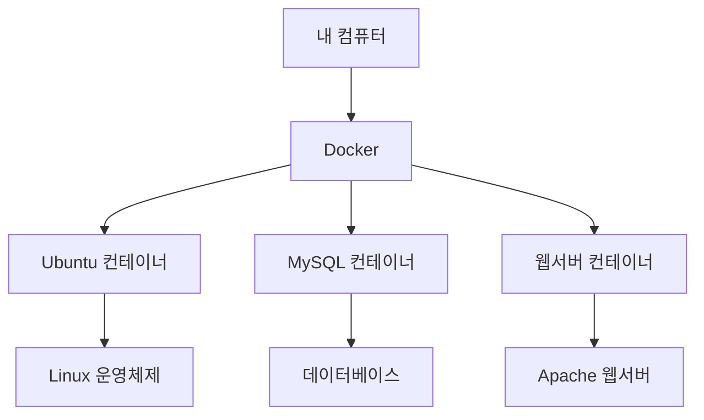
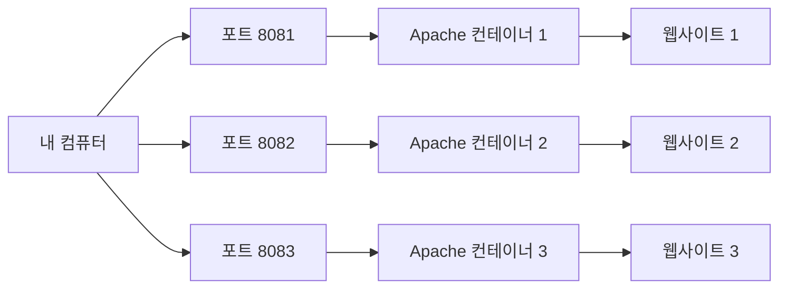
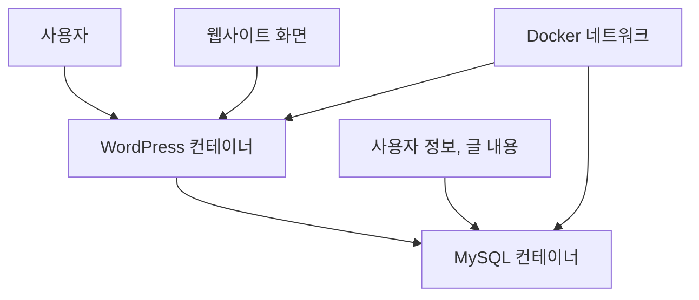
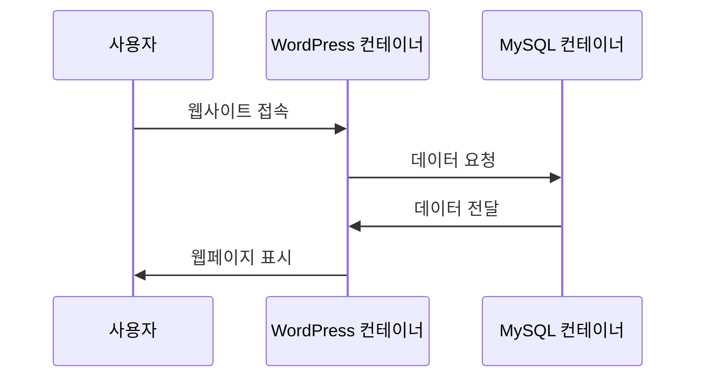
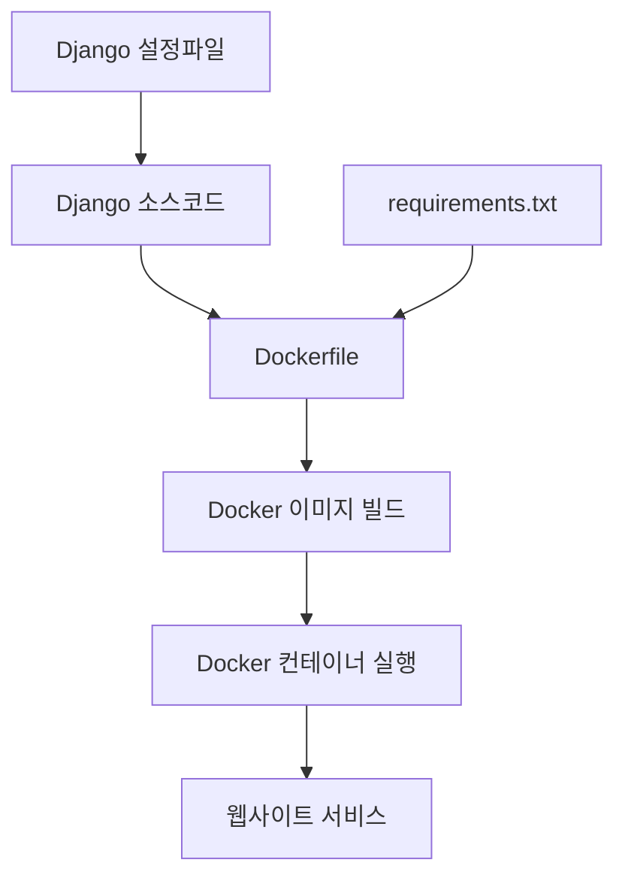
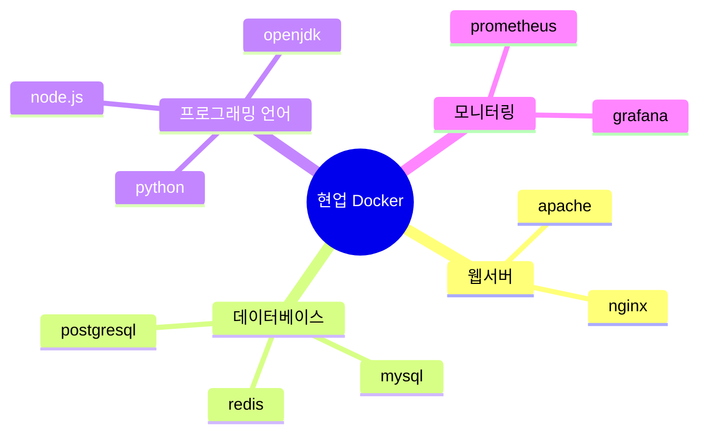

# Docker 완전 정복 가이드 📚
*컨테이너 기술로 개발 환경을 더 쉽게 만들어보자!*

## 📖 목차
1. [컨테이너 생성 기초](#1-컨테이너-생성-기초)
2. [컨테이너 연동 (네트워크)](#2-컨테이너-연동-네트워크)
3. [Django + Docker 실전 프로젝트](#3-django--docker-실전-프로젝트)
4. [현업에서 주로 사용하는 것들](#4-현업에서-주로-사용하는-것들)

---

## 1. 컨테이너 생성 기초

### 🤔 Docker가 뭔가요?
Docker는 **"가상의 컴퓨터"**를 만들어주는 도구입니다. 
- 실제 컴퓨터 안에 여러 개의 작은 컴퓨터를 만들 수 있어요
- 각각의 작은 컴퓨터에 다른 프로그램을 설치해서 사용할 수 있어요
- 이 작은 컴퓨터를 **"컨테이너"**라고 부릅니다



### 📦 다양한 종류의 컨테이너

#### 1) 운영체제 컨테이너
컴퓨터의 기본 시스템이 들어있는 컨테이너들

| 이미지 이름 | 설명 | 사용법 |
|-------------|------|--------|
| ubuntu | 우분투 리눅스 | 명령어 입력용 |
| centos | CentOS 리눅스 | 명령어 입력용 |
| alpine | 가벼운 리눅스 | 크기가 작아서 빠름 |

```bash
# Ubuntu 컨테이너 실행하기
docker container run -it ubuntu /bin/bash
# ↑ -it: 명령어를 직접 입력할 수 있게 해주는 옵션
# ↑ /bin/bash: 리눅스 명령어를 입력할 수 있는 화면 실행
```

#### 2) 웹서버/데이터베이스 컨테이너
웹사이트나 데이터를 저장하는 프로그램이 들어있는 컨테이너들

| 이미지 이름 | 설명 | 주요 용도 |
|-------------|------|-----------|
| httpd | Apache 웹서버 | 웹사이트 운영 |
| nginx | Nginx 웹서버 | 빠른 웹서버 |
| mysql | MySQL 데이터베이스 | 데이터 저장 |

```bash
# Apache 웹서버 실행하기
docker container run --name my-web -d -p 8080:80 httpd
# ↑ --name my-web: 컨테이너에 이름 붙이기
# ↑ -d: 백그라운드에서 실행 (화면에 안 보이게)
# ↑ -p 8080:80: 내 컴퓨터 8080번을 컨테이너 80번에 연결
```

### 🏗️ 실습: 여러 웹서버 동시에 실행하기



**1단계: 컨테이너 3개 만들기**
```bash
# 첫 번째 웹서버 (포트 8081)
docker container run --name apa000ex3 -d -p 8081:80 httpd

# 두 번째 웹서버 (포트 8082) 
docker container run --name apa000ex4 -d -p 8082:80 httpd

# 세 번째 웹서버 (포트 8083)
docker container run --name apa000ex5 -d -p 8083:80 httpd
```

**2단계: 잘 실행되는지 확인하기**
```bash
# 실행 중인 컨테이너 목록 보기
docker container ls
```

**3단계: 웹브라우저에서 접속하기**
- http://localhost:8081 
- http://localhost:8082
- http://localhost:8083

**4단계: 정리하기 (사용 완료 후)**
```bash
# 컨테이너 중지하기
docker container stop apa000ex3 apa000ex4 apa000ex5

# 컨테이너 삭제하기
docker container rm apa000ex3 apa000ex4 apa000ex5
```

### 🗄️ MySQL 데이터베이스 실습

```bash
# MySQL 컨테이너 실행
docker run --name mysql-test \
  -d -p 3306:3306 \
  -e MYSQL_ROOT_PASSWORD=mypassword \
  mysql:8.0
# ↑ -e: 환경변수 설정 (MySQL 관리자 비밀번호)

# 컨테이너 안으로 들어가기
docker exec -it mysql-test bash
# ↑ exec: 실행 중인 컨테이너에 명령어 실행
# ↑ -it: 직접 명령어 입력 가능
# ↑ bash: 리눅스 명령어 입력 화면

# MySQL에 접속하기 (컨테이너 안에서)
mysql -u root -p
# 비밀번호 입력: mypassword

# 간단한 데이터베이스 작업
SHOW DATABASES;           # 데이터베이스 목록 보기
CREATE DATABASE testdb;   # 새 데이터베이스 만들기
USE testdb;              # 데이터베이스 선택하기
```

---

## 2. 컨테이너 연동 (네트워크)

### 🌐 왜 컨테이너를 연결해야 하나요?
실제 웹사이트는 여러 부분으로 나뉩니다:
- **웹서버**: 사용자가 보는 화면
- **데이터베이스**: 정보를 저장하는 곳

이 둘이 서로 대화할 수 있어야 웹사이트가 제대로 작동합니다!



### 🔗 WordPress + MySQL 연동 실습

**1단계: 네트워크 만들기**
```bash
# 컨테이너들이 대화할 수 있는 네트워크 생성
docker network create wordpressnet01
# ↑ 가상의 인터넷망 만들기
```

**2단계: MySQL 데이터베이스 컨테이너 실행**
```bash
docker container run --name mysqlex01 -dit \
  --net=wordpressnet01 \
  -e MYSQL_ROOT_PASSWORD=myrootpass \
  -e MYSQL_DATABASE=wordpressdb \
  -e MYSQL_USER=wordpresskim \
  -e MYSQL_PASSWORD=wkimpass \
  mysql \
  --character-set-server=utf8mb4 \
  --collation-server=utf8mb4_unicode_ci
```

각 줄의 의미:
- `--name mysqlex01`: 컨테이너 이름
- `--net=wordpressnet01`: 만든 네트워크에 연결
- `-e MYSQL_DATABASE=wordpressdb`: WordPress용 데이터베이스 생성
- `-e MYSQL_USER=wordpresskim`: WordPress가 사용할 계정 생성
- `--character-set-server=utf8mb4`: 한글 지원

**3단계: WordPress 컨테이너 실행**
```bash
docker run --name wordpressex01 -dit \
  --net=wordpressnet01 \
  -p 80:80 \
  -e WORDPRESS_DB_HOST=mysqlex01 \
  -e WORDPRESS_DB_NAME=wordpressdb \
  -e WORDPRESS_DB_USER=wordpresskim \
  -e WORDPRESS_DB_PASSWORD=wkimpass \
  wordpress
```

각 줄의 의미:
- `-p 80:80`: 웹사이트를 80번 포트로 열기
- `-e WORDPRESS_DB_HOST=mysqlex01`: MySQL 컨테이너와 연결
- 나머지는 MySQL과 같은 정보로 설정

**4단계: 웹사이트 확인**
- http://localhost 접속
- WordPress 설치 화면이 나타납니다!



---

## 3. Django + Docker 실전 프로젝트

### 🐍 Django란?
Python으로 만든 웹사이트 개발 도구입니다. 
- Instagram, YouTube도 Django로 만들어졌어요!
- 빠르고 안전한 웹사이트를 만들 수 있습니다

### 🛠️ 개발 환경 준비

**1단계: Python 가상환경 만들기**
```bash
# pyenv 설치 (Python 버전 관리 도구)
curl https://pyenv.run | bash

# Python 3.11.9 설치
pyenv install 3.11.9
pyenv global 3.11.9

# 가상환경 생성 (프로젝트별로 독립된 환경)
pyenv virtualenv 3.11.9 py3_11_9
pyenv activate py3_11_9  # 가상환경 활성화
```

**2단계: 필요한 라이브러리 설치**
```bash
# Django 및 관련 도구들 설치
pip install django gunicorn psycopg2-binary
# ↑ django: 웹 개발 프레임워크
# ↑ gunicorn: 웹서버 (실제 서비스용)
# ↑ psycopg2-binary: PostgreSQL 연결용
```

### 🏗️ Django 프로젝트 생성

**1단계: 새 프로젝트 만들기**
```bash
# myapp이라는 Django 프로젝트 생성
django-admin startproject myapp
cd myapp

# 프로젝트 구조 확인
tree ./
```

**2단계: 설정 파일 수정**
```python
# myapp/settings.py 파일 수정
ALLOWED_HOSTS = ['*']  # 모든 접속 허용
# ↑ 외부에서 접속할 수 있게 하는 설정
```

**3단계: 데이터베이스 초기화**
```bash
# Django가 사용할 기본 테이블들 생성
python manage.py migrate
```

**4단계: 개발 서버 실행**
```bash
# 개발용 서버 시작
python manage.py runserver 0.0.0.0:8000
# ↑ 0.0.0.0: 모든 IP에서 접속 가능
# ↑ 8000: 사용할 포트 번호
```

### 🐳 Django를 Docker로 만들기



**1단계: requirements.txt 파일 만들기**
```bash
# 프로젝트에서 사용하는 라이브러리 목록
echo "django==4.2.7" > requirements.txt
```

**2단계: Dockerfile 작성**
```dockerfile
# Python 3.11.9를 기반으로 이미지 만들기
FROM python:3.11.9

# 컨테이너 안에서 작업할 폴더 설정
WORKDIR /usr/src/app

# 라이브러리 목록 파일을 먼저 복사 (빌드 최적화)
COPY requirements.txt .

# pip 업그레이드하고 필요한 라이브러리 설치
RUN python -m pip install --upgrade pip \
    && pip install -r requirements.txt

# 나머지 프로젝트 파일들 복사
COPY . .

# Django 프로젝트 폴더로 이동
WORKDIR /usr/src/app/myapp

# 8000번 포트 사용한다고 알려주기
EXPOSE 8000

# 컨테이너 실행할 때 Django 서버 시작
CMD ["python", "manage.py", "runserver", "0.0.0.0:8000"]
```

**3단계: Docker 이미지 만들기**
```bash
# Dockerfile을 읽어서 myweb01이라는 이미지 생성
docker image build . -t myweb01
# ↑ .: 현재 폴더의 Dockerfile 사용
# ↑ -t myweb01: 이미지 이름을 myweb01로 설정
```

**4단계: 컨테이너로 실행하기**
```bash
# 만든 이미지로 컨테이너 실행
docker container run -d -p 8000:8000 myweb01
# ↑ -d: 백그라운드에서 실행
# ↑ -p 8000:8000: 내 컴퓨터 8000번을 컨테이너 8000번에 연결
```

**5단계: 웹사이트 확인**
- http://localhost:8000 접속
- Django 기본 페이지가 나타납니다!

### 📝 YAML 파일 이해하기

YAML은 설정 파일을 쉽게 읽고 쓸 수 있게 해주는 형식입니다.

```yaml
# yaml_practice.yml 예시
kind: Pod                    # 종류: Pod
metadata:                    # 정보
  name: nginx               # 이름: nginx
spec:                       # 상세 설정
  containers:               # 컨테이너 목록
    - name: nginx           # 첫 번째 컨테이너
      image: nginx:latest   # 사용할 이미지
    - name: ubuntu          # 두 번째 컨테이너  
      image: ubuntu:latest  # 사용할 이미지
```

**YAML 규칙:**
- `:` 다음에는 반드시 공백
- 들여쓰기로 구조 표현 (스페이스 사용)
- `-`로 시작하면 목록의 항목

---

## 4. 현업에서 주로 사용하는 것들

### 🏢 실제 회사에서는...

#### 자주 사용하는 이미지들


| 용도 | 현업 선호 이미지 | 이유 |
|------|------------------|------|
| 웹서버 | **nginx** > apache | 더 빠르고 적은 메모리 사용 |
| 데이터베이스 | **postgresql** > mysql | 더 안정적이고 기능이 많음 |
| 캐시 | **redis** | 매우 빠른 임시 데이터 저장 |
| 메시지 큐 | **rabbitmq** | 대용량 데이터 처리 |

#### 현업 Docker 사용 패턴

**1) 멀티 스테이지 빌드**
```dockerfile
# 빌드 단계
FROM node:16 AS builder
COPY . .
RUN npm install && npm run build

# 실행 단계 (용량 최소화)
FROM nginx:alpine
COPY --from=builder /app/dist /usr/share/nginx/html
```

**2) Docker Compose 사용**
```yaml
# docker-compose.yml - 여러 컨테이너 관리
version: '3.8'
services:
  web:
    image: nginx
    ports:
      - "80:80"
  db:
    image: postgres
    environment:
      POSTGRES_PASSWORD: secret
```

**3) 환경별 설정 분리**
```bash
# 개발환경
docker-compose -f docker-compose.dev.yml up

# 운영환경  
docker-compose -f docker-compose.prod.yml up
```

#### 보안 모범 사례

```dockerfile
# ❌ 나쁜 예
FROM ubuntu
RUN apt-get update && apt-get install -y python3
USER root

# ✅ 좋은 예
FROM python:3.11-alpine    # 경량화된 이미지 사용
RUN adduser -D appuser     # 일반 사용자 생성
USER appuser               # root 권한 사용 안함
COPY --chown=appuser . .   # 파일 소유권 설정
```

#### 모니터링과 로깅
```bash
# 컨테이너 리소스 사용량 모니터링
docker stats

# 로그 확인
docker logs -f container_name

# 헬스체크 추가
HEALTHCHECK --interval=30s --timeout=3s \
  CMD curl -f http://localhost:8000/ || exit 1
```

### 🎯 현업 팁

1. **이미지 태그 관리**
   ```bash
   # ❌ 피하기: latest 태그
   docker pull mysql:latest
   
   # ✅ 권장: 구체적인 버전
   docker pull mysql:8.0.35
   ```

2. **환경 변수로 설정 관리**
   ```bash
   # .env 파일 사용
   DB_PASSWORD=secret123
   API_KEY=abc123
   
   # docker-compose에서 활용
   docker-compose --env-file .env up
   ```

3. **멀티 아키텍처 지원**
   ```bash
   # ARM64, AMD64 모두 지원하는 이미지 빌드
   docker buildx build --platform linux/amd64,linux/arm64 -t myapp .
   ```

---

## 🎓 마무리

이제 Docker의 기본기부터 실전 활용까지 모두 배웠습니다!

### 📚 학습한 내용 요약
1. **컨테이너 기초**: 가상의 작은 컴퓨터 만들기
2. **네트워크 연동**: 컨테이너들이 서로 대화하게 하기
3. **Django 배포**: Python 웹 애플리케이션을 컨테이너로 만들기
4. **현업 노하우**: 실제 회사에서 사용하는 기법들

### 🚀 다음 단계
- **Kubernetes**: 많은 컨테이너를 자동으로 관리
- **CI/CD**: 코드 변경시 자동으로 배포
- **마이크로서비스**: 큰 시스템을 작은 서비스들로 나누기

Docker는 현대 개발의 필수 도구입니다. 
차근차근 연습하면서 실력을 늘려가세요! 🎉