# AWS 클라우드 완전 가이드 🚀

---

## 📖 목차
1. [클라우드가 뭔가요?](#1-클라우드가-뭔가요)
2. [클라우드의 장단점](#2-클라우드의-장단점)
3. [클라우드 서비스 종류](#3-클라우드-서비스-종류)
4. [AWS 기본 개념](#4-aws-기본-개념)
5. [현업에서 많이 쓰는 AWS 서비스](#5-현업에서-많이-쓰는-aws-서비스)
6. [클라우드 설계 패턴](#6-클라우드-설계-패턴)

---

## 1. 클라우드가 뭔가요? ☁️

### 🏠 집에 있는 컴퓨터 vs 클라우드 컴퓨터

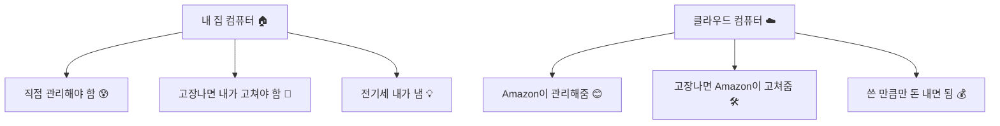

**쉽게 말하면:** 클라우드는 인터넷으로 컴퓨터를 빌려쓰는 것입니다!

### 📊 클라우드 vs 전통적인 방식 비교

| 구분 | 전통적인 방식 (온프레미스) | 클라우드 방식 |
|------|---------------------------|--------------|
| **컴퓨터 구입** | 직접 사야함 (비싸요! 💸) | 빌려쓰면 됨 (저렴! 💝) |
| **관리** | 내가 직접 해야함 😅 | Amazon이 대신 해줌 😎 |
| **확장** | 새 컴퓨터 사야함 🛒 | 클릭 한 번으로 OK ⚡ |
| **고장** | 내가 고쳐야함 🔧 | Amazon이 고쳐줌 🛠️ |

---

## 2. 클라우드의 장단점 ⚖️

### ✅ 장점 (좋은 점들)

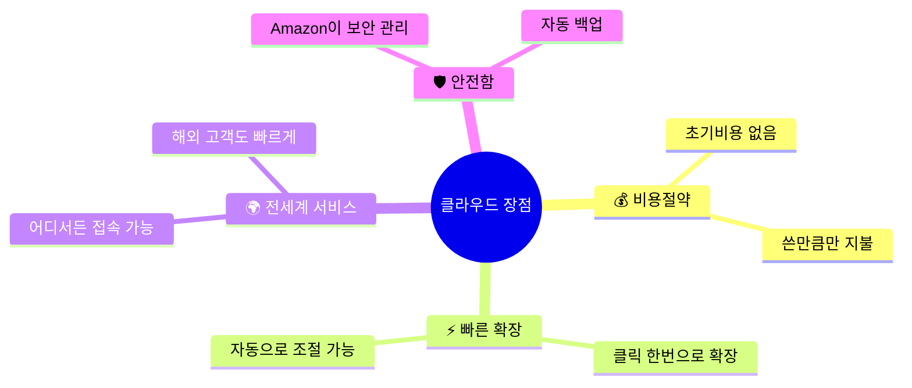

### ❌ 단점 (조심해야 할 점들)

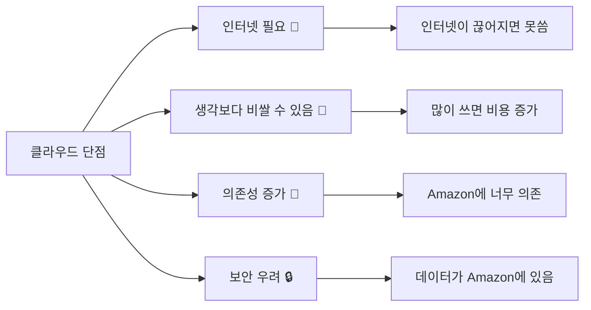

### 🚫 클라우드가 맞지 않는 경우

1. **인터넷이 자주 끊어지는 곳** 📡
2. **매우 빠른 반응이 필요한 게임** 🎮
3. **정부 기밀문서** 🔐
4. **매우 오래된 프로그램** 💾

---

## 3. 클라우드 서비스 종류 📦

### 🏢 건물로 비유해보자!

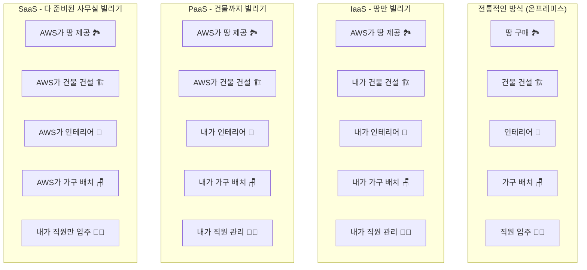

### 📋 서비스 모델 비교표

| 서비스 모델 | 내가 할 일 | AWS가 할 일 | 예시 |
|-------------|------------|-------------|------|
| **IaaS** | 많음 😅 | 적음 | EC2 (가상컴퓨터) |
| **PaaS** | 보통 😐 | 보통 | Elastic Beanstalk |
| **SaaS** | 적음 😊 | 많음 | Gmail, Netflix |

---

## 4. AWS 기본 개념 🌍

### 🗺️ AWS는 전세계에 컴퓨터를 두고 있어요!

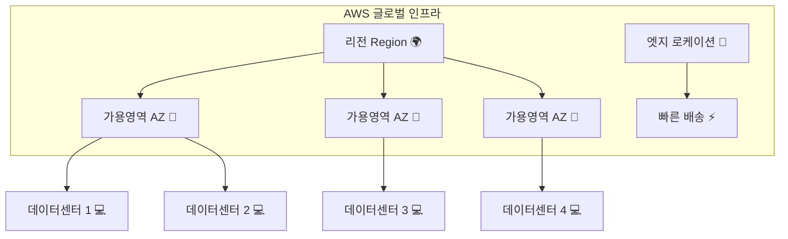

### 📍 AWS 용어 쉽게 이해하기

- **리전 (Region)** 🌍: 나라/대륙 단위 (예: 서울, 도쿄, 미국 서부)
- **가용영역 (AZ)** 🏢: 각 리전 안의 데이터센터 건물들
- **엣지 로케이션** 📡: 빠른 배송을 위한 중간 창고 같은 곳

```python
# 🎯 AWS 리전 선택 기준 (코드가 아니라 선택 기준이에요!)
def choose_aws_region():
    """
    AWS 리전을 선택할 때 고려사항
    """
    considerations = {
        "거리": "고객과 가까운 곳을 선택 (빠른 속도)",
        "법률": "데이터 보관 법률 확인",
        "서비스": "필요한 AWS 서비스가 있는지 확인",
        "비용": "리전마다 가격이 다름"
    }
    return considerations
```

---

## 5. 현업에서 많이 쓰는 AWS 서비스 💼

### 🔥 실제 회사에서 가장 많이 쓰는 AWS 서비스들

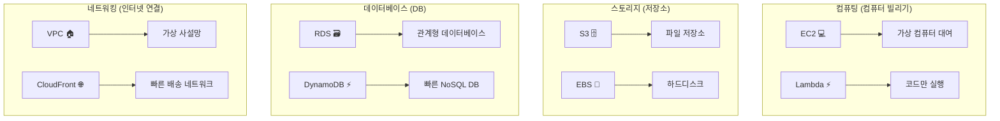

### 💼 현업 실사용 예시

```python
# 🏢 실제 회사에서 이렇게 사용해요!

class RealWorldAWSUsage:
    """
    현업에서 실제로 AWS를 이렇게 써요!
    """
    
    def startup_company(self):
        """
        스타트업 회사의 AWS 사용법
        """
        return {
            "EC2": "웹사이트 서버 운영 (처음에는 작은 서버로 시작)",
            "S3": "사용자가 올린 사진, 동영상 저장",
            "RDS": "회원정보, 게시글 정보 저장",
            "CloudFront": "전세계 사용자에게 빠른 서비스 제공"
        }
    
    def medium_company(self):
        """
        중간 규모 회사의 AWS 사용법
        """
        return {
            "Auto Scaling": "사용자 많아지면 서버 자동 증가",
            "Lambda": "밤에 자동으로 데이터 정리 작업",
            "CloudWatch": "서버 상태 24시간 모니터링",
            "IAM": "직원마다 다른 권한 부여"
        }
    
    def large_enterprise(self):
        """
        대기업의 AWS 사용법
        """
        return {
            "Multi-Region": "여러 나라에 서버 분산",
            "Disaster Recovery": "재해 대비 백업 시스템",
            "Machine Learning": "AI로 고객 분석",
            "Big Data": "수억 건의 데이터 분석"
        }
```

### 🎯 업종별 AWS 활용법

| 업종 | 주로 쓰는 AWS 서비스 | 실제 용도 |
|------|---------------------|-----------|
| **게임회사** 🎮 | EC2, Auto Scaling, DynamoDB | 게임서버, 사용자 급증 대응 |
| **쇼핑몰** 🛒 | S3, CloudFront, RDS | 상품사진 저장, 빠른 로딩 |
| **금융회사** 🏦 | VPC, KMS, CloudTrail | 보안 강화, 거래 기록 |
| **미디어** 📺 | S3, CloudFront, MediaConvert | 동영상 저장, 스트리밍 |

---

## 6. 클라우드 설계 패턴 🏗️

### 🔄 로드 밸런싱 패턴 (트래픽 분산)

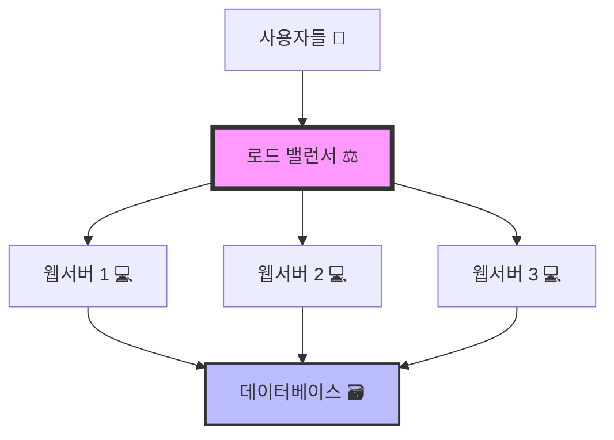

**🎯 이렇게 하면 좋은 점:**
- 한 서버가 고장나도 다른 서버가 대신함
- 사용자가 많아져도 빠르게 처리 가능
- 서버 한 대당 부담이 줄어듦

```python
# 📊 로드 밸런서의 역할 (의사코드)
def load_balancer():
    """
    로드 밸런서가 하는 일
    """
    servers = ["서버1", "서버2", "서버3"]  # 사용 가능한 서버들
    
    while True:
        user_request = get_user_request()  # 사용자 요청 받기
        
        # 가장 한가한 서버 찾기
        least_busy_server = find_least_busy_server(servers)
        
        # 해당 서버로 요청 전달
        send_request_to_server(user_request, least_busy_server)
        
        print(f"사용자 요청을 {least_busy_server}로 보냈어요! 📤")
```

### 📈 자동 확장/축소 패턴

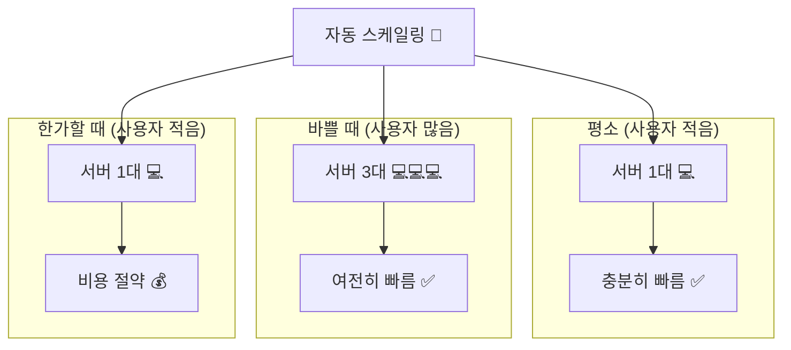

```python
# 🤖 자동 확장의 원리
def auto_scaling():
    """
    AWS Auto Scaling이 하는 일
    """
    cpu_usage = get_current_cpu_usage()  # 현재 CPU 사용률 확인
    
    if cpu_usage > 80:  # CPU 사용률이 80% 넘으면
        print("서버가 바빠요! 서버를 더 추가할게요! 🆙")
        add_new_server()  # 새 서버 추가
        
    elif cpu_usage < 20:  # CPU 사용률이 20% 미만이면
        print("서버가 한가해요! 서버를 줄여서 돈을 절약할게요! 💰")
        remove_server()  # 서버 제거
        
    else:
        print("서버 상태가 적당해요! 😊")
```

### 🗄️ 데이터베이스 복제 패턴

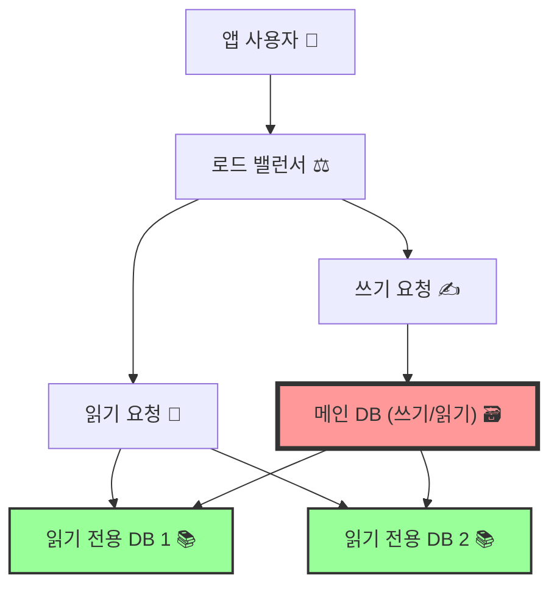

**🎯 이렇게 하는 이유:**
- 읽기 작업이 더 빨라짐
- 메인 DB가 고장나도 데이터를 잃지 않음
- 많은 사용자가 동시에 데이터를 볼 수 있음

### 🛡️ 보안 패턴 (방화벽)

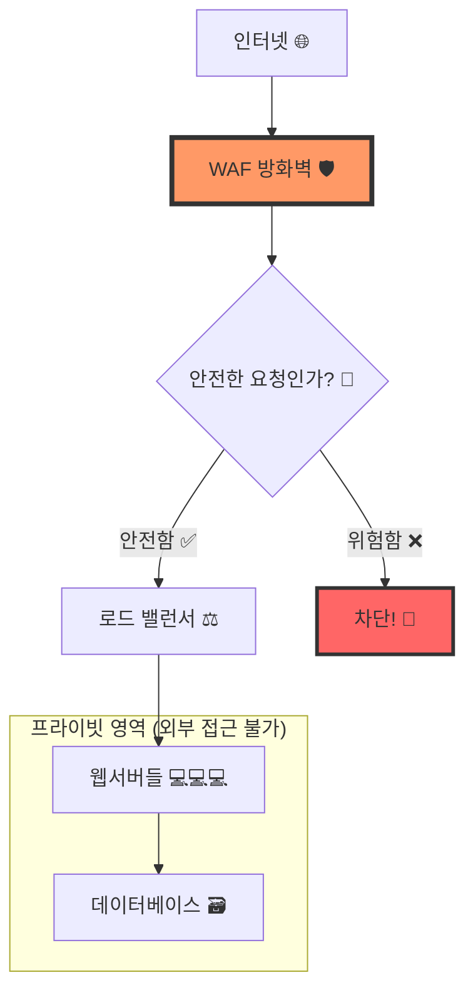

```python
# 🛡️ AWS 보안의 핵심 원칙
def aws_security_best_practices():
    """
    AWS 보안 모범 사례
    """
    security_rules = {
        "최소 권한 원칙": "꼭 필요한 권한만 부여하기",
        "다중 인증": "비밀번호 + 핸드폰 인증",
        "암호화": "중요한 데이터는 암호화해서 저장",
        "모니터링": "24시간 접속 기록 감시",
        "백업": "데이터를 여러 곳에 백업"
    }
    return security_rules

# 🔐 실제 보안 설정 예시
def setup_security():
    # 1. VPC로 가상 사설망 만들기
    create_vpc()  # 우리만의 인터넷 공간 생성
    
    # 2. 보안 그룹으로 방화벽 설정
    security_group = {
        "인바운드": "외부에서 들어오는 트래픽 규칙",
        "아웃바운드": "내부에서 나가는 트래픽 규칙"
    }
    
    # 3. IAM으로 사용자 권한 관리
    create_iam_users()  # 각 직원마다 다른 권한 부여
```

---

## 🚀 AWS 시작하기

### 1단계: AWS 계정 만들기

```python
# 📝 AWS 계정 만들 때 필요한 것들
account_requirements = {
    "이메일": "본인 이메일 주소",
    "비밀번호": "강력한 비밀번호 (대소문자, 숫자, 특수문자 포함)",
    "전화번호": "본인 인증용",
    "신용카드": "무료 한도 초과 시 과금용 (처음엔 공짜!)",
    "주소": "정확한 주소"
}
```

### 2단계: 무료 서비스 체험해보기

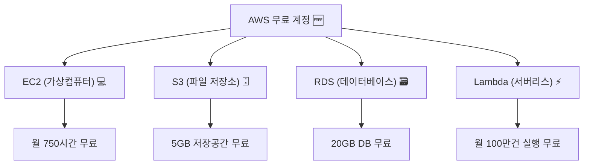

### 3단계: 비용 관리하기

```python
# 💰 AWS 비용 관리 꿀팁
def manage_aws_costs():
    """
    AWS 비용을 절약하는 방법들
    """
    cost_saving_tips = {
        "무료 한도 모니터링": "AWS Budgets으로 무료 한도 확인",
        "리소스 정리": "안 쓰는 서버나 저장소 삭제하기",
        "예약 인스턴스": "오래 쓸 서버는 미리 예약해서 할인받기",
        "스팟 인스턴스": "남는 서버 저렴하게 사용하기",
        "자동 스케일링": "필요할 때만 서버 증가시키기"
    }
    
    return cost_saving_tips

# 🚨 비용 알림 설정하기
def setup_billing_alerts():
    # 1. CloudWatch에서 비용 모니터링 설정
    print("월 사용료가 10달러 넘으면 이메일로 알려주세요! 📧")
    
    # 2. AWS Budgets으로 예산 설정
    print("이번 달 예산은 20달러로 설정했어요! 💰")
```

---

## 🎯 실전 프로젝트: 간단한 웹사이트 만들기

### 프로젝트 구조

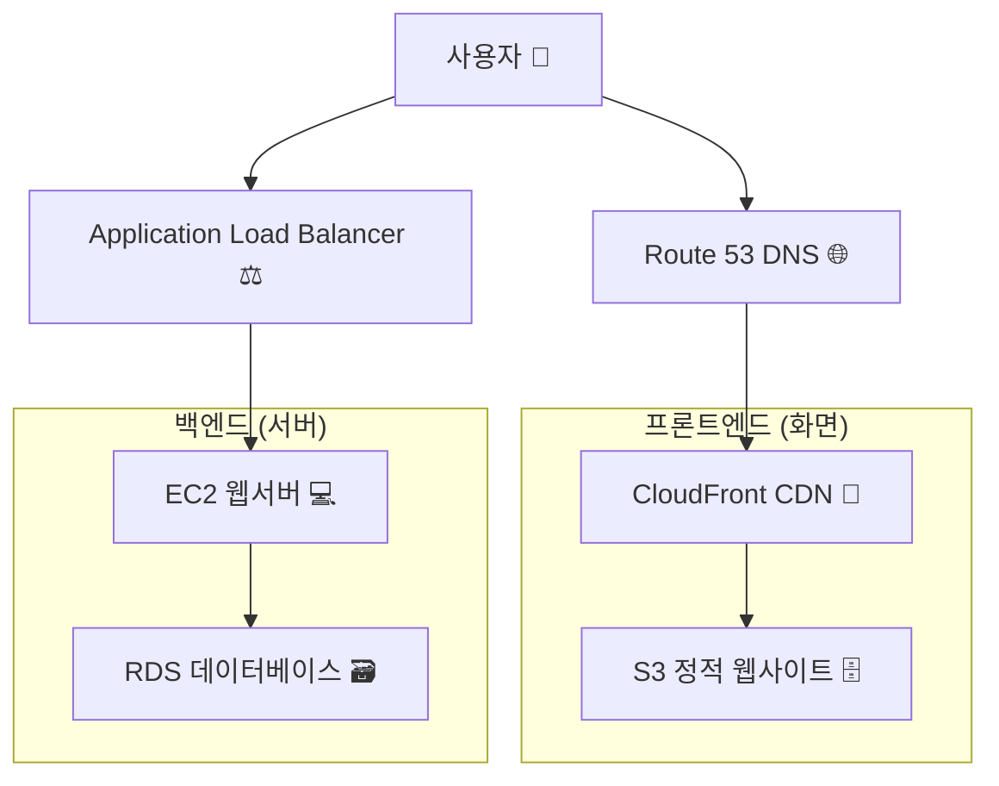

### 단계별 구축 과정

```python
# 🛠️ 웹사이트 구축 단계
def build_website_on_aws():
    """
    AWS에 웹사이트 만드는 단계별 가이드
    """
    
    step1 = {
        "제목": "1단계: 도메인 준비",
        "설명": "Route 53에서 도메인 구매 또는 연결",
        "예시": "mywebsite.com"
    }
    
    step2 = {
        "제목": "2단계: 웹서버 만들기",
        "설명": "EC2에서 Ubuntu 서버 생성",
        "코드": """
        # EC2 인스턴스 설정
        인스턴스 타입: t2.micro (무료)
        운영체제: Ubuntu 20.04
        보안그룹: HTTP(80), HTTPS(443) 열기
        """
    }
    
    step3 = {
        "제목": "3단계: 데이터베이스 설정",
        "설명": "RDS에서 MySQL 데이터베이스 생성",
        "코드": """
        # RDS 설정
        엔진: MySQL 8.0
        인스턴스 클래스: db.t2.micro (무료)
        스토리지: 20GB (무료 한도 내)
        """
    }
    
    step4 = {
        "제목": "4단계: 파일 저장소 설정",
        "설명": "S3에 이미지, CSS, JS 파일 저장",
        "코드": """
        # S3 버킷 설정
        버킷 이름: my-website-files
        퍼블릭 액세스: 웹사이트 파일만 공개
        """
    }
    
    return [step1, step2, step3, step4]
```

---

## 🔮 클라우드의 미래

### 📈 클라우드 시장 전망

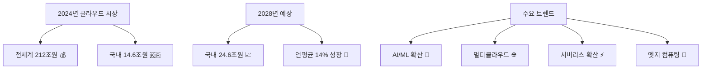

### 🎯 앞으로 주목해야 할 기술들

| 기술 | 설명 | AWS 서비스 |
|------|------|------------|
| **AI/ML** 🤖 | 인공지능, 머신러닝 | SageMaker, Bedrock |
| **서버리스** ⚡ | 서버 관리 없이 코드만 실행 | Lambda, Fargate |
| **컨테이너** 📦 | 앱을 패키지로 묶어서 배포 | ECS, EKS |
| **IoT** 🌐 | 사물인터넷 (스마트홈, 자율주행) | IoT Core |

---

## 📚 더 공부하고 싶다면?

### 🎓 AWS 자격증 로드맵

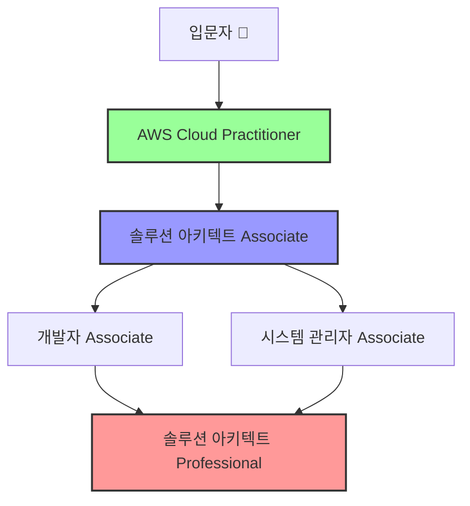

### 📖 추천 학습 리소스

1. **AWS 공식 문서** 📄
   - https://docs.aws.amazon.com/ko_kr/
   - 가장 정확하고 최신 정보

2. **AWS Training** 🎯
   - 무료 온라인 강의 제공
   - 실습 환경도 함께 제공

3. **AWS 무료 워크샵** 🛠️
   - 실제 프로젝트 체험 가능
   - 단계별 가이드 제공

---

## 🎉 마무리

### 🌟 핵심 포인트 정리

```python
# 🎯 AWS 클라우드 핵심 정리
def aws_summary():
    """
    이것만은 꼭 기억하세요!
    """
    key_points = {
        "클라우드란?": "인터넷으로 컴퓨터를 빌려쓰는 것",
        "AWS 장점": "비용절약, 빠른 확장, 전세계 서비스",
        "핵심 서비스": "EC2(컴퓨터), S3(저장소), RDS(데이터베이스)",
        "보안": "항상 최소 권한 원칙으로!",
        "비용관리": "무료 한도 체크하고 알림 설정하기"
    }
    
    return key_points

# 🚀 첫 시작 추천 순서
def getting_started_roadmap():
    """
    AWS를 처음 시작하는 사람들을 위한 로드맵
    """
    roadmap = {
        "1주차": {
            "목표": "AWS 계정 만들고 기본 개념 이해하기",
            "할일": [
                "AWS 무료 계정 생성 🆓",
                "AWS 관리 콘솔 둘러보기 👀",
                "EC2로 첫 번째 가상서버 만들어보기 💻",
                "비용 알림 설정하기 💰"
            ]
        },
        
        "2주차": {
            "목표": "스토리지와 데이터베이스 체험하기",
            "할일": [
                "S3에 파일 업로드해보기 📁",
                "RDS로 데이터베이스 만들어보기 🗃️",
                "간단한 웹페이지 S3에 호스팅해보기 🌐"
            ]
        },
        
        "3주차": {
            "목표": "네트워킹과 보안 이해하기",
            "할일": [
                "VPC로 가상 네트워크 만들어보기 🏠",
                "보안그룹으로 방화벽 설정하기 🛡️",
                "IAM으로 사용자 권한 관리하기 👥"
            ]
        },
        
        "4주차": {
            "목표": "실전 프로젝트 완성하기",
            "할일": [
                "로드밸런서 설정해보기 ⚖️",
                "Auto Scaling 설정해보기 📈",
                "CloudWatch로 모니터링 설정하기 📊",
                "간단한 3-tier 웹 애플리케이션 구축하기 🏗️"
            ]
        }
    }
    
    return roadmap
```

### 💡 실무 꿀팁 모음

```python
# 🍯 현업에서 쓰는 AWS 꿀팁들
def aws_pro_tips():
    """
    실제 현업에서 일하는 개발자들의 꿀팁
    """
    
    pro_tips = {
        "비용 절약 팁": {
            "예약 인스턴스": "1년 이상 쓸 서버는 미리 예약해서 최대 75% 할인",
            "스팟 인스턴스": "경매 방식으로 최대 90% 할인 (갑자기 꺼질 수 있음)",
            "스케줄링": "개발 서버는 밤에 자동으로 끄기",
            "태그 활용": "모든 리소스에 태그 달아서 비용 추적하기"
        },
        
        "보안 팁": {
            "MFA 필수": "루트 계정에는 반드시 다중 인증 설정",
            "키 로테이션": "액세스 키는 정기적으로 갱신하기",
            "CloudTrail": "모든 API 호출 기록 남기기",
            "최소 권한": "꼭 필요한 권한만 부여하기"
        },
        
        "성능 최적화 팁": {
            "CDN 활용": "정적 파일은 CloudFront로 빠르게 배송",
            "캐싱": "ElastiCache로 자주 쓰는 데이터 캐싱",
            "DB 최적화": "읽기 전용 복제본으로 읽기 성능 향상",
            "리전 선택": "사용자와 가까운 리전 선택"
        },
        
        "운영 팁": {
            "자동화": "반복 작업은 Lambda나 Systems Manager로 자동화",
            "모니터링": "CloudWatch 알람으로 이상 상황 즉시 감지",
            "백업": "자동 백업 설정으로 데이터 손실 방지",
            "인프라 코드": "Terraform이나 CloudFormation으로 인프라 코드화"
        }
    }
    
    return pro_tips

# 🚨 자주 하는 실수들 (이것만은 피하세요!)
def common_aws_mistakes():
    """
    AWS 초보자들이 자주 하는 실수들
    """
    
    mistakes = {
        "비용 관련 실수": [
            "무료 한도 모니터링 안하기 💸",
            "안 쓰는 리소스 삭제 안하기 🗑️",
            "NAT Gateway를 불필요하게 많이 만들기 💰",
            "데이터 전송 비용 간과하기 📡"
        ],
        
        "보안 관련 실수": [
            "루트 계정으로 모든 일 하기 🔓",
            "보안그룹을 0.0.0.0/0으로 열어두기 🌐",
            "액세스 키를 코드에 하드코딩하기 🔑",
            "S3 버킷을 실수로 퍼블릭으로 만들기 📂"
        ],
        
        "운영 관련 실수": [
            "백업 설정 안하기 💾",
            "모니터링 알람 설정 안하기 📊",
            "로그 수집 안하기 📝",
            "재해 복구 계획 세우지 않기 🆘"
        ]
    }
    
    return mistakes
```

### 🌍 글로벌 vs 국내 클라우드 비교

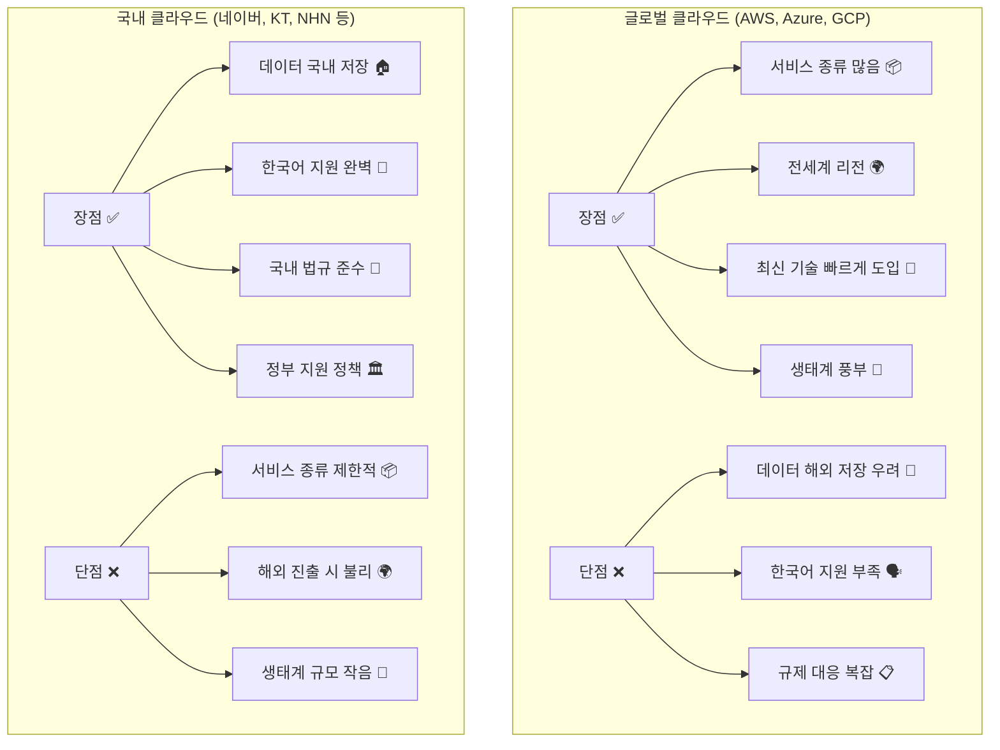

### 📊 업종별 AWS 도입 현황

```python
# 📈 한국 기업들의 AWS 도입 현황
def korea_aws_adoption():
    """
    한국 기업들이 어떻게 AWS를 도입하고 있는지
    """
    
    adoption_by_industry = {
        "금융업": {
            "도입률": "92%",
            "주요 사례": ["토스뱅크", "KB국민은행", "신한은행"],
            "주요 용도": [
                "비계정계 시스템 (고객 상담, 마케팅)",
                "AI 챗봇 서비스",
                "마이데이터 분석",
                "재해복구 시스템"
            ],
            "특징": "보안과 규제 준수가 최우선"
        },
        
        "게임업": {
            "도입률": "95%+",
            "주요 사례": ["넥슨", "엔씨소프트", "넷마블"],
            "주요 용도": [
                "게임 서버 운영",
                "사용자 급증 시 자동 확장",
                "글로벌 서비스",
                "빅데이터 분석"
            ],
            "특징": "트래픽 변동이 크고 글로벌 서비스 필요"
        },
        
        "이커머스": {
            "도입률": "80%+",
            "주요 사례": ["쿠팡", "11번가", "G마켓"],
            "주요 용도": [
                "상품 이미지 저장 (S3)",
                "빠른 로딩 (CloudFront)",
                "개인화 추천 시스템",
                "실시간 재고 관리"
            ],
            "특징": "고객 경험과 속도가 핵심"
        },
        
        "스타트업": {
            "도입률": "90%+",
            "주요 사례": ["배달의민족", "토스", "당근마켓"],
            "주요 용도": [
                "빠른 서비스 론칭",
                "초기 비용 절약",
                "자동 확장",
                "DevOps 구축"
            ],
            "특징": "빠른 성장과 비용 효율성 중요"
        }
    }
    
    return adoption_by_industry

# 🎯 성공 사례 분석
def success_stories():
    """
    실제 성공 사례들로 배우는 AWS 활용법
    """
    
    cases = {
        "토스뱅크": {
            "도전과제": "기존 은행 대비 10배 빠른 계좌 개설",
            "AWS 활용": [
                "마이크로서비스 아키텍처로 서비스 분리",
                "Container 기반으로 빠른 배포",
                "Auto Scaling으로 트래픽 대응",
                "AI/ML로 사기 거래 탐지"
            ],
            "결과": "3분만에 계좌 개설, 99.9% 가용성 달성"
        },
        
        "배달의민족": {
            "도전과제": "주문 폭증 시 서버 다운 방지",
            "AWS 활용": [
                "ElastiCache로 주문 데이터 캐싱",
                "RDS Read Replica로 DB 성능 향상",
                "SQS로 주문 처리 안정성 확보",
                "Lambda로 이벤트 기반 처리"
            ],
            "결과": "피크 시간대에도 안정적인 서비스 제공"
        },
        
        "당근마켓": {
            "도전과제": "전국 서비스 확장과 이미지 처리",
            "AWS 활용": [
                "S3로 수백만 장의 상품 사진 저장",
                "CloudFront로 빠른 이미지 로딩",
                "EC2 Spot Instance로 비용 절약",
                "Rekognition으로 부적절한 이미지 필터링"
            ],
            "결과": "월 2천만 사용자, 비용 50% 절감"
        }
    }
    
    return cases
```

### 🔮 클라우드 트렌드와 미래

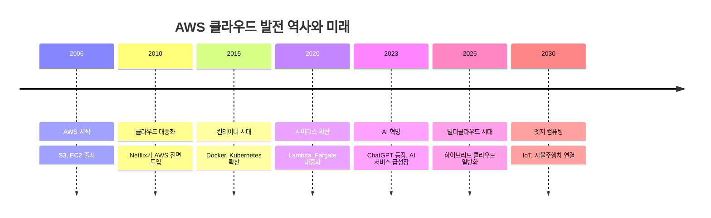

### 🎓 커리어 패스: 클라우드 엔지니어가 되는 법

```python
# 💼 클라우드 엔지니어 커리어 로드맵
def cloud_engineer_career():
    """
    클라우드 엔지니어가 되기 위한 단계별 가이드
    """
    
    career_path = {
        "초급 (0-1년)": {
            "필요 스킬": [
                "AWS 기본 서비스 이해 (EC2, S3, RDS)",
                "Linux 기본 명령어",
                "네트워킹 기초 (IP, DNS, HTTP)",
                "기본 프로그래밍 (Python or Java)"
            ],
            "목표 자격증": "AWS Cloud Practitioner",
            "예상 연봉": "3000-4000만원"
        },
        
        "중급 (1-3년)": {
            "필요 스킬": [
                "Infrastructure as Code (Terraform)",
                "Container 기술 (Docker, Kubernetes)",
                "CI/CD 파이프라인 구축",
                "모니터링 및 로깅 (CloudWatch, ELK)"
            ],
            "목표 자격증": "AWS Solutions Architect Associate",
            "예상 연봉": "4000-6000만원"
        },
        
        "고급 (3-5년)": {
            "필요 스킬": [
                "멀티 클라우드 아키텍처 설계",
                "보안 및 규정 준수",
                "비용 최적화 전략",
                "팀 리딩 및 멘토링"
            ],
            "목표 자격증": "AWS Solutions Architect Professional",
            "예상 연봉": "6000-8000만원"
        },
        
        "전문가 (5년+)": {
            "필요 스킬": [
                "엔터프라이즈 아키텍처 설계",
                "디지털 전환 컨설팅",
                "AI/ML 파이프라인 구축",
                "비즈니스 이해 및 전략 수립"
            ],
            "목표 자격증": "AWS Specialty 자격증들",
            "예상 연봉": "8000만원 이상"
        }
    }
    
    return career_path

# 📚 학습 리소스 추천
def learning_resources():
    """
    AWS를 배우기 위한 추천 리소스들
    """
    
    resources = {
        "무료 리소스": {
            "AWS 공식 문서": "https://docs.aws.amazon.com/ko_kr/",
            "AWS Training": "무료 온라인 강의 제공",
            "AWS Educate": "학생을 위한 무료 크레딧",
            "YouTube": "A Cloud Guru, AWS 공식 채널"
        },
        
        "유료 리소스": {
            "A Cloud Guru": "체계적인 온라인 강의",
            "Udemy": "실습 중심 강의",
            "Linux Academy": "실습 환경 제공",
            "Coursera": "AWS 전문 과정"
        },
        
        "실습 환경": {
            "AWS Free Tier": "12개월 무료 사용",
            "AWS Sandbox": "실습용 임시 계정",
            "Katacoda": "브라우저 기반 실습",
            "개인 프로젝트": "직접 만들어보기"
        },
        
        "커뮤니티": {
            "AWS 한국 사용자 그룹": "정기 모임 및 세미나",
            "AWS re:Invent": "연례 컨퍼런스",
            "Stack Overflow": "기술 질문 답변",
            "Reddit r/aws": "글로벌 커뮤니티"
        }
    }
    
    return resources
```

### 🎯 실전 면접 질문 모음

```python
# 💼 AWS 관련 면접에서 자주 나오는 질문들
def aws_interview_questions():
    """
    실제 면접에서 나오는 AWS 질문들과 답변 가이드
    """
    
    questions = {
        "기초 질문": {
            "Q1": {
                "질문": "클라우드 컴퓨팅이 무엇인가요?",
                "답변 포인트": [
                    "인터넷을 통해 컴퓨팅 리소스를 제공하는 서비스",
                    "필요한 만큼 사용하고 사용한 만큼 지불",
                    "확장성, 유연성, 비용 효율성이 장점"
                ]
            },
            "Q2": {
                "질문": "AWS의 핵심 서비스 3가지를 설명해주세요.",
                "답변 포인트": [
                    "EC2: 가상 서버 서비스",
                    "S3: 객체 스토리지 서비스",
                    "RDS: 관리형 데이터베이스 서비스"
                ]
            }
        },
        
        "중급 질문": {
            "Q1": {
                "질문": "Auto Scaling의 동작 원리를 설명해주세요.",
                "답변 포인트": [
                    "CloudWatch 메트릭 기반으로 동작",
                    "CPU, 메모리, 네트워크 사용률 모니터링",
                    "임계값 초과 시 인스턴스 자동 추가/제거",
                    "비용 최적화와 가용성 확보"
                ]
            },
            "Q2": {
                "질문": "VPC의 구성 요소들을 설명해주세요.",
                "답변 포인트": [
                    "Subnet: 네트워크 분할",
                    "Internet Gateway: 인터넷 연결",
                    "Route Table: 트래픽 라우팅",
                    "Security Group: 인스턴스 방화벽"
                ]
            }
        },
        
        "고급 질문": {
            "Q1": {
                "질문": "멀티 AZ 배포의 장단점을 설명해주세요.",
                "답변 포인트": [
                    "장점: 고가용성, 재해 복구",
                    "단점: 비용 증가, 복잡성",
                    "RDS, ELB 등에서 지원",
                    "지연시간 고려 필요"
                ]
            },
            "Q2": {
                "질문": "서버리스 아키텍처의 특징을 설명해주세요.",
                "답변 포인트": [
                    "서버 관리 불필요",
                    "자동 확장",
                    "이벤트 기반 실행",
                    "Lambda, API Gateway 활용"
                ]
            }
        }
    }
    
    return questions

# 🏆 면접 준비 체크리스트
def interview_preparation():
    """
    AWS 관련 면접 준비 체크리스트
    """
    
    checklist = {
        "기술적 준비": [
            "□ AWS 핵심 서비스 10개 이상 설명 가능",
            "□ 실제 프로젝트 경험 정리",
            "□ 장애 대응 경험 정리",
            "□ 비용 최적화 사례 준비",
            "□ 보안 관련 지식 정리"
        ],
        
        "실습 준비": [
            "□ 간단한 3-tier 아키텍처 구축 경험",
            "□ CI/CD 파이프라인 구축 경험",
            "□ Infrastructure as Code 경험",
            "□ 모니터링 및 로깅 설정 경험",
            "□ 트러블슈팅 경험"
        ],
        
        "소프트 스킬": [
            "□ 기술을 비전문가에게 쉽게 설명하는 능력",
            "□ 문제 해결 과정을 논리적으로 설명",
            "□ 팀워크 및 협업 경험 정리",
            "□ 학습 의지와 성장 마인드 어필",
            "□ 비즈니스 이해도 표현"
        ]
    }
    
    return checklist
```

---

## 🎊 축하합니다! 완주하셨네요!

### 🎯 지금까지 배운 것들

```python
# 🌟 여러분이 지금까지 배운 것들을 정리해보세요!
def what_you_learned():
    """
    이 가이드를 통해 여러분이 습득한 지식들
    """
    
    knowledge_gained = {
        "기본 개념": [
            "✅ 클라우드 컴퓨팅이 무엇인지 이해",
            "✅ AWS의 핵심 서비스들 파악",
            "✅ 클라우드의 장단점 이해",
            "✅ 서비스 모델(IaaS, PaaS, SaaS) 구분"
        ],
        
        "실무 지식": [
            "✅ 현업에서 많이 쓰는 AWS 서비스 파악",
            "✅ 클라우드 설계 패턴 이해",
            "✅ 비용 최적화 방법 학습",
            "✅ 보안 모범 사례 습득"
        ],
        
        "실전 스킬": [
            "✅ AWS 계정 생성 및 기본 설정",
            "✅ 간단한 웹사이트 배포 방법",
            "✅ 모니터링 및 알림 설정",
            "✅ 트러블슈팅 기본기"
        ],
        
        "미래 준비": [
            "✅ 클라우드 엔지니어 커리어 패스 이해",
            "✅ AWS 자격증 로드맵 파악",
            "✅ 지속적인 학습 방향 설정",
            "✅ 실무 면접 준비 완료"
        ]
    }
    
    return knowledge_gained

# 🚀 다음 단계 추천
def next_steps():
    """
    이제 무엇을 해야 할까요?
    """
    
    recommendations = {
        "즉시 실행": [
            "1. AWS 무료 계정 만들기 (아직 안 했다면)",
            "2. EC2로 첫 번째 서버 생성해보기",
            "3. S3에 파일 업로드해보기",
            "4. 비용 알림 설정하기"
        ],
        
        "1주일 내": [
            "1. 간단한 정적 웹사이트를 S3에 호스팅",
            "2. CloudFront로 CDN 설정해보기",
            "3. Route 53으로 도메인 연결해보기",
            "4. RDS로 데이터베이스 만들어보기"
        ],
        
        "1개월 내": [
            "1. 3-tier 웹 애플리케이션 구축하기",
            "2. Auto Scaling 설정해보기",
            "3. CloudWatch로 모니터링 설정하기",
            "4. AWS Cloud Practitioner 자격증 준비"
        ],
        
        "3개월 내": [
            "1. Infrastructure as Code (Terraform) 학습",
            "2. Container 기술 (Docker, ECS) 학습",
            "3. CI/CD 파이프라인 구축해보기",
            "4. AWS Solutions Architect Associate 준비"
        ]
    }
    
    return recommendations
```

### 🌈 마지막 격려의 말

```python
def final_message():
    """
    클라우드 여정을 시작하는 여러분께
    """
    
    message = """
    🎉 축하합니다! 클라우드 컴퓨팅의 첫걸음을 떼셨네요!
    
    기억하세요:
    
    ☁️ 클라우드는 더 이상 선택이 아닌 필수입니다
    📚 지속적인 학습이 성공의 열쇠입니다
    🛠️ 이론보다는 직접 실습하며 배우세요
    🤝 커뮤니티에 참여하여 동료들과 함께 성장하세요
    💪 처음엔 어려워도 포기하지 마세요
    
    AWS는 계속 발전하고 있고, 새로운 서비스들이 매년 수백 개씩 추가됩니다.
    완벽해지려고 하지 말고, 필요한 것부터 차근차근 배워가세요.
    
    여러분의 클라우드 여정을 응원합니다! 🚀
    
    Happy Cloud Computing! ☁️✨
    """
    
    return message

print(final_message())
```

---

## 📞 도움이 필요할 때

### 🆘 문제 해결 리소스

- **AWS 공식 지원**: https://aws.amazon.com/ko/support/
- **AWS 한국 사용자 그룹**: 정기 모임 및 Q&A
- **Stack Overflow**: 기술적 질문
- **AWS re:Post**: AWS 공식 Q&A 커뮤니티

### 📱 유용한 앱들

- **AWS Console Mobile**: 이동 중에도 AWS 관리
- **AWS Cost Explorer**: 비용 모니터링
- **AWS Personal Health Dashboard**: 서비스 상태 확인

---

*"클라우드의 끝은 없다. 계속 배우고, 계속 성장하자!" ☁️🚀*

---

**작성일**: 2025년 9월 25일  
**버전**: 1.0  
**대상**: 클라우드 입문자 
**키워드**: AWS, 클라우드 컴퓨팅, 초보자 가이드, 실무 활용
