# 🚀 AWS 클라우드 디자인 패턴 완벽 가이드

> 비전공자도 쉽게 이해할 수 있는 AWS 클라우드 아키텍처 설계 패턴

## 📚 목차

1. [AWS 클라우드란?](#aws-클라우드란)
2. [디자인 패턴 개요](#디자인-패턴-개요)
3. [7가지 핵심 디자인 패턴](#7가지-핵심-디자인-패턴)
4. [현업에서 많이 사용하는 패턴](#현업에서-많이-사용하는-패턴)
5. [실제 기업 마이그레이션 사례](#실제-기업-마이그레이션-사례)
6. [참고 자료](#참고-자료)

---

## AWS 클라우드란?

🔍 **쉽게 말하면**: 아마존에서 제공하는 "인터넷을 통한 컴퓨터 대여 서비스"

- **기존 방식**: 회사에서 직접 서버 컴퓨터를 사서 관리
- **AWS 방식**: 필요할 때만 아마존 서버를 빌려서 사용
- **장점**: 초기 비용 절약, 24시간 관리 불필요, 전 세계 어디서나 접근 가능

---

## 디자인 패턴 개요

**디자인 패턴**이란 자주 발생하는 문제를 해결하는 **검증된 방법론**입니다.

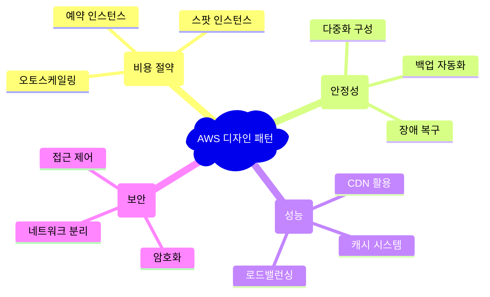

---

## 7가지 핵심 디자인 패턴

### 1. 🎪 이벤트 사이트 (단일 서버 구성)

**언제 사용?**: 짧은 기간 운영하는 간단한 웹사이트

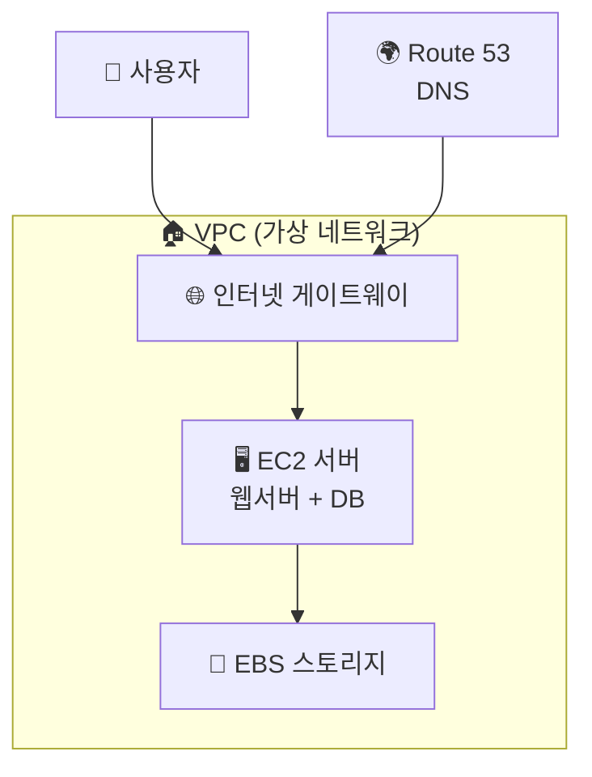

#### 🛠️ 주요 AWS 서비스

| 서비스 | 역할 | 비유 |
|--------|------|------|
| **EC2** | 가상 서버 컴퓨터 | 📱 스마트폰 (앱 실행) |
| **EBS** | 가상 하드디스크 | 💾 USB 메모리 |
| **VPC** | 가상 네트워크 | 🏠 우리 집 Wi-Fi |
| **Route 53** | 도메인 주소 관리 | 📍 내비게이션 |

#### 💰 비용 최적화 팁
```bash
# EC2 인스턴스 타입 선택 예시
t3.micro    # 💰 가장 저렴 (프리티어 가능)
t3.small    # 💰💰 소규모 사이트
t3.medium   # 💰💰💰 중간 규모 사이트
```

---

### 2. 🏢 기업 웹사이트 (다중화 구성)

**언제 사용?**: 안정적인 서비스가 필요한 회사 홈페이지

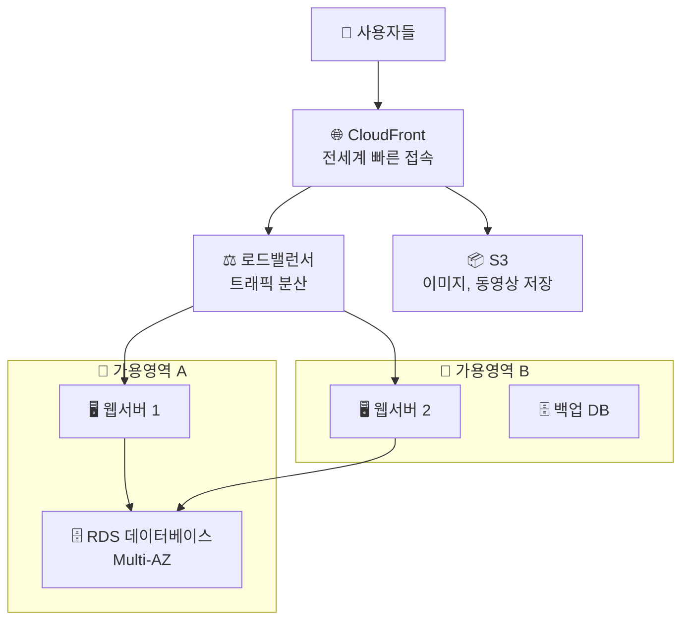

#### 🎯 핵심 개념 설명

**로드밸런서(Load Balancer)**
- **쉬운 설명**: 여러 서버에 일을 나눠주는 교통정리 역할
- **예시**: 은행에 여러 창구가 있을 때, 대기줄을 적절히 배분

**Multi-AZ (다중 가용영역)**
- **쉬운 설명**: 서울과 부산에 각각 서버를 두어 한 곳이 고장나도 괜찮게 하는 것
- **장점**: 99.99% 안정성 보장

---

### 3. ⚡ 고성능 인트라넷 시스템

**언제 사용?**: 회사 내부 업무 시스템 (급여, 회계 등)

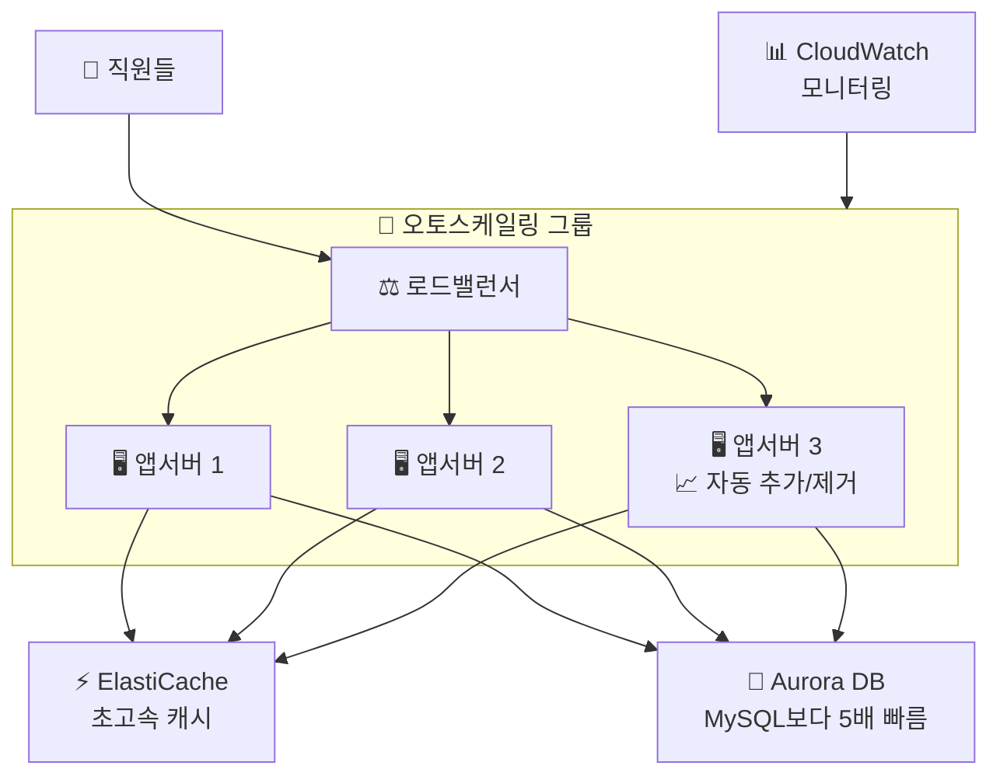

#### 🚀 성능 향상 기술

**오토스케일링**
```python
# 쉬운 이해를 위한 의사코드
if CPU사용률 > 70%:
    서버_추가()  # 바쁠 때 서버 늘리기
elif CPU사용률 < 30%:
    서버_제거()  # 한가할 때 서버 줄이기 (비용절약)
```

**캐시 시스템**
- **역할**: 자주 사용하는 데이터를 메모리에 저장해서 빠르게 접근
- **비유**: 자주 보는 책을 책상 위에 두는 것 vs 서재에서 찾는 것

---

### 4. 💾 백업 시스템

**언제 사용?**: 중요한 데이터를 안전하게 보관할 때

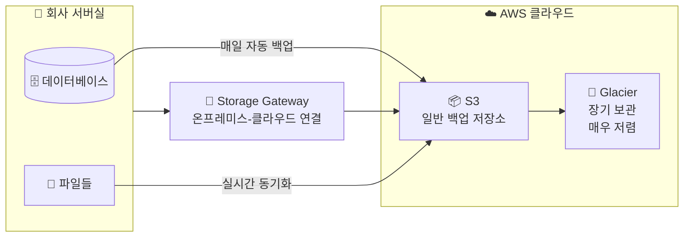

#### 📊 스토리지 비용 비교

| 저장소 타입 | 비용 | 접근 속도 | 용도 |
|-------------|------|-----------|------|
| **S3 Standard** | 💰💰💰 | ⚡⚡⚡ 즉시 | 자주 접근하는 백업 |
| **S3 IA** | 💰💰 | ⚡⚡ 빠름 | 가끔 접근하는 백업 |
| **Glacier** | 💰 | ⚡ 느림 | 장기 보관용 |

---

### 5. 🏃‍♂️ 빠른 개발 환경 (CI/CD)

**언제 사용?**: 게임이나 앱을 빠르게 개발하고 배포할 때

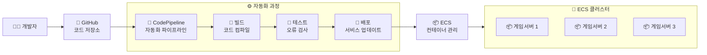

#### 🤖 자동화의 장점

**기존 방식**
```
1. 개발자가 코드 작성 ✍️
2. 수동으로 테스트 🧪
3. 수동으로 서버에 업로드 📤
4. 수동으로 서비스 재시작 🔄
⏰ 총 소요시간: 2-3시간
```

**AWS CI/CD 방식**
```
1. 개발자가 코드 작성 ✍️
2. 자동으로 모든 과정 진행 🤖
⏰ 총 소요시간: 10-15분
```

---

### 6. 🔋 서버리스 아키텍처

**언제 사용?**: 서버 관리 없이 웹서비스를 만들고 싶을 때

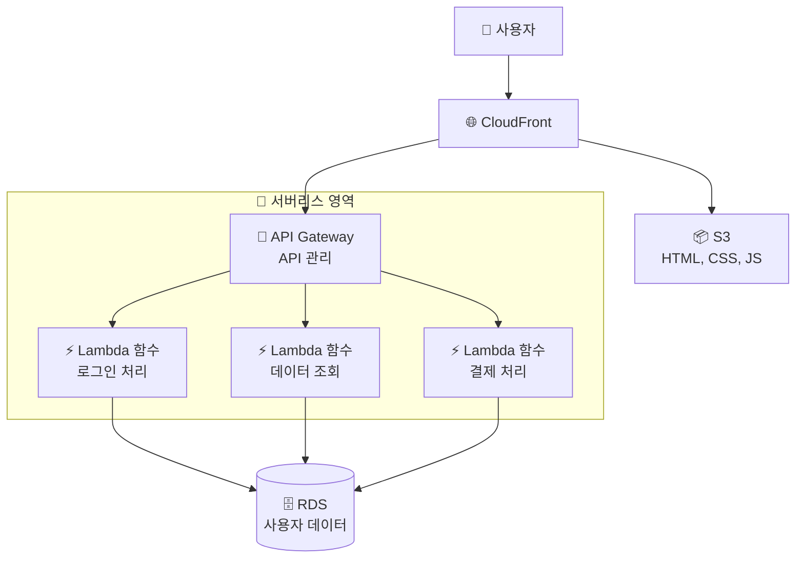

#### 💡 서버리스의 특징

**서버리스 = 서버가 없다?** ❌
- **실제 의미**: 서버 관리를 AWS가 대신 해줌
- **개발자 역할**: 코드만 작성하면 됨

#### 💰 서버리스 비용 계산

```python
# Lambda 요금 계산 예시 (한국 리전 기준)
월간_API_호출 = 3_000_000  # 300만번
함수_실행시간 = 0.5초      # 500밀리초
할당_메모리 = 128MB

# 요청 비용: 100만 요청당 $0.2
요청_비용 = (월간_API_호출 / 1_000_000) * 0.2

# 실행 비용: GB-초당 $0.0000166667
실행_비용 = (월간_API_호출 * 함수_실행시간 * 할당_메모리/1024) * 0.0000166667

총_비용 = 요청_비용 + 실행_비용  # 매우 저렴!
```

---

### 7. 🧩 마이크로서비스 아키텍처

**언제 사용?**: 큰 시스템을 작은 서비스들로 나누어 관리할 때

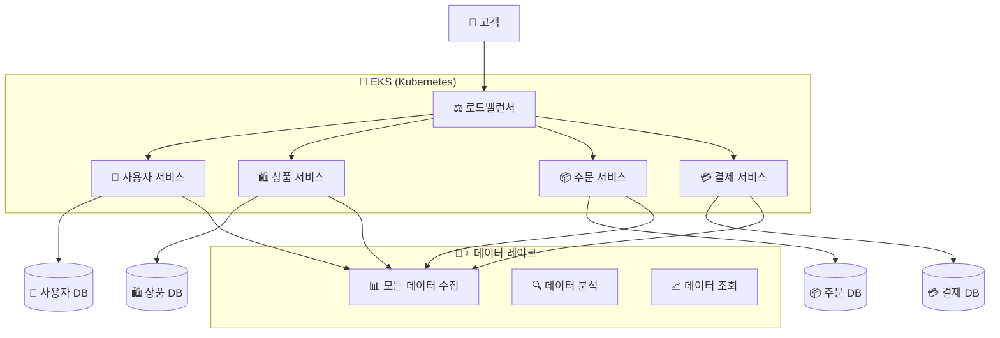

#### 🧩 마이크로서비스 vs 모놀리식

**모놀리식 (기존 방식)**
- 모든 기능이 하나의 큰 프로그램 🏢
- 한 부분 수정 시 전체 재배포 필요
- 장애 시 전체 서비스 중단

**마이크로서비스 (현대적 방식)**
- 기능별로 작은 프로그램들로 분리 🧩
- 독립적 개발/배포 가능
- 한 서비스 장애 시 다른 서비스는 정상 작동

---

## 현업에서 많이 사용하는 패턴

### 🥇 1위: 웹 애플리케이션 3-Tier 아키텍처

**가장 기본적이고 안정적인 패턴**

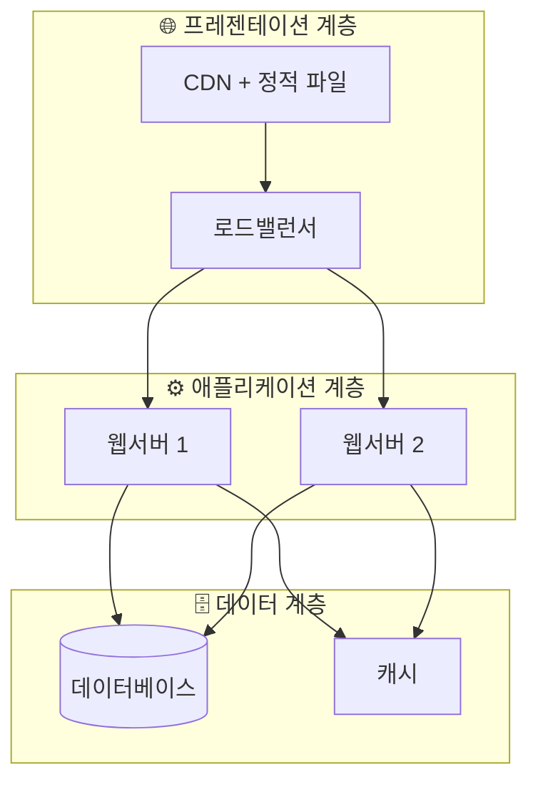

### 🥈 2위: 서버리스 웹 애플리케이션

**빠른 개발과 낮은 운영비용이 필요할 때**

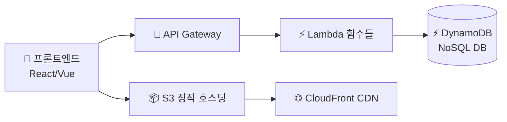

### 🥉 3위: 컨테이너 기반 마이크로서비스

**대규모 시스템과 DevOps 문화가 정착된 기업**

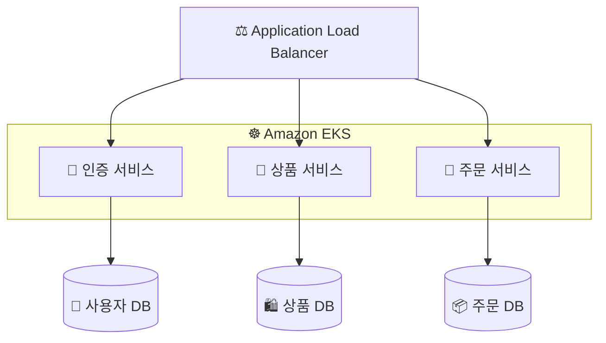

### 📊 현업 사용률 통계

| 패턴 | 사용률 | 주요 사용 업종 |
|------|--------|----------------|
| **3-Tier 웹앱** | 60% | 대부분의 웹서비스, 기업 시스템 |
| **서버리스** | 25% | 스타트업, 이벤트성 서비스 |
| **마이크로서비스** | 10% | 대기업, 핀테크, 이커머스 |
| **기타** | 5% | 특수 목적 시스템 |

---

## 실제 기업 마이그레이션 사례

### 🎬 넷플릭스 - 전체 AWS 이전

**배경**: 2008년 크리스마스 대규모 장애 경험

**Before (온프레미스)**
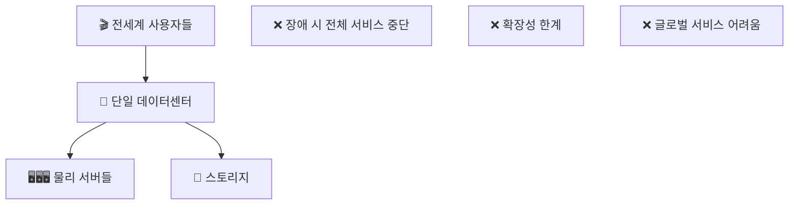

**After (AWS 클라우드)**
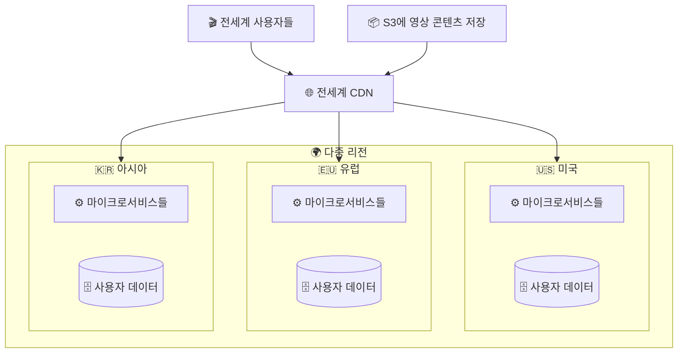

**성과**
- ✅ 서비스 가용성 99.9% → 99.99%
- ✅ 글로벌 확장 용이
- ✅ 하루 수백번 배포 가능
- ✅ 운영비용 대폭 절감

### 📱 삼성전자 - SAP 시스템 AWS 이전

**이전 대상**: 회사 핵심 업무 시스템 (ERP, 회계, 인사)

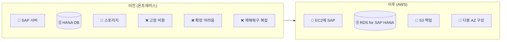

**주요 효과**
- ✅ SAP 성능 최대 3배 향상
- ✅ 장애 복구 시간 수 시간 → 수 분
- ✅ 글로벌 법인 지원 체계 개선

---

## AWS 서비스별 현업 활용도

### 🌟 필수 서비스 (사용률 90% 이상)

| 서비스 | 역할 | 현업 활용 예시 |
|--------|------|----------------|
| **EC2** | 가상 서버 | 웹서버, 애플리케이션 서버 |
| **RDS** | 관리형 데이터베이스 | MySQL, PostgreSQL 운영 |
| **S3** | 객체 저장소 | 파일 저장, 백업, 정적 웹사이트 |
| **VPC** | 가상 네트워크 | 보안 네트워크 구성 |

### ⭐ 자주 사용 (사용률 70% 이상)

| 서비스 | 역할 | 현업 활용 예시 |
|--------|------|----------------|
| **CloudFront** | CDN | 전세계 빠른 콘텐츠 전송 |
| **Lambda** | 서버리스 함수 | 이미지 처리, API 백엔드 |
| **ALB** | 로드밸런서 | 트래픽 분산, SSL 인증서 |
| **Route 53** | DNS | 도메인 관리 |

### 🔧 전문 서비스 (사용률 30% 이상)

| 서비스 | 역할 | 현업 활용 예시 |
|--------|------|----------------|
| **EKS** | Kubernetes 관리 | 마이크로서비스 운영 |
| **ElastiCache** | 인메모리 캐시 | Redis, Memcached |
| **CodePipeline** | CI/CD | 자동화 배포 |
| **CloudWatch** | 모니터링 | 시스템 감시, 알람 |

---

## 💰 비용 최적화 베스트 프랙티스

### 1. 예약 인스턴스 활용

```python
# 비용 비교 (1년 기준)
온디맨드_비용 = 월_100달러 * 12개월  # $1,200
예약인스턴스_비용 = 월_100달러 * 12개월 * 0.6  # $720 (40% 할인)
절약액 = 온디맨드_비용 - 예약인스턴스_비용  # $480 절약!
```

### 2. 오토스케일링으로 탄력적 운영

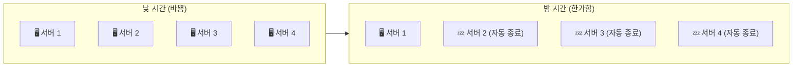

### 3. 적절한 스토리지 클래스 선택

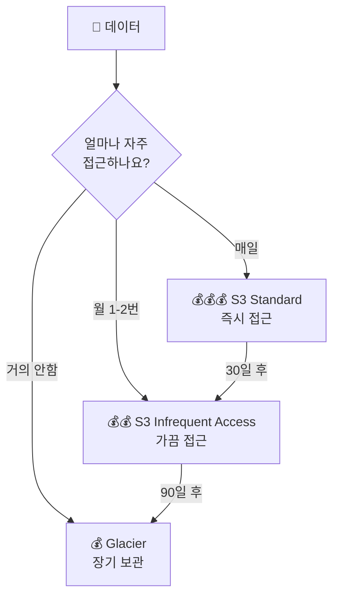

---

## 🔐 보안 베스트 프랙티스

### 1. IAM 최소 권한 원칙

```json
{
  "Version": "2012-10-17",
  "Statement": [
    {
      "Effect": "Allow",
      "Action": [
        "s3:GetObject"  // S3에서 파일 읽기만 허용
      ],
      "Resource": "arn:aws:s3:::my-bucket/*"  // 특정 버킷만
    }
  ]
}
```

### 2. 네트워크 보안 계층

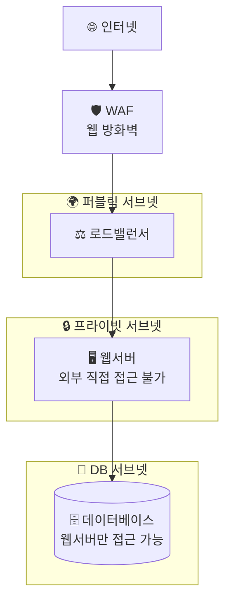

---

## 📈 성능 최적화 가이드

### 1. CDN 활용 전후 비교

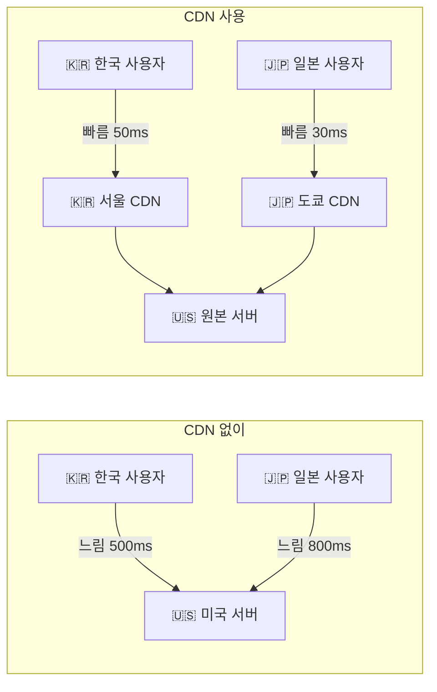

### 2. 데이터베이스 성능 튜닝

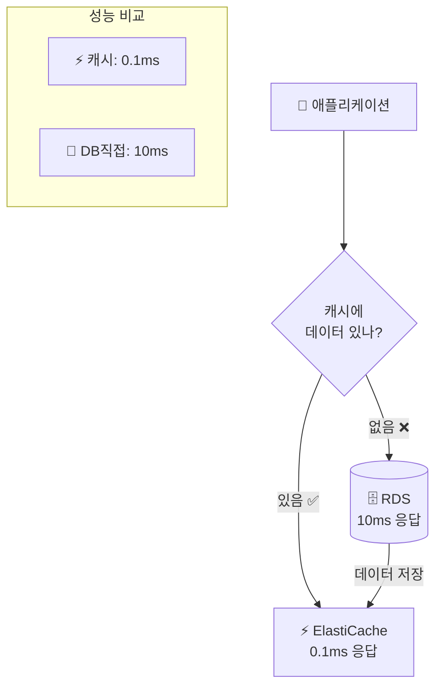

---

## 🛠️ 개발자를 위한 AWS CLI 기본 명령어

### EC2 인스턴스 관리

```bash
# EC2 인스턴스 목록 조회
aws ec2 describe-instances

# 새 인스턴스 생성
aws ec2 run-instances \
    --image-id ami-0c55b159cbfafe1d0 \
    --instance-type t3.micro \
    --key-name my-key-pair

# 인스턴스 중지
aws ec2 stop-instances --instance-ids i-1234567890abcdef0

# 인스턴스 시작
aws ec2 start-instances --instance-ids i-1234567890abcdef0
```

### S3 버킷 관리

```bash
# S3 버킷 생성
aws s3 mb s3://my-unique-bucket-name

# 파일 업로드
aws s3 cp local-file.txt s3://my-bucket/

# 폴더 전체 동기화
aws s3 sync ./local-folder s3://my-bucket/folder/

# 버킷 내용 조회
aws s3 ls s3://my-bucket/
```

### RDS 데이터베이스 관리

```bash
# RDS 인스턴스 목록
aws rds describe-db-instances

# DB 스냅샷 생성
aws rds create-db-snapshot \
    --db-instance-identifier mydb \
    --db-snapshot-identifier mydb-snapshot-$(date +%Y%m%d)

# DB 인스턴스 중지 (비용 절약)
aws rds stop-db-instance --db-instance-identifier mydb
```

---

## 🚨 장애 대응 및 모니터링

### 1. CloudWatch 알람 설정

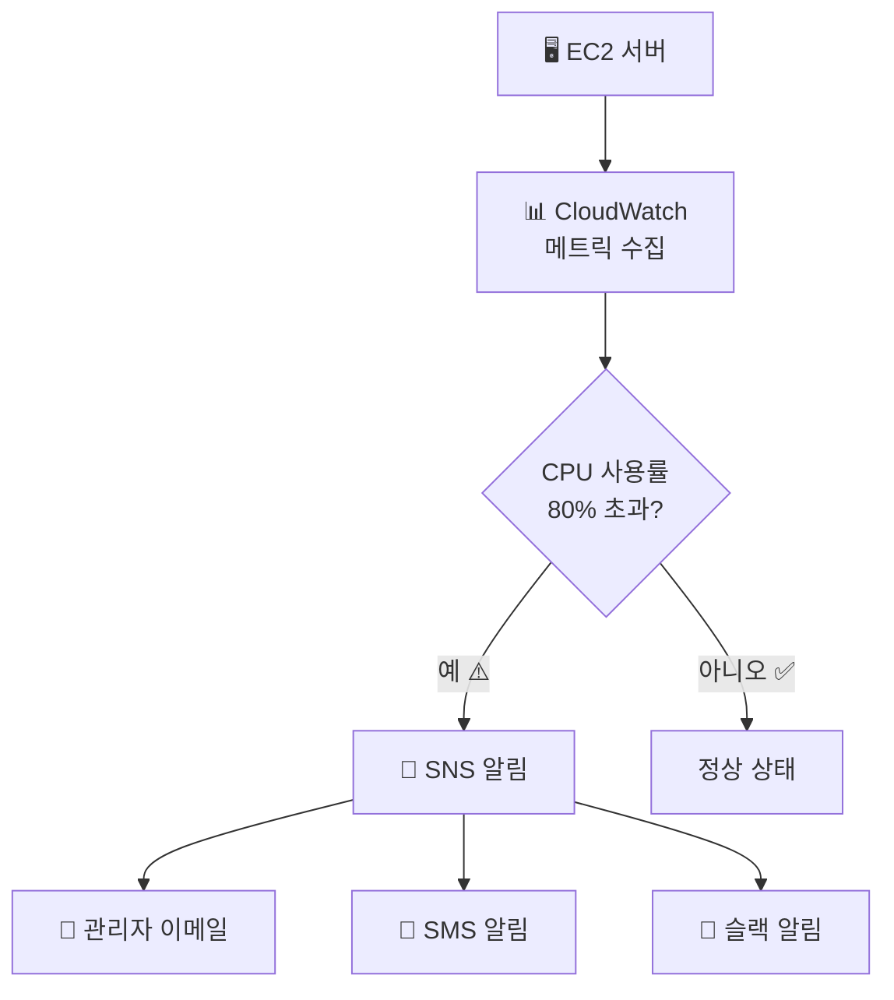

### 2. 일반적인 장애 시나리오와 대응

```mermaid
flowchart TD
    Start[🚨 장애 발생] --> Check1{웹사이트<br/>접속 되나?}
    
    Check1 -->|안됨| CheckLB[⚖️ 로드밸런서<br/>상태 확인]
    Check1 -->|됨| CheckSlow[🐌 응답 느림<br/>확인]
    
    CheckLB --> HealthCheck[🏥 헬스체크<br/>실패한 서버 확인]
    CheckSlow --> CheckDB[(🗄️ DB 성능<br/>확인)]
    
    HealthCheck --> RestartServer[🔄 서버 재시작<br/>또는 교체]
    CheckDB --> ScaleUp[📈 DB 성능<br/>향상 또는 캐시 추가]
    
    RestartServer --> Monitor[📊 모니터링 지속]
    ScaleUp --> Monitor
```

---

## 📋 AWS 인증 및 학습 로드맵

### 초급자 추천 순서

```mermaid
graph LR
    Start[🎯 시작] --> Basic[📚 AWS 기본 개념<br/>EC2, S3, RDS]
    Basic --> Hands[🛠️ 실습<br/>간단한 웹사이트 구축]
    Hands --> Cert1[📜 AWS Cloud Practitioner<br/>기초 인증]
    Cert1 --> Intermediate[📈 중급<br/>VPC, 로드밸런서 학습]
    Intermediate --> Cert2[📜 Solutions Architect<br/>Associate 인증]
```

### 추천 학습 자료

| 단계 | 자료 | 소요시간 | 비용 |
|------|------|----------|------|
| **기초** | AWS 공식 문서, 유튜브 | 1-2개월 | 무료 |
| **실습** | AWS 프리티어 활용 | 2-3개월 | 무료 |
| **심화** | 온라인 강의 (인프런, 유데미) | 3-6개월 | 5-20만원 |
| **인증** | AWS 공식 시험 | 준비 2-3개월 | 시험비 15만원 |

---

## 🌟 실제 프로젝트 구현 예제

### 프로젝트: 온라인 쇼핑몰 구축

**요구사항**
- 동시 사용자 1,000명 지원
- 상품 이미지 빠른 로딩
- 주문 데이터 안전 보관
- 트래픽 급증 시 자동 확장

**아키텍처 설계**

```mermaid
graph TB
    User[👥 고객들] --> CF[🌐 CloudFront<br/>전세계 빠른 이미지 로딩]
    User --> ALB[⚖️ Application Load Balancer]
    
    ALB --> ASG[🎯 Auto Scaling Group]
    
    subgraph ASG["오토스케일링 그룹"]
        EC2_1[🖥️ 웹서버 1<br/>Node.js/Python]
        EC2_2[🖥️ 웹서버 2<br/>Node.js/Python]
        EC2_3[🖥️ 웹서버 3<br/>확장 시 추가]
    end
    
    EC2_1 --> Cache[⚡ ElastiCache<br/>상품 정보 캐시]
    EC2_2 --> Cache
    EC2_3 --> Cache
    
    EC2_1 --> RDS[(🗄️ RDS MySQL<br/>Multi-AZ<br/>주문/사용자 데이터)]
    EC2_2 --> RDS
    EC2_3 --> RDS
    
    CF --> S3[📦 S3<br/>상품 이미지 저장]
    
    subgraph Monitoring["📊 모니터링"]
        CloudWatch[📈 CloudWatch<br/>성능 지표]
        SNS[📧 SNS<br/>알림 서비스]
    end
    
    ASG --> CloudWatch
    CloudWatch --> SNS
```

**구현 단계별 가이드**

#### 1단계: 기본 인프라 구성

```bash
# 1. VPC 생성
aws ec2 create-vpc --cidr-block 10.0.0.0/16

# 2. 서브넷 생성 (퍼블릭/프라이빗)
aws ec2 create-subnet --vpc-id vpc-12345 --cidr-block 10.0.1.0/24
aws ec2 create-subnet --vpc-id vpc-12345 --cidr-block 10.0.2.0/24

# 3. 인터넷 게이트웨이 연결
aws ec2 create-internet-gateway
aws ec2 attach-internet-gateway --internet-gateway-id igw-12345 --vpc-id vpc-12345
```

#### 2단계: 데이터베이스 설정

```sql
-- RDS MySQL 인스턴스에서 실행할 초기 테이블 생성
CREATE DATABASE shopping_mall;

USE shopping_mall;

-- 사용자 테이블
CREATE TABLE users (
    id INT PRIMARY KEY AUTO_INCREMENT,
    email VARCHAR(255) UNIQUE NOT NULL,
    password_hash VARCHAR(255) NOT NULL,
    name VARCHAR(100) NOT NULL,
    created_at TIMESTAMP DEFAULT CURRENT_TIMESTAMP
);

-- 상품 테이블
CREATE TABLE products (
    id INT PRIMARY KEY AUTO_INCREMENT,
    name VARCHAR(255) NOT NULL,
    price DECIMAL(10,2) NOT NULL,
    description TEXT,
    image_url VARCHAR(500),
    stock_quantity INT DEFAULT 0,
    created_at TIMESTAMP DEFAULT CURRENT_TIMESTAMP
);

-- 주문 테이블
CREATE TABLE orders (
    id INT PRIMARY KEY AUTO_INCREMENT,
    user_id INT,
    total_amount DECIMAL(10,2) NOT NULL,
    status ENUM('pending', 'paid', 'shipped', 'delivered') DEFAULT 'pending',
    created_at TIMESTAMP DEFAULT CURRENT_TIMESTAMP,
    FOREIGN KEY (user_id) REFERENCES users(id)
);
```

#### 3단계: 애플리케이션 코드 (Node.js 예제)

```javascript
// app.js - 메인 애플리케이션
const express = require('express');
const mysql = require('mysql2');
const redis = require('redis');
const AWS = require('aws-sdk');

const app = express();
const port = 3000;

// AWS S3 설정 (상품 이미지용)
const s3 = new AWS.S3();

// Redis 캐시 연결 (ElastiCache)
const redisClient = redis.createClient({
    host: 'your-elasticache-endpoint.cache.amazonaws.com'
});

// MySQL 연결 (RDS)
const db = mysql.createConnection({
    host: 'your-rds-endpoint.amazonaws.com',
    user: 'admin',
    password: 'your-password',
    database: 'shopping_mall'
});

// 상품 목록 조회 API (캐시 활용)
app.get('/api/products', async (req, res) => {
    try {
        // 1. 먼저 Redis 캐시에서 확인
        const cachedProducts = await redisClient.get('products');
        
        if (cachedProducts) {
            console.log('캐시에서 상품 데이터 반환');
            return res.json(JSON.parse(cachedProducts));
        }
        
        // 2. 캐시에 없으면 DB에서 조회
        db.query('SELECT * FROM products', (err, results) => {
            if (err) throw err;
            
            // 3. 결과를 캐시에 저장 (5분간)
            redisClient.setex('products', 300, JSON.stringify(results));
            
            console.log('DB에서 상품 데이터 조회 후 캐시 저장');
            res.json(results);
        });
        
    } catch (error) {
        res.status(500).json({ error: 'Server Error' });
    }
});

// 주문 생성 API
app.post('/api/orders', (req, res) => {
    const { userId, products, totalAmount } = req.body;
    
    // 주문 데이터 저장
    const query = 'INSERT INTO orders (user_id, total_amount) VALUES (?, ?)';
    db.query(query, [userId, totalAmount], (err, result) => {
        if (err) {
            console.error('주문 저장 실패:', err);
            return res.status(500).json({ error: '주문 처리 실패' });
        }
        
        console.log('주문 성공:', result.insertId);
        res.json({ 
            success: true, 
            orderId: result.insertId,
            message: '주문이 완료되었습니다.'
        });
    });
});

// 서버 시작
app.listen(port, () => {
    console.log(`쇼핑몰 서버가 포트 ${port}에서 실행 중입니다.`);
});
```

#### 4단계: 오토스케일링 설정

```bash
# Launch Template 생성 (서버 설정 템플릿)
aws ec2 create-launch-template \
    --launch-template-name shopping-mall-template \
    --launch-template-data '{
        "ImageId": "ami-0c55b159cbfafe1d0",
        "InstanceType": "t3.micro",
        "KeyName": "my-key",
        "SecurityGroupIds": ["sg-12345678"],
        "UserData": "IyEvYmluL2Jhc2gKY2QgL2hvbWUvZWMyLXVzZXIKZ2l0IGNsb25lIGh0dHBzOi8vZ2l0aHViLmNvbS9teS1yZXBvL3Nob3BwaW5nLW1hbGwuZ2l0CmNkIHNob3BwaW5nLW1hbGwKbnBtIGluc3RhbGwKbnBtIHN0YXJ0"
    }'

# Auto Scaling Group 생성
aws autoscaling create-auto-scaling-group \
    --auto-scaling-group-name shopping-mall-asg \
    --launch-template LaunchTemplateName=shopping-mall-template \
    --min-size 2 \
    --max-size 10 \
    --desired-capacity 3 \
    --vpc-zone-identifier "subnet-12345,subnet-67890"
```

---

## 📊 비용 관리 및 최적화

### 월별 예상 비용 계산

```mermaid
pie title 쇼핑몰 월별 AWS 비용 분석
    "EC2 (웹서버 3대)" : 150
    "RDS (MySQL Multi-AZ)" : 200
    "ElastiCache (Redis)" : 80
    "S3 (이미지 저장)" : 30
    "CloudFront (CDN)" : 50
    "기타 (로드밸런서, 모니터링)" : 90
```

**상세 비용 계산**

| 서비스 | 사양 | 월 사용량 | 단가 | 월 비용 |
|--------|------|-----------|------|---------|
| **EC2** | t3.medium × 3대 | 24시간 × 30일 | $0.0416/시간 | $90 |
| **RDS** | db.t3.small Multi-AZ | 24시간 × 30일 | $0.068/시간 | $49 |
| **ElastiCache** | cache.t3.micro | 24시간 × 30일 | $0.017/시간 | $12 |
| **S3** | 100GB 저장 + 1TB 전송 | 월 사용량 | 다양 | $25 |
| **CloudFront** | 1TB 전송량 | 월 전송량 | $0.085/GB | $85 |

**💡 비용 절약 팁**

```bash
# 1. 예약 인스턴스로 40% 절약
aws ec2 purchase-reserved-instances-offering \
    --reserved-instances-offering-id ri-12345678 \
    --instance-count 3

# 2. 스팟 인스턴스로 90% 절약 (개발환경)
aws ec2 request-spot-instances \
    --spot-price "0.05" \
    --instance-count 2 \
    --type "one-time" \
    --launch-specification file://spot-config.json

# 3. 사용하지 않는 리소스 정리
# 오래된 EBS 스냅샷 삭제
aws ec2 describe-snapshots --owner-ids self --query 'Snapshots[?StartTime<=`2023-01-01`]'
```

---

## 🔒 보안 체크리스트

### 필수 보안 설정

```mermaid
graph TB
    Security[🔒 보안 체크리스트] --> Network[🌐 네트워크 보안]
    Security --> Access[👤 접근 제어]
    Security --> Data[📊 데이터 보안]
    Security --> Monitor[📈 모니터링]
    
    Network --> VPC[✅ VPC 프라이빗 서브넷 사용]
    Network --> SG[✅ 보안 그룹 최소 권한]
    Network --> WAF[✅ WAF 웹 방화벽 설정]
    
    Access --> IAM[✅ IAM 역할 기반 접근]
    Access --> MFA[✅ 다단계 인증 활성화]
    Access --> Keys[✅ 액세스 키 정기 교체]
    
    Data --> Encrypt[✅ 저장/전송 중 암호화]
    Data --> Backup[✅ 정기 백업 및 복구 테스트]
    Data --> KMS[✅ AWS KMS 키 관리]
    
    Monitor --> CloudTrail[✅ API 호출 로깅]
    Monitor --> GuardDuty[✅ 위협 탐지 서비스]
    Monitor --> Config[✅ 리소스 구성 감사]
```

### IAM 정책 예제

```json
{
  "Version": "2012-10-17",
  "Statement": [
    {
      "Sid": "AllowS3ReadOnly",
      "Effect": "Allow",
      "Action": [
        "s3:GetObject",
        "s3:ListBucket"
      ],
      "Resource": [
        "arn:aws:s3:::my-shopping-mall-images",
        "arn:aws:s3:::my-shopping-mall-images/*"
      ]
    },
    {
      "Sid": "AllowRDSConnect",
      "Effect": "Allow",
      "Action": [
        "rds-db:connect"
      ],
      "Resource": "arn:aws:rds-db:ap-northeast-2:123456789012:dbuser:db-instance-id/app-user"
    }
  ]
}
```

---

## 🚀 DevOps 자동화

### CI/CD 파이프라인 구축

```mermaid
graph LR
    Dev[👨‍💻 개발자] --> Git[📝 Git Push<br/>GitHub/CodeCommit]
    
    Git --> Pipeline[🔄 CodePipeline 시작]
    
    subgraph CICD["🔄 CI/CD 자동화"]
        Pipeline --> Build[🔨 CodeBuild<br/>소스 빌드]
        Build --> Test[🧪 자동 테스트<br/>Unit/Integration]
        Test --> Deploy[🚀 CodeDeploy<br/>배포 실행]
    end
    
    Deploy --> Staging[🎭 스테이징 환경<br/>최종 테스트]
    Staging --> Approval[👨‍💼 승인 대기<br/>수동 검토]
    Approval --> Production[🌟 프로덕션 배포<br/>실제 서비스]
    
    Production --> Monitor[📊 CloudWatch<br/>모니터링]
    Monitor --> Alert[🚨 알림<br/>문제 시 즉시 알림]
```

### 배포 자동화 스크립트 예제

```yaml
# buildspec.yml - CodeBuild 설정 파일
version: 0.2

phases:
  pre_build:
    commands:
      - echo Logging in to Amazon ECR...
      - aws ecr get-login-password --region $AWS_DEFAULT_REGION | docker login --username AWS --password-stdin $AWS_ACCOUNT_ID.dkr.ecr.$AWS_DEFAULT_REGION.amazonaws.com
      - REPOSITORY_URI=$AWS_ACCOUNT_ID.dkr.ecr.$AWS_DEFAULT_REGION.amazonaws.com/$IMAGE_REPO_NAME
      - COMMIT_HASH=$(echo $CODEBUILD_RESOLVED_SOURCE_VERSION | cut -c 1-7)
      - IMAGE_TAG=${COMMIT_HASH:=latest}
      
  build:
    commands:
      - echo Build started on `date`
      - echo Building the Docker image...
      - docker build -t $REPOSITORY_URI:latest .
      - docker tag $REPOSITORY_URI:latest $REPOSITORY_URI:$IMAGE_TAG
      
  post_build:
    commands:
      - echo Build completed on `date`
      - echo Pushing the Docker images...
      - docker push $REPOSITORY_URI:latest
      - docker push $REPOSITORY_URI:$IMAGE_TAG
      - echo Writing image definitions file...
      - printf '[{"name":"shopping-mall-app","imageUri":"%s"}]' $REPOSITORY_URI:$IMAGE_TAG > imagedefinitions.json

artifacts:
  files:
    - imagedefinitions.json
```

---

## 📈 성능 모니터링 및 최적화

### CloudWatch 대시보드 구성

```mermaid
graph TB
    subgraph Dashboard["📊 CloudWatch 대시보드"]
        CPU[📈 EC2 CPU 사용률<br/>목표: 70% 이하]
        Memory[📈 메모리 사용률<br/>목표: 80% 이하]
        DB[📈 RDS 성능<br/>커넥션, 레이턴시]
        Cache[📈 캐시 적중률<br/>목표: 90% 이상]
    end
    
    CPU --> Alarm1[🚨 CPU 알람<br/>80% 초과 시]
    Memory --> Alarm2[🚨 메모리 알람<br/>90% 초과 시]
    DB --> Alarm3[🚨 DB 알람<br/>느린 쿼리 탐지]
    Cache --> Alarm4[🚨 캐시 알람<br/>적중률 저하 시]
    
    Alarm1 --> AutoScale[📈 오토스케일링 트리거]
    Alarm2 --> AutoScale
    Alarm3 --> DBA[👨‍💻 DBA 알림]
    Alarm4 --> DevOps[👨‍💻 DevOps 알림]
```

### 성능 최적화 체크포인트

```bash
# 1. 데이터베이스 성능 분석
aws rds describe-db-log-files --db-instance-identifier mydb

# 2. 캐시 성능 확인
aws elasticache describe-cache-clusters --show-cache-node-info

# 3. CloudFront 캐시 효율성 확인
aws cloudfront get-distribution-config --id E1234567890

# 4. 애플리케이션 로그 분석
aws logs filter-log-events \
    --log-group-name /aws/ec2/shopping-mall \
    --start-time 1609459200000 \
    --filter-pattern "ERROR"
```

---

## 🎯 마무리 및 다음 단계

### 학습 완료 체크리스트

- [ ] AWS 기본 서비스 이해 (EC2, S3, RDS)
- [ ] 7가지 디자인 패턴 숙지
- [ ] 실습 프로젝트 완성 (쇼핑몰)
- [ ] 보안 설정 적용
- [ ] 모니터링 구성
- [ ] 비용 최적화 적용

### 실무 적용을 위한 추가 학습 방향

```mermaid
mindmap
  root)다음 단계(
    (인증 획득)
      AWS Certified Solutions Architect
      AWS Certified Developer
      AWS Certified DevOps Engineer
    (실무 경험)
      오픈소스 프로젝트 참여
      회사 프로젝트에 AWS 도입
      개인 프로젝트 AWS 배포
    (고급 주제)
      Kubernetes (EKS)
      서버리스 아키텍처
      빅데이터 (EMR, Redshift)
      머신러닝 (SageMaker)
```

### 유용한 도구 및 리소스

| 도구/리소스 | 용도 | 링크 |
|-------------|------|------|
| **AWS Calculator** | 비용 예측 | [calculator.aws](https://calculator.aws) |
| **AWS Architecture Icons** | 다이어그램 작성 | [aws.amazon.com/architecture/icons](https://aws.amazon.com/architecture/icons) |
| **AWS CLI** | 명령줄 관리 | [aws.amazon.com/cli](https://aws.amazon.com/cli) |
| **Terraform** | 인프라 자동화 | [terraform.io](https://terraform.io) |
| **AWS CDK** | 인프라 코드화 | [aws.amazon.com/cdk](https://aws.amazon.com/cdk) |

---

## 참고 자료

### 📚 공식 문서
- [AWS 아키텍처 센터](https://aws.amazon.com/ko/architecture/)
- [AWS 디자인 패턴](https://docs.aws.amazon.com/prescriptive-guidance/latest/cloud-design-patterns/introduction.html)
- [AWS 참조 아키텍처](https://aws.amazon.com/ko/architecture/reference-architecture-diagrams/)

### 🎥 학습 동영상
- AWS re:Invent 세션 동영상
- AWS 한국 사용자 그룹 (AWSKRUG) 발표 자료
- YouTube AWS 공식 채널

### 📖 추천 도서
- "AWS 클라우드 첫걸음" - 생초보자용
- "아마존 웹 서비스 패턴별 구축 운용 가이드" - 실무 패턴 학습
- "AWS 공인 솔루션스 아키텍트" - 인증 준비

### 🤝 커뮤니티
- [AWSKRUG (AWS Korea User Group)](https://awskrug.github.io/)
- [AWS 한국 블로그](https://aws.amazon.com/ko/blogs/korea/)
- Stack Overflow AWS 태그

---

*이 가이드가 여러분의 AWS 클라우드 여정에 도움이 되기를 바랍니다! 💪*

*궁금한 점이 있으시면 언제든지 AWS 커뮤니티에 질문해보세요. 🤗*
