# AWS 기본 가이드 🌥️

---

## 📖 목차
1. [AWS란 무엇인가요?](#aws란-무엇인가요)
2. [AWS 글로벌 인프라](#aws-글로벌-인프라)
3. [주요 AWS 서비스](#주요-aws-서비스)
4. [보안](#보안)
5. [요금](#요금)

---

## AWS란 무엇인가요? 🤔

**AWS(Amazon Web Services)**는 아마존에서 만든 클라우드 컴퓨팅 서비스입니다.

### 🏠 쉬운 비유로 설명하면?
- **전통적인 방식**: 집에서 컴퓨터를 직접 사서 설치하는 것
- **AWS 방식**: 필요할 때마다 PC방에 가서 컴퓨터를 빌려 쓰는 것

### 💡 AWS의 장점
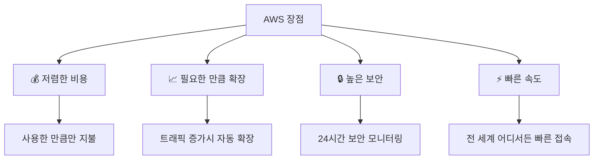

---

## AWS 글로벌 인프라 🌍

AWS는 전 세계에 컴퓨터 센터를 두고 서비스를 제공합니다.

### 🏢 인프라 구성
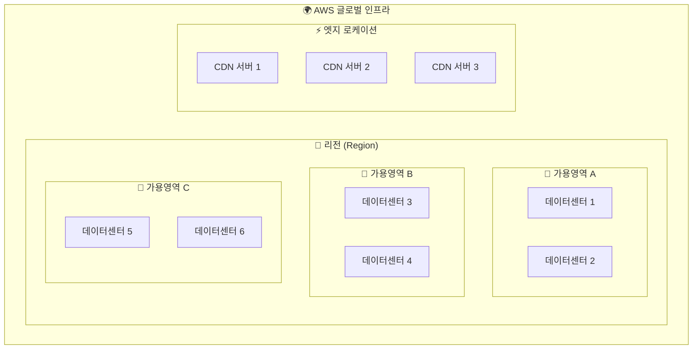

### 📍 1. 리전 (Region) - 현재 37개
> **쉬운 설명**: 전 세계 각 나라/지역에 있는 큰 컴퓨터 단지

#### 주요 리전 예시
| 리전 이름 | 코드 | 위치 | 🌟 현업에서 많이 쓰는 이유 |
|----------|------|------|------------------------|
| 서울 리전 | `ap-northeast-2` | 🇰🇷 대한민국 | 한국 사용자에게 가장 빠름 |
| 도쿄 리전 | `ap-northeast-1` | 🇯🇵 일본 | 아시아 서비스에 안정적 |
| 오하이오 리전 | `us-east-2` | 🇺🇸 미국 | 글로벌 서비스에 필수 |

#### 🎯 리전 선택 기준
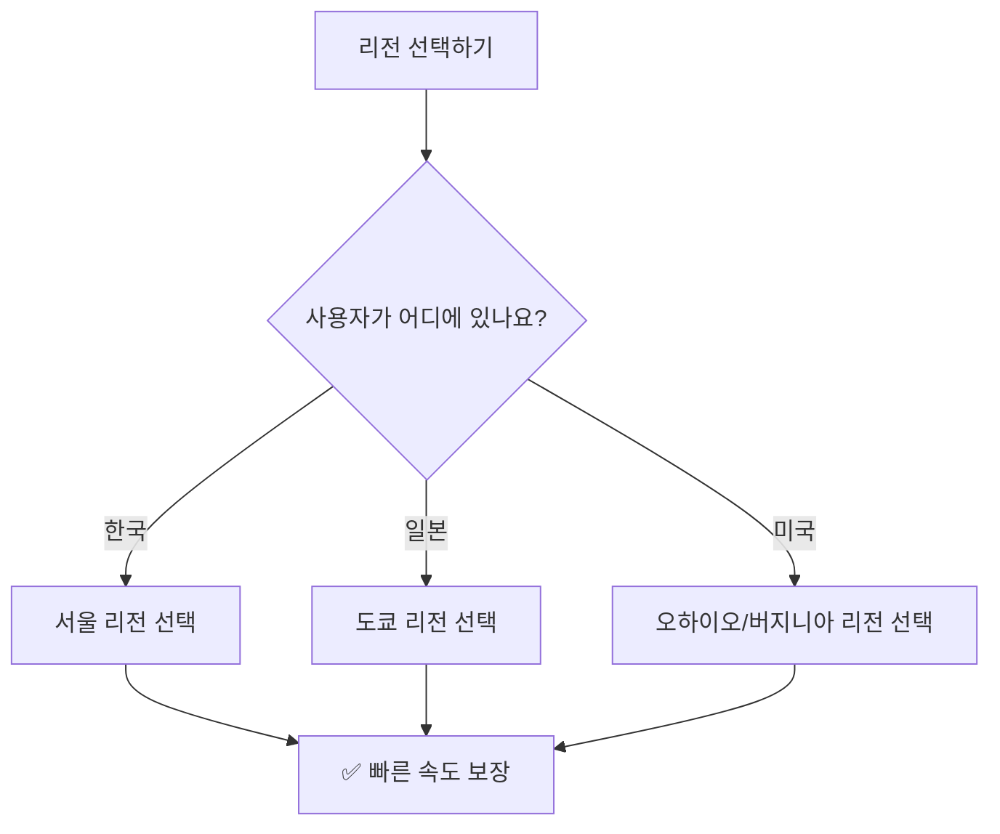

### 🏢 2. 가용영역 (AZ) - 현재 117개
> **쉬운 설명**: 한 지역 안에 있는 여러 개의 독립적인 컴퓨터 건물

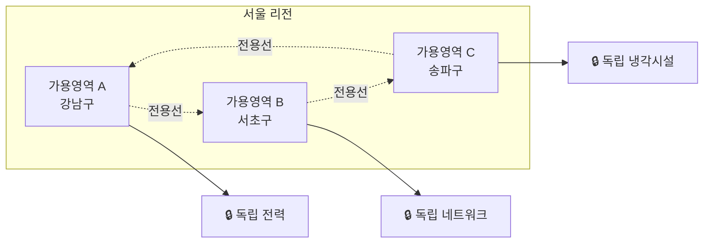

#### 💪 가용영역의 장점
- **장애 방지**: 한 건물에 문제가 생겨도 다른 건물은 정상 작동
- **현업 활용**: 중요한 서비스는 반드시 2개 이상 AZ에 배치

### ⚡ 3. 엣지 로케이션 - 현재 700개 이상
> **쉬운 설명**: 사용자 근처에 있는 작은 캐시 서버 (편의점 같은 개념)

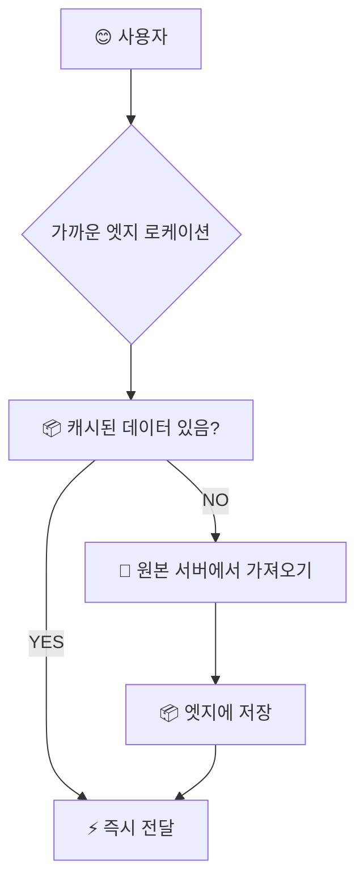

---

## 주요 AWS 서비스 🛠️

### 💻 1. 컴퓨팅 서비스

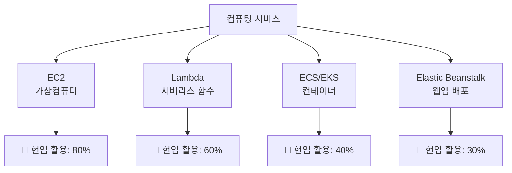

#### 🖥️ Amazon EC2 (Elastic Compute Cloud)
> **쉬운 설명**: 클라우드에서 빌려 쓰는 가상 컴퓨터

**현업에서 이렇게 사용해요:**
```python
# EC2 사용 예시 (개념 설명)
# 1. 인스턴스 생성
instance = create_ec2_instance(
    type="t3.medium",        # 컴퓨터 사양 (CPU 2개, 메모리 4GB)
    os="Ubuntu 22.04",       # 운영체제 선택
    storage="20GB",          # 하드디스크 크기
    region="ap-northeast-2"  # 서울 리전에 생성
)

# 2. 웹서버 설치 및 실행
install_web_server(instance)
start_application(instance)
```

**💰 EC2 요금 방식:**
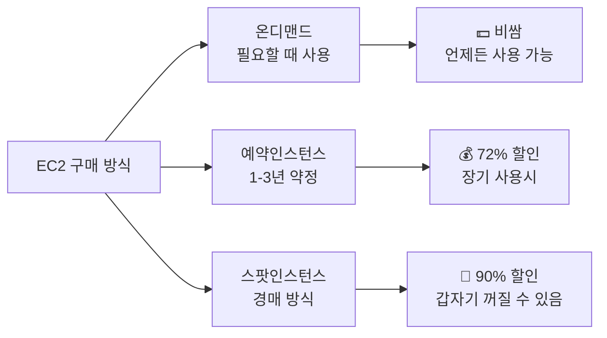

#### ⚖️ Elastic Load Balancing (ELB)
> **쉬운 설명**: 여러 서버에 일을 골고루 나눠주는 교통정리원

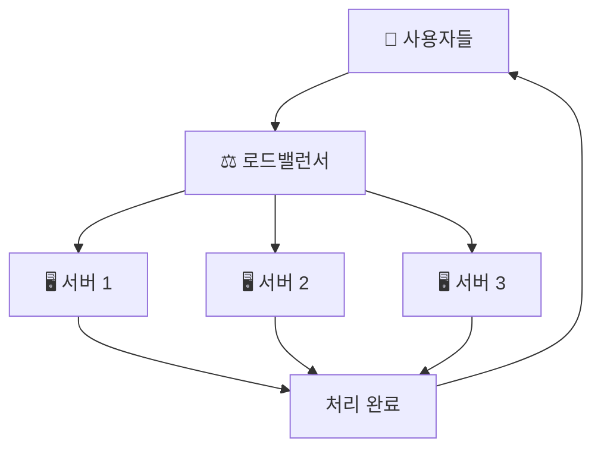

**현업 활용:**
- **쇼핑몰**: 블랙프라이데이 때 갑자기 몰린 고객들을 여러 서버로 분산
- **게임**: 동시 접속자가 많을 때 서버 과부하 방지

### 💾 2. 스토리지 서비스

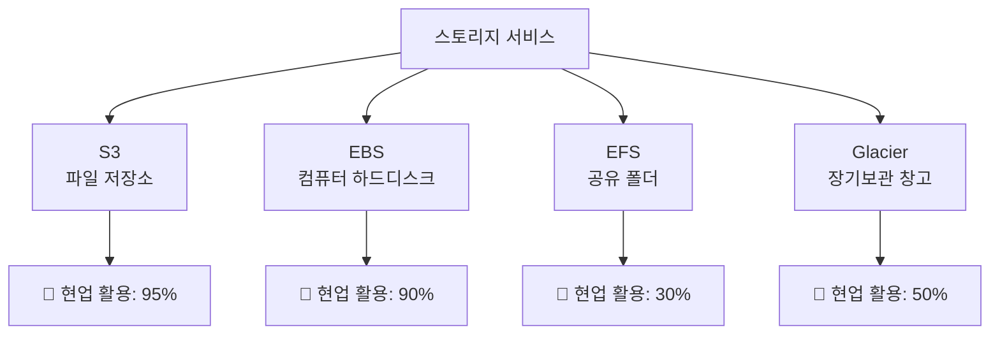

#### 🗂️ Amazon S3 (Simple Storage Service)
> **쉬운 설명**: 인터넷상의 무제한 파일 보관함

**현업에서 이렇게 사용해요:**
```python
# S3 사용 예시
# 1. 버킷(폴더) 생성
bucket = create_s3_bucket("my-company-files")

# 2. 파일 업로드
upload_file(
    bucket="my-company-files",
    file="product_image.jpg",
    path="images/products/"
)

# 3. 웹에서 접근 가능한 URL 생성
public_url = get_public_url("images/products/product_image.jpg")
# 결과: https://my-company-files.s3.ap-northeast-2.amazonaws.com/images/products/product_image.jpg
```

**실제 활용 사례:**
- **YouTube**: 동영상 파일 저장
- **Instagram**: 사진 저장
- **넷플릭스**: 영화 파일 저장

### 🗄️ 3. 데이터베이스 서비스

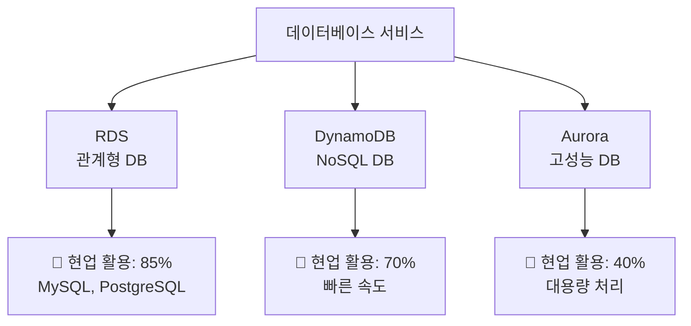

#### 🏪 Amazon RDS vs 직접 설치 비교

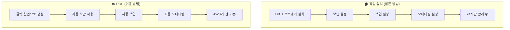

**현업에서 RDS를 선택하는 이유:**
- **시간 절약**: DB 관리 시간을 개발에 투자
- **안정성**: AWS 전문가들이 24시간 관리
- **비용 효율**: 관리 인력 비용 절약

### 🌐 4. 네트워킹 서비스

#### 🏠 Amazon VPC (Virtual Private Cloud)
> **쉬운 설명**: 클라우드 안에서 만드는 나만의 독립적인 네트워크 공간

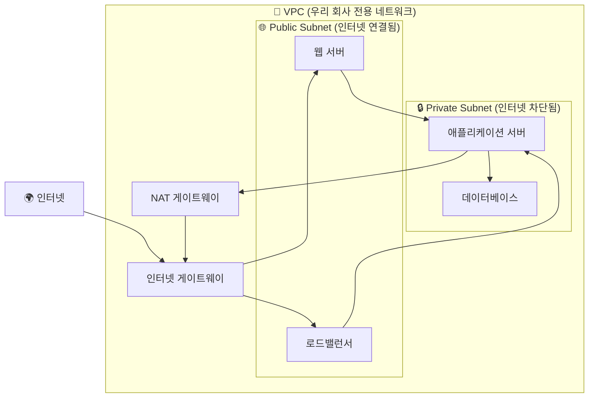

**현업 보안 구성:**
```python
# VPC 보안 설정 예시 (개념)
vpc_config = {
    "public_subnet": {
        "services": ["웹서버", "로드밸런서"],
        "internet_access": True,  # 인터넷에서 접근 가능
        "security": "기본 보안"
    },
    "private_subnet": {
        "services": ["데이터베이스", "백엔드 서버"],
        "internet_access": False,  # 인터넷에서 직접 접근 불가
        "security": "강화된 보안"
    }
}
```

---

## 보안 🔒

### 🛡️ AWS 공동 책임 모델

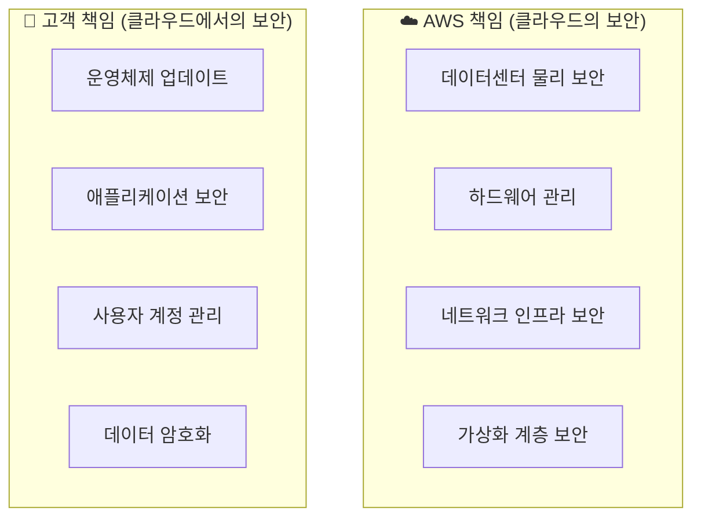

### 🔐 AWS IAM (Identity and Access Management)
> **쉬운 설명**: 회사의 출입카드 및 권한 관리 시스템

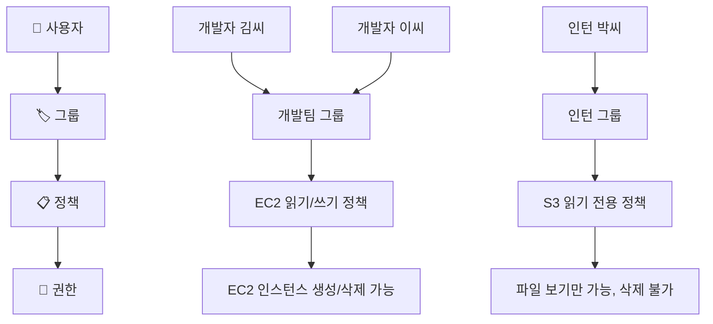

**현업 보안 원칙:**
```python
# IAM 최소 권한 원칙 예시
user_permissions = {
    "신입_개발자": [
        "s3:GetObject",      # 파일 읽기만 가능
        "ec2:DescribeInstances"  # 서버 목록 보기만 가능
    ],
    "시니어_개발자": [
        "s3:*",              # S3 모든 권한
        "ec2:*",             # EC2 모든 권한  
        "rds:CreateDatabase" # DB 생성 권한
    ],
    "인턴": [
        "s3:GetObject",      # 파일 읽기만
        "cloudwatch:GetMetrics"  # 모니터링 보기만
    ]
}
```

---

## 요금 💰

### 💳 AWS 요금 원리
> **쉬운 설명**: 전기세처럼 사용한 만큼만 내는 시스템

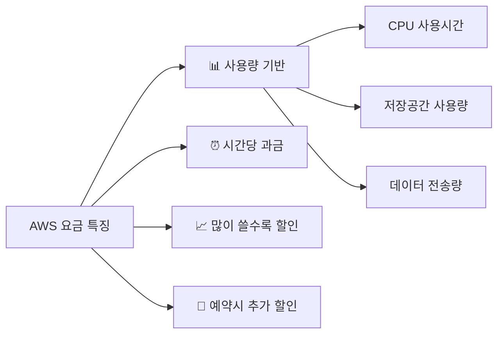

### 🖥️ EC2 요금 방식 비교

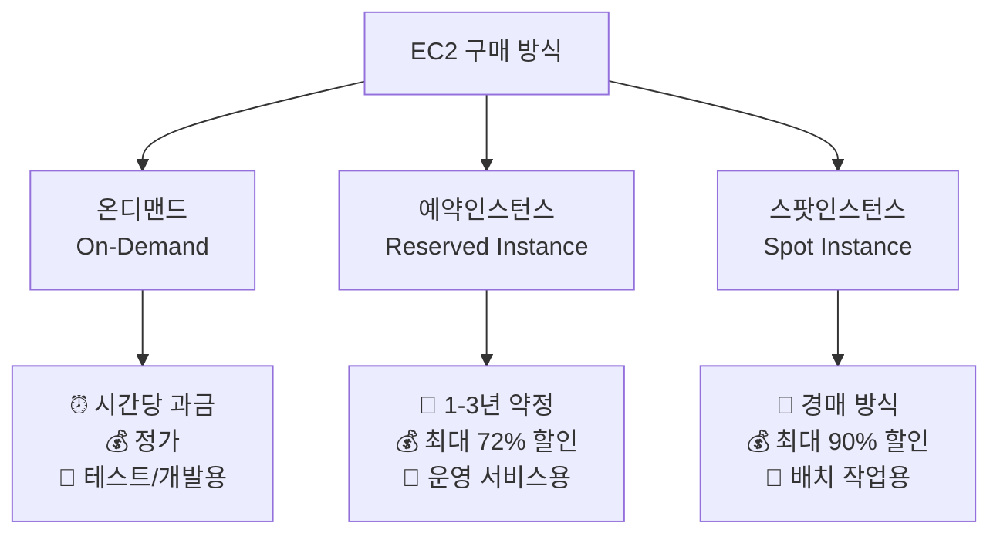

### 💡 현업 비용 최적화 팁

```python
# 현업에서 사용하는 비용 절약 전략
cost_optimization = {
    "개발환경": {
        "방식": "스팟 인스턴스",
        "절약": "90%",
        "이유": "갑자기 꺼져도 괜찮음"
    },
    "운영환경": {
        "방식": "예약 인스턴스", 
        "절약": "72%",
        "이유": "안정적으로 24시간 실행"
    },
    "임시작업": {
        "방식": "온디맨드",
        "절약": "0%",
        "이유": "잠깐만 사용하고 바로 삭제"
    }
}
```

---

## 🌟 현업에서 가장 많이 사용하는 서비스 TOP 10

### 📊 사용률 기준 순위

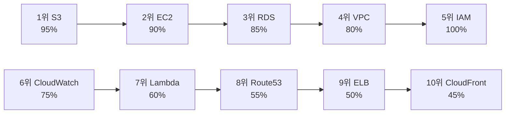

### 🏗️ 전형적인 현업 아키텍처

```mermaid
graph TB
    User[👥 사용자] --> CF[CloudFront CDN]
    CF --> LB[로드밸런서]
    
    subgraph VPC[🏠 VPC]
        subgraph Public[🌐 Public Subnet]
            LB --> Web1[웹서버 1]
            LB --> Web2[웹서버 2]
        end
        
        subgraph Private[🔒 Private Subnet]  
            Web1 --> App1[앱서버 1]
            Web2 --> App2[앱서버 2]
            App1 --> DB[(RDS 데이터베이스)]
            App2 --> DB
        end
    end
    
    App1 --> S3[S3 파일저장소]
    App2 --> S3
    
    CW[CloudWatch 모니터링] -.-> Web1
    CW -.-> App1
    CW -.-> DB
```

### 💼 업종별 주요 사용 서비스

| 업종 | 주요 서비스 | 사용 목적 |
|------|-------------|-----------|
| **🛒 이커머스** | S3 + CloudFront + RDS + EC2 | 상품이미지 저장 + 빠른 로딩 + 주문관리 + 웹서버 |
| **🎮 게임** | EC2 + DynamoDB + ElastiCache | 게임서버 + 실시간 점수 + 캐시 |
| **🏦 금융** | RDS + Lambda + KMS + CloudTrail | 거래데이터 + 자동화 + 암호화 + 감사로그 |
| **📱 모바일앱** | API Gateway + Lambda + DynamoDB | API 관리 + 서버리스 + 사용자데이터 |

---

## 🚀 AWS 시작하기 로드맵

### 🎯 단계별 학습 순서

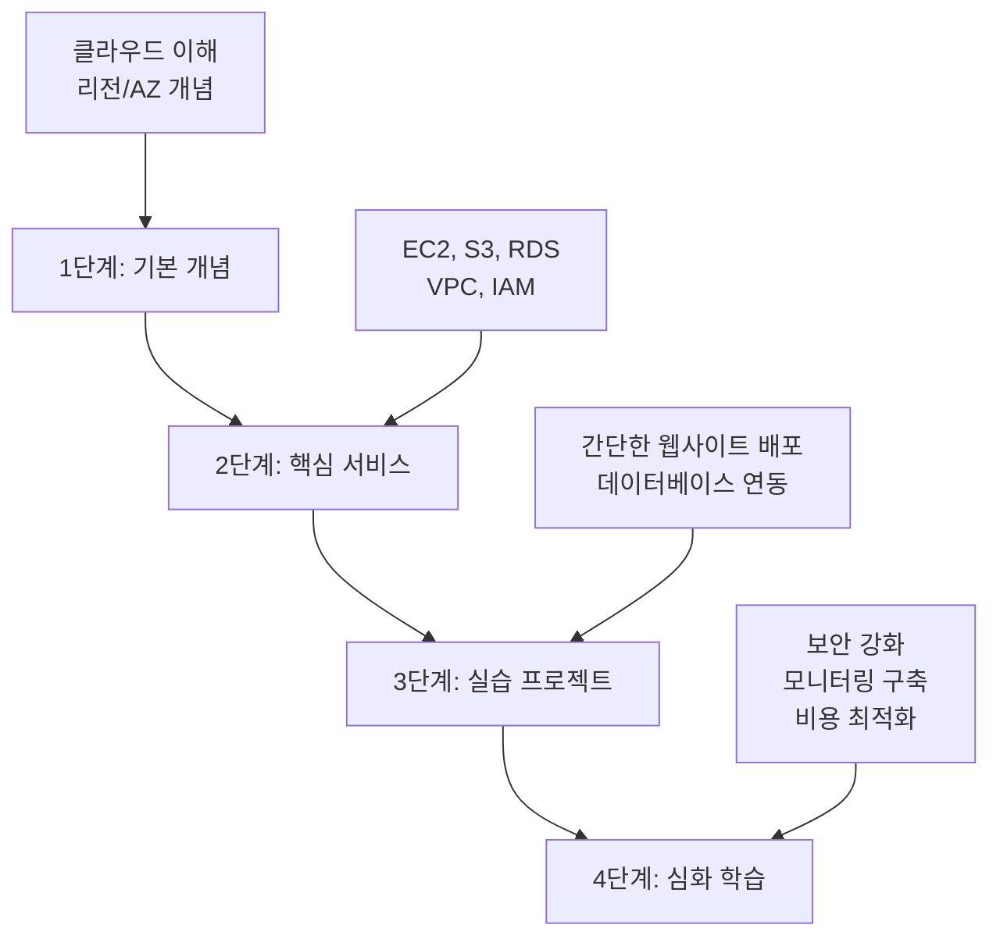

### 📚 추천 학습 자료

1. **공식 문서**: [AWS 한국어 문서](https://docs.aws.amazon.com/ko_kr/)
2. **실습 환경**: [AWS Free Tier](https://aws.amazon.com/ko/free/) (12개월 무료)
3. **요금 계산**: [AWS 요금 계산기](https://calculator.aws/#/)

---

## ❓ 자주 묻는 질문 (FAQ)

### Q: AWS는 얼마나 비싸나요?
**A**: 사용량에 따라 다르지만, Free Tier로 1년간 무료 사용 가능합니다.
- **개인 프로젝트**: 월 10-50달러
- **중소기업**: 월 100-1000달러  
- **대기업**: 월 10,000달러 이상

### Q: 어떤 서비스부터 배워야 하나요?
**A**: 이 순서로 학습하세요:
1. **EC2** (가상 컴퓨터) - 가장 기본
2. **S3** (파일 저장) - 가장 많이 사용  
3. **RDS** (데이터베이스) - 데이터 저장
4. **VPC** (네트워크) - 보안 설정

### Q: 실수로 큰 요금이 나올까 봐 걱정돼요
**A**: 걱정하지 마세요! 이렇게 예방하세요:
- **예산 알림** 설정 (10달러 초과시 이메일 알림)
- **Free Tier 모니터링** 활성화
- **불필요한 리소스 즉시 삭제**

---

## 🎉 마무리

AWS는 처음에는 어려워 보이지만, 하나씩 차근차근 배우면 누구나 사용할 수 있습니다. 

**기억할 점:**
- 🎯 **필요한 서비스만** 먼저 배우기
- 💰 **Free Tier** 적극 활용하기  
- 🛡️ **보안 설정** 잊지 않기
- 📊 **비용 모니터링** 습관화하기

**현업에서 가장 중요한 것은 "안정성"과 "보안"입니다.** 
화려한 기능보다는 기본을 탄탄히 하는 것이 성공의 열쇠입니다! 🔑

---
