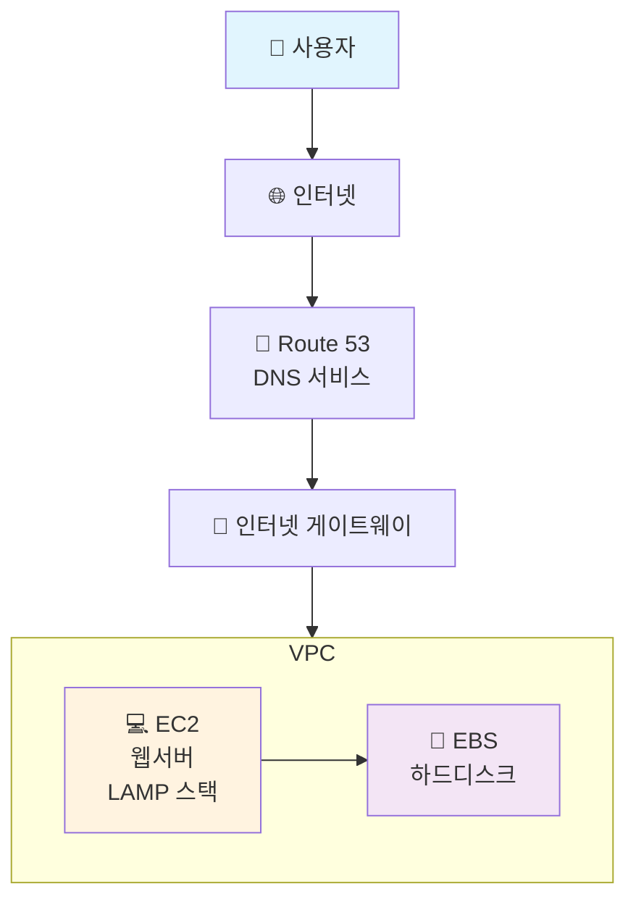
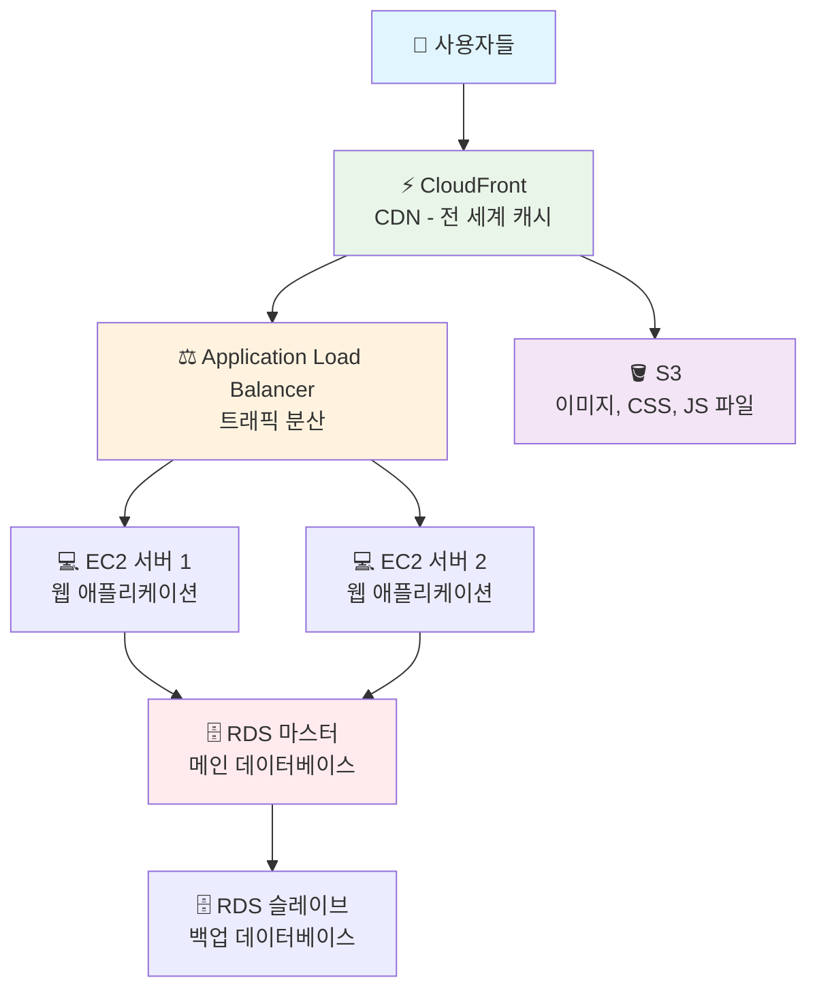
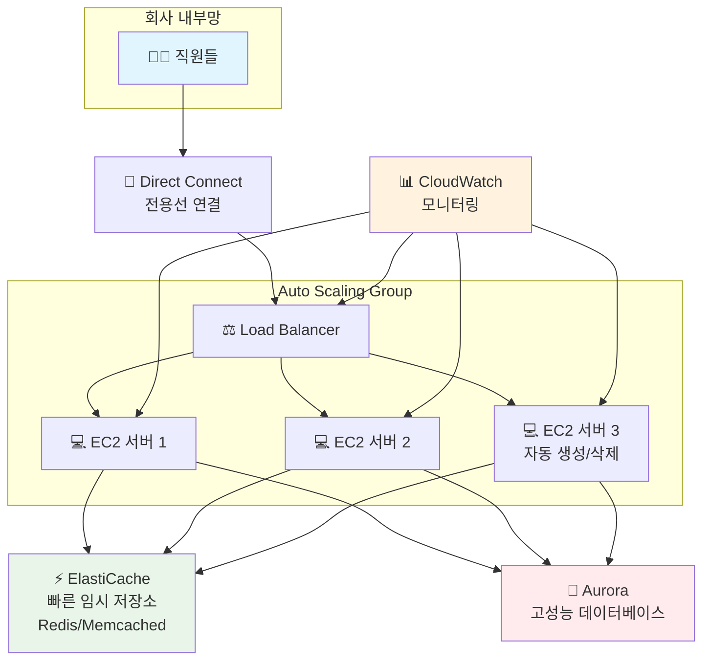
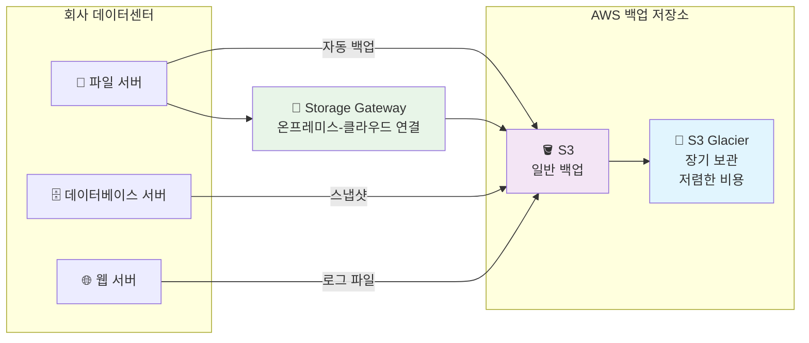
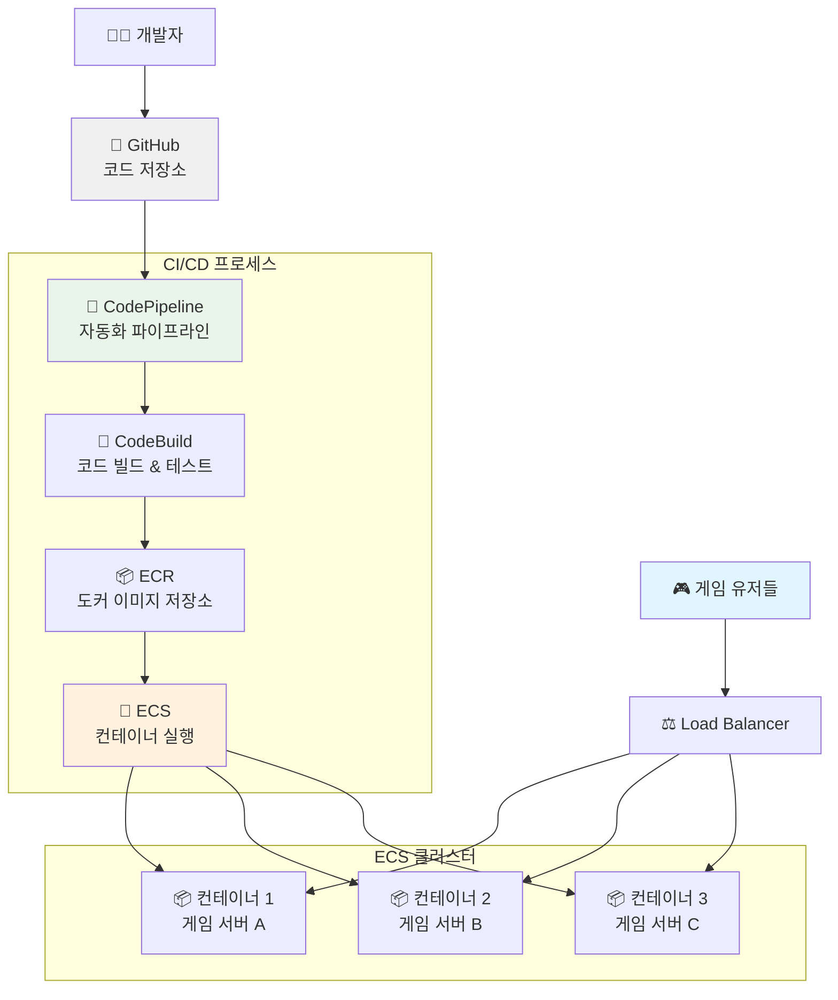
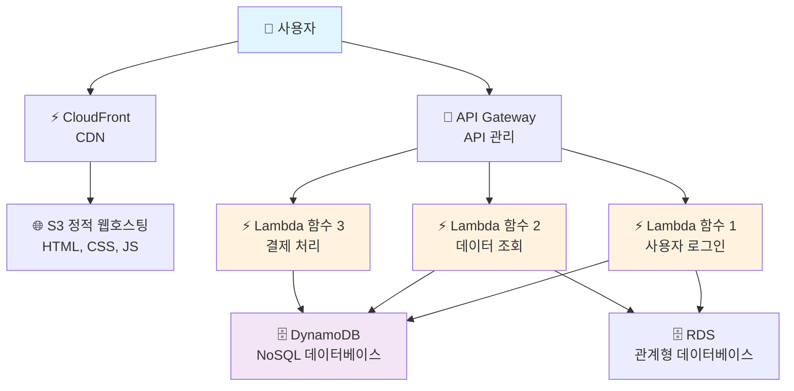
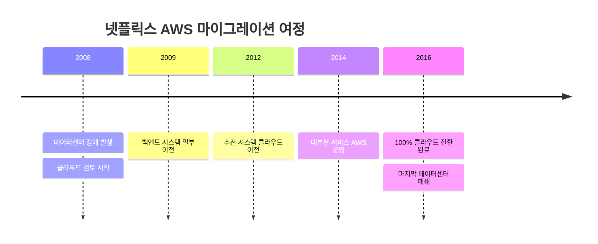
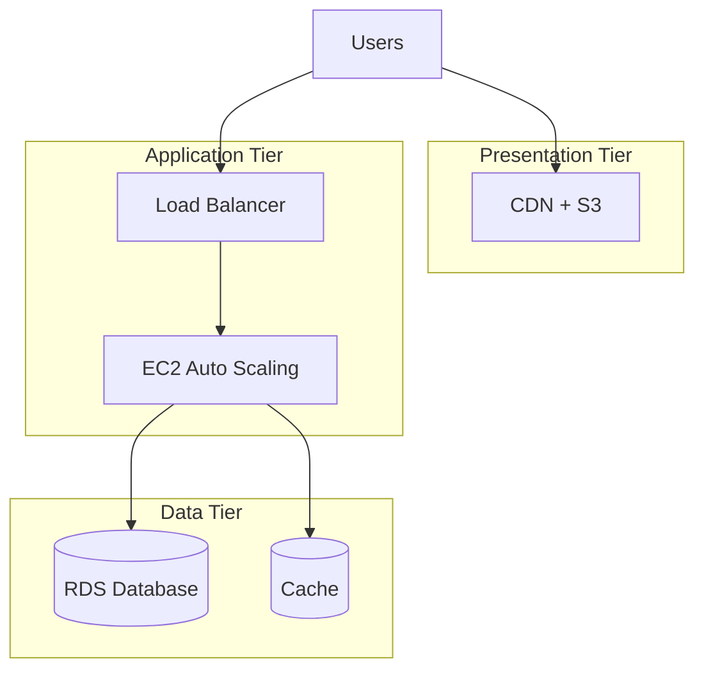
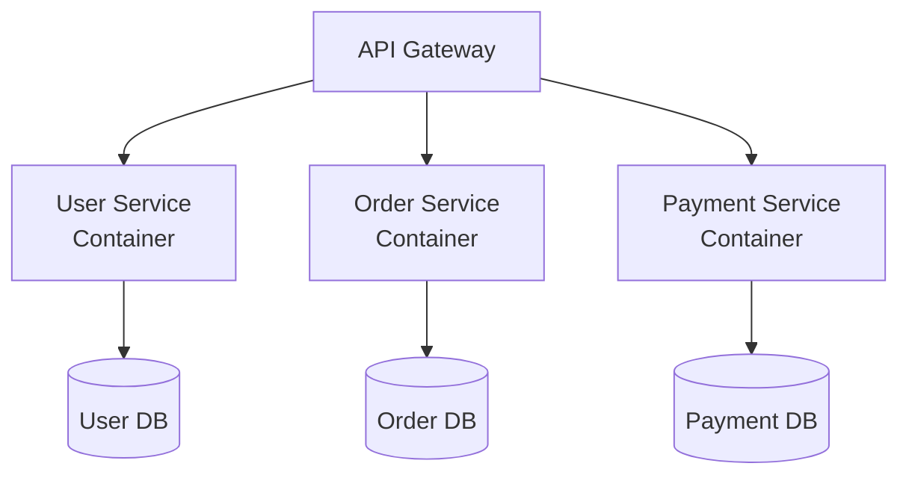

# AWS 클라우드 디자인 패턴 완전정리 📚

> 🎯 **목표**: 쉽게 이해할 수 있는 AWS 클라우드 패턴 가이드

## 📖 목차
1. [AWS 클라우드란 무엇인가?](#aws-클라우드란-무엇인가)
2. [6가지 핵심 디자인 패턴](#6가지-핵심-디자인-패턴)
3. [실제 기업 사례](#실제-기업-사례)
4. [현업에서 자주 사용하는 패턴](#현업에서-자주-사용하는-패턴)

---

## AWS 클라우드란 무엇인가? 🌩️

### 📍 비유로 이해하기
- **전통적인 방식**: 집에 발전기를 직접 설치하는 것
- **클라우드 방식**: 한국전력에서 전기를 가져다 쓰는 것

### 💡 AWS의 핵심 장점
- **필요할 때만 사용**: 전기처럼 쓴 만큼만 돈을 냄
- **언제든 확장 가능**: 갑자기 전력이 더 필요하면 바로 증설 가능
- **관리 불필요**: 발전소 관리는 한국전력이 알아서 해줌

---

## 6가지 핵심 디자인 패턴 🏗️

### 1️⃣ 이벤트 사이트 (단순한 웹사이트)

> 💡 **언제 사용?**: 한 달 한정 이벤트 페이지, 개인 블로그 등

#### 🏗️ 아키텍처 구조



#### 📦 사용 서비스 설명
```bash
# EC2 (Elastic Compute Cloud): 가상 컴퓨터
# - 마치 컴퓨터를 빌려 쓰는 것
# - 리눅스나 윈도우 선택 가능

# EBS (Elastic Block Store): 가상 하드디스크
# - EC2에 연결해서 파일 저장

# Route 53: 도메인 네임 서비스
# - www.example.com → IP주소 변환
# - 전화번호부 같은 역할

# VPC (Virtual Private Cloud): 가상 네트워크
# - 내 전용 네트워크 공간
# - 집의 인터넷 공유기 같은 역할
```

#### 💰 비용 예상 (서울 리전 기준)
- **EC2 t3.micro**: 월 약 1만원
- **EBS 8GB**: 월 약 1천원
- **총 예상**: 월 1.5만원 내외

---

### 2️⃣ 기업 웹사이트 (안정적이고 빠른 웹사이트)

> 💡 **언제 사용?**: 회사 홈페이지, 온라인 쇼핑몰 등

#### 🏗️ 아키텍처 구조



#### 📦 주요 서비스 역할
```bash
# CloudFront (CDN): 전 세계 캐시 서버
# - 한국 사용자 → 서울 캐시에서 빠르게 제공
# - 미국 사용자 → 버지니아 캐시에서 제공

# Load Balancer: 트래픽 분산기
# - 마치 톨게이트에서 차량을 여러 차선으로 분산
# - 서버 1대가 고장나도 다른 서버가 계속 서비스

# RDS (Relational Database Service): 관리형 데이터베이스
# - MySQL, PostgreSQL 등을 AWS가 관리
# - 백업, 업데이트를 자동으로 해줌

# S3 (Simple Storage Service): 파일 저장소
# - 이미지, 동영상, CSS, JS 파일 저장
# - 용량 제한이 거의 없음
```

#### 💰 비용 예상 (월 기준)
- **EC2 t3.medium × 2**: 월 약 12만원
- **RDS**: 월 약 8만원
- **CloudFront**: 월 약 2만원
- **총 예상**: 월 25만원 내외

---

### 3️⃣ 성능 중심 인트라넷 (회사 내부 시스템)

> 💡 **언제 사용?**: 회계시스템, 급여시스템, ERP 등

#### 🏗️ 아키텍처 구조



#### 📦 고성능을 위한 핵심 기술
```bash
# Auto Scaling: 자동 서버 증설/축소
# - 점심시간에 사용자 많아지면 서버 자동 증설
# - 야간에는 서버 자동 축소로 비용 절약

# ElastiCache: 초고속 임시 저장소
# - 자주 사용하는 데이터를 메모리에 저장
# - 데이터베이스보다 100배 빠름

# Aurora: AWS 전용 고성능 데이터베이스
# - 기존 MySQL보다 5배 빠름
# - 자동 백업, 자동 복구 기능

# Direct Connect: 전용선
# - 회사와 AWS를 직접 연결하는 전용선
# - 인터넷보다 빠르고 안정적
```

---

### 4️⃣ 백업 시스템 (데이터 보호)

> 💡 **언제 사용?**: 중요한 데이터의 안전한 보관

#### 🏗️ 아키텍처 구조



#### 📦 백업 전략
```bash
# S3: 기본 백업 저장소
# - 99.999999999% (11 9s) 내구성
# - 데이터가 절대 손실되지 않음

# S3 Glacier: 장기 보관용
# - S3보다 80% 저렴
# - 복구에 몇 시간 소요 (비상시에만 사용)

# 백업 자동화 스크립트 예시:
# #!/bin/bash
# aws s3 sync /home/data s3://my-backup-bucket/daily/
# aws rds create-db-snapshot --source-db-identifier mydb
```

---

### 5️⃣ 빠른 개발 환경 (CI/CD)

> 💡 **언제 사용?**: 게임 개발, 앱 개발 스타트업

#### 🏗️ 아키텍처 구조



#### 📦 개발 자동화 과정
```bash
# 1단계: 개발자가 코드 커밋
git add .
git commit -m "새로운 기능 추가"
git push origin main

# 2단계: CodePipeline이 자동으로 감지
# → CodeBuild에서 자동 빌드 및 테스트 실행

# 3단계: 테스트 통과 시 도커 이미지 생성
docker build -t my-game-server .
docker push my-ecr-repo/game-server:latest

# 4단계: ECS에서 무중단 배포 (Blue-Green)
# → 새 컨테이너 생성 → 테스트 → 기존 컨테이너 교체
```

#### 💡 컨테이너의 장점
- **표준화**: 개발 환경과 운영 환경이 동일
- **효율성**: 하나의 서버에 여러 게임 서비스 동시 운영
- **빠른 배포**: 몇 초 만에 새 버전 배포 가능

---

### 6️⃣ 서버리스 시스템 (서버 관리 없는 시스템)

> 💡 **언제 사용?**: 신규 서비스, 이벤트성 웹사이트

#### 🏗️ 아키텍처 구조



#### 📦 서버리스의 핵심 개념
```javascript
// Lambda 함수 예시 (Node.js)
exports.handler = async (event) => {
    // API Gateway에서 요청을 받음
    const userId = event.pathParameters.userId;
    
    // DynamoDB에서 사용자 정보 조회
    const user = await dynamodb.get({
        TableName: 'Users',
        Key: { userId: userId }
    }).promise();
    
    // 응답 반환
    return {
        statusCode: 200,
        body: JSON.stringify(user.Item)
    };
};
```

#### 💰 비용 효율성
```bash
# 기존 서버 방식: 24시간 서버 가동 = 월 10만원
# 서버리스 방식: 요청 있을 때만 실행 = 월 1만원

# Lambda 요금 계산:
# - 월 100만 요청: 무료
# - 실행 시간: 100만 GB-초까지 무료
# → 소규모 서비스는 거의 무료!
```

---

## 실제 기업 사례 🏢

### 🎬 넷플릭스 (Netflix)
- **마이그레이션 기간**: 2008년 → 2016년 (8년)
- **전환 규모**: 수천 대 서버 → 100% 클라우드
- **핵심 성과**: 
  - 전 세계 2억 사용자 서비스 안정화
  - 하루 수백 번의 배포 가능
  - 99.99% 가용성 달성



### 🏭 삼성전자
- **대상 시스템**: SAP ERP, HANA 데이터베이스
- **핵심 성과**: 
  - 분석 리포트 속도 3배 향상
  - 장애 복구 시간: 수 시간 → 수 분
  - 글로벌 법인 지원 체계 개선

### 📱 LG전자 (ThinQ 플랫폼)
- **전환 대상**: IoT 플랫폼 (1,000대 서버)
- **핵심 성과**:
  - 운영 비용 80% 절감
  - 개발자 인프라 관리 부담 해소
  - 전 세계 스마트 가전 연결 서비스

---

## 현업에서 자주 사용하는 패턴 ⭐

### 🥇 1위: 3-Tier 웹 아키텍처 (기업 웹사이트 패턴)


**🎯 사용 빈도**: 90%
**💡 이유**: 대부분의 웹서비스에 적용 가능한 범용 패턴

### 🥈 2위: 마이크로서비스 + 컨테이너 패턴


**🎯 사용 빈도**: 70%
**💡 이유**: 대규모 서비스 개발에 필수

### 🥉 3위: 서버리스 패턴
**🎯 사용 빈도**: 50%
**💡 이유**: 신규 서비스, 이벤트성 서비스에 적합

---

## AWS 기반 접근 방법 🛠️

### 🎯 단계별 접근 전략

#### 1단계: 학습 및 실습 (1-2개월)
```bash
# AWS 무료 계정 생성
aws configure  # CLI 설정

# 기본 서비스 실습
# - EC2 인스턴스 생성/종료
# - S3 버킷 생성/파일 업로드
# - RDS 데이터베이스 연결
```

#### 2단계: 간단한 프로젝트 구현 (1개월)
- **이벤트 사이트 패턴** 구현
- 정적 웹사이트 배포 (S3 + CloudFront)
- 간단한 REST API (Lambda + API Gateway)

#### 3단계: 실무 프로젝트 적용 (2-3개월)
- **3-Tier 아키텍처** 구현
- CI/CD 파이프라인 구축
- 모니터링 및 로깅 설정

### 💡 학습 순서 추천
1. **EC2, S3** (기본 컴퓨팅과 스토리지)
2. **VPC, Security Groups** (네트워크와 보안)
3. **RDS, DynamoDB** (데이터베이스)
4. **Lambda, API Gateway** (서버리스)
5. **CloudFormation** (인프라 자동화)
6. **ECS, EKS** (컨테이너)

### 📚 추천 학습 자료
- **AWS 공식 문서**: https://docs.aws.amazon.com/
- **AWS Training**: https://aws.amazon.com/training/
- **AWS 아키텍처 센터**: https://aws.amazon.com/architecture/
- **실습 예제**: AWS Well-Architected Framework

---

## 마무리 정리 📝

### ✅ 핵심 포인트
1. **단순함에서 시작**: 이벤트 사이트 → 기업 웹사이트 → 고성능 시스템 순서로 학습
2. **비용 관리가 중요**: 태깅, 예산 알림, 예약 인스턴스 활용
3. **보안 우선**: IAM, 암호화, 모니터링을 처음부터 고려
4. **자동화 필수**: Infrastructure as Code, CI/CD 파이프라인 구축

### 🚀 실무 적용 팁
- **작게 시작하기**: 핵심 기능부터 클라우드로 이전
- **점진적 확장**: 트래픽 증가에 따라 서비스 확장
- **모니터링 강화**: CloudWatch, 비용 분석 대시보드 활용
- **팀 역량 강화**: AWS 교육, 자격증 취득 권장

> 💡 **기억하세요**: 클라우드는 기술이 아닌 **비즈니스 전략**입니다!

---

### 📞 도움이 필요하다면?
- **AWS Support**: 기술 지원 및 컨설팅
- **AWS 파트너**: 구축 및 운영 지원
- **커뮤니티**: AWSKRUG, Stack Overflow 활용
