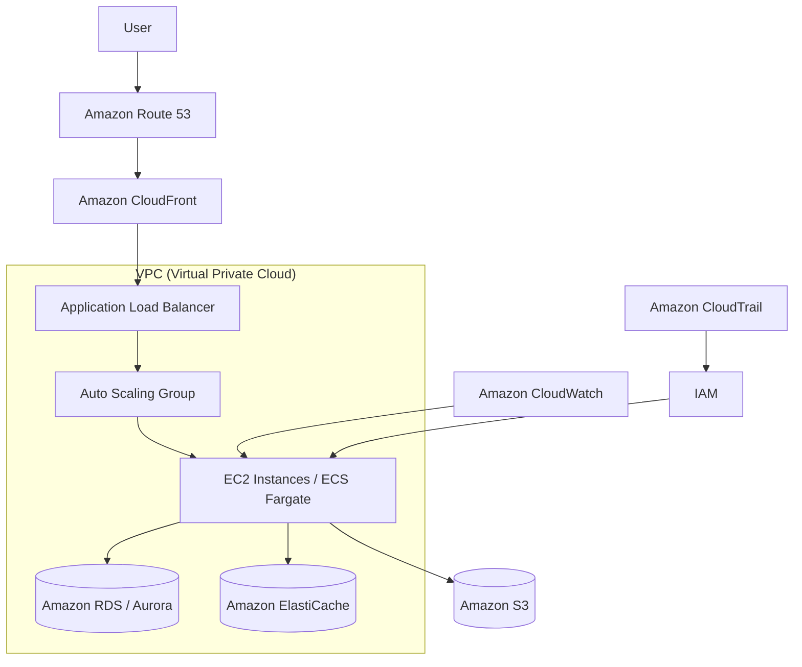

# 🏗️ AWS 아키텍처 구성도 상세 설명

---

## 1. 네트워크 계층 (VPC)

VPC (Virtual Private Cloud)
→ 전체 클라우드 네트워크를 격리된 가상 네트워크로 구성.
→ 퍼블릭 서브넷, 프라이빗 서브넷으로 나누어 보안과 접근 제어를 강화.

서브넷 (Subnet)

퍼블릭 서브넷: 인터넷 게이트웨이와 연결되어 외부에서 접근 가능 (주로 ALB, Bastion Host 배치).

프라이빗 서브넷: DB, 애플리케이션 서버가 위치하며 외부에서 직접 접근 불가.

보안 그룹 / NACL
→ 인스턴스 수준(Security Group), 서브넷 수준(Network ACL)에서 트래픽을 제어.
→ 예: 웹 서버는 80/443 허용, DB는 내부 포트만 허용.

## 2. 엣지 계층

Route 53 (DNS 서비스)
→ 사용자가 www.myapp.com으로 접속하면, AWS 내 ALB로 트래픽 라우팅.
→ 지리적 라우팅, 헬스 체크, 가용성 확보 가능.

CloudFront (CDN)
→ 정적 콘텐츠 (이미지, JS, CSS)를 캐싱해서 빠른 응답 제공.
→ 글로벌 엣지 로케이션을 통해 전 세계 사용자에게 저지연 서비스 제공.

## 3. 애플리케이션 계층

ALB (Application Load Balancer)
→ 여러 EC2 인스턴스 (또는 ECS, Fargate 서비스)로 요청을 분산 처리.
→ L7 레벨 로드밸런싱, HTTPS Termination, Path-based 라우팅 지원.

EC2 오토스케일링 그룹 (Auto Scaling Group)
→ 트래픽 증가 시 인스턴스를 자동으로 확장, 감소 시 축소.
→ 고가용성과 비용 최적화를 동시에 달성.

ECS / Fargate (선택적)
→ 서버리스 컨테이너 실행 환경.
→ EC2 대신 Fargate를 쓰면 인프라 관리가 필요 없음.

## 4. 데이터 계층

RDS (예: Amazon Aurora, MySQL, PostgreSQL)
→ 관리형 데이터베이스 서비스.
→ Multi-AZ 배포로 가용성 확보, 백업 자동화, 장애 시 자동 Failover.

S3 (Simple Storage Service)
→ 정적 파일 저장소 (이미지, 로그, 백업 등).
→ CloudFront와 연결하여 정적 콘텐츠 배포 가능.

ElastiCache (Redis/Memcached)
→ DB 앞단에 캐시 계층을 두어 성능 향상.
→ 세션 관리, 실시간 데이터 캐싱 등에 활용.

## 5. 운영 및 관리 계층

CloudWatch
→ 애플리케이션 및 인프라 모니터링, 로그 수집.
→ 알람을 SNS로 연계 가능.

CloudTrail
→ 계정 내 API 호출 기록, 보안/감사 추적.

IAM (Identity & Access Management)
→ 사용자/서비스 권한 관리.
→ 최소 권한 원칙 적용 (Principle of Least Privilege).

---

## ✨ 아키텍처 특징 요약

고가용성 (High Availability)

ALB + Auto Scaling + Multi-AZ RDS → 장애에도 안정적 서비스 유지.

보안 강화 (Security)

VPC 분리, 보안 그룹, IAM 역할 기반 접근 제어.

성능 최적화 (Performance)

CloudFront, ElastiCache 활용.

비용 효율화 (Cost Optimization)

Auto Scaling, S3/Glacier 아카이빙, Spot Instances 가능.

운영 편의성 (Operational Excellence)

CloudWatch/CloudTrail, IaC(CloudFormation, Terraform) 적용 가능.

---

👉 정리하자면, 이 아키텍처는 표준적인 3-Tier 구조 (Web - App - DB) 기반이고, AWS Well-Architected Framework의 5가지 요소(운영 우수성, 보안, 신뢰성, 성능 효율성, 비용 최적화)를 잘 반영한 설계입니다

---

### 📝 다이어그램 해설

사용자 → Route 53 → CloudFront → ALB

사용자가 도메인 접속하면 Route 53이 DNS를 해석하고, CloudFront를 통해 빠르고 안전하게 콘텐츠 전달.

ALB는 트래픽을 애플리케이션 서버로 분산.

Auto Scaling Group + EC2/ECS(Fargate)

트래픽 증가 시 인스턴스를 자동 확장.

컨테이너 기반 서비스면 ECS/Fargate로 대체 가능.

데이터 계층

RDS/Aurora: 관리형 데이터베이스, Multi-AZ로 고가용성 보장.

ElastiCache: Redis/Memcached 기반 캐시로 성능 향상.

S3: 정적 파일 및 백업 저장소.

운영 관리

CloudWatch: 성능 모니터링 및 알람.

CloudTrail: API 호출 추적 (감사/보안용).

IAM: 최소 권한 원칙으로 보안 강화.

👉 이렇게 하면 3-Tier 기반 AWS 아키텍처가 깔끔하게 시각화됩니다.
