# AWS 스토리지 완벽 가이드 🗄️

> 중학생도 이해할 수 있는 AWS 스토리지 설명서

---

## 📚 목차

1. [스토리지란 무엇인가요?](#1-%EC%8A%A4%ED%86%A0%EB%A6%AC%EC%A7%80%EB%9E%80-%EB%AC%B4%EC%97%87%EC%9D%B8%EA%B0%80%EC%9A%94)
2. [객체 스토리지 - Amazon S3](#2-%EA%B0%9D%EC%B2%B4-%EC%8A%A4%ED%86%A0%EB%A6%AC%EC%A7%80---amazon-s3)
3. [파일 스토리지 - EFS & FSx](#3-%ED%8C%8C%EC%9D%BC-%EC%8A%A4%ED%86%A0%EB%A6%AC%EC%A7%80---efs--fsx)
4. [데이터 마이그레이션 도구](#4-%EB%8D%B0%EC%9D%B4%ED%84%B0-%EB%A7%88%EC%9D%B4%EA%B7%B8%EB%A0%88%EC%9D%B4%EC%85%98-%EB%8F%84%EA%B5%AC)
5. [현업 활용 가이드](#5-%ED%98%84%EC%97%85-%ED%99%9C%EC%9A%A9-%EA%B0%80%EC%9D%B4%EB%93%9C)

---

## 1. 스토리지란 무엇인가요?

### 🎯 쉽게 이해하기

스토리지는 **디지털 창고**라고 생각하면 됩니다. 집에 물건을 보관하는 방법이 여러 가지인 것처럼, 클라우드에서도 데이터를 저장하는 방법이 여러 가지예요.


```mermaid
graph TB
    A[클라우드 스토리지] --> B[블록 스토리지]
    A --> C[파일 스토리지]
    A --> D[객체 스토리지]
    
    B --> B1["하드디스크처럼<br/>빠르고 직접 연결"]
    B --> B2["예: EBS"]
    
    C --> C1["폴더처럼<br/>여러 사람이 공유"]
    C --> C2["예: EFS, FSx"]
    
    D --> D1["사진첩처럼<br/>많은 파일 보관"]
    D --> D2["예: S3"]
    
    style A fill:#ff9999
    style B fill:#99ccff
    style C fill:#99ff99
    style D fill:#ffcc99
```

### 📝 스토리지 유형 비교

|유형|실생활 비유|AWS 서비스|언제 사용?|
|---|---|---|---|
|**블록 스토리지**|컴퓨터 하드디스크|EBS|프로그램이 빠르게 읽고 쓸 때|
|**파일 스토리지**|공유 폴더 (NAS)|EFS, FSx|여러 컴퓨터가 같이 쓸 때|
|**객체 스토리지**|사진 앨범, 창고|S3|많은 파일을 오래 보관할 때|

---

## 2. 객체 스토리지 - Amazon S3

### 🎨 S3는 무엇인가요?

**S3 = Simple Storage Service** (간단한 저장소 서비스)

사진, 동영상, 문서 등을 **무제한으로 저장**할 수 있는 인터넷 창고예요!


```mermaid
graph LR
    A[사용자] -->|파일 업로드| B[S3 버킷]
    B -->|저장| C[객체 1]
    B -->|저장| D[객체 2]
    B -->|저장| E[객체 3]
    
    C -.->|메타데이터| C1[파일명: photo.jpg<br/>크기: 2MB<br/>날짜: 2025-10-15]
    
    style B fill:#ff9900
    style C fill:#ffcc99
    style D fill:#ffcc99
    style E fill:#ffcc99
```

### 🏗️ S3의 핵심 구성요소


```mermaid
graph TD
    A[S3 전체 시스템] --> B[버킷 Bucket]
    B --> C[객체 Object]
    C --> D[키 Key]
    C --> E[값 Value]
    C --> F[메타데이터]
    
    B -.->|예시| B1["my-photo-bucket<br/>(전 세계에서 유일한 이름)"]
    D -.->|예시| D1["2025/photos/vacation.jpg<br/>(파일 경로)"]
    E -.->|예시| E1["실제 사진 파일 데이터"]
    F -.->|예시| F1["파일 크기, 업로드 날짜<br/>사용자 정의 태그"]
    
    style A fill:#ff6666
    style B fill:#ff9999
    style C fill:#ffcccc
```

#### 실제 코드로 이해하기


```python
# Python으로 S3에 파일 업로드하기
import boto3

# S3 연결 준비 (AWS와 연결하는 도구)
s3 = boto3.client('s3')

# 파일 업로드
s3.upload_file(
    'my_photo.jpg',           # 내 컴퓨터의 파일
    'my-photo-bucket',        # S3 버킷 이름 (창고 이름)
    '2025/photos/vacation.jpg' # S3에 저장될 경로 (Key)
)

# ✅ 이렇게 하면 파일이 클라우드에 저장됩니다!
```

### 💰 S3 스토리지 클래스 (저장 방법 선택하기)

**비유**: 집에 물건을 보관할 때도 방법이 달라요

- 자주 쓰는 물건 → 책상 위 (빠르지만 공간 차지)
- 가끔 쓰는 물건 → 서랍 (중간)
- 거의 안 쓰는 물건 → 창고 (느리지만 저렴)


```mermaid
graph TB
    A[S3 스토리지 클래스] --> B[Standard<br/>표준]
    A --> C[Standard-IA<br/>자주 안씀]
    A --> D[One Zone-IA<br/>한 곳에만]
    A --> E[Glacier<br/>아카이브]
    A --> F[Intelligent-Tiering<br/>자동 관리]
    
    B -.->|특징| B1["💸 비용: 높음<br/>⚡ 속도: 빠름<br/>📊 사용: 매일"]
    C -.->|특징| C1["💸 비용: 중간<br/>⚡ 속도: 빠름<br/>📊 사용: 월 1-2회"]
    D -.->|특징| D1["💸 비용: 저렴<br/>⚡ 속도: 빠름<br/>⚠️ 위험: 한 곳만 저장"]
    E -.->|특징| E1["💸 비용: 매우 저렴<br/>⏰ 속도: 느림<br/>📦 사용: 거의 안봄"]
    F -.->|특징| F1["🤖 자동으로<br/>적절한 곳으로 이동"]
    
    style B fill:#ff6666
    style C fill:#ff9999
    style D fill:#ffcc99
    style E fill:#99ccff
    style F fill:#99ff99
```

#### 📊 스토리지 클래스 상세 비교

|클래스|월 비용 (1GB 기준)|꺼내는 시간|언제 사용?|실생활 예시|
|---|---|---|---|---|
|**Standard**|$0.023|즉시|매일 보는 파일|웹사이트 이미지|
|**Standard-IA**|$0.0125|즉시|가끔 보는 파일|월별 보고서|
|**One Zone-IA**|$0.01|즉시|다시 만들 수 있는 파일|임시 백업|
|**Glacier Instant**|$0.004|즉시|자주는 아니지만 급할 수 있음|분기별 자료|
|**Glacier Flexible**|$0.0036|1분~5시간|거의 안 봄|오래된 로그|
|**Glacier Deep Archive**|$0.00099|12시간|법적 보관용|7년치 세금 자료|

#### 💡 현업 팁: 어떤 클래스를 선택해야 할까?


```python
# 실제 현업에서 사용하는 수명주기 정책 예시
lifecycle_policy = {
    "Rules": [
        {
            "Id": "자동 비용 절감 규칙",
            "Status": "Enabled",
            "Transitions": [
                {
                    # 30일 후: 자주 안 쓰는 저장소로 이동
                    "Days": 30,
                    "StorageClass": "STANDARD_IA"
                },
                {
                    # 90일 후: 아카이브로 이동
                    "Days": 90,
                    "StorageClass": "GLACIER"
                }
            ],
            "Expiration": {
                # 365일 후: 삭제
                "Days": 365
            }
        }
    ]
}

# ✅ 이렇게 설정하면 자동으로 비용이 절감됩니다!
# 30일 지난 파일: 50% 절약
# 90일 지난 파일: 84% 절약
```

### 🔄 버전 관리 (Versioning)

**비유**: 워드 문서의 "변경 내용 추적" 기능과 같아요!


```mermaid
sequenceDiagram
    participant User as 사용자
    participant S3 as S3 버킷
    
    User->>S3: report.pdf 업로드 (버전 1)
    Note over S3: Version ID: abc123
    
    User->>S3: report.pdf 수정 후 업로드 (버전 2)
    Note over S3: Version ID: def456<br/>⚠️ 버전 1은 그대로 유지!
    
    User->>S3: report.pdf 삭제
    Note over S3: Delete Marker 생성<br/>⚠️ 실제로는 삭제 안됨!
    
    User->>S3: 버전 1 복구 요청
    S3-->>User: report.pdf (버전 1) 복원
```

#### 코드로 버전 관리 활용하기


```python
import boto3

s3 = boto3.client('s3')

# 1️⃣ 버전 관리 활성화
s3.put_bucket_versioning(
    Bucket='my-bucket',
    VersioningConfiguration={'Status': 'Enabled'}
)

# 2️⃣ 특정 버전 가져오기
response = s3.get_object(
    Bucket='my-bucket',
    Key='report.pdf',
    VersionId='abc123'  # 이전 버전 ID
)

# 3️⃣ 모든 버전 목록 보기
versions = s3.list_object_versions(
    Bucket='my-bucket',
    Prefix='report.pdf'
)

# ✅ 실수로 삭제해도 복구 가능!
```

### 🔐 S3 보안 및 권한 관리

mermaid

```mermaid
graph TD
    A[S3 보안 계층] --> B[IAM 정책]
    A --> C[버킷 정책]
    A --> D[ACL]
    A --> E[암호화]
    
    B -.->|누가| B1["특정 사용자/역할만<br/>접근 가능"]
    C -.->|무엇을| C1["버킷 전체 또는<br/>특정 폴더만 공개"]
    D -.->|개별| D1["파일 하나하나<br/>권한 설정"]
    E -.->|보호| E1["저장/전송 시<br/>암호화"]
    
    style A fill:#ff6666
    style B fill:#99ccff
    style C fill:#99ff99
    style D fill:#ffcc99
    style E fill:#ff9999
```

#### 실전 보안 설정 예시


```json
{
  "Version": "2012-10-17",
  "Statement": [
    {
      "Sid": "웹사이트 이미지 공개",
      "Effect": "Allow",
      "Principal": "*",
      "Action": "s3:GetObject",
      "Resource": "arn:aws:s3:::my-website-bucket/images/*"
    },
    {
      "Sid": "관리자만 업로드 가능",
      "Effect": "Allow",
      "Principal": {
        "AWS": "arn:aws:iam::123456789012:user/admin"
      },
      "Action": "s3:PutObject",
      "Resource": "arn:aws:s3:::my-website-bucket/*"
    }
  ]
}
```

**설명**:

- 첫 번째 규칙: 누구나 images 폴더의 사진을 볼 수 있음
- 두 번째 규칙: admin 사용자만 파일을 올릴 수 있음

### 🚀 S3 고급 기능

#### 1. 정적 웹사이트 호스팅


```mermaid
graph LR
    A[웹 브라우저] -->|http 요청| B[S3 버킷]
    B -->|HTML 전송| A
    B --> C[index.html]
    B --> D[style.css]
    B --> E[images/]
    
    style B fill:#ff9900
```


```html
<!-- index.html 예시 -->
<!DOCTYPE html>
<html>
<head>
    <title>내 첫 S3 웹사이트</title>
</head>
<body>
    <h1>안녕하세요! 👋</h1>
    <p>이 페이지는 S3에서 호스팅됩니다.</p>
    
</body>
</html>

<!-- 
✅ 이 파일을 S3에 업로드하고 
   "정적 웹사이트 호스팅"을 활성화하면
   웹사이트가 완성됩니다!
-->
```

#### 2. 이벤트 알림


```mermaid
sequenceDiagram
    participant User as 사용자
    participant S3 as S3 버킷
    participant Lambda as Lambda 함수
    participant SNS as 이메일 알림
    
    User->>S3: 사진 업로드
    S3->>Lambda: 이벤트 발생!
    Lambda->>Lambda: 썸네일 생성
    Lambda->>S3: 썸네일 저장
    Lambda->>SNS: 완료 알림
    SNS->>User: 📧 이메일 전송
```


```python
# Lambda 함수 예시 (자동 썸네일 생성)
import boto3
from PIL import Image
import io

def lambda_handler(event, context):
    # S3에서 업로드된 파일 정보 가져오기
    bucket = event['Records'][0]['s3']['bucket']['name']
    key = event['Records'][0]['s3']['object']['key']
    
    # 원본 이미지 다운로드
    s3 = boto3.client('s3')
    response = s3.get_object(Bucket=bucket, Key=key)
    image = Image.open(response['Body'])
    
    # 썸네일 생성 (200x200 크기로)
    image.thumbnail((200, 200))
    
    # 썸네일 저장
    buffer = io.BytesIO()
    image.save(buffer, 'JPEG')
    buffer.seek(0)
    
    # S3에 썸네일 업로드
    thumbnail_key = f"thumbnails/{key}"
    s3.put_object(
        Bucket=bucket,
        Key=thumbnail_key,
        Body=buffer,
        ContentType='image/jpeg'
    )
    
    # ✅ 사진 업로드하면 자동으로 썸네일이 생성됩니다!
    return {'statusCode': 200}
```

---

## 3. 파일 스토리지 - EFS & FSx

### 📁 EFS (Elastic File System)

**비유**: 학교 공유 폴더처럼 여러 컴퓨터가 동시에 같은 폴더를 사용할 수 있어요!


```mermaid
graph TD
    A[EFS 파일 시스템] --> B[EC2 인스턴스 1]
    A --> C[EC2 인스턴스 2]
    A --> D[EC2 인스턴스 3]
    
    B -.->|동시에| E["/shared/data"]
    C -.->|접근| E
    D -.->|가능| E
    
    E --> F[파일1.txt]
    E --> G[파일2.jpg]
    E --> H[폴더/]
    
    style A fill:#99ff99
    style B fill:#99ccff
    style C fill:#99ccff
    style D fill:#99ccff
```

#### EFS 사용 예시


```bash
# EC2 인스턴스에 EFS 마운트하기

# 1️⃣ 필요한 도구 설치
sudo yum install -y amazon-efs-utils

# 2️⃣ 마운트 포인트 생성
sudo mkdir /mnt/efs

# 3️⃣ EFS 연결
sudo mount -t efs fs-12345678:/ /mnt/efs

# 4️⃣ 이제 /mnt/efs 폴더를 여러 서버가 공유합니다!
cd /mnt/efs
echo "안녕하세요" > shared_file.txt

# ✅ 다른 EC2에서도 이 파일을 볼 수 있어요!
```

### 🏢 FSx (다양한 파일 시스템)


```mermaid
graph TB
    A[FSx 패밀리] --> B[FSx for Windows]
    A --> C[FSx for Lustre]
    A --> D[FSx for NetApp ONTAP]
    A --> E[FSx for OpenZFS]
    
    B -.->|용도| B1["Windows 서버<br/>파일 공유<br/>Active Directory"]
    C -.->|용도| C1["머신러닝<br/>고성능 컴퓨팅<br/>대용량 분석"]
    D -.->|용도| D1["기업용 NAS<br/>하이브리드 클라우드<br/>SAP, Oracle"]
    E -.->|용도| E1["Linux/Unix<br/>DevOps<br/>스냅샷 관리"]
    
    style A fill:#ff6666
    style B fill:#99ccff
    style C fill:#99ff99
    style D fill:#ffcc99
    style E fill:#ff9999
```

### 📊 EFS vs FSx vs EBS vs S3 비교


```mermaid
graph TB
    A[저장소 선택 가이드] --> B{여러 서버가<br/>동시 접근?}
    
    B -->|Yes| C{어떤 OS?}
    B -->|No| D{무엇을 저장?}
    
    C -->|Linux| E[EFS 추천]
    C -->|Windows| F[FSx for Windows]
    C -->|고성능 필요| G[FSx for Lustre]
    
    D -->|디스크<br/>데이터베이스| H[EBS 추천]
    D -->|파일<br/>백업| I[S3 추천]
    
    style E fill:#99ff99
    style F fill:#99ccff
    style G fill:#ff9999
    style H fill:#ffcc99
    style I fill:#ff9900
```

|기준|EBS|EFS|FSx|S3|
|---|---|---|---|---|
|**연결 방식**|1:1 (한 서버만)|N:N (여러 서버)|N:N (여러 서버)|HTTP/API|
|**사용 예**|데이터베이스|웹서버 공유|Windows 공유|백업, 이미지|
|**확장성**|수동|자동|수동|무제한|
|**비용**|중간|높음|높음|저렴|
|**속도**|매우 빠름|빠름|매우 빠름|보통|

---

## 4. 데이터 마이그레이션 도구

### 🚚 데이터를 클라우드로 옮기는 방법


```mermaid
graph TD
    A[온프레미스<br/>데이터센터] --> B{데이터 크기}
    
    B -->|작음<br/>1TB 이하| C[인터넷 직접 전송]
    B -->|중간<br/>1TB~50TB| D[AWS DataSync]
    B -->|큼<br/>50TB~PB| E[AWS Snowball]
    B -->|초대형<br/>EB급| F[AWS Snowmobile]
    
    C --> G[S3, EFS로 업로드]
    D --> G
    E --> H[물리적 장비 배송]
    F --> H
    
    style A fill:#ff6666
    style C fill:#99ff99
    style D fill:#99ccff
    style E fill:#ffcc99
    style F fill:#ff9999
```

### 🌉 Storage Gateway (하이브리드 스토리지)

**비유**: 집과 사무실을 연결하는 다리 같은 역할!


```mermaid
graph LR
    A[온프레미스<br/>데이터센터] -->|네트워크| B[Storage Gateway]
    B -->|암호화 전송| C[AWS 클라우드]
    
    B --> B1[File Gateway]
    B --> B2[Volume Gateway]
    B --> B3[Tape Gateway]
    
    B1 -.->|NFS/SMB| D[S3 버킷]
    B2 -.->|iSCSI| E[EBS 스냅샷]
    B3 -.->|가상 테이프| F[S3 Glacier]
    
    style A fill:#ff9999
    style B fill:#99ccff
    style C fill:#99ff99
```

#### Storage Gateway 사용 예시


```python
# File Gateway 설정 (Python SDK)
import boto3

# Storage Gateway 클라이언트 생성
sg = boto3.client('storagegateway')

# File Gateway 생성
response = sg.create_nfs_file_share(
    GatewayARN='arn:aws:storagegateway:...',
    LocationARN='arn:aws:s3:::my-backup-bucket',
    Role='arn:aws:iam::...:role/StorageGatewayRole',
    ClientList=['0.0.0.0/0'],  # 접근 허용 IP
    DefaultStorageClass='S3_STANDARD_IA'  # 저장 클래스
)

# ✅ 이제 온프레미스에서 S3를 로컬 폴더처럼 사용 가능!
```

### ⚡ AWS DataSync (고속 데이터 전송)


```mermaid
sequenceDiagram
    participant On as 온프레미스<br/>NFS 서버
    participant Agent as DataSync<br/>에이전트
    participant AWS as AWS<br/>S3/EFS
    
    On->>Agent: 1. 파일 스캔
    Agent->>Agent: 2. 변경된 파일만 선택
    Agent->>AWS: 3. 암호화 전송 (10배 빠름)
    AWS->>AWS: 4. 무결성 검증
    AWS-->>Agent: 5. 완료 알림
    Agent-->>On: 6. 동기화 완료
```

#### DataSync 설정 예시


```python
# DataSync 작업 생성
import boto3

datasync = boto3.client('datasync')

# 소스 위치 (온프레미스 NFS)
source_location = datasync.create_location_nfs(
    ServerHostname='192.168.1.100',
    Subdirectory='/data',
    OnPremConfig={
        'AgentArns': ['arn:aws:datasync:...:agent/...']
    }
)

# 대상 위치 (S3)
destination_location = datasync.create_location_s3(
    S3BucketArn='arn:aws:s3:::my-bucket',
    Subdirectory='/backup'
)

# 동기화 작업 생성
task = datasync.create_task(
    SourceLocationArn=source_location['LocationArn'],
    DestinationLocationArn=destination_location['LocationArn'],
    Schedule={
        'ScheduleExpression': 'cron(0 2 * * ? *)'  # 매일 새벽 2시
    }
)

# ✅ 매일 밤 자동으로 백업됩니다!
```

### 📦 AWS Snow 패밀리 (물리적 데이터 전송)


```mermaid
graph TB
    A[Snow 패밀리] --> B[Snowcone<br/>8TB]
    A --> C[Snowball Edge<br/>80TB]
    A --> D[Snowmobile<br/>100PB]
    
    B -.->|크기| B1["노트북만한 크기<br/>휴대 가능<br/>드론, IoT용"]
    C -.->|크기| C1["여행가방 크기<br/>트럭 배송<br/>데이터센터용"]
    D -.->|크기| D1["트럭 통째로<br/>엑사바이트급<br/>초대형 마이그레이션"]
    
    style B fill:#99ff99
    style C fill:#99ccff
    style D fill:#ff9999
```

#### Snow 사용 시나리오

**예시**: 100TB의 영상 파일을 AWS로 옮기기


```python
# ❌ 인터넷으로 전송 시
속도 = 100 Mbps  # 일반적인 기업 인터넷
용량 = 100 TB = 100,000 GB = 800,000,000 Mb
시간 = 800,000,000 / 100 = 8,000,000초 = 92일 🐌

# ✅ Snowball 사용 시
배송 = 2일
복사 = 1일 (로컬 고속 네트워크)
반송 = 2일
총 시간 = 5일 🚀

# 💰 비용 비교
인터넷_전송비 = 약 $9,000 (S3 전송 요금)
Snowball_비용 = 약 $300 (10일 대여)
```

---

## 5. 현업 활용 가이드

### 🏆 가장 많이 사용하는 서비스 TOP 3


```mermaid
pie title 현업에서 가장 많이 사용하는 AWS 스토리지
    "S3" : 50
    "EBS" : 30
    "EFS" : 15
    "기타" : 5
```

### 📱 실전 사용 사례

#### 1️⃣ 스타트업 웹 서비스


```mermaid
graph LR
    A[사용자] -->|웹 접속| B[CloudFront CDN]
    B --> C[S3<br/>정적 콘텐츠]
    B --> D[EC2<br/>웹 서버]
    D --> E[RDS<br/>데이터베이스]
    D --> F[S3<br/>사용자 업로드]
    
    style C fill:#ff9900
    style F fill:#ff9900
```

**사용 서비스**:

- **S3**: 이미지, CSS, JS 파일 저장
- **CloudFront**: 전 세계 빠른 전송
- **EBS**: 데이터베이스용 디스크


```python
# 사용자 프로필 사진 업로드 처리
def upload_profile_picture(user_id, file):
    s3 = boto3.client('s3')
    
    # 파일명 생성 (중복 방지)
    filename = f"profiles/{user_id}/{uuid.uuid4()}.jpg"
    
    # S3에 업로드
    s3.upload_fileobj(
        file,
        'my-app-bucket', filename, ExtraArgs={ 'ContentType': 'image/jpeg', 'CacheControl': 'max-age=31536000', # 1년 캐싱 'ACL': 'public-read' # 공개 읽기 } )
        
       # CloudFront URL 생성
url = f"https://cdn.myapp.com/{filename}"


       # ✅ 사용자에게 URL 반환
return url
        
```


#### 2️⃣ 미디어 & 엔터테인먼트
```mermaid
graph TB
    A[원본 영상<br/>업로드] --> B[S3<br/>Standard]
    B --> C[Lambda<br/>트리거]
    C --> D[MediaConvert<br/>인코딩]
    D --> E[S3<br/>Standard]
    D --> F[S3<br/>Glacier]
    E --> G[CloudFront<br/>스트리밍]
    
    style B fill:#ff9900
    style E fill:#ff9900
    style F fill:#99ccff
```

**워크플로우**:
1. 고화질 원본 → S3 Standard
2. 자동 인코딩 (여러 해상도 생성)
3. 스트리밍용 → S3 Standard
4. 원본 백업 → S3 Glacier (저렴한 장기 보관)
```python
# 영상 업로드 후 자동 처리
def process_video(event, context):
    # S3 이벤트에서 파일 정보 가져오기
    bucket = event['Records'][0]['s3']['bucket']['name']
    key = event['Records'][0]['s3']['object']['key']
    
    # MediaConvert 작업 생성
    mediaconvert = boto3.client('mediaconvert')
    
    job = mediaconvert.create_job(
        Role='arn:aws:iam::...:role/MediaConvertRole',
        Settings={
            'Inputs': [{
                'FileInput': f's3://{bucket}/{key}'
            }],
            'OutputGroups': [
                {
                    'Name': 'HLS 스트리밍',
                    'OutputGroupSettings': {
                        'Type': 'HLS_GROUP_SETTINGS',
                        'Destination': f's3://{bucket}/streaming/'
                    },
                    'Outputs': [
                        {'VideoDescription': {'Width': 1920, 'Height': 1080}},  # Full HD
                        {'VideoDescription': {'Width': 1280, 'Height': 720}},   # HD
                        {'VideoDescription': {'Width': 640, 'Height': 360}}     # SD
                    ]
                }
            ]
        }
    )
    
    # 원본은 30일 후 Glacier로 이동 (수명주기 정책)
    # ✅ 자동으로 3가지 화질 생성!
```

#### 3️⃣ 빅데이터 & 분석
```mermaid
graph LR
    A[IoT 센서] -->|실시간| B[Kinesis]
    B --> C[Lambda]
    C --> D[S3 Data Lake]
    
    E[웹 로그] --> D
    F[데이터베이스<br/>백업] --> D
    
    D --> G[Athena<br/>SQL 쿼리]
    D --> H[Glue<br/>ETL]
    H --> I[Redshift<br/>데이터 웨어하우스]
    
    style D fill:#ff9900
```

**데이터 레이크 구조**:
```
s3://my-datalake/
├── raw/                    # 원본 데이터
│   ├── 2025/10/15/
│   └── 2025/10/16/
├── processed/              # 처리된 데이터
│   └── parquet/
└── archive/                # 아카이브 (Glacier)
    └── 2024/
```
```python
# 데이터 레이크 쿼리 (Athena)
import boto3

athena = boto3.client('athena')

# SQL 쿼리 실행
response = athena.start_query_execution(
    QueryString="""
        SELECT date, count(*) as daily_users
        FROM user_activity
        WHERE year = 2025 AND month = 10
        GROUP BY date
        ORDER BY date
    """,
    QueryExecutionContext={
        'Database': 'my_datalake'
    },
    ResultConfiguration={
        'OutputLocation': 's3://my-results/athena/'
    }
)

# ✅ S3에 저장된 페타바이트급 데이터를 SQL로 분석!
# 비용: 스캔한 데이터 1TB당 $5
```

#### 4️⃣ 기업용 백업 & 재해복구
```mermaid
graph TB
    A[온프레미스<br/>데이터센터] -->|Storage Gateway| B[S3<br/>Standard]
    B -->|30일 후| C[S3<br/>Standard-IA]
    C -->|90일 후| D[S3 Glacier<br/>Flexible]
    D -->|365일 후| E[S3 Glacier<br/>Deep Archive]
    
    B -.->|복제| F[다른 리전<br/>재해복구]
    
    style B fill:#ff6666
    style C fill:#ff9999
    style D fill:#99ccff
    style E fill:#6699ff
    style F fill:#99ff99
```
```python
# 백업 정책 자동화
backup_lifecycle = {
    "Rules": [
        {
            "Id": "백업-보관-정책",
            "Status": "Enabled",
            "Filter": {
                "Prefix": "backups/"
            },
            "Transitions": [
                {
                    "Days": 30,
                    "StorageClass": "STANDARD_IA"  # 💰 50% 절약
                },
                {
                    "Days": 90,
                    "StorageClass": "GLACIER_FLEXIBLE_RETRIEVAL"  # 💰 84% 절약
                },
                {
                    "Days": 365,
                    "StorageClass": "DEEP_ARCHIVE"  # 💰 95% 절약
                }
            ],
            "Expiration": {
                "Days": 2555  # 7년 후 삭제 (규정 준수)
            }
        }
    ]
}

# ✅ 1년치 백업 비용 예시
# Standard 1TB: $23/월 × 12 = $276
# 정책 적용 시: $276 → $50 (82% 절감!)
```

### 💡 현업 베스트 프랙티스

#### 1. 비용 최적화 전략
```mermaid
graph TD
    A[비용 절감 체크리스트] --> B[스토리지 클래스 최적화]
    A --> C[수명주기 정책 설정]
    A --> D[불필요한 데이터 삭제]
    A --> E[압축 및 중복 제거]
    
    B --> B1["✅ Intelligent-Tiering 사용<br/>✅ 접근 패턴 분석"]
    C --> C1["✅ 30일 후 IA로 이동<br/>✅ 90일 후 Glacier로"]
    D --> D1["✅ 미완료 멀티파트 삭제<br/>✅ 오래된 버전 정리"]
    E --> E1["✅ gzip 압축<br/>✅ 중복 파일 검사"]
    
    style A fill:#ff6666
    style B fill:#99ff99
    style C fill:#99ccff
    style D fill:#ffcc99
    style E fill:#ff9999
```
```python
# 비용 최적화 스크립트
import boto3
from datetime import datetime, timedelta

s3 = boto3.client('s3')

def optimize_bucket_costs(bucket_name):
    """버킷 비용 최적화"""
    
    # 1️⃣ 미완료 멀티파트 업로드 삭제
    multipart_uploads = s3.list_multipart_uploads(Bucket=bucket_name)
    for upload in multipart_uploads.get('Uploads', []):
        # 7일 이상 된 것만
        if upload['Initiated'] < datetime.now() - timedelta(days=7):
            s3.abort_multipart_upload(
                Bucket=bucket_name,
                Key=upload['Key'],
                UploadId=upload['UploadId']
            )
            print(f"❌ 삭제: {upload['Key']}")
    
    # 2️⃣ 오래된 버전 삭제 (90일 이상)
    versions = s3.list_object_versions(Bucket=bucket_name)
    for version in versions.get('Versions', []):
        if not version['IsLatest']:
            age = datetime.now() - version['LastModified'].replace(tzinfo=None)
            if age.days > 90:
                s3.delete_object(
                    Bucket=bucket_name,
                    Key=version['Key'],
                    VersionId=version['VersionId']
                )
                print(f"🗑️ 이전 버전 삭제: {version['Key']}")
    
    # 3️⃣ Intelligent-Tiering 설정
    s3.put_bucket_intelligent_tiering_configuration(
        Bucket=bucket_name,
        Id='AutoOptimize',
        IntelligentTieringConfiguration={
            'Id': 'AutoOptimize',
            'Status': 'Enabled',
            'Tierings': [
                {
                    'Days': 90,
                    'AccessTier': 'ARCHIVE_ACCESS'
                },
                {
                    'Days': 180,
                    'AccessTier': 'DEEP_ARCHIVE_ACCESS'
                }
            ]
        }
    )
    
    print("✅ 비용 최적화 완료!")

# 실행
optimize_bucket_costs('my-production-bucket')
```

#### 2. 보안 체크리스트
```mermaid
graph LR
    A[보안 체크리스트] --> B[✅ 암호화]
    A --> C[✅ 접근 제어]
    A --> D[✅ 로깅]
    A --> E[✅ 백업]
    
    B --> B1["전송: TLS<br/>저장: SSE-S3/KMS"]
    C --> C1["IAM 정책<br/>버킷 정책<br/>MFA Delete"]
    D --> D1["CloudTrail<br/>S3 Access Log<br/>GuardDuty"]
    E --> E1["버전 관리<br/>복제<br/>백업 Vault"]
    
    style A fill:#ff6666
```
```python
# 보안 강화 스크립트
def secure_bucket(bucket_name):
    """버킷 보안 강화"""
    s3 = boto3.client('s3')
    
    # 1️⃣ 퍼블릭 액세스 차단
    s3.put_public_access_block(
        Bucket=bucket_name,
        PublicAccessBlockConfiguration={
            'BlockPublicAcls': True,
            'IgnorePublicAcls': True,
            'BlockPublicPolicy': True,
            'RestrictPublicBuckets': True
        }
    )
    print("✅ 퍼블릭 액세스 차단")
    
    # 2️⃣ 암호화 활성화 (기본 암호화)
    s3.put_bucket_encryption(
        Bucket=bucket_name,
        ServerSideEncryptionConfiguration={
            'Rules': [{
                'ApplyServerSideEncryptionByDefault': {
                    'SSEAlgorithm': 'AES256'  # SSE-S3
                },
                'BucketKeyEnabled': True  # 비용 절감
            }]
        }
    )
    print("✅ 암호화 활성화")
    
    # 3️⃣ 버전 관리 활성화
    s3.put_bucket_versioning(
        Bucket=bucket_name,
        VersioningConfiguration={'Status': 'Enabled'}
    )
    print("✅ 버전 관리 활성화")
    
    # 4️⃣ 로깅 활성화
    s3.put_bucket_logging(
        Bucket=bucket_name,
        BucketLoggingStatus={
            'LoggingEnabled': {
                'TargetBucket': f'{bucket_name}-logs',
                'TargetPrefix': 'access-logs/'
            }
        }
    )
    print("✅ 액세스 로깅 활성화")
    
    # 5️⃣ 객체 잠금 (규정 준수용)
    s3.put_object_lock_configuration(
        Bucket=bucket_name,
        ObjectLockConfiguration={
            'ObjectLockEnabled': 'Enabled',
            'Rule': {
                'DefaultRetention': {
                    'Mode': 'COMPLIANCE',  # 또는 'GOVERNANCE'
                    'Days': 365  # 1년간 삭제 불가
                }
            }
        }
    )
    print("✅ 객체 잠금 설정")

# 실행
secure_bucket('my-sensitive-data')
```

#### 3. 성능 최적화
```mermaid
graph TB
    A[성능 최적화] --> B[멀티파트 업로드]
    A --> C[Transfer Acceleration]
    A --> D[CloudFront CDN]
    A --> E[S3 Select]
    
    B -.->|언제?| B1["100MB 이상 파일<br/>병렬 업로드로 10배 빠름"]
    C -.->|언제?| C1["글로벌 사용자<br/>50% 이상 속도 향상"]
    D -.->|언제?| D1["정적 콘텐츠<br/>캐싱으로 지연 감소"]
    E -.->|언제?| E1["대용량 JSON/CSV<br/>필터링으로 비용 절감"]
    
    style A fill:#ff6666
    style B fill:#99ff99
    style C fill:#99ccff
    style D fill:#ffcc99
    style E fill:#ff9999
```
```python
# 성능 최적화 예시

# 1️⃣ 멀티파트 업로드 (대용량 파일)
def upload_large_file(file_path, bucket, key):
    """100MB 이상 파일 고속 업로드"""
    import boto3
    from boto3.s3.transfer import TransferConfig
    
    # 설정: 10MB 단위로 분할, 10개 병렬
    config = TransferConfig(
        multipart_threshold=1024 * 1024 * 10,  # 10MB
        max_concurrency=10,
        multipart_chunksize=1024 * 1024 * 10,
        use_threads=True
    )
    
    s3 = boto3.client('s3')
    s3.upload_file(
        file_path, bucket, key,
        Config=config,
        Callback=ProgressPercentage(file_path)  # 진행률 표시
    )
    
    # ✅ 1GB 파일 업로드: 10분 → 1분!

# 2️⃣ S3 Select (데이터 필터링)
def query_large_csv(bucket, key):
    """대용량 CSV에서 필요한 데이터만 가져오기"""
    s3 = boto3.client('s3')
    
    response = s3.select_object_content(
        Bucket=bucket,
        Key=key,
        Expression="SELECT * FROM s3object s WHERE s.age > 30",
        ExpressionType='SQL',
        InputSerialization={
            'CSV': {'FileHeaderInfo': 'USE'}
        },
        OutputSerialization={
            'JSON': {}
        }
    )
    
    # 결과만 받아오기
    for event in response['Payload']:
        if 'Records' in event:
            print(event['Records']['Payload'].decode())
    
    # ✅ 1GB CSV → 10MB만 전송 (90% 절감!)

# 3️⃣ CloudFront 캐싱
cloudfront_config = {
    "OriginConfig": {
        "S3OriginConfig": {
            "OriginAccessIdentity": "..."  # S3 직접 접근 차단
        }
    },
    "CacheBehaviors": {
        "PathPattern": "images/*",
        "ViewerProtocolPolicy": "redirect-to-https",
        "Compress": True,  # 자동 압축
        "CachePolicyId": "658327ea-f89d-4fab-a63d-7e88639e58f6"  # CachingOptimized
    }
}
# ✅ 이미지 로딩: 2초 → 0.1초!
```

### 📊 실제 비용 비교

#### 시나리오: 스타트업 웹 서비스 (월 트래픽 1TB)
```mermaid
graph TB
    A[월간 비용 비교] --> B[온프레미스<br/>$1,500]
    A --> C[AWS 최적화 전<br/>$500]
    A --> D[AWS 최적화 후<br/>$150]
    
    B -.->|항목| B1["서버: $800<br/>스토리지: $400<br/>네트워크: $300"]
    C -.->|항목| C1["S3 Standard: $230<br/>EC2: $200<br/>데이터 전송: $70"]
    D -.->|항목| D1["S3 IA/Glacier: $50<br/>EC2: $80<br/>CloudFront: $20"]
    
    style B fill:#ff6666
    style C fill:#ffcc99
    style D fill:#99ff99
```

**최적화 전략**:
```python
# 비용 분석 및 최적화
monthly_costs = {
    "최적화 전": {
        "S3_Standard": 230,
        "EC2_m5.large": 200,
        "데이터_전송": 70,
        "합계": 500
    },
    "최적화 후": {
        "S3_Intelligent_Tiering": 50,  # 78% 절감
        "EC2_t3.medium_Spot": 80,      # 60% 절감
        "CloudFront_캐싱": 20,         # 71% 절감
        "합계": 150
    }
}

절감률 = (500 - 150) / 500 * 100
print(f"💰 월 ${500-150} 절감 ({절감률}%)")
print(f"💰 연간 ${(500-150)*12} 절감!")

# 결과: 연간 $4,200 절감! 🎉
```

### 🎓 학습 로드맵
```mermaid
graph TD
    A[AWS 스토리지 학습 로드맵] --> B[1단계: 기초]
    A --> C[2단계: 중급]
    A --> D[3단계: 고급]
    A --> E[4단계: 전문가]
    
    B --> B1["✅ S3 기본 사용<br/>✅ 버킷 생성/업로드<br/>✅ 스토리지 클래스 이해"]
    C --> C1["✅ 수명주기 정책<br/>✅ 버전 관리<br/>✅ CloudFront 연동"]
    D --> D1["✅ 비용 최적화<br/>✅ 보안 강화<br/>✅ DataSync/Snow"]
    E --> E1["✅ 대규모 아키텍처<br/>✅ 데이터 레이크<br/>✅ 멀티 리전 복제"]
    
    style A fill:#ff6666
    style B fill:#99ff99
    style C fill:#99ccff
    style D fill:#ffcc99
    style E fill:#ff9999
```

### 🛠️ 실습 프로젝트 아이디어

#### 프로젝트 1: 개인 클라우드 포토 갤러리
```python
# 간단한 사진 갤러리 백엔드
from flask import Flask, request, jsonify
import boto3
import uuid

app = Flask(__name__)
s3 = boto3.client('s3')
BUCKET = 'my-photo-gallery'

@app.route('/upload', methods=['POST'])
def upload_photo():
    """사진 업로드"""
    file = request.files['photo']
    filename = f"photos/{uuid.uuid4()}.jpg"
    
    # S3에 업로드
    s3.upload_fileobj(
        file,
        BUCKET,
        filename,
        ExtraArgs={
            'ContentType': 'image/jpeg',
            'Metadata': {
                'uploaded-by': request.form['user_id'],
                'timestamp': str(datetime.now())
            }
        }
    )
    
    # 썸네일 생성 (Lambda 트리거)
    # CloudFront URL 반환
    url = f"https://cdn.mygallery.com/{filename}"
    return jsonify({'url': url})

@app.route('/photos', methods=['GET'])
def list_photos():
    """사진 목록"""
    response = s3.list_objects_v2(
        Bucket=BUCKET,
        Prefix='photos/'
    )
    
    photos = [{
        'url': f"https://cdn.mygallery.com/{obj['Key']}",
        'size': obj['Size'],
        'date': obj['LastModified'].isoformat()
    } for obj in response.get('Contents', [])]
    
    return jsonify(photos)

# ✅ 실행: flask run
```

#### 프로젝트 2: 로그 분석 파이프라인
```mermaid
graph LR
    A[웹 서버] -->|로그 생성| B[S3 raw/]
    B -->|Glue Crawler| C[Data Catalog]
    C --> D[Athena]
    D -->|SQL 분석| E[QuickSight<br/>대시보드]
    
    B -->|30일 후| F[S3 Glacier]
    
    style B fill:#ff9900
    style F fill:#99ccff
```
```python
# 로그 분석 자동화
import boto3
from datetime import datetime

def analyze_logs():
    """매일 로그 분석"""
    athena = boto3.client('athena')
    
    # 어제 로그 분석
    yesterday = (datetime.now() - timedelta(days=1)).strftime('%Y/%m/%d')
    
    query = f"""
    SELECT
        hour,
        COUNT(*) as requests,
        AVG(response_time) as avg_response_time,
        SUM(CASE WHEN status_code >= 500 THEN 1 ELSE 0 END) as errors
    FROM
        access_logs
    WHERE
        date = '{yesterday}'
    GROUP BY
        hour
    ORDER BY
        hour
    """
    
    # 쿼리 실행
    response = athena.start_query_execution(
        QueryString=query,
        QueryExecutionContext={'Database': 'logs'},
        ResultConfiguration={
            'OutputLocation': 's3://my-logs/analysis/'
        }
    )
    
    # ✅ 결과는 S3에 자동 저장되고 QuickSight로 시각화!
    return response['QueryExecutionId']

# Lambda로 매일 자동 실행
```

### 📈 모니터링 및 알람
```python
# CloudWatch 알람 설정
import boto3

cloudwatch = boto3.client('cloudwatch')

# S3 비용 알람
cloudwatch.put_metric_alarm(
    AlarmName='S3-고액-청구-알람',
    ComparisonOperator='GreaterThanThreshold',
    EvaluationPeriods=1,
    MetricName='EstimatedCharges',
    Namespace='AWS/Billing',
    Period=86400,  # 1일
    Statistic='Maximum',
    Threshold=100.0,  # $100 초과 시
    ActionsEnabled=True,
    AlarmActions=[
        'arn:aws:sns:ap-northeast-2:...:billing-alerts'
    ],
    AlarmDescription='S3 비용이 $100 초과했습니다!'
)

# S3 버킷 크기 모니터링
cloudwatch.put_metric_alarm(
    AlarmName='S3-버킷-용량-알람',
    ComparisonOperator='GreaterThanThreshold',
    EvaluationPeriods=1,
    MetricName='BucketSizeBytes',
    Namespace='AWS/S3',
    Period=86400,
    Statistic='Average',
    Threshold=1099511627776,  # 1TB
    Dimensions=[
        {
            'Name': 'BucketName',
            'Value': 'my-production-bucket'
        },
        {
            'Name': 'StorageType',
            'Value': 'StandardStorage'
        }
    ]
)

# ✅ 임계값 초과 시 이메일/SMS 알림!
```

### 🎯 최종 정리: 선택 가이드
```mermaid
graph TD
    Start[데이터 저장 필요] --> Q1{어떤 데이터?}
    
    Q1 -->|파일| Q2{누가 사용?}
    Q1 -->|디스크| EBS[EBS 추천]
    Q1 -->|백업/아카이브| S3[S3 Glacier 추천]
    
    Q2 -->|한 서버만| EBS
    Q2 -->|여러 서버| Q3{OS?}
    
    Q3 -->|Linux| EFS[EFS 추천]
    Q3 -->|Windows| FSx[FSx for Windows 추천]
    Q3 -->|고성능 필요| Lustre[FSx for Lustre 추천]
    
    style EBS fill:#ffcc99
    style S3 fill:#ff9900
    style EFS fill:#99ff99
    style FSx fill:#99ccff
    style Lustre fill:#ff9999
```

### 📚 추가 학습 자료

**공식 문서**:
- [AWS S3 문서](https://docs.aws.amazon.com/s3/)
- [AWS 스토리지 블로그](https://aws.amazon.com/blogs/storage/)

**실습 환경**:
```bash
# AWS CLI 설치 (Mac)
brew install awscli

# 설정
aws configure
# AWS Access Key ID: [입력]
# AWS Secret Access Key: [입력]
# Default region: ap-northeast-2
# Default output format: json

# S3 버킷 생성
aws s3 mb s3://my-first-bucket-20251015

# 파일 업로드
aws s3 cp photo.jpg s3://my-first-bucket-20251015/

# 파일 목록
aws s3 ls s3://my-first-bucket-20251015/

# ✅ 이제 클라우드 스토리지를 사용할 수 있어요!
```

---

## 🎉 마무리

### 핵심 포인트 요약

1. **S3**: 가장 많이 사용 (50%), 백업/웹 콘텐츠/데이터 레이크
2. **EBS**: EC2 디스크, 데이터베이스용
3. **EFS**: 여러 서버가 파일 공유
4. **비용 최적화**: 수명주기 정책으로 70-90% 절감 가능
5. **보안**: 암호화 + 버전 관리 + 로깅 필수

### 다음 단계
```mermaid
graph LR
    A[지금] --> B[S3 버킷 만들기]
    B --> C[파일 업로드/다운로드]
    C --> D[수명주기 정책 설정]
    D --> E[Lambda 연동]
    E --> F[실전 프로젝트]
    
    style A fill:#ff6666
    style F fill:#99ff99
```

**직접 해보세요!** 🚀
```python
# 여러분의 첫 S3 프로젝트
import boto3

# TODO: 여기에 여러분만의 코드를 작성해보세요!
s3 = boto3.client('s3')

# 1. 버킷 생성
# 2. 파일 업로드
# 3. 공개 URL 생성
# 4. 수명주기 정책 적용

# 완성하면 여러분은 AWS 스토리지 전문가! 🎓
```

---

**Happy Cloud Storage! ☁️**
