# 🔗 자바 의존성과 배포 완벽 가이드

> **코딩 1~2주차 초보자를 위한 친절한 설명서**

---

## 📚 목차
1. [의존성(Dependency)이란?](#의존성dependency이란)
2. [모듈, 패키지, 라이브러리, 프레임워크](#모듈-패키지-라이브러리-프레임워크)
3. [Maven과 의존성 관리](#maven과-의존성-관리)
4. [배포(Deployment) 이해하기](#배포deployment-이해하기)
5. [Docker와 클라우드 배포](#docker와-클라우드-배포)
6. [실전 예제: 챗봇 만들기](#실전-예제-챗봇-만들기)

---

## 🔗 의존성(Dependency)이란?

### 🏠 집 짓기로 이해하는 의존성

집을 지을 때 모든 걸 처음부터 만들까요?

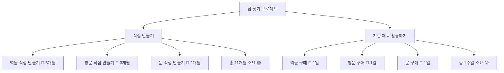

**의존성이란?**
- 이미 만들어진 것을 가져다 쓰는 것
- 내가 직접 만들지 않고 다른 사람이 만든 코드를 사용
- `import` 문으로 외부 코드를 가져오는 행위

### 💡 실생활 예제: HTTP 요청하기

```java
// ❌ 직접 구현 (2~3달 걸림)
public class MyHttpClient {
    // TCP 소켓 연결
    // HTTP 프로토콜 구현
    // SSL/TLS 보안 처리
    // 헤더 파싱
    // ... 수천 줄의 코드
}

// ✅ 의존성 활용 (5분)
import java.net.http.HttpClient;
import java.net.http.HttpRequest;

HttpClient client = HttpClient.newHttpClient();
// 끝! 바로 사용 가능
```

---

## 📦 모듈, 패키지, 라이브러리, 프레임워크

### 🧩 레고 블록으로 이해하기

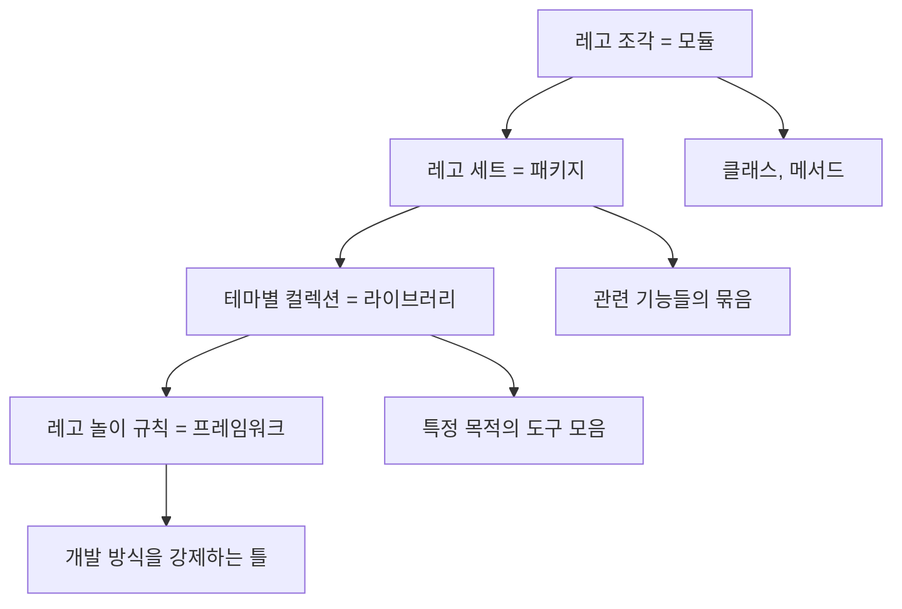

### 🔍 각각의 차이점

#### 1️⃣ **모듈 (Module)**
```java
// 하나의 기능을 담은 코드 뭉치
public class Calculator {
    public int add(int a, int b) {
        return a + b;
    }
}
```

#### 2️⃣ **패키지 (Package)**
```java
// 관련된 모듈들의 묶음 (폴더 구조)
com.mycompany.utils
├── Calculator.java
├── StringUtil.java
└── DateUtil.java
```

#### 3️⃣ **라이브러리 (Library)**
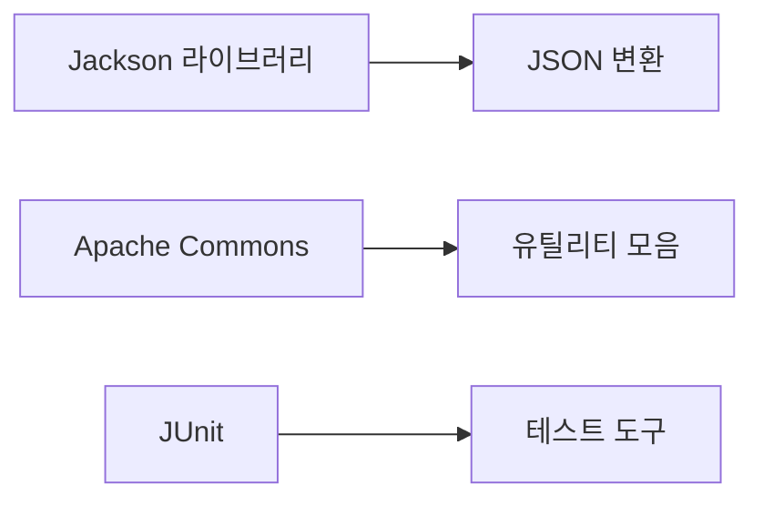

**특징:**
- **내장 라이브러리**: 자바에 기본 포함 (예: `String`, `ArrayList`)
- **외장 라이브러리**: 직접 다운로드해야 함 (예: Jackson, Spring)
- **동시 사용 가능**: 여러 JSON 라이브러리를 함께 사용 가능

#### 4️⃣ **프레임워크 (Framework)**
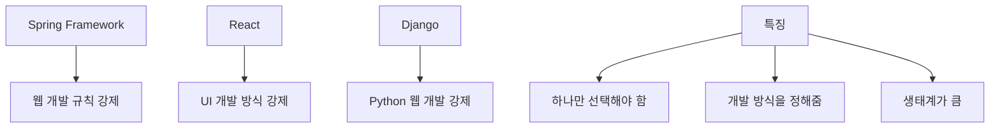

**라이브러리 vs 프레임워크**
- **라이브러리**: "내가 도구를 선택해서 사용" 🛠️
- **프레임워크**: "정해진 방식대로 개발해야 함" 📋

---

## 📋 Maven과 의존성 관리

### 🛒 쇼핑몰로 이해하는 Maven

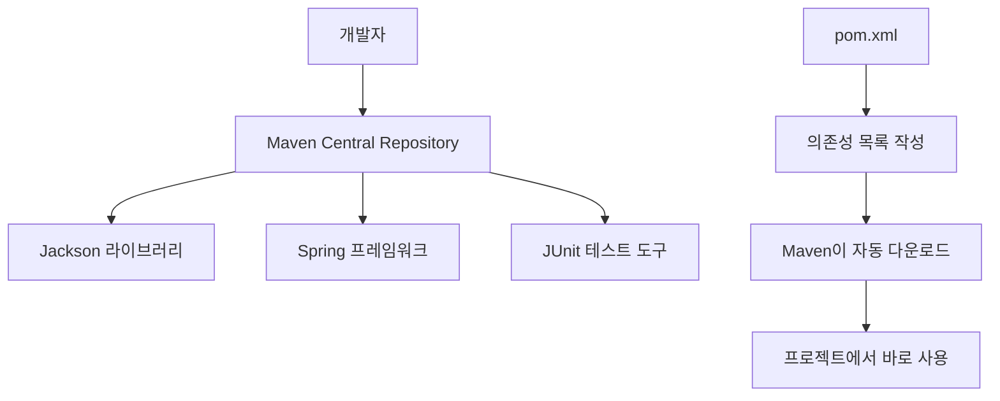

### 📝 pom.xml 파일 예제

```xml
<?xml version="1.0" encoding="UTF-8"?>
<project>
    <modelVersion>4.0.0</modelVersion>
    <groupId>com.example</groupId>
    <artifactId>my-chatbot</artifactId>
    <version>1.0.0</version>
    
    <dependencies>
        <!-- JSON 처리 라이브러리 -->
        <dependency>
            <groupId>com.fasterxml.jackson.core</groupId>
            <artifactId>jackson-databind</artifactId>
            <version>2.15.2</version>
        </dependency>
        
        <!-- 환경변수 처리 -->
        <dependency>
            <groupId>io.github.cdimascio</groupId>
            <artifactId>dotenv-java</artifactId>
            <version>3.0.0</version>
        </dependency>
        
        <!-- Google AI 라이브러리 -->
        <dependency>
            <groupId>com.google.ai</groupId>
            <artifactId>generativeai</artifactId>
            <version>1.0.0</version>
        </dependency>
    </dependencies>
</project>
```

### 🔄 Maven 동작 과정

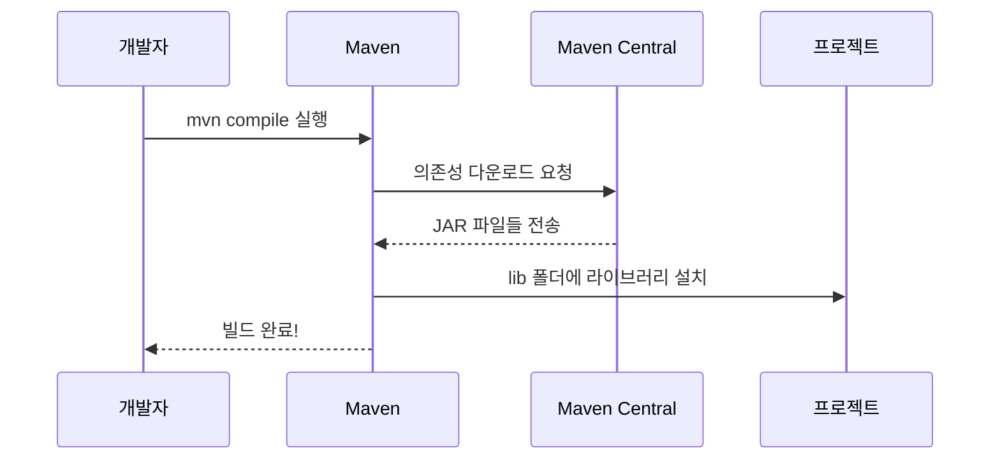

---

## 🚀 배포(Deployment) 이해하기

### 🍕 피자 배달로 이해하는 배포

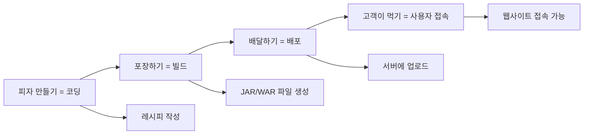

### 🎯 배포가 어려운 이유

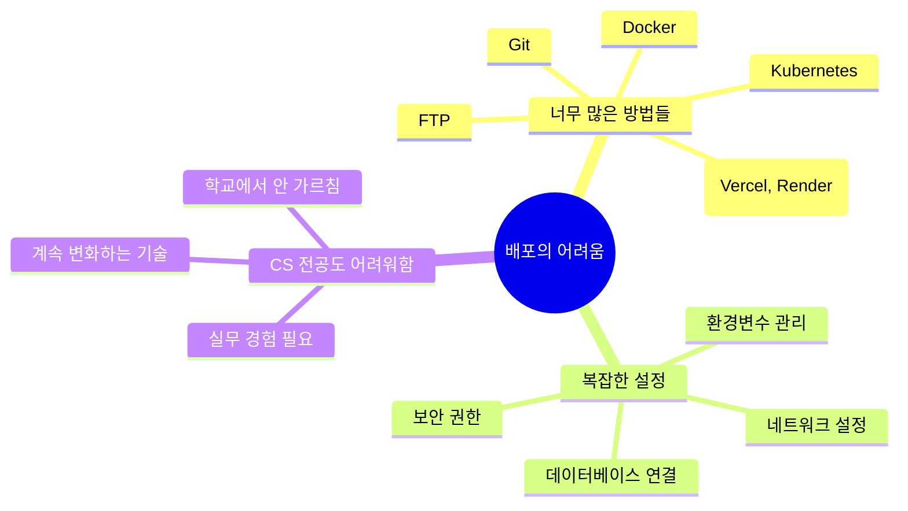

### 📊 전통적인 배포 vs 현대적 배포

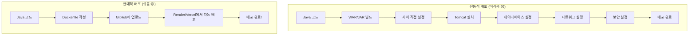

---

## 🐳 Docker와 클라우드 배포

### 📦 Docker란? - 이사 상자 비유

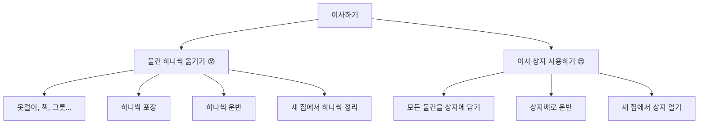

**Docker = 애플리케이션 이사 상자**
- 코드, 라이브러리, 설정 등을 하나로 묶음
- 어떤 컴퓨터에서든 동일하게 실행
- "내 컴퓨터에서는 잘 되는데?" 문제 해결

### 🌐 클라우드 서비스 소개

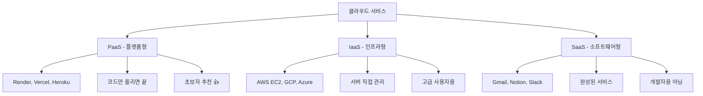

### 🚀 간단한 배포 과정 (Render 사용)

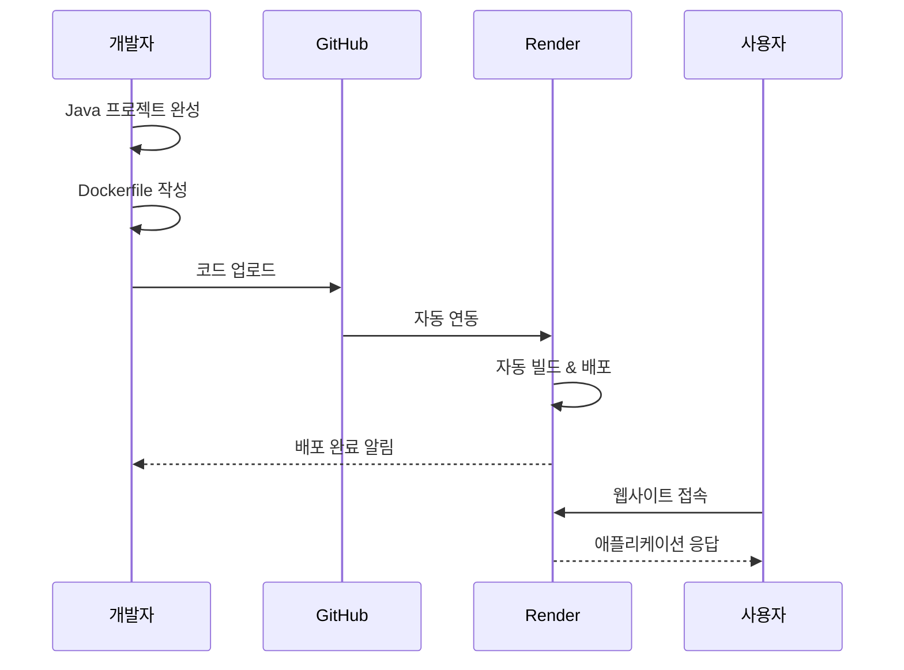

### 📋 Dockerfile 예제

```dockerfile
# Java 환경 준비
FROM openjdk:17-jdk-slim

# 작업 디렉토리 설정
WORKDIR /app

# JAR 파일 복사
COPY target/my-app.jar app.jar

# 포트 설정
EXPOSE 8080

# 애플리케이션 실행
CMD ["java", "-jar", "app.jar"]
```

---

## 🤖 실전 예제: 챗봇 만들기

### 📋 의존성 설정

**pom.xml에서 필요한 라이브러리들**
```xml
<dependencies>
    <!-- Google AI 라이브러리 -->
    <dependency>
        <groupId>com.google.ai</groupId>
        <artifactId>generativeai</artifactId>
        <version>1.0.0</version>
    </dependency>
    
    <!-- 환경변수 관리 -->
    <dependency>
        <groupId>io.github.cdimascio</groupId>
        <artifactId>dotenv-java</artifactId>
        <version>3.0.0</version>
    </dependency>
    
    <!-- JSON 처리 -->
    <dependency>
        <groupId>com.fasterxml.jackson.core</groupId>
        <artifactId>jackson-databind</artifactId>
        <version>2.15.2</version>
    </dependency>
</dependencies>
```

### 🔐 환경변수 관리 (.env 파일)

```bash
# .env 파일 (비밀 정보 저장)
GEMINI_API_KEY=your_api_key_here
SYSTEM_INSTRUCTION=200자 이내로, 중학생도 이해할 수 있게, 꾸미는 문법 없이 평문으로.
```

### 💻 챗봇 코드 구조

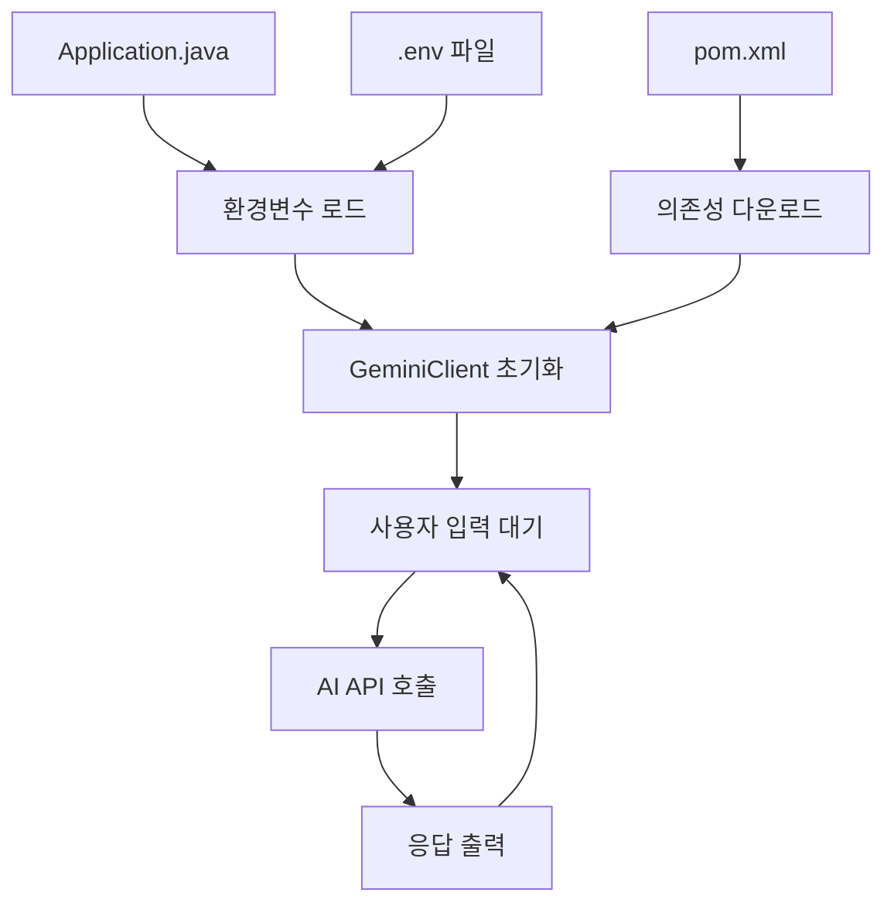

### 🎯 핵심 코드 분석

```java
public class Application {
    public static void main(String[] args) {
        // 1. 환경변수 로드 (비밀 정보 보호)
        Dotenv dotenv = Dotenv.load();
        String systemInstruction = dotenv.get("SYSTEM_INSTRUCTION");
        
        // 2. AI 클라이언트 초기화
        GeminiClient client = new GeminiClient(
            GeminiModel.gemini_2_0_flash,
            systemInstruction
        );
        
        // 3. 사용자와 대화
        Scanner sc = new Scanner(System.in);
        while (true) {
            System.out.print("질문 : ");
            String input = sc.nextLine();
            
            if (input.equals("종료")) return;
            
            String response = client.chat(input);
            System.out.println(response);
        }
    }
}
```

---

## 🌟 앞으로 배울 기술들

### 🗺️ 학습 로드맵

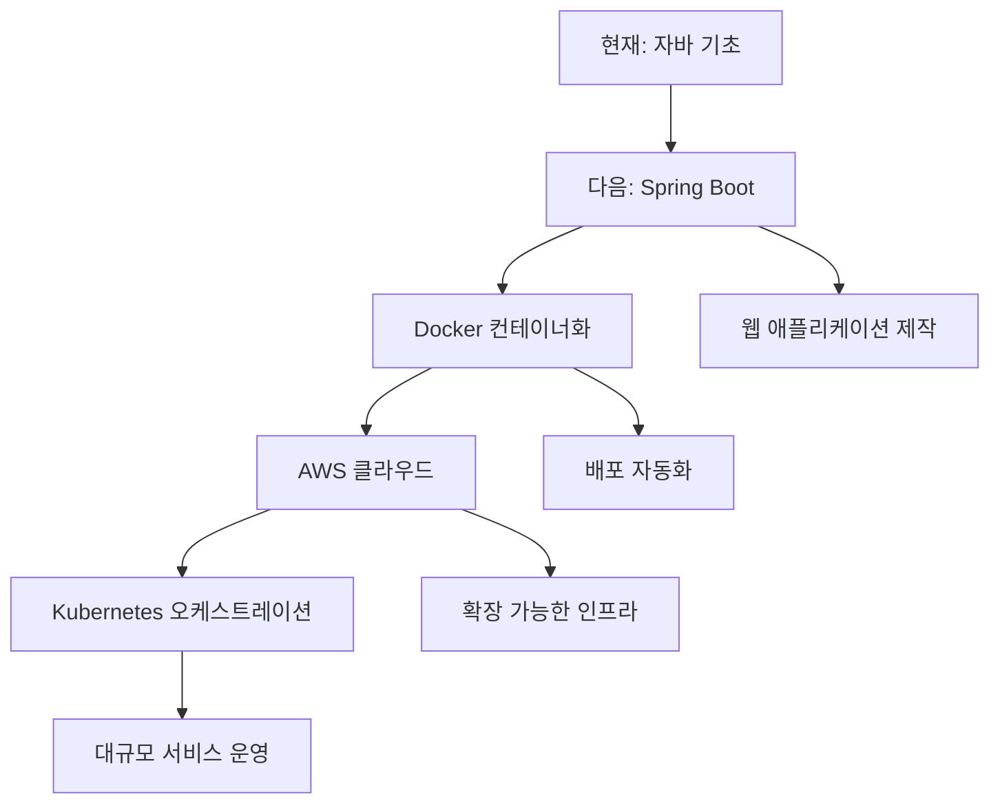

### ☁️ AWS 핵심 서비스 소개

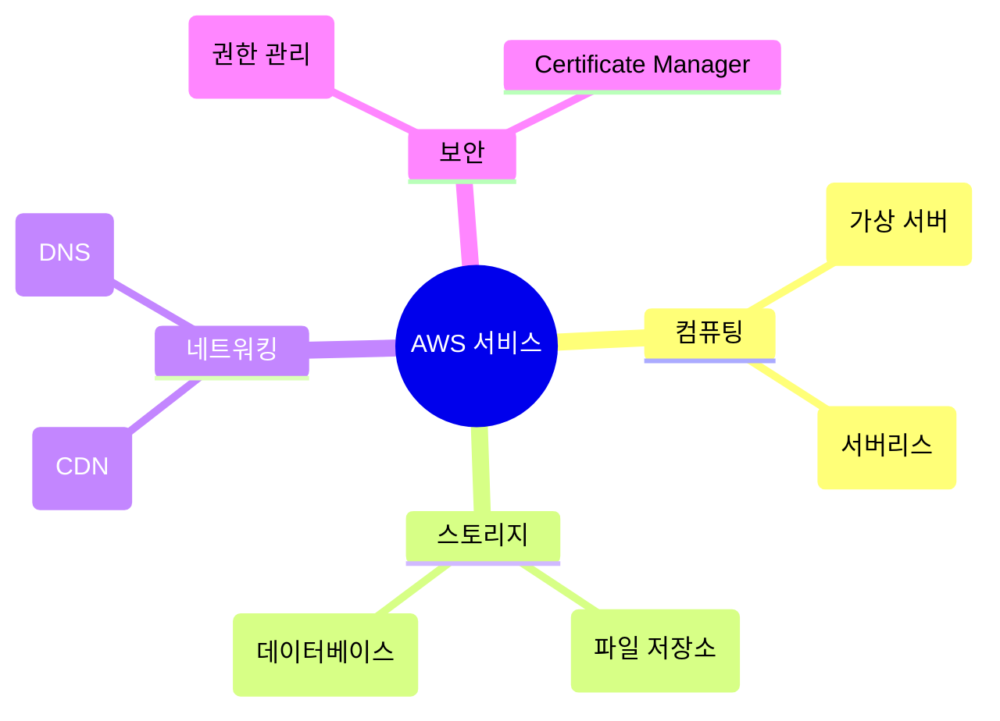

### 🔧 도구별 사용 시기

| 도구 | 언제 사용? | 난이도 |
|------|-----------|--------|
| **Render/Vercel** | 개인 프로젝트, 학습용 | ⭐ |
| **Docker** | 팀 프로젝트, 일관된 환경 | ⭐⭐ |
| **AWS EC2** | 본격적인 서비스 운영 | ⭐⭐⭐ |
| **Kubernetes** | 대규모 마이크로서비스 | ⭐⭐⭐⭐⭐ |

---

## 🎯 실습 과제 및 다음 단계

### ✅ 이번 주 목표
- [x] 의존성 개념 이해하기
- [x] Maven으로 라이브러리 추가하기
- [x] 환경변수로 비밀정보 관리하기
- [x] 간단한 챗봇 만들기
- [ ] GitHub에 코드 업로드하기
- [ ] Render로 첫 배포 경험하기

### 🚀 다음 주 학습 계획

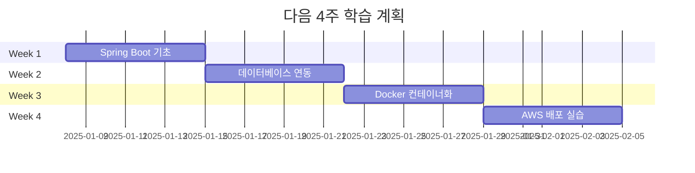

### 💡 실습 프로젝트 아이디어
1. **할일 관리 API** - Spring Boot + 데이터베이스
2. **날씨 알림 봇** - 외부 API 연동 + 스케줄링
3. **간단한 블로그** - 웹 인터페이스 + 파일 업로드
4. **실시간 채팅** - WebSocket + Redis

---

## 📝 정리 및 핵심 포인트

### 🔑 핵심 개념 정리

| 개념 | 한 줄 요약 | 실생활 비유 |
|------|-----------|-------------|
| **의존성** | 남이 만든 코드를 가져다 쓰기 | 완제품 구매하기 |
| **라이브러리** | 특정 목적의 도구 모음 | 요리 도구 세트 |
| **프레임워크** | 개발 방식을 정해주는 틀 | 요리 레시피책 |
| **배포** | 내 코드를 남들이 쓸 수 있게 하기 | 가게 오픈하기 |
| **Docker** | 애플리케이션 포장 기술 | 이사 상자 |

### 🎯 실무에서 중요한 이유

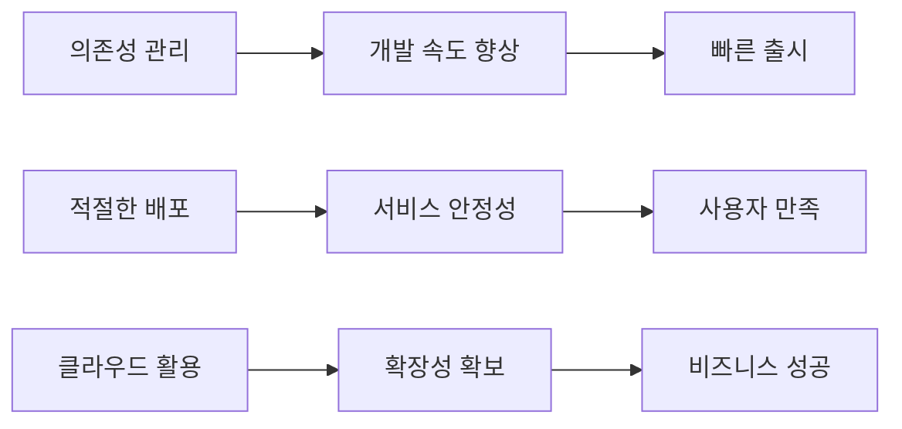

### 🚨 주의사항 및 팁

#### ⚠️ 피해야 할 실수들
- **의존성 지옥**: 너무 많은 라이브러리 사용
- **버전 충돌**: 라이브러리 간 호환성 문제  
- **비밀정보 노출**: API 키를 코드에 직접 작성
- **무료 서비스 의존**: 중요한 서비스를 무료 플랜으로만 운영

#### 💡 성공하는 개발자의 습관
- 📚 **공식 문서 읽기**: Stack Overflow보다 공식 문서 우선
- 🔍 **점진적 학습**: 한 번에 모든 기술을 배우려 하지 않기
- 🤝 **커뮤니티 활용**: GitHub, Reddit, Discord에서 질문하기
- 🔄 **꾸준한 실습**: 이론보다는 직접 만들어보기

---

## 🎉 마무리

축하합니다! 이제 여러분은 **의존성 관리**와 **배포**의 기본 개념을 이해했습니다! 🎊

### 🌟 여러분이 이룬 성취
- ✅ 복잡한 HTTP 통신을 라이브러리로 간단하게 처리
- ✅ Maven으로 프로젝트 의존성 체계적 관리  
- ✅ 환경변수로 보안 정보 안전하게 관리
- ✅ AI 챗봇이라는 실용적인 프로젝트 완성
- ✅ 배포의 전체적인 흐름과 미래 학습 방향 파악

### 🚀 다음 도전
이제 여러분은 단순한 **코딩 초보자**에서 **시스템을 이해하는 개발자**로 한 단계 성장했습니다!

다음 단계에서는:
- 🌐 **Spring Boot**로 웹 애플리케이션 만들기
- 🗄️ **데이터베이스** 연동하여 데이터 영속화
- 🐳 **Docker**로 어디서든 실행되는 애플리케이션 패키징
- ☁️ **AWS**로 실제 사용자들이 접근할 수 있는 서비스 운영

**기억하세요**: 모든 대단한 개발자도 여러분과 같은 과정을 거쳤습니다! 💪

계속 도전하고, 실패를 두려워하지 말고, 꾸준히 성장해 나가세요! 🌱➡️🌳
