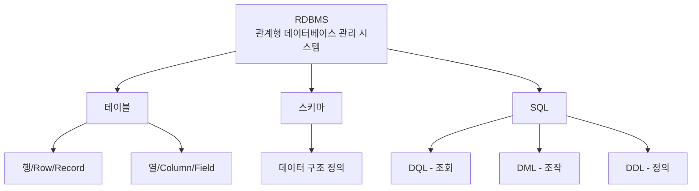
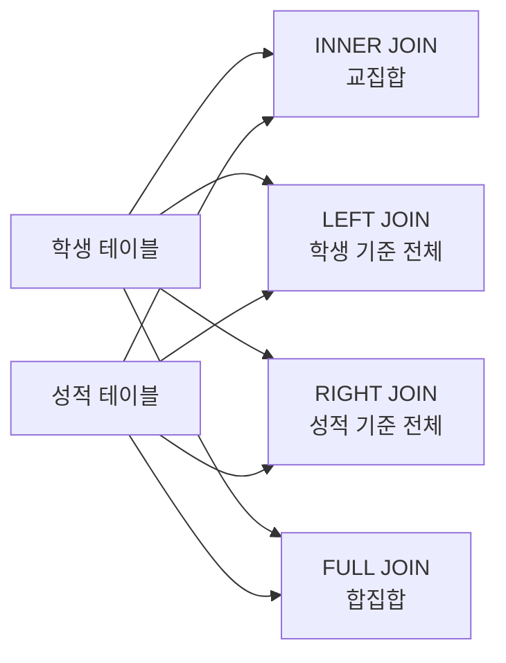
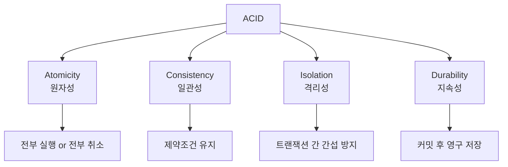
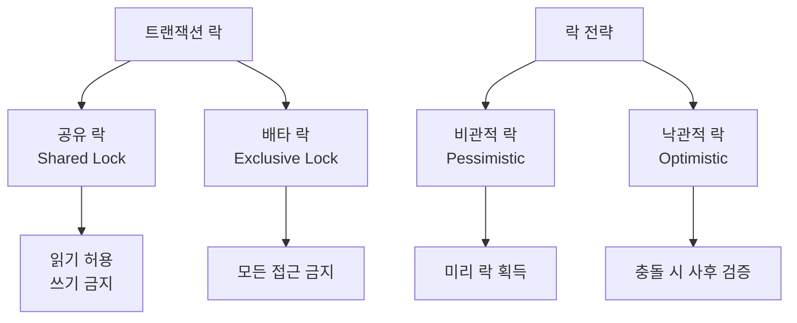
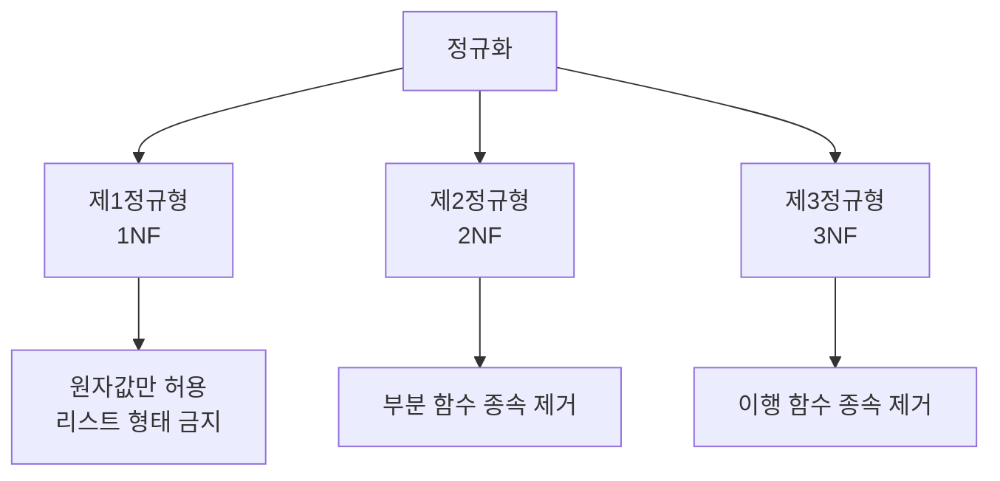
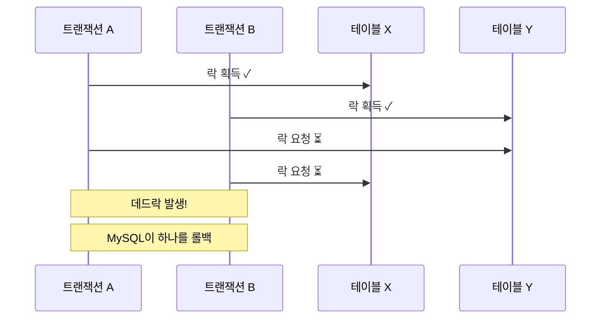

# MySQL 8.0 완전 복습 가이드 📚

## 1. 환경 설정 및 기본 개념

### 1.1 개발 환경 설정
- **DBeaver**: 데이터베이스 관리 도구 (GUI 환경)
- **Aiven**: 클라우드 MySQL 서비스
- **MySQL 8.0.x**: 오픈소스 관계형 데이터베이스

```sql
-- 기본 연결 테스트
SELECT 1 + 1;
SELECT VERSION(), DATABASE();
```

### 1.2 RDBMS 기본 개념



**RDBMS 비유**: 엑셀 스프레드시트 모음집
- **데이터베이스**: 하나의 엑셀 파일
- **테이블**: 엑셀 시트 하나
- **행(Row)**: 엑셀의 한 줄
- **열(Column)**: 엑셀의 세로 컬럼

## 2. DQL (Data Query Language) - 데이터 조회

### 2.1 기본 조회 (SELECT)

```sql
-- 전체 데이터 조회
SELECT * FROM 테이블명;

-- 특정 컬럼 조회
SELECT column1, column2 FROM 테이블명;

-- 테이블 구조 확인
DESC 테이블명;

-- 중복 제거
SELECT DISTINCT column1 FROM 테이블명;
```

### 2.2 조건부 조회 (WHERE)

```sql
-- 기본 조건
SELECT * FROM products WHERE price > 1000;

-- 복합 조건
SELECT * FROM products 
WHERE price BETWEEN 1000 AND 5000 
AND category = 'electronics';

-- 패턴 매칭
SELECT * FROM customers WHERE name LIKE '김%';
```

### 2.3 그룹화 및 집계 (GROUP BY, HAVING)

```sql
-- 그룹별 집계
SELECT category, COUNT(*), AVG(price)
FROM products 
GROUP BY category;

-- 그룹 조건
SELECT category, AVG(price)
FROM products 
GROUP BY category
HAVING AVG(price) > 2000;
```

**GROUP BY 비유**: 반 학생들을 성별로 나눠서 각각의 평균 키 구하기

### 2.4 정렬 및 제한 (ORDER BY, LIMIT)

```sql
-- 정렬
SELECT * FROM products ORDER BY price DESC;

-- 상위 N개 조회
SELECT * FROM products ORDER BY price DESC LIMIT 5;

-- 페이징 (건너뛰기)
SELECT * FROM products ORDER BY price DESC LIMIT 10, 5;
```

## 3. JOIN - 테이블 연결

### 3.1 JOIN 개념 시각화



### 3.2 JOIN 유형별 예제

```sql
-- INNER JOIN (교집합)
SELECT s.name, g.score
FROM students s
INNER JOIN grades g ON s.student_id = g.student_id;

-- LEFT JOIN (왼쪽 테이블 기준 전체)
SELECT s.name, g.score
FROM students s
LEFT JOIN grades g ON s.student_id = g.student_id;

-- CROSS JOIN (카테시안 곱)
SELECT s.name, c.course_name
FROM students s
CROSS JOIN courses c;
```

**JOIN 비유**: 
- **INNER JOIN**: 양쪽 모두 일치하는 것만 (교집합)
- **LEFT JOIN**: 왼쪽은 무조건, 오른쪽은 있으면 (왼쪽 기준)
- **CROSS JOIN**: 모든 조합 만들기 (A×B)

## 4. DML (Data Manipulation Language) - 데이터 조작

### 4.1 데이터 삽입 (INSERT)

```sql
-- 단일 행 삽입
INSERT INTO products (name, price, category) 
VALUES ('노트북', 150000, 'electronics');

-- 다중 행 삽입
INSERT INTO products (name, price, category) 
VALUES 
    ('마우스', 30000, 'electronics'),
    ('키보드', 80000, 'electronics');
```

### 4.2 데이터 수정 (UPDATE)

```sql
-- 조건부 수정
UPDATE products 
SET price = 140000 
WHERE name = '노트북';

-- 다중 컬럼 수정
UPDATE products 
SET price = price * 1.1, category = 'premium_electronics'
WHERE price > 100000;
```

### 4.3 데이터 삭제 (DELETE)

```sql
-- 조건부 삭제
DELETE FROM products WHERE price < 10000;

-- 전체 삭제 (주의!)
DELETE FROM products;
```

## 5. DDL (Data Definition Language) - 구조 정의

### 5.1 테이블 생성 (CREATE)

```sql
CREATE TABLE products (
    id INT AUTO_INCREMENT PRIMARY KEY,
    name VARCHAR(100) NOT NULL,
    price DECIMAL(10,2) DEFAULT 0,
    category VARCHAR(50),
    created_at TIMESTAMP DEFAULT CURRENT_TIMESTAMP
);
```

### 5.2 테이블 수정 (ALTER)

```sql
-- 컬럼 추가
ALTER TABLE products ADD COLUMN description TEXT;

-- 컬럼 수정
ALTER TABLE products MODIFY COLUMN name VARCHAR(200);

-- 컬럼 삭제
ALTER TABLE products DROP COLUMN description;
```

### 5.3 테이블 삭제 (DROP)

```sql
-- 테이블 삭제
DROP TABLE products;
```

## 6. 트랜잭션 (Transaction) - 데이터 안전성

### 6.1 ACID 속성



**ACID 비유**: 은행 계좌 이체
- **원자성**: 출금과 입금이 모두 성공하거나 모두 실패
- **일관성**: 총 금액은 변하지 않음
- **격리성**: 다른 이체가 동시에 방해하지 않음
- **지속성**: 완료된 이체는 영구적으로 기록

### 6.2 트랜잭션 제어

```sql
-- 수동 트랜잭션 시작
START TRANSACTION;

-- 여러 작업 수행
UPDATE accounts SET balance = balance - 1000 WHERE id = 1;
UPDATE accounts SET balance = balance + 1000 WHERE id = 2;

-- 커밋 (확정)
COMMIT;

-- 또는 롤백 (취소)
-- ROLLBACK;
```

### 6.3 락(Lock) 종류



## 7. 데이터 무결성과 정규화

### 7.1 무결성 종류

| 무결성 유형 | 설명 | 예시 |
|------------|------|------|
| **개체 무결성** | PK는 중복되지 않음 | 학번은 유일해야 함 |
| **참조 무결성** | FK는 존재하는 PK만 참조 | 존재하지 않는 학과 참조 금지 |
| **도메인 무결성** | 컬럼 제약조건 준수 | 나이는 양수, 이메일 형식 준수 |

### 7.2 정규화 기본 개념



**정규화 비유**: 서랍장 정리
- **1정규형**: 한 칸에 한 종류의 물건만
- **2정규형**: 관련 있는 것들끼리 분리
- **3정규형**: 직접적 관련성만 유지

## 8. 실전 문제 해결

### 8.1 LeetCode 예제

```sql
-- 문제: 저지방이면서 재활용 가능한 제품 찾기
SELECT product_id 
FROM Products
WHERE low_fats = 'Y' AND recyclable = 'Y';
```

### 8.2 성능 최적화 팁

```sql
-- 인덱스 활용
CREATE INDEX idx_price ON products(price);

-- JOIN 순서 최적화 (ON 조건을 WHERE보다 먼저)
SELECT p.name, c.category_name
FROM products p
JOIN categories c ON p.category_id = c.id  -- 먼저 처리
WHERE p.price > 1000;  -- 나중에 처리
```

## 9. 용어 정리표

| 용어 | 영어 원문 | 설명 |
|------|-----------|------|
| **DQL** | Data Query Language | 데이터 조회 언어 (SELECT) |
| **DML** | Data Manipulation Language | 데이터 조작 언어 (INSERT, UPDATE, DELETE) |
| **DDL** | Data Definition Language | 데이터 정의 언어 (CREATE, ALTER, DROP) |
| **PK** | Primary Key | 기본키 (고유 식별자) |
| **FK** | Foreign Key | 외래키 (다른 테이블 참조) |
| **ACID** | Atomicity, Consistency, Isolation, Durability | 트랜잭션 4대 속성 |

## 10. 데드락 방지 전략



**데드락 비유**: 좁은 다리에서 양쪽에서 차가 만나는 상황
- **해결책**: 한쪽이 후진하여 길을 양보

---
