# 멋쟁이사자처럼 13일차 - SQL 데이터베이스 마스터 🗃️
*JOIN과 데이터 분석의 세계로* 

---

## 📅 학습 정보
- **날짜**: 2025년 8월 14일
- **주제**: SQL JOIN과 데이터 분석
- **난이도**: ⭐⭐⭐⭐

---

## 🎯 오늘의 핵심 학습 목표

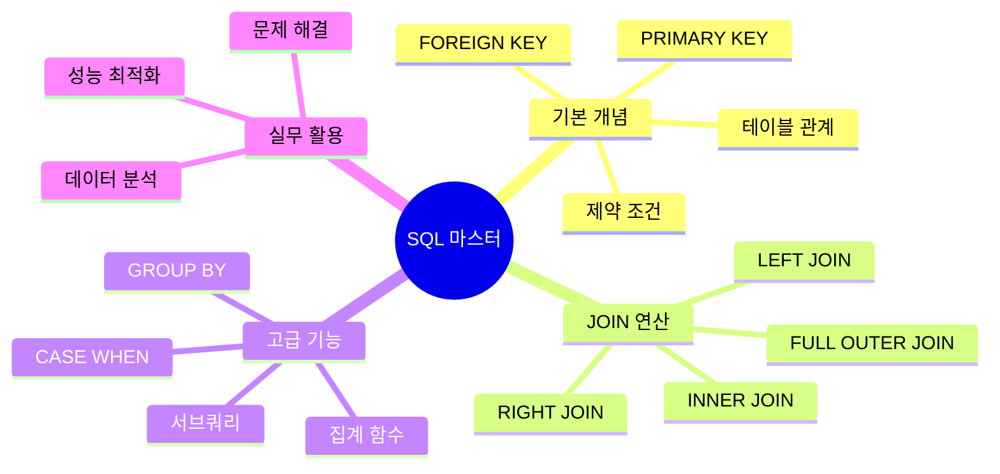

---

## 📚 주요 학습 내용

### 🏗️ **데이터베이스 구조 설계**

#### 테이블 관계 설계
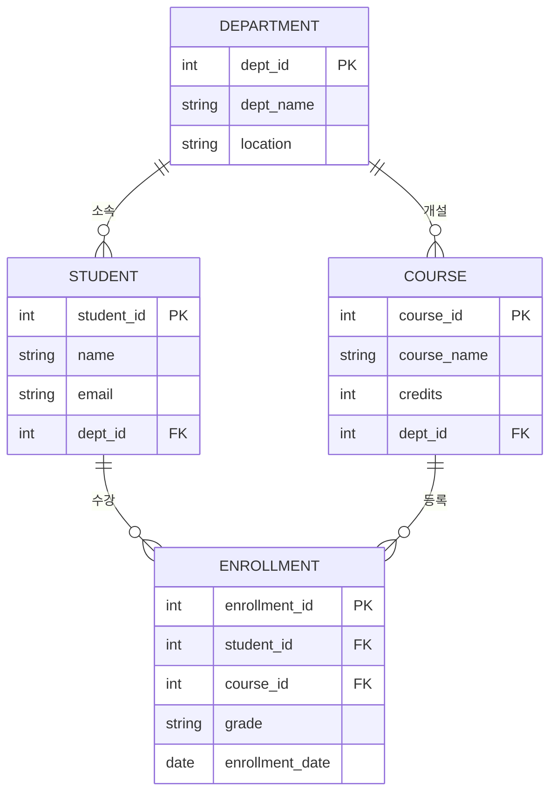

### 🔗 **JOIN 연산의 이해**

#### JOIN의 종류와 특징
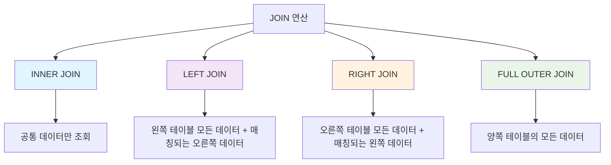

#### 실전 JOIN 예제
```sql
-- LEFT JOIN을 활용한 사용자 확인률 계산
SELECT user_id,
       ROUND(AVG(CASE WHEN action = 'confirmed' THEN 1 ELSE 0 END), 2) 
       AS confirmation_rate
FROM Signups s
LEFT JOIN Confirmations c
USING (user_id)
GROUP BY user_id;
```

### 📊 **집계 함수와 조건부 로직**

#### CASE WHEN 문의 활용
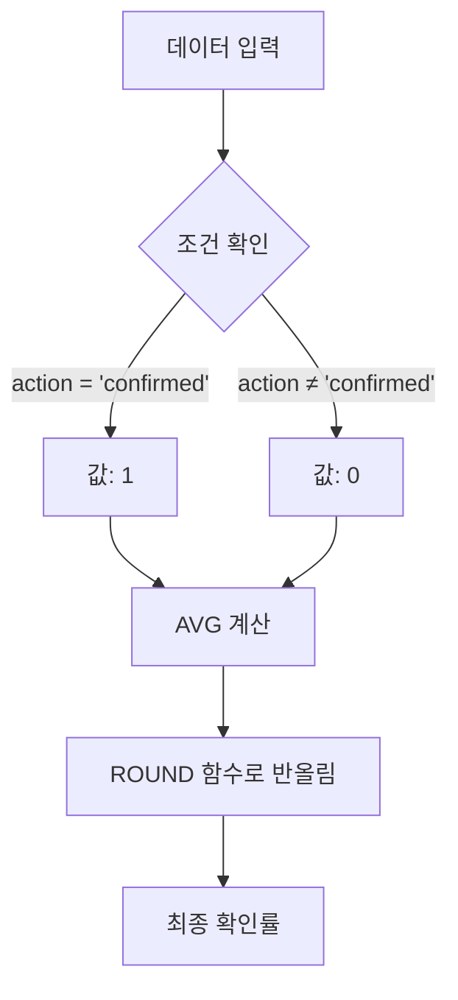

---

## 🛠️ 실습 프로젝트

### 🔍 **SQL Murder Mystery**
- **링크**: [SQL Murder Mystery](https://mystery.knightlab.com/walkthrough.html)
- **목표**: SQL 쿼리를 활용한 범인 찾기
- **학습 효과**: 복합 쿼리 작성 능력 향상

### 📈 **사용자 확인률 분석 프로젝트**

#### 문제 상황
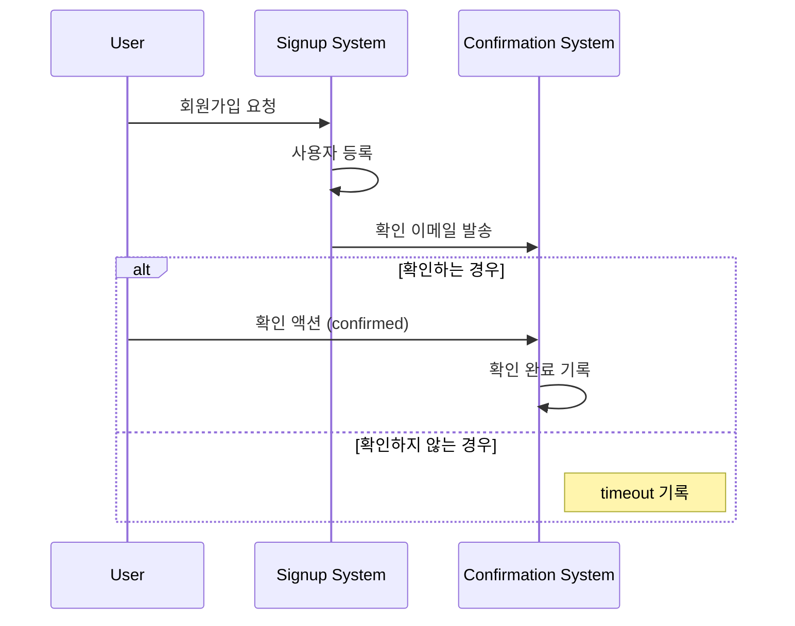

#### 해결 과정
1. **테이블 분석**: Signups와 Confirmations 테이블 구조 파악
2. **JOIN 전략**: LEFT JOIN으로 모든 사용자 포함
3. **조건부 계산**: CASE WHEN으로 확인률 계산
4. **결과 정리**: ROUND 함수로 소수점 처리

---

## 🎨 디자인 리소스 탐색

### 🖼️ **아이콘 및 에셋 사이트**

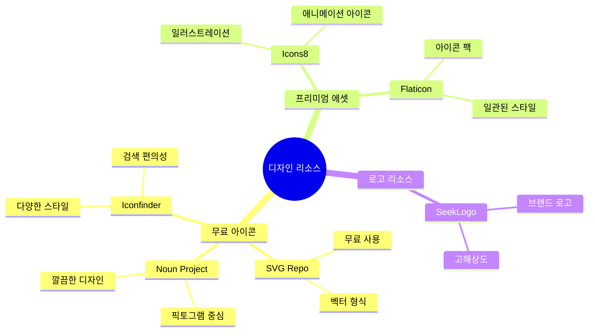

### 📱 **UI/UX 디자인 트렌드**
- **미니멀리즘**: 깔끔하고 직관적인 인터페이스
- **아이콘 중심**: 텍스트보다는 시각적 요소 강조
- **일관성**: 통일된 디자인 시스템 구축

---

## 🤖 AI를 활용한 학습 최적화

### 📝 **초심자용 AI 보강**
- **링크**: [Gemini 초심자 가이드](https://g.co/gemini/share/a795ff183188)
- **활용법**: 복잡한 SQL 개념을 쉬운 예제로 설명

- **주요 컬럼:**
    
    - `training_id` (훈련 ID) : 이 테이블의 **기본키(PK)** 입니다. 각 훈련 프로그램을 유일하게 구분하는 번호입니다.
        
    - `dept_id` (부서 ID) : 해당 훈련이 특정 부서에만 해당하는 경우, 그 부서를 나타내는 **외래키(FK)** 입니다. `department` 테이블의 `dept_id`와 연결됩니다.
        

**4. `employee_training` (직원-훈련) 테이블**

- **역할:** 어떤 직원이 어떤 훈련을 받았는지, 그리고 그 성적(`grade`)은 어땠는지를 기록합니다.
    
- **주요 컬럼:**
    
    - `employee_id` (직원 ID) : `employee` 테이블의 `employee_id`와 연결되는 **외래키(FK)** 입니다.
        
    - `training_id` (훈련 ID) : `training` 테이블의 `training_id`와 연결되는 **외래키(FK)** 입니다.
        
- **특징:** 이 테이블은 `employee`와 `training` 테이블 사이의 **다대다(M:N) 관계**를 연결하는 역할을 합니다. 즉, 한 직원이 여러 훈련을 받을 수 있고, 한 훈련에 여러 직원이 참여할 수 있음을 나타냅니다.
    

---

### 🔑 주요 문법 및 키워드 정리

제공된 SQL 문에서 데이터베이스를 만들고 데이터를 넣을 때 사용된 핵심 문법들을 정리했습니다.

- `CREATE TABLE`: 새로운 테이블(표)을 만들 때 사용합니다.
    
- `INSERT INTO`: 테이블에 새로운 데이터를 추가할 때 사용합니다.
    
- `PRIMARY KEY` (PK, 기본키): 테이블에서 각 행(레코드)을 고유하게 식별하는 역할을 합니다. 중복될 수 없고, `NULL` 값을 가질 수 없습니다.
    
    - 예: `employee` 테이블의 `employee_id`.
        
- `FOREIGN KEY` (FK, 외래키): 다른 테이블의 `PRIMARY KEY`와 연결되어 테이블 간의 관계를 만듭니다. 데이터의 무결성(정확성)을 보장하는 중요한 역할을 합니다.
    
    - 예: `employee` 테이블의 `dept_id`는 `department` 테이블의 `dept_id`를 가리킵니다.
        
- `VARCHAR(n)`: 문자열을 저장하는 자료형입니다. `(n)`은 최대 글자 수를 의미합니다.
    
- `INT`: 정수를 저장하는 자료형입니다.
    
- `DATE`: 날짜를 저장하는 자료형입니다.
    
- `NOT NULL`: 해당 컬럼에 `NULL` 값(빈 값)이 들어갈 수 없도록 합니다.
    
- `NULL`: 값이 비어있음을 의미합니다. `NULL` 값이 허용된 컬럼에는 값을 넣지 않아도 됩니다.
    
- `REFERENCES`: `FOREIGN KEY`가 어떤 테이블의 어떤 컬럼을 참조하는지 명시할 때 사용합니다.


### 💼 **면접 준비용 AI 보강**
- **링크**: [Gemini 면접 대비](https://g.co/gemini/share/a80a9c123d11)
- **활용법**: 실무 시나리오 기반 SQL 문제 연습


데이터베이스 스키마와 데이터를 분석한 결과, 클라우드 엔지니어 기술 면접 및 실무에 도움이 될 수 있는 핵심 내용을 다음과 같이 정리하고 시각화했습니다.

---

### 1. 주요 문법 및 키워드 요약

- **DDL (Data Definition Language)**
    
    - `DROP TABLE IF EXISTS`: 테이블이 존재할 경우 삭제하는 명령어입니다. 데이터베이스 스키마를 재정의하거나 정리할 때 유용하게 사용됩니다.
        
    - `CREATE TABLE`: 새로운 테이블을 생성하는 명령어입니다. 테이블의 이름, 컬럼, 데이터 타입, 제약 조건 등을 정의합니다.
        
    - `PRIMARY KEY`: 테이블의 각 행을 고유하게 식별하는 **기본 키**를 설정합니다. 이 키는 `NULL` 값을 가질 수 없으며, 중복된 값을 허용하지 않습니다.
        
    - `FOREIGN KEY`: 다른 테이블의 `PRIMARY KEY`를 참조하는 **외래 키**입니다. 이를 통해 테이블 간의 관계를 설정하고, 데이터의 무결성(Integrity)을 유지합니다. 예를 들어, `employee` 테이블의 `dept_id`는 `department` 테이블의 `dept_id`를 참조합니다.
        
    - `NOT NULL`: 해당 컬럼이 `NULL` 값을 가질 수 없도록 강제하는 제약 조건입니다. 데이터의 필수적인 값을 보장합니다.
        
- **DML (Data Manipulation Language)**
    
    - `INSERT INTO`: 테이블에 새로운 데이터를 추가하는 명령어입니다.
        

---

### 2. 데이터베이스 설계 핵심 내용

- **테이블 간의 관계:**
    
    - **1대다 관계 (One-to-Many):** `department` 테이블과 `employee`, `training` 테이블이 이 관계에 해당합니다. 하나의 부서에는 여러 명의 직원이나 여러 개의 교육 과정이 속할 수 있습니다.
        
    - **다대다 관계 (Many-to-Many):** `employee` 테이블과 `training` 테이블의 관계는 다대다 관계입니다. 한 직원은 여러 교육을 들을 수 있고, 한 교육은 여러 직원이 수강할 수 있습니다. 이를 해결하기 위해 `employee_training`이라는 **조인(Join) 테이블**이 사용되었습니다. 이는 관계형 데이터베이스 설계의 중요한 원칙입니다.
        
- **데이터 정규화 (Normalization):**
    
    - 위 스키마는 데이터를 논리적으로 분리하고 중복을 최소화하여 정규화된 형태를 따르고 있습니다. 이는 데이터 일관성을 유지하고 효율적인 데이터 관리를 가능하게 합니다.
        
- **자기 참조 관계 (Self-referencing relationship):**
    
    - `department` 테이블의 `parent_dept_id`는 같은 테이블의 `dept_id`를 참조합니다. 이는 부서가 상위 부서를 가지는 계층 구조를 표현하는 데 사용됩니다. (예: HQ가 HR의 상위 부서)
        

---

### 3. 클라우드 엔지니어 면접 및 실무 팁

- **기술 면접 준비:**
    
    - **`JOIN` 쿼리:** `employee`와 `department`를 `dept_id`로 조인하여 부서별 직원 목록을 조회하는 쿼리 등, 다양한 조인 시나리오(Inner Join, Left Join)를 연습하세요.
        
    - **서브쿼리(Subquery)와 윈도우 함수(Window Function):** 특정 조건에 맞는 데이터를 필터링하거나 순위를 매기는 등의 고급 쿼리 작성 능력을 보여주는 것이 좋습니다.
        
    - **인덱싱(Indexing):** 대용량 데이터베이스에서 쿼리 성능을 최적화하기 위해 인덱스를 사용하는 방법에 대해 이해해야 합니다. 예를 들어, `dept_id`에 인덱스를 추가하면 조인 연산 속도가 빨라집니다.
        
    - **성능 튜닝:** `EXPLAIN` 명령어 등을 사용하여 쿼리 실행 계획을 분석하고, 병목 현상을 해결하는 방법을 아는 것이 중요합니다.
        
- **클라우드 환경 실무 유의 사항:**
    
    - **관리형 데이터베이스 서비스 (Managed DBaaS):** AWS RDS, Google Cloud SQL, Azure Database 등 클라우드에서 제공하는 관리형 서비스의 특징을 이해해야 합니다. 자동 백업, 확장성, 고가용성(High Availability) 등을 고려해야 합니다.
        
    - **데이터베이스 확장성 (Scalability):** 트래픽 증가에 따라 데이터베이스를 수평적(Sharding) 또는 수직적(Scaling Up)으로 확장하는 전략에 대해 고민해야 합니다.
        
    - **보안 (Security):** IAM (Identity and Access Management)을 통해 데이터베이스 접근 권한을 관리하고, 암호화(Encryption)를 적용하여 데이터를 보호하는 방법을 알아야 합니다.
        
    - **마이그레이션 (Migration):** 온프레미스(On-premise) 데이터베이스를 클라우드로 이전할 때 고려해야 할 사항들(DMS, 데이터 정합성 등)에 대한 지식이 필요합니다.
        

---

### 4. 데이터베이스 스키마 시각화

제공된 SQL 스키마를 바탕으로 테이블 간의 관계를 시각화한 다이어그램입니다. 이 그림은 각 테이블(노드)과 그 관계(화살표, 외래 키)를 한눈에 보여줍니다.

### 🔄 **회고 시스템**
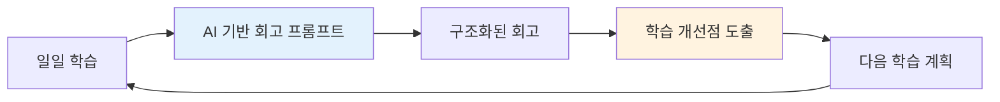

---

## 🚨 문제 해결 경험

### ⚠️ **외래키 제약조건 오류**
```sql
-- 오류 발생
-- Cannot drop table 'department' referenced by a foreign key constraint

-- 해결 방법: 순서대로 테이블 삭제
DROP TABLE IF EXISTS enrollment;
DROP TABLE IF EXISTS student;
DROP TABLE IF EXISTS course;
DROP TABLE IF EXISTS department;
```

#### 해결 과정 시각화
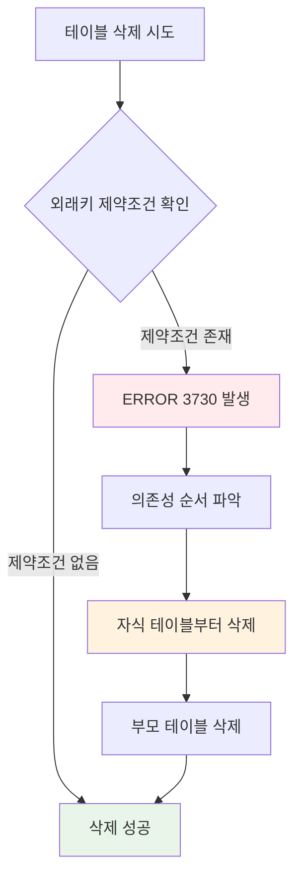

---

## 📈 학습 성과 및 분석

### 🎯 **오늘의 성취도**
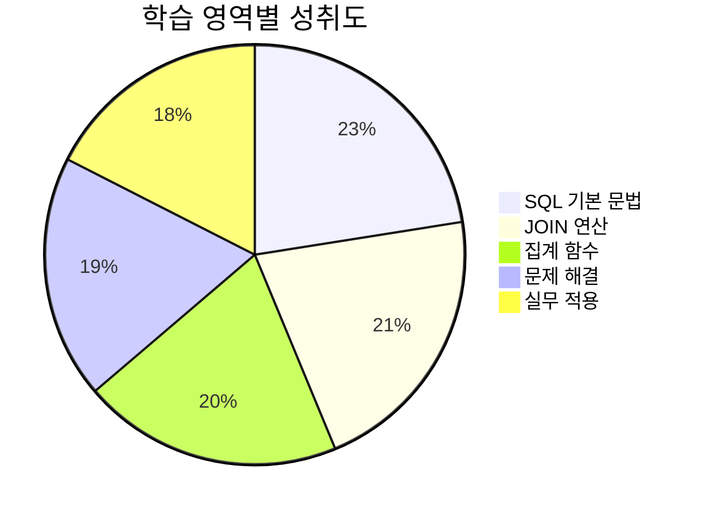

### 📊 **시간별 학습 분포**
```mermaid
gantt
    title 13일차 학습 일정
    dateFormat HH:mm
    axisFormat %H:%M
    
    section 오전 세션
    기본 개념 복습     :09:00, 10:00
    테이블 설계        :10:00, 11:00
    JOIN 실습         :11:00, 12:00
    
    section 오후 세션
    고급 쿼리 작성     :13:00, 14:30
    문제 해결 실습     :14:30, 16:00
    프로젝트 실습      :16:00, 17:30
```

---

## 💡 핵심 깨달음

### 🧠 **개념적 이해**
> **"데이터는 관계를 통해 의미를 갖는다"**

SQL의 진정한 힘은 단순한 데이터 조회가 아니라, **테이블 간의 관계를 통해 의미있는 정보를 추출하는 것**임을 깨달았습니다.

### 🔍 **실무적 인사이트**
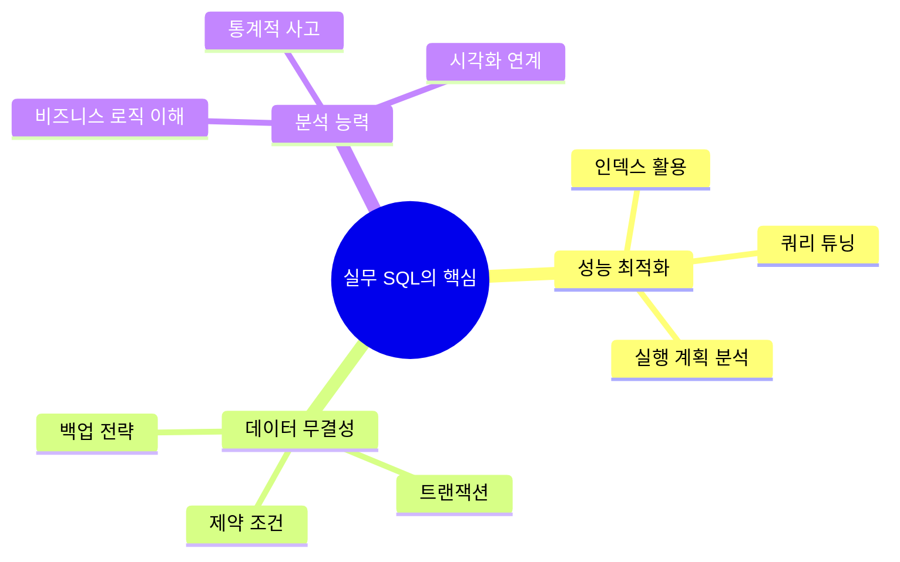

---

## 📚 추가 학습 리소스

### 📖 **온라인 학습 플랫폼**
- [Wikidocs](https://wikidocs.net/) - 한국어 SQL 가이드
- [Programiz SQL](https://www.programiz.com/sql) - 기초부터 고급까지
- [Kaggle Learn SQL](https://www.kaggle.com/learn/intro-to-sql) - 실전 데이터 분석

### 🎮 **실습 플랫폼**
- [SQL Murder Mystery](https://mystery.knightlab.com/) - 게임형 학습
- [HackerRank SQL](https://www.hackerrank.com/domains/sql) - 단계별 문제 해결
- [LeetCode Database](https://leetcode.com/problemset/database/) - 면접 대비 문제

---

## 🎯 내일의 학습 목표

### 🚀 **우선순위 높음**
- [ ] **서브쿼리와 CTE** 마스터
- [ ] **윈도우 함수** 학습
- [ ] **인덱스 최적화** 실습
- [ ] **트랜잭션 관리** 이해

### 📋 **추가 학습 계획**
- [ ] **NoSQL vs SQL** 비교 분석
- [ ] **데이터베이스 설계 패턴** 학습
- [ ] **실제 프로젝트 데이터** 분석 경험

---

## 🏁 오늘의 마무리

13일차는 **"데이터의 연결고리를 찾는 탐정"**이 된 기분이었습니다. 

SQL JOIN을 통해 흩어진 데이터들이 하나의 의미있는 이야기를 만들어가는 과정에서, 데이터베이스의 진정한 가치를 체험할 수 있었습니다. 특히 외래키 제약조건 오류를 해결하면서 **데이터 무결성의 중요성**을 몸소 느꼈습니다.

앞으로는 더 복잡한 쿼리 작성과 성능 최적화에 도전하여 **실무에서 바로 활용할 수 있는 SQL 전문가**로 성장하겠습니다! 

---

*"데이터 속에서 인사이트를 찾아내는 SQL 마스터가 되자!"* 🗃️✨

---

**작성일**: 2025년 8월 14일  
**태그**: `#SQL` `#데이터베이스` `#JOIN` `#데이터분석` `#멋쟁이사자처럼`
