# JavaScript Core 완벽 마스터 가이드 🚀

> **8/22 JavaScript 기초부터 실전까지 완벽 정복**  
> 비전공자도 쉽게 이해할 수 있는 상세한 설명과 실습 코드

## 📋 목차
1. [JavaScript 개요](#javascript-개요)
2. [개발 환경 설정](#개발-환경-설정)
3. [Part 1: 기초 문법 (변수, 타입, 제어문)](#part-1-기초-문법)
4. [Part 2: 고급 문법 (함수, 클래스, 고차함수)](#part-2-고급-문법)
5. [실습 프로젝트](#실습-프로젝트)
6. [학습 로드맵](#학습-로드맵)

---

## JavaScript 개요

### JavaScript란?
JavaScript는 웹 브라우저에서 동작하는 **프로그래밍 언어**입니다. 웹페이지에 **동적인 기능**을 추가하여 사용자와 상호작용할 수 있게 만듭니다.

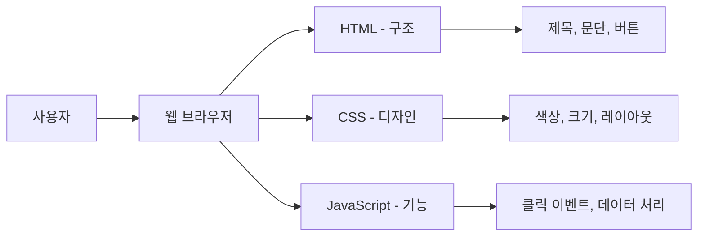

### 웹에서 JavaScript의 역할

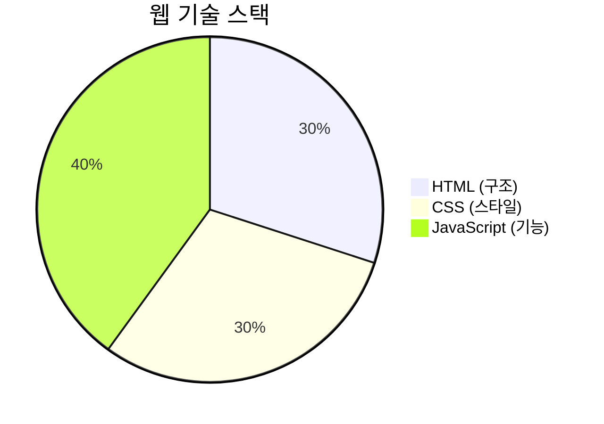

---

## 개발 환경 설정

### 1. 기본 HTML 구조
```html
<!DOCTYPE html>
<html lang="ko">
<head>
    <meta charset="UTF-8">
    <title>JavaScript 실습</title>
</head>
<body>
    <h1>JavaScript 학습하기</h1>
    
    <!-- JavaScript 코드를 여기에 작성 -->
    <script>
        // 여기에 JavaScript 코드 작성
        console.log("Hello, JavaScript!");
    </script>
</body>
</html>
```

### 2. 외부 파일로 분리하기
```html
<!-- HTML 파일 -->
<script src="app.js"></script>
```

```javascript
// app.js 파일
let message = "외부 파일에서 실행";
console.log(message);
```

---

## Part 1: 기초 문법

### 1. 주석 작성법

```javascript
// 한 줄 주석 - 코드에 대한 설명을 작성

/* 
   여러 줄 주석
   긴 설명이나 임시로 코드를 비활성화할 때 사용
*/
```

### 2. 변수와 상수

JavaScript에서 데이터를 저장하는 **컨테이너**입니다.

```javascript
// let: 값을 변경할 수 있는 변수
let x = 10;              // x에 숫자 10을 저장
x = 20;                  // x의 값을 20으로 변경 (✅ 가능)
console.log("x =", x);   // 콘솔에 "x = 20" 출력

// const: 값을 변경할 수 없는 상수
const y = 20;            // y에 숫자 20을 저장
// y = 30;               // ❌ 에러! const는 값 변경 불가
console.log("y =", y);   // 콘솔에 "y = 20" 출력

// var: 오래된 방식 (사용 지양)
var oldWay = 100;        // 호이스팅 문제로 사용 지양
```

**변수 선언 방식 비교:**

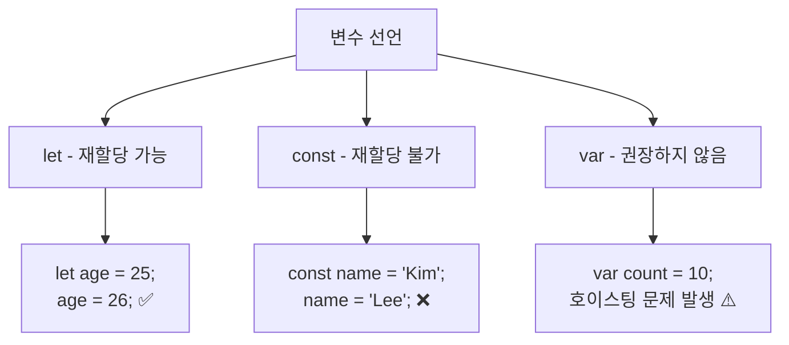

### 3. 데이터 타입

JavaScript의 **8가지 기본 데이터 타입**입니다.

```javascript
// 1. Number - 숫자 (정수, 소수)
let n = 42;                     // 정수
let decimal = 3.14159;          // 소수
let negative = -100;            // 음수

// 2. String - 문자열 (텍스트)
let s = "hello";                // 큰따옴표
let s2 = 'world';               // 작은따옴표 (동일함)
let s3 = `JavaScript`;          // 백틱 (템플릿 리터럴용)

// 3. Boolean - 불린 (참/거짓)
let b = true;                   // 참
let b2 = false;                 // 거짓

// 4. null - "의도적으로 비어있음"
let nothing = null;             // 개발자가 의도적으로 빈 값 설정

// 5. undefined - "정의되지 않음"
let undef;                      // 값을 할당하지 않은 상태

// 6. BigInt - 아주 큰 정수
let bigNumber = 9007199254740991n;  // 끝에 'n' 붙임

// 7. Symbol - 고유한 식별자
let sym = Symbol('id');         // 고유한 식별자 생성

// 8. Object - 객체 (배열, 함수 포함)
let obj = {name: "Kim", age: 30};   // 객체
let arr = [1, 2, 3];                // 배열도 객체

// typeof 연산자로 타입 확인
console.log("number:", typeof n);        // "number"
console.log("string:", typeof s);        // "string"
console.log("boolean:", typeof b);       // "boolean"
console.log("null:", typeof nothing);    // "object" (JS의 버그)
console.log("undefined:", typeof undef); // "undefined"
console.log("object:", typeof obj);      // "object"
```

**데이터 타입 분류:**

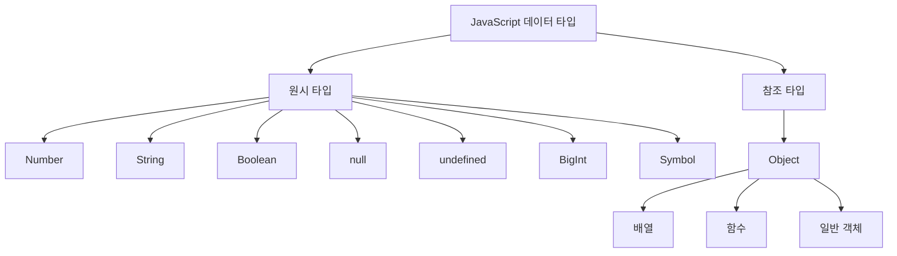

### 4. Truthy와 Falsy

조건문에서 **참/거짓으로 취급되는 값들**입니다.

```javascript
// Falsy 값들 (거짓으로 취급)
let falsyValues = [
    false,      // 불린 거짓
    0,          // 숫자 0
    -0,         // 음수 0
    NaN,        // Not a Number
    "",         // 빈 문자열
    null,       // 널
    undefined   // 정의되지 않음
];

// Truthy 값들 (참으로 취급)
let truthyValues = [
    true,       // 불린 참
    1,          // 0이 아닌 숫자
    "hello",    // 비어있지 않은 문자열
    "0",        // 문자열 "0" (문자열이므로 truthy!)
    [],         // 빈 배열 (객체이므로 truthy!)
    {},         // 빈 객체 (객체이므로 truthy!)
    "false"     // 문자열 "false" (문자열이므로 truthy!)
];

// 실제로 확인해보기
console.log("=== Falsy 값 확인 ===");
for (const value of falsyValues) {
    if (value) {
        console.log(value, "→ truthy");
    } else {
        console.log(value, "→ falsy");    // 이쪽으로 출력됨
    }
}

console.log("=== Truthy 값 확인 ===");
for (const value of truthyValues) {
    if (value) {
        console.log(value, "→ truthy");   // 이쪽으로 출력됨
    } else {
        console.log(value, "→ falsy");
    }
}
```

**Truthy/Falsy 판단 흐름:**

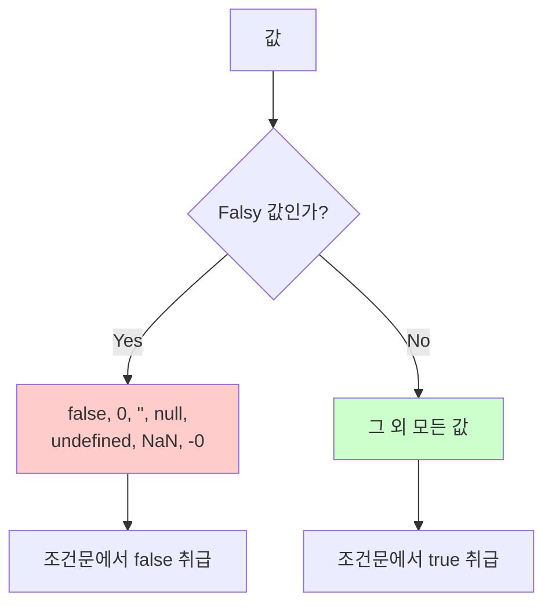

### 5. 템플릿 리터럴

문자열 안에 **변수나 표현식**을 쉽게 넣는 방법입니다.

```javascript
let name = "Lee";               // 이름 변수
let age = 30;                   // 나이 변수
let score = 85.5;               // 점수 변수

// 기존 방식 (문자열 연결)
let oldWay = "이름: " + name + ", 나이: " + age + "세";
console.log(oldWay);

// 템플릿 리터럴 방식 (백틱 ` 사용)
let newWay = `이름: ${name}, 나이: ${age}세`;
console.log(newWay);            // "이름: Lee, 나이: 30세"

// 표현식도 사용 가능
let calculation = `10 + 20 = ${10 + 20}`;
console.log(calculation);       // "10 + 20 = 30"

// 여러 줄 문자열도 쉽게 작성
let multiLine = `
안녕하세요!
제 이름은 ${name}입니다.
나이는 ${age}세이고,
점수는 ${score}점입니다.
`;
console.log(multiLine);

// 함수 호출도 가능
function getGrade(score) {
    return score >= 90 ? 'A' : score >= 80 ? 'B' : 'C';
}

let report = `${name}님의 성적: ${getGrade(score)}등급`;
console.log(report);            // "Lee님의 성적: B등급"
```

### 6. 연산자

값을 계산하거나 비교할 때 사용하는 **기호들**입니다.

```javascript
let a = 10;
let b = 3;

// 산술 연산자
console.log("덧셈:", a + b);        // 13
console.log("뺄셈:", a - b);        // 7  
console.log("곱셈:", a * b);        // 30
console.log("나눗셈:", a / b);      // 3.333...
console.log("나머지:", a % b);      // 1 (10을 3으로 나눈 나머지)
console.log("거듭제곱:", a ** b);   // 1000 (10의 3제곱)

// 대입 연산자
let c = 5;                          // c에 5 대입
c += 2;                             // c = c + 2와 같음 (c는 7)
c -= 1;                             // c = c - 1과 같음 (c는 6)
c *= 3;                             // c = c * 3과 같음 (c는 18)

// 비교 연산자
console.log("같음 (==):", 5 == "5");     // true (타입 변환 후 비교)
console.log("엄격히 같음 (===):", 5 === "5"); // false (타입까지 비교)
console.log("다름 (!=):", 5 != 3);       // true
console.log("엄격히 다름 (!==):", 5 !== "5"); // true
console.log("크다 (>):", 10 > 5);        // true
console.log("작다 (<):", 3 < 8);         // true
console.log("크거나 같다 (>=):", 5 >= 5); // true

// 논리 연산자
let x = true;
let y = false;
console.log("AND (&&):", x && y);        // false (둘 다 true여야 true)
console.log("OR (||):", x || y);         // true (하나라도 true면 true)
console.log("NOT (!):", !x);             // false (참을 거짓으로)

// 증감 연산자
let count = 0;
console.log("전위 증가:", ++count);      // 1 (먼저 증가 후 사용)
console.log("후위 증가:", count++);      // 1 (먼저 사용 후 증가)
console.log("최종 count:", count);       // 2
```

### 7. 조건문 - if/else

조건에 따라 **다른 코드를 실행**하는 구문입니다.

```javascript
let score = 85;                         // 점수 변수

// 기본 if문
if (score >= 80) {                      // 점수가 80 이상이면
    console.log("합격입니다!");          // 이 코드 실행
}

// if-else문
if (score >= 90) {                      // 90점 이상이면
    console.log("A등급");
} else if (score >= 80) {               // 80점 이상이면 (여기 실행됨)
    console.log("B등급");
} else if (score >= 70) {               // 70점 이상이면
    console.log("C등급");
} else {                                // 모든 조건이 거짓이면
    console.log("재시험");
}

// 삼항 연산자 (간단한 조건문)
let result = score >= 60 ? "통과" : "실패";
console.log("결과:", result);           // "결과: 통과"

// 실제 활용 예제
let age = 20;
let hasLicense = true;

if (age >= 18 && hasLicense) {          // 18세 이상이고 면허가 있으면
    console.log("운전 가능");
} else if (age >= 18) {                 // 18세 이상이지만 면허가 없으면
    console.log("면허를 취득하세요");
} else {                                // 18세 미만이면
    console.log("나이가 부족합니다");
}
```

**조건문 실행 흐름:**

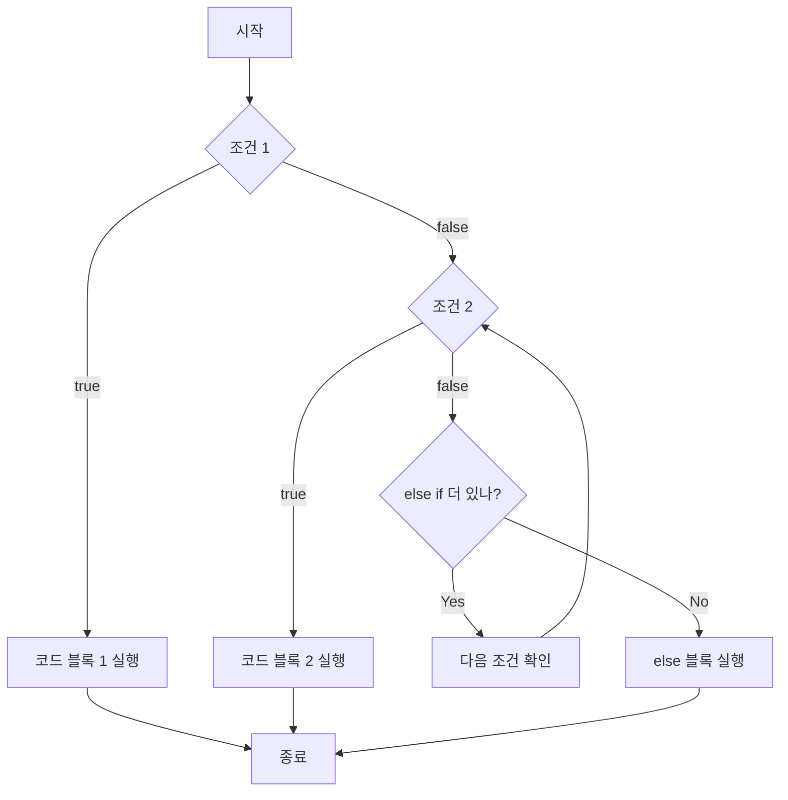

### 8. 반복문

같은 작업을 **여러 번 반복**할 때 사용하는 구문입니다.

```javascript
console.log("=== for문 ===");
// for문 - 정해진 횟수만큼 반복
for (let i = 0; i < 5; i++) {           // i가 0부터 4까지 (총 5번)
    console.log(`for 반복 ${i}번째:`, i * 2);  // 0, 2, 4, 6, 8 출력
}

console.log("=== while문 ===");
// while문 - 조건이 참인 동안 반복
let count = 0;                          // 카운터 변수 초기화
while (count < 3) {                     // count가 3보다 작은 동안
    console.log(`while 반복:`, count);
    count++;                            // count를 1 증가 (중요!)
}

console.log("=== do-while문 ===");
// do-while문 - 최소 한 번은 실행 후 조건 확인
let num = 0;
do {
    console.log(`do-while:`, num);      // 최소 한 번은 실행됨
    num++;
} while (num < 2);                      // 조건을 나중에 확인

console.log("=== for...of문 (배열 순회) ===");
// for...of문 - 배열의 각 요소를 순회
const fruits = ["사과", "바나나", "오렌지"];    // 문자열 배열
for (const fruit of fruits) {           // 배열의 각 요소를 fruit에 저장
    console.log(`과일:`, fruit);
}

console.log("=== for...in문 (객체 순회) ===");
// for...in문 - 객체의 각 속성을 순회
const person = {                        // 객체 생성
    name: "Kim",
    age: 25,
    city: "Seoul"
};

for (const key in person) {             // 객체의 각 키를 key에 저장
    console.log(`${key}: ${person[key]}`);  // 키와 값을 출력
}

console.log("=== 중첩 반복문 ===");
// 중첩 반복문 - 반복문 안의 반복문
for (let i = 1; i <= 3; i++) {         // 외부 반복문
    for (let j = 1; j <= 2; j++) {     // 내부 반복문
        console.log(`${i}-${j}`);       // 1-1, 1-2, 2-1, 2-2, 3-1, 3-2
    }
}
```

**반복문 종류별 특징:**

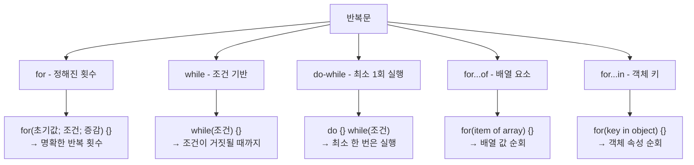

### 9. Switch문

여러 경우의 수를 **깔끔하게 처리**할 때 사용합니다.

```javascript
let day = 3;                            // 요일을 숫자로 표현

// switch문 기본 구조
switch (day) {                          // day 변수의 값에 따라 분기
    case 1:                             // day가 1이면
        console.log("월요일");
        break;                          // switch문 종료 (중요!)
    case 2:                             // day가 2이면
        console.log("화요일");
        break;
    case 3:                             // day가 3이면 (여기 실행됨)
        console.log("수요일");
        break;
    case 4:
        console.log("목요일");
        break;
    case 5:
        console.log("금요일");
        break;
    default:                            // 모든 case에 해당하지 않으면
        console.log("주말입니다!");
        break;                          // default에서도 break 권장
}

// break 없이 의도적으로 여러 case 실행
let grade = 'B';
switch (grade) {
    case 'A':
    case 'B':                           // A나 B면 둘 다 여기로
        console.log("우수한 성적입니다!");
        break;
    case 'C':
        console.log("보통 성적입니다.");
        break;
    case 'D':
    case 'F':
        console.log("더 노력이 필요합니다.");
        break;
    default:
        console.log("올바른 등급이 아닙니다.");
}

// 실용적인 예제: 계산기
function calculator(operator, a, b) {
    switch (operator) {
        case '+':
            return a + b;
        case '-':
            return a - b;
        case '*':
            return a * b;
        case '/':
            return b !== 0 ? a / b : "0으로 나눌 수 없습니다";
        default:
            return "지원하지 않는 연산자입니다";
    }
}

console.log(calculator('+', 10, 5));    // 15
console.log(calculator('/', 10, 0));    // "0으로 나눌 수 없습니다"
```

### 10. 예외 처리

프로그램에서 **오류가 발생했을 때 처리**하는 방법입니다.

```javascript
console.log("=== 기본 예외 처리 ===");
try {
    // 오류가 발생할 가능성이 있는 코드
    let result = JSON.parse("{잘못된 json}");  // JSON 파싱 오류 발생
    console.log(result);                        // 실행되지 않음
} catch (error) {
    // 오류가 발생했을 때 실행되는 코드
    console.error("JSON 파싱 오류:", error.message);
} finally {
    // 오류 발생 여부와 상관없이 항상 실행되는 코드
    console.log("JSON 파싱 시도 완료");
}

console.log("=== 직접 오류 발생시키기 ===");
function divide(a, b) {
    try {
        if (b === 0) {
            throw new Error("0으로 나눌 수 없습니다!");  // 직접 오류 발생
        }
        return a / b;
    } catch (error) {
        console.error("나눗셈 오류:", error.message);
        return null;
    }
}

console.log(divide(10, 2));             // 5
console.log(divide(10, 0));             // "나눗셈 오류: 0으로 나눌 수 없습니다!" 후 null

console.log("=== 여러 종류의 오류 처리 ===");
function processData(data) {
    try {
        // 1. 데이터 타입 검증
        if (typeof data !== 'object') {
            throw new TypeError("데이터는 객체여야 합니다");
        }
        
        // 2. 필수 속성 검증  
        if (!data.name) {
            throw new ReferenceError("name 속성이 필요합니다");
        }
        
        // 3. 값 범위 검증
        if (data.age < 0 || data.age > 150) {
            throw new RangeError("나이는 0-150 사이여야 합니다");
        }
        
        return `처리 완료: ${data.name}, ${data.age}세`;
        
    } catch (error) {
        if (error instanceof TypeError) {
            return `타입 오류: ${error.message}`;
        } else if (error instanceof ReferenceError) {
            return `참조 오류: ${error.message}`;
        } else if (error instanceof RangeError) {
            return `범위 오류: ${error.message}`;
        } else {
            return `알 수 없는 오류: ${error.message}`;
        }
    }
}

console.log(processData({name: "Kim", age: 25}));      // 정상 처리
console.log(processData("invalid"));                   // 타입 오류
console.log(processData({age: 25}));                   // 참조 오류
console.log(processData({name: "Lee", age: 200}));     // 범위 오류
```

**예외 처리 흐름도:**

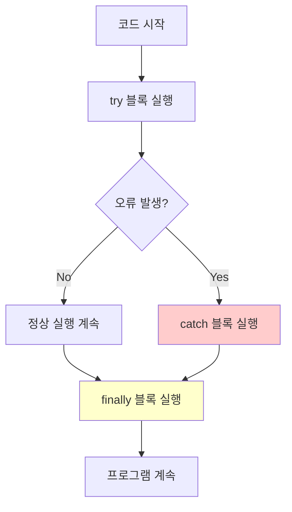

---

## Part 2: 고급 문법

### 1. 함수 (Function)

**재사용 가능한 코드 블록**을 만드는 방법입니다.

```javascript
console.log("=== 함수 선언문 ===");
// 함수 선언문 - 호이스팅됨 (선언 전에도 호출 가능)
console.log(add(5, 3));                 // 8 (함수 선언 전에도 호출 가능!)

function add(a, b) {                    // add라는 이름의 함수 선언
    return a + b;                       // 두 매개변수의 합을 반환
}

console.log("=== 함수 표현식 ===");
// 함수 표현식 - 호이스팅 안됨 (선언 후에만 호출 가능)
const subtract = function(a, b) {       // 익명 함수를 변수에 할당
    return a - b;                       // 첫 번째에서 두 번째 매개변수를 뺀 값
};

console.log(subtract(10, 4));           // 6

console.log("=== 매개변수와 인수 ===");
function greet(name, age = 20) {        // age에 기본값 20 설정
    return `안녕하세요, ${name}님! 나이는 ${age}세이군요.`;
}

console.log(greet("김철수"));           // age 기본값 사용
console.log(greet("이영희", 25));       // age 값 직접 전달

console.log("=== 클로저 (Closure) ===");
// 클로저: 함수가 선언된 환경의 변수를 기억하는 함수
function makeCounter() {                // 카운터 생성기 함수
    let count = 0;                      // 지역 변수 (외부에서 접근 불가)
    
    return function() {                 // 내부 함수를 반환
        count++;                        // count 변수를 기억하고 증가
        return count;                   // 현재 count 값 반환
    };
}

const counter1 = makeCounter();         // 첫 번째 카운터 생성
const counter2 = makeCounter();         // 두 번째 카운터 생성 (독립적)

console.log(counter1());                // 1
console.log(counter1());                // 2
console.log(counter2());                // 1 (독립적인 카운터)
console.log(counter1());                // 3

console.log("=== 즉시 실행 함수 (IIFE) ===");
// IIFE: 함수를 선언과 동시에 즉시 실행
(function() {
    console.log("즉시 실행됩니다!");
})();

// 매개변수가 있는 IIFE
(function(name) {
    console.log(`안녕하세요, ${name}님!`);
})("JavaScript");

console.log("=== 재귀 함수 ===");
// 재귀: 함수가 자기 자신을 호출
function factorial(n) {                 // 팩토리얼 계산 함수
    if (n <= 1) {                       // 기저 조건 (재귀 종료 조건)
        return 1;
    }
    return n * factorial(n - 1);        // 자기 자신을 호출
}

console.log(`5! = ${factorial(5)}`);    // 5! = 120 (5*4*3*2*1)
```

**함수의 종류와 특징:**

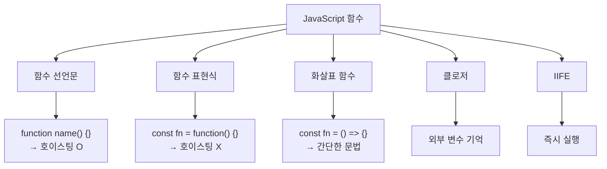

### 2. 화살표 함수 (Arrow Function)

ES6에서 도입된 **더 간단한 함수 작성 방법**입니다.

```javascript
console.log("=== 화살표 함수 기본 형태 ===");
// 기본 화살표 함수
const multiply = (a, b) => {            // 매개변수가 2개 이상이면 괄호 필요
    return a * b;                       // 여러 줄이면 중괄호와 return 필요
};
console.log(multiply(4, 5));            // 20

// 한 줄로 간단히 작성 (return 생략 가능)
const multiply2 = (a, b) => a * b;      // 중괄호와 return 생략
console.log(multiply2(3, 7));           // 21

console.log("=== 매개변수별 문법 ===");
// 매개변수가 1개일 때 - 괄호 생략 가능
const double = x => x * 2;              // 괄호 생략
console.log(double(6));                 // 12

// 매개변수가 0개일 때 - 빈 괄호 필요
const getRandom = () => Math.random();  // 빈 괄호 필요
console.log(getRandom());               // 0~1 사이 랜덤 숫자

// 매개변수가 2개 이상일 때 - 괄호 필요
const add = (a, b) => a + b;            // 괄호 필요
console.log(add(10, 20));               // 30

console.log("=== 객체 반환하기 ===");
// 객체를 반환할 때 - 소괄호로 감싸기
const createPerson = (name, age) => ({  // 객체를 소괄호로 감쌈
    name: name,
    age: age,
    introduce: function() {
        return `안녕하세요, ${this.name}입니다.`;
    }
});

const person = createPerson("김철수", 30);
console.log(person.introduce());        // "안녕하세요, 김철수입니다."

console.log("=== 배열 메서드와 화살표 함수 ===");
const numbers = [1, 2, 3, 4, 5];

// 기존 방식
const doubled1 = numbers.map(function(n) {
    return n * 2;
});

// 화살표 함수 방식 (더 간단!)
const doubled2 = numbers.map(n => n * 2);
console.log("doubled:", doubled2);      // [2, 4, 6, 8, 10]

const evens = numbers.filter(n => n % 2 === 0);
console.log("evens:", evens);           // [2, 4]

const sum = numbers.reduce((acc, n) => acc + n, 0);
console.log("sum:", sum);               // 15

console.log("=== 복잡한 로직의 화살표 함수 ===");
const processNumbers = (arr) => {
    return arr
        .filter(n => n > 0)             // 양수만 필터링
        .map(n => n * n)                // 제곱하기
        .reduce((acc, n) => acc + n, 0); // 모두 더하기
};

const result = processNumbers([-2, -1, 0, 1, 2, 3, 4]);
console.log("처리 결과:", result);      // 1 + 4 + 9 + 16 = 30
```

### 3. 클래스 (Class)

**객체를 생성하기 위한 템플릿**입니다.

```javascript
console.log("=== 기본 클래스 ===");
class Person {
    // 생성자: 객체가 생성될 때 실행되는 함수
    constructor(name, age) {
        this._name = name;              // private처럼 사용하기 위해 _사용
        this._age = age;
    }
    
    // getter: 속성 값을 가져올 때 사용
    get name() {
        return this._name;
    }
    
    // setter: 속성 값을 설정할 때 사용
    set name(newName) {
        if (typeof newName === 'string' && newName.length > 0) {
            this._name = newName;
        } else {
            console.log("올바른 이름을 입력하세요.");
        }
    }
    
    get age() {
        return this._age;
    }
    
    set age(newAge) {
        if (typeof newAge === 'number' && newAge >= 0) {
            this._age = newAge;
        } else {
            console.log("올바른 나이를 입력하세요.");
        }
    }
    
    // 일반 메서드
    introduce() {
        return `안녕하세요! 제 이름은 ${this._name}이고, 나이는 ${this._age}세입니다.`;
    }
    
    // 정적 메서드 (클래스 자체에서 호출)
    static compareAge(person1, person2) {
        return person1.age - person2.age;
    }
}

// 객체 생성 및 사용
const person1 = new Person("김철수", 25);
console.log(person1.introduce());

// getter/setter 사용
console.log("이름:", person1.name);     // getter 사용
person1.name = "김영희";                // setter 사용
console.log("변경된 이름:", person1.name);

console.log("=== 클래스 상속 ===");
class Student extends Person {          // Person 클래스를 상속
    constructor(name, age, studentId, major) {
        super(name, age);               // 부모 클래스의 생성자 호출
        this.studentId = studentId;
        this.major = major;
    }
    
    // 메서드 오버라이딩 (부모 메서드를 새로 정의)
    introduce() {
        return `${super.introduce()} 학번은 ${this.studentId}이고, 전공은 ${this.major}입니다.`;
    }
    
    // 자식 클래스만의 고유 메서드
    study() {
        return `${this._name}이(가) ${this.major}를 공부하고 있습니다.`;
    }
    
    // 정적 메서드도 상속 및 오버라이딩 가능
    static compareStudent(student1, student2) {
        return student1.studentId.localeCompare(student2.studentId);
    }
}

const student1 = new Student("이철수", 20, "2023001", "컴퓨터공학");
console.log(student1.introduce());
console.log(student1.study());

console.log("=== 정적 메서드 사용 ===");
const person2 = new Person("박영희", 30);
console.log("나이 차이:", Person.compareAge(person1, person2)); // -5

console.log("=== 프라이빗 필드 (ES2022) ===");
class BankAccount {
    #balance = 0;                       // 진짜 private 필드 (#사용)
    
    constructor(initialBalance) {
        this.#balance = initialBalance;
    }
    
    deposit(amount) {
        if (amount > 0) {
            this.#balance += amount;
            return `${amount}원이 입금되었습니다. 잔액: ${this.#balance}원`;
        }
        return "올바른 금액을 입력하세요.";
    }
    
    withdraw(amount) {
        if (amount > 0 && amount <= this.#balance) {
            this.#balance -= amount;
            return `${amount}원이 출금되었습니다. 잔액: ${this.#balance}원`;
        }
        return "출금할 수 없습니다.";
    }
    
    getBalance() {
        return this.#balance;
    }
}

const account = new BankAccount(10000);
console.log(account.deposit(5000));
console.log(account.withdraw(3000));
console.log("현재 잔액:", account.getBalance());
// console.log(account.#balance);       // 에러! private 필드는 외부에서 접근 불가
```

**클래스 구조도:**

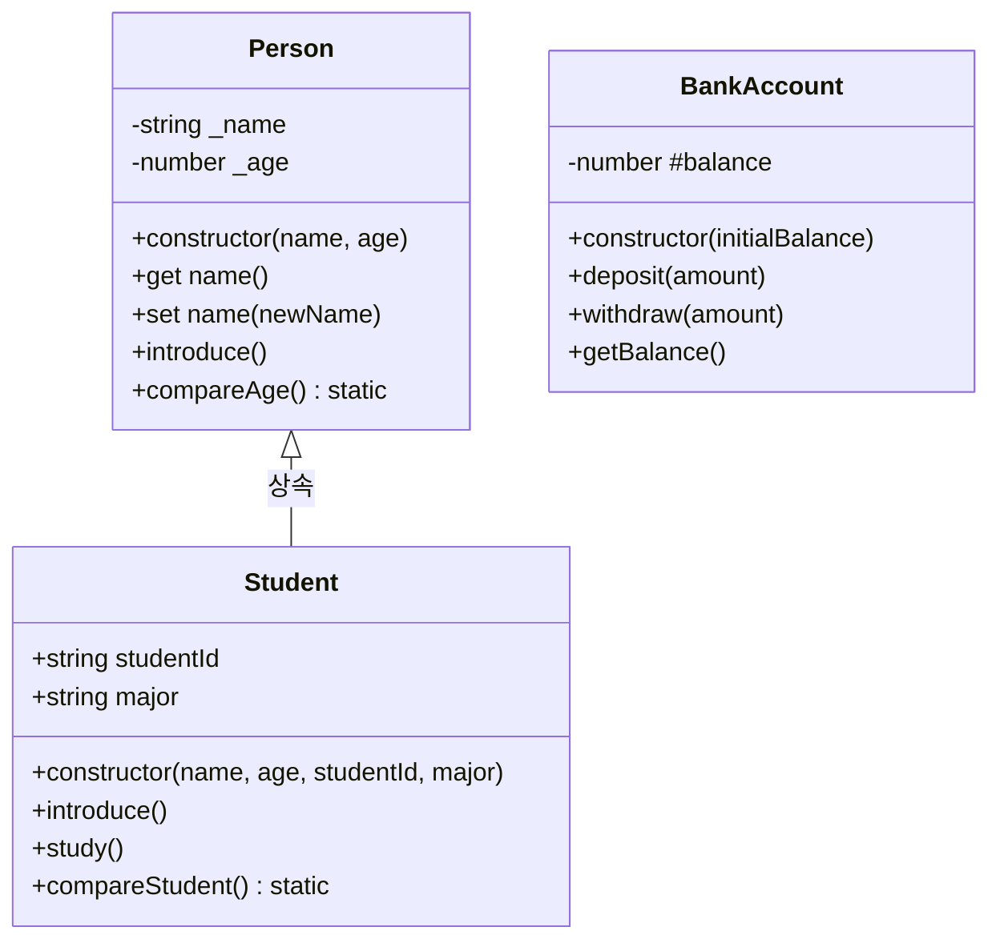

### 4. 고차함수 (Higher-order Functions)

**배열을 다루는 강력한 함수들**입니다.

```javascript
console.log("=== 고차함수 기본 개념 ===");
const numbers = [1, 2, 3, 4, 5, 6, 7, 8, 9, 10];

console.log("원본 배열:", numbers);

console.log("=== map(): 각 요소를 변환 ===");
// map: 배열의 각 요소를 변환하여 새로운 배열 생성
const doubled = numbers.map(num => num * 2);
console.log("2배로 만들기:", doubled);

const squared = numbers.map(num => num ** 2);
console.log("제곱하기:", squared);

// 객체 배열 변환
const users = [
    {name: "김철수", age: 25},
    {name: "이영희", age: 30},
    {name: "박민수", age: 35}
];

const userNames = users.map(user => user.name);
console.log("사용자 이름들:", userNames);

const userInfo = users.map(user => `${user.name} (${user.age}세)`);
console.log("사용자 정보:", userInfo);

console.log("=== filter(): 조건에 맞는 요소만 선택 ===");
// filter: 조건을 만족하는 요소만 골라서 새로운 배열 생성
const evenNumbers = numbers.filter(num => num % 2 === 0);
console.log("짝수만:", evenNumbers);

const bigNumbers = numbers.filter(num => num > 5);
console.log("5보다 큰 수:", bigNumbers);

const adults = users.filter(user => user.age >= 30);
console.log("30세 이상:", adults);

// 복합 조건 사용
const evenAndBig = numbers.filter(num => num % 2 === 0 && num > 5);
console.log("짝수이면서 5보다 큰 수:", evenAndBig);

console.log("=== reduce(): 배열을 하나의 값으로 축약 ===");
// reduce: 배열의 모든 요소를 하나의 값으로 축약
const sum = numbers.reduce((accumulator, current) => {
    console.log(`acc: ${accumulator}, cur: ${current}`);
    return accumulator + current;
}, 0);  // 0은 초기값
console.log("총합:", sum);

const max = numbers.reduce((acc, cur) => acc > cur ? acc : cur);
console.log("최대값:", max);

const min = numbers.reduce((acc, cur) => acc < cur ? acc : cur);
console.log("최소값:", min);

// 객체로 축약하기
const ageGroups = users.reduce((acc, user) => {
    const ageGroup = user.age >= 30 ? 'senior' : 'junior';
    if (!acc[ageGroup]) {
        acc[ageGroup] = [];
    }
    acc[ageGroup].push(user);
    return acc;
}, {});
console.log("연령대별 그룹:", ageGroups);

console.log("=== forEach(): 각 요소에 대해 실행 ===");
// forEach: 각 요소에 대해 함수 실행 (반환값 없음)
console.log("forEach로 출력:");
numbers.forEach((num, index) => {
    console.log(`인덱스 ${index}: ${num}`);
});

console.log("=== find() & findIndex(): 조건에 맞는 첫 번째 요소 찾기 ===");
// find: 조건을 만족하는 첫 번째 요소 반환
const firstEven = numbers.find(num => num % 2 === 0);
console.log("첫 번째 짝수:", firstEven);

const foundUser = users.find(user => user.age > 25);
console.log("25세 초과 첫 번째 사용자:", foundUser);

// findIndex: 조건을 만족하는 첫 번째 요소의 인덱스 반환
const firstEvenIndex = numbers.findIndex(num => num % 2 === 0);
console.log("첫 번째 짝수의 인덱스:", firstEvenIndex);

console.log("=== some() & every(): 조건 검사 ===");
// some: 하나라도 조건을 만족하면 true
const hasEven = numbers.some(num => num % 2 === 0);
console.log("짝수가 있는가?", hasEven);

// every: 모든 요소가 조건을 만족하면 true
const allPositive = numbers.every(num => num > 0);
console.log("모두 양수인가?", allPositive);

console.log("=== 고차함수 체이닝 ===");
// 여러 고차함수를 연결해서 사용
const result = numbers
    .filter(num => num % 2 === 0)       // 짝수만 선택
    .map(num => num * num)              // 제곱하기
    .reduce((acc, cur) => acc + cur, 0); // 모두 더하기

console.log("짝수의 제곱의 합:", result); // 2² + 4² + 6² + 8² + 10² = 220

// 실용적인 예제: 쇼핑몰 상품 데이터 처리
const products = [
    {id: 1, name: "노트북", price: 1200000, category: "전자제품", inStock: true},
    {id: 2, name: "마우스", price: 30000, category: "전자제품", inStock: true},
    {id: 3, name: "키보드", price: 80000, category: "전자제품", inStock: false},
    {id: 4, name: "책상", price: 200000, category: "가구", inStock: true},
    {id: 5, name: "의자", price: 150000, category: "가구", inStock: true}
];

// 재고가 있는 전자제품 중 가격이 100만원 이하인 제품들의 총 가격
const totalPrice = products
    .filter(product => product.inStock)                    // 재고가 있는 것만
    .filter(product => product.category === "전자제품")    // 전자제품만
    .filter(product => product.price <= 1000000)          // 100만원 이하만
    .reduce((total, product) => total + product.price, 0); // 가격 합계

console.log("조건에 맞는 제품들의 총 가격:", totalPrice);
```

**고차함수 동작 과정:**

```mermaid
graph TD
    A["[1,2,3,4,5]"] --> B[map: n => n*2]
    A --> C[filter: n => n%2===0]
    A --> D[reduce: (acc,n) => acc+n]
    
    B --> E["[2,4,6,8,10]<br/>각 요소 변환"]
    C --> F["[2,4]<br/>조건 만족 요소만"]
    D --> G["15<br/>하나의 값으로 축약"]
    
    H["[1,2,3,4,5]"] --> I[filter] --> J[map] --> K[reduce]
    I --> L["[2,4] (짝수만)"]
    L --> J
    J --> M["[4,16] (제곱)"]
    M --> K
    K --> N["20 (합계)"]
    
    style N fill:#90EE90
```

### 5. 구조 분해 할당 (Destructuring)

**배열이나 객체를 분해하여 변수로 할당**하는 문법입니다.

```javascript
console.log("=== 배열 구조 분해 할당 ===");
const fruits = ["사과", "바나나", "오렌지", "포도"];

// 기존 방식
const first = fruits[0];
const second = fruits[1];

// 구조 분해 할당 방식
const [첫번째, 두번째, 세번째] = fruits;
console.log("첫번째:", 첫번째);        // "사과"
console.log("두번째:", 두번째);        // "바나나"
console.log("세번째:", 세번째);        // "오렌지"

// 일부 요소 건너뛰기
const [apple, , orange] = fruits;      // 바나나는 건너뜀
console.log("apple:", apple);          // "사과"
console.log("orange:", orange);        // "오렌지"

// 나머지 요소 모두 가져오기
const [head, ...tail] = fruits;
console.log("head:", head);            // "사과"
console.log("tail:", tail);            // ["바나나", "오렌지", "포도"]

// 기본값 설정
const [a, b, c, d, e = "기본값"] = fruits;
console.log("e:", e);                  // "기본값" (fruits[4]가 없으므로)

console.log("=== 객체 구조 분해 할당 ===");
const person = {
    name: "김철수",
    age: 30,
    city: "서울",
    hobby: "독서"
};

// 기존 방식
const name = person.name;
const age = person.age;

// 구조 분해 할당 방식
const {name: userName, age: userAge, city} = person;
console.log("userName:", userName);     // "김철수"
console.log("userAge:", userAge);       // 30
console.log("city:", city);             // "서울"

// 변수명과 속성명이 같으면 간단하게
const {hobby} = person;
console.log("hobby:", hobby);           // "독서"

// 기본값 설정
const {name: n, job = "무직"} = person;
console.log("n:", n);                   // "김철수"
console.log("job:", job);               // "무직" (person.job이 없으므로)

console.log("=== 중첩 구조 분해 할당 ===");
const student = {
    name: "이영희",
    scores: {
        math: 90,
        english: 85,
        science: 95
    },
    friends: ["김철수", "박민수", "최영수"]
};

// 중첩 객체 구조 분해
const {
    name: studentName,
    scores: {math, english},
    friends: [bestFriend]
} = student;

console.log("studentName:", studentName);   // "이영희"
console.log("math:", math);                 // 90
console.log("english:", english);           // 85
console.log("bestFriend:", bestFriend);     // "김철수"

console.log("=== 함수 매개변수에서 구조 분해 ===");
// 객체를 매개변수로 받는 함수
function introduce({name, age, city = "미상"}) {
    return `안녕하세요! ${name}입니다. ${age}세이고 ${city}에 살고 있습니다.`;
}

const user1 = {name: "김철수", age: 25, city: "부산"};
const user2 = {name: "이영희", age: 30}; // city 없음

console.log(introduce(user1));
console.log(introduce(user2));

// 배열을 매개변수로 받는 함수
function calculateSum([a, b, c = 0]) {
    return a + b + c;
}

console.log(calculateSum([10, 20]));        // 30 (c는 기본값 0)
console.log(calculateSum([1, 2, 3]));       // 6

console.log("=== 변수 교환 ===");
let x = 10;
let y = 20;

console.log("교환 전 - x:", x, "y:", y);

// 기존 방식 (임시 변수 필요)
// let temp = x;
// x = y;
// y = temp;

// 구조 분해 할당 방식 (간단!)
[x, y] = [y, x];

console.log("교환 후 - x:", x, "y:", y);
```

### 6. 스프레드와 나머지 연산자 (...) 

**배열이나 객체를 펼치거나 나머지 요소를 수집**하는 연산자입니다.

```javascript
console.log("=== 배열 스프레드 연산자 ===");
const arr1 = [1, 2, 3];
const arr2 = [4, 5, 6];

// 배열 합치기 (기존 방식)
const combined1 = arr1.concat(arr2);
console.log("concat:", combined1);

// 스프레드 연산자로 합치기
const combined2 = [...arr1, ...arr2];
console.log("spread:", combined2);

// 중간에 요소 추가하며 합치기
const combined3 = [...arr1, 10, ...arr2, 20];
console.log("중간 추가:", combined3);

// 배열 복사
const originalArray = [1, 2, 3];
const copiedArray = [...originalArray];    // 얕은 복사
copiedArray.push(4);
console.log("원본:", originalArray);       // [1, 2, 3] (변경 안됨)
console.log("복사본:", copiedArray);       // [1, 2, 3, 4]

console.log("=== 객체 스프레드 연산자 ===");
const obj1 = {a: 1, b: 2};
const obj2 = {c: 3, d: 4};

// 객체 합치기
const combined = {...obj1, ...obj2};
console.log("객체 합치기:", combined);     // {a: 1, b: 2, c: 3, d: 4}

// 객체 복사 및 속성 추가/수정
const person = {name: "김철수", age: 30};
const updatedPerson = {...person, age: 31, city: "서울"};
console.log("업데이트된 객체:", updatedPerson);

// 속성 덮어쓰기 (순서 중요!)
const config1 = {...{a: 1, b: 2}, b: 999}; // b가 999로 덮어써짐
const config2 = {b: 999, ...{a: 1, b: 2}}; // b가 2로 덮어써짐
console.log("config1:", config1);          // {a: 1, b: 999}
console.log("config2:", config2);          // {a: 1, b: 2}

console.log("=== 함수에서 스프레드 연산자 ===");
function sum(a, b, c) {
    return a + b + c;
}

const numbers = [1, 2, 3];

// 기존 방식
console.log(sum.apply(null, numbers));     // 6

// 스프레드 연산자 방식
console.log(sum(...numbers));             // 6

// Math 함수와 함께 사용
const nums = [5, 2, 8, 1, 9];
console.log("최대값:", Math.max(...nums)); // 9
console.log("최소값:", Math.min(...nums)); // 1

console.log("=== 나머지 매개변수 (Rest Parameters) ===");
// 나머지 매개변수: 여러 개의 인수를 배열로 수집
function logAll(first, ...rest) {          // 첫 번째 외 나머지를 배열로
    console.log("첫 번째:", first);
    console.log("나머지:", rest);
    console.log("나머지 개수:", rest.length);
}

logAll("A", "B", "C", "D", "E");
// 첫 번째: A
// 나머지: ["B", "C", "D", "E"]
// 나머지 개수: 4

// 가변 인수 함수 만들기
function calculateSum(...numbers) {        // 모든 인수를 배열로 수집
    return numbers.reduce((sum, num) => sum + num, 0);
}

console.log(calculateSum(1, 2, 3));        // 6
console.log(calculateSum(1, 2, 3, 4, 5)); // 15

// 배열과 나머지 매개변수 조합
function processData(action, ...data) {
    switch (action) {
        case 'sum':
            return data.reduce((a, b) => a + b, 0);
        case 'multiply':
            return data.reduce((a, b) => a * b, 1);
        case 'max':
            return Math.max(...data);
        default:
            return data;
    }
}

console.log(processData('sum', 1, 2, 3, 4));      // 10
console.log(processData('multiply', 2, 3, 4));    // 24
console.log(processData('max', 5, 2, 8, 1));      // 8

console.log("=== 구조 분해와 나머지 연산자 조합 ===");
const [head, ...tail] = [1, 2, 3, 4, 5];
console.log("head:", head);                // 1
console.log("tail:", tail);                // [2, 3, 4, 5]

const {name, ...otherInfo} = {
    name: "김철수",
    age: 30,
    city: "서울",
    hobby: "독서"
};
console.log("name:", name);                // "김철수"
console.log("otherInfo:", otherInfo);      // {age: 30, city: "서울", hobby: "독서"}
```

**스프레드와 나머지 연산자 비교:**

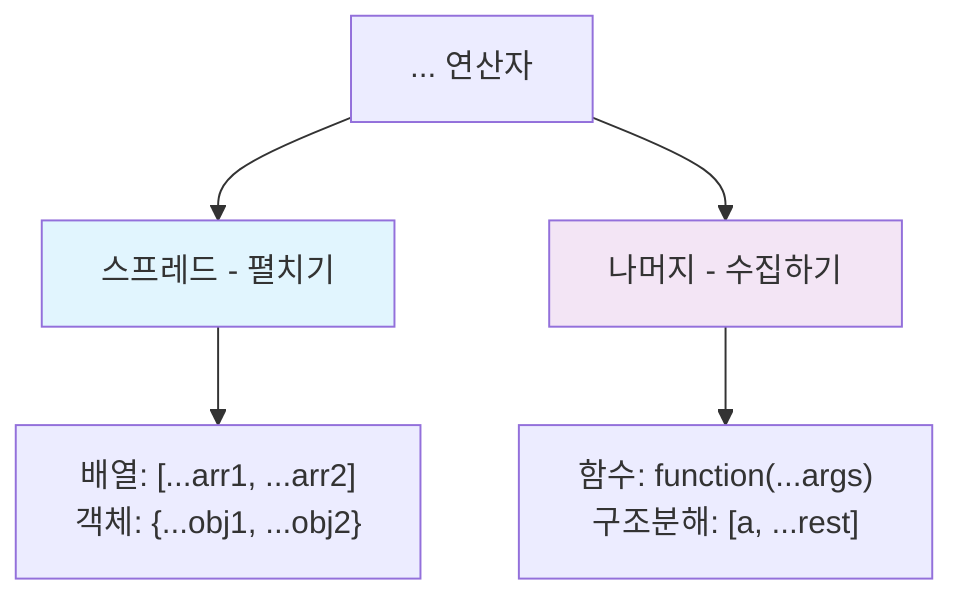

---

## 실습 프로젝트

### 프로젝트 1: 간단한 계산기

```javascript
console.log("=== 간단한 계산기 프로젝트 ===");

class Calculator {
    constructor() {
        this.history = [];              // 계산 기록 저장
    }
    
    // 기본 연산 메서드들
    add(a, b) {
        const result = a + b;
        this.#saveHistory('덧셈', a, b, result);
        return result;
    }
    
    subtract(a, b) {
        const result = a - b;
        this.#saveHistory('뺄셈', a, b, result);
        return result;
    }
    
    multiply(a, b) {
        const result = a * b;
        this.#saveHistory('곱셈', a, b, result);
        return result;
    }
    
    divide(a, b) {
        if (b === 0) {
            throw new Error("0으로 나눌 수 없습니다!");
        }
        const result = a / b;
        this.#saveHistory('나눗셈', a, b, result);
        return result;
    }
    
    // 고급 연산
    power(base, exponent) {
        const result = Math.pow(base, exponent);
        this.#saveHistory('거듭제곱', base, exponent, result);
        return result;
    }
    
    sqrt(number) {
        if (number < 0) {
            throw new Error("음수의 제곱근은 계산할 수 없습니다!");
        }
        const result = Math.sqrt(number);
        this.history.push({
            operation: '제곱근',
            input: number,
            result: result,
            timestamp: new Date().toLocaleString()
        });
        return result;
    }
    
    // 여러 숫자 연산 (나머지 매개변수 사용)
    sumAll(...numbers) {
        const result = numbers.reduce((sum, num) => sum + num, 0);
        this.history.push({
            operation: '다중 덧셈',
            input: numbers,
            result: result,
            timestamp: new Date().toLocaleString()
        });
        return result;
    }
    
    // 배열 통계 계산
    calculateStats(numbers) {
        if (!Array.isArray(numbers) || numbers.length === 0) {
            throw new Error("유효한 숫자 배열을 입력하세요!");
        }
        
        const sum = numbers.reduce((acc, num) => acc + num, 0);
        const average = sum / numbers.length;
        const max = Math.max(...numbers);
        const min = Math.min(...numbers);
        
        const stats = {sum, average, max, min, count: numbers.length};
        
        this.history.push({
            operation: '통계 계산',
            input: numbers,
            result: stats,
            timestamp: new Date().toLocaleString()
        });
        
        return stats;
    }
    
    // Private 메서드 (기록 저장)
    #saveHistory(operation, a, b, result) {
        this.history.push({
            operation: operation,
            input: `${a} ${this.#getOperatorSymbol(operation)} ${b}`,
            result: result,
            timestamp: new Date().toLocaleString()
        });
    }
    
    #getOperatorSymbol(operation) {
        const symbols = {
            '덧셈': '+',
            '뺄셈': '-',
            '곱셈': '×',
            '나눗셈': '÷',
            '거듭제곱': '^'
        };
        return symbols[operation] || '?';
    }
    
    // 계산 기록 조회
    getHistory() {
        return this.history;
    }
    
    // 기록 초기화
    clearHistory() {
        this.history = [];
        console.log("계산 기록이 초기화되었습니다.");
    }
    
    // 최근 결과 조회
    getLastResult() {
        if (this.history.length === 0) {
            return "계산 기록이 없습니다.";
        }
        return this.history[this.history.length - 1].result;
    }
}

// 계산기 사용 예제
const calc = new Calculator();

console.log("기본 연산 테스트:");
console.log("5 + 3 =", calc.add(5, 3));
console.log("10 - 4 =", calc.subtract(10, 4));
console.log("6 × 7 =", calc.multiply(6, 7));
console.log("15 ÷ 3 =", calc.divide(15, 3));

console.log("\n고급 연산 테스트:");
console.log("2의 8제곱 =", calc.power(2, 8));
console.log("√16 =", calc.sqrt(16));
console.log("1+2+3+4+5 =", calc.sumAll(1, 2, 3, 4, 5));

console.log("\n통계 계산 테스트:");
const numbers = [85, 92, 78, 96, 88, 91];
const stats = calc.calculateStats(numbers);
console.log("점수 통계:", stats);

console.log("\n예외 처리 테스트:");
try {
    calc.divide(10, 0);
} catch (error) {
    console.error("오류:", error.message);
}

console.log("\n계산 기록:");
calc.getHistory().forEach((record, index) => {
    console.log(`${index + 1}. [${record.timestamp}] ${record.operation}: ${record.input} = ${typeof record.result === 'object' ? JSON.stringify(record.result) : record.result}`);
});
```

### 프로젝트 2: 학생 관리 시스템

```javascript
console.log("\n=== 학생 관리 시스템 프로젝트 ===");

class Student {
    constructor(id, name, age, major) {
        this.id = id;
        this.name = name;
        this.age = age;
        this.major = major;
        this.grades = {};               // 과목별 성적 저장
        this.attendance = [];           // 출석 기록
    }
    
    // 성적 추가
    addGrade(subject, score) {
        if (score < 0 || score > 100) {
            throw new Error("성적은 0-100 사이여야 합니다!");
        }
        
        if (!this.grades[subject]) {
            this.grades[subject] = [];
        }
        
        this.grades[subject].push({
            score: score,
            date: new Date().toLocaleDateString()
        });
        
        return `${this.name}의 ${subject} 성적 ${score}점이 추가되었습니다.`;
    }
    
    // 평균 성적 계산
    getAverageGrade(subject = null) {
        if (subject) {
            // 특정 과목 평균
            if (!this.grades[subject]) {
                return 0;
            }
            const scores = this.grades[subject].map(grade => grade.score);
            return scores.reduce((sum, score) => sum + score, 0) / scores.length;
        } else {
            // 전체 평균
            const allScores = Object.values(this.grades)
                .flat()
                .map(grade => grade.score);
            
            if (allScores.length === 0) return 0;
            return allScores.reduce((sum, score) => sum + score, 0) / allScores.length;
        }
    }
    
    // 출석 체크
    markAttendance(date, status = 'present') {
        this.attendance.push({
            date: date,
            status: status  // 'present', 'absent', 'late'
        });
        return `${this.name}의 ${date} 출석이 ${status}로 기록되었습니다.`;
    }
    
    // 출석률 계산
    getAttendanceRate() {
        if (this.attendance.length === 0) return 0;
        
        const presentCount = this.attendance.filter(record => 
            record.status === 'present' || record.status === 'late'
        ).length;
        
        return (presentCount / this.attendance.length) * 100;
    }
    
    // 학생 정보 요약
    getSummary() {
        return {
            기본정보: {
                학번: this.id,
                이름: this.name,
                나이: this.age,
                전공: this.major
            },
            성적정보: {
                전체평균: Math.round(this.getAverageGrade() * 100) / 100,
                과목별성적: Object.keys(this.grades).reduce((acc, subject) => {
                    acc[subject] = Math.round(this.getAverageGrade(subject) * 100) / 100;
                    return acc;
                }, {})
            },
            출석정보: {
                총출석일수: this.attendance.length,
                출석률: Math.round(this.getAttendanceRate() * 100) / 100 + '%'
            }
        };
    }
}

class StudentManager {
    constructor() {
        this.students = [];
    }
    
    // 학생 추가
    addStudent(id, name, age, major) {
        // 중복 ID 체크
        if (this.students.find(student => student.id === id)) {
            throw new Error(`학번 ${id}는 이미 존재합니다!`);
        }
        
        const student = new Student(id, name, age, major);
        this.students.push(student);
        return `학생 ${name}(${id})이 추가되었습니다.`;
    }
    
    // 학생 찾기
    findStudent(id) {
        const student = this.students.find(s => s.id === id);
        if (!student) {
            throw new Error(`학번 ${id}에 해당하는 학생을 찾을 수 없습니다.`);
        }
        return student;
    }
    
    // 전체 학생 목록
    getAllStudents() {
        return this.students.map(student => ({
            학번: student.id,
            이름: student.name,
            전공: student.major,
            평균성적: Math.round(student.getAverageGrade() * 100) / 100
        }));
    }
    
    // 전공별 학생 조회
    getStudentsByMajor(major) {
        return this.students
            .filter(student => student.major === major)
            .map(student => ({
                학번: student.id,
                이름: student.name,
                평균성적: Math.round(student.getAverageGrade() * 100) / 100
            }));
    }
    
    // 성적 우수 학생 조회
    getTopStudents(count = 3) {
        return this.students
            .map(student => ({
                학번: student.id,
                이름: student.name,
                전공: student.major,
                평균성적: student.getAverageGrade()
            }))
            .sort((a, b) => b.평균성적 - a.평균성적)  // 내림차순 정렬
            .slice(0, count);
    }
    
    // 학과별 통계
    getMajorStatistics() {
        const majorStats = {};
        
        this.students.forEach(student => {
            const major = student.major;
            if (!majorStats[major]) {
                majorStats[major] = {
                    학생수: 0,
                    평균성적들: [],
                    전체평균: 0
                };
            }
            
            majorStats[major].학생수++;
            majorStats[major].평균성적들.push(student.getAverageGrade());
        });
        
        // 각 학과의 전체 평균 계산
        Object.keys(majorStats).forEach(major => {
            const scores = majorStats[major].평균성적들;
            majorStats[major].전체평균 = scores.length > 0 
                ? Math.round((scores.reduce((sum, score) => sum + score, 0) / scores.length) * 100) / 100
                : 0;
            delete majorStats[major].평균성적들; // 불필요한 데이터 제거
        });
        
        return majorStats;
    }
}

// 학생 관리 시스템 사용 예제
const manager = new StudentManager();

// 학생 추가
console.log(manager.addStudent("2023001", "김철수", 20, "컴퓨터공학"));
console.log(manager.addStudent("2023002", "이영희", 19, "전자공학"));
console.log(manager.addStudent("2023003", "박민수", 21, "컴퓨터공학"));
console.log(manager.addStudent("2023004", "최지원", 20, "기계공학"));

// 성적 추가
const student1 = manager.findStudent("2023001");
student1.addGrade("수학", 95);
student1.addGrade("프로그래밍", 88);
student1.addGrade("영어", 82);

const student2 = manager.findStudent("2023002");
student2.addGrade("수학", 92);
student2.addGrade("전자회로", 90);
student2.addGrade("영어", 85);

const student3 = manager.findStudent("2023003");
student3.addGrade("수학", 78);
student3.addGrade("프로그래밍", 95);
student3.addGrade("영어", 80);

// 출석 기록
student1.markAttendance("2024-01-15", "present");
student1.markAttendance("2024-01-16", "present");
student1.markAttendance("2024-01-17", "late");
student1.markAttendance("2024-01-18", "absent");

console.log("\n=== 전체 학생 목록 ===");
console.table(manager.getAllStudents());

console.log("\n=== 컴퓨터공학과 학생들 ===");
console.table(manager.getStudentsByMajor("컴퓨터공학"));

console.log("\n=== 성적 우수 학생 TOP 3 ===");
console.table(manager.getTopStudents(3));

console.log("\n=== 학과별 통계 ===");
console.table(manager.getMajorStatistics());

console.log("\n=== 개별 학생 상세 정보 ===");
console.log("김철수 학생 정보:", JSON.stringify(student1.getSummary(), null, 2));
```

### 프로젝트 3: To-Do 리스트 애플리케이션

```javascript
console.log("\n=== To-Do 리스트 애플리케이션 ===");

class Task {
    constructor(id, title, description = "", priority = "medium") {
        this.id = id;
        this.title = title;
        this.description = description;
        this.priority = priority;       // "low", "medium", "high"
        this.completed = false;
        this.createdAt = new Date();
        this.completedAt = null;
        this.tags = [];
    }
    
    // 완료 표시
    complete() {
        this.completed = true;
        this.completedAt = new Date();
        return `작업 "${this.title}"이 완료되었습니다!`;
    }
    
    // 완료 취소
    uncomplete() {
        this.completed = false;
        this.completedAt = null;
        return `작업 "${this.title}"의 완료가 취소되었습니다.`;
    }
    
    // 태그 추가
    addTag(tag) {
        if (!this.tags.includes(tag)) {
            this.tags.push(tag);
            return `태그 "${tag}"가 추가되었습니다.`;
        }
        return `태그 "${tag}"는 이미 존재합니다.`;
    }
    
    // 태그 제거
    removeTag(tag) {
        const index = this.tags.indexOf(tag);
        if (index > -1) {
            this.tags.splice(index, 1);
            return `태그 "${tag}"가 제거되었습니다.`;
        }
        return `태그 "${tag}"를 찾을 수 없습니다.`;
    }
    
    // 작업 정보 요약
    getSummary() {
        return {
            ID: this.id,
            제목: this.title,
            설명: this.description || "설명 없음",
            우선순위: this.priority,
            상태: this.completed ? "완료" : "진행중",
            태그: this.tags.length > 0 ? this.tags.join(", ") : "태그 없음",
            생성일: this.createdAt.toLocaleDateString(),
            완료일: this.completedAt ? this.completedAt.toLocaleDateString() : "미완료"
        };
    }
}

class TodoManager {
    constructor() {
        this.tasks = [];
        this.nextId = 1;
    }
    
    // 새 작업 추가
    addTask(title, description = "", priority = "medium") {
        const task = new Task(this.nextId++, title, description, priority);
        this.tasks.push(task);
        return `새 작업이 추가되었습니다: "${title}" (ID: ${task.id})`;
    }
    
    // 작업 찾기
    findTask(id) {
        const task = this.tasks.find(t => t.id === id);
        if (!task) {
            throw new Error(`ID ${id}에 해당하는 작업을 찾을 수 없습니다.`);
        }
        return task;
    }
    
    // 작업 수정
    updateTask(id, updates) {
        const task = this.findTask(id);
        
        // 허용된 필드만 수정
        const allowedFields = ['title', 'description', 'priority'];
        const updatedFields = [];
        
        Object.keys(updates).forEach(key => {
            if (allowedFields.includes(key)) {
                task[key] = updates[key];
                updatedFields.push(key);
            }
        });
        
        return `작업 ID ${id}: ${updatedFields.join(', ')} 필드가 수정되었습니다.`;
    }
    
    // 작업 삭제
    deleteTask(id) {
        const index = this.tasks.findIndex(t => t.id === id);
        if (index === -1) {
            throw new Error(`ID ${id}에 해당하는 작업을 찾을 수 없습니다.`);
        }
        
        const deletedTask = this.tasks.splice(index, 1)[0];
        return `작업 "${deletedTask.title}"이 삭제되었습니다.`;
    }
    
    // 모든 작업 조회
    getAllTasks() {
        return this.tasks.map(task => task.getSummary());
    }
    
    // 완료된 작업들
    getCompletedTasks() {
        return this.tasks
            .filter(task => task.completed)
            .map(task => task.getSummary());
    }
    
    // 미완료된 작업들
    getPendingTasks() {
        return this.tasks
            .filter(task => !task.completed)
            .map(task => task.getSummary());
    }
    
    // 우선순위별 작업 조회
    getTasksByPriority(priority) {
        return this.tasks
            .filter(task => task.priority === priority)
            .map(task => task.getSummary());
    }
    
    // 태그별 작업 조회
    getTasksByTag(tag) {
        return this.tasks
            .filter(task => task.tags.includes(tag))
            .map(task => task.getSummary());
    }
    
    // 작업 검색
    searchTasks(keyword) {
        const lowerKeyword = keyword.toLowerCase();
        return this.tasks
            .filter(task => 
                task.title.toLowerCase().includes(lowerKeyword) ||
                task.description.toLowerCase().includes(lowerKeyword) ||
                task.tags.some(tag => tag.toLowerCase().includes(lowerKeyword))
            )
            .map(task => task.getSummary());
    }
    
    // 통계 정보
    getStatistics() {
        const total = this.tasks.length;
        const completed = this.tasks.filter(t => t.completed).length;
        const pending = total - completed;
        
        const byPriority = {
            high: this.tasks.filter(t => t.priority === 'high').length,
            medium: this.tasks.filter(t => t.priority === 'medium').length,
            low: this.tasks.filter(t => t.priority === 'low').length
        };
        
        const completionRate = total > 0 ? Math.round((completed / total) * 100) : 0;
        
        return {
            전체작업수: total,
            완료된작업: completed,
            진행중작업: pending,
            완료율: completionRate + '%',
            우선순위별: byPriority
        };
    }
    
    // 완료된 작업들 정리 (삭제)
    cleanupCompletedTasks() {
        const completedTasks = this.tasks.filter(t => t.completed);
        this.tasks = this.tasks.filter(t => !t.completed);
        
        return `${completedTasks.length}개의 완료된 작업이 정리되었습니다.`;
    }
}

// To-Do 리스트 사용 예제
const todoManager = new TodoManager();

// 작업 추가
console.log(todoManager.addTask("JavaScript 문법 정리", "기본 문법부터 고급 문법까지 정리", "high"));
console.log(todoManager.addTask("프로젝트 기획서 작성", "새 프로젝트 기획서 초안 작성", "medium"));
console.log(todoManager.addTask("코드 리뷰", "팀원 코드 리뷰 및 피드백", "high"));
console.log(todoManager.addTask("운동하기", "헬스장에서 1시간 운동", "low"));
console.log(todoManager.addTask("독서", "JavaScript 관련 책 읽기", "medium"));

// 태그 추가
const task1 = todoManager.findTask(1);
task1.addTag("학습");
task1.addTag("JavaScript");

const task2 = todoManager.findTask(2);
task2.addTag("업무");
task2.addTag("기획");

const task3 = todoManager.findTask(3);
task3.addTag("업무");
task3.addTag("코드리뷰");

const task4 = todoManager.findTask(4);
task4.addTag("건강");

const task5 = todoManager.findTask(5);
task5.addTag("학습");
task5.addTag("독서");

// 일부 작업 완료
console.log("\n=== 작업 완료 처리 ===");
console.log(task1.complete());
console.log(task4.complete());

// 작업 수정
console.log("\n=== 작업 수정 ===");
console.log(todoManager.updateTask(2, {
    title: "프로젝트 기획서 작성 및 검토",
    description: "새 프로젝트 기획서 초안 작성 후 팀장 검토 요청"
}));

console.log("\n=== 전체 작업 목록 ===");
console.table(todoManager.getAllTasks());

console.log("\n=== 완료된 작업들 ===");
console.table(todoManager.getCompletedTasks());

console.log("\n=== 진행중인 작업들 ===");
console.table(todoManager.getPendingTasks());

console.log("\n=== 높은 우선순위 작업들 ===");
console.table(todoManager.getTasksByPriority("high"));

console.log("\n=== '학습' 태그 작업들 ===");
console.table(todoManager.getTasksByTag("학습"));

console.log("\n=== '코드' 키워드 검색 ===");
console.table(todoManager.searchTasks("코드"));

console.log("\n=== 통계 정보 ===");
console.table(todoManager.getStatistics());
```

---

## 학습 로드맵

### JavaScript 마스터 로드맵

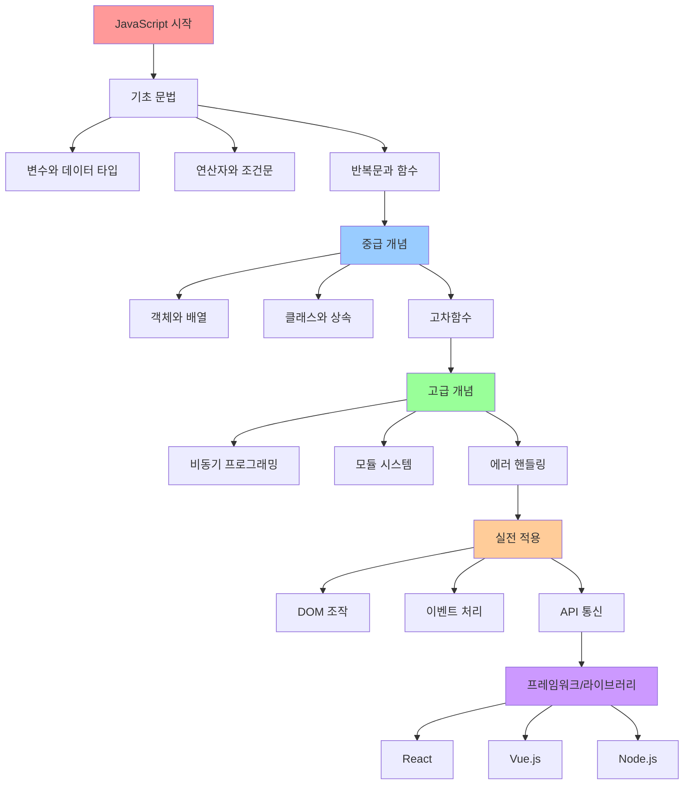

### 학습 단계별 체크리스트

#### 1단계: 기초 문법 ✅
- [ ] 변수 선언 (let, const, var)
- [ ] 데이터 타입 이해
- [ ] 연산자 사용법
- [ ] 조건문 (if, switch)
- [ ] 반복문 (for, while, for...of, for...in)
- [ ] 함수 선언과 호출
- [ ] 예외 처리 (try-catch)

#### 2단계: 중급 개념 📚
- [ ] 객체와 배열 조작
- [ ] 화살표 함수
- [ ] 클래스와 상속
- [ ] 고차함수 (map, filter, reduce)
- [ ] 구조 분해 할당
- [ ] 스프레드와 나머지 연산자
- [ ] 클로저 개념

#### 3단계: 고급 개념 🚀
- [ ] Promise와 async/await
- [ ] 모듈 (import/export)
- [ ] 정규식 (Regular Expression)
- [ ] 프로토타입과 상속
- [ ] 이벤트 루프
- [ ] 메모리 관리

#### 4단계: 실전 응용 💼
- [ ] DOM 조작
- [ ] 이벤트 핸들링
- [ ] AJAX와 Fetch API
- [ ] 로컬 스토리지
- [ ] 성능 최적화
- [ ] 디버깅 기법

### 다음 학습 추천

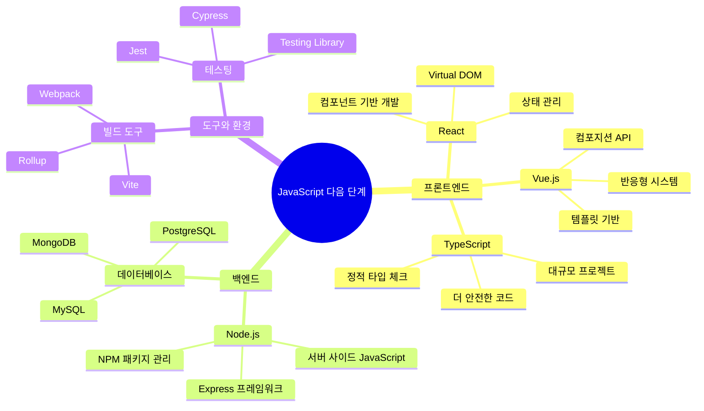

### 실습 프로젝트 추천

1. **초급 프로젝트**
   - 계산기 만들기
   - To-Do 리스트
   - 간단한 게임 (가위바위보, 숫자 맞추기)

2. **중급 프로젝트**
   - 날씨 앱 (API 사용)
   - 쇼핑몰 장바구니
   - 블로그 시스템

3. **고급 프로젝트**
   - 채팅 애플리케이션
   - 온라인 게임
   - 데이터 시각화 대시보드

---

## 마무리 및 정리

### 핵심 개념 요약

#### 1. 기본 문법 핵심
```javascript
// 변수와 상수
let variable = "변경 가능";     // 재할당 가능
const constant = "변경 불가";   // 재할당 불가

// 데이터 타입
typeof 42;          // "number"
typeof "hello";     // "string"
typeof true;        // "boolean"
typeof undefined;   // "undefined"
typeof null;        // "object" (JS의 버그)

// Truthy & Falsy
// Falsy: false, 0, "", null, undefined, NaN
// Truthy: 그 외 모든 값

// 템플릿 리터럴
const name = "JavaScript";
const message = `Hello, ${name}!`;  // "Hello, JavaScript!"
```

#### 2. 함수와 클래스 핵심
```javascript
// 함수 선언 방식
function declaration() { }          // 호이스팅 O
const expression = function() { };  // 호이스팅 X
const arrow = () => { };           // 화살표 함수

// 클래스
class Person {
    constructor(name) {
        this.name = name;
    }
    
    greet() {
        return `Hello, I'm ${this.name}`;
    }
}

const person = new Person("Kim");
console.log(person.greet());  // "Hello, I'm Kim"
```

#### 3. 배열 메서드 핵심
```javascript
const numbers = [1, 2, 3, 4, 5];

// map: 변환
const doubled = numbers.map(n => n * 2);  // [2, 4, 6, 8, 10]

// filter: 필터링
const evens = numbers.filter(n => n % 2 === 0);  // [2, 4]

// reduce: 축약
const sum = numbers.reduce((acc, n) => acc + n, 0);  // 15

// 체이닝
const result = numbers
    .filter(n => n > 2)      // [3, 4, 5]
    .map(n => n * n)         // [9, 16, 25]
    .reduce((a, b) => a + b); // 50
```

#### 4. 구조분해와 스프레드 핵심
```javascript
// 배열 구조분해
const [first, second, ...rest] = [1, 2, 3, 4, 5];
// first: 1, second: 2, rest: [3, 4, 5]

// 객체 구조분해
const {name, age, ...others} = {name: "Kim", age: 30, city: "Seoul"};
// name: "Kim", age: 30, others: {city: "Seoul"}

// 스프레드
const arr1 = [1, 2];
const arr2 = [3, 4];
const combined = [...arr1, ...arr2];  // [1, 2, 3, 4]

const obj1 = {a: 1};
const obj2 = {b: 2};
const merged = {...obj1, ...obj2};    // {a: 1, b: 2}
```

### 자주하는 실수와 해결법

#### 1. 변수 선언 실수
```javascript
// ❌ 잘못된 방법
var x = 1;  // 호이스팅 문제
let y;      // 초기화 없이 사용

// ✅ 올바른 방법
let x = 1;           // 블록 스코프
const y = 2;         // 상수는 const
```

#### 2. 비교 연산자 실수
```javascript
// ❌ 잘못된 방법
if (x == "5") { }    // 타입 변환 발생

// ✅ 올바른 방법
if (x === 5) { }     // 엄격한 비교
```

#### 3. 배열/객체 복사 실수
```javascript
// ❌ 잘못된 방법 (참조 복사)
const arr1 = [1, 2, 3];
const arr2 = arr1;   // 같은 배열을 참조

// ✅ 올바른 방법 (값 복사)
const arr2 = [...arr1];      // 스프레드
const arr3 = Array.from(arr1); // Array.from
```

#### 4. 비동기 처리 실수
```javascript
// ❌ 잘못된 방법
for (let i = 0; i < 5; i++) {
    setTimeout(() => console.log(i), 1000); // 모두 5 출력
}

// ✅ 올바른 방법
for (let i = 0; i < 5; i++) {
    ((index) => {
        setTimeout(() => console.log(index), 1000);
    })(i);
}
```

### 실습 문제와 해답

#### 문제 1: 학생 성적 관리
```javascript
// 문제: 학생들의 점수 배열에서 평균 이상인 학생들의 이름을 반환하는 함수를 작성하세요.
const students = [
    {name: "김철수", score: 85},
    {name: "이영희", score: 92},
    {name: "박민수", score: 78},
    {name: "최지원", score: 96}
];

// 해답
function getAboveAverageStudents(students) {
    // 1. 전체 평균 계산
    const average = students.reduce((sum, student) => sum + student.score, 0) / students.length;
    
    // 2. 평균 이상인 학생들 필터링
    return students
        .filter(student => student.score >= average)
        .map(student => student.name);
}

console.log(getAboveAverageStudents(students)); // ["김철수", "이영희", "최지원"]
```

#### 문제 2: 중복 제거 함수
```javascript
// 문제: 배열에서 중복을 제거하는 함수를 여러 방법으로 작성하세요.
const numbers = [1, 2, 2, 3, 3, 3, 4, 5, 5];

// 해답 1: Set 사용
function removeDuplicates1(arr) {
    return [...new Set(arr)];
}

// 해답 2: filter와 indexOf 사용
function removeDuplicates2(arr) {
    return arr.filter((item, index) => arr.indexOf(item) === index);
}

// 해답 3: reduce 사용
function removeDuplicates3(arr) {
    return arr.reduce((unique, item) => {
        return unique.includes(item) ? unique : [...unique, item];
    }, []);
}

console.log(removeDuplicates1(numbers)); // [1, 2, 3, 4, 5]
console.log(removeDuplicates2(numbers)); // [1, 2, 3, 4, 5]
console.log(removeDuplicates3(numbers)); // [1, 2, 3, 4, 5]
```

#### 문제 3: 객체 깊은 복사
```javascript
// 문제: 중첩된 객체를 깊은 복사하는 함수를 작성하세요.
const originalObject = {
    name: "김철수",
    age: 30,
    address: {
        city: "서울",
        district: "강남구"
    },
    hobbies: ["독서", "영화감상"]
};

// 해답
function deepCopy(obj) {
    // null이거나 객체가 아닌 경우 그대로 반환
    if (obj === null || typeof obj !== "object") {
        return obj;
    }
    
    // 배열인 경우
    if (Array.isArray(obj)) {
        return obj.map(item => deepCopy(item));
    }
    
    // 객체인 경우
    const copiedObj = {};
    for (let key in obj) {
        if (obj.hasOwnProperty(key)) {
            copiedObj[key] = deepCopy(obj[key]);
        }
    }
    
    return copiedObj;
}

// 또는 JSON을 이용한 간단한 방법 (함수, undefined 등은 복사되지 않음)
function simpleDeepCopy(obj) {
    return JSON.parse(JSON.stringify(obj));
}

const copiedObject = deepCopy(originalObject);
copiedObject.address.city = "부산";
console.log(originalObject.address.city); // "서울" (원본 유지)
console.log(copiedObject.address.city);   // "부산"
```

### 성능 최적화 팁

#### 1. 반복문 최적화
```javascript
// ❌ 비효율적
const arr = [1, 2, 3, 4, 5];
for (let i = 0; i < arr.length; i++) {  // 매번 length 계산
    console.log(arr[i]);
}

// ✅ 효율적
const length = arr.length;  // length를 미리 저장
for (let i = 0; i < length; i++) {
    console.log(arr[i]);
}

// ✅ 더 효율적 (for...of 사용)
for (const item of arr) {
    console.log(item);
}
```

#### 2. 객체 속성 접근 최적화
```javascript
// ❌ 비효율적
const user = {profile: {name: {first: "김", last: "철수"}}};
if (user.profile.name.first) {  // 중첩 접근 반복
    console.log(user.profile.name.first + user.profile.name.last);
}

// ✅ 효율적
const {profile: {name: {first, last}}} = user;  // 구조분해로 한 번에
if (first) {
    console.log(first + last);
}
```

#### 3. 메모리 누수 방지
```javascript
// ❌ 메모리 누수 위험
let cache = {};
function expensiveOperation(key) {
    if (!cache[key]) {
        cache[key] = /* 복잡한 계산 결과 */;
    }
    return cache[key];
}

// ✅ Map과 WeakMap 활용
const cache = new Map();
function expensiveOperation(key) {
    if (!cache.has(key)) {
        cache.set(key, /* 복잡한 계산 결과 */);
    }
    return cache.get(key);
}
```

### 디버깅 기법

#### 1. console 활용
```javascript
// 기본 로그
console.log("변수 값:", variable);

// 테이블 형태로 출력
console.table([{name: "김철수", age: 30}, {name: "이영희", age: 25}]);

// 시간 측정
console.time("처리시간");
// ... 처리할 코드 ...
console.timeEnd("처리시간");

// 조건부 로그
console.assert(x > 0, "x는 양수여야 합니다");

// 스택 트레이스
console.trace("현재 호출 스택");
```

#### 2. 에러 처리 패턴
```javascript
// 기본 에러 처리
try {
    riskyOperation();
} catch (error) {
    console.error("에러 발생:", error.message);
    console.error("스택 트레이스:", error.stack);
} finally {
    console.log("정리 작업 수행");
}

// 커스텀 에러
class CustomError extends Error {
    constructor(message, code) {
        super(message);
        this.name = "CustomError";
        this.code = code;
    }
}

function validateInput(input) {
    if (typeof input !== 'string') {
        throw new CustomError("입력값은 문자열이어야 합니다", "INVALID_TYPE");
    }
    if (input.length === 0) {
        throw new CustomError("입력값은 비어있을 수 없습니다", "EMPTY_INPUT");
    }
}
```

### 추천 학습 자료

#### 1. 공식 문서 및 레퍼런스
- [MDN Web Docs](https://developer.mozilla.org/ko/docs/Web/JavaScript) - 가장 신뢰할 수 있는 JavaScript 레퍼런스
- [ECMAScript 스펙](https://tc39.es/ecma262/) - JavaScript 언어 명세
- [Can I Use](https://caniuse.com/) - 브라우저 호환성 확인

#### 2. 온라인 학습 플랫폼
- [freeCodeCamp](https://www.freecodecamp.org/) - 무료 온라인 코딩 부트캠프
- [JavaScript.info](https://javascript.info/) - 현대적인 JavaScript 튜토리얼
- [Eloquent JavaScript](https://eloquentjavascript.net/) - 무료 온라인 책

#### 3. 실습 플랫폼
- [CodePen](https://codepen.io/) - 온라인 코드 에디터
- [JSFiddle](https://jsfiddle.net/) - JavaScript 코드 테스트
- [Repl.it](https://replit.com/) - 온라인 개발 환경

#### 4. 커뮤니티
- [Stack Overflow](https://stackoverflow.com/questions/tagged/javascript) - Q&A 커뮤니티
- [Reddit r/javascript](https://www.reddit.com/r/javascript/) - JavaScript 커뮤니티
- [Dev.to](https://dev.to/t/javascript) - 개발자 블로그 플랫폼

---

## 최종 정리

🎉 **축하합니다!** JavaScript Core 문법을 모두 학습하셨습니다!

### 학습한 내용 요약
✅ **기본 문법**: 변수, 데이터 타입, 연산자, 조건문, 반복문  
✅ **함수**: 함수 선언, 화살표 함수, 클로저, 재귀  
✅ **클래스**: 객체 지향 프로그래밍, 상속, 캡슐화  
✅ **고차함수**: map, filter, reduce와 배열 조작  
✅ **현대 문법**: 구조분해 할당, 스프레드 연산자, 템플릿 리터럴  
✅ **실전 프로젝트**: 계산기, 학생 관리 시스템, To-Do 리스트  

### 다음 단계 추천

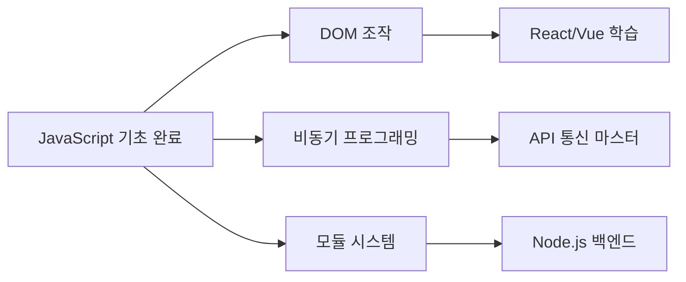

### 마지막 조언

1. **꾸준한 실습이 핵심**입니다. 매일 조금씩이라도 코드를 작성하세요.
2. **에러를 두려워하지 마세요**. 에러는 최고의 선생님입니다.
3. **다른 사람의 코드를 읽어보세요**. GitHub의 오픈소스 프로젝트를 둘러보는 것도 좋습니다.
4. **프로젝트를 만들어보세요**. 작은 것부터 시작해서 점점 복잡한 것에 도전하세요.
5. **최신 트렌드를 따라가세요**. JavaScript는 계속 발전하는 언어입니다.

**Happy Coding! 🚀💻**

---

> **이 가이드가 도움이 되셨나요?**  
> JavaScript 여정에서 궁금한 점이 있으시면 언제든 질문해주세요!
