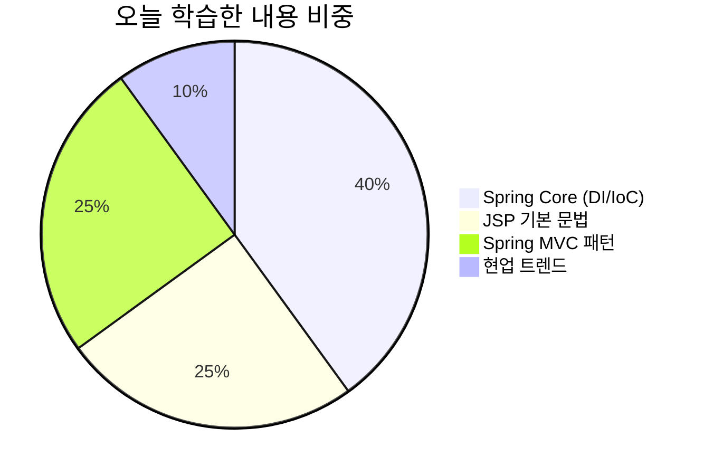
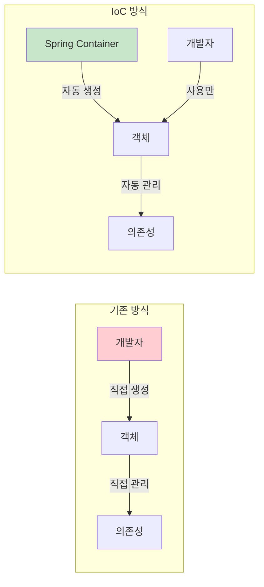
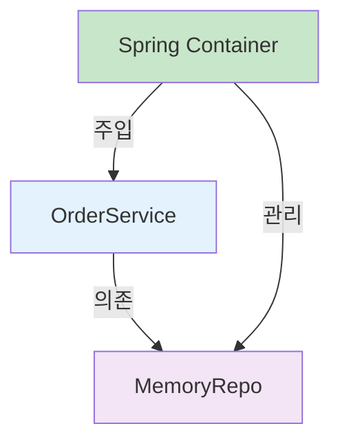
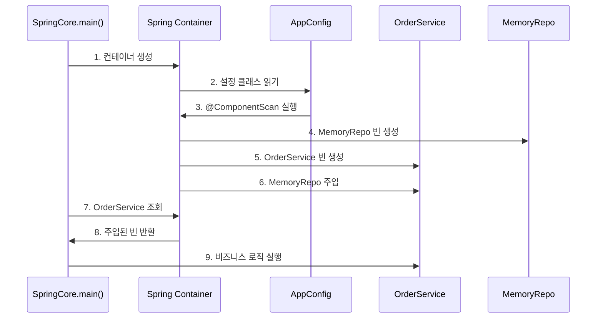
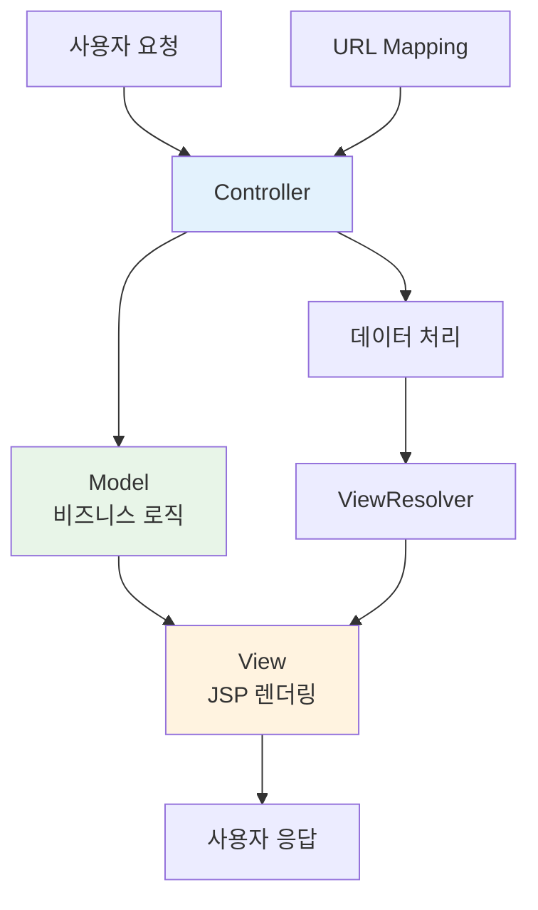
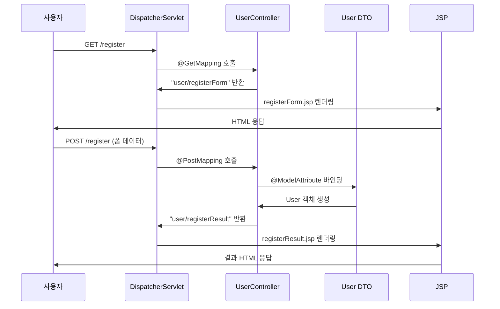
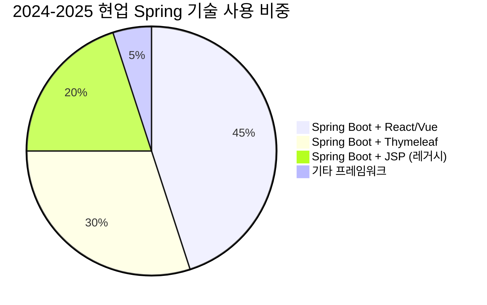
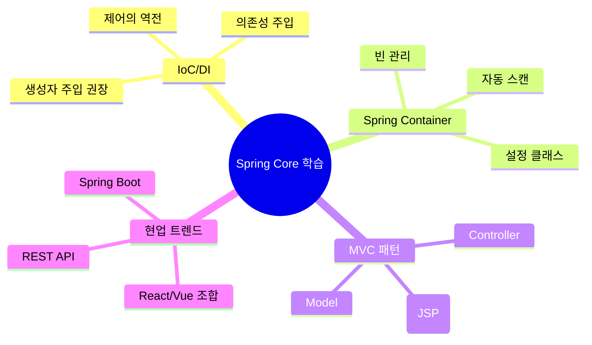
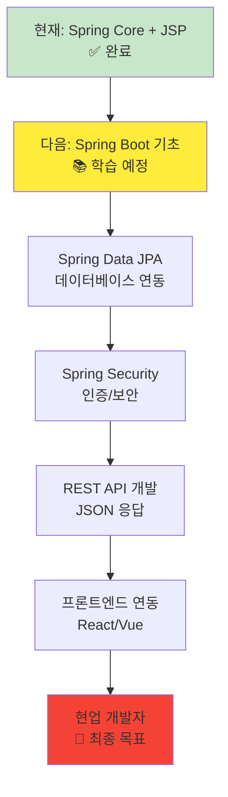

# 멋쟁이사자처럼 21일차 📚
## Spring Core & JSP 완벽 정리
> 2025년 8월 27일 학습 내용 - DI/IoC와 MVC 패턴의 이해

---

## 📋 목차
1. [오늘 배운 핵심 내용](#1-오늘-배운-핵심-내용)
2. [Spring Core 기초 개념](#2-spring-core-기초-개념)
3. [DI/IoC 실습 코드 분석](#3-diioc-실습-코드-분석)
4. [Spring MVC와 JSP](#4-spring-mvc와-jsp)
5. [현업 적용 사례](#5-현업-적용-사례)
6. [학습 정리 및 다음 단계](#6-학습-정리-및-다음-단계)

---

## 1. 오늘 배운 핵심 내용

### 🎯 학습 목표 달성도


### ✨ 핵심 키워드
- **IoC (Inversion of Control)** - 제어의 역전
- **DI (Dependency Injection)** - 의존성 주입
- **MVC 패턴** - Model-View-Controller
- **Spring Container** - 빈(Bean) 관리
- **JSP** - JavaServer Pages

---

## 2. Spring Core 기초 개념

### 2.1 Spring Framework란? 🌱

Spring은 **Java 기반 엔터프라이즈 애플리케이션 개발 프레임워크**입니다.
복잡한 기업용 애플리케이션을 쉽게 개발할 수 있도록 도와주는 도구입니다.

### 2.2 IoC (제어의 역전) 이해하기



#### 🔄 제어의 역전이란?
- **기존 방식**: 개발자가 직접 객체를 생성하고 관리
- **IoC 방식**: Spring 컨테이너가 객체 생성과 관리를 담당
- **장점**: 객체 간의 결합도 ⬇️, 유연성 ⬆️, 테스트 용이성 ⬆️

### 2.3 DI (의존성 주입) 상세 분석



#### 💉 의존성 주입 방식 비교

| 방식 | 코드 예시 | 현업 사용도 | 장단점 |
|------|-----------|-------------|---------|
| **생성자 주입** ⭐⭐⭐ | `public Service(Repository repo)` | 90% | 불변성 보장, 필수 의존성 |
| **세터 주입** ⭐ | `@Autowired setRepo()` | 8% | 선택적 의존성 |
| **필드 주입** ❌ | `@Autowired private repo` | 2% | 테스트 어려움 |

---

## 3. DI/IoC 실습 코드 분석

### 3.1 Spring Container 동작 흐름



### 3.2 핵심 코드 구조

#### 📝 메인 클래스 (SpringCore.java)
```java
public class SpringCore {
    public static void main(String[] args) {
        // 🔥 IoC 실현: 개발자가 직접 객체 생성하지 않음
        try (AnnotationConfigApplicationContext context = 
                new AnnotationConfigApplicationContext(AppConfig.class)) {
            
            // 🔥 DI 실현: 이미 의존성이 주입된 상태로 받아옴
            OrderService orderService = context.getBean(OrderService.class);
            orderService.processOrder("Spring 학습 예제");
        }
    }
}
```

#### ⚙️ 설정 클래스 (AppConfig.java)
```java
@Configuration  // 스프링 설정 클래스
@ComponentScan("com.example.demo")  // 빈 자동 스캔
class AppConfig {
    // @ComponentScan으로 자동 빈 등록
}
```

#### 🏪 저장소 클래스 (MemoryRepo.java)
```java
@Component  // 스프링이 관리하는 빈으로 등록
class MemoryRepo {
    public void save(String data) {
        System.out.println("메모리에 저장: " + data);
    }
}
```

#### 🎯 서비스 클래스 (OrderService.java)
```java
@Component
class OrderService {
    private final MemoryRepo memoryRepo;  // final로 불변성 보장
    
    // 🔥 생성자 주입 (권장 방식)
    public OrderService(MemoryRepo memoryRepo) {
        this.memoryRepo = memoryRepo;
    }
    
    public void processOrder(String item) {
        System.out.println("주문 처리: " + item);
        memoryRepo.save(item);  // 주입받은 의존성 사용
    }
}
```

---

## 4. Spring MVC와 JSP

### 4.1 MVC 패턴의 이해



### 4.2 Spring Web MVC 동작 원리



### 4.3 실습 코드 구조

#### 🎮 컨트롤러 (UserController.java)
```java
@Controller
public class UserController {
    
    // GET 요청: 폼 페이지 표시
    @GetMapping("/register")
    public String registerForm() {
        return "user/registerForm";  // JSP 파일명
    }
    
    // POST 요청: 폼 데이터 처리
    @PostMapping("/register")
    public String registerUser(@ModelAttribute User user, Model model) {
        model.addAttribute("user", user);  // JSP에 데이터 전달
        return "user/registerResult";
    }
}
```

#### 📄 JSP 폼 (registerForm.jsp)
```jsp
<form action="/register" method="post">
    <input type="text" name="userId" required>     <!-- User.userId와 매핑 -->
    <input type="password" name="password" required> <!-- User.password와 매핑 -->
    <input type="text" name="userName" required>   <!-- User.userName와 매핑 -->
    <input type="submit" value="가입하기">
</form>
```

#### 📄 JSP 결과 (registerResult.jsp)
```jsp
<p>아이디: ${user.userId}</p>      <!-- EL 표현식 사용 -->
<p>이름: ${user.userName}</p>     <!-- Model에서 전달받은 데이터 -->
```

---

## 5. 현업 적용 사례

### 5.1 현업에서의 Spring 기술 스택



### 5.2 기업 규모별 기술 선택

| 기업 규모 | 주요 기술 스택 | 선택 이유 | 개발자 요구사항 |
|-----------|---------------|-----------|----------------|
| **대기업** | Spring Boot + React | 복잡한 비즈니스 로직, 확장성 | Full-Stack 개발 능력 |
| **중견기업** | Spring Boot + Thymeleaf | 빠른 개발, 유지보수성 | Spring MVC 숙련도 |
| **스타트업** | Spring Boot + Vue.js | 모던 UX, 빠른 프로토타입 | 최신 기술 적응력 |
| **공공기관** | Spring + JSP | 기존 시스템 호환성 | 레거시 시스템 경험 |

### 5.3 현업에서 선호하는 개발 패턴

#### 🏗️ 계층형 아키텍처 (가장 일반적)
```mermaid
graph TD
    A[Controller Layer<br/>웹 요청 처리] --> B[Service Layer<br/>비즈니스 로직]
    B --> C[Repository Layer<br/>데이터 접근]
    
    A1[@Controller<br/>@RestController] --> A
    B1[@Service<br/>@Transactional] --> B
    C1[@Repository<br/>JPA/MyBatis] --> C
    
    style A fill:#e3f2fd
    style B fill:#e8f5e8
    style C fill:#fff3e0
```

#### 💼 실제 현업 코드 스타일
```java
// ✅ 현업에서 선호하는 방식
@RestController
@RequestMapping("/api/users")
public class UserController {
    private final UserService userService;
    
    // 생성자 주입 (권장)
    public UserController(UserService userService) {
        this.userService = userService;
    }
    
    @GetMapping("/{id}")
    public ResponseEntity<UserDto> getUser(@PathVariable Long id) {
        UserDto user = userService.findById(id);
        return ResponseEntity.ok(user);
    }
}

@Service
@Transactional  // 트랜잭션 관리 필수
public class UserService {
    private final UserRepository userRepository;
    
    public UserService(UserRepository userRepository) {
        this.userRepository = userRepository;
    }
    
    public UserDto findById(Long id) {
        User user = userRepository.findById(id)
            .orElseThrow(() -> new UserNotFoundException("User not found"));
        return UserDto.from(user);
    }
}
```

### 5.4 현업 개발자가 되기 위한 핵심 스킬

#### 🎯 필수 역량 (우선순위별)
1. **Spring Boot** 기반 개발 ⭐⭐⭐⭐⭐
2. **RESTful API** 설계 및 개발 ⭐⭐⭐⭐⭐
3. **JPA/Hibernate** 데이터베이스 처리 ⭐⭐⭐⭐
4. **Spring Security** 인증/권한 처리 ⭐⭐⭐⭐
5. **프론트엔드 기술** (React/Vue) ⭐⭐⭐

#### 📊 현업에서 자주 사용하는 어노테이션
```java
// 계층별 어노테이션 (사용 빈도순)
@Service        // ⭐⭐⭐⭐⭐ 가장 많이 사용
@RestController // ⭐⭐⭐⭐⭐ API 개발 필수
@Repository     // ⭐⭐⭐⭐ 데이터 접근
@Controller     // ⭐⭐ 전통적인 웹 개발

// 웹 관련 (API 개발 필수)
@GetMapping     // ⭐⭐⭐⭐⭐
@PostMapping    // ⭐⭐⭐⭐⭐
@RequestBody    // ⭐⭐⭐⭐⭐ JSON 처리
@PathVariable   // ⭐⭐⭐⭐ URL 매개변수
@RequestParam   // ⭐⭐⭐ 쿼리 파라미터

// 설정 관련
@Configuration  // ⭐⭐⭐ 설정 클래스
@ComponentScan  // ⭐⭐⭐ 빈 스캔
@Transactional  // ⭐⭐⭐⭐⭐ 트랜잭션 관리
```

---

## 6. 학습 정리 및 다음 단계

### 6.1 오늘 배운 내용 요약



### 6.2 학습 성과 체크리스트

- [ ] **IoC와 DI의 차이점** 설명할 수 있다
- [ ] **Spring Container**의 동작 원리를 이해한다
- [ ] **@Component, @Service** 등 애너테이션의 역할을 안다
- [ ] **생성자 주입**을 왜 권장하는지 안다
- [ ] **MVC 패턴**의 각 역할을 구분할 수 있다
- [ ] **JSP EL 표현식**을 사용할 수 있다
- [ ] **현업에서 선호하는 기술**을 파악했다

### 6.3 다음 학습 로드맵



### 6.4 실무 준비를 위한 추천 학습 순서

#### 📚 단기 목표 (1-2주)
1. **Spring Boot** 기본 설정 및 프로젝트 구성
2. **Thymeleaf** 템플릿 엔진 (JSP 대체)
3. **Spring Data JPA** 기초

#### 🚀 중기 목표 (1-2개월)
1. **RESTful API** 설계 및 개발
2. **Spring Security** 인증 시스템
3. **단위 테스트** 작성법

#### 🌟 장기 목표 (3-6개월)
1. **프론트엔드 기술** (React/Vue.js)
2. **마이크로서비스** 아키텍처
3. **클라우드 배포** (AWS/Docker)

### 6.5 현업 면접 대비 핵심 질문

#### 💡 자주 나오는 면접 질문들
1. **IoC와 DI의 차이점은 무엇인가요?**
   - IoC: 제어의 역전, 객체 생성/관리를 컨테이너가 담당
   - DI: 의존성 주입, 필요한 객체를 외부에서 넣어주는 방식

2. **생성자 주입을 권장하는 이유는?**
   - 불변성 보장 (final 키워드 사용 가능)
   - 필수 의존성 보장 (생성 시점에 주입)
   - 테스트 용이성 (Mock 객체 주입 쉬움)

3. **@Component와 @Service의 차이점은?**
   - 기능상 동일 (둘 다 @Component의 특수화)
   - @Service: 비즈니스 로직임을 명시, 가독성 향상
   - 계층별 역할 구분으로 유지보수성 증대

---

## 🎉 마무리

오늘은 **Spring의 핵심인 IoC/DI**와 **MVC 패턴**을 JSP와 함께 학습했습니다. 
비록 JSP는 레거시 기술이지만, Spring MVC의 동작 원리를 이해하는 데 매우 유용한 학습 도구였습니다.

### 💪 앞으로의 학습 방향
- JSP는 기초 학습용으로만 활용
- **Spring Boot + Thymeleaf** 또는 **React/Vue**로 발전
- **현업에서 요구하는 기술 스택** 중심 학습

### 🌟 오늘의 한줄 정리
> **"개발자가 객체를 직접 관리하지 않고, Spring이 대신 관리해주는 것이 IoC/DI의 핵심이다!"**

---

**다음 학습 목표**: Spring Boot 프로젝트 생성 및 Thymeleaf 템플릿 엔진 학습 🚀

> 💡 **Tip**: 오늘 배운 내용을 바탕으로 간단한 Spring Boot 프로젝트를 만들어보세요!
> 실습을 통해 이론을 체화하는 것이 가장 효과적인 학습 방법입니다.