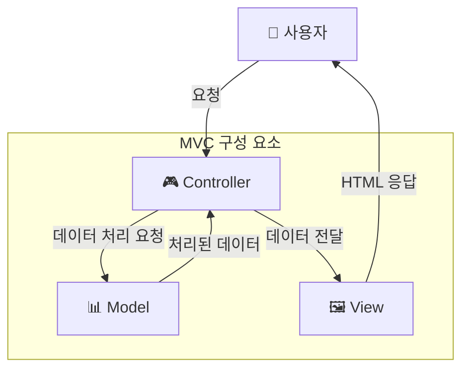
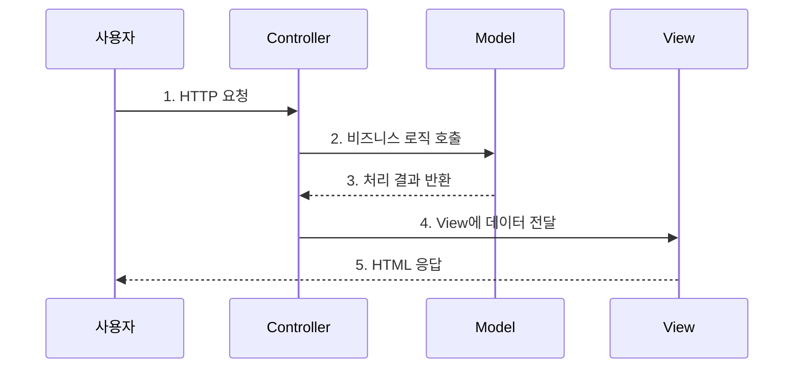
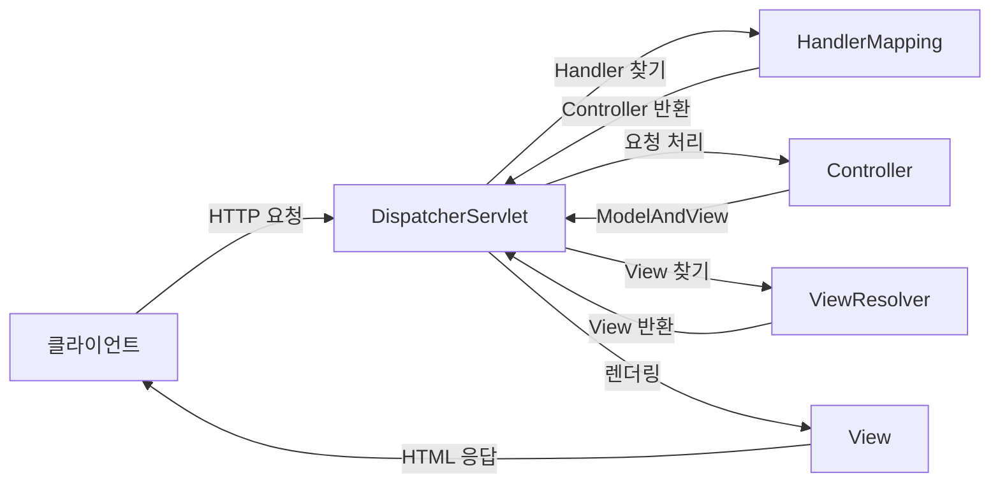
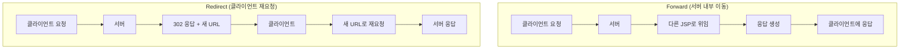
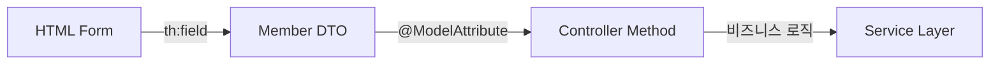

# Spring Web MVC 완전정복 가이드

## 🎯 학습 목표

- **MVC 아키텍처 패턴**의 개념과 흐름을 완벽히 이해하기
- **Spring Web MVC**의 핵심 컴포넌트 역할을 파악하기
- **JSP와 Thymeleaf**를 활용한 동적 웹 페이지 개발하기
- **실무에서 활용되는 패턴**과 베스트 프랙티스 익히기

---

## 📚 목차

1. [MVC 아키텍처 패턴 이해하기](#1-mvc-아키텍처-패턴-이해하기)
2. [Spring Web MVC 핵심 컴포넌트](#2-spring-web-mvc-핵심-컴포넌트)
3. [JSP 기반 웹 개발](#3-jsp-기반-웹-개발)
4. [JSP 심화 기술](#4-jsp-심화-기술)
5. [Thymeleaf 템플릿 엔진](#5-thymeleaf-템플릿-엔진)
6. [현업 적용 사례와 베스트 프랙티스](#6-현업-적용-사례와-베스트-프랙티스)

---

## 1. MVC 아키텍처 패턴 이해하기

### 🎨 MVC란 무엇인가?

MVC(Model-View-Controller)는 애플리케이션을 세 가지 역할로 구분하는 소프트웨어 디자인 패턴입니다. 각 컴포넌트의 **역할을 명확히 분리**하여 코드의 재사용성을 높이고 유지보수를 용이하게 만듭니다.



### 📋 각 컴포넌트의 역할

| 컴포넌트 | 역할 | 예시 |
|---------|------|------|
| **Model** | 데이터와 비즈니스 로직 담당 | `UserService`, `UserDTO`, `UserRepository` |
| **View** | 사용자 인터페이스(UI) 담당 | JSP 파일, Thymeleaf 템플릿 |
| **Controller** | 요청과 응답의 중개자 역할 | `@Controller` 클래스 |

### 🔄 MVC 처리 흐름



### 💡 Controller의 주요 책임

1. **사용자 요청 수신**: HTTP 요청을 받아 분석
2. **비즈니스 로직 호출**: 요청에 맞는 Model 메서드 실행
3. **응답 생성**: Model 결과를 View에 전달하여 응답 생성

---

## 2. Spring Web MVC 핵심 컴포넌트

### 🏗️ Spring Web MVC 아키텍처

Spring Web MVC는 **DispatcherServlet**이 모든 요청을 받아 처리하는 **Front Controller 패턴**을 사용합니다.



### 🔧 핵심 컴포넌트 상세 설명

#### 1. **DispatcherServlet** (전면 컨트롤러)
- 모든 HTTP 요청의 **진입점**
- 요청을 분석하여 적절한 Handler에 위임
- **설정 예시**:
```xml
<!-- web.xml -->
<servlet>
    <servlet-name>dispatcher</servlet-name>
    <servlet-class>org.springframework.web.servlet.DispatcherServlet</servlet-class>
</servlet>
```

#### 2. **HandlerMapping** (핸들러 매핑)
- 요청 URL을 처리할 **Controller를 찾는 역할**
- `@RequestMapping` 어노테이션 기반으로 매핑

#### 3. **Controller** (컨트롤러)
```java
@Controller
public class UserController {
    
    @GetMapping("/users/register")
    public String showRegisterForm() {
        return "user/registerForm";
    }
    
    @PostMapping("/users/register")
    public String register(@ModelAttribute User user, Model model) {
        // 비즈니스 로직 처리
        userService.register(user);
        model.addAttribute("user", user);
        return "redirect:/users";
    }
}
```

#### 4. **ViewResolver** (뷰 리졸버)
- Controller가 반환한 **논리적 뷰 이름**을 실제 뷰 파일로 변환
- 예시: `"user/list"` → `/WEB-INF/views/user/list.jsp`

#### 5. **View** (뷰)
- Model 데이터를 사용하여 **최종 HTML 응답** 생성

### 📝 주요 어노테이션

| 어노테이션 | 역할 | 사용 예시 |
|-----------|------|----------|
| `@Controller` | 컨트롤러 클래스 지정 | `@Controller public class UserController` |
| `@GetMapping` | GET 요청 매핑 | `@GetMapping("/users")` |
| `@PostMapping` | POST 요청 매핑 | `@PostMapping("/users/add")` |
| `@RequestParam` | 요청 파라미터 바인딩 | `@RequestParam String name` |
| `@ModelAttribute` | 폼 데이터를 객체에 바인딩 | `@ModelAttribute User user` |

---

## 3. JSP 기반 웹 개발

### 🌐 JSP란?

JSP(JavaServer Pages)는 **HTML 문서 안에 자바 코드를 삽입**하여 동적인 웹 페이지를 생성하는 기술입니다.

### 📖 JSP 기본 문법

#### 1. **스크립틀릿** `<% ... %>`
```jsp
<%
    String name = "홍길동";
    System.out.println("이름: " + name);
%>
```

#### 2. **표현식** `<%= ... %>`
```jsp
<p>안녕하세요, <%= name %>님!</p>
```

#### 3. **선언문** `<%! ... %>`
```jsp
<%!
    private int count = 0;
    public String getMessage() {
        return "Welcome";
    }
%>
```

### 💡 현대적 JSP 개발 권장사항

> **⚠️ 주의**: 스크립틀릿 사용을 지양하고, **EL(Expression Language)**과 **JSTL(JSP Standard Tag Library)** 사용을 권장합니다.

### 🏗️ 실습: 회원 가입 시스템

#### 1. User DTO 클래스
```java
public class User {
    private String userId;
    private String password;
    private String name;
    
    // getter/setter 생략
}
```

#### 2. UserController
```java
@Controller
@RequestMapping("/users")
public class UserController {
    
    @GetMapping("/register")
    public String showRegisterForm() {
        return "user/registerForm";
    }
    
    @PostMapping("/register")
    public String register(@ModelAttribute User user, Model model) {
        // 사용자 등록 처리 로직
        model.addAttribute("user", user);
        return "user/registerResult";
    }
}
```

#### 3. 회원 가입 폼 (`registerForm.jsp`)
```jsp
<%@ page contentType="text/html;charset=UTF-8" %>
<html>
<head>
    <title>회원 가입</title>
</head>
<body>
    <h2>회원 가입</h2>
    <form action="/users/register" method="post">
        <label>아이디: <input type="text" name="userId" required></label><br>
        <label>비밀번호: <input type="password" name="password" required></label><br>
        <label>이름: <input type="text" name="name" required></label><br>
        <button type="submit">가입하기</button>
    </form>
</body>
</html>
```

#### 4. 가입 결과 페이지 (`registerResult.jsp`)
```jsp
<%@ page contentType="text/html;charset=UTF-8" %>
<html>
<head>
    <title>가입 완료</title>
</head>
<body>
    <h2>가입이 완료되었습니다!</h2>
    <p>아이디: ${user.userId}</p>
    <p>이름: ${user.name}</p>
    <a href="/users">회원 목록 보기</a>
</body>
</html>
```

---

## 4. JSP 심화 기술

### 🔄 Include 기능 활용

여러 JSP 페이지에서 **공통 부분을 재사용**하기 위한 기능입니다.

#### 📋 Include 방식 비교

| 방식 | 문법 | 특징 | 권장도 |
|------|------|------|--------|
| **지시어 방식** | `<%@ include file="..." %>` | 컴파일 시점 포함 (정적) | 👥 제한적 |
| **액션 태그 방식** | `<jsp:include page="..." />` | 실행 시점 포함 (동적) | ⭐ **권장** |

#### 🏗️ 실습: 공통 레이아웃 적용

**헤더 파일** (`header.jsp`)
```jsp
<header>
    <h1>회원 관리 시스템</h1>
    <nav>
        <a href="/members">회원 목록</a> |
        <a href="/members/add">회원 등록</a>
    </nav>
</header>
```

**메인 페이지**에서 헤더 포함
```jsp
<html>
<head>
    <title>회원 목록</title>
</head>
<body>
    <jsp:include page="../common/header.jsp" />
    
    <main>
        <!-- 페이지별 고유 내용 -->
    </main>
    
    <jsp:include page="../common/footer.jsp" />
</body>
</html>
```

### 🔀 Forward vs Redirect

웹 애플리케이션에서 **페이지 이동 방식**에 대한 이해는 매우 중요합니다.



#### 📊 Forward vs Redirect 상세 비교

| 구분 | Forward | Redirect |
|------|---------|----------|
| **실행 주체** | 서버 (WAS) | 클라이언트 (브라우저) |
| **URL 변경** | ❌ 변경되지 않음 | ✅ 변경됨 |
| **요청 객체** | 동일한 요청 유지 | 새로운 요청 생성 |
| **요청 횟수** | 1회 | 2회 |
| **속도** | ⚡ 빠름 | 🐢 상대적으로 느림 |
| **주요 용도** | 단순 조회, 내부 흐름 제어 | 데이터 변경 후 화면 전환 |
| **Spring 반환** | `return "forward:/some/url";` | `return "redirect:/some/url";` |

#### 🎯 언제 어떤 방식을 사용할까?

- **Forward 사용 시기**: 단순 조회, 오류 페이지 이동
- **Redirect 사용 시기**: 데이터 등록/수정/삭제 후 목록 페이지 이동 (중복 제출 방지)

### 🏷️ EL (Expression Language)

JSP에서 데이터를 더 **간결하게 표현**하기 위한 언어입니다.

#### 📝 EL 기본 문법

```jsp
<!-- 기존 스크립틀릿 방식 -->
<%= request.getAttribute("userName") %>

<!-- EL 방식 (권장) -->
${userName}
```

#### 🔧 EL 주요 기능

| 기능 | 문법 | 설명 |
|------|------|------|
| **속성 접근** | `${attributeName}` | Model의 속성값 접근 |
| **객체 프로퍼티** | `${user.name}` | `user.getName()` 자동 호출 |
| **연산** | `${price * 1.1}` | 산술 연산 가능 |
| **조건 판단** | `${count > 10}` | 비교 연산 |
| **빈 값 확인** | `${empty userList}` | null/빈 컬렉션 체크 |

### 🏷️ JSTL (JSP Standard Tag Library)

자주 사용되는 로직을 **스크립틀릿 없이 태그 형태**로 사용할 수 있게 만든 표준 라이브러리입니다.

#### 🔧 JSTL 설정

```jsp
<%@ taglib prefix="c" uri="http://java.sun.com/jsp/jstl/core" %>
```

> **⚠️ Spring Boot 3 주의사항**: Jakarta EE 사용으로 URI가 변경되었습니다.

#### 📋 JSTL 주요 태그

**조건문**
```jsp
<c:if test="${user.age >= 18}">
    <p>성인 사용자입니다.</p>
</c:if>
```

**반복문**
```jsp
<c:forEach items="${userList}" var="user" varStatus="status">
    <tr>
        <td>${status.index + 1}</td>
        <td>${user.name}</td>
        <td>${user.email}</td>
    </tr>
</c:forEach>
```

#### 🏗️ 실습: 회원 목록 페이지

```jsp
<%@ page contentType="text/html;charset=UTF-8" %>
<%@ taglib prefix="c" uri="http://java.sun.com/jsp/jstl/core" %>

<html>
<head>
    <title>회원 목록</title>
</head>
<body>
    <jsp:include page="../common/header.jsp" />
    
    <main>
        <h2>회원 목록</h2>
        
        <c:if test="${empty memberList}">
            <p>등록된 회원이 없습니다.</p>
        </c:if>
        
        <c:if test="${not empty memberList}">
            <table border="1">
                <thead>
                    <tr>
                        <th>번호</th>
                        <th>아이디</th>
                        <th>이름</th>
                    </tr>
                </thead>
                <tbody>
                    <c:forEach items="${memberList}" var="member" varStatus="status">
                        <tr>
                            <td>${status.index + 1}</td>
                            <td>${member.userId}</td>
                            <td>${member.name}</td>
                        </tr>
                    </c:forEach>
                </tbody>
            </table>
        </c:if>
        
        <p><a href="/members/add">새 회원 등록</a></p>
    </main>
    
    <jsp:include page="../common/footer.jsp" />
</body>
</html>
```

---

## 5. Thymeleaf 템플릿 엔진

### 🆚 JSP vs Thymeleaf 비교

Spring Boot 3.x부터는 **Thymeleaf가 기본 뷰 기술**로 권장됩니다.

#### 📊 상세 비교표

| 구분 | JSP | Thymeleaf |
|------|-----|-----------|
| **핵심 개념** | HTML에 Java 코드 삽입 | HTML 태그에 `th:*` 속성 추가 |
| **실행 방식** | 서블릿으로 변환 및 컴파일 | 템플릿 파서가 HTML 분석 처리 |
| **템플릿 형태** | 스크립틀릿 포함으로 순수 HTML 아님 | **내추럴 템플릿**: 브라우저에서 직접 열어도 정상 |
| **Spring Boot** | WAR 패키징 + 외부 WAS 필요 | **JAR 단독 실행 가능** (권장) |
| **주요 문법** | EL + JSTL | `th:text`, `th:if`, `th:each` 등 |

### 🔒 JSP의 보안 문제와 해결책

#### ⚠️ 문제점
```
http://서버주소/user/list.jsp
```
- 컨트롤러를 거치지 않고 뷰에 직접 접근 가능
- 데이터가 없어서 화면이 깨지거나 오류 발생

#### ✅ 해결책
```
/WEB-INF/views/user/list.jsp
```
- `/WEB-INF/` 하위는 외부 URL 직접 접근 차단
- 오직 `DispatcherServlet`을 통한 서버 내부 Forward만 허용

### 🧩 Thymeleaf 레이아웃 기능

#### 1. **조각(Fragment) 정의**

**헤더 조각** (`_layout/header.html`)
```html
<head th:fragment="header-fragment">
    <meta charset="UTF-8">
    <title>회원 관리 시스템</title>
    <link rel="stylesheet" href="/css/style.css">
    <link href="https://cdn.jsdelivr.net/npm/bootstrap@5.1.3/dist/css/bootstrap.min.css" rel="stylesheet">
</head>
```

#### 2. **조각 포함 방법**

```html
<html>
<head th:replace="~{_layout/header :: header-fragment}"></head>
<body>
    <div class="container">
        <!-- 페이지 내용 -->
    </div>
</body>
</html>
```

#### 📋 조각 포함 방식 비교

| 속성 | 동작 | 사용 예시 |
|------|------|----------|
| `th:insert` | 태그 **내부에** 프래그먼트 삽입 | `<div th:insert="...">` |
| `th:replace` | 태그 **자체를** 프래그먼트로 대체 | `<head th:replace="...">` |

### 🔧 Thymeleaf 핵심 속성

#### 📝 주요 `th:*` 속성들

| 속성 | 역할 | 사용 예시 |
|------|------|----------|
| `th:text` | 텍스트 내용 설정 | `<p th:text="${user.name}">기본값</p>` |
| `th:if` | 조건부 렌더링 | `<div th:if="${not #lists.isEmpty(userList)}">` |
| `th:each` | 반복문 | `<tr th:each="user : ${userList}">` |
| `th:object` | 폼 객체 바인딩 | `<form th:object="${member}">` |
| `th:field` | 폼 필드 바인딩 | `<input th:field="*{name}">` |
| `th:href` | 링크 URL 설정 | `<a th:href="@{/members}">목록</a>` |

### 🏗️ 실습: Thymeleaf 회원 관리 시스템

#### 1. **회원 등록 폼** (`members/add.html`)

```html
<!DOCTYPE html>
<html>
<head th:replace="~{_layout/header :: header-fragment}"></head>
<body>
    <div class="container mt-4">
        <h2>회원 등록</h2>
        
        <form th:action="@{/members/add}" th:object="${member}" method="post" class="mt-3">
            <div class="mb-3">
                <label for="userId" class="form-label">아이디</label>
                <input type="text" th:field="*{userId}" class="form-control" required>
            </div>
            
            <div class="mb-3">
                <label for="name" class="form-label">이름</label>
                <input type="text" th:field="*{name}" class="form-control" required>
            </div>
            
            <div class="mb-3">
                <label for="email" class="form-label">이메일</label>
                <input type="email" th:field="*{email}" class="form-control">
            </div>
            
            <button type="submit" class="btn btn-primary">등록하기</button>
            <a th:href="@{/members}" class="btn btn-secondary">목록으로</a>
        </form>
    </div>
</body>
</html>
```

#### 2. **회원 목록** (`members/list.html`)

```html
<!DOCTYPE html>
<html>
<head th:replace="~{_layout/header :: header-fragment}"></head>
<body>
    <div class="container mt-4">
        <div class="d-flex justify-content-between align-items-center mb-3">
            <h2>회원 목록</h2>
            <a th:href="@{/members/add}" class="btn btn-success">새 회원 등록</a>
        </div>
        
        <!-- 빈 목록 처리 -->
        <div th:if="${#lists.isEmpty(memberList)}" class="alert alert-info">
            등록된 회원이 없습니다.
        </div>
        
        <!-- 회원 목록 테이블 -->
        <div th:if="${not #lists.isEmpty(memberList)}">
            <table class="table table-striped">
                <thead class="table-dark">
                    <tr>
                        <th>번호</th>
                        <th>아이디</th>
                        <th>이름</th>
                        <th>이메일</th>
                        <th>등록일</th>
                    </tr>
                </thead>
                <tbody>
                    <tr th:each="member, status : ${memberList}">
                        <td th:text="${status.index + 1}">1</td>
                        <td th:text="${member.userId}">user01</td>
                        <td th:text="${member.name}">홍길동</td>
                        <td th:text="${member.email}">hong@example.com</td>
                        <td th:text="${#temporals.format(member.createdAt, 'yyyy-MM-dd')}">2024-08-28</td>
                    </tr>
                </tbody>
            </table>
        </div>
    </div>
</body>
</html>
```

#### 3. **컨트롤러** (`MemberController.java`)

```java
@Controller
@RequestMapping("/members")
public class MemberController {
    
    private final MemberService memberService;
    
    @GetMapping
    public String list(Model model) {
        List<Member> memberList = memberService.findAll();
        model.addAttribute("memberList", memberList);
        return "members/list";
    }
    
    @GetMapping("/add")
    public String addForm(Model model) {
        model.addAttribute("member", new Member());
        return "members/add";
    }
    
    @PostMapping("/add")
    public String add(@ModelAttribute Member member) {
        memberService.save(member);
        return "redirect:/members"; // PRG 패턴
    }
}
```

### 🎯 @ModelAttribute와 객체 바인딩

#### 💡 핵심 개념

1. **Controller**: `@ModelAttribute`로 폼 데이터를 DTO 객체로 자동 바인딩
2. **Thymeleaf**: `th:object`와 `th:field`로 객체와 폼 필드를 연결

#### 🔄 바인딩 과정



#### 📝 `th:field`의 장점

- **자동 생성**: `id`, `name`, `value` 속성을 자동 생성
- **코드 간소화**: 중복 코드 제거
- **타입 안전성**: 컴파일 타임에 필드명 검증

**기존 방식**
```html
<input type="text" id="name" name="name" value="${member.name}">
```

**Thymeleaf 방식**
```html
<input type="text" th:field="*{name}">
<!-- 자동으로 id="name" name="name" value="..." 생성 -->
```

---
