# 🌐 네트워크 기초 완전 정리

## 📚 목차
1. [컴퓨터 네트워크란?](#컴퓨터-네트워크란)
2. [네트워크 참조모델](#네트워크-참조모델)
3. [OSI 7계층 모델](#osi-7계층-모델)
4. [TCP/IP 모델](#tcpip-모델)
5. [이더넷과 네트워크 장비](#이더넷과-네트워크-장비)
6. [라우팅과 IP 주소](#라우팅과-ip-주소)
7. [포트와 NAT](#포트와-nat)
8. [인터넷 서비스들](#인터넷-서비스들)
9. [현업에서 주로 사용하는 기술](#현업에서-주로-사용하는-기술)

---

## 🖥️ 컴퓨터 네트워크란?

**컴퓨터 네트워크**는 여러 대의 컴퓨터가 서로 연결되어 정보를 주고받을 수 있는 시스템입니다.

### 🏠 일상 속 네트워크 예시
- **집 안의 Wi-Fi**: 스마트폰, 노트북, TV가 공유기를 통해 연결
- **학교 컴퓨터실**: 모든 컴퓨터가 하나의 네트워크로 연결
- **인터넷**: 전 세계 모든 컴퓨터가 연결된 거대한 네트워크

### 네트워크의 장점
- 📂 **파일 공유**: 사진, 문서를 다른 컴퓨터와 공유
- 🖨️ **자원 공유**: 프린터 하나로 여러 컴퓨터에서 인쇄
- 💬 **통신**: 메시지, 이메일, 화상통화
- 🌐 **인터넷 접속**: 웹사이트, 동영상 시청

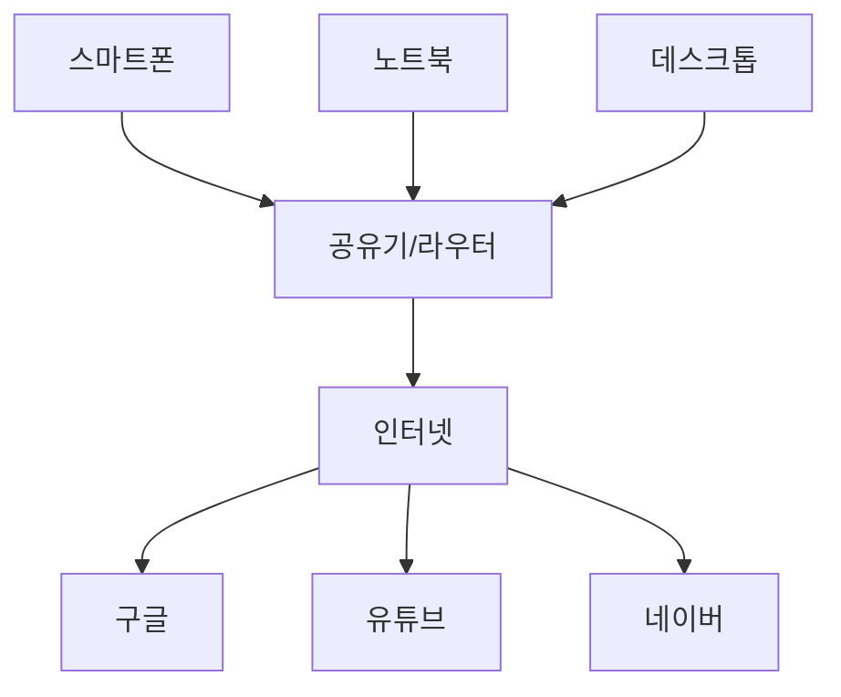

---

## 📋 네트워크 참조모델

**네트워크 참조모델**은 네트워크 통신이 어떻게 이루어지는지를 단계별로 나누어 설명하는 틀입니다.

### 🤔 왜 모델이 필요할까?
네트워크 통신은 매우 복잡합니다. 마치 택배를 보내는 과정처럼:
1. 📦 물건을 포장
2. 📝 주소 적기
3. 🚚 배송업체 선택
4. 🛣️ 배송 경로 결정
5. 🏠 목적지 도착

네트워크도 이처럼 단계별로 나누어 관리하면 이해하고 관리하기 쉬워집니다.

---

## 🎯 OSI 7계층 모델

**OSI (Open Systems Interconnection) 모델**은 네트워크 통신을 7개 계층으로 나눈 표준 모델입니다.

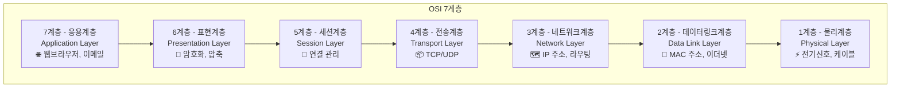

### 각 계층의 역할 (집으로 편지 보내기 비유)

#### 🌐 7계층 - 응용계층 (Application Layer)
- **역할**: 사용자가 직접 사용하는 프로그램
- **예시**: 웹브라우저(크롬), 카카오톡, 이메일
- **편지 비유**: 편지 내용 작성

#### 🔐 6계층 - 표현계층 (Presentation Layer)
- **역할**: 데이터 형식 변환, 암호화, 압축
- **예시**: JPEG, MP3, SSL/TLS 암호화
- **편지 비유**: 편지를 암호로 만들기

#### 🔗 5계층 - 세션계층 (Session Layer)
- **역할**: 통신 연결 시작과 종료 관리
- **예시**: 로그인/로그아웃, 화상통화 연결
- **편지 비유**: 편지 주고받기 약속 정하기

#### 📦 4계층 - 전송계층 (Transport Layer)
- **역할**: 데이터를 안전하고 순서대로 전달
- **예시**: TCP (신뢰성 중요), UDP (속도 중요)
- **편지 비유**: 등기우편 vs 일반우편 선택

#### 🗺️ 3계층 - 네트워크계층 (Network Layer)
- **역할**: 목적지까지의 최적 경로 찾기
- **예시**: IP 주소, 라우터
- **편지 비유**: 우편번호로 배송 경로 결정

#### 📍 2계층 - 데이터링크계층 (Data Link Layer)
- **역할**: 같은 네트워크 내에서 정확한 전달
- **예시**: 이더넷, Wi-Fi, MAC 주소
- **편지 비유**: 동네 우체부가 집집마다 배달

#### ⚡ 1계층 - 물리계층 (Physical Layer)
- **역할**: 실제 전기신호로 데이터 전송
- **예시**: 랜케이블, 광섬유, 전파
- **편지 비유**: 우체통, 우편함, 배달 도구

---

## 🚀 TCP/IP 모델

**TCP/IP 모델**은 실제 인터넷에서 사용되는 4계층 모델입니다. OSI보다 간단하고 실용적입니다.

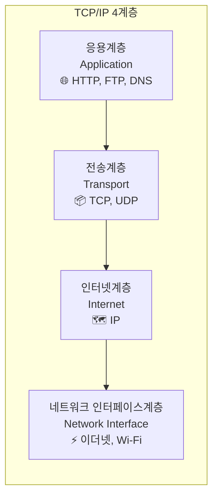

### OSI vs TCP/IP 비교

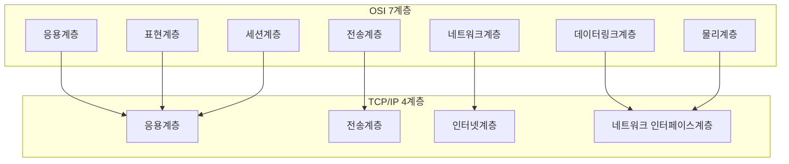

---

## 🔌 이더넷과 네트워크 장비

### 🌐 이더넷 (Ethernet)
- **정의**: 유선 네트워크 연결 방식의 표준
- **특징**: 랜케이블(UTP)로 연결, 안정적이고 빠름
- **속도**: 10Mbps → 100Mbps → 1Gbps → 10Gbps

### 네트워크 장비 비교

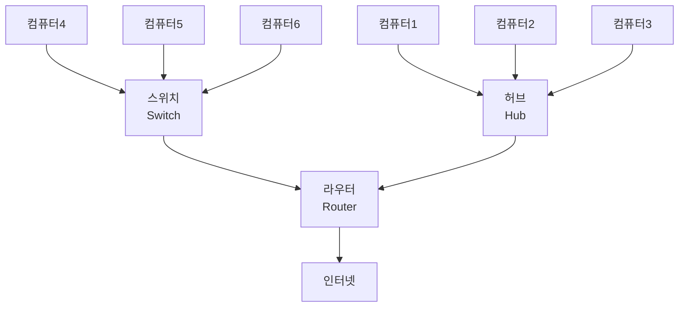

#### 🔄 허브 (Hub) - 구식 장비
- **역할**: 여러 컴퓨터를 연결하는 중계기
- **단점**: 
  - 모든 컴퓨터가 같은 데이터를 받음 (보안 위험)
  - 충돌 발생 가능 (속도 저하)
- **현재 상황**: 거의 사용하지 않음

#### 🔀 스위치 (Switch) - 현재 표준
- **역할**: 똑똑한 허브, 목적지만 골라서 전송
- **장점**:
  - 보안성 좋음 (필요한 컴퓨터만 데이터 받음)
  - 충돌 없음 (속도 향상)
  - MAC 주소 학습 기능
- **현업 사용**: 모든 회사에서 필수 사용

#### 🗺️ 라우터 (Router) - 길찾기 전문가
- **역할**: 서로 다른 네트워크를 연결하고 경로 설정
- **기능**:
  - IP 주소 기반 경로 결정
  - 인터넷 연결 제공
  - 방화벽 기능
- **집에서**: 공유기 = 라우터 + 스위치 + Wi-Fi

---

## 🎯 라우팅과 IP 주소

### 🏠 IP 주소란?
**IP 주소**는 인터넷상의 주소입니다. 집 주소처럼 각 컴퓨터를 구분하는 고유한 번호입니다.

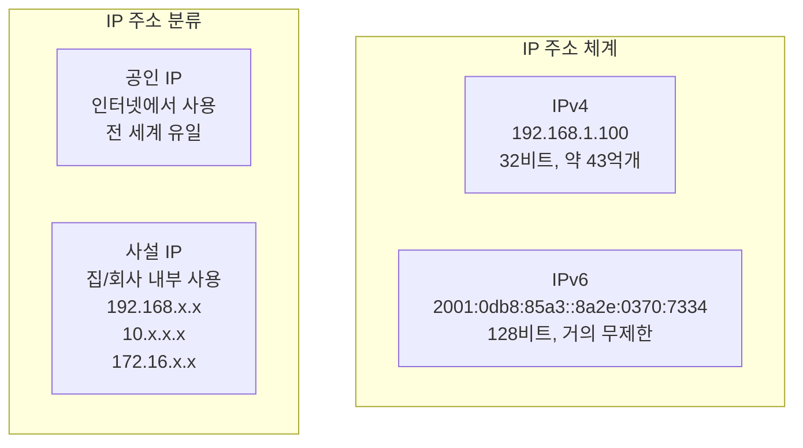

### 🚗 라우팅 (Routing)
**라우팅**은 데이터가 목적지까지 가는 최적의 경로를 찾는 과정입니다.

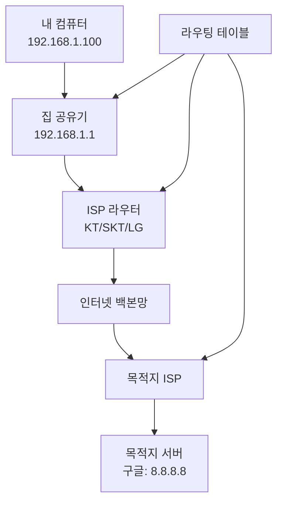

### 라우팅 테이블 예시
| 목적지 네트워크 | 다음 홉(게이트웨이) | 인터페이스 |
|----------------|-------------------|-----------|
| 192.168.1.0/24 | 직접 연결 | eth0 |
| 0.0.0.0/0 | 192.168.1.1 | eth0 |

---

## 🚪 포트와 NAT

### 🚪 포트 (Port)
**포트**는 컴퓨터 안의 문(door)입니다. 각 프로그램마다 다른 포트를 사용합니다.

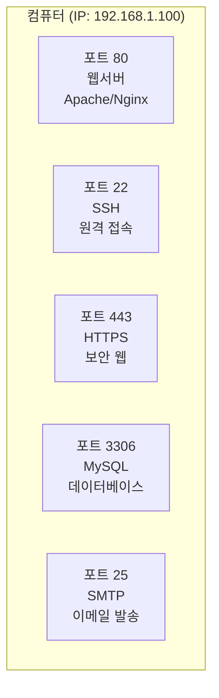

#### 주요 포트 번호
- **80**: HTTP (웹사이트)
- **443**: HTTPS (보안 웹사이트)
- **22**: SSH (원격 접속)
- **21**: FTP (파일 전송)
- **25**: SMTP (이메일 발송)
- **110**: POP3 (이메일 수신)
- **3306**: MySQL 데이터베이스
- **8080**: 대체 웹 포트

### 🔄 NAT (Network Address Translation)
**NAT**는 사설 IP를 공인 IP로 변환하는 기술입니다.

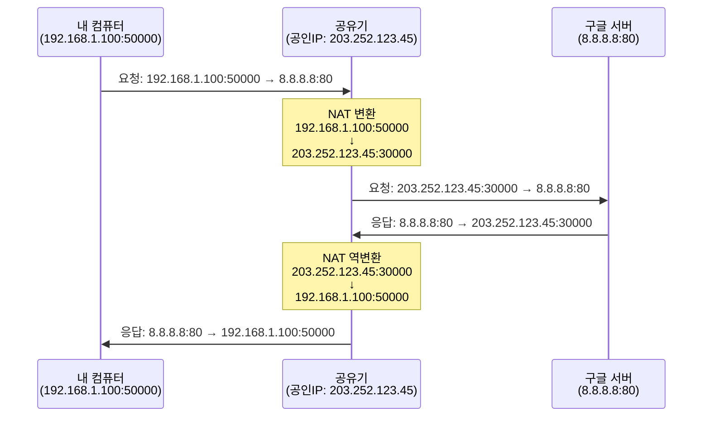

#### NAT의 장점
- 📊 **IP 주소 절약**: 하나의 공인 IP로 여러 기기 사용
- 🛡️ **보안**: 외부에서 내부 네트워크 직접 접근 차단
- 💰 **비용 절약**: 공인 IP 하나만 있으면 됨

---

## 🌐 인터넷 서비스들

### 🏷️ URI (Uniform Resource Identifier)
**URI**는 인터넷상의 자원을 식별하는 주소입니다.

```
https://www.naver.com:443/search?query=네트워크
  ↑        ↑         ↑      ↑
 프로토콜   도메인명   포트   경로+파라미터
```

#### URI 구성 요소
- **프로토콜**: http, https, ftp
- **도메인명**: www.naver.com
- **포트**: :80, :443 (생략 가능)
- **경로**: /search
- **파라미터**: ?query=네트워크

### 🏠 DNS (Domain Name System)
**DNS**는 도메인명을 IP 주소로 변환하는 전화번호부입니다.

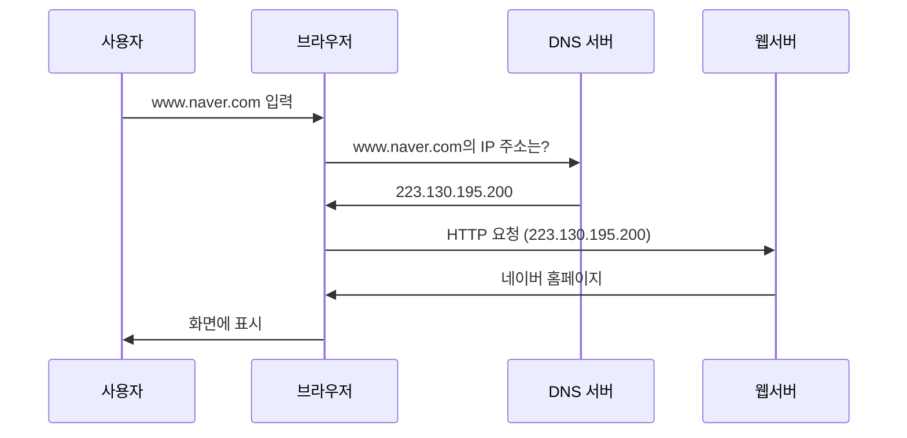

#### DNS 계층 구조
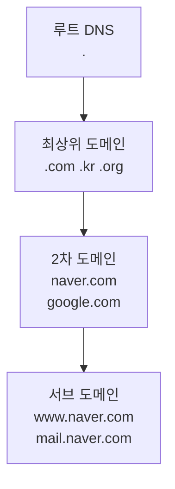

### 📄 HTTP (HyperText Transfer Protocol)
**HTTP**는 웹에서 데이터를 주고받는 규칙입니다.

#### HTTP 요청 예시
```http
GET /search?query=네트워크 HTTP/1.1
Host: www.naver.com
User-Agent: Chrome/91.0.4472.124
Accept: text/html,application/xhtml+xml
```

#### HTTP 응답 예시
```http
HTTP/1.1 200 OK
Content-Type: text/html; charset=UTF-8
Content-Length: 12345

<!DOCTYPE html>
<html>
<head><title>검색 결과</title></head>
...
```

#### HTTP 상태 코드
- **200**: OK (성공)
- **301**: 페이지 이동
- **404**: 페이지 없음
- **500**: 서버 오류

---

## 💼 현업에서 주로 사용하는 기술

### 🏆 필수 기술들 (현업 95% 이상 사용)

#### 네트워크 장비
- **스위치**: 모든 회사 내부 네트워크
- **라우터**: 인터넷 연결 및 네트워크 분리
- **방화벽**: 보안 (Fortinet, Palo Alto, Cisco ASA)

#### 프로토콜
- **TCP/IP**: 모든 네트워크 통신의 기본
- **HTTP/HTTPS**: 웹 서비스 (HTTPS는 필수)
- **DNS**: 도메인 관리 (Cloudflare, Route53)
- **DHCP**: IP 주소 자동 할당

#### 가상화 네트워크
- **VLAN**: 네트워크 분리 및 보안
- **VPN**: 원격 근무 (OpenVPN, IPSec)
- **SDN**: 소프트웨어 정의 네트워크

### 🔥 트렌드 기술들 (빠르게 증가하는 사용률)

#### 클라우드 네트워크
- **AWS VPC**: 아마존 가상 네트워크
- **Azure Virtual Network**: 마이크로소프트 클라우드
- **GCP VPC**: 구글 클라우드

#### 컨테이너 네트워크
- **Docker 네트워크**: 컨테이너 간 통신
- **Kubernetes 네트워크**: 컨테이너 오케스트레이션
- **Service Mesh**: 마이크로서비스 네트워크 (Istio, Linkerd)

#### 로드 밸런서
- **L4 로드밸런서**: IP/포트 기반 분산
- **L7 로드밸런서**: HTTP 기반 분산 (NGINX, HAProxy)
- **클라우드 로드밸런서**: ELB, ALB, NLB

### 📊 기업 규모별 주요 사용 기술

#### 🏢 대기업 (1000명 이상)
- **네트워크**: Cisco, Juniper 장비
- **보안**: Palo Alto, Fortinet 방화벽
- **모니터링**: SolarWinds, PRTG
- **클라우드**: 멀티 클라우드 (AWS + Azure)

#### 🏬 중견기업 (100-1000명)
- **네트워크**: HP, Dell 장비
- **보안**: SonicWall, WatchGuard
- **클라우드**: AWS 또는 Azure 단일
- **SD-WAN**: 지사 연결

#### 🏪 중소기업 (100명 이하)
- **네트워크**: TP-Link, ASUS 장비
- **보안**: 통합 보안 장비 (UTM)
- **클라우드**: 클라우드 우선 (서버리스)
- **관리형 서비스**: MSP 활용

### 💡 취업 준비 시 우선순위

#### 🥇 1순위 - 반드시 알아야 할 것
1. **TCP/IP 모델** 완벽 이해
2. **스위치/라우터** 기본 설정
3. **HTTP/HTTPS** 웹 프로토콜
4. **DNS** 동작 원리
5. **방화벽** 기본 정책

#### 🥈 2순위 - 알면 유리한 것
1. **클라우드** 기본 개념 (AWS/Azure)
2. **Docker** 컨테이너 네트워크
3. **로드밸런서** 개념
4. **VPN** 원격 접속
5. **모니터링** 도구 사용

#### 🥉 3순위 - 전문가 레벨
1. **Kubernetes** 네트워크
2. **BGP** 라우팅 프로토콜
3. **MPLS** 캐리어급 네트워크
4. **SDN/NFV** 차세대 기술
5. **네트워크 자동화** (Ansible, Terraform)


---

## 📚 추천 학습 자료

### 📖 입문서
- **도서**: "후니의 쉽게 쓴 시스코 네트워킹"
- **유튜브**: "따라하면서 배우는 IT" 채널
- **온라인**: 인프런, 유데미 네트워크 강의

### 🛠️ 실습 도구
- **Cisco Packet Tracer**: 무료 네트워크 시뮬레이터
- **VirtualBox**: 가상머신으로 실습 환경 구성
- **AWS Free Tier**: 클라우드 실습

### 🏆 자격증
- **CCNA**: 시스코 네트워크 기초
- **Network+**: CompTIA 네트워크 기초
- **AWS SAA**: 클라우드 네트워크

---

## ✅ 체크리스트

네트워크 기초 학습을 완료했다면 다음을 확인해보세요:

- [ ] OSI 7계층을 외우지 말고 이해했는가?
- [ ] TCP와 UDP의 차이점을 설명할 수 있는가?
- [ ] IP 주소가 어떻게 할당되는지 아는가?
- [ ] DNS가 어떻게 동작하는지 아는가?
- [ ] 웹사이트 접속 과정을 단계별로 설명할 수 있는가?
- [ ] 스위치와 라우터의 차이점을 아는가?
- [ ] NAT가 왜 필요한지 이해하는가?
- [ ] HTTP와 HTTPS의 차이점을 아는가?

모든 항목을 체크했다면 네트워크 기초를 잘 이해한 것입니다! 🎉

---

## 💬 마무리

네트워크는 IT 인프라의 핵심입니다. 처음에는 복잡해 보이지만, 단계별로 차근차근 학습하면 충분히 이해할 수 있습니다. 

**중요한 것은 암기가 아닌 이해**입니다. 각 기술이 왜 필요하고, 어떻게 동작하는지 이해하면 새로운 기술도 쉽게 받아들일 수 있습니다.

현업에서는 **실무 경험**이 가장 중요하므로, 이론 학습과 함께 꾸준한 실습을 통해 실력을 기르시기 바랍니다.

**화이팅! 🚀**
