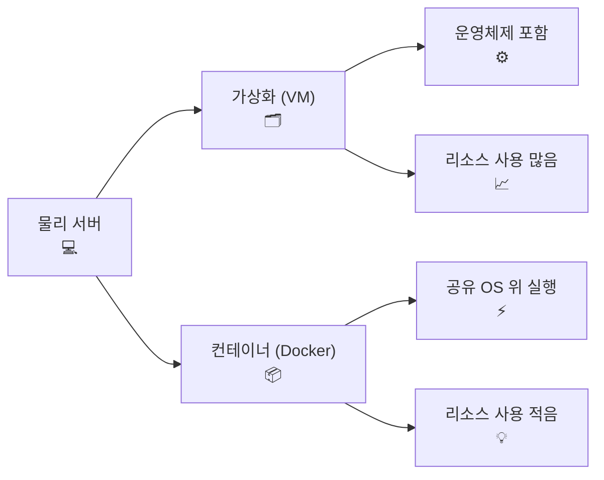
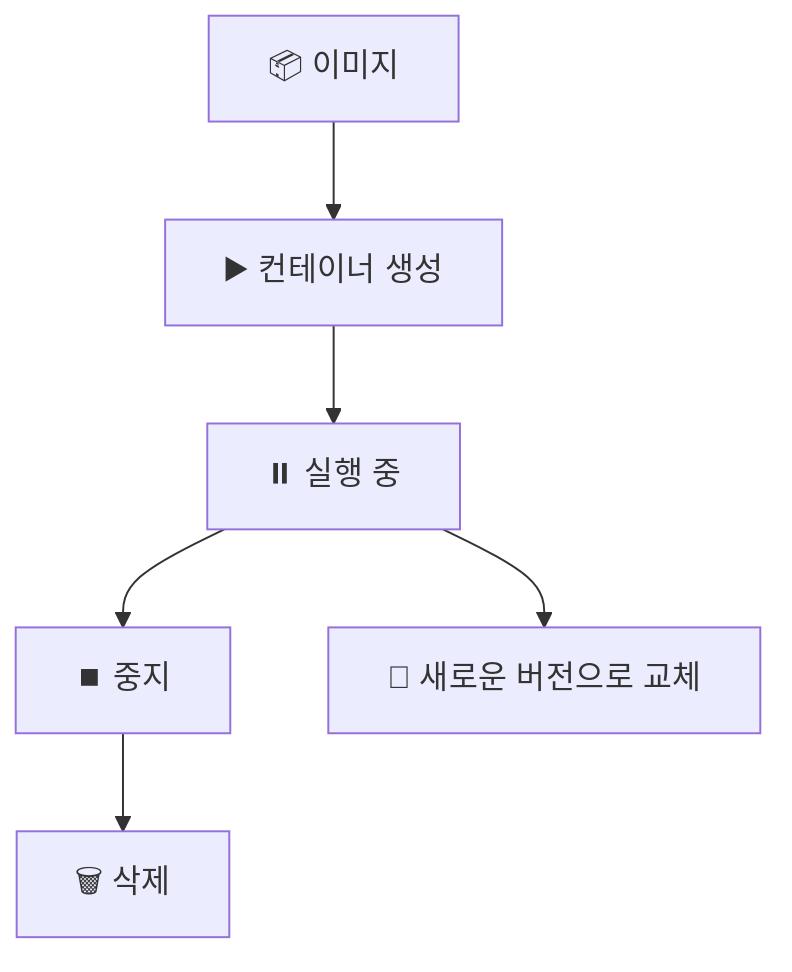

# 🐳 Docker 가상화 및 컨테이너 관리

## 1. 도커(Docker) 이해하기

### 📌 도커란?

- **도커(Docker)** 는 **프로그램을 격리해서 실행**시켜주는 도구예요.
    
- "내 컴퓨터에서는 되는데, 다른 컴퓨터에서는 안 돼!" 👉 이런 문제를 해결해줘요.
    
- **컨테이너(Container)** 라는 상자 안에 프로그램을 넣고 실행합니다.
    
- 가상머신(VM)보다 **가볍고 빠르다**는 장점이 있어요.
    

---

## 2. 가상화 vs 컨테이너





- **가상화(VM)**: 운영체제(OS)를 여러 개 띄워서 무거움.
    
- **컨테이너(Docker)**: 운영체제를 공유하므로 가볍고 빠름.
    

---

## 3. 도커의 기본 개념

- **이미지(Image)**: 프로그램을 찍어낼 수 있는 "빵틀" 같은 것.
    
- **컨테이너(Container)**: 이미지를 실행해서 만들어진 "빵" 같은 것.
    
- **도커 엔진(Docker Engine)**: 컨테이너를 만들고 실행시키는 프로그램.
    
- **도커 허브(Docker Hub)**: 전 세계 사람들이 만든 이미지를 공유하는 "앱스토어" 같은 곳.
    

---

## 4. 도커 컨테이너 생애주기




- 컨테이너는 **일회용품**처럼 쓰고 버리는 게 기본.
    
- 데이터는 **호스트 서버 디스크**에 따로 저장해두어야 안전해요.
    

---

## 5. 도커의 장점과 단점

|✅ 장점|⚠️ 단점|
|---|---|
|한 대의 서버에 여러 개 실행 가능|리눅스 프로그램만 지원|
|관리하기 쉽다|서버가 죽으면 컨테이너도 영향|
|개발환경 통일|컨테이너 1개만 쓰면 비효율|

---

## 6. 도커 기본 명령어 예시 (한 줄씩 주석 포함)


```bash
# 도커 허브에서 nginx(웹 서버) 이미지 다운로드
docker pull nginx  

# nginx 이미지를 이용해 컨테이너 실행 (이름을 myweb으로 지정)
docker run --name myweb -d -p 8080:80 nginx  

# 현재 실행 중인 컨테이너 확인
docker ps  

# 컨테이너 중지
docker stop myweb  

# 컨테이너 삭제
docker rm myweb  

# 이미지 삭제
docker rmi nginx  
```


📝 **설명**


- `docker pull nginx` → "nginx라는 빵틀을 가져온다"
    
- `docker run` → "그 빵틀로 빵(컨테이너)을 굽는다"
    
- `docker ps` → "지금 오븐에서 굽고 있는 빵들 확인"
    
- `docker stop` → "빵 굽는 거 멈추기"
    
- `docker rm` → "빵 버리기"
    
- `docker rmi` → "빵틀 버리기"
    

---

## 7. 현업에서 도커 활용 사례

- **개발 환경 통일**
    
    - 팀원 모두 같은 환경에서 개발 가능
        
    - "내 컴퓨터에서는 되는데?" 문제 해결
        
- **테스트 환경**
    
    - 새 버전 프로그램을 쉽게 테스트 가능
        
    - 예: 개발 → 테스트 → 운영 배포
        
- **마이크로서비스**
    
    - 여러 개의 작은 서버(웹, DB, API)를 컨테이너로 각각 실행
        
    - 서로 독립적이라 관리가 쉬움
        
- **CI/CD 자동화**
    
    - 깃허브 → 도커 빌드 → 서버 배포 자동화
        
    - 실무에서 **Jenkins, GitHub Actions, GitLab CI** 등과 자주 같이 씀
        

---

## 🚀 정리

- 도커는 **가볍고 빠른 가상화 기술**
    
- **이미지 → 컨테이너** 구조
    
- **현업에서는 개발환경 공유, 배포 자동화, 마이크로서비스 운영**에 필수
