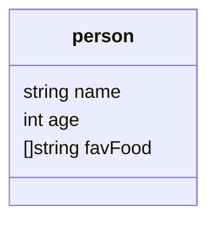

# 📘 Go 언어 Struct 정리

## 🕐 학습 타임라인

- **00:00 ~** Struct 개념 소개 (Object와 유사, Map보다 유연)
- **01:03 ~** Struct 정의 (`type person struct { ... }`)
- **01:51 ~** 값 할당 방법 #1 (순서대로 값 기입)
- **02:42 ~** 값 할당 방법 #2 (필드명 지정하여 명확히 기입)
- **03:44 ~** 혼용 불가: "순서 방식"과 "필드 지정 방식"은 동시에 사용 불가
- **04:34 ~** Go에는 Constructor 없음 (직접 초기화 필요)
- **05:35 ~** Struct 실습 프로젝트 예고 (Dictionary, Bank Account, URL Checker)
- **06:20 ~** 향후 고급 주제: Channels & Goroutines

---

## 🧩 Struct란?

- **구조체(Struct)** = 여러 자료형을 묶어 하나의 새로운 **사용자 정의 타입**을 만드는 도구
- **Map**과 달리, 필드의 타입이 고정되어 있고 이름이 명확함
- **클래스(class)**, **객체(object)** 개념이 없는 Go에서 **객체지향적 모델링**의 핵심 수단

---

## 📜 Struct 정의와 사용법

### 1. Struct 정의
```go
// person이라는 구조체 정의
type person struct {
    name    string   // 이름
    age     int      // 나이
    favFood []string // 좋아하는 음식 리스트
}
```
### 2. Struct 생성 및 초기화
방법 ① 순서대로 값 할당
```go
nico := person{"nico", 18, []string{"kimchi", "ramen"}}
```
방법 ② 필드명 지정 (가독성 ↑)
```go
nico := person{
    name:    "nico",
    age:     18,
    favFood: []string{"kimchi", "ramen"},
}
```
## ⚠️ 주의:

순서 방식과 필드명 방식은 혼용 불가!

둘 중 하나만 택해야 함.

## 📊 Mermaid 시각화


    note for person "사용자 정의 타입: name, age, favFood를 포함"
## 🏗️ Struct와 메서드
Go에서는 struct에 **메서드(method)**를 붙일 수 있음

하지만 **생성자(constructor)**는 없음 → 직접 초기화해야 함

다른 언어 대비 특징:
```
Python: __init__

JavaScript: constructor()

Go: 없음 (직접 값 넣어야 함)
```

## 🛠️ 현업에서 Struct 활용 사례

데이터 모델링

사용자(User), 주문(Order), 상품(Product) 등 도메인 개체 정의

예: 웹 서비스의 API Request/Response 모델

DB 연동 (ORM)

GORM 같은 ORM 라이브러리에서 테이블 스키마와 매핑

```go
type User struct {
    ID    uint   `gorm:"primaryKey"`
    Name  string
    Email string
}
```

JSON 직렬화/역직렬화

API 서버 개발 시 JSON ↔ Struct 변환

```go
type ApiResponse struct {
    Status  string `json:"status"`
    Message string `json:"message"`
}
```

마이크로서비스 구조

Struct를 통해 서비스 간 데이터 교환 포맷 정의

예: Kafka, gRPC 메시지 구조 설계

테스트 코드 작성

Mock 데이터 생성 시 struct 활용 → 안정적인 단위 테스트 가능

## 📌 정리
Struct는 Go 언어에서 객체지향적 모델링의 핵심

값 초기화 방식은 두 가지 → 필드명 지정 방식이 가독성 높음

Constructor 없음, 메서드는 struct에 붙일 수 있음

현업에서는 데이터 모델링, DB 매핑, JSON 처리, 마이크로서비스, 테스트에 널리 사용됨

이후 Channels & Goroutines와 결합되어 Go의 진정한 힘 발휘 🚀
