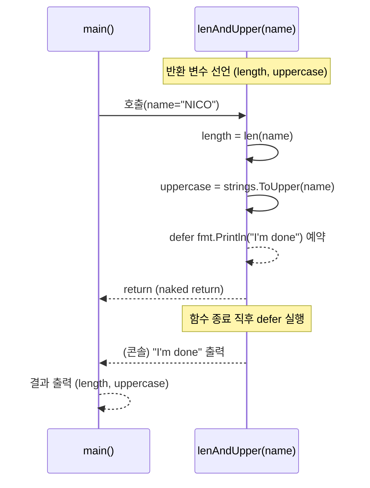

# Go 함수의 두 가지 핵심 기능: 
## naked return과 defer

Go 언어의 함수 기능 중 코드의 간결함과 안정성을 높여주는 두 가지 핵심 기능을 살펴봅니다.

naked return: 반환할 변수를 미리 선언하면 return 키워드만으로 자동 반환

defer: 함수가 종료 직전 실행할 코드를 예약

# 📌 핵심 요약 (타임스탬프)

(00:00) naked return: 함수 선언부에 반환 변수의 이름+타입을 명시하면 return만으로 자동 반환

(01:03) 반환 변수는 이미 정의되었으므로 :=가 아니라 =로 값을 업데이트해야 함

(01:50) return length, uppercase처럼 명시도 가능하지만, naked return은 간결성이 장점

(02:54) 함수가 길어질수록 무슨 값이 반환되는지 추적이 어려움 → 명시적 반환 선호하는 개발자 많음【gitconnected.com】【boldlygo.tech】

(03:40) defer: 함수 종료 직전 실행 예약. 주로 파일 닫기·로그 남기기에 활용【everythingcoding.in】【medium.com】

(04:28) 예시: "I'm done" 메시지가 함수 종료 직후 출력 → defer 실행 시점이 명확히 드러남

# 🎯 개념 한눈에 보기 (Mermaid 시각화)





📝 예제 1: naked return + defer (한 줄씩 주석)

핵심: 반환값 이름을 선언해두면 return만 써도 자동 반환,
defer는 함수 종료 직후 실행할 코드를 예약합니다.

```
package main // Go 프로그램의 진입점(메인 패키지)입니다.

import ( // 외부 패키지 불러오기
	"fmt"    // 화면에 출력할 수 있는 기능 제공
	"strings" // 문자열을 대문자로 바꾸는 등 문자열 처리 기능 제공
)

// name을 입력받아 length(길이)와 uppercase(대문자 문자열)를 반환합니다.
func lenAndUpper(name string) (length int, uppercase string) {
	// 함수가 끝난 직후 실행할 코드를 예약합니다.
	defer fmt.Println("I'm done") 

	// 반환 변수 length에 문자열 길이 저장
	length = len(name) 
	// 반환 변수 uppercase에 문자열을 대문자로 변환하여 저장
	uppercase = strings.ToUpper(name) 

	// naked return: 반환 변수 이름 생략 → 자동으로 length, uppercase 반환
	return
}

func main() {
	// lenAndUpper 호출 후 반환된 값을 변수에 저장
	totalLength, upper := lenAndUpper("NICO") 
	// 결과 출력: 4 NICO
	fmt.Println(totalLength, upper) 
}
```

📝 예제 2: 명시적 return 방식 비교 (한 줄씩 주석)

핵심: 반환값을 직접 return length, uppercase처럼 써주면
코드 읽는 사람이 어떤 값이 반환되는지 직관적으로 알 수 있습니다.

```
package main // 메인 패키지 선언: 실행 가능한 프로그램임을 의미

import ( 
	"fmt"    // 출력 기능
	"strings" // 문자열 변환 기능
)

// 반환 변수 이름은 생략, 대신 타입만 명시 (int, string)
func lenAndUpperExplicit(name string) (int, string) {
	// 함수 종료 직후 실행할 로그 예약
	defer fmt.Println("I'm done (explicit)")

	// 지역 변수 선언 후 문자열 길이 계산
	length := len(name) 
	// 지역 변수 선언 후 문자열을 대문자로 변환
	uppercase := strings.ToUpper(name) 

	// 명시적으로 어떤 값을 반환하는지 표시
	return length, uppercase
}

func main() {
	// 함수 호출 후 반환값을 변수에 저장
	l, u := lenAndUpperExplicit("NICO")
	// 결과 출력: 4 NICO
	fmt.Println(l, u)
}

```

# ⚖️ 언제 써야 할까? (실무 감각)

## ✅ naked return

장점: 코드가 짧고 간결해짐

단점: 함수가 길어지면 가독성 저하 → 팀 스타일 가이드에 따라 선택【reddit.com】【dev.to】

## ✅ defer

장점: 리소스 정리·안정성 보장

파일/DB 연결 닫기

로그 출력

네트워크 요청 종료 처리

특징: 함수가 정상 종료되든, 에러로 중간 반환되든, 심지어 panic이 나도 실행됨【stackoverflow.com】

# 📌 최종 요약

naked return: 반환값 이름을 함수 시그니처에 미리 지정 → return만으로 자동 반환

defer: 함수 종료 직전 실행할 코드를 예약 → 리소스 정리 및 후처리에 최적화

두 기능 모두 코드의 생산성과 안정성을 높이지만,

naked return은 가독성 저하 우려로 짧은 함수에만 추천

defer는 리소스 해제·정리 코드에 반드시 활용

🔗 Learn more on Glasp: https://glasp.co/reader?url=https://www.youtube.com/watch?v=O_fR4eVS_aU
