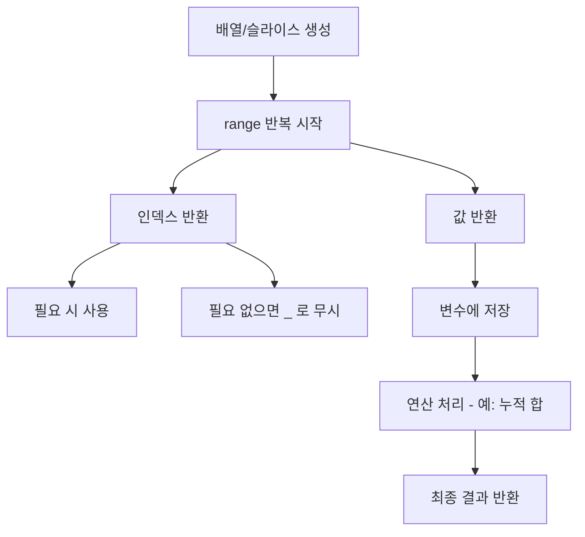

# 📘 Go 언어 반복문 정리: for, range, args

## 🚀 핵심 개념 요약

Go 언어에는 오직 for 반복문만 존재한다. (forEach, for in, for of 없음)

가변 인자(...)를 통해 여러 값을 함수에 전달할 수 있다.

range를 사용하면 배열(Array), 슬라이스(Slice), 맵(Map) 등을 순회할 수 있다.

range는 기본적으로 **인덱스(index)**와 **값(value)**를 함께 반환한다.

필요 없는 값은 _(언더스코어)를 사용해 무시할 수 있다.

for와 range 조합으로 누적 합 같은 연산을 간단히 구현할 수 있다.

## ⏱️ 타임스탬프별 설명
(00:00) 오직 for!

Go에서는 반복문이 단 하나 → for

단순하지만 강력함

(00:58) 가변 인자 활용
```
func superAdd(numbers ...int) int {
    total := 0
    for _, number := range numbers {
        total += number
    }
    return total
}
result := superAdd(1, 2, 3, 4, 5, 6)
fmt.Println(result) // 출력: 21
```


(02:00) range 사용하기

range는 배열, 슬라이스, 맵 등에서 반복 처리를 도와줌

JavaScript의 forEach와 유사

(03:06) 인덱스와 값 출력
```
numbers := []int{1, 2, 3, 4, 5, 6}
for i, v := range numbers {
    fmt.Println(i, v)
}
// 출력:
// 0 1
// 1 2
// 2 3
// ...
```
(04:14) 인덱스 무시하기
```
for _, v := range numbers {
    fmt.Println(v) // 인덱스 무시
}
```
(04:57) 누적 합 구하기
```
total := 0
for _, v := range numbers {
    total += v
}
fmt.Println(total) // 출력: 21
```

## 🔍 for & range 동작 원리



## 💡 초보자를 위한 Tip

Go 언어에서는 for 하나만 알아도 모든 반복문 구현 가능!

range는 매우 자주 쓰이는 패턴 → 인덱스와 값 모두 활용 가능

불필요한 값은 _ 처리하는 습관을 들이면 깔끔한 코드 작성 가능

배열, 슬라이스, 맵 모두 range와 궁합이 좋다

👉 다음 학습: if와 else로 조건문 배우기!
