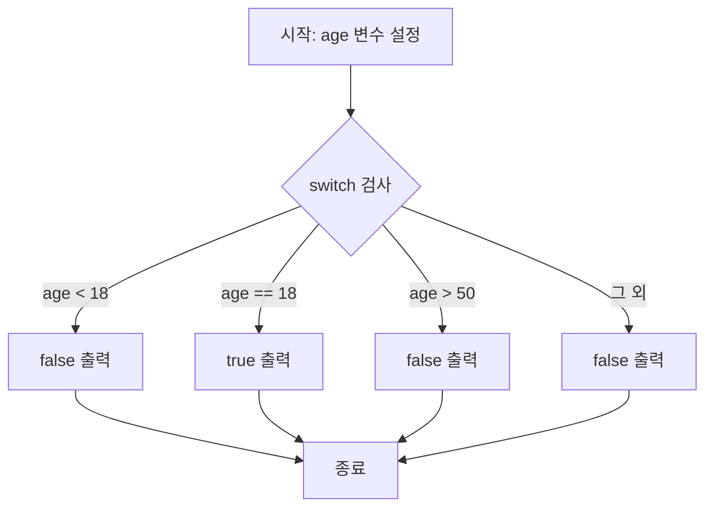

# 📘 Go 언어 강의 요약 — Switch 문 (#1 7 Switch)

이 문서는 Go 언어의 **switch 문법**을 정리한 자료입니다.  
Java, C, JavaScript, PHP에 익숙한 사람은 금방 이해할 수 있고, Python에는 없는 문법입니다.  
비전공자도 이해할 수 있도록 **한 줄씩 주석**과 함께 예제를 설명합니다.  

---

## 🎯 핵심 요약

- **(00:01)** Go에서 switch는 값을 조건별로 체크하여 결과를 반환한다.  
- **(00:54)** 여러 개의 `if-else` 문을 대체해 코드 가독성을 높인다.  
- **(01:51)** switch 바로 뒤에서 변수를 선언해 사용할 수 있다.  
- **(02:00 전후)** Go의 기본 요소(if-else, function, variables, naked return, defer 등)를 복습 완료.  
- **(02:38)** 다음 강의에서는 Go만의 고유 기능에 대해 다룬다고 예고.  

---

## 🧑‍💻 Go Switch 예제 코드

```go
package main // 패키지 이름을 정의 (Go 프로그램의 시작점은 항상 main 패키지)

// main 함수: Go 프로그램의 실행 시작 지점
func main() {
    age := 18 // 변수 age를 선언하고 18 값을 할당

    switch { // switch 문 시작
    case age < 18: // age가 18보다 작을 경우
        println("false") // 조건에 맞으면 "false" 출력
    case age == 18: // age가 정확히 18일 경우
        println("true") // 조건에 맞으면 "true" 출력
    case age > 50: // age가 50보다 클 경우
        println("false") // 조건에 맞으면 "false" 출력
    default: // 위 조건들에 해당하지 않는 경우
        println("false") // 기본적으로 "false" 출력
    }
}
```

## 📝 한 줄씩 상세 설명

| 코드 | 설명 |
|------|------|
| `package main` | Go 프로그램의 진입점을 담는 패키지 정의 |
| `func main() {` | 실행이 시작되는 main 함수 정의 |
| `age := 18` | 나이를 의미하는 변수 `age` 선언 및 값 18 할당 |
| `switch {` | switch 문 시작, 여러 조건을 순차적으로 검사 |
| `case age < 18:` | age가 18보다 작은 경우 실행될 코드 |
| `println("false")` | 결과로 `"false"` 문자열 출력 |
| `case age == 18:` | age가 18과 같은 경우 실행될 코드 |
| `println("true")` | 결과로 `"true"` 문자열 출력 |
| `case age > 50:` | age가 50보다 큰 경우 실행될 코드 |
| `println("false")` | 결과로 `"false"` 문자열 출력 |
| `default:` | 위 조건에 해당하지 않는 경우 실행 |
| `println("false")` | 결과로 `"false"` 문자열 출력 |
| `}` | switch 문 종료 |

## 🔎 Mermaid 시각화 (Switch 흐름도)



## ✅ 요약 정리
Go의 switch는 여러 if-else를 간단히 대체할 수 있는 구조이다.

특정 값에 따라 다른 결과를 출력하거나 동작하게 만들 수 있다.

switch 내에서 변수를 선언하고 즉시 활용 가능하다.

코드 가독성과 유지보수성을 크게 높여준다.
