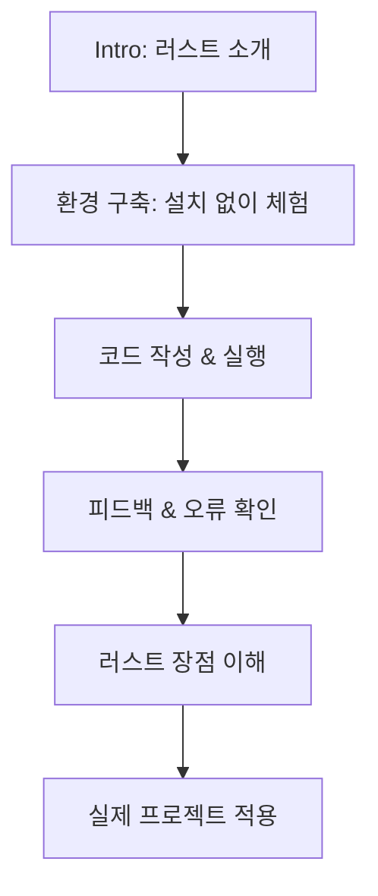

# 🌱 프로그래밍 언어 러스트를 배웁시다!
### Easy Rust in Korean: Intro (001편)

---

## 📌 영상 핵심 요약

- **(00:01)**  
  👋 강의자 소개: 1년 전 러스트 강의를 시작. 서울에서 개발자로 활동 중.

- **(00:01 ~ 01:07)**  
  📖 쉬운 영어 문장과 한국어 설명을 조합하여 누구나 쉽게 배울 수 있도록 제작.

- **(01:07)**  
  🔎 한국어 러스트 강의 자료의 부족을 지적. 유튜브에는 짧은 영상만 존재.  
  👉 본 강의는 한국어로 체계적으로 배울 수 있는 드문 자료.

- **(02:12)**  
  💻 러스트 설치 없이 웹 기반으로 코드 작성 & 실행 가능.  
  ✔ 설치 시 더 빠른 실행과 풍부한 기능 제공.

- **(03:18)**  
  🔄 코드 실행 결과 공유가 쉬움.  
  → 초보자가 피드백을 받고 학습하기 좋은 환경.

- **(04:23)**  
  ⚡ 러스트 언어의 핵심 장점  
  - **빠른 성능** (C/C++ 수준)  
  - **높은 안전성** (메모리 에러 방지)

- **(05:28)**  
  ✅ 강력한 컴파일러: 잘못된 코드와 타입 오류를 빠르게 잡아줌.  
  → 초보자가 실수하면서도 올바르게 학습할 수 있음.

- **(마무리)**  
  🏢 러스트 재단과 다양한 기업이 러스트를 채택 중.  
  앞으로가 기대되는 언어이며, 다음 영상부터 본격적인 튜토리얼 진행 예정.

---

## 🎯 러스트 언어 특징 정리

- **안전성(Safety):** 메모리 관리 오류를 방지.
- **성능(Performance):** C/C++에 버금가는 속도.
- **동시성(Concurrency):** 안전한 멀티스레드 프로그래밍 지원.
- **컴파일 타임 검사:** 잘못된 코드 실행 전 오류 감지.

---

## 📊 학습 구조 (Mermaid 다이어그램)

## 🌟 초보자에게 전하는 메시지

러스트는 배우기 까다로울 수 있지만, **"빠르면서 안전하다"**는 강력한 매력을 지닌 언어입니다.

본 강의는 설치 없이도 쉽게 실습할 수 있으니 부담 없이 따라오기만 해도 됩니다.

꾸준히 따라가면 어느새 안정적이고 성능 좋은 프로그램을 만들 수 있게 될 거예요 🚀
