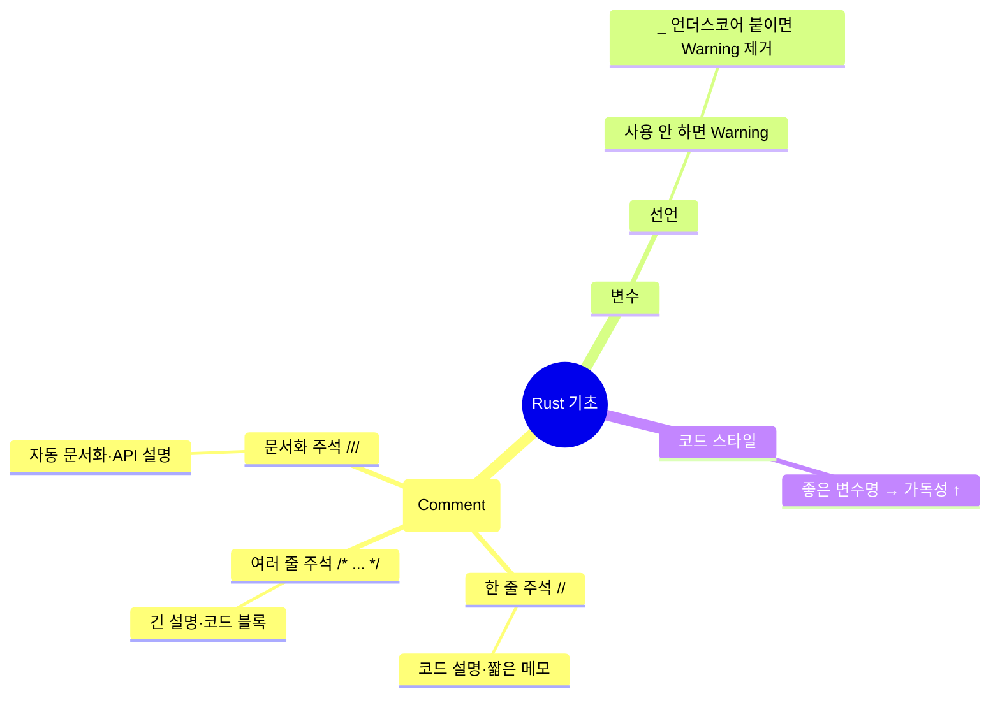

# 🦀 Rust 기초 강의 정리 - 주석(Comment)과 변수 경고 처리

---

## 📌 핵심 요약

- **주석(Comment)**  
  - `//` → 한 줄 주석 (간단한 설명에 사용)  
  - `/* ... */` → 여러 줄 주석 (긴 설명이나 코드 블록 문서화에 사용)  
  - 주석은 실행되지 않고, **사람이 읽을 수 있는 설명**으로만 존재  

- **변수 관련 경고**
  - 변수를 선언했지만 사용하지 않으면 **경고(warning)** 발생  
  - 필요 없다면 변수명 앞에 `_`를 붙여 경고를 없앨 수 있음  
  - 예:  
    ```rust
    let _x = 5; // _를 붙이면 사용하지 않아도 경고가 사라짐
    ```

- **경고 무시하기**
  - 러스트는 매우 친절해서 작은 문제도 알려줌  
  - 하지만 초보자라면 경고를 무시하지 말고, 왜 생겼는지 이해하는 것이 중요  

- **코드 가독성**
  - 변수 이름은 의미 있는 단어를 사용할 것  
  - 한국어 변수명도 가능하지만, 협업 시 영어 변수명이 더 일반적임  

---

## 📊 흐름 이해 (Mermaid 다이어그램)




💻 코드 예제 (라인별 주석 설명)
// 프로그램의 진입점: main 함수
```
fn main() {
    // let 키워드로 변수 x 선언 (값은 5)
    // 하지만 이 변수는 사용하지 않았기 때문에 warning 발생
    let x = 5;

    // 변수명 앞에 '_'를 붙여서 선언
    // 사용하지 않아도 warning이 발생하지 않음
    let _y = 10;

    // 한 줄 주석 예시: "Hello, world!"를 출력
    println!("Hello, world!"); 

    /* 
       여러 줄 주석 예시:
       - 아래 println은 "Rust 배우기"라는 문장을 출력함
       - 실제 코드 실행과는 무관하게 설명만 달 수 있음
    */
    println!("Rust 배우기");
}
```

```
fn main() {
    // x라는 변수를 선언하고 5라는 값을 저장
    let x = 5;

    /* 
       여러 줄 주석:
       y 변수를 선언하고 10을 저장.
       이 주석은 여러 줄에 걸쳐 설명할 때 유용.
    */
    let y = 10;

    /// 문서화 주석:
    /// add 함수는 두 숫자를 더한 결과를 반환합니다.
    /// # 예시
    /// ```
    /// let result = add(2, 3);
    /// assert_eq!(result, 5);
    /// ```
    fn add(a: i32, b: i32) -> i32 {
        a + b
    }

    // println! 매크로로 결과 출력
    println!("x + y = {}", add(x, y));
}
```

🌟 초보자를 위한 팁

주석은 "다른 개발자(또는 미래의 나)"에게 설명하는 메모장 같은 것.

러스트의 경고 시스템은 "더 안전하고 깔끔한 코드"를 만드는 데 도움을 줌.

처음에는 불편할 수 있지만, 이 습관 덕분에 오류 없는 코드를 작성할 수 있음.

코드를 작성할 때는 항상 가독성 있는 변수명을 사용하세요.


// : 짧은 메모 → 코드 옆에 설명 남길 때 사용

/* ... */ : 긴 설명 → 여러 줄 막을 때 사용

/// : 문서화 주석 → 함수나 라이브러리 설명 (자동 문서 생성 가능)

👉 Rust에서는 단순 주석(//)과 문서화 주석(///)을 구분해서 쓰는 습관이 중요합니다.
👉 특히 협업 시 ///를 잘 활용하면 API 문서가 자동으로 생성되어 개발 효율이 높아집니다.
