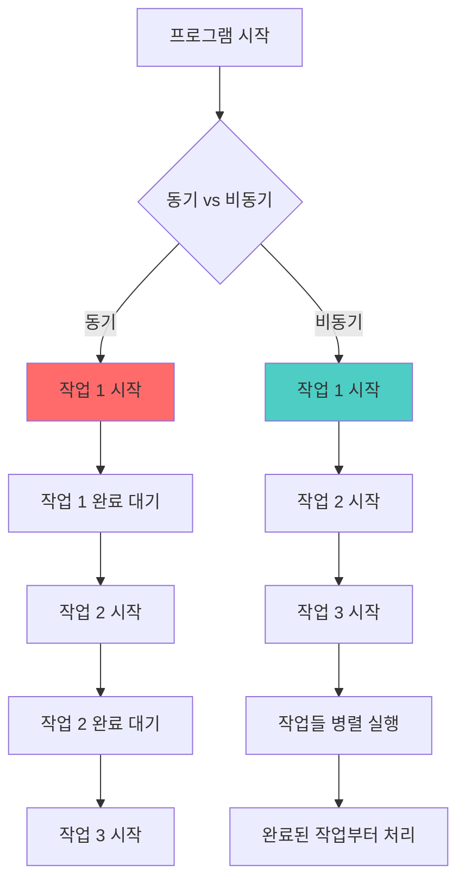
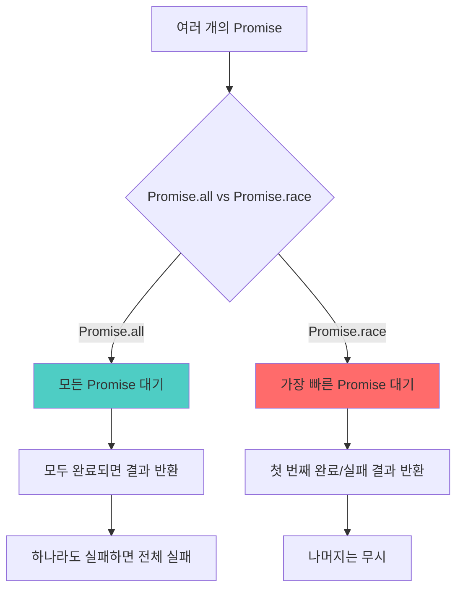

# 비동기 프로그래밍 완전 가이드 🚀

## 목차
1. [비동기 프로그래밍이란?](#비동기-프로그래밍이란)
2. [동기 vs 비동기](#동기-vs-비동기)
3. [JavaScript 비동기 처리 방법](#javascript-비동기-처리-방법)
4. [실습 예제](#실습-예제)
5. [고급 패턴](#고급-패턴)

---

## 비동기 프로그래밍이란?

**비동기(Asynchronous) 프로그래밍**은 작업이 완료될 때까지 기다리지 않고, 다른 작업을 동시에 수행할 수 있도록 하는 프로그래밍 방식입니다.

### 🔄 실생활 예시
- **동기적 상황**: 은행에서 번호표를 뽑고 차례를 기다리는 것
- **비동기적 상황**: 온라인으로 주문하고 배송을 기다리면서 다른 일을 하는 것

---

## 동기 vs 비동기



### 동기 처리의 특징
- 한 번에 하나의 작업만 수행
- 이전 작업이 완료될 때까지 대기
- 단순하고 이해하기 쉬움
- 시간이 오래 걸릴 수 있음

### 비동기 처리의 특징
- 여러 작업을 동시에 수행 가능
- 대기 시간을 다른 작업으로 활용
- 복잡하지만 효율적
- 사용자 경험 향상

---

## JavaScript 비동기 처리 방법

### 1. Callback (콜백)

```javascript
// 🍕 피자 주문 예제 - 콜백 방식

// 피자를 주문하는 함수 (시간이 걸리는 작업)
function orderPizza(callback) {
    console.log("🍕 피자 주문 중...");
    
    // 3초 후에 피자가 준비됨 (비동기 작업 시뮬레이션)
    setTimeout(() => {
        const pizza = "맛있는 페퍼로니 피자";
        console.log("🍕 피자 준비 완료!");
        callback(pizza); // 피자가 준비되면 콜백 함수 호출
    }, 3000);
}

// 피자를 받아서 먹는 함수
function eatPizza(pizza) {
    console.log(`😋 ${pizza}를 맛있게 먹습니다!`);
}

// 사용법
console.log("🏠 집에서 피자를 주문합니다");
orderPizza(eatPizza); // eatPizza 함수를 콜백으로 전달
console.log("📺 피자를 기다리면서 TV를 봅니다"); // 피자를 기다리는 동안 다른 일을 함
```

#### 콜백 지옥(Callback Hell)
```javascript
// ❌ 나쁜 예: 콜백이 중첩되면서 복잡해짐

getUserData(function(user) {
    getOrderHistory(user.id, function(orders) {
        getOrderDetails(orders[0].id, function(details) {
            updateUI(details, function(result) {
                console.log("모든 작업 완료");
            });
        });
    });
});
```

### 2. Promise (프로미스)

```javascript
// 🎁 선물 준비 예제 - Promise 방식

// 선물을 준비하는 함수 (Promise 반환)
function prepareGift() {
    console.log("🎁 선물 준비 시작...");
    
    return new Promise((resolve, reject) => {
        // resolve: 성공했을 때 호출하는 함수
        // reject: 실패했을 때 호출하는 함수
        
        setTimeout(() => {
            const random = Math.random();
            
            if (random > 0.3) {
                // 70% 확률로 성공
                resolve("✨ 멋진 선물");
            } else {
                // 30% 확률로 실패
                reject("💸 돈이 부족합니다");
            }
        }, 2000);
    });
}

// Promise 사용법
console.log("🏠 선물 준비를 시작합니다");

prepareGift()
    .then((gift) => {
        // 성공했을 때 실행되는 코드
        console.log(`🎉 ${gift}을 준비했습니다!`);
        return "선물 포장 완료"; // 다음 then으로 전달할 값
    })
    .then((message) => {
        console.log(`📦 ${message}`);
    })
    .catch((error) => {
        // 실패했을 때 실행되는 코드
        console.log(`😢 선물 준비 실패: ${error}`);
    })
    .finally(() => {
        // 성공/실패 관계없이 항상 실행되는 코드
        console.log("🔚 선물 준비 작업 종료");
    });

console.log("📱 선물을 준비하는 동안 다른 일을 합니다");
```

### 3. Async/Await (가장 최신 방식)

```javascript
// 🏪 쇼핑 예제 - Async/Await 방식

// 상품을 검색하는 함수
async function searchProduct(productName) {
    console.log(`🔍 ${productName} 검색 중...`);
    
    // Promise를 반환하는 가상의 API 호출
    return new Promise((resolve) => {
        setTimeout(() => {
            resolve({
                name: productName,
                price: Math.floor(Math.random() * 50000) + 10000,
                stock: Math.floor(Math.random() * 100) + 1
            });
        }, 1000);
    });
}

// 장바구니에 추가하는 함수
async function addToCart(product) {
    console.log(`🛒 ${product.name}을 장바구니에 추가 중...`);
    
    return new Promise((resolve) => {
        setTimeout(() => {
            resolve(`${product.name}이 장바구니에 추가되었습니다`);
        }, 500);
    });
}

// 결제하는 함수
async function processPayment(amount) {
    console.log(`💳 ${amount}원 결제 중...`);
    
    return new Promise((resolve, reject) => {
        setTimeout(() => {
            if (Math.random() > 0.2) {
                resolve("결제 완료!");
            } else {
                reject("결제 실패: 카드 한도 초과");
            }
        }, 1500);
    });
}

// 🌟 메인 쇼핑 함수 - async/await 사용
async function doShopping() {
    try {
        console.log("🛍️ 온라인 쇼핑을 시작합니다");
        
        // 1단계: 상품 검색 (비동기 작업 1)
        const product = await searchProduct("노트북");
        console.log(`✅ 상품 발견: ${product.name} - ${product.price}원`);
        
        // 2단계: 장바구니 추가 (비동기 작업 2)
        const cartMessage = await addToCart(product);
        console.log(`✅ ${cartMessage}`);
        
        // 3단계: 결제 (비동기 작업 3)
        const paymentResult = await processPayment(product.price);
        console.log(`✅ ${paymentResult}`);
        
        console.log("🎉 쇼핑 완료!");
        
    } catch (error) {
        // 어느 단계에서든 오류가 발생하면 여기서 처리
        console.log(`❌ 쇼핑 중 오류 발생: ${error}`);
    }
}

// 쇼핑 시작!
doShopping();
console.log("📱 쇼핑하는 동안 다른 앱을 사용할 수 있습니다");
```

---

## 실습 예제: 날씨 정보 가져오기

```javascript
// 🌤️ 날씨 API 예제

// 가상의 날씨 API를 호출하는 함수
async function fetchWeather(city) {
    console.log(`🌍 ${city}의 날씨 정보를 가져오는 중...`);
    
    // 실제로는 fetch() 함수나 axios 라이브러리를 사용합니다
    return new Promise((resolve, reject) => {
        setTimeout(() => {
            const weather = {
                city: city,
                temperature: Math.floor(Math.random() * 30) + 5,
                condition: ["맑음", "흐림", "비", "눈"][Math.floor(Math.random() * 4)],
                humidity: Math.floor(Math.random() * 50) + 30
            };
            
            if (Math.random() > 0.1) {
                resolve(weather); // 90% 확률로 성공
            } else {
                reject("네트워크 오류가 발생했습니다"); // 10% 확률로 실패
            }
        }, Math.random() * 2000 + 500); // 0.5~2.5초 랜덤 지연
    });
}

// 여러 도시의 날씨를 동시에 가져오는 함수
async function getMultipleWeather() {
    const cities = ["서울", "부산", "대구", "인천"];
    
    try {
        console.log("🌤️ 여러 도시의 날씨 정보를 동시에 가져옵니다");
        
        // Promise.all: 모든 Promise가 완료될 때까지 기다림
        const weatherPromises = cities.map(city => fetchWeather(city));
        const weatherData = await Promise.all(weatherPromises);
        
        console.log("\n📊 날씨 정보 결과:");
        weatherData.forEach(weather => {
            console.log(`${weather.city}: ${weather.temperature}°C, ${weather.condition}, 습도 ${weather.humidity}%`);
        });
        
    } catch (error) {
        console.log(`❌ 날씨 정보 가져오기 실패: ${error}`);
    }
}

// 실행
getMultipleWeather();
```

---

## 고급 패턴

### Promise.all vs Promise.race



```javascript
// 🏃‍♂️ Promise.race 예제 - 가장 빠른 응답 사용

async function fastestResponse() {
    const server1 = fetch('https://api1.example.com/data');
    const server2 = fetch('https://api2.example.com/data');
    const server3 = fetch('https://api3.example.com/data');
    
    try {
        // 가장 빠른 서버의 응답을 사용
        const fastestResult = await Promise.race([server1, server2, server3]);
        console.log("가장 빠른 서버 응답:", fastestResult);
    } catch (error) {
        console.log("모든 서버에서 오류 발생:", error);
    }
}
```

### 에러 처리 패턴

```javascript
// 🛡️ 견고한 에러 처리 예제

async function robustDataFetching() {
    const maxRetries = 3; // 최대 재시도 횟수
    let retries = 0;
    
    while (retries < maxRetries) {
        try {
            console.log(`📡 데이터 가져오기 시도 ${retries + 1}/${maxRetries}`);
            
            const data = await fetchImportantData();
            console.log("✅ 데이터 가져오기 성공:", data);
            return data;
            
        } catch (error) {
            retries++;
            console.log(`❌ 시도 ${retries} 실패:`, error.message);
            
            if (retries >= maxRetries) {
                console.log("🚨 최대 재시도 횟수 초과. 작업 중단.");
                throw new Error("데이터 가져오기 최종 실패");
            }
            
            // 재시도 전 잠시 대기 (백오프 전략)
            const waitTime = retries * 1000; // 1초, 2초, 3초...
            console.log(`⏳ ${waitTime}ms 후 재시도...`);
            await new Promise(resolve => setTimeout(resolve, waitTime));
        }
    }
}

// 가상의 데이터 가져오기 함수 (실패 확률 포함)
async function fetchImportantData() {
    return new Promise((resolve, reject) => {
        setTimeout(() => {
            if (Math.random() > 0.6) { // 40% 확률로 성공
                resolve({ id: 1, message: "중요한 데이터" });
            } else {
                reject(new Error("네트워크 연결 불안정"));
            }
        }, 1000);
    });
}
```

---

## 🎯 핵심 정리

### 언제 무엇을 사용할까?

1. **Callback**: 간단한 일회성 비동기 작업
2. **Promise**: 체이닝이 필요한 복잡한 비동기 작업
3. **Async/Await**: 가독성이 중요한 현대적 비동기 처리 (👍 추천)

### 비동기 프로그래밍의 장점
- ⚡ **성능 향상**: 여러 작업을 동시에 처리
- 🎯 **사용자 경험**: 응답성 있는 애플리케이션
- 🔧 **효율성**: CPU와 네트워크 리소스 최적 활용

### 주의사항
- 🐛 **디버깅 어려움**: 실행 순서가 예측하기 어려움
- 🔄 **복잡성 증가**: 동기 코드보다 복잡한 구조
- ⚠️ **에러 처리**: 적절한 에러 처리가 중요

---

## 다음 단계

1. **실습**: 간단한 비동기 함수 만들어보기
2. **API 연동**: 실제 웹 API와 연동해보기
3. **라이브러리 학습**: axios, fetch 등 HTTP 클라이언트 사용법
4. **고급 패턴**: RxJS, 상태 관리 라이브러리 등

---

*이 문서는 비동기 프로그래밍의 기초부터 실무 패턴까지 다루는 완전 가이드입니다. 궁금한 점이 있으면 언제든 문의해주세요! 🚀*
