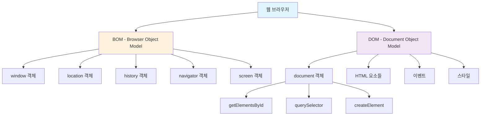
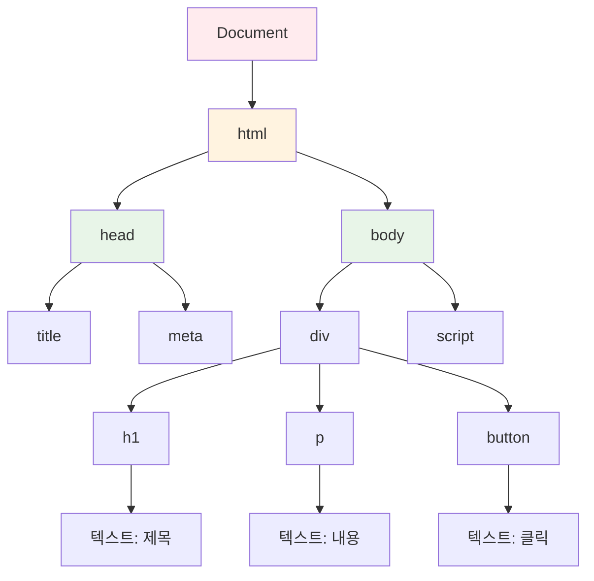
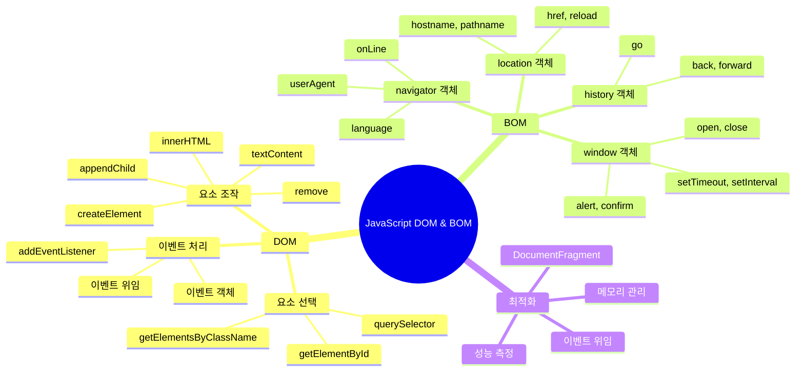
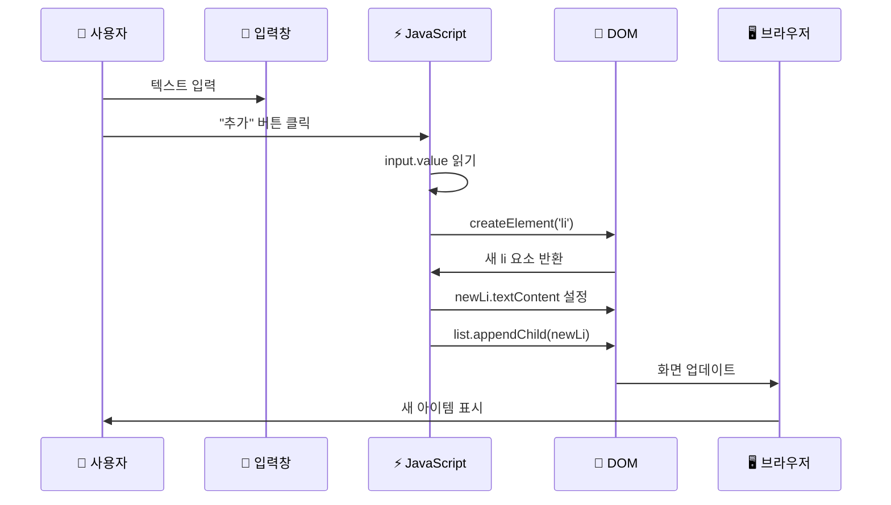
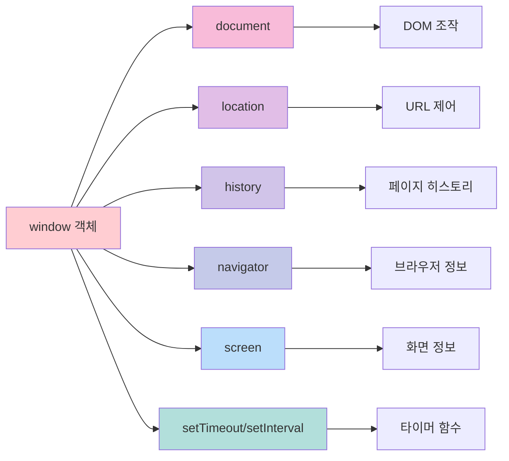

# JavaScript DOM & BOM 완벽 가이드 📚

## 목차
1. [DOM과 BOM 개념 이해](#1-dom과-bom-개념-이해)
2. [DOM 구조와 작동 원리](#2-dom-구조와-작동-원리)
3. [DOM 조작 실습](#3-dom-조작-실습)
4. [BOM 개념과 활용](#4-bom-개념과-활용)

---

## 1. DOM과 BOM 개념 이해

### DOM (Document Object Model)이란? 🌳
- **문서 객체 모델**: HTML과 XML 문서를 프로그래밍 언어로 조작할 수 있게 해주는 인터페이스
- 웹 페이지의 **구조화된 표현**을 제공하여 JavaScript가 HTML 요소들을 찾고, 변경하고, 삭제할 수 있게 함
- 문서를 **트리 구조**로 표현하여 각 요소에 접근 가능

### BOM (Browser Object Model)이란? 🌐
- **브라우저 객체 모델**: 브라우저의 창(window)과 관련된 객체들을 제어하는 모델
- 브라우저의 **창, 탭, 주소창, 히스토리** 등을 JavaScript로 제어
- DOM과 달리 **표준이 없어** 브라우저마다 조금씩 다름



### DOM vs BOM 주요 차이점

| 구분 | DOM | BOM |
|------|-----|-----|
| **정의** | 문서 객체 모델 | 브라우저 객체 모델 |
| **주 객체** | `document` | `window` |
| **담당 영역** | HTML 문서 내용 | 브라우저 창과 환경 |
| **표준화** | W3C 표준 존재 | 표준 없음 (브라우저마다 차이) |
| **주요 기능** | 요소 추가/삭제/수정 | 새 창 열기, 주소 변경, 알림 |

---

## 2. DOM 구조와 작동 원리

### DOM 트리 구조 🌲



### DOM 조작의 핵심 메서드들

```javascript
// 1. 요소 선택하기 (Finding Elements)
const element = document.getElementById('myId');        // ID로 찾기
const elements = document.getElementsByClassName('myClass'); // 클래스로 찾기
const element2 = document.querySelector('#myId');      // CSS 선택자로 찾기
const elements2 = document.querySelectorAll('.myClass'); // CSS 선택자로 모두 찾기

// 2. 요소 생성하기 (Creating Elements)
const newDiv = document.createElement('div');          // 새로운 div 요소 생성
newDiv.textContent = '새로운 내용';                    // 텍스트 내용 설정
newDiv.className = 'new-class';                        // 클래스 설정

// 3. 요소 추가하기 (Adding Elements)
parentElement.appendChild(newDiv);                     // 마지막 자식으로 추가
parentElement.insertBefore(newDiv, referenceElement); // 특정 위치에 추가

// 4. 요소 삭제하기 (Removing Elements)
element.remove();                                      // 요소 자체를 삭제
parentElement.removeChild(childElement);              // 자식 요소 삭제
```

---

## 3. DOM 조작 실습

### 동적 요소 추가/삭제 예제 분석

다음은 실습 파일에서 가져온 핵심 코드입니다:

```html
<!DOCTYPE html>
<html lang="ko">
<head>
    <meta charset="UTF-8">
    <title>요소 추가 및 삭제 실습</title>
    <style>
        /* 스타일링 코드 - 사용자 인터페이스를 예쁘게 만들기 위함 */
        body { 
            font-family: sans-serif;  /* 글꼴을 산세리프로 설정 */
            padding: 20px;            /* 바깥쪽 여백 20픽셀 */
        }
        .container { 
            max-width: 500px;         /* 최대 너비 500픽셀 */
            margin: auto;             /* 가운데 정렬 */
            border: 1px solid #ccc;   /* 회색 테두리 */
            padding: 25px;            /* 안쪽 여백 25픽셀 */
            border-radius: 8px;       /* 모서리 둥글게 */
        }
        .controls { 
            display: flex;            /* 플렉스 레이아웃 사용 */
            gap: 10px;               /* 요소 간 간격 10픽셀 */
            margin-bottom: 20px;     /* 아래쪽 여백 20픽셀 */
        }
        #item-input { 
            flex-grow: 1;            /* 남은 공간을 모두 차지 */
            padding: 10px;           /* 안쪽 여백 10픽셀 */
            border: 1px solid #ddd;  /* 연한 회색 테두리 */
        }
        button { 
            padding: 10px 15px;      /* 위아래 10px, 좌우 15px 여백 */
            border: none;            /* 테두리 없음 */
            color: white;            /* 텍스트 색상 흰색 */
            cursor: pointer;         /* 마우스 오버 시 포인터 커서 */
            border-radius: 5px;      /* 모서리 둥글게 */
        }
        #add-btn { background-color: dodgerblue; }      /* 추가 버튼 파란색 */
        #remove-first-btn { background-color: orange; } /* 첫 삭제 버튼 주황색 */
        #remove-last-btn { background-color: crimson; } /* 마지막 삭제 버튼 빨간색 */
        
        #item-list li { 
            padding: 10px;                    /* 각 리스트 아이템 여백 */
            border-bottom: 1px solid #eee;    /* 아래쪽 구분선 */
        }
        #item-list li:first-child { 
            font-weight: bold;                /* 첫 번째 아이템 굵게 */
            color: green;                     /* 첫 번째 아이템 초록색 */
        }
        #item-list li:last-child { 
            font-weight: bold;                /* 마지막 아이템 굵게 */
            color: red;                       /* 마지막 아이템 빨간색 */
        }
    </style>
</head>
<body>
    <div class="container">
        <h1>동적 요소 추가 및 삭제</h1>
        
        <!-- 사용자 입력을 받는 컨트롤 영역 -->
        <div class="controls">
            <input type="text" id="item-input" placeholder="추가할 아이템 내용 입력...">
            <button id="add-btn">추가</button>
        </div>
        
        <!-- 삭제 버튼들 -->
        <div>
            <button id="remove-first-btn">첫 아이템 삭제</button>
            <button id="remove-last-btn">마지막 아이템 삭제</button>
        </div>
        
        <!-- 아이템들이 표시될 리스트 -->
        <ul id="item-list">
            <li>(기본 아이템)</li>
        </ul>
    </div>

    <script>
        /* ========================================================================
         * 🎯 DOM 요소 동적 제어 (생성, 추가, 삭제)
         * ========================================================================
         * 
         * JavaScript의 가장 강력한 기능 중 하나는 HTML 문서를 실시간으로 변경하는 것입니다.
         * 'createElement'로 새 요소를 만들고, 'appendChild'로 문서에 추가하며,
         * 'remove'로 기존 요소를 제거하여 사용자와 상호작용하는 동적인 페이지를 만들 수 있습니다.
         */

        // --- 1단계: 조작에 필요한 HTML 요소들 미리 선택하기 ---
        const list = document.getElementById('item-list');           // 아이템들이 들어갈 ul 요소
        const itemInput = document.getElementById('item-input');     // 사용자 입력을 받을 input 요소
        const addBtn = document.getElementById('add-btn');           // 추가 기능: 모든 아이템 삭제 버튼
const clearAllBtn = document.createElement('button');
clearAllBtn.textContent = '모든 아이템 삭제';
clearAllBtn.style.backgroundColor = '#d32f2f';
clearAllBtn.style.color = 'white';
clearAllBtn.style.border = 'none';
clearAllBtn.style.padding = '10px 15px';
clearAllBtn.style.borderRadius = '5px';
clearAllBtn.style.cursor = 'pointer';
clearAllBtn.style.marginTop = '10px';
clearAllBtn.style.marginRight = '10px';

clearAllBtn.addEventListener('click', () => {
    if (itemCount === 0) {
        alert('삭제할 아이템이 없습니다.');
        return;
    }
    
    const shouldDelete = confirm(`정말로 모든 아이템(${itemCount}개)을 삭제하시겠습니까?\n이 작업은 되돌릴 수 없습니다.`);
    if (shouldDelete) {
        // 모든 자식 요소 제거
        while (list.firstChild) {
            list.removeChild(list.firstChild);
        }
        updateItemCount();
        
        // BOM 활용: 페이지 새로고침 여부 묻기
        setTimeout(() => {
            const shouldRefresh = confirm('모든 아이템이 삭제되었습니다. 페이지를 새로고침하시겠습니까?');
            if (shouldRefresh) {
                location.reload(); // 페이지 새로고침 (BOM 사용)
            }
        }, 500);
    }
});

// 현재 URL 정보 표시 버튼 (BOM 활용 예제)
const showInfoBtn = document.createElement('button');
showInfoBtn.textContent = '페이지 정보 보기';
showInfoBtn.style.backgroundColor = '#1976d2';
showInfoBtn.style.color = 'white';
showInfoBtn.style.border = 'none';
showInfoBtn.style.padding = '10px 15px';
showInfoBtn.style.borderRadius = '5px';
showInfoBtn.style.cursor = 'pointer';
showInfoBtn.style.marginTop = '10px';

showInfoBtn.addEventListener('click', () => {
    // BOM의 여러 객체들을 활용하여 정보 수집
    const pageInfo = `
📄 페이지 정보:
• URL: ${location.href}
• 도메인: ${location.hostname}
• 경로: ${location.pathname}
• 프로토콜: ${location.protocol}

🖥️ 브라우저 정보:
• 사용자 에이전트: ${navigator.userAgent}
• 언어: ${navigator.language}
• 플랫폼: ${navigator.platform}
• 온라인 상태: ${navigator.onLine ? '연결됨' : '연결 안됨'}

🖱️ 화면 정보:
• 화면 크기: ${screen.width} × ${screen.height}
• 사용 가능 크기: ${screen.availWidth} × ${screen.availHeight}
• 브라우저 창 크기: ${window.innerWidth} × ${window.innerHeight}

⏰ 현재 시간: ${new Date().toLocaleString('ko-KR')}
    `;
    
    alert(pageInfo);
});

// 버튼들을 컨테이너에 추가
const buttonContainer = document.querySelector('.container');
buttonContainer.appendChild(clearAllBtn);
buttonContainer.appendChild(showInfoBtn);

// 키보드 단축키 추가 (BOM의 이벤트 활용)
document.addEventListener('keydown', (event) => {
    // Ctrl + A: 아이템 추가에 포커스
    if (event.ctrlKey && event.key === 'a') {
        event.preventDefault(); // 기본 "모두 선택" 동작 방지
        itemInput.focus();
        itemInput.select(); // 입력창 내용 모두 선택
    }
    
    // Ctrl + D: 모든 아이템 삭제
    if (event.ctrlKey && event.key === 'd') {
        event.preventDefault(); // 기본 "북마크 추가" 동작 방지
        clearAllBtn.click();
    }
    
    // F1: 도움말 표시
    if (event.key === 'F1') {
        event.preventDefault();
        const helpText = `
🔥 단축키 도움말:

• Enter: 아이템 추가
• Ctrl + A: 입력창에 포커스
• Ctrl + D: 모든 아이템 삭제
• F1: 이 도움말 표시
• F5: 페이지 새로고침

💡 사용 팁:
• 입력창에 텍스트를 입력하고 Enter를 누르면 빠르게 추가됩니다.
• 각 아이템 옆의 ❌ 버튼으로 개별 삭제가 가능합니다.
• 같은 내용의 아이템을 추가하려 하면 확인 메시지가 나타납니다.
        `;
        alert(helpText);
    }
});

// 페이지 떠날 때 확인 (사용자가 실수로 페이지를 닫는 것을 방지)
window.addEventListener('beforeunload', (event) => {
    if (itemCount > 1) { // 기본 아이템 외에 추가된 아이템이 있으면
        event.preventDefault();
        event.returnValue = ''; // Chrome에서 필요
        return ''; // 다른 브라우저에서 필요
    }
});

// 초기 개수 설정
updateItemCount();

/* 
 * 🎓 학습 포인트 정리:
 * 
 * 1. DOM 조작:
 *    - createElement(): 새 요소 생성
 *    - appendChild(): 요소 추가
 *    - remove(), removeChild(): 요소 삭제
 *    - textContent, innerHTML: 내용 설정
 *    - style 속성: 스타일 동적 변경
 * 
 * 2. BOM 활용:
 *    - window.alert(), confirm(), prompt(): 사용자 상호작용
 *    - location: URL 정보 및 페이지 이동
 *    - navigator: 브라우저 정보
 *    - screen: 화면 정보
 *    - setTimeout(), setInterval(): 타이머 함수
 * 
 * 3. 이벤트 처리:
 *    - addEventListener(): 이벤트 리스너 등록
 *    - 키보드 이벤트, 마우스 이벤트
 *    - event.preventDefault(): 기본 동작 방지
 *    - event.stopPropagation(): 이벤트 버블링 방지
 * 
 * 4. 프로그래밍 패턴:
 *    - 함수 분리를 통한 코드 재사용성
 *    - 입력 검증 및 오류 처리
 *    - 사용자 경험 개선 (확인 메시지, 단축키 등)
 */
```

---

## 6. 고급 활용 예제

### 실시간 시계 만들기 (DOM + BOM 종합)

```javascript
/*
 * 🕐 실시간 시계 만들기 예제
 * DOM 조작과 BOM의 타이머 함수를 조합한 실용적인 예제
 */

// 시계를 표시할 요소 생성
const clockContainer = document.createElement('div');
clockContainer.style.cssText = `
    position: fixed;
    top: 20px;
    right: 20px;
    background: linear-gradient(135deg, #667eea 0%, #764ba2 100%);
    color: white;
    padding: 15px 20px;
    border-radius: 10px;
    font-family: 'Courier New', monospace;
    font-size: 18px;
    font-weight: bold;
    box-shadow: 0 4px 15px rgba(0,0,0,0.3);
    z-index: 1000;
`;

// body에 시계 추가
document.body.appendChild(clockContainer);

// 시간 업데이트 함수
function updateClock() {
    const now = new Date();
    
    const year = now.getFullYear();
    const month = String(now.getMonth() + 1).padStart(2, '0');
    const date = String(now.getDate()).padStart(2, '0');
    const hours = String(now.getHours()).padStart(2, '0');
    const minutes = String(now.getMinutes()).padStart(2, '0');
    const seconds = String(now.getSeconds()).padStart(2, '0');
    
    const timeString = `${year}-${month}-${date}<br>${hours}:${minutes}:${seconds}`;
    clockContainer.innerHTML = timeString;
}

// 1초마다 시계 업데이트
setInterval(updateClock, 1000);
updateClock(); // 즉시 한 번 실행
```

### 로컬 스토리지 활용 예제

```javascript
/*
 * 💾 로컬 스토리지를 활용한 데이터 저장
 * (주의: Claude.ai 환경에서는 localStorage가 지원되지 않으므로 
 *  실제 웹 환경에서만 동작합니다)
 */

// 실제 웹 환경에서 사용할 수 있는 코드 예제:
/*
// 아이템들을 로컬 스토리지에 저장하는 함수
function saveItemsToStorage() {
    const items = Array.from(list.children).map(li => 
        li.textContent.replace('❌', '').trim()
    );
    localStorage.setItem('todoItems', JSON.stringify(items));
}

// 로컬 스토리지에서 아이템들을 불러오는 함수
function loadItemsFromStorage() {
    const saved = localStorage.getItem('todoItems');
    if (saved) {
        const items = JSON.parse(saved);
        items.forEach(itemText => {
            if (itemText) {
                const newLi = document.createElement('li');
                newLi.textContent = itemText;
                // 삭제 버튼 추가 로직...
                list.appendChild(newLi);
            }
        });
        updateItemCount();
    }
}

// 페이지 로드 시 저장된 아이템들 불러오기
window.addEventListener('load', loadItemsFromStorage);

// 아이템 추가/삭제 시마다 저장
// (기존 addItem 함수와 삭제 함수들에 saveItemsToStorage() 추가)
*/

// 메모리 기반 저장소 (localStorage 대체용)
let memoryStorage = {
    data: {},
    setItem: function(key, value) {
        this.data[key] = value;
    },
    getItem: function(key) {
        return this.data[key] || null;
    },
    removeItem: function(key) {
        delete this.data[key];
    },
    clear: function() {
        this.data = {};
    }
};

// 메모리 저장소를 활용한 아이템 저장/불러오기
function saveItemsToMemory() {
    const items = Array.from(list.children).map(li => 
        li.textContent.replace('❌', '').trim()
    );
    memoryStorage.setItem('todoItems', JSON.stringify(items));
    console.log('아이템들이 메모리에 저장되었습니다:', items);
}

function loadItemsFromMemory() {
    const saved = memoryStorage.getItem('todoItems');
    if (saved) {
        const items = JSON.parse(saved);
        console.log('메모리에서 아이템들을 불러왔습니다:', items);
        return items;
    }
    return [];
}
```

---

## 7. 성능 최적화 팁

### DOM 조작 최적화

```javascript
/*
 * 🚀 성능 최적화 팁들
 */

// ❌ 나쁜 예: 반복문에서 DOM을 여러 번 조작
function addMultipleItemsBad(items) {
    items.forEach(item => {
        const li = document.createElement('li');
        li.textContent = item;
        list.appendChild(li); // 매번 DOM 업데이트 발생
    });
}

// ✅ 좋은 예: DocumentFragment 사용으로 성능 개선
function addMultipleItemsGood(items) {
    const fragment = document.createDocumentFragment();
    
    items.forEach(item => {
        const li = document.createElement('li');
        li.textContent = item;
        fragment.appendChild(li); // 메모리상에서만 작업
    });
    
    list.appendChild(fragment); // 한 번에 DOM 업데이트
}

// 사용 예제
const sampleItems = ['아이템 1', '아이템 2', '아이템 3', '아이템 4', '아이템 5'];
addMultipleItemsGood(sampleItems);
```

### 이벤트 위임 (Event Delegation)

```javascript
/*
 * 🎯 이벤트 위임을 통한 성능 개선
 * 각 아이템마다 이벤트 리스너를 추가하는 대신,
 * 부모 요소에 하나의 리스너만 추가하여 관리
 */

// 부모 요소(list)에 이벤트 리스너 등록
list.addEventListener('click', (event) => {
    // 클릭된 요소가 삭제 버튼인지 확인
    if (event.target.textContent === '❌') {
        const listItem = event.target.parentElement;
        const itemText = listItem.textContent.replace('❌', '').trim();
        
        const shouldDelete = confirm(`"${itemText}"을(를) 삭제하시겠습니까?`);
        if (shouldDelete) {
            listItem.remove();
            updateItemCount();
            saveItemsToMemory(); // 메모리에 저장
        }
    }
});
```

---

## 8. 디버깅과 문제 해결

### 자주 발생하는 오류들

```javascript
/*
 * 🐛 자주 발생하는 오류들과 해결 방법
 */

// 1. null 참조 오류
// ❌ 문제: 요소를 찾지 못했을 때
const element = document.getElementById('nonExistentId');
element.textContent = '텍스트'; // TypeError: Cannot set property 'textContent' of null

// ✅ 해결: 요소 존재 여부 확인
const element = document.getElementById('someId');
if (element) {
    element.textContent = '텍스트';
} else {
    console.error('요소를 찾을 수 없습니다: someId');
}

// 2. 타이밍 문제
// ❌ 문제: DOM이 로드되기 전에 접근
document.getElementById('myElement').textContent = 'Hello'; // null 오류 가능

// ✅ 해결: DOM 로드 완료 후 실행
document.addEventListener('DOMContentLoaded', () => {
    document.getElementById('myElement').textContent = 'Hello';
});

// 또는 window.onload 사용
window.addEventListener('load', () => {
    // 모든 리소스(이미지, 스타일시트 등)가 로드된 후 실행
    document.getElementById('myElement').textContent = 'Hello';
});

// 3. 이벤트 리스너 중복 등록 방지
function setupEventListener() {
    // ❌ 문제: 함수가 여러 번 호출되면 이벤트 리스너가 중복 등록됨
    button.addEventListener('click', handleClick);
    
    // ✅ 해결: 기존 리스너 제거 후 새로 등록
    button.removeEventListener('click', handleClick);
    button.addEventListener('click', handleClick);
}

// 4. 메모리 누수 방지
let timer;

function startTimer() {
    // 기존 타이머가 있다면 정리
    if (timer) {
        clearInterval(timer);
    }
    
    timer = setInterval(() => {
        console.log('타이머 실행 중...');
    }, 1000);
}

function stopTimer() {
    if (timer) {
        clearInterval(timer);
        timer = null;
    }
}

// 페이지를 떠날 때 정리
window.addEventListener('beforeunload', () => {
    stopTimer();
});
```

### 디버깅 도구 활용

```javascript
/*
 * 🔍 디버깅에 유용한 기법들
 */

// 1. console 객체 활용
console.log('일반 로그:', variable);           // 일반 정보
console.warn('경고 메시지:', warning);         // 경고
console.error('에러 메시지:', error);          // 에러
console.table(array);                         // 배열/객체를 표 형태로 출력
console.time('성능측정');                     // 성능 측정 시작
// ... 측정하고 싶은 코드 ...
console.timeEnd('성능측정');                  // 성능 측정 종료

// 2. 요소 검사
function inspectElement(element) {
    console.group('요소 정보:');
    console.log('태그명:', element.tagName);
    console.log('ID:', element.id);
    console.log('클래스:', element.className);
    console.log('내용:', element.textContent);
    console.log('스타일:', window.getComputedStyle(element));
    console.log('부모:', element.parentElement);
    console.log('자식들:', element.children);
    console.groupEnd();
}

// 3. DOM 트리 시각화
function visualizeDOMTree(element, depth = 0) {
    const indent = '  '.repeat(depth);
    console.log(`${indent}${element.tagName}${element.id ? '#' + element.id : ''}${element.className ? '.' + element.className.replace(' ', '.') : ''}`);
    
    Array.from(element.children).forEach(child => {
        visualizeDOMTree(child, depth + 1);
    });
}

// 사용 예: visualizeDOMTree(document.body);
```

---

## 9. 마무리 및 추가 학습 자료

### 핵심 요약



### 다음 단계 학습 주제

1. **ES6+ 문법과 DOM**
   - Arrow Functions와 이벤트 처리
   - Template Literals와 HTML 생성
   - Destructuring과 요소 속성 관리

2. **고급 DOM 조작**
   - Shadow DOM
   - Custom Elements
   - Web Components

3. **비동기 프로그래밍과 DOM**
   - Fetch API와 동적 콘텐츠 로딩
   - Promise/async-await와 DOM 조작
   - 무한 스크롤, 지연 로딩

4. **성능 최적화**
   - Virtual DOM 개념
   - Intersection Observer API
   - 메모리 프로파일링

### 연습 문제

1. **초급**: 간단한 할 일 목록 만들기
2. **중급**: 드래그 앤 드롭으로 순서 변경 가능한 목록
3. **고급**: 무한 스크롤이 있는 이미지 갤러리
4. **심화**: 단일 페이지 애플리케이션(SPA) 라우터 구현

### 유용한 참고 자료

- [MDN Web Docs - DOM](https://developer.mozilla.org/ko/docs/Web/API/Document_Object_Model)
- [MDN Web Docs - BOM](https://developer.mozilla.org/ko/docs/Web/API/Window)
- [JavaScript.info - DOM 조작](https://ko.javascript.info/dom-nodes)
- [웹 접근성 가이드라인](https://www.w3.org/WAI/WCAG21/quickref/)

---

> 💡 **학습 팁**: DOM과 BOM은 실습을 통해 익히는 것이 가장 효과적입니다. 작은 프로젝트부터 시작하여 점진적으로 복잡한 기능을 추가해보세요!

---

*이 가이드는 2025년 8월 25일 기준으로 작성되었습니다. 
웹 표준은 지속적으로 발전하므로 최신 정보는 공식 문서를 참조하시기 바랍니다.* 버튼

```
const removeFirstBtn = document.getElementById('remove-first-btn'); // 첫 아이템 삭제 버튼
        const removeLastBtn = document.getElementById('remove-last-btn');   // 마지막 아이템 삭제 버튼

        // --- 2단계: '추가' 버튼에 클릭 이벤트 설정 ---
        addBtn.addEventListener('click', () => {
            // 사용자가 입력한 텍스트를 가져오고 앞뒤 공백을 제거
            const newItemText = itemInput.value.trim();
            
            // 입력값이 비어있지 않은 경우에만 아이템을 추가
            if (newItemText !== '') {
                /* 💡 Part 1: document.createElement('태그이름')으로 요소 생성하기
                 * - 메모리상에 지정된 태그(예: 'li', 'div')의 새로운 HTML 요소 객체를 만듭니다.
                 * - 이 단계에서는 아직 화면에 보이지 않습니다. (재료만 준비한 상태)
                 */
                const newLi = document.createElement('li');  // 새로운 li 요소 생성
                
                // 생성된 요소에 내용(textContent)을 채워 넣습니다.
                newLi.textContent = newItemText;
                
                /* 💡 Part 2: 부모요소.appendChild(자식요소)로 DOM에 추가하기
                 * - 생성된 요소(newLi)를 부모 요소(list)의 마지막 자식으로 추가합니다.
                 * - 이 코드가 실행되는 순간, 새로운 요소가 화면에 나타납니다. (준비한 재료를 조립)
                 */
                list.appendChild(newLi);
                
                // 사용자 편의를 위해 입력창을 비우고 다시 포커스를 줍니다.
                itemInput.value = '';      // 입력창 내용 지우기
                itemInput.focus();         // 입력창에 다시 포커스 주기
            } else {
                // 입력값이 없으면 사용자에게 알림
                alert('추가할 아이템의 내용을 입력해주세요!');
            }
        });

        // 입력창에서 Enter 키를 눌렀을 때도 추가 버튼이 클릭되도록 처리
        itemInput.addEventListener('keyup', (event) => {
            if (event.key === 'Enter') {   // Enter 키가 눌렸다면
                addBtn.click();            // 추가 버튼 클릭 이벤트 실행
            }
        });

        /* 💡 Part 3: 요소.remove()로 DOM에서 삭제하기
         * - 선택된 요소를 DOM 트리에서 완전히 제거합니다.
         * - 사용이 간편하고 직관적입니다.
         */

        // --- 3단계: '첫 아이템 삭제' 버튼에 클릭 이벤트 설정 ---
        removeFirstBtn.addEventListener('click', () => {
            // list.firstElementChild: list의 첫 번째 자식 요소를 선택합니다.
            const firstItem = list.firstElementChild;
            
            if (firstItem) {           // 첫 번째 자식이 존재하면
                firstItem.remove();    // 제거합니다.
            } else {
                alert('삭제할 아이템이 없습니다.');
            }
        });

        // --- 4단계: '마지막 아이템 삭제' 버튼에 클릭 이벤트 설정 ---
        removeLastBtn.addEventListener('click', () => {
            // list.lastElementChild: list의 마지막 자식 요소를 선택합니다.
            const lastItem = list.lastElementChild;
            
            if (lastItem) {            // 마지막 자식이 존재하면
                lastItem.remove();     // 제거합니다.
            } else {
                alert('삭제할 아이템이 없습니다.');
            }
        });
    </script>
</body>
</html>
```

### DOM 조작 과정 시각화



---

## 4. BOM 개념과 활용

### BOM의 주요 객체들



### BOM 활용 예제

```javascript
// 1. window 객체 - 브라우저 창 제어
window.alert('안녕하세요!');                    // 경고창 표시
window.confirm('정말로 삭제하시겠습니까?');       // 확인창 표시
const userInput = window.prompt('이름을 입력하세요:'); // 입력창 표시

// 새 창 열기
const newWindow = window.open(
    'https://www.google.com',  // URL
    '_blank',                  // 창 이름 (_blank는 새 탭)
    'width=800,height=600'     // 창 옵션
);

// 2. location 객체 - 현재 페이지 URL 정보와 제어
console.log(location.href);     // 현재 페이지의 전체 URL
console.log(location.hostname); // 도메인 이름 (예: www.google.com)
console.log(location.pathname); // 경로 부분 (예: /search)
console.log(location.search);   // 쿼리 문자열 (예: ?q=javascript)

// 페이지 이동
location.href = 'https://www.naver.com';        // 새 페이지로 이동
location.reload();                              // 페이지 새로고침
location.replace('https://www.daum.net');       // 히스토리 없이 페이지 교체

// 3. history 객체 - 브라우저 히스토리 제어
history.back();          // 뒤로 가기 (브라우저 뒤로 가기 버튼과 같음)
history.forward();       // 앞으로 가기
history.go(-2);          // 2단계 뒤로 가기
history.go(1);           // 1단계 앞으로 가기

// 4. navigator 객체 - 브라우저 정보
console.log(navigator.userAgent);    // 브라우저 정보 문자열
console.log(navigator.language);     // 브라우저 언어 (예: ko-KR)
console.log(navigator.platform);     // 운영체제 정보
console.log(navigator.onLine);       // 인터넷 연결 상태 (true/false)

// 5. screen 객체 - 사용자 화면 정보
console.log(screen.width);           // 화면 너비 (픽셀)
console.log(screen.height);          // 화면 높이 (픽셀)
console.log(screen.availWidth);      // 사용 가능한 화면 너비
console.log(screen.availHeight);     // 사용 가능한 화면 높이

// 6. 타이머 함수들
// setTimeout: 일정 시간 후 한 번 실행
const timeoutId = setTimeout(() => {
    console.log('3초 후에 실행됩니다!');
}, 3000); // 3000ms = 3초

// setInterval: 일정 시간마다 반복 실행
const intervalId = setInterval(() => {
    console.log('2초마다 반복 실행됩니다!');
}, 2000); // 2000ms = 2초

// 타이머 취소
clearTimeout(timeoutId);   // setTimeout 취소
clearInterval(intervalId); // setInterval 취소
```

---
